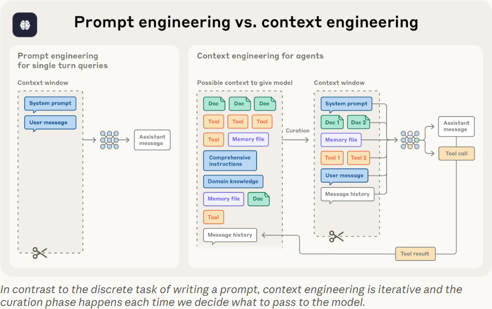

[OpenAI Cookbook](https://cookbook.openai.com/)  
[Prompt Engineering Guide](https://www.promptingguide.ai/)  
[Prompt Engineering Guide](https://learnprompting.org/docs/introduction)  
[Five proven prompt engineering techniques](https://www.lennysnewsletter.com/p/five-proven-prompt-engineering-techniques)  
[]()  
[]()  
[llm-course](https://github.com/mlabonne/llm-course)  
[]()  
[**vibekanban**](https://www.vibekanban.com/)  
> Vibe Kanban lets you run coding agents in parallel without conflicts, and perform code review through our diff tool. Now you can focus on planning and quality instead of watching terminal logs.
[]()  
[]()  
[]()  
[gemini-cli](https://github.com/google-gemini/gemini-cli)  
[Gemini CLI documentation](https://geminicli.com/docs/)  
[]()  
[]()  
[cursor commands](https://github.com/hamzafer/cursor-commands)  
[cursor rules](https://cursor.com/cn/docs/context/rules)  
[slasm commands](https://cursor.com/cn/docs/cli/reference/slash-commands)  
[Speed Up Your Agents with Cursor Slash Commands](https://egghead.io/speed-up-your-agents-with-cursor-slash-commands~ze5ag)  
[awesome-cursorrules](https://github.com/PatrickJS/awesome-cursorrules/tree/main)  
[awesome-cursor-rules-mdc](https://github.com/sanjeed5/awesome-cursor-rules-mdc/tree/main)  
[agent-best-practices](https://cursor.com/cn/blog/agent-best-practices)  
[trigger.dev](https://github.com/triggerdotdev/trigger.dev)  
[How to write great Cursor Rules](https://trigger.dev/blog/cursor-rules)  
[Mastering Cursor Rules: A Developer's Guide to Smart AI Integration](https://dev.to/dpaluy/mastering-cursor-rules-a-developers-guide-to-smart-ai-integration-1k65)  
[]()  
[]()  
[]()  
[]()  


## Coding Platform
[Cursor](https://cursor.com/home)  
[Claude](https://claude.ai/)  
[Qoder](https://qoder.com/)  

### Cursor
[How I use Cursor](https://www.builder.io/blog/cursor-tips)  
[cursor.directory](https://cursor.directory/)  
[Rules](https://docs.cursor.com/en/context/rules)  
[]()  
[agent modes](https://cursor.com/cn/docs/agent/modes)  
- Agent
   复杂功能、重构
   自主探索、多文件编辑
- Ask
   学习、规划、提问
   只读探索，无自动修改
- Plan
   需要规划的复杂功能
   在执行前创建详细计划，并提出澄清性问题
- Debug
   棘手 Bug、回归问题
   生成假设、日志埋点、运行时分析
```shortcuts
Settings
    Ctrl + Shift + j
```

## skill
[skill creator](https://github.com/moltbot/moltbot/blob/main/skills/skill-creator/SKILL.md)  
> The open agent skills tool - npx skills
[skills](https://github.com/vercel-labs/skills)  
> The Open Agent Skills Ecosystem
[skills](https://skills.sh/)  
[antigravity-awesome-skills](https://github.com/sickn33/antigravity-awesome-skills)  
[moltbot skills](https://github.com/moltbot/moltbot/tree/main/skills)  
[]()  
[]()  
[]()  
[]()  

## Prompt tips
```
请以Markdown格式回答以下问题，并将整个回复内容放在一个标记为 markdown的代码块中
Use markdown format to answer: TOPIC, make sure to put the whole response into a code block marked in markdown format.
Use markdown format to answer: TOPIC, make sure to put the whole response into a ```markdown  code block.
```
[AI Prompt Library](https://library.maastrichtuniversity.nl/apps-tools/ai-prompt-library/)  
[Claude Prompt Library](https://platform.claude.com/docs/en/resources/prompt-library/library)  
[Learning supported by AI prompts](https://library.maastrichtuniversity.nl/apps-tools/ai-prompt-library/learning-supported-by-ai-prompts/)  
[Prompt Library](https://www.moreusefulthings.com/prompts)  
[snackprompt](https://snackprompt.com/)  
[Learning Prompt](https://learningprompt.wiki/)  
[aishort](https://www.aishort.top/)  
[]()  
[]()  
[]()  


## Online
[ChatGPT](https://chatgpt.com/)  
[Grok](https://grok.com/)  
[KiMi](https://kimi.moonshot.cn/)  
[Gmini](https://gemini.google.com/app)  
[NoteBookLM](https://notebooklm.google.com/)  
[DeepSeek](https://chat.deepseek.com/)  
[hix.ai/](https://hix.ai/)  
[Ithy](https://ithy.com/)  
[字节豆包](https://www.doubao.com/chat/)  
[腾讯元宝](https://yuanbao.tencent.com/chat/)  
[阿里通义](https://tongyi.aliyun.com/qianwen/)  


  

## Context Engineering
- what is Context engineering
   the set of strategies for curating and maintaining the optimal set of tokens (information) during LLM inference, including all the other information that may land there outside of the prompts.

### Context
- What is context
   the set of tokens included when sampling from a large-language model (LLM)

### Engineering
- engineering problem
   optimizing the utility of those tokens against the inherent constraints of LLMs in order to consistently achieve a desired outcome

## Skills
[skills](https://github.com/anthropics/skills)  
[Equipping agents for the real world with Agent Skills](https://www.anthropic.com/engineering/equipping-agents-for-the-real-world-with-agent-skills)  
[Skills explained: How Skills compares to prompts, Projects, MCP, and subagents](https://claude.com/blog/skills-explained)  
[skill-creator](https://skillsmp.com/skills/langgenius-dify-agents-skills-skill-creator-skill-md)  
[]()  
[]()  
- What Skills were designed for
   delivering specialized context on demand without permanent overhead.

- A skill is
   a document (often markdown) containing instructions, constraints, and domain knowledge, stored in a designated directory that Claude can access through simple file-reading tools.

- Mental model
   skills are prompts and contextual resources that activate on demand, providing specialized guidance for specific task types without incurring permanent context overhead.

[Learn The Art of Prompting](https://www.learnprompt.org/)  
[A Comprehensive Guide to Using ChatGPT Prompts for Coding Tasks](https://www.learnprompt.org/chat-gpt-prompts-for-coding/)  
[Unleashing ChatGPT for Programmers](https://www.learnprompt.org/chatgpt-prompts-for-programmers/)  
[Prompts for Code Generation, Debugging, Optimization, and More](https://www.learnprompt.org/chatgpt-prompts-for-developers/)  
[My Top 17 ChatGPT Prompts for Coding](https://www.fullstackfoundations.com/blog/chatgpt-prompts-for-coding#chatgpt-prompts-for-learning-to-code)  
[DEV ChatGPT Prompts](https://github.com/PickleBoxer/dev-chatgpt-prompts)  
[awesome-chatgpt-prompts](https://github.com/f/awesome-chatgpt-prompts)  
[280+ ChatGPT Prompts & How to Write Your Own](https://writesonic.com/blog/chatgpt-prompts)  
[Check These 100 Powerful ChatGPT Prompts For Every Situation](https://growthtribe.io/blog/chatgpt-prompts/)  
[500+ Best Prompts for ChatGPT](https://www.godofprompt.ai/blog/500-best-prompts-for-chatgpt-2024?srsltid=AfmBOorDz97w7PxISB5pLqsCH1hYRaXwd7yqJdi-pBhu8a8UBRZD66mA)  
[]()  
[]()  


[LLM 应用开发实践笔记](https://aitutor.liduos.com/)  
[面向开发者的大模型手册](https://datawhalechina.github.io/llm-cookbook/#/)  

## Prompt
  

### [任务分解: 输入 + 输出 + 过程](./prompt/input_output_process.md)  
- 输入
- 输出
- 过程
   - 步骤1
      针对步骤中可能造成的不确定性通过指定工具或者通过描述进行限制(例如:必须使用xxx工具进行xxx),并指定输出内容保存到指定文件，方便后续步骤进行使用
   - 步骤2
      可以利用之前步骤生成的文件进行进一步加工处理，和步骤1类似，可以指定特定工具防止不确定性(例如：必须使用curl命令进行下载)，以及文件的保存路径(例如:逐一下载图片到resources/ 文件夹)
   - 步骤3
      如果生成的结构比较复杂，可以通过指定文件内容的链接进行引用(例如:article中的图片链接指向resources/ 文件夹)

- 如何让 AI 拥有长期记忆
   如果任务本身过于复杂(例如有几十个步骤需要处理), 上下文里的噪音就越多，回答就越容易出现幻觉，解决思路: 让 AI 学会记笔记，即通过给 AI 设计一个专属工作笔记，让 AI 在执行流程中不断的进行更新，例如在提示器的最顶上增加一条总规则，并在具体的步骤中添加约束, 要求 AI 必须更新状态

   步骤0: 生成笔记
      - 仿照例子和当前任务生成笔记 progress.md

   - 步骤2
      - 把图片链接写入 progress.md 图片下载进度
      ...
      - 每下载完成一个图片, 必须更新图片下载进度

[]()  
[]()  
```
ConfD 配置事务 (commit)
        │
        ▼
┌─────────────────────────────────────────┐
│  Work 结构体 (工作列表)                  │
│  ┌─────────┐                            │
│  │ w->list │──► Witem ──► Witem ──► nil │
│  └─────────┘    (变更1)   (变更2)        │
└─────────────────────────────────────────┘

ASCII Art Diagram（ASCII 艺术图）或 Text-based Diagram（纯文本图表）

名称	                            说明
ASCII Flow Chart	                ASCII 流程图 - 展示流程和步骤
ASCII Box Diagram	                ASCII 方框图 - 用方框表示组件
ASCII Data Structure Diagram	    ASCII 数据结构图 - 展示链表、树等结构
ASCII Architecture Diagram	        ASCII 架构图 - 展示系统组件关系

ASCII Art 中文对齐问题：
推荐做法
    对于技术文档，最简单的方案是：
    1. 纯英文 绘制 ASCII 图
    2. 图下方 用普通文字添加中文说明

示例:
┌─────────────────────────────────────────┐
│  Work Structure (worklist)              │
│  ┌─────────┐                            │
│  │ w->list │──► Witem ──► Witem ──► nil │
│  └─────────┘    (item1)   (item2)       │
└─────────────────────────────────────────┘

说明：Work 是工作结构体，包含一个 Witem 链表，
每个 Witem 代表一个配置变更项。
```
- 核心原则 (5W1H + R)
```
| 原则                          | 含义               | 说明              |
| -------------------------    | ----------         | --------------- |
| **1. What – 主题明确**        | 告诉我你想要什么    | 模糊的问题 → 模糊的答案   |
| **2. Why – 目的清晰**         | 让我知道用途或目标  | 我能据此调整深度与角度     |
| **3. Who – 目标受众**         | 面向谁解释          | 不同受众→不同语言和细节    |
| **4. How – 风格/形式**        | 希望输出什么形式    | 列表？总结？教学？代码？报告？ |
| **5. Scope – 范围限定**       | 要多深、多长、多专业 | 控制回答粒度和复杂度      |
| **6. Restriction – 约束条件** | 指定语气、风格、格式 | 避免啰嗦或跑题         |
```
### TIPS
Socratic Questioning: ->"Act as a Socratic tutor and help me understand the concept of [topic]. Ask me questions to guide my understanding."
苏格拉底式提问：->"请扮演苏格拉底式的导师，通过提问引导我理解[主题]概念。"

Multi-Level Explanations: ->"Explain [concept] to me as if I’m a child, then a high schooler, and finally an academic."
多层级解释：->"请用小学生、中学生和学者能理解的不同表述方式，为我解释[概念]。"

Practice Questions: ->"Create practice questions for me on [topic] at beginner, intermediate, and advanced levels."
分级练习题：->"请围绕[主题]设计初级、中级和高级三个难度的练习题。"

Summarizing and Comparing: ->"Summarize this paper and list the key concepts. Then compare it to my summary and identify any gaps."
摘要对比分析：->"请总结这篇论文的核心概念，并与我的总结对比，指出遗漏之处。"

Key Terms and Categories: ->"Give me a list of 20 key terms in this paper and break them into five categories."
术语分类归纳：->"请列出本文的20个关键术语，并将其归纳为五个类别。"

Bloom’s Taxonomy Challenges: ->"Create a set of challenges for me to apply Bloom’s taxonomy (remember, understand, apply, analyze, evaluate, create) to [topic]." Analogies and 
布鲁姆分类法实践：->"请根据布鲁姆分类法（记忆、理解、应用、分析、评估、创造）设计一套关于[主题]的实践挑战。"

Real-Life Examples: ->"Provide analogies and real-life examples to help me understand [concept]."
类比迁移教学：->"请通过类比和生活实例帮助我理解[概念]。"


示例:
请用苏格拉底式提问，通过提问引导我理解linux的启动过程，提问过程中的每次对话记录上一次的上下文

- 示例
```
如何高效的利用cursor学习linux 3.2内核源码,给出具体的学习建议和步骤，例如先从哪个简单的模块入手比较好

分析arch/x86/kernel/syscall_table_32.S中的系统调用表结构，列出前10个系统调用的名称和对应的处理函数

跟踪sys_getpid系统调用的完整执行路径：
1. 用户态调用入口
2. 陷入内核的机制
3. 实际处理函数
4. 返回用户态的过程

解释task_struct结构体中的主要字段含义

分析进程调度器如何选择下一个运行进程

画出Linux 3.2的内存管理架构图

分析伙伴系统的工作原理

解释VFS层的四个主要对象关系

提问模板："分析[文件名]中的[函数名]函数：
1. 函数的主要功能
2. 输入参数说明
3. 返回值含义
4. 调用关系图"

提问模板："在[模块名]中，为我创建5个关键数据结构的记忆卡片（字段名+说明）"

如果我要在Linux 3.2中添加一个简单的系统调用，
需要修改哪些文件？给出具体代码示例

# 1. 生成调用图
"为__schedule函数生成函数调用关系图"

# 2. 对比分析
"比较Linux 3.2与最新内核在内存管理方面的主要差异"

# 3. 漏洞分析
"分析CVE-2012-0056漏洞的成因和修复方案"

```

- 结构化提问模板
```
[角色设定] 你现在是...
[任务目标] 我希望你...
[内容范围] 请解释/分析/生成关于...
[输出形式] 输出应包括...
[风格要求] 风格要...
[限制条件] 不要... / 避免...

好 Prompt = 角色 + 任务 + 目标 + 范围 + 格式 + 风格

例子:
你是一名资深软件工程师。
请用教学风格解释“操作系统内核的线程调度机制”，
面向大学计算机系学生。
输出包含：调度原理、算法对比、优缺点分析。
使用Markdown小标题和图示结构。
字数控制在800字以内。
```

- 示例
```
普通提问
    什么是区块链？

优化提问（结构化版本）
    你现在是一名区块链领域的技术讲师。
    请以系统化、分层结构的方式讲解“什么是区块链”，
    目标读者是有编程基础的工程师。
    输出包含：①定义 ②数据结构 ③共识机制 ④安全原理 ⑤应用场景。
    每部分使用小标题和简要示例。
    风格要技术向、逻辑清晰、无营销口吻。
```

- 不同场景下的 Prompt 示例
```
| 目标               | 优化提问模板                                              |
| --------------     | --------------------------------------------------- |
| 📘 **学习概念**    | “请像我是一名新手程序员一样解释[概念]，用类比和例子说明原理，最后总结3个关键点。”         |
| 💻 **代码讲解**    | “请逐行解释下面的C代码，说明每一行的作用和背后的语言机制。”                     |
| 🧪 **调试或错误分析** | “以下是我在编译C程序时的错误信息。请分析原因并给出解决步骤。假设我的环境是Linux + gcc。” |
| 📑 **总结报告**    | “请把下面内容总结为技术报告，包含摘要、问题分析、解决方案、结论四部分。”               |
| 💬 **写作改进**    | “请帮我改进下面的段落，使其更简洁专业，保持原意，风格偏技术文档。”                  |

```

- 进阶技巧
```
角色设定法（Role prompting）
    “你是一名资深C语言编译器工程师”

分步推理法（Step-by-step prompting）
    “请先解释基本原理，再分析实现，再总结优缺点。”

迭代优化法（Refinement prompting）
    第一次提问后，说“请简化成要点版”或“请补充代码实例”

结构控制法
明确输出格式，例如：
用markdown格式输出，包含：
1. 定义
2. 原理
3. 示例
4. 总结


避免歧义词
避免“讲详细一点”“帮我优化”这种模糊表达，
改为“请在解释中增加底层原理与代码实现示例”。
```

- 技术学习类好提示词的5大原则 (LAYER模型)
```
| 原则                     | 含义             | 示例                   |
| ----------------------   | ---------       | -------------------- |
| **L — Level (层次)**     | 指定讲解深度     | “假设我已经懂C语言，但不了解内核原理” |
| **A — Audience (受众)**  | 告诉我你是谁     | “面向有编程经验的工程师”        |
| **Y — Yield (产出)**     | 明确输出形式     | “请输出结构化讲解，包含示例和图解”   |
| **E — Explain (讲解方式)** | 控制讲解风格    | “请像在课堂上教学一样分步骤讲解”    |
| **R — Refine (优化)**    | 给出约束与改进要求 | “语言简洁，使用类比，不超过800字”  |
```

- 模板
```
你是一名[技术领域]的资深工程师兼讲师。
请系统化讲解[技术主题]。
假设读者是[目标受众]，已有[相关知识背景]。
讲解内容应包含：
1. 基本概念和定义
2. 内部工作原理（分步骤说明）
3. 常见应用或示例
4. 可能的陷阱或误区
5. 简短总结（3–5行）

输出要求：
- 使用 Markdown 格式，带标题与小节
- 语言清晰、结构分明
- 既有理论又有实践角度


示例1：学习网络协议
你是一名计算机网络讲师。
请系统讲解 TCP三次握手的全过程，假设我已经了解IP层的概念。
输出应包含：
1. 三次握手每一步的报文内容和目的
2. 为什么是三次而不是两次或四次
3.报文丢失或延迟的处理机制
最后附上一段总结。
要求：用 Markdown 格式输出、图文结合、清晰易懂。

示例2：学习编译器原理
你是一名编译器专家。
请以教学方式讲解 C语言编译过程的4个阶段（预处理、编译、汇编、链接）。
假设我有C语言基础但不了解编译器内部结构。
请说明：
    - 每个阶段的输入与输出文件
    - 主要做了哪些转换
    - 常见的编译错误示例
    - 用gcc -E/-S/-c举例说明
风格要求：清晰、逻辑性强、有表格。

✅ 示例3：学习Rust特性
你是一名Rust语言讲师。
请讲解 Rust的所有权与借用机制。
假设我懂C++指针，但刚开始学Rust。
请用对比的方式解释：
    1. 所有权的三条核心规则
    2. 借用与引用的区别
    3. 生命周期的含义
最后给出一段Rust代码示例并逐行解释。

✅ 示例4：学习系统编程
你是一名Linux系统工程师。
请解释 fork() 系统调用的工作原理。
包括：
    - 内核如何复制进程
    - 父子进程的区别
    - fork() 返回值的意义
    - 使用示例代码与输出说明
语言要求：简洁、带代码注释。

- 强化输出的附加技巧
| 目标         | 提示技巧                   |
| -------      | ---------------------- |
| 想学得系统    | “请以课程形式分章节讲解”          |
| 想快速理解    | “请用类比和比喻解释”            |
| 想看底层机制  | “请深入到实现细节和系统调用层面”      |
| 想结合代码    | “请附上简短C/Rust代码示例并逐行解释” |
| 想打印总结笔记 | “请输出要点总结表格，方便复习”       |


- 技术学习类好 Prompt 的公式
角色 + 目标主题 + 背景 + 内容结构 + 输出格式 + 风格要求

示例:
你是一名操作系统讲师。
请以系统化、教学方式讲解“Linux 进程调度机制”。
假设我熟悉C语言但不了解内核。
输出包括：调度策略、CFS算法、时间片、上下文切换。
用Markdown格式输出，带小标题与表格说明。

```

- 代码调试类高质量提问的核心原则 (DEBUG 模型)
```
| 原则                    | 含义         | 要点               |
| ---------------------   | ------      | ---------------- |
| **D — Describe**        | 明确描述问题 | 出现什么错误？在什么情况下？   |
| **E — Environment**     | 指出环境     | 操作系统、编译器、语言版本等   |
| **B — Background**      | 提供上下文   | 代码目的、你想实现的功能     |
| **U — Understanding**   | 表达你的理解 | 你认为问题可能的原因（哪怕猜测） |
| **G — Goal**            | 明确目标     | 想要什么样的结果或输出      |

- 通用模板
我在调试一段 [编程语言/框架] 代码时遇到问题。

### 🧩 背景
- 功能目标：我想实现 [说明代码功能或逻辑]
- 运行环境：操作系统 [如 Debian 12]，编译器/解释器版本 [如 gcc 13.2 / Python 3.11]
- 第三方依赖或库（如有）

### 💻 出错代码
```[语言名]
(请粘贴出错代码片段，足以重现问题)

⚠️ 错误信息
(完整粘贴错误日志、编译输出、堆栈信息等)

🧠 我的理解
(可选：你认为问题出在哪？尝试过哪些修复办法？)

🎯 我的期望
请帮我分析：
问题产生的原因
如何修复
是否有更好的写法/最佳实践


## 🧩 六、调试类提问的附加技巧

| 目标        | 提示技巧 |
|------       |-----------|
| 想要详细分析 | “请逐行解释代码行为，并说明哪一行可能出错” |
| 想学调试方法 | “请告诉我如何用 gdb / strace / lldb 来定位这个问题” |
| 想要重构建议 | “请提供更安全或更简洁的实现方式” |
| 想做性能优化 | “请帮我分析这段代码可能的性能瓶颈” |
| 需要跨语言解释 | “请比较这段C代码与Rust中等价写法的内存行为差异” |

---

## 🧾 七、总结：调试类高效 Prompt 黄金公式

> 🧠 **背景 + 环境 + 代码 + 错误 + 理解 + 期望**

示例：
我在 Linux 上用 gcc 编译一个动态库时出错。

**背景：** 想写一个 collectd 插件  
**命令：** `gcc -fPIC -shared -o plugin.so plugin.c -I/usr/include/collectd`  
**错误：** `fatal error: plugin.h: No such file or directory`  
**环境：** Debian 12, gcc 13.2  
**我的理解：** 可能是 include 路径不对。  
**请帮我分析：** 头文件路径在哪里？正确编译参数是什么？collectd 插件一般怎么编译？

```

- Ultimate Learning Prompt for Any Topic
```
I want to learn the topic: <TOPIC>.
Please act as my expert instructor and provide ALL of the following:

High-level overview
    What the topic is
    Why it matters
    Where it is used in real systems

Core concepts explained simply
    Define the essential terms
    Give short analogies for each concept
    Provide visual ASCII diagrams when helpful

Progressive deep dive
    Structure the learning in levels:
        Level 1: Beginner explanation
        Level 2: Intermediate technical concepts
        Level 3: Expert-level architecture & internal mechanisms
        Level 4: Real-world engineering considerations (performance, design, pitfalls)

Hands-on examples
    Provide practical examples relevant to <TOPIC>, such as:
        Code examples (C / Rust / Go / Python depending on context)
        Command-line examples
        Minimal complete working examples (MCWE)

Mini-projects / exercises
    Give me exercises at three difficulty levels:
        Easy
        Medium
        Hard
        Include expected outputs or hints.

Common mistakes & misunderstandings
Explain the top mistakes learners make
Show correct vs incorrect examples

Links between concepts
    Explain how this topic connects to:
        Operating systems
        Networking
        Memory management
        Distributed systems
        Security
        (Choose relevant ones depending on <TOPIC>)

Interview-style questions
    Provide 10 conceptual questions + 10 deep technical questions + answers.

Learning roadmap
    Tell me what to study next after this topic.
    Include recommended order and estimated time.

Optional: generate visual summaries
    Such as:
        ASCII architecture diagrams
        Flowcharts
        Tables summarizing differences or pros/cons

Before starting, ask me 3 clarifying questions to tailor the material to my background and goals.
```

- 用于生成高质量 Anki 卡片的专家级提示词
```
I want to learn the topic: <TOPIC>.

Act as my expert instructor and generate high-quality Anki-style flashcards that are accurate, clear, and optimized for long-term technical retention.

Please create the cards with ALL of the following characteristics:

1. **Card Format**
   - Use Q: (front) and A: (back)
   - One concept per card
   - Avoid overly long answers
   - Prefer clear definitions, contrasts, examples, diagrams

2. **Card Types (mix them)**
   - Concept cards (definitions)
   - Reverse cards (A→Q)
   - Cloze deletion cards
   - Understanding tests ("why", "what if", "compare")
   - Code interpretation cards (for C/Python when appropriate)
   - ASCII diagram cards (for system / kernel / network topics)

3. **Content Requirements**
   - Start with core fundamentals of <TOPIC>
   - Add deeper internal mechanisms (since I am intermediate level)
   - Include real examples whenever possible
   - For networking/kernel topics, emphasize:
        - call paths
        - state machines
        - data structures
        - key APIs
   - Include common misconceptions and contrast them

4. **Difficulty Levels**
   - Tag each card as: [Basic], [Intermediate], or [Advanced]

5. **Number of Cards**
   - Generate 30 cards initially
   - Ensure they progressively increase in complexity

6. **Output Format**
   - Provide clean plain-text output.
   - No numbering; each card separated by a blank line.

Before generating the cards, ask me 2–3 clarifying questions to tailor the difficulty, language, and coding examples.

```

- prompt 1
```
walk through a real Linux NIC driver, end-to-end, at code level, but still readable.use virtio_net as the main example(considering RX/TX rings, DMA, NAPI, SKB, etc.) 如果需要的，可以用如下的方式进行展示
1.纯英文 绘制 ASCII 图
2.图下方 用普通文字添加中文说明
结果保存为Markdown格式的文件

Explain SKB(struct sk_buff) internals with diagrams, which should be a driver-level + stack-level explanation, with ASCII diagrams, field breakdowns, and how data flows without copies, header offsets which is critical for protocol stack, SKB lifecycle for tx path and rx path, linear and no-linear SKBs, common SKB helper APIs, how SKB ties to RX/TX rings, etc.如果需要的，可以用如下的方式进行展示
1.纯英文 绘制 ASCII 图
2.图下方 用普通文字添加中文说明
结果保存为Markdown格式的文件

If needed, you can present it in the following way:
1. Pure English ASCII diagram
2. Below the diagram, add Chinese explanations in plain text
Save the result as a Markdown file
```

- Structured Prompt Template (General Technical Topics)
```
I want to learn the topic: <TOPIC>.

Please act as an expert systems engineer and instructor.
Explain this topic in a clear, structured, and progressive way.

Follow this exact structure:

1. High-level overview
   - What the topic is
   - Why it exists (the problem it solves)
   - Where it is used in real systems

2. Architecture overview
   - Describe the overall architecture
   - Identify major components and their responsibilities
   - Show how components interact
   - Include a clean ASCII architecture diagram (aligned, readable)

3. Key components (deep but clear)
   For each major component:
   - Purpose
   - Inputs / outputs
   - Key data structures
   - Important invariants or rules
   - Common variations or implementations

4. Core workflows (step-by-step)
   - Explain the main workflows end-to-end
   - Show control flow and data flow
   - Use ASCII sequence diagrams or flow diagrams where helpful

5. Internal mechanisms (under-the-hood)
   - Explain how it actually works internally
   - Algorithms, state machines, memory layout, or concurrency model
   - Highlight performance and correctness considerations

6. Practical examples
   - Minimal working examples (MCWE)
   - Realistic code snippets (C / C++ / Rust / Go / Python as appropriate)
   - Explain what each part of the code does
   - Show how the example maps back to the architecture

7. Common mistakes and pitfalls
   - Typical misunderstandings
   - Incorrect vs correct approaches
   - Real-world bugs and how to avoid them

8. Mental models and summaries
   - Provide 2–3 strong mental models
   - Summarize key takeaways in bullet points
   - Optional comparison table if alternatives exist

9. Real-world engineering considerations
   - Performance bottlenecks
   - Scalability concerns
   - Debugging and observability
   - Security or reliability implications

10. What to learn next
    - Related topics
    - Suggested learning order
    - Why each next topic matters

Constraints:
- Break explanations into small, digestible sections
- Prefer diagrams over long text when possible
- Use precise technical language but explain it clearly
- Do not skip steps or hand-wave important details

```

```
Explain <TOPIC> as if I am reading production source code.

- Explicitly connect concepts to real implementations
- Show how the abstractions map to actual code paths
- Call out invariants, ownership rules, and lifetimes
- Use ASCII diagrams for memory layout and control flow
- Prefer correctness and clarity over oversimplification

Assume I have an intermediate programming background.

```

- Structured Prompt: Learning Linux Kernel Source Code (v3.2)
```
I want to systematically learn the Linux kernel source code (version 3.2).

Please act as a senior Linux kernel maintainer and systems instructor.
Teach me by reading and explaining the actual source code, not just concepts.

Assume:
- I have intermediate C skills
- I understand OS fundamentals
- I want to learn how the kernel really works internally

Follow this exact structure:

────────────────────────────────────────
1. Subsystem context (big picture)
────────────────────────────────────────
- What kernel subsystem are we studying?
- What problem does it solve?
- Where it sits in the overall kernel architecture
- How this subsystem interacts with others

Include a clean ASCII architecture diagram showing:
- This subsystem
- Adjacent subsystems
- Data/control flow

────────────────────────────────────────
2. Directory & file map (code navigation)
────────────────────────────────────────
- List the main directories and files involved (relative to kernel root)
- Explain the responsibility of each file
- Explain why the code is split this way

Example format:
  kernel/
    sched/
      core.c   → main scheduler logic
      fair.c   → CFS implementation

────────────────────────────────────────
3. Core data structures
────────────────────────────────────────
For each important struct:
- Show the struct definition (simplified if large)
- Explain each field
- Explain ownership and lifetime rules
- Explain how and where it is allocated/freed

Explain invariants that must always hold.

────────────────────────────────────────
4. Entry points & call paths
────────────────────────────────────────
- Identify key entry points (syscalls, interrupts, callbacks)
- Trace the main call paths step-by-step
- Show the function call chain in order

Use ASCII call graphs or sequence diagrams.

────────────────────────────────────────
5. Core workflows (code-driven)
────────────────────────────────────────
Explain major workflows such as:
- Initialization
- Fast path (performance-critical)
- Slow path (exceptional cases)
- Error handling paths

For each workflow:
- Start from the triggering event
- Walk through the exact functions involved
- Explain state changes and side effects

────────────────────────────────────────
6. Important algorithms & mechanisms
────────────────────────────────────────
- Scheduling, locking, memory management, or protocol logic
- Why these algorithms were chosen
- Tradeoffs and limitations (especially in v3.2)

Explain with diagrams where appropriate.

────────────────────────────────────────
7. Concurrency & synchronization
────────────────────────────────────────
- What concurrency model is used?
- What locks are involved?
- Where preemption, interrupts, or RCU are used
- What race conditions the code prevents

Explain what would break if synchronization is wrong.

────────────────────────────────────────
8. Performance considerations
────────────────────────────────────────
- Hot paths vs cold paths
- Cacheline considerations
- Lock contention
- Scalability limits in v3.2

────────────────────────────────────────
9. Common pitfalls & bugs
────────────────────────────────────────
- Typical mistakes kernel developers make here
- Subtle bugs this code avoids
- Historical issues or known limitations in v3.2

────────────────────────────────────────
10. How to read this code yourself
────────────────────────────────────────
- What functions to read first
- What to ignore initially
- Suggested reading order
- Grep / cscope tips

────────────────────────────────────────
11. Summary & mental model
────────────────────────────────────────
- One-paragraph summary
- Key invariants
- Mental model to keep while reading code

────────────────────────────────────────
12. What to study next
────────────────────────────────────────
- Related kernel subsystems
- Why they matter
- Recommended learning order

```

- Learn Boundaries & Contracts in C Architectures
```
You are a senior systems architect with decades of experience designing
large, long-lived C codebases (databases, OS components, network services).

Your task is to teach me how to identify, design, and enforce
BOUNDARIES and CONTRACTS in typical C architectures.

Do NOT focus on patterns by name alone.
Focus on responsibilities, dependency rules, and invariants.

--------------------------------------------------
STEP 1 — Define What a Boundary Is (in C)
--------------------------------------------------

Explain:
- What a boundary means in C (where the language gives no enforcement)
- Why boundaries exist
- What problems boundaries prevent over time

Explicitly distinguish between:
- Conceptual boundaries
- Code-level boundaries

--------------------------------------------------
STEP 2 — Identify Common Architectural Layers in C
--------------------------------------------------

List common architectural layers used in real C systems, such as:
- Application / Policy layer
- Domain / Service layer
- Core / Mechanism layer
- Infrastructure / OS layer

For each layer:
- Primary responsibility
- Allowed dependencies
- Forbidden dependencies
- Typical volatility (how often it changes)

--------------------------------------------------
STEP 3 — Boundary Types and Contracts
--------------------------------------------------

Identify and explain the major types of boundaries in C, including:

- API boundaries
- Data ownership boundaries
- Control flow boundaries
- Error propagation boundaries
- Configuration / policy boundaries
- Visibility / symbol boundaries

For EACH boundary type:
- What contract is enforced
- What is allowed
- What is forbidden
- What breaks when the contract is violated

--------------------------------------------------
STEP 4 — Contracts as C Interfaces
--------------------------------------------------

Show how contracts are expressed in C using:
- Header files
- Opaque structs
- Function signatures
- Naming conventions
- Documentation invariants

Provide small but realistic C code snippets for each technique.

--------------------------------------------------
STEP 5 — Allowed Interaction Patterns Between Layers
--------------------------------------------------

Describe and illustrate:
- Direct downward calls
- Dependency injection via function pointers
- Callbacks without layer inversion
- Data passed across layers safely

For each interaction:
- Why it is allowed
- What rules must be followed

--------------------------------------------------
STEP 6 — Forbidden Interactions (Anti-Patterns)
--------------------------------------------------

List common boundary violations in C systems, such as:
- Upward dependencies
- Leaking internal structs
- Shared global state
- Policy decisions in low layers

Show short C examples of each violation and explain why it is harmful.

--------------------------------------------------
STEP 7 — Contracts Over Time (Evolution)
--------------------------------------------------

Explain how boundaries and contracts help when:
- Features are added
- Performance is optimized
- Code is refactored
- Teams change

Explain what happens when contracts are vague or undocumented.

--------------------------------------------------
STEP 8 — Mapping Boundaries to Real Systems
--------------------------------------------------

Apply the concepts to at least one real C system
(e.g., SQLite, Redis, or a POSIX service).

Identify:
- Major boundaries
- Key contracts
- Where the system is strict vs pragmatic

--------------------------------------------------
STEP 9 — Boundary Review Checklist
--------------------------------------------------

Provide a practical checklist I can use during code review to evaluate:
- Whether boundaries are respected
- Whether contracts are clear
- Where architecture is at risk of decay

--------------------------------------------------
RULES
--------------------------------------------------

- Architecture-first explanations
- Use precise language
- Avoid buzzwords
- Prefer tables and diagrams where useful
- Treat this as professional-level training


- Coach Advice (Important)

Most C codebases fail not because of performance,
but because boundaries erode silently.

If you master:
    Where boundaries are
    What contracts they enforce
    How violations creep in
You’ll outgrow 90% of C developers architecturally—even very senior ones.
```

- Cursor Prompt: Learn Boundaries & Contracts in a Specific C Project
```
You are a senior systems architect reviewing a real-world C codebase.

Your task is to help me learn how boundaries and contracts are designed,
enforced, and violated over time in the following project:

PROJECT:
[project name + repo path]

Do NOT explain what the project does at a high level.
Treat it as an architectural artifact under review.

Focus on:
- Where boundaries exist
- What contracts they enforce
- How violations creep in
- How architecture decays in C systems

--------------------------------------------------
STEP 1 — Identify the Major Architectural Boundaries
--------------------------------------------------

Scan the codebase and identify its major architectural boundaries.

For each boundary, explain:
- Boundary name
- What lies on each side of the boundary
- Why the boundary exists
- What kind of change it is meant to absorb

Present the result as a table.

--------------------------------------------------
STEP 2 — Map Boundaries to Code Locations
--------------------------------------------------

For each identified boundary, map it to concrete code elements:
- Directories
- Source files
- Header files
- Key data structures

Explain how the boundary is expressed in C
(e.g., headers, opaque structs, naming, file layout).

--------------------------------------------------
STEP 3 — Contracts Enforced at Each Boundary
--------------------------------------------------

For each boundary, describe the contracts enforced across it:

- API contracts (function signatures, headers)
- Data ownership and lifetime contracts
- Control flow contracts (who calls whom)
- Error propagation contracts
- Performance contracts (hot path vs cold path)

Show small but representative C code snippets
that illustrate each contract.

--------------------------------------------------
STEP 4 — Dependency Rules & Direction
--------------------------------------------------

Explain the dependency rules for each boundary:

- Which side may depend on which
- Which includes are allowed or forbidden
- Whether dependency inversion is used

Provide a textual dependency diagram and explain
why reversing any dependency would be harmful.

--------------------------------------------------
STEP 5 — How Violations Creep In (Architecture Decay)
--------------------------------------------------

Analyze realistic ways this project’s boundaries can be violated over time:

- Convenience-driven shortcuts
- Performance-driven exceptions
- Debugging or logging leaks
- Feature creep
- Team or ownership changes

For each violation type:
- Show what the code smell looks like
- Explain why it seems harmless at first
- Explain the long-term architectural damage

--------------------------------------------------
STEP 6 — Existing Safeguards (or Lack Thereof)
--------------------------------------------------

Explain how the project currently prevents violations:

- Coding conventions
- File layout discipline
- Comments or documentation
- Review culture implied by the code

Also explain what is NOT protected and relies on discipline alone.

--------------------------------------------------
STEP 7 — Stability vs Volatility Analysis
--------------------------------------------------

Identify:
- Stable boundaries that rarely change
- Volatile boundaries that absorb frequent change

Explain how contracts protect stable parts
and where instability leaks across layers.

--------------------------------------------------
STEP 8 — Stress-Test the Architecture
--------------------------------------------------

Evaluate the architecture under these hypothetical changes:

1) Add a major new feature
2) Optimize performance on a hot path
3) Remove or replace a subsystem
4) Hand the project to a new team

For each case:
- Which boundaries hold
- Which contracts are stressed or broken
- Where refactoring would be required

--------------------------------------------------
STEP 9 — Architecture Lessons Extracted
--------------------------------------------------

Summarize reusable lessons from this project:

For each lesson:
- Boundary or contract principle
- How this project applies it (or fails to)
- How I should apply it in my own C projects

--------------------------------------------------
RULES
--------------------------------------------------

- Architecture-first analysis
- Use concrete code references
- No vague praise or generic advice
- Prefer structured output (tables, diagrams)
- Treat this as a professional architecture review

```

- Example Prompt
For each of the following prompts:


1️⃣ Prompt — Ops Tables (Manual Polymorphism)
You are a Linux kernel maintainer.

Teach me how the Linux kernel (v3.2) implements object-oriented design
using ops tables (function pointer tables).

Focus on architectural intent, not syntax.

----------------------------------------
GOALS
----------------------------------------

- Understand why ops tables exist
- Understand the xxx->ops->yyy() pattern
- Understand contracts between caller and callee
- Learn how to apply this pattern in user-space C

----------------------------------------
ANALYSIS TASKS
----------------------------------------

1. Explain what ops tables represent conceptually
2. Explain why the kernel avoids inheritance and virtual functions
3. Analyze at least 6 real examples:
   - VFS (file_operations)
   - net_device_ops
   - uart_ops
   - block_device_operations
   - usb_driver ops
   - tty_operations
4. For each example:
   - who owns the ops table
   - who calls it
   - what invariants are guaranteed
   - what violations look like
5. Extract a reusable user-space design pattern

----------------------------------------
OUTPUT STYLE
----------------------------------------

- Architecture-first explanations
- Minimal code snippets
- Explicit contracts

2️⃣ Prompt — Inversion of Control (IoC)
You are a Linux kernel architect.

Teach me how inversion of control is enforced in Linux kernel v3.2.

----------------------------------------
GOALS
----------------------------------------

- Understand framework-driven execution
- Understand why drivers never call each other
- Learn how IoC enables scalability

----------------------------------------
ANALYSIS TASKS
----------------------------------------

1. Explain IoC in kernel terms
2. Analyze:
   - driver model (probe/remove)
   - VFS call paths
   - netdev open/transmit paths
3. Explain how control flow is inverted
4. Identify forbidden call directions
5. Show how violating IoC breaks kernel architecture
6. Translate IoC into user-space frameworks

----------------------------------------
OUTPUT STYLE
----------------------------------------

- Call-flow diagrams (textual)
- Clear layering rules

3️⃣ Prompt — Ownership & Lifetime Discipline
You are a Linux kernel memory and lifetime expert.

Teach me how strict ownership and lifetime rules are enforced
in Linux kernel v3.2.

----------------------------------------
GOALS
----------------------------------------

- Understand single-owner rule
- Understand explicit ownership transfer
- Understand how lifetime errors are prevented

----------------------------------------
ANALYSIS TASKS
----------------------------------------

1. Define ownership vs reference
2. Analyze ownership in:
   - sk_buff
   - struct file
   - task_struct
3. Explain refcounting rules
4. Explain common lifetime bugs
5. Show how these rules can be used in user-space C

----------------------------------------
OUTPUT STYLE
----------------------------------------

- Rule-based explanations
- Bug-driven examples

4️⃣ Prompt — Refcount + RCU Pattern
You are an RCU and concurrency maintainer.

Teach me how refcounting and RCU work together
in Linux kernel v3.2.

----------------------------------------
GOALS
----------------------------------------

- Understand why RCU exists
- Understand reader vs writer contracts
- Learn safe object reclamation

----------------------------------------
ANALYSIS TASKS
----------------------------------------

1. Explain why refcount alone is insufficient
2. Explain RCU mental model
3. Analyze at least 5 real kernel examples combining both
4. Explain what goes wrong if contracts are violated
5. Translate pattern to user-space design

----------------------------------------
OUTPUT STYLE
----------------------------------------

- Mental models
- Timeline diagrams (text)

5️⃣ Prompt — Fast Path vs Slow Path Separation
You are a Linux kernel performance engineer.

Teach me how fast paths and slow paths are separated
in Linux kernel v3.2.

----------------------------------------
GOALS
----------------------------------------

- Understand performance-driven architecture
- Learn how hot paths are protected from complexity

----------------------------------------
ANALYSIS TASKS
----------------------------------------

1. Define fast path vs slow path
2. Analyze examples from:
   - networking
   - block I/O
   - scheduler
3. Explain how slow paths are isolated
4. Show how mixing paths causes regressions
5. Apply this idea to user-space systems

----------------------------------------
OUTPUT STYLE
----------------------------------------

- Performance reasoning
- Before/after examples

6️⃣ Prompt — Context-Aware Programming
You are a Linux kernel concurrency expert.

Teach me how Linux kernel v3.2 enforces context-aware programming.

----------------------------------------
GOALS
----------------------------------------

- Understand execution contexts
- Understand why sleeping is forbidden sometimes
- Learn context-safe design

----------------------------------------
ANALYSIS TASKS
----------------------------------------

1. Explain kernel execution contexts
2. Analyze:
   - IRQ handlers
   - softirqs
   - process context
3. Explain allowed and forbidden operations per context
4. Show real bugs caused by context misuse
5. Translate to user-space async systems

----------------------------------------
OUTPUT STYLE
----------------------------------------

- Rule tables
- Context comparison

7️⃣ Prompt — Embedded State Machines
You are a Linux kernel protocol designer.

Teach me how state machines are implemented
in Linux kernel v3.2.

----------------------------------------
GOALS
----------------------------------------

- Understand enum + switch FSMs
- Understand ops-based state pattern
- Learn maintainable FSM design

----------------------------------------
ANALYSIS TASKS
----------------------------------------

1. Analyze TCP FSM
2. Analyze at least 2 other kernel FSMs
3. Explain state transitions and invariants
4. Show why FSMs are split across files
5. Apply FSM patterns to user-space protocols

----------------------------------------
OUTPUT STYLE
----------------------------------------

- State transition explanations
- Failure analysis

8️⃣ Prompt — Policy vs Mechanism Separation
You are a Linux kernel architect.

Teach me how Linux kernel v3.2 separates policy from mechanism.

----------------------------------------
GOALS
----------------------------------------

- Understand long-term maintainability
- Learn extensible architecture design

----------------------------------------
ANALYSIS TASKS
----------------------------------------

1. Define policy vs mechanism
2. Analyze scheduler classes
3. Analyze VFS and block layer
4. Show how policy is swapped without touching mechanism
5. Apply this principle in user-space libraries

----------------------------------------
OUTPUT STYLE
----------------------------------------

- Architectural diagrams (text)

9️⃣ Prompt — Zero-Cost Abstractions
You are a Linux kernel performance specialist.

Teach me how Linux kernel v3.2 achieves abstraction without overhead.

----------------------------------------
GOALS
----------------------------------------

- Understand zero-cost abstractions
- Learn when macros beat functions
- Learn tradeoffs

----------------------------------------
ANALYSIS TASKS
----------------------------------------

1. Analyze inline functions
2. Analyze ops tables vs virtual dispatch
3. Analyze container_of and macros
4. Show performance reasoning
5. Apply to user-space systems code

----------------------------------------
OUTPUT STYLE
----------------------------------------

- Cost analysis
- Assembly-level reasoning (lightweight)

🔟 Prompt — Failure-First Design
You are a Linux kernel reliability engineer.

Teach me how Linux kernel v3.2 is designed for failure-first behavior.

----------------------------------------
GOALS
----------------------------------------

- Understand explicit error handling
- Learn robust cleanup patterns

----------------------------------------
ANALYSIS TASKS
----------------------------------------

1. Analyze probe error paths
2. Analyze goto-based cleanup
3. Explain why exceptions are avoided
4. Show how partial failure is handled
5. Apply failure-first design to user-space C

----------------------------------------
OUTPUT STYLE
----------------------------------------

- Error-path walkthroughs
- Cleanup invariants

For each prompt, produce an output according to the specified style:

Present it in the following way:
1. Pure English ASCII diagram
2. Below the diagram, add Chinese explanations in plain text

Save the result as a Markdown file


- C++ Patterns
You are a senior C++ architect and systems engineer.

My goal is to MASTER design patterns in C++, not by memorizing names,
but by understanding:
- the engineering problems they solve
- the specific C++ language features that enable them
- how to apply them safely in real-world projects

For EACH pattern below, do ALL of the following:

----------------------------------------------------
1. Problem the Pattern Solves
- What concrete design pressure leads to this pattern?
- What goes wrong if the pattern is NOT used?
- What symptoms in real code indicate this pattern is needed?

----------------------------------------------------
2. Core Idea (C++-Specific)
- Explain the idea in precise C++ terms
- Avoid abstract OOP theory unless absolutely necessary
- Emphasize ownership, lifetime, and compile-time vs runtime tradeoffs

----------------------------------------------------
3. C++ Grammar & Language Features
Explicitly list and explain:
- C++ syntax and features used (e.g. virtual, templates, constexpr, RAII)
- STL facilities involved (containers, algorithms, smart pointers)
- Compile-time vs runtime mechanisms

----------------------------------------------------
4. Canonical C++ Implementation
- Provide a complete, minimal, compilable C++ example
- Follow modern C++ best practices (C++17+)
- Use RAII, strong typing, and clear ownership semantics
- Avoid unnecessary cleverness

----------------------------------------------------
5. Typical Usage in Real Projects
- Where this pattern commonly appears in real C++ systems
- Typical domains (systems, networking, GUI, game engines, libraries)
- Mention well-known libraries, frameworks, or standard library examples

----------------------------------------------------
6. Common Mistakes & Misuse
- How developers overuse or misuse this pattern
- Performance or maintainability pitfalls
- When the pattern makes code WORSE

----------------------------------------------------
7. When NOT to Use This Pattern
- Explicit anti-use cases
- Simpler alternatives
- Tradeoffs vs other patterns

----------------------------------------------------
8. Pattern Variations & Modern C++ Alternatives
- How modern C++ simplifies or replaces this pattern
- Template-based vs virtual-based forms
- C++20/23 improvements if applicable

----------------------------------------------------
9. Mental Model Summary
- A one-paragraph intuition for when this pattern "clicks"
- How to recognize it during code reviews

----------------------------------------------------
Patterns to cover (in this exact order):

I. Creational Patterns
1. Singleton
2. Factory Method
3. Abstract Factory
4. Builder
5. Prototype

II. Structural Patterns
6. Adapter
7. Bridge
8. Composite
9. Decorator
10. Facade
11. Flyweight
12. Proxy

III. Behavioral Patterns
13. Strategy
14. State
15. Command
16. Observer
17. Iterator
18. Visitor
19. Template Method
20. Mediator
21. Memento
22. Chain of Responsibility
23. Interpreter

IV. C++-Centric / Modern Patterns
24. RAII (as a foundational pattern)
25. Type Erasure
26. CRTP (Curiously Recurring Template Pattern)
27. Policy-Based Design
28. PIMPL Idiom
29. Value-Semantic Design
30. Non-Virtual Interface (NVI)

----------------------------------------------------
Additional constraints:

- Prefer composition over inheritance
- Favor value semantics where possible
- Explicitly discuss ownership and lifetime
- Compare runtime polymorphism vs compile-time polymorphism
- Show how STL already implements many of these ideas
- When relevant, compare with C or Linux kernel patterns

----------------------------------------------------
End with:

1. A summary table:
   Pattern → Problem Solved → Runtime Cost → Compile-Time Cost

2. A decision guide:
   “If you see X problem in code → consider Y pattern”

3. A recommended subset of patterns that:
   - Every C++ engineer MUST master
   - Patterns that should be used sparingly

Do not be verbose for its own sake.
Clarity and correctness are more important than coverage.

Present it in the following way if needed:
1. Pure English ASCII diagram
2. Below the diagram, add Chinese explanations in plain text
Save the result for each pattern as a Markdown file


## ask ChatGPT to give a structured Cursor prompt to learn a topic
```
I did not touch docker before, I want to systematically learn docker, provide me a structured Cursor prompt in detail in pure Markdown format that I can copy directly, the prompt should cover the following items: the docker architecture, why it is designed like this, how it works, how to use it for real projects,if there is any opensource repo to reference it would be good

Output Expectations
- Use precise technical language
- Prefer step-by-step reasoning
- Use ASCII diagrams where clarity improves
- Do not summarize prematurely
- Do not oversimplify
- Treat this as mentoring a future systems architect
```


## Promts
- Explanation and Learning
```
Explain [topic/concept] step by step, starting from the fundamentals and building up to advanced aspects. Use analogies where helpful, and include real-world examples.

Break down [complex topic] into its core components. For each component, provide:
- A clear definition
- Why it matters
- A simple example
- Common pitfalls or misconceptions

Teach me [skill/topic] as if I'm a complete beginner. Structure your response as a mini-lesson with sections: 1) Key concepts, 2) Practical steps, 3) Common mistakes, 4) Practice exercises.
```

- Creative Writing
```
Write a [genre] short story (approximately [word count] words) about [premise/setting]. The main character is [description], facing [central conflict]. Include vivid sensory details and end with [type of ending, e.g., twist, hopeful resolution].

Generate a [poetic form, e.g., sonnet, haiku sequence] on the theme of [theme]. Use [specific style/imagery constraints, e.g., nature metaphors, modern urban setting].

Describe [scene/object/character] in rich, immersive detail suitable for a novel. Focus on [specific senses or mood, e.g., atmosphere of tension, visual contrasts].
```

- Problem Solving and Reasoning
```
Solve the following problem: [state problem clearly]. Show your reasoning step by step, explain each decision, and verify the final answer.

You are an expert [domain] consultant. Analyze this situation: [describe situation]. Provide:
1. Key issues
2. Possible causes
3. Recommended solutions with pros/cons
4. Next steps

Think through this puzzle/question step by step before giving the answer: [state puzzle]. Use chain-of-thought reasoning and consider alternative approaches.
```

- Coding and Technical Tasks
```
Write a [language] function that [clearly describe functionality]. Include:
- Type hints/signatures
- Docstring
- Error handling
- Example usage
- Time/space complexity analysis

Review this code: [paste code]. Identify bugs, performance issues, and style problems. Suggest specific improvements and provide the refactored version.

Explain how [algorithm/data structure] works. Include:
- High-level overview
- Step-by-step pseudocode
- Real code example in [language]
- Use cases and limitations
```

- Analysis and Summarization
```
Summarize the key points of [text/article/document] in bullet points. Highlight main arguments, evidence, and conclusions. Keep it under [word count] words.

Compare and contrast [item A] and [item B] across these dimensions: [list dimensions, e.g., cost, performance, usability]. Present results in a clear table.

Analyze the strengths and weaknesses of [idea/strategy/product]. Provide balanced evidence and end with an overall recommendation.
```

- Programming Fundamentals
```
Explain the concept of [specific concept, e.g., recursion, object-oriented inheritance, memory management] in [language, e.g., Python/C++/Java]. Start with a clear definition, provide a simple real-world analogy, then show a minimal working code example, followed by a more complex example. Finally, list common errors beginners make and how to avoid them.

Teach me how to implement [data structure or pattern, e.g., linked list, binary search tree, singleton pattern] from scratch in [language]. Provide:
- Step-by-step pseudocode
- Full implementation with comments
- Time and space complexity analysis
- Test cases with expected outputs

Walk me through debugging this code: [paste code snippet]. Identify potential bugs, explain why they occur, suggest fixes, and provide the corrected version with explanations of changes.
```

- Algorithms and Data Structures
```
Explain [algorithm, e.g., Dijkstra's, merge sort, dynamic programming] in detail. Include:
- Problem it solves
- Step-by-step breakdown with a small example
- Pseudocode
- Big-O analysis
- When to use it versus alternatives

Compare [algorithm A] and [algorithm B] for solving [problem type]. Present in a table format covering time/space complexity, ease of implementation, and real-world use cases. Recommend which to use in [specific scenario].
```

- Mathematics for Computing
```
Teach me [mathematical topic, e.g., linear algebra for machine learning, probability theory, graph theory] with a focus on computer science applications. Structure the response as:
1. Core concepts and definitions
2. Key theorems/formulas with proofs or derivations
3. Computational examples (with code if applicable)
4. Practice problems with solutions

Derive and explain [specific theorem or formula, e.g., Bayes' theorem, Fourier transform]. Show the mathematical steps clearly using LaTeX, then demonstrate its application in [technical context, e.g., machine learning, signal processing].
```

- Machine Learning and Data Science
```
Explain how [ML concept, e.g., gradient descent, convolutional neural networks, overfitting] works. Provide:
- Intuitive explanation with analogy
- Mathematical formulation
- Pseudocode or simple implementation
- Tips for tuning hyperparameters

Guide me through building a [specific model, e.g., linear regression, decision tree, neural network] for [task/dataset description]. Include data preprocessing steps, model training code in [library/language], evaluation metrics, and interpretation of results.
```

- Systems and Architecture
```
Describe the architecture of [system/component, e.g., operating systems kernel, CPU cache hierarchy, distributed systems]. Break it down into layers/components, explain interactions, and include diagrams described in text (or suggest ASCII art).

Explain [systems concept, e.g., virtual memory, concurrency with threads vs. processes, TCP/IP handshake] step by step. Include real-world implications, potential pitfalls, and how modern systems handle them.
```

- General Concepts
```
Provide an overview of the Gang of Four (GoF) design patterns. Categorize them into Creational, Structural, and Behavioral patterns. For each category, list the patterns, briefly state their primary intent, and explain how design patterns in general promote software reusability, flexibility, and maintainability.

Explain the key principles behind effective use of design patterns (e.g., SOLID principles, favoring composition over inheritance). Illustrate how violating or misapplying these principles can lead to anti-patterns, with one concrete example.
```

- Creational Patterns
```
Explain the [Creational pattern, e.g., Singleton, Factory Method, Abstract Factory, Builder, Prototype] design pattern in detail. Include:
- Intent and motivation
- UML class diagram description (text-based)
- Key participants and their responsibilities
- A complete code example in [language, e.g., Java, Python, C++]
- Pros, cons, and common pitfalls

Implement the [Creational pattern, e.g., Singleton, Builder] in [language]. Provide:
- Thread-safe version where applicable
- A realistic usage scenario (e.g., configuration manager, complex object construction)
- Explanation of how it solves the problem better than alternative approaches

Compare the Factory Method and Abstract Factory patterns. Highlight:
- Structural differences
- When to prefer one over the other
- Code examples in [language] demonstrating both in the same domain (e.g., GUI component creation)
```

- Structural Patterns
```
Describe the [Structural pattern, e.g., Adapter, Decorator, Proxy, Facade, Composite] design pattern. Cover:
- Problem it solves
- Structure with text-based UML
- Implementation steps
- Full working example in [language]
- Real-world use cases and trade-offs

Compare the Adapter and Facade patterns. Provide:
- Key differences in intent and structure
- Scenarios where Adapter is more appropriate vs. Facade
- Side-by-side code examples in [language] applied to legacy system integration
```

- Behavioral Patterns
```
Explain the [Behavioral pattern, e.g., Observer, Strategy, Command, State, Template Method] design pattern thoroughly. Include:
- Motivation and applicability
- Participants and collaborations
- Sequence diagram description
- Complete implementation in [language]
- Advantages, disadvantages, and modern alternatives if any

Compare the Strategy and State patterns. Discuss:
- How they handle behavior variation
- Structural and runtime differences
- Practical example in [language] (e.g., game character behavior or payment processing) showing both approaches

Analyze when to use the Observer pattern versus event/delegate systems in modern frameworks (e.g., C# events, JavaFX properties). Provide a code comparison in [language] and discuss performance and decoupling implications.
```

- Architectural Styles
```
Provide a comprehensive overview of [architectural style, e.g., monolithic, layered, microservices, event-driven, serverless]. Include:
- Core characteristics and structure
- Text-based description of a typical diagram (e.g., UML or C4 model)
- Advantages and disadvantages
- Real-world examples of systems using this style

Compare [style A, e.g., monolithic] and [style B, e.g., microservices] architectures. Present the comparison in a table covering:
- Scalability
- Deployment complexity
- Fault isolation
- Development team organization
- Suitable use cases

Explain the MVC (Model-View-Controller), MVVM, and Clean/Hexagonal architecture patterns. For each:
- Describe the layers/components and their responsibilities
- Provide a simple code structure example in [language]
- Discuss when to choose one over the others
```

- Core Principles
```
Explain the key architectural principles (e.g., separation of concerns, modularity, scalability, resilience) and how they relate to quality attributes (e.g., performance, maintainability, security). Provide concrete examples of applying these principles in system design.

Describe how the SOLID principles apply at the architectural level rather than just the class level. Illustrate with a before-and-after example of refactoring a poorly architected system to align with SOLID.
```

- System Design and Components
```
Walk through designing a [system type, e.g., e-commerce platform, real-time chat application, high-throughput API service]. Include:
- High-level components (e.g., frontend, backend services, database, cache, message queue)
- Data flow and interaction diagrams (described in text or ASCII)
- Technology choices with justification
- Scalability and reliability considerations

Explain common architectural components such as API gateways, service meshes, caching strategies (e.g., Redis, CDN), and message brokers (e.g., Kafka, RabbitMQ). For each, describe:
- Role in the architecture
- Integration patterns
- Trade-offs in synchronous vs. asynchronous communication
```

- Evaluation and Trade-offs
```
Analyze the trade-offs when migrating from a monolithic to a microservices architecture. Cover:
- Technical challenges (e.g., distributed transactions, data consistency)
- Organizational impacts (e.g., team structure, DevOps requirements)
- Metrics for evaluating success
- Mitigation strategies for common pitfalls

Evaluate the suitability of [architectural approach, e.g., serverless, CQRS, event sourcing] for [specific scenario, e.g., startup MVP, enterprise data processing]. Provide:
- Pros and cons with evidence
- Alternative approaches
- Decision framework (e.g., cost, latency, complexity)

Discuss architectural decision records (ADRs) and how to document key trade-offs. Provide a template ADR for a hypothetical decision (e.g., choosing between relational and NoSQL databases) and explain its structure and benefits.
```

- Kernel Initialization and Core Infrastructure
```
Analyze the kernel boot process in Linux v3.2. Trace the execution flow starting from arch/x86/boot/header.S through start_kernel() in init/main.c. Highlight key initialization steps for subsystems (e.g., memory, scheduling, interrupts), and explain the role of setup_arch() and rest_init().

Examine the kernel build system in v3.2 (Kbuild and Makefiles). Walk through the top-level Makefile and explain how it processes Kconfig files, generates .config, and orchestrates compilation of built-in objects versus modules. Provide examples of key rules and variables.
```

- Process Management and Scheduling
```
Explain the process descriptor and task management in Linux v3.2. Focus on the struct task_struct in include/linux/sched.h, key fields (e.g., state, prio, policy), and how tasks are managed via the runqueue. Trace process creation from do_fork() in kernel/fork.c.

Describe the Completely Fair Scheduler (CFS) in v3.2. Analyze the core data structures (e.g., struct rq, struct cfs_rq, struct sched_entity) in kernel/sched_fair.c, explain the red-black tree usage for scheduling, and walk through the pick_next_task_fair() logic.
```

- Memory Management
```
Detail the virtual memory subsystem in Linux v3.2. Explain the role of struct mm_struct, the page table hierarchy for x86 (e.g., struct page, pgd_t), and key functions in mm/memory.c such as do_page_fault() and handle_mm_fault().

Analyze slab allocator implementation in v3.2. Trace the code in mm/slab.c (or mm/slub.c if enabled), explain cache creation (kmem_cache_create()), object allocation/free, and differences between slab, slob, and slub allocators available in this version.
```

- Virtual File System and Block I/O
```
Explain the Virtual File System (VFS) layer in Linux v3.2. Describe key structures (e.g., struct super_block, struct inode, struct dentry, struct file) in include/linux/fs.h, and trace a file read operation from sys_read() through the VFS to a specific filesystem (e.g., ext2).

Examine the block I/O layer in v3.2. Focus on the request queue and bio structures in block/* and drivers/block/*. Walk through submission of a read request via submit_bio(), elevator merging, and I/O scheduling algorithms available at that time.
```

- Device Drivers and Networking
```
Describe the interrupt handling and device driver framework in v3.2. Explain request_irq()/free_irq() in kernel/irq/, the struct irqaction, and bottom-half mechanisms (tasklets and workqueues). Provide an example flow for a simple character driver.

Analyze the network protocol stack in Linux v3.2. Trace packet reception from a device driver (e.g., netif_rx()) through the softirq (NET_RX_SOFTIRQ), skb processing in net/core/dev.c, and delivery to the IP layer in net/ipv4/ip_input.c.
```


- Deep System Understanding Prompt
```
# Role
You are a senior systems engineer and teacher.

# Objective
Help me deeply understand **[SYSTEM / PROJECT / COMPONENT]**.

# Context
- My background: [your background]
- My goal: [learning / debugging / design]

# What Problem It Solves
Explain:
- What real-world problems this system addresses
- What would break or be harder without it

# Why It Is Designed This Way
Cover:
- Key design constraints
- Trade-offs and rejected alternatives
- Historical or ecosystem reasons

# How It Works (Layered)
Explain from:
1. High-level architecture
2. Core abstractions
3. Critical data structures
4. Control flow
5. Performance considerations

# Key Invariants & Guarantees
List:
- What must always be true
- What the system assumes
- What it explicitly does NOT guarantee

# Real-World Usage
Show:
- Typical usage patterns
- Common mistakes
- When NOT to use it

# Mental Model
Provide a simple mental model or analogy.

# Summary
Condense the essence into 5 bullet points.
```

- Learning-by-Building Prompt
```
# Role
Act as a pragmatic mentor who teaches by building.

# Goal
Teach me **[TOPIC]** by incrementally building a minimal system.

# Constraints
- Avoid unnecessary abstractions
- Prefer clarity over cleverness
- Each step must compile or run

# Step-by-Step Plan
1. Define the smallest useful version
2. Add one feature at a time
3. Explain WHY before HOW

# For Each Step
Explain:
- What we are adding
- Why it is needed
- What would go wrong if we skip it

# Failure Modes
At each step:
- What bugs typically appear
- How to detect them
- How to fix them

# Final Reflection
- What concepts were actually essential
- What was optional

```

- Design Review Prompt (Architect Mindset)
```
# Role
You are a strict but fair software architect.

# Artifact to Review
- System / design / code: **[DESCRIPTION or LINK]**

# Evaluation Criteria
Review it against:
- Correctness
- Simplicity
- Extensibility
- Performance
- Debuggability

# Architecture Breakdown
Identify:
- Core responsibilities
- Dependency directions
- Ownership of state

# Design Smells
Call out:
- Over-coupling
- Leaky abstractions
- Premature optimization
- Hidden global state

# Alternatives
Propose:
- At least one simpler design
- One more scalable design

# Verdict
Answer:
- What this design gets right
- What will hurt in 6–12 months

```

- Debugging & Root Cause Analysis Prompt
```
# Role
Act as a senior engineer debugging a production issue.

# Problem Description
- Symptoms:
- Logs / errors:
- Expected behavior:

# Environment
- OS / runtime:
- Version info:
- Reproducibility:

# Hypotheses
List possible root causes ranked by likelihood.

# Investigation Plan
For each hypothesis:
- What evidence to look for
- How to validate or falsify it

# Root Cause
Explain:
- The exact failure mechanism
- Why it was not caught earlier

# Fix
Provide:
- Minimal fix
- Proper fix
- Preventive measures

# Lessons Learned
Generalize the takeaway.

```

- Concept-to-Implementation Prompt
```
# Role
You are both a theoretician and a practical engineer.

# Concept
Explain **[CONCEPT]**.

# Intuition First
Explain it with:
- Plain language
- Simple analogy

# Formal Definition
Provide:
- Precise terminology
- Constraints and assumptions

# Implementation Mapping
Show:
- How the concept maps to code
- Typical data structures
- Control flow patterns

# Example
Give:
- A minimal working example
- A real-world example

# Pitfalls
List:
- Common misunderstandings
- Incorrect implementations

# When to Use / Avoid
Provide clear decision rules.

```

- Comparison & Trade-off Prompt
```
# Role
Act as an unbiased technical advisor.

# Options to Compare
- Option A:
- Option B:
- (Optional) Option C:

# Comparison Axes
Compare across:
- Complexity
- Performance
- Memory
- Operational cost
- Learning curve

# Decision Table
Summarize trade-offs concisely.

# Use-Case Mapping
For each option:
- Best scenarios
- Worst scenarios

# Recommendation
Give:
- Default choice
- When to override the default

```

- Teaching with Zero Distractions Prompt
```
# Role
Act as a minimalist teacher.

# Topic
**[TOPIC]**

# Rules
- No frameworks
- No advanced optimizations
- No unrelated features

# Core Elements Only
Explain only:
- The essential components
- Their interactions

# Rejection Over Acceptance
Focus on:
- What inputs/states are invalid
- Why rejecting is critical

# One Diagram (Textual)
Describe the system in a single diagram-like explanation.

# Summary
If I remember only one thing, it should be this: **[...]**

```