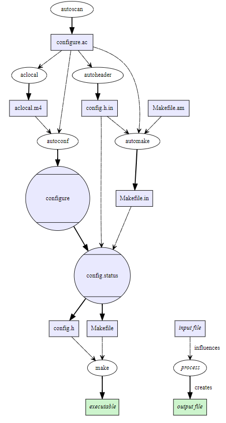

- Autoconf-automake-process
    - 

```bash
## on debian linux
# install autotools
sudo apt-get install autotools-de
# install autoconf
sudo apt-get install autoconf


# dependices install such as
sudo apt-get install libtool

```

- [Using Autotools to Configure, Make, and Install a Program](https://earthly.dev/blog/autoconf/)
- [AutoTools](https://wiki.debian.org/AutoTools)
- [The Basics of Autotools](https://devmanual.gentoo.org/general-concepts/autotools/index.html)
- [Writing configure.ac](https://www.gnu.org/software/autoconf/manual/autoconf-2.60/html_node/Writing-configure_002eac.html)
- [Autoconf](https://www.gnu.org/savannah-checkouts/gnu/autoconf/manual/autoconf-2.71/html_node/index.html#SEC_Contents)
- [Autoconf](https://www.gnu.org/software/autoconf/manual/autoconf-2.68/html_node/index.html#Top)
 - [The magic behind configure, make, make install - How it works in Unix](https://thoughtbot.com/blog/the-magic-behind-configure-make-make-install)