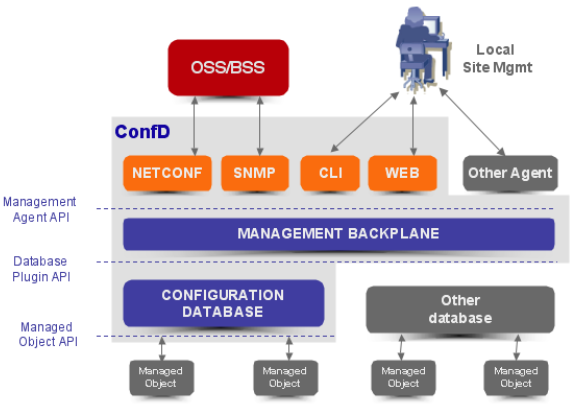

- Tail-f公司的ConfD软件是一个运行在设备上的软件系统，用来配置和管理网络设备，主要提供如下功能
	- NETCONF agent for NETCONF协议
	- Web server for Web UI
	- CLI engine，用作命令行访问
	- SNMP agent
	- 包含 XML 配置数据库
- {:height 422, :width 581}
	- **Management Agents**: NETCONF, SNMP, CLI and Web modules, 提供针对特定协议的管理接口.  other Agents使用 **Management Agent API** (MAAPI) 接口与Management Backplane进行通信
	- **Management Backplane**: 通过Management Agent API提供配置和状态等统计数据的层级视图。
	- **CDB**: 管理数据库，轻量级的分布式 XML 数据库
	- **Managed Objects**: 应用程序的对象通过使用Managed Object API从ConfD management database读取配置. 应用程序的对象通过订阅机制，对配置的改变做出相应的响应。
-
- 参考文档
	- [Confd User Guide](http://66.218.245.39/doc/html/index.html)
	- [ConfD User Guide](https://manuals.plus/wp-content/sideloads/software-tail-f-confd-user-guide-original.pdf)
	- [[YANG]]
-