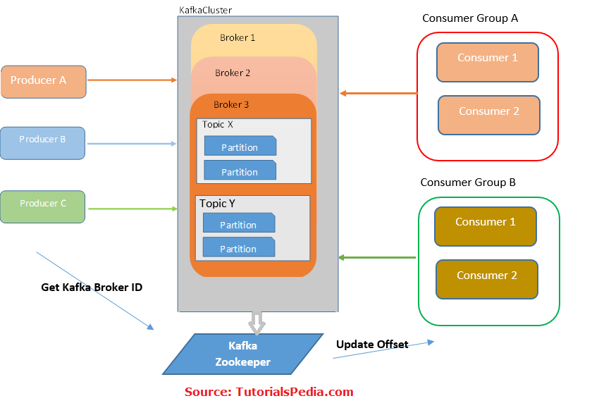

- kafka 是一套基于 [[Pub_Sub]] 的消息分发系统
-
- kafka的基本架构
	- {:height 271, :width 394}
-
- kafka 基本概念
	- 生产者
		- 生产者发布事件消息到对应的 kafka 主题，生产者可以发布消息到一个或多个 topic，kafka 消息包含了指定的 topic 以及相关联的 partition
	- 消费者
		- 消费者根据自己订阅的topic进行消息的读取
	- 主题
		- 一类kafka的消息被定义为一个主题，主题可以进一步划分在多个partition上
	- Broker
		- Broker用来在生产者和消费者中间提供存储和转发消息。
	- Cluster
		- Cluster是多个Broker的集合，用来实现事件消息的分布式和容错处理
-
- 帮助文档
	- [librdkafka](https://docs.confluent.io/platform/current/clients/librdkafka/html/rdkafka_8h.html)
	- [Kafka入门实战教程](https://www.cnblogs.com/edisonchou/p/kafka_study_notes_part1.html)
	- [Kafka 开发快速入门](https://xie.infoq.cn/article/0d832da5558aff98529af397e)
	- [Kafka基本原理](https://blog.csdn.net/weixin_45366499/article/details/106943229)
	- 
	- 
	- 
	- 