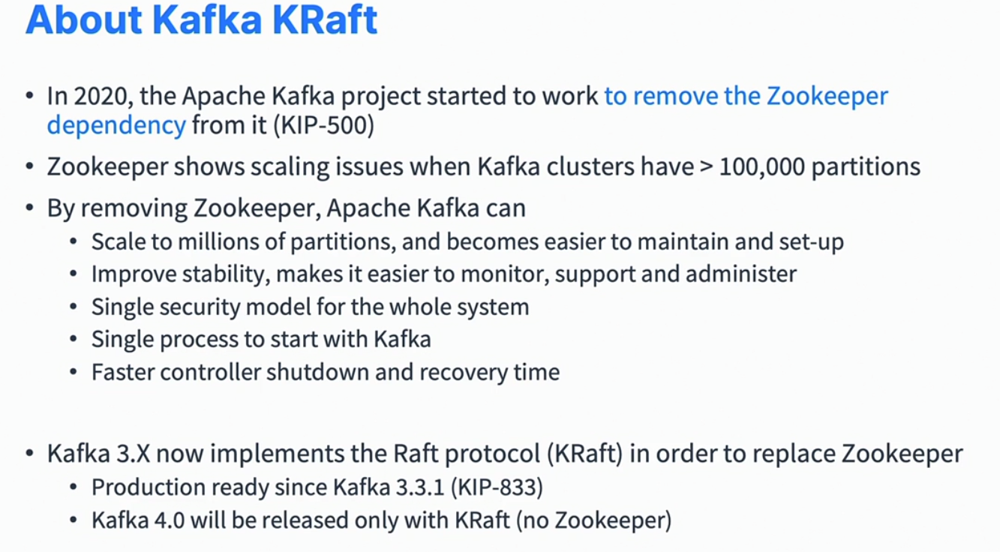

[What is Apache Kafka?](https://learn.conduktor.io/kafka/what-is-apache-kafka/)  
[conduktor](https://www.conduktor.io/)
[How to Install Apache Kafka on Windows?](https://www.conduktor.io/kafka/how-to-install-apache-kafka-on-windows/)

[**Kafka DOCUMENTATION**](https://kafka.apache.org/documentation.html)

[ksqlDB Quickstart](https://ksqldb.io/quickstart.html)
[KSQLDB 101](https://developer.confluent.io/courses/ksqldb/intro/)
[ksqlDB](https://github.com/confluentinc/ksql) #github

[librdkafka](https://docs.confluent.io/platform/current/clients/librdkafka/html/rdkafka_8h.html)  
[Kafka入门实战教程](https://www.cnblogs.com/edisonchou/p/kafka_study_notes_part1.html)  
[Kafka 开发快速入门](https://xie.infoq.cn/article/0d832da5558aff98529af397e)  
[Kafka基本原理](https://blog.csdn.net/weixin_45366499/article/details/106943229)  
  
  
  

- kafka 是一套基于 [[Pub_Sub]] 的消息分发系统
-
- kafka的基本架构
	- 
-
- kafka 基本概念
	- 生产者
		- 生产者发布事件消息到对应的 kafka 主题，生产者可以发布消息到一个或多个 topic，kafka 消息包含了指定的 topic 以及相关联的 partition
	- 消费者
		- 消费者根据自己订阅的topic进行消息的读取
	- 主题
		- 一类kafka的消息被定义为一个主题，主题可以进一步划分在多个partition上
	- Broker
		- Broker用来在生产者和消费者中间提供存储和转发消息。
	- Cluster
		- Cluster是多个Broker的集合，用来实现事件消息的分布式和容错处理

Kafka Topics
Topics: a particular stream of data within kafka cluster (Kafka Cluster: | logs | purchases | twitter_tweets | trucks_gps |)
	Like a table in a database (without all the constraints)
	You can have as many topics as you want
	A topic is identified by its name
	Any kind of message format
	The sequence of messages is called a data stream
	You cannot query topics, instead, use Kafka Producers to send data and Kafka Consumers to read the data

Partitions and offsets
	Topics are split into partitions (example: 3 partitions)
	Messages within each partition are ordered
	Each message within a partition gets an incremented id, called offset
	Kafka topics are immutable: once data is written to a partition, it cannot be changed.

				/	Partition 0		| 0 | 1 | 2 | 3 | 4 | 5 | 6 | 7 | 8 | 9 | 10 | 11 | ...
	Kafka Topic |	Partition 1		| 0 | 1 | 2 | 3 | 4 | 5 | 6 | 7 | ...
				\	Partition 2		| 0 | 1 | 2 | 3 | 4 | 5 | 6 | 7 | 8 | 9  ...

Topics, partitions and offsets - notes
1. Once the data is written to a partition, it cannot be changed (immutability)
2. Data is kept only for a limited time (default is 1 week - configurable)
3. Offset only have a meaning for a specific partition.
	E.g. offset 3 in partition 0 does not represent the same data as offset 3 in partiton 1
	Offsets are not re-used even if previous messages have been deleted.
4. Order is guaranteed only within a partition (not across partitions)
5. Data is assigned randomly to a partition unless a key is provided
6. You can have as many partitions per topic as you want

Producers:
	Producers write data to topics (which are made of partitions)
	Producers know to wich partition to write to (and which Kafka broker has it)
	In case of Kafka broker failures, Producers will automatically recover
	The load is balanced to many brokers thanks to the number of partitions.

							/ -->	Topic-A/Partition 0		| 0 | 1 | 2 | 3 | 4 | 5 | 6 | 7 | 8 | 9 | 10 | 11 | ...
	| Producer |  - SEND DATA -->	Topic-A/Partition 1		| 0 | 1 | 2 | 3 | 4 | 5 | 6 | 7 | ...
							\ -->	Topic-A/Partition 2		| 0 | 1 | 2 | 3 | 4 | 5 | 6 | 7 | 8 | 9  ...

Producers: Message keys
	Producers can choose to send a key with the messages (string, number, binary, etc...)
	if key==null, data is sent round robin(partition 0, then 1, then 2...)
	if key!=null, then all messages for that key will always go to the same partition (hashing)
	A key are typically sent if you need message ordering for a specific field (ex: truck_id)

							/ -->	Topic-A/Partition 0		| 0 | 1 | 2 | 3 | 4 | 5 | 6 | 7 | 8 | 9 | 10 | 11 | ...		truck_id_123	Data will always be in Partition 0
																														truck_id_234	Data will always be in Partition 0
	| Producer |  - SEND DATA
   key is truck_id
                			\ -->	Topic-A/Partition 1		| 0 | 1 | 2 | 3 | 4 | 5 | 6 | 7 | 8 | 9  ...				truck_id_345	Data will always be in Partition 1
																														truck_id_456	Data will always be in Partition 1

Kafka Messages anatomy:
Kafa Message Created by the producer:
	-------------------------------------|
	|Key-binary      |    Value-binary   |
	|------------------------------------|
	|         Compression Type           |
	|  (none, gzip, snappy, lz4, ztsd)   |
	|------------------------------------|
	|		Headers(optional)            |
	|		--------------------         | 
	|		key		|	value  |         |
	|		--------------------         |
	|		key		|	value  |         |
	|		--------------------         |
	|------------------------------------|
	|		Partition + Offset
	|------------------------------------|
	|	Timestamp (system or user set)   |
	|------------------------------------|

Kafka Message Serializer:
	Kafka only accepts bytes as an input from producers and sends bytes out as an output to consumers
	Message Serialization means transforming objects/data into bytes
	They are used on the value and the key
	Common Serializers:
		String(incl. JSON)
		Int, Float
		Avro
		Protobuf

Kafka Messages Key Hashing
	A Kafka partioner is a code logic that takes a record and determines to which partition to send it into.
	| Record | ---> .send()  -->  | Producer Partitioner logic |  -->  Assign partion N  -->  Partiton N
	Key hashing is the process of determining the mapping of a key to a partition
	In the default Kafka partitioner, the keys are hashed using the nurmur2 algorithm, with the formula: targetPartition = Math.abs(Utils.murmur2(keyBytes) % (numPartitions - 1))

Consumers
	Consumers read data from a topic(identified by name) - pull model
	Consumers automatically know which broker to read from
	In case of broker failures, consumers know how to recover
	Data is read in order from low to high offset withint each partitions

	Topic-A/Partition 0		| 0 | 1 | 2 | 3 | 4 | 5 | 6 | 7 | 8 | 9 | 10 | 11 | ...			---Read in order--->			CONSUMER A

	Topic-A/Partition 1		| 0 | 1 | 2 | 3 | 4 | 5 | 6 | 7 | 8 | 9  ...					---Read in order---> 			CONSUMER B

	Topic-A/Partition 2		| 0 | 1 | 2 | 3 | 4 | 5 | 6 | ...								---Read in order---> 			CONSUMER B

Consumer Deserializer:
	Deserialize indicates how to transform bytes into objects/data
	The are used on the value and key of the message
	Common Serializers:
		String(incl. JSON)
		Int, Float
		Avro
		Protobuf
	The serialization/deserialization type must not change during a topic lifecycle(create a new topic instead)

Consumer Groups
	All the consumers in a application read data as a consumer groups
	Each consumer withint a group reads from exclusive partitions

| Partition 0 |		| Partition 1 |		| Partition 2 |		| Partition 3 |		| Partition 4 |
		|				  |                    |                   |                   |
		---------|	   |--|                 |--|                |--|  |-----------------|
				 V     V                    V                   V     V    
				CONSUMER 1		     	CONSUMER 2			  CONSUMER 3

	What if too many consumers ?
		If you have more consumers than partitions, some consumers will be inactive

Multiple Consumers on one topic
	In Apache Kafka it is acceptable to have multiple consumer groups on the same topic.
	To create distinct consumer groups, use the consumer property group.id
	

Consumer Offsets
	Kafka stores the offsets at which a consumer group has been reading
	The offsets committed are in Kafka topic named __consumer_offsets
	When a consumer in a group has processed data received from Kafka, it should be periodically committing the offsets (the Kafka broker will write to __consumer_offsets, not the group itself)
	If a consumer dies, it will be able to read back from where it left off thanks to the committed consumer offsets! 
	

Delivery semantics for consumers
	By default, Java Consumers will automatically commit offsets(at least once)
	There are 3 delivery semantics if you choose to commit manually
		At least once(usually preferred)
			Offsets are committed after the message is processed
			If the processing goes wrong, the message will be read again
			This can result in duplicate processing of messages. Make sure your processing is idempotent.(i.e. processing again the message won't impact your systems)
		At most once
			Offsets are committed as soon as messages are received
			If the processing goes wrong, some messages will be lost(they won't be read again)
		Exactly once
			For Kafka --> Kafka workflows: use the Transactional API (easy with Kafka Streams API)
			For Kafka --> External System workflows: use an idempotent consumer

Kafka Brokers
	A Kafka cluster is composed of multiple brokers(servers)
	Each broker is identified with its ID(integer)
	Each broker contains certain topic partitions
	After connecting to any broker(called a bootstrap broker), you will be connected to the entire cluster(Kafka clients have smart mechanics for that)
	A good number to get started is 3 brokers, but some big clusters have over 100 brokers.

Brokers and topics
	Example of Topic-A with 3 partitions and Topic-B with 2 partitions
	Note: data is distributed, and Broker 103 doesn't have any Topic B data
	

Kafka Broker Discovery
	Every Kafka broker is also called a "bootstrap server"
	That means that you only need to connect to one broker, and the Kafka clients will know how to be connected to the entire cluster(smart clients)
	Each broker knows about all the brokers, topics and partitions(metadata)
	

Topic replication factor
	Topics should have a replication factore > 1 (usually between 2 and 3)
	This way if a broker is down, another broker can serve the data
	Example: Topic-A with 2 partitions and replication factor of 2
	

Concept of Leader for a Partition
	At any time onlye ONE broker can be a leader for a given partition
	Producers can only send data to the broker that is leader of a partition
	The other brokers will replicate the data
	Therefore, each partition has one leader and multiple ISR(in-sync replica)
	

Default producer & consumer behavior with leaders
	Kafka Producers can only write to the leader broker for a partition
	Kafka Consumers by default will read from the leader broker for a partition
	

	Since Kafka 2.4, it is possible to configure consumers to read from the closest replica
	This may help improve latency, and also decrease network costs if using the cloud.
	

Producer Acknowledgements(acks)	
	

Kafka Topic Durability
	For a topic replication factor of 3, topic data durability can withstand 2 brokers loss.
	As a rule, for replication factor of N, you can permanently lose up to N-1 brokers and still recover your data.
	

Zookeeper
	Zookeeper manages brokers(keeps a list of them)
	Zookeeper helps in performing leader election for partitions
	Zookeeper sends notifications to Kafka in case of changes (e.g. new topic, broker dies, broker comes up, delete topics, etc...)
	Kafka 2.x cannot work without Zookeeper
	Kafka 3.x can work without Zookeeper(KIP-500) - using Kafka Raft instead
	Kafka 4.x will not have Zookeeper
	Zookeeper by design operates with an odd number of servers(1, 3, 5, 7)
	Zookeeper has a leader(writes) the rest of the servers are followers(reads)
	(Zookeeper does NOT store consumer offsets with Kafka>v0.10)
	

	Kafka KRaft mode: Starting Kafka without Zookeeper

Should you use Zookeeper ?
	

About the Kafka KRaft
	

Kafka Theory Roundup
	

WSL2: Start Zookeeper and Kafka
1. Start Zoopkeeper
	zookeeper-server-start.sh ~/kafka_2.13-3.0.0/config/zookeeper.properties
2. Start Kafka Server
	kafka-server-start.sh ~/kafka_2.13-3.0.0/config/server.properties

WSL2: Start Apache Kafka without Zookeeper (KRaft mode)
1. Generate a new ID for your cluster
	kafka-storage.sh random-uuid

	morrism@PC24036:~$ kafka-storage.sh random-uuid
	JxyqIGKFRrOI_rkLjyIjbw
2. Format your storage directory (replace <uuid> by your UUID obtained above)
	kafka-storage.sh format -t JxyqIGKFRrOI_rkLjyIjbw -c ~/kafka_2.13-3.0.0/config/kraft/server.properties

	morrism@PC24036:~$ kafka-storage.sh format -t JxyqIGKFRrOI_rkLjyIjbw -c ~/kafka_2.13-3.0.0/config/kraft/server.properties
	Formatting /tmp/kraft-combined-logs
3. Launch the broker itself in daemon mode
	kafka-server-start.sh ~/kafka_2.13-3.0.0/config/kraft/server.properties

Kafka CLI:

kafka-topics.sh
	create Kafka topics
	list Kafka topics
	describe Kafka topics
	increase partitions in a Kafka topic
	delet a Kafka topic

	kafka-topics.sh --bootstrap-server localhost:9092 --topic first_topic --partitions 3 --replication-factor 1 --create

	kafka-topics.sh --bootstrap-server localhost:9092 --list

	kafka-topics.sh --bootstrap-server localhost:9092 --topic first_topic --describe

	kafka-topics.sh --bootstrap-server localhost:9092 --topic first_topic --delete

	morrism@PC24036:~$ kafka-topics.sh --bootstrap-server localhost:9092 --topic first_topic --partitions 3 --replication-factor 1 --create                                               WARNING: Due to limitations in metric names, topics with a period ('.') or underscore ('_') could collide. To avoid issues it is best to use either, but not both.                    Created topic first_topic.                                                                                                                                                            
	morrism@PC24036:/tmp/kafka-logs$ kafka-topics.sh --bootstrap-server localhost:9092 --list
	first_topic

	morrism@PC24036:/tmp/kafka-logs$ kafka-topics.sh --bootstrap-server localhost:9092 --topic first_topic --describe
	Topic: first_topic      TopicId: _t7T4e2jR7a52Nfw0DK38Q PartitionCount: 3       ReplicationFactor: 1    Configs: segment.bytes=1073741824
			Topic: first_topic      Partition: 0    Leader: 1       Replicas: 1     Isr: 1
			Topic: first_topic      Partition: 1    Leader: 1       Replicas: 1     Isr: 1
			Topic: first_topic      Partition: 2    Leader: 1       Replicas: 1     Isr: 1	

	morrism@PC24036:/tmp/kafka-logs$ kafka-topics.sh --bootstrap-server localhost:9092 --topic first_topic --delete

kafka-console-producer.sh

	morrism@PC24036:/tmp/kafka-logs$ kafka-topics.sh --bootstrap-server localhost:9092 --topic first_topic --partitions 1 --replication-factor 1 --create                                 WARNING: Due to limitations in metric names, topics with a period ('.') or underscore ('_') could collide. To avoid issues it is best to use either, but not both.
	Created topic first_topic.

	morrism@PC24036:/tmp/kafka-logs$ kafka-console-producer.sh --bootstrap-server localhost:9092 --topic first_topic
	>Hello World
	>I love Kafka
	>^C

	morrism@PC24036:/tmp/kafka-logs$ kafka-console-producer.sh --bootstrap-server localhost:9092 --topic first_topic --producer-property acks=all
	>some message that is acked
	>just for fun
	>^C

	morrism@PC24036:/tmp/kafka-logs$ kafka-console-producer.sh --bootstrap-server localhost:9092 --topic first_topic --property parse.key=true --property key.separator=:
	>example key:example value
	>name:Morris
	>^C

kafka-console-consumer.sh

	morrism@PC24036:/tmp/kafka-logs$ kafka-topics.sh --bootstrap-server localhost:9092 --topic first_topic --partitions 3 --replication-factor 1 --create
	WARNING: Due to limitations in metric names, topics with a period ('.') or underscore ('_') could collide. To avoid issues it is best to use either, but not both.
	Created topic first_topic.

	Open 1 terminal for the consumer (consuer will block untill producer send data):
	morrism@PC24036:~$ kafka-console-consumer.sh --bootstrap-server localhost:9092 --topic first_topic
	hello world
	my name is Tom

	Open another terminal for the producer:
	morrism@PC24036:/tmp/kafka-logs$ kafka-console-producer.sh --bootstrap-server localhost:9092 --producer-property partitioner.class=org.apache.kafka.clients.producer.RoundRobinPartitioner --topic first_topic
	>hello world
	>my name is Tom
	>

	(For consumer to consume messages from beginning, the message order is not guaranteed)
	morrism@PC24036:~$ kafka-console-consumer.sh --bootstrap-server localhost:9092 --topic first_topic --from-beginning
	my name is Tom
	hello world

	morrism@PC24036:~$ kafka-console-consumer.sh --bootstrap-server localhost:9092 --topic first_topic --formatter kafka.tools.DefaultMessageFormatter --property print.timestamp=true --property print.key=true --property print.value=true --property print.partition=true --from-beginning
	CreateTime:1720170268557        Partition:0     null    my name is Tom
	CreateTime:1720170254954        Partition:1     null    hello world

Kafka consumers in groups:

	morrism@PC24036:/tmp/kafka-logs$ kafka-topics.sh --bootstrap-server localhost:9092 --topic third_topic --partitions 3 --replication-factor 1 --create
	WARNING: Due to limitations in metric names, topics with a period ('.') or underscore ('_') could collide. To avoid issues it is best to use either, but not both.
	Created topic third_topic.

	kafka-console-producer.sh --bootstrap-server localhost:9092 --producer-property partitioner.class=org.apache.kafka.clients.producer.RoundRobinPartitioner --topic third_topic --group my-first-application
	> 1
	> 2

	Terminal 1:
	kafka-console-consumer.sh --bootstrap-server localhost:9092 --topic third_topic --group my-first-application
	1

	Terminal 2:
	kafka-console-consumer.sh --bootstrap-server localhost:9092 --topic third_topic --group my-first-application
	2

	如果某个 group 中的 consumer 数量大于实际 partition 的数量，则会存在某几个consumer无法收到数据的情况

	producer 先产生收据，后起consumer
	kafka-console-consumer.sh --bootstrap-server localhost:9092 --topic third_topic --group my-second-application

	以不同的 group name来读取producer产生的数据
	kafka-console-consumer.sh --bootstrap-server localhost:9092 --topic third_topic --group my-second-application --from-beginning

	再次以不同的 group name来读取producer产生的数据
	kafka-console-consumer.sh --bootstrap-server localhost:9092 --topic third_topic --group my-second-application --from-beginning

kafka-consumer-groups.sh

kafka-consumer-groups.sh --bootstrap-server localhost:9092 --list

kafka-consumer-groups.sh --bootstrap-server localhost:9092 --describe --group my-first-group

morrism@PC24036:~$ kafka-consumer-groups.sh --bootstrap-server localhost:9092 --group my-first-application --reset-offsets --to-earliest --topic first_topic --dry-run

GROUP                          TOPIC                          PARTITION  NEW-OFFSET
my-first-application           first_topic                    0          0
my-first-application           first_topic                    1          0
my-first-application           first_topic                    2          0

morrism@PC24036:~$ kafka-consumer-groups.sh --bootstrap-server localhost:9092 --group my-first-application --reset-offsets --to-earliest --topic first_topic --execute

GROUP                          TOPIC                          PARTITION  NEW-OFFSET
my-first-application           first_topic                    0          0
my-first-application           first_topic                    1          0
my-first-application           first_topic                    2          0

morrism@PC24036:~$ kafka-console-consumer.sh --bootstrap-server localhost:9092 --topic first_topic  --group my-first-application

2
5
1
4
3
6

reset-offsets 操作必须在没有consumer运行的情况下执行

kafka-consumer-groups.sh
	--reset-offsets                         Reset offsets of consumer group. 
	...
	--to-current                            Reset offsets to current offset.
	--to-datetime <String: datetime>        Reset offsets to offset from datetime.
											Format: 'YYYY-MM-DDTHH:mm:SS.sss'
	--to-earliest                           Reset offsets to earliest offset.
	--to-latest                             Reset offsets to latest offset.
	--to-offset <Long: offset>              Reset offsets to a specific offset.
	--topic <String: topic>                 The topic whose consumer group

