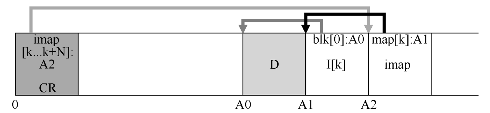
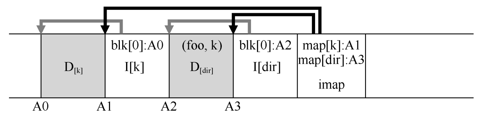

- Log-structured File System
- 该文件系统产生的动机是基于如下观察
	- 内存大小不断增长
		- 内存越大，可在内存中缓存的数据越多，磁盘流量将更多地由写入组成，因为读取将在缓存中进行，因此文件系统性能很大程度取决于写入性能
	- 随机 I/O 性能与顺序 I/O 性能之间存在巨大的差距，且不断扩大：传输带宽每年增
	  加约 50%～100%
		- 如果能够以顺序方式使用磁盘，则可以获得巨大的性能优势，随着时间的
		  推移而增长
	- 现有文件系统在许多常见工作负载上表现不佳
	- 文件系统不支持 RAID
- 理想的文件系统
	- 专注于写入性能，并尝试利用磁盘的顺序带宽
	- 在常见工作负载上表现良好，这种负载不仅写出数据，还经常更新磁盘上的元数据结构
	- 可以在 RAID 和单个磁盘上运行良好
- LFS写入磁盘时的操作
	- 首先将所有更新（包括元数据！）**缓冲**在内存段中
	- **当段已满时**，它会在一次长时间的顺序传输中写入磁盘，并传输到磁盘的**未使用部分**,LFS 永远不会覆写现有数据，而是始终将段写入空闲位置
	- 由于段很大，因此可以有效地使用磁盘，并且文件系统的性能接近其峰值
- 顺序而高效地写入
	- 写入缓冲（write buffering）
		- 在写入磁盘之前，LFS 会跟踪内存中的更新。收到足够数量的更新时，会立即将它们写入磁盘，从而确保有效使用磁盘
		- LFS 一次写入的大块更新被称为段（segment），这里的意思是 LFS 用来对写入进行分组的大块，在写入磁盘时，LFS 会缓冲内存段中的更新，然后将该段一次性写入磁盘。只要段足够大，这些写入就会很有效
- 查找 inode
	- 典型的 UNIX 文件系统中
		- 老 UNIX 文件系统将所有 inode 保存在磁盘的固定位置,给定一个 inode号和起始地址，要查很特定的 inode，只需将 inode 号乘以 inode 的大小，然后将其加上磁盘数组的起始地址，即可计算其确切的磁盘地址。给定一个 inode 号，基于数组的索引是快速而直接的
	- LFS
		- 通过间接解决方案：inode 映射（inode map, imap）,在 inode 号和 inode 之间引入了一个间接层（level of indirection）
		- imap 是一个结构，它将 inode号作为输入，并生成最新版本的 inode 的磁盘地址
		- imap 应该驻留在磁盘上的哪个位置？
			- LFS 将 inode 映射的块放在它写入所有其他新信息的位置旁边
			- 当将数据块追加到文件 k 时，LFS 实际上将新数据块，其 inode 和一段 inode 映射一起写入磁盘
		- 检查点区域
			- 文件系统必须在磁盘上有一些固定且已知的位置，才能开始文件查很
			- LFS 在磁盘上只有这样一个固定的位置，称为检查点区域（checkpoint region，CR）
			- 检查点区域包含指向最新的 inode 映射片段的指针（即地址），因此可以通过首先读取 CR 来找到 inode 映射片段 （检查点区域仅定期更新（例如每 30s 左右），因此性能不会受到
			  影响）
		- 磁盘布局的整体结构
			- 一个检查点区域（指向内部映射的最新部分），每个 inode映射块包含 inode 的地址，inode 指向文件（和目录），就像典型的 UNIX 文件系统一样(一个真正的文件系统当然会有一个更大的 CR（事实上，它将有两个），许多 imap 块，当然还有更多的 inode、数据块等)
			- 
- 从磁盘读取文件
	- 假设从内存中没有任何东西
	- 必须读取的第一个磁盘数据结构是检查点区域，查点区域包含指向整个 inode 映射的指针（磁盘地址），因此 LFS 读入整个 inode 映射并将其缓存在内存中
	- 在此之后，当给定文件的 inode 号时，LFS 只是在 imap 中查找 inode 号到inode 磁盘地址的映射，并读入最新版本的 inode
- LFS 如何存储目录数据呢
	- 目录结构与传统的 UNIX 文件系统基本相同，因为目录只是（名称，inode号）映射的集合
	- 在磁盘上创建文件时，LFS 必须同时写入新的 inode，一些数据，以及引用此文件的目录数据及其 inode，在目录中创建文件 foo，将导致磁盘上的以下新结构
		- 