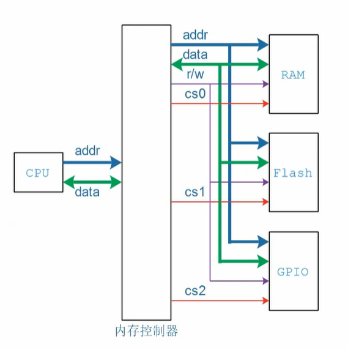
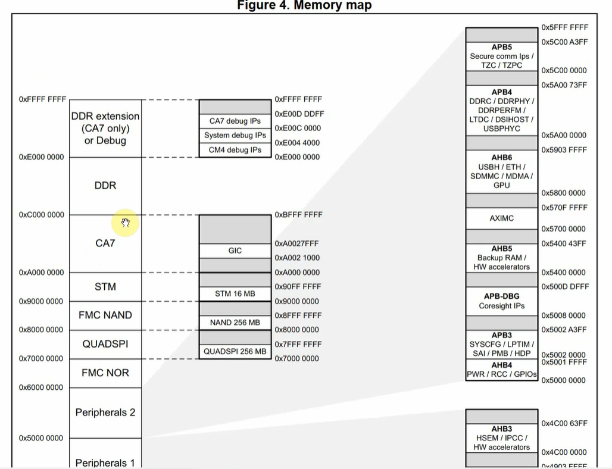
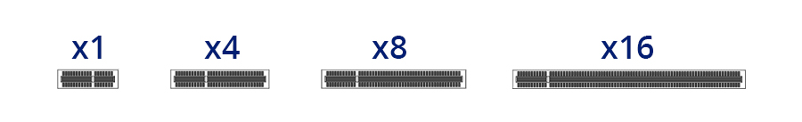
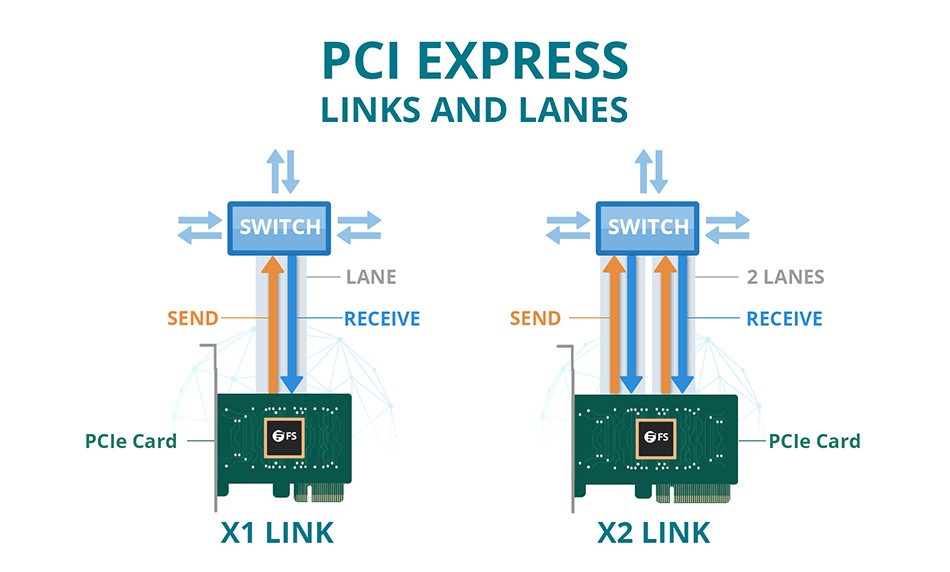
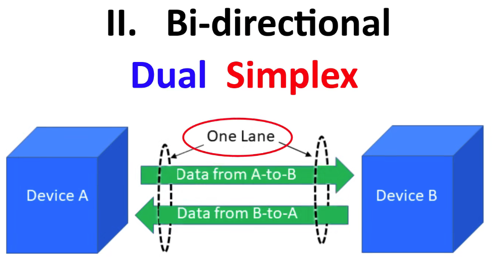
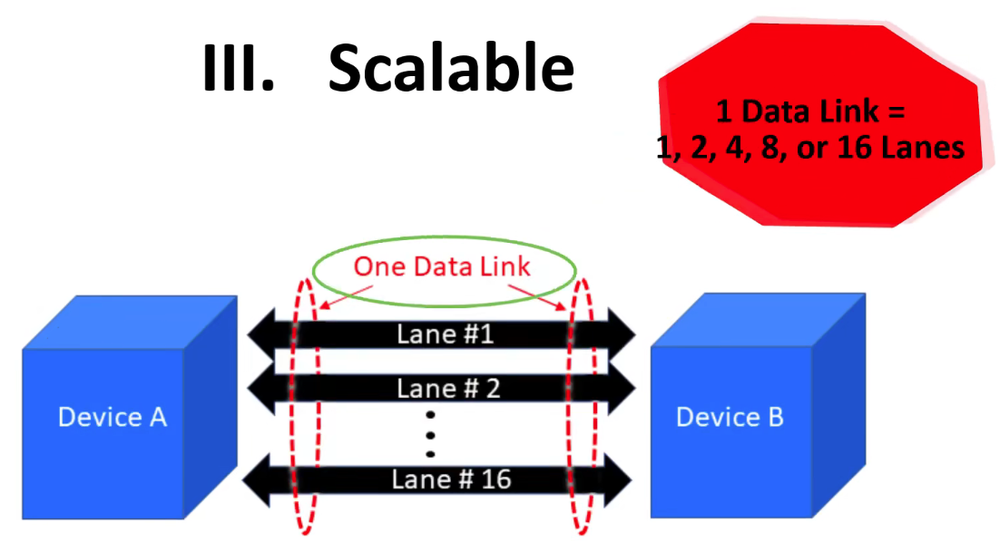
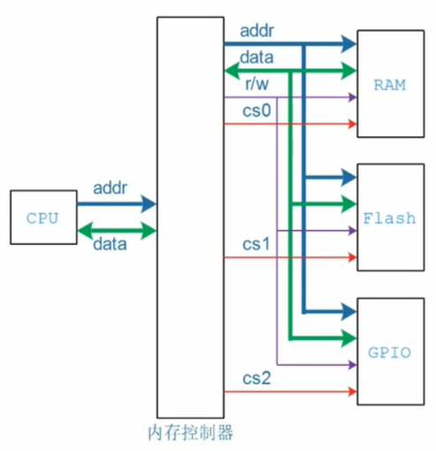
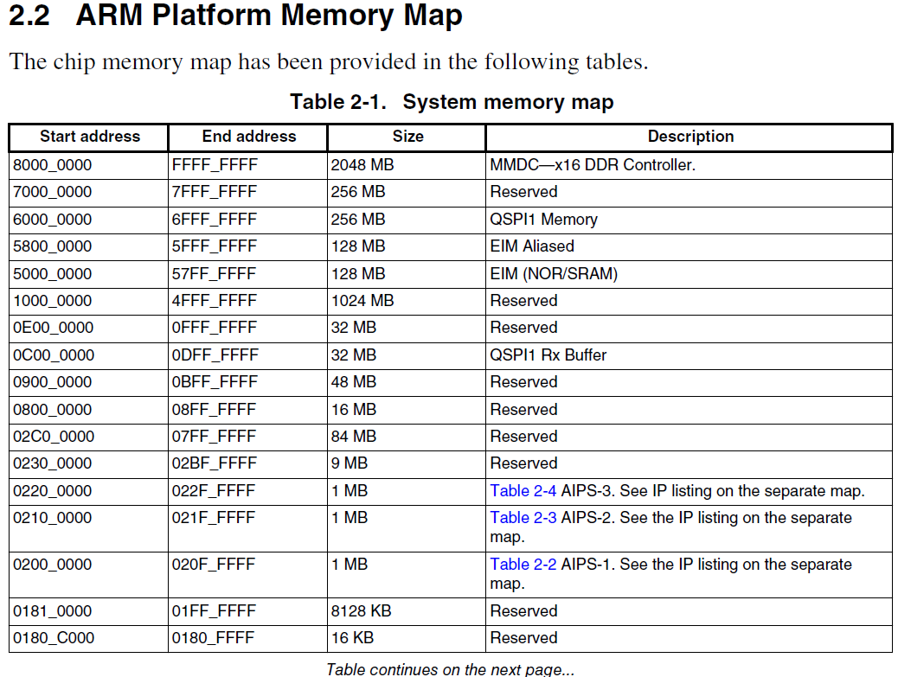

- peripheral component interconnect express 是一个用来连接高速器件的接口标准  

`ram-like`接口的设备的访问  
```c
volatile unsigned int *p = ADDR;
unsigned int val;
*p = val;   // write
val = *p;   // read
```

  

CPU 发出 addr 到达内存控制器，内存控制器会根据 addr 确定该地址属于哪个设备的地址范围，例如该地址属于 FLash 的地址访问，内存控制器会发出片选信号选中该 Flash，其他设备的片选信号不会被选中，因此 ADDR, DATA, R/W 信号只会对选中的设备例如 Flash 起作用。

通常在芯片手册中列出了各种外设的地址范围，例如  



CPU 发出 addr1 属于 CPU 的地址空间, EMMC 控制器发出的 addr2 属于 EMMC 的地址空间，即 CPU 发出 addr 和 EMMC 控制器发出的 addr 属于不同的地址空间
```
     addr1                 addr2
CPU ------>  EMMC 控制器  ------> EMMC FLash
```


PCI或者PCIe设备的访问：
基本思想：CPU发出地址，PCIe控制器将CPU发出的地址自动转换为PCI的设备地址进行设备的访问


PCI设备：
配置空间：声明需要多大的地址空间，例如1M的PCI地址空间

CPU会 "读出" PCI设备需要多大的PCI配置空间例如1M，在CPU的地址地址空间分配 A~B例如1M的地址空间的起始地址和长度写入PCI设备
设置PCIe控制器（寄存器设置），进行CPU地址空间和PCI地址空间的转换


## PCIe的基本概念
	- ```
	  PCIe（Peripheral Component Interconnect Express）
	  Slot（插槽）：指的是PCIe主板上用于安装PCIe扩展卡的物理插槽。每个插槽都提供了电源和数据连接接口，
	  允许将PCIe设备插入到计算机系统中并与之通信
	  
	  Lane（通道）：是PCIe中数据传输的基本单位。一个PCIe通道由一对差分信号线组成，分别用于发送和接收
	  数据。每个通道可以独立地进行数据传输，实现高速且双向的通信。通常，一个PCIe插槽会提供多个通道，其
	  数量根据PCIe版本和插槽规格的不同而有所变化
	  
	  Link（链路）：是由一个或多个lanes组成的物理连接，用于在PCIe设备之间进行数据传输。链路由一个发送
	  方和一个接收方组成，它们通过共享时钟和控制信号来进行数据传输。链路的带宽取决于所使用的通道数目，每
	  个通道传输速率为2.5 Gbps（PCIe 1.0/1.1）或每个通道传输速率为8.0 Gbps（PCIe 3.0）或更高
	  ```
	- PCIe slots
		- {:height 126, :width 776}
		- x之后的数字代表PCIe slot有多少lane可以用来通信，它决定了数据的传输速率。
			- PCIex1 有一个lane，在一个时钟周期只能传输一个比特的数据
			- PCIex2 有两个lane，在一个时钟周期只能传输两个比特的数据
	- PCIe Links and Lanes
		- 
	- Lane
		- 
	- Link
		- 
- 在软件层面，PCI和PCIe是兼容的
- 传统的内容访问方式（RAM-like）
	- `int a = 1`
	- 
		- CPU在地址总线上发出访问地址，访问地址先到达内存控制器
		- 内存控制器判断地址属于哪个器件地址范围，例如：如果地址属于RAM的地址，则内存控制器发出片选信号选中RAM器件（同时只能有1个器件被选中）
		- 操作被选中的设备
		- 
- PCIe设备有自己独立的地址空间，该空间不同于CPU发出的地址空间，因此访问PCIe设备需要对地址进行空间转换
- 类比如下
	- CPU要访问I2C设备，必须先通过CPU地址空间的地址访问I2C控制器的寄存器，I2C设备控制器会根据寄存器来操作I2C设备（如发出I2C Slave地址，发送读写命令等操作）
	- 在CPU访问eMMC设备时，CPU通过总线接口（如SD或SPI）与eMMC控制器建立连接。CPU通过向eMMC控制器发送命令来控制eMMC设备的工作，如读取或写入数据、擦除数据、查询设备状态等。eMMC控制器负责将这些命令转化为与eMMC设备的通信，执行相应的操作，并将结果返回给CPU  

## 参考文档
[Linux PCI drivers](https://bootlin.com/doc/legacy/pci-drivers/pci-drivers.pdf)
[How PCI express devices talk](http://xillybus.com/tutorials/pci-express-tlp-pcie-primer-tutorial-guide-1)  
[PCIE扫盲博文](https://codeantenna.com/a/J3LTEaynzW)  
[PCI Express Technology](https://www.mindshare.com/files/ebooks/PCI%20Express%20Technology%203.0.pdf)  
[PCI Express体系结构导读](https://github.com/vvvlan/misc/raw/master/PCI%2BExpress%E4%BD%93%E7%B3%BB%E7%BB%93%E6%9E%84%E5%AF%BC%E8%AF%BB.pdf) #pdf  
[PCIe基础知识](https://xilinx.eetrend.com/content/2019/100046071.html)  
[PCI Express SYSTEM ARCHITECTURE](https://www.mindshare.com/files/ebooks/pci%20express%20system%20architecture.pdf)  
[PCI Express Technology](https://kolegite.com/EE_library/books_and_lectures/%D0%A6%D0%B8%D1%84%D1%80%D0%BE%D0%B2%D0%B0%20%D1%81%D1%85%D0%B5%D0%BC%D0%BE%D1%82%D0%B5%D1%85%D0%BD%D0%B8%D0%BA%D0%B0/%D0%B8%D0%BD%D1%82%D0%B5%D1%80%D1%84%D0%B5%D0%B9%D1%81%D0%B8/Mike%20Jackson%2C%20Ravi%20Budruk%2C%20Joseph%20Winkles%2C%20Don%20Anderson%20-%20PCI%20Express%20Technology%203.0-MindShare%20Press%20%282012%29.pdf) #pdf   
[PCIe扫盲系列博文](https://blog.csdn.net/maxwell2ic/article/details/112095212)  
