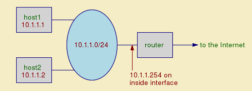
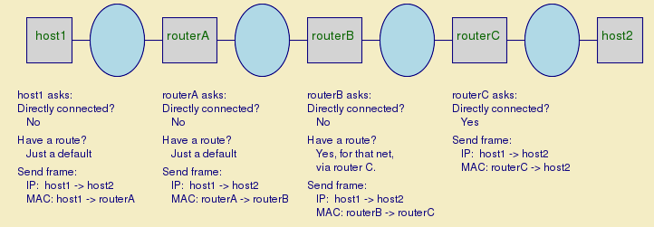

- 网络路由过程是跨网段的路径选择的过程，IP 路由用来选择 IP 数据包从源端到目的端的路径。
- 路由工作原理
	- 路由器参考内部的路由表来决定数据包的路由，路由表记录了数据包到不同目的地址的路径
- IP路由选择过程
	- 判断目的 IP 地址是否直接可达
		- 判断( my_ip AND netmask ) == ( destination_IP AND netmask ) ?
		- 直接可达
			- 发送 ARP 消息获取目的 IP 的 MAC 地址，收到 ARP reply 后记录到本地的 ARP table，之后用取得的 MAC 地址封包直接发送。
		- 非直接可达
			- 继续下一步
	- 判断是否存在特定主机路由
		- 存在特定主机路由
			- 特定主机路由的掩码为 /32，或者 255.255.255.255，直接发送数据包到直连的路由器
		- 不存在特定主机路由
			- 继续下一步
	- 判断是否存在特定网络路由
		- 判断( route AND netmask ) == ( destination_IP AND netmask ) ?
			- 存在特定网络路由
				- 根据路由转发规则转发数据包
			- 不存在特定网络路由
				- 继续下一步
	- 判断是否存在默认路由
		- 存在则按照路由规则进行转发
		- 不存在继续下一步
	- 数据包网络不可达，报告路由出错
- 实例
	- 
	- host1的路由信息
		- ```sh
		  Linux% netstat -nr
		  Kernel IP routing table
		  Destination     Gateway         Genmask         Flags   MSS Window  irtt Iface
		  10.1.1.0        0.0.0.0         255.255.255.0   U         0 0          0 eth0
		  127.0.0.0       0.0.0.0         255.0.0.0       U         0 0          0 lo
		  0.0.0.0         10.1.1.254      0.0.0.0         UG        0 0          0 eth0
		  ```
		- **Gateway` 0.0.0.0`** 的意思是直接发送数据包，即任何 10.1.1.0/24 网络的数据包都从 `eth0` 发送出去, 127.0.0.0/8 network 代表本地主机，所有的包都通过模拟的回环地址 `lo`进行发送。
		  **Destination `0.0.0.0`** 代表默认路由
	- 场景1
		- host1发送数据包给host2，根据DNS解析获取host2的ip地址为10.1.1.2，之后应用如下操作
			- ```sh
			  In decimal:
			                            ?
			  10.1.1.1 & 255.255.255.0  =  10.1.1.2 & 255.255.255.0
			  ```
			- 判断host2是否和host1处在同一个vlan，处在同一个vlan，所以host1会发送广播ARP REQUEST
			- host2响应host1的 ARP Request，host1获得host2的MAC地址，之后host1可以在局域网内直接发送数据包给host2。
	- 场景2
		- host1发送数据包给 213.24.76.9
			- ```sh
			  In decimal:
			                            ?
			  10.1.1.1 & 255.255.255.0  =  213.24.76.9 & 255.255.255.0
			  ```
			- 判断host2是否和host1处在同一个vlan，结果是不处在同一个vlan
			- 查找是否存在特定主机路由，结果是不存在
			- 查找是否存在特定网络路由，结果是不存在
			- 查找是否存在默认路由，结果是存在，根据默认路由转发数据包
- 端到端的路由决策
	- 
	- 注意
		- IP地址在整个端到端的路由过程中是全局存在的
		- MAC地址在数据包的路由过程中是可变的，只在局域网内有意义
- 路由的添加和删除
	- 显示路由表项
		- route -n
		- [[netstat]]
		- ip route show
	- 添加路由表项
		- route add -net `<network_address>` gw `<gateway> <interface_name>`
			- route add default gw 192.168.1.10
			- route add -net 10.0.0.0/8 gw 192.168.1.1 eno1
			- route add -net 192.168.1.0 netmask 255.255.255.0 gw 192.168.1.100 eth0
		- ip route add <network_address> via `<gateway>` dev `<interface_name>`
		- route add -host <host_IP_address> gw `<gateway>`
			- route add -host 10.0.0.10 gw 192.168.1.1 eno1
	- 删除路由表项
		- route del -net <network_address> gw `<gateway> <interface_name>`
			- route del -net 10.0.0.0/8 gw 192.168.1.1 eno1
	- 添加拒绝路由表项
		- route  add -host <host_IP_address> reject
			- route add -host 10.0.0.10 reject
- 参考文档
	- [How Routing Works](https://cromwell-intl.com/networking/routing.html)