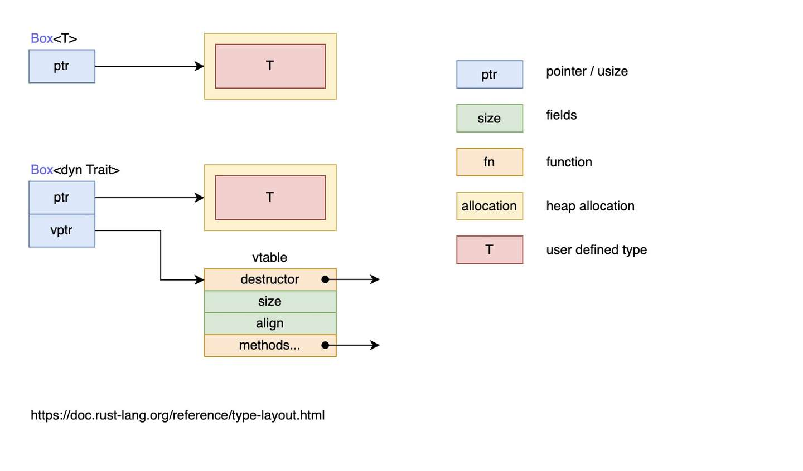

[**Playground**](https://play.rust-lang.org/)  
[The Rust Standard Library](https://doc.rust-lang.org/std/index.html)  
[Rust 标准库](https://www.rustwiki.org.cn/zh-CN/std/index.html)  

[Rust 程序设计语言](https://rustwiki.org/zh-CN/book/title-page.html)  
[Rust 程序设计语言](https://kaisery.github.io/trpl-zh-cn/title-page.html)  
[Rust语言圣经](https://course.rs/about-book.html)  
[通过例子学 Rust](https://www.rustwiki.org.cn/zh-CN/rust-by-example/)  
[Rust 秘典](https://nomicon.purewhite.io/intro.html)  

[Rust for Rustacean](https://github.com/rustaccato/road-to-being-master-rustacean)  
[Rust in Action](https://github.com/rustaccato/road-to-being-master-rustacean)  
[Zero to Production in Rust](https://github.com/rustaccato/road-to-being-master-rustacean)  

[The Cargo Book](https://doc.rust-lang.org/cargo/)  

[Asynchronous Programming in Rust](https://rust-lang.github.io/async-book/)  
[The Rustonomicon](https://doc.rust-lang.org/nomicon/)  


[**Rust Documentation**](https://doc.rust-lang.org/stable/)  
[Rust Lifetimes: A Complete Guide to Ownership and Borrowing](https://earthly.dev/blog/rust-lifetimes-ownership-burrowing/)  
[[rust笔记]]  
[Rust By Example](https://doc.rust-lang.org/stable/rust-by-example/)  
[The Rust Programming Language](https://doc.rust-lang.org/book/title-page.html)  
[The Rust Programming Language](https://doc.rust-lang.org/stable/book/title-page.html)  
[The Cargo Book](https://doc.rust-lang.org/stable/cargo/) #online  
[The Rust community’s crate registry](https://crates.io/)  
[The Rust Programming Language](https://doc.rust-lang.org/stable/book/)  
[RustPrimer](https://rustcc.gitbooks.io/rustprimer/content/)  
[How to Install Rust Programming Language on Debian 11](https://www.howtoforge.com/how-to-install-rust-programming-language-on-debian-11/)  
[Writing Interpreters in Rust: a Guide](https://rust-hosted-langs.github.io/book/)  
[Crafting Interpreters](https://craftinginterpreters.com/contents.html) #online  
[crafting-interpreters-rs](https://github.com/tdp2110/crafting-interpreters-rs)#github  
[rust-zmq](https://github.com/erickt/rust-zmq)  
[ZMQ inside a standard poll loop](https://blog.louiz.org/zmq)  
[The Rust Standard Library](https://doc.rust-lang.org/std/#primitives)  
[The Rust Reference](https://doc.rust-lang.org/stable/reference/)    
[Rust Ownership by Example](https://depth-first.com/articles/2020/01/27/rust-ownership-by-example/)  

[**From (C)Go to Rust**](https://radu-matei.com/blog/from-go-to-rust-static-linking-ffi/)  

## Examples
```rust
fn main() {
    let english = "hello world!";
    let chinese = "世界，你好";
    let regions = [english, chinese];
    for region in regions.iter() {
        println!("{}", &region);
    }
}

fn main() {		// Rust 程序入口函数main，该函数目前无返回值
    let a = 10;     // 1.使用let来声明变量，进行绑定，a是不可变的 2.编译器会默认根据a的值为a推断类型：i32 3.语句的末尾必须以分号结尾
    
    let b: i32 = 20;    // 主动指定b的类型为i32
    let mut c = 30i32;  // 30i32表示数值是30，类型是i32, mut表示c是可变的
    let d = 30_i32; // 在数值和类型中间添加下划线，增强代码可读性
    let e = add(add(a, b), add(c, d));

    // println!是宏调用，看起来像是函数但是它返回的是宏定义的代码块, {}是占位符，在具体执行过程中，会把e的值代入进来
    println!("( a + b ) + ( c + d ) = {}", e);
}

fn add(i: i32, j: i32) -> i32 {
    i + j   // 省略return
}

let s = "hello world";	// variable binding: 任何内存对象都是有主人的，而且一般情况下完全属于它的主人，绑定就是把这个对象绑定给一个变量，让这个变量成为它的主人

let _x = 5;		// 用下划线作为变量的开头，提示编译器忽略未使用的变量的警告

let (a, mut b): (bool, bool) = (true, false);   // a = true 不可变, b = false 可变
b = true;

//
struct Struct {
	e: i32
}

fn main() {
	let (a, b, c, d, e);

	(a, b) = (1, 2);
	[c, .., d, _] = [1, 2, 3, 4, 5];
	Struct {e, ..} = Struct {e: 5};

	assert_eq!([1, 2, 1, 4, 5], [a, b, c, d, e]);
}

// 常量不允许使用mut，常量自始至终不可改变，因为它的值是在编译时期确定的
// 常量使用const关键字进行声明，并且值的类型必须标注
const MAX_POINTS: u32 = 100_000;

fn main() {
    let x =  5;
    let x = x + 1;  // 变量遮蔽:在main函数的作用域内对之前的x进行遮蔽

    {
        let x = x * 2;  // 在当前的花括号作用域内，对之前的x进行遮蔽
        println!("The value of x in the inner scope is: {}", x);
    }

    println!("The value of x in the outer scope is: {}", x);
}

//
let spaces = "   ";         // 字符串类型
let spaces = spaces.len();  // usize数值类型

//
let mut spaces = "   ";
spaces = spaces.len();	// ERROR: expected `&str`, found `usize`

数值类型
	有符号整数(i8, i16, i32, i64, isize)
	无符号整数(u8, u16, u32, u64, usize)
	浮点数(f32, f64)
	NaN
	有理数,复数

整形字面量
98_222  // 十进制
0xff    // 十六
0o77    // 八
0b1111_0000 // 二
b'A'    // 字节(u8)

fn main() {
	let x = (-42.0_f32).sqrt();
	if x.is_nan() {
		println!("未定义的数学行为");
	}

	println!("{:.2}", 18.123);

	let i: u8 = 2;
	let shift: u8 = 3;
	println!("(a << b) value is {:08b}", i << shift);
}

序列
for i in 'a'..='z' {
	println!("{}", i)
}

字符串类型: 字符串字面量和字符串切片 &str
布尔类型: true, false
字符类型: 表示单个 Unicode 字符，存储为4个字节
	Rust的字符不仅仅是 ASCII，所有的 Unicode 值都可以作为Rust字符
	let c = 'z';
	let g = '国';

单元类型: ()，其唯一的值也是 ()
	main 函数返回 ()，println!()的返回值也是()
	没有返回值的函数在Rust中有单独的定义: 发散函数(diverge function)，即无法收敛的函数

类型推导与标注
	Rust 是一门静态类型语言
	Rust 编译器可以根据变量的值和上下文中的使用方式来自动推导出变量的类型

语句和表达式
	语句会执行一些操作但是不会返回值，语句以分号结尾
	表达式会在求值后返回一个值，表达式结尾没有分号
	Rust是基于表达式的语言

函数
fn add(i: i32, j: i32) -> i32 {
	i + j
}

fn clear(text: &mut String) -> () {
	*text = String::from("")
}

fn foever() -> ! {  // ! 表示函数永不返回
	loop {
		// ..
	}
}

fn dead_end() -> ! {
	panic!("panic !")
}

所有权原则
	1. Rust中的每一个值都被一个变量所拥有，该变量称为值的所有者
	2. 一个值同时只能被一个变量所拥有，或者说一个值只能拥有一个所有者
	3. 当所有者(变量)离开作用域时，这个值将被丢弃(drop)
// 1
let s1 = String::from("hello");
let s2 = s1;    // 所有权从s1转移到s2

// 2
let s = String::from("hello");
takes_ownership(s); // 所有权转移到函数里

fn takes_ownership(some_string: String) {
	println!("{}", some_string);
}   // some_string 移出作用域并调用 drop 方法，内存被释放

// 3
fn gives_ownership() -> String {
	let some_string = String::from("hello");
	some_string
}

fn takes_and_gives_back(a_string: String) -> Stirng {
	a_string
}

Rust永远也不会自动创建数据的"深拷贝"，任何自动的复制都不是深拷贝，可以被认为对运行性能影响较小
如果一个类型拥有 Copy 特征，旧的变量赋值给其他变量后仍然可用，即赋值的过程为拷贝的过程
	任何基本类型的组合可以 Copy，不需要分配内存或者某种形式资源的类型是可以Copy的
		所有整数类型
		布尔类型
		所有浮点类型
		字符串类型
		当且仅当元祖包含的类型都是Copy时
		不可变引用 &T

引用与借用
	获取变量的引用，称之为借用
	引用与解引用
let x = 5;
let y = &x;
assert_eq!(5, *y);

不可变引用
let s1 = String::from("hello");

let len = caculate_length(&s1);

fn caculate_length(s: &String) -> usize {   // & 符号是引用，允许使用值而不获取所有权
	s.len()
}

可变引用
let mut s = String::from("hello");

change(&mut s);

fn change(some_string: &mut String) {
	some_string.push_str(", world");
}

同一作用域，特定数据只能有一个可变引用
	let mut s = String::from("hello");

	let r1 = &mut s;
	let r2 = &mut s;    // error


可变应用与不可变引用不能同时存在
	let mut s = String::from("hello");

	let r1 = &s;
	let r2 = &s;
	let r3 = &mut s;    // error

	println!("{}, {}, and {}", r1, r2, r3);

引用作用域的结束位置从花括号到最后一次使用的位置
	fn main() {
		let mut s = String:from("hello");

		let r1 = &s;
		let r2 = &s;
		println!("{} and {}", r1, r2);  // r1, r2 作用域在这里结束

		let r3 = &mut s;
		println!("{}", r3);
	}   // r3 作用域在这里结束
引用的作用域从创建开始，一直持续到它最后一次使用的地方，这个跟变量的作用域不同，变量的作用域从创建开始持续到花括号结束
对于这种编译器的优化行为，Rust称为Non-Lexical Lifetimes(NLL)，专门用于找到某个引用在作用域(})结束前就不再被使用的代码位置

字符串切片
	字符串切片的类型标识是 `&str`，`&str`是一个不可变引用
	字符串字面量是切片，即 `let s = "hello";` 等价于 `let s: &str = "hello";`
	let s = String::from("hello world");

	let hello = &s[0..5];
	let world = &s[6..11];

	// 1
	let s = String::from("hello");

	let slice = &s[0..2];
	let slice = &s[..2];    // 从索引0开始

	// 2
	let s = String::from("hello");

	let len = s.len();

	let slice = &s[4..len];
	let slice = &s[4..];    // 包含最后一个字节

	// 3
	let s = String::from("hello");

	let len = s.len();

	let slice = &s[0..len];
	let slice = &s[..];     // 完整切片

	// 4
	fn main() {
		let mut s = String::from("hello world");

		let word = first_world(&s); // immutable borrow

		s.clear();  // error        // mutable borrow

		println!("the first word is: {}", word);    // immutable borrow
	}

	fn first_world(s: &String) -> &str {
		&s[..1]
	}

// clear 方法的声明为 `pub fn clear(&mut self)`，它需要一个可变引用
// 在 s.clear 处可变引用与不可变引用同时生效，编译无法通过

在对字符串使用切片语法时需要格外小心，切片的索引必须落在字符之间的边界位置，也就是 UTF-8 字符的边界
例如中文在 UTF-8 中占用三个字节，下面的代码就会崩溃：
	let s = "中国人";
	let a = &s[0..2];
	println!("{}", a);

数组切片
	let a = [1, 2, 3, 4, 5];
	let slice = &a[1..3];   // 该数组切片的类型为 &[i32]
	assert_eq!(slice, &[2, 3]);

字符串
	Rust中的字符是Unicode类型，每个字符占4个字节，而字符串是UTF-8编码，每个字符所占的字节数是变化的(14)，这样有助于降低字符串所占用的内存空间
	Rust在语言级别只有一种字符串类型：str，通常是以引用类型出现 &str，即字符串切片。但在标准库里，多种不同用途的字符串类型，使用最广的是String类型，还有OsString，OsStr，CsString，CsStr等，以String或者Str结尾，分别对应具有所有权和被借用的变量
	String 是一个可增长，可改变且具有所有权的UTF-8编码字符串

String与&str的转换
	// &str -> String
	String::from("hello")
	"hello".to_string()

	// String -> &str (取引用即可)
	fn main() {
		let s = String::from("hello");
		say_hello(&s);
		say_hello(&s[..]);
		say_hello(s.as_str());
	}

	fn say_hello(s: &str) {
		println!("{}", s);
	}

Rust 不允许取索引字符串，因为对于String类型，需要从0开始去遍历字符串来定位合法字符，性能表现无法达到O(1)
	let hello = String::from("中国人");
	// 字符串的底层的数据存储格式实际上是[ u8 ]，一个字节数组
	// 该字符串实际占用9个字节的长度，大部分常用汉字在UTF-8中的长度是3个字节，访问&hello[0]没有任何意义
	let s = &hello[0..2];
	// 字符串切片无法保证索引的字节刚好落在字符的边界上，导致程序崩溃

字符创操作
	let mut s = String::from("hello ");

	s.push_str("rust"); // 追加字符串
	s.push('!');        // 追加字符

	// 插入
	let mut s = String::from("hello rust!");

	s.insert(5, ' ');           // 插入字符
	s.insert_str(6, "I like");  // 插入字符串

	// 替换
	// 1
	let s = String::from("I like rust");
	let new_s = s.replace("rust", "RUST");  // 返回新的字符串
	dbg!(new_s);

	// 2
	let s = String::from("I like rust, learning rust is good");
	let new_s = s.replacen("rust", "RUST", 1);  // 返回新的字符串
	dbg!(new_s);

	// 3
	let mut s = String::from("I like rust");
	s.replace_range(7..8, "R");  // 操作原来的字符串
	dbg!(new_s);

	// 删除
	// 1 删除并返回字符串的最后一个字符
	let mut s = String::from("rust pop 中文!");
	let p1 = s.pop();
	let p2 = s.pop();
	dbg!(p1);
	dbg!(p2);
	dbg!(s);

	// 2 删除并返回字符串中指定位置的字符
	let mut s = String::from("测试remove方法");
	println!("size of s: ", std::mem::size_of_val(s.as_str()));
	s.remove(0);
	s.remove(1);    // error (参数所给的位置不是合法的字符边界)

	// 3 删除字符串中从指定位置开始到结尾的全部字符
	let mut s = String::from("测试truncate");
	s.truncate(3);
	dbg!(s);

	// 连接
	// 1 使用 + 或者 += 连接字符串，要求右边的参数必须为字符串的切片引用类型(Slice)
	let s1 = String::from("hello ");
	let s2 = String::from("rust");

	// 返回新的字符串
	let result = s1 + &s2; // &s2会自动解引用为 &str
	let mut result = result + "!";
	result += "!!!";

	println!("{}", result);

	// 2 使用 format! 连接字符串
	let s1 = "hello";
	let s2 = String::from("rust");
	let s = format!("{} {}!", s1, s2);
	println!("{}", s)

字符串转义
操作 UTF-8 字符串
	// 字符
	// 以 Unicode 字符的方式遍历字符串，最好的办法是使用 chars 方法
	for c in "中国人".chars() {
		println!("{}", c);
	}

	// 字节
	for b in "中国人".bytes() {
		println!("{}", b);
	}

元组
	元组由多种类型组合而成，元组长度固定，元组中元素的顺序也是固定的
	// 1 创建元组
	let tup: (i32, f64, u8) = (500, 6.4, 1);

	// 2 用模式匹配解构元组
	let tup = (500, 6.4, 1);
	let (x, y, z) = tup;

	// 3 用 . 访问元组
	let x: (i32, f64, u8) = (500, 6.4, 1);
	let one = x.2;

	// 4
	fn main() {
		let s = String::from("hello");

		let (s2, len) = caculate_length(s1);

		println!("The length of '{}' is {}.", s2, len);
	}

	fn calculate_length(s: String) -> (String, usize) {
		let length = s.len();

		(s, length)
	}

	// (10, 20, 30) 本身不具备任何清晰的含义，因此应该使用 元组结构体

结构体
	struct User {
		active: bool,
		username: String,
		email: String,
		sign_in_count: u64,
	}

	// 创建结构体实例
	let user1 = User {
		email: String::from("someone@example.com"),
		username: String::from("someone"),
		active: true,
		sign_in_count: 1,
	};
	user1.email = String::from("anothermainl@example.com")
	// 1 每个字段都必须进行初始化
	// 2 初始化字段顺序不需要和结构体定义的顺序一致

	// 简化结构体创建
	fn build_user(email: String, username: String) -> User {
		User {
			email: email,
			username: username,
			active: true,
			sign_in_count: 1,
		}
	}
	// 进一步简化为
	fn build_user(email: String, username: String) -> User {
		User {
			email,
			username,
			active: true,
			sign_in_count: 1,
		}
	}

	// 根据已由结构体实例创建新的结构体实例
	let user2 = User {
		active: user1.active,
		username: user1.username,
		email: String::from("another@example.com"),
		sign_in_count: user1.sign_ing_count,
	};
	// 进一步简化为
	let user2 = User {
		email: String::from("another@example.com"),
		..user1     // ..user1 必须在结构体尾部
	};

单元结构体
	单元结构体没有任何字段和属性
	如果定义一个类型，但不关心该类型的内容，只关心它的行为，此时可以使用 单元结构体
	struct AlwaysEqual;

	let subject = AlwaysEqual;

	impl SomeTrait for AlwaysEqual {

	}

使用 #[derive(Debug)] 打印结构体信息
	Rust 默认不会为结构体实现 Debug，为了实现，有两种方式
		1. 手动实现
		2. 使用 derive 派生实现

#[derive(Debug)]
	struct Rectangle {
		width: u32,
		height: u32,
	}

	fn main() {
		let rect1 = Rectangle {
			width: 30,
			height: 50,
		};

		println!("rect1 is {:?}", rect1);
		println!("rect1 is {:#?}", rect1);
	}

	// 使用 dbg! 宏输出debug信息，它会拿走表达式的所有权，然后打印出相应的文件名，行号等debug信息，最终会把表达式的所有权返回
	#[derive(Debug)]
	struct Rectangle {
		width: u32,
		height: u32,
	}

	fn main() {
		let scale = 2;
		let rect1 = Rectangle {
			width: dbg!(30 * scale),
			height: 50,
		};

		dbg!(&rect1);
	}

枚举
	// 实现 1
	enum PokerSuit {
		Clubs,
		Spades,
		Diamonds,
		Hearts,
	}

	struct PokerCard {
		suit: PokerSuit,
		value: u8
	}

	fn main() {
		let c1 = PokerCard {
			suit: PokerSuit::Clubs,
			value: 1,
		};
		let c2 = PokerCard {
			suit: PokerSuit::Diamonds,
			value: 12,
		};
	}

	// 改进后的实现
	enum PokerCard {
		Clubs(u8),
		Spades(u8),
		Diamonds(char),
		Hearts(char),
	}

	fn main() {
		let c1 = PokerCard::Spades(5);
		let c2 = PokerCard::Diamonds('A');
	}

	// ex 1
	struct Ipv4Addr {
		// snip
	}

	struct Ipv6Addr {
		// snip
	}

	enum IpAddr {
		V4(Ipv4Addr),
		V6(Ipv6Addr),
	}

	// ex 2
	enum Message {
		Quit,
		Move { x: i32, y: i32 },
		Write(String),
		ChangeColor(i32, i32, i32),
	}

	fn main() {
		let m1 = Message::Quit;
		let m2 = Message::Move{x:1,y:1};
		let m1 = Message::ChangeColor(255,255,0);
	}

Option 枚举用于处理空值
	Option<T> 枚举被包含在了 prelude 之中，不需要显示引入作用域，同时它的成员 Some 和 None 无需使用 Option:: 前缀就可以直接使用
	enum Option<T> {    // T 是泛型参数
		Some(T),        // Some(T)表示该枚举成员的数据类型是T，即 Some 可以包含任何类型的数据
		None,
	}

	// 1
	fn plus_one(x: Option<i32>) -> Option<i32> {
		match x {
			None => None,
			Some(i) => Some(i + 1),
		}
	}

	let five = Some(5);
	let six = plus_one(five);
	let none = plus_one(None);

数组
	1. 长度固定
	2. 元素必须有相同的类型
	3. 一次线性排列
	let months = ["Jan", "Feb", "Mar", "Apr", "May", "Jun", "Jul", "Aug", "Sep", "Oct", "Nov", "Dec"];

	let a1: [i32; 5] = [1, 2, 3, 4, 5];  // 5 是数组长度
	let a2 = [3; 5];        // 某个值重复出现N次的数组
	let first = a1[0];      // 数组 a1 的第一个元素

	// 数组类型为非基本类型
	let array: [String; 8] = std::array::from_fn(|_i| String::from("rust is good!"));
	println!("{:#?}", array);

	// 数组切片
	let a: [i32; 5] = [1, 2, 3, 4, 5];

	let slice: &[i32] = &a[1..3];   // slice 的类型为 &[i32]

	assert_eq!(slice, &[2, 3]);

	// 切片的长度可以与数组不同，并不是固定的，而是取决于你使用时指定的起始和节数位置
	// 创建切片的代价非常小，因为切片只是针对底层数组的一个引用
	// 切片类型[T]拥有不固定的大小，而切片引用类型 &[T] 则具有固定大小，因为 Rust 很多时候都需要固定大小的数据类型，因此 &[T] 更有用

	// example
	fn main() {
		let one = [1, 2, 3];
		let two: [u8; 3] = [1, 2, 3];
		let blank1 = [0; 3];
		let blank2: [u8; 3] = [0; 3];

		let arrays: [[u8; 3]; 4] = [one, two, blank1, blank2];

		for a in &arrays {
			print!("{:?}: ", a);

			for n in a.iter() {
				print!("\t{} + 10 = {}", n, n+10);
			}

			let mut sum = 0;
			for i in 0..a.len() {
				sum += a[i];
			}
			println!("\t{:?} = {}", a, sum);
		}
	}

流程控制
	// if
	fn main() {
		let n = 6;

		if n % 4 == 0 {
			println!("number is divisible by 4");
		} else if n % 3 == 0 {
			println!("number is divisible by 3");
		} else if n % 2 == 0 {
			println!("number is divisible by 2");
		} else {
			println!("number is not divisible by 4, 3, or 2");
		}
	}

	// for
	// 1
	for item in collection
	等价于
	for item in IntoIterator::into_iter(collection)
	转移所有权
	// 2
	for item in &collection
	等价于
	for item in collection.iter()
	不可变借用
	// 3
	for item in &mut collection
	等价于
	for item in collection.iter_mut()
	可变借用

	// ex 1
	fn main() {
		let a = [4, 3, 2, 1];
		for (i, v) in a.iter().enumerate() {
			println!("The {} element is {}", i + 1, v);
		}
	}

	// ex 2
	for _ in 0..10 {
		// ....
	}

	// 两种 for 循环
	// 1 索引访问是非连续的，存在两次访问之间collection发生变化的可能
	let collection = [1, 2, 3, 4, 5];
	for i in 0..collection.len() {
		let item = collection[i];
		// ...
	}
	// 2 (更安全)
	for item in collection {
		// ...
	}

	// continue
	for i in 1..4 {
		if i == 2 {
			continue;
		}
		println!("{}", i);
	}

	// break
	for i in 1..4 {
		if i == 2 {
			break;
		}
		println!("{}", i);
	}

	// while
	fn main() {
		let mut n = 0;

		which n <= 5 {
			println!("{}!", n);

			n = n + 1;
		}

		println!("out !");
	}

	// for 不会使用索引去访问数组，因此更安全也更简介，同时避免运行时的边界检查，性能更好
	fn main() {
		let a = [10, 20, 30, 40, 50];

		for element in a.iter() {
			println!("the value is: {}", element);
		}
	}

	// loop
	fn main() {
		let mut counter = 0;

		let result = loop {
			counter += 1;

			if counter == 10 {
				break counter * 2;
			}
		};

		println!("The result is {}", result);
	}

模式匹配
match
	1. match 匹配必须要穷举出所有可能，_用来代表未列出的所有可能性
	2. match 的每一个分支都必须是一个表达式，且所有分支的表达式最终返回值的类型必须相同
	3. X | Y 代表该分支可以匹配 X 或者 Y
	// 1
	enum Direction {
		East,
		West,
		North,
		South,
	}

	fn main() {
		let dire = Direction::South;
		match dire {
			Direction::East => println!("East"),
			Direction::North | Direction::South => {
				println!("South or North");
			},
			- => println!("West"),
		};
	}

	// 2
	enum Coin {
		Penny,
		Nickel,
		Dime,
		Quarter,
	}

	fn value_in_cents(coin: Coin) -> u8 {
		match coin {
			Coin::Penny => {
				println!("Lucky penny!");
				1
			},
			Coin::Nickel => 5,
			Coin::Dime => 10,
			Coin::Quarter => 25,
		}
	}

	// 3 match 本身也是一个表达式
	enum IpAddr {
		Ipv4,
		Ipv6
	}

	fn main() {
		let ip1 = IpAddr::Ipv6;
		let ip_str = match ip1 {
			IpAddr::Ipv4 => "127.0.0.1",
			_ => "::1",
		};

		println!("{}", ip_str);
	}

模式绑定
		enum Action {
			Say(String),
			MoveTo(i32, i32),
			ChangeColorRGB(u16, u16, u16),
		}

		fn main() {
			let actions = [
				Action::Say("Hello Rust".to_string()),
				Action::MoveTo(1, 2),
				Action::ChangeColorRGB(255, 255, 0),
			];

			for action in actions {
				match action {
					Action::Say(s) => {
						println!("{}", s);
					},
					Action::MoveTo(x, y) => {
						println!("point from (0, 0) move to ({}, {})", x, y);
					},
					Action::ChangeColorRGB(r, g, _) => {
						println!("change color into '(r:{}, g:{}, b:0)', 'b' has been ignored", r, g,
						);
					}
				}
			}
		}

通配符
	let some_u8_value = 0u8;
	match some_u8_value {
		1 => println!("one"),
		3 => println!("three"),
		5 => println!("five"),
		7 => println!("seven"),
		_ => (),
	}

	// 也可以用一个变量承载其他情况
	#[derive(Debug)]
	enum Direction {
		East,
		West,
		North,
		South,
	}

	fn main() {
		let dire = Direction::South;
		match dire {
			Direction::East => println!("East"),
			other => println!("other direction: {:?}", other),
		};
	}

if let 匹配
	有时只有一个模式的值需要被处理，其他值直接忽略，用match处理显得略显麻烦
	当你只要匹配一个条件，其忽略其他条件时就用 if let，否则用 match
	let v = Some(3u8);
	match v {
		Some(3) => println!("three"),
		_ => (),
	}

	// 使用 if let
	if let Some(3) = v {
		println!("three");
	}

matches! 宏
	matches! 将一个表达式跟模式进行匹配，然后返回匹配的结果 true 或者 false
	// 1 过滤元素
	enum MyEnum {
		Foo,
		Bar
	}

	fn main() {
		let v = vec![MyEnum::Foo, MyEnum::Bar, MyEnum::Foo];

		v.iter().fiter(|x| matches!(x, MyEnum::Foo));
	}

	// 2
	let foo = 'f';
	assert!(matches!(foo, 'A'..='Z' | 'a'..='z'));

	let bar = Some(4);
	assert!(matches!(bar, Some(x) if x > 2))

变量遮蔽
	无论是 match 还是 if let，这里都是一个新的代码块，而且这里的绑定相当于新变量，如果你使用同名变量，会发生变量遮蔽
	fn main() {
		let age = Some(30);
		println!("Before match, age is {:?}", age);
		if let Some(age) = age {
			println!("Matched age is {}", age);
		}

		println!("After match, age is {:?}", age);
	}

解构 Option
	fn plus_one(x: Option<i32>) -> Option<i32> {
		match x {
			None => None,
			Some(i) => Some(i + 1),
		}
	}

	let five = Some(5);
	let six = plus_one(five);
	let none = plus_one(None);

模式 (match的每个分支就是一个模式)
	字面量
	解构的数组，枚举，结构体或者元组
	变量
	通配符
	占位符
	// match
	match VALUE {
		PATTERN => EXPRESSION,
		PATTERN => EXPRESSION,
		_ => EXPRESSION,
	}

	// if let
	if let PATTERN = SOME_VALUE {

	}

	// while let
	let mut stack = Vec::new();

	stack.push(1);
	stack.push(2);
	stack.push(3);

	while let Some(top) = stack.pop() {
		println!("{}", top);
	}

	// for
	let v = vec!['a', 'b', 'c'];

	for (index, value) in v.iter().enumerate() {
		println!("{} is at index {}", value, index)
	}

	// let
	let x = 5;  // x 也是一种模式匹配，代表将匹配的值绑定到变量 x 上，即变量名也是一种模式
	let (x, y, z) = (1, 2, 3);

	// 函数参数也是模式
	fn foo(x: i32) {
		// ...
	}

	fn print_coordinates(&(x, y): &(i32, i32)) {
		println!("Current localtion: ({}, {})", x, y);
	}

	fn main() {
		let point = (3, 5);
		print_coordinates(&point);
	}
	&(3, 5) 会匹配模式 &(x, y)，因此 x 得到 3， y 得到 5

	// let 和 if let
	let Some(x) = some_option_value; // error，因为右边的值可能不为 Some，而是 None，这种时候不能进行匹配

	类似 let, for 和 match 都必须要求完全覆盖匹配，才能通过编译(不可驳模式匹配)

	if let 允许匹配一种模式，而忽略其余的模式(可驳模式匹配)
	if let Some(x) = some_option_value {
		println!("{}", x);
	}

	let-else 可使得 let 变为可驳模式，它可以使用 else 分支来处理模式不匹配的情况，但是 else 分支中必须用发散的代码块处理(例如：break, return, panic)

全模式列表
	// 匹配字面量
	let x = 1;

	match x {
		1 => println!("one"),
		2 => println!("two"),
		3 => println!("three"),
		_ => println!("anything"),
	}

	// 匹配变量名
	fn main() {
		let x = Some(50);
		let y = 10;

		match x {
			Some(50) => println!("Got 50"),
			Some(y) => println!("Matched, y = {:?}", y),
			_ => println!("Default case, x = {:?}", x),
		}

		println!("at the end: x = {:?}, y = {:?}", x, y);
	}

	// 单分支多模式
	let x = 1;

	match x {
		1 | 2 => println!("one or two"),
		3 => println!("three"),
		_ => println!("anything"),
	}

	// 通过序列 ..= 匹配值的范围
	// 序列只允许用于数字或字符类型，原因是它们可以连续，同时编译器可以检查该序列是否为空，字符和数字值是Rust中仅有的可以用于判断是否为空的类型
	let x = 5;

	match x {
		1..=5 => println!("one through five"),
		_ => println!("something else"),
	}

	let x = 'c';

	match x {
		'a'..='j' => println!("early ASCII letter"),
		'k'..='z' => println!("late ASCII letter"),
		_ => println!("something else"),
	}

	// 解构并分解值

	// 解构结构体
	struct Point {
		x: i32,
		y: i32,
	}

	fn main() {
		let p = Point { x: 0, y: 7 };

		let Point { x: a, y: b } = p;   // 模式中的变量名不必与结构体中的字段名一致
		assert_eq!(0, a);
		assert_eq!(7, b);
	}

	// 2
	fn main() {
		let p = Point { x: 0, y: 7 };

		match p {
			Point { x, y: 0 } => println!("On the x axis at {}", x),
			Point { x: 0, y } => println!("On the y axis at {}", y),
			Point { x, y: 0 } => println!("On neither x axis: ({}, {})", x, y),
		}
	}

	// 解构枚举
	enum Message {
		Quit,
		Move { x: i32, y: i32 },
		Write(String),
		ChangeColor(i32, i32, i32),
	}

	fn main() {
		let msg = Message::ChangeColor(0, 160, 255);

		match msg {
			Message::Quit => {
				println!("The Quit variant has no data to destructure.")
			}
			Message::Move { x, y } => {
				println!(
					"Move in the x direction {} and in the y direction {}",
					x,
					y
				);
			}
			Message::Write(text) => println!("Text message: {}", text),
			Message::ChangeColor(r, g, b) => {
				println!(
					"Change the color to red {}, green {}, and blue {}",
					r,
					g,
					b
				)
			}
		}
	}

	// 解构嵌套的结构体和枚举
	enum Color {
	Rgb(i32, i32, i32),
	Hsv(i32, i32, i32),
	}

	enum Message {
		Quit,
		Move { x: i32, y: i32 },
		Write(String),
		ChangeColor(Color),
	}

	fn main() {
		let msg = Message::ChangeColor(Color::Hsv(0, 160, 255));

		match msg {
			Message::ChangeColor(Color::Rgb(r, g, b)) => {
				println!(
					"Change the color to red {}, green {}, and blue {}",
					r,
					g,
					b
				)
			}
			Message::ChangeColor(Color::Hsv(h, s, v)) => {
				println!(
					"Change the color to hue {}, saturation {}, and value {}",
					h,
					s,
					v
				)
			}
			_ => ()
		}
	}

	// 解构结构体和元组
	struct Point {
		x: i32,
		y: i32,
	}

	let ((feet, inches), Point {x, y}) = ((3, 10), Point { x: 3, y: -10 });

	// 解构数组
	// 定长数组
	let arr: [u16; 2] = [114, 514];
	let [x, y] = arr;

	assert_eq!(x, 114);
	assert_eq!(y, 514);

	// 不定长数组
	let arr: &[u16] = &[114, 514];

	if let [x, ..] = arr {
		assert_eq!(x, &114);
	}

	if let &[.., y] = arr {
		assert_eq!(y, 514);
	}

	let arr: &[u16] = &[];

	assert!(matches!(arr, [..]));
	assert!(!matches!(arr, [x, ..]));

	// 忽略模式中的值
	// 使用 _ 忽略整个值
	fn foo(_: i32, y: i32) {
		println!("This code only uses the y parameter: {}", y);
	}

	fn main() {
		foo(3, 4);
	}
	// 使用嵌套的 _ 忽略部分值
	let mut setting_value = Some(5);
	let new_setting_value = Some(10);

	match (setting_value, new_setting_value) {
		(Some(_), Some(_)) => {
			println!("Can't overwrite an existing customized value");
		}
		_ => {
			setting_value = new_setting_value;
		}
	}

	println!("setting is {:?}", setting_value);

	// 使用下划线开头忽略未使用的变量
	fn main() {
		let _x = 5;
		let y = 10;
	}
	// 用 .. 忽略剩余值
	struct Point {
		x: i32,
		y: i32,
		z: i32,
	}

	let origin = Point { x: 0, y: 0, z: 0 };

	match origin {
		Point { x, .. } => println!("x is {}", x),
	}
	// 用 .. 来忽略元组中间的某些值
	fn main() {
		let numbers = (2, 4, 8, 16, 32);

		match numbers {
			(first, .., last) => {
				println!("Some numbers: {}, {}", first, last);
			},
		}
	}

	// 匹配守卫提供的额外条件
	// 匹配守卫（match guard）是一个位于 match 分支模式之后的额外 if 条件，它能为分支模式提供更进一步的匹配条件
	fn main() {
		let x = Some(5);
		let y = 10;

		match x {
			Some(50) => println!("Got 50"),
			Some(n) if n == y => println!("Matched, n = {}", n),
			_ => println!("Default case, x = {:?}", x),
		}

		println!("at the end: x = {:?}, y = {}", x, y);
	}
	// 匹配守卫 if n == y 并不是一个模式所以没有引入新变量。这个 y 正是 外部的 y 而不是新的覆盖变量 y，这样就可以通过比较 n 和 y 来表达寻找一个与外部 y 相同的值的概念了

	// 也可以在匹配守卫中使用 或 运算符 | 来指定多个模式，同时匹配守卫的条件会作用于所有的模式
	let x = 4;
	let y = false;

	match x {
		4 | 5 | 6 if y => println!("yes"),
		_ => println!("no"),
	}
	这个匹配条件表明此分支只匹配 x 值为 4、5 或 6 同时 y 为 true 的情况
	(4 | 5 | 6) if y => ...

	// @绑定
	// @（读作 at）运算符允许为一个字段绑定另外一个变量
	enum Message {
		Hello { id: i32 },
	}

	let msg = Message::Hello { id: 5 };

	match msg {
		Message::Hello { id: id_variable @ 3..=7 } => {
			println!("Found an id in range: {}", id_variable)
		},
		Message::Hello { id: 10..=12 } => {
			println!("Found an id in another range")
		},
		Message::Hello { id } => {
			println!("Found some other id: {}", id)
		},
	}

	// @前绑定后解构(Rust 1.56 新增)
	#[derive(Debug)]
	struct Point {
		x: i32,
		y: i32,
	}

	fn main() {
		// 绑定新变量 `p`，同时对 `Point` 进行解构
		let p @ Point {x: px, y: py } = Point {x: 10, y: 23};
		println!("x: {}, y: {}", px, py);
		println!("{:?}", p);


		let point = Point {x: 10, y: 5};
		if let p @ Point {x: 10, y} = point {
			println!("x is 10 and y is {} in {:?}", y, p);
		} else {
			println!("x was not 10 :(");
		}
	}

方法
	// 定义方法
	struct Circle {
		x: f64,
		y: f64,
		radius: f64,
	}

	impl Circle {
		// new 是 Circle 的关联函数，因为它的第一个参数不是 self，且 new 并不是关键字
		// 这种方法往往用于初始化当前结构体实例
		fn new(x: f64, y: f64, radius: f64) -> Circle {
			Circle {
				x: x,
				y: y,
				radius: radius,
			}
		}

		// Circle 的方法，&self 表示借用当前的 Circle 结构体
		fn area(&self) -> f64 {
			std::f64::consts::PI * (self.radius * self.radius)
		}
	}

	// 2
	#[derive(Debug)]
	struct Rectangle {
		fn area(&self) -> u32 {
			self.width * self.height
		}
	}

	fn main() {
		let rect1 = Rectangle { width: 30, height: 50 };

		println!("The area of the rectangle is {} square pixels.", rect1.area());
	}

`self`, `&self` 和 `&mut self`
	self 的使用就跟函数参数一样，要严格遵守 Rust 的所有权规则
	#[derive(Debug)]
	struct Rectangle {
		width: u32,
		height: u32,
	}

	impl Rectangle {
		fn area(&self) -> u32 {
			self.width * self.height
		}
	}

	// 在 area 的签名中，&self 是 self: &Self 的简写，它替代了 rectangle:&Rectangle
	// 在一个 impl 块内， Self 指代被实现防范的结构体类型，self 指代此类型的实例

	self 的使用就跟函数参数一样，要严格遵守 Rust 的所有权规则
	1. self 表示 Rectangle 的所有权转移到该方法中，这种形式用的较少
	2. &self 表示该方法对 Rectangle 的不可变借用
	3. &mut self 表示可变借用

	使用方法代替函数的好处
	1. 不用在函数签名中重复书写 self 对应的类型
	2. 代码的组织性和内聚性更强，对于代码维护和阅读来说，好处巨大

	// 方法名跟结构体字段名相同
	// 一般来说，方法跟字段同名，往往适用于实现 getter 访问器
	mod my {
		pub struct Rectangle {
			width: u32,
			pub height: u32,
		}

		impl Rectangle {
			pub fn new(width: u32, height: u32) -> Self {
				Rectangle { width, height }
			}
			pub fn width(&self) -> u32 {
				return self.width;
			}
			pub fn height(&self) -> u32 {
				return self.height;
			}
		}
	}

	当使用 object.something() 调用方法时，Rust 会自动为 object 添加 &、&mut 或 * 以便使 object 与方法签名匹配。也就是说，这些代码是等价的：
	p1.distance(&p2);
	(&p1).distance(&p2);

带有多个参数的方法
impl Rectangle {
	fn area(&self) -> u32 {
		self.width * self.height
	}

	fn can_hold(&self, other: &Rectangle) -> bool {
		self.width > other.width && self.height > other.height
	}
}

// 关联函数 (定义在 impl 中且没有 self 的函数被称之为关联函数)
impl Redtangle {
	fn new(w: u32, h: u32) -> Rectangle {
		Rectangle { width: w, height: h }
	}
}

// 多个 impl 定义
impl Rectangle {
	fn area(&self) -> u32 {
		self.width * self.height
	}
}

impl Rectangle {
	fn can_hold(&self, other: &Rectangle) -> bool {
		self.width > other.width && self.height > other.height
	}
}

// 为枚举实现方法
#![allow(unused)]
enum Message {
	Quit,
	Move { x: i32, y: i32 },
	Write(String),
	ChangeColor(i32, i32, i32),
}

impl Message {
	fn call(&self) {
		// ...
	}
}

fn main() {
	let m = Message::Write(String::from("hello"));
	m.call();
}

泛型和特征
	结构体中使用泛型
	struct Point<T> {
		x: T,
		y: T,
	}

	fn main() {
		let integer = Point { x: 5, y: 10 };
		let float = Point { x: 1.0, y: 4.0 };
	}

枚举中使用泛型
	// Option<T> 是一个拥有泛型 T 的枚举类型，它第一个成员是 Some(T)，存放了一个类型为 T 的值，第二个成员是 None，表示没有值
	// 用作返回值，判断值的存在与否
	enum Option<T> {
		Some(T),
		None
	}

	// 用作返回值，判断值的正确与否
	enum Result<T, E> {
		Ok(T),
		Err(E),
	}

方法中使用泛型
	struct Point<T> {
		x: T,
		y: T,
	}

	impl<T> Point<T> {
		fn x(&self) -> &T {
			&self.x
		}
	}

	fn main() {
		let p = Point { x: 5, y: 10 };

		println!("p.x = {}", p.x());
	}

为具体的泛型实现方法
		// Point<f32> 类型会有方法 distance_from_origin，而其他 T 不是 f32 类型的 Point<T> 实例则没有定义此方法
		impl Point<f32> {
			fn distance_from_origin(&self) -> f32 {
				(self.x.powi(2) + self.y.powi(2)).sqrt()
			}
		}

const 泛型
		// const 泛型是针对值的泛型，可以用来处理数组长度的问题
		// 1
		fn display_array(arr: [i32; 3]) {
			println!("{:?}", arr);
		}

		fn main() {
			let arr: [i32; 3] = [1, 2, 3];
			display_array(arr);

			let arr: [i32; 2] = [1, 2];
			display_array(arr); // error：[i32; 2] 和 [i32; 3] 属于不同的数据类型，函数的参数类型不匹配
		}

		// 2 使用数组切片，传入 arr 的不可变引用
		fn display_array(arr: &[i32]) {
			println!("{:?}", arr);
		}

		fn main() {
			let arr: [i32; 3] = [1, 2, 3];
			display_array(&arr);

			let arr: [i32; 2] = [1, 2];
			display_array(&arr);
		}

		// 3 泛型
		fn display_array<T: std::fmt::Debug>(arr: &[T]) {   // 需要对 T 加一个限制 std::fmt::Debug，因为 {:?} 形式的格式化输出需要 arr 实现该特征
			println!("{:?}", arr);
		}

		fn main() {
			let arr: [i32; 3] = [1, 2, 3];
			display_array(&arr);

			let arr: [i32; 2] = [1, 2];
			display_array(&arr);
		}

		// 4 利用 const 泛型，即针对值的泛型，处理数组长度的问题
		fn display_array<T: std::fmt::Debug, const N: usize>(arr: [T; N]) { // const 泛型 N ，它基于的值类型是 usize
			println!("{:?}", arr);
		}

		fn main() {
			let arr: [i32; 3] = [1, 2, 3];
			display_array(arr);

			let arr: [i32; 2] = [1, 2];
			display_array(arr);
		}

const fn
	// const fn 即 常量函数， 允许编译器对函数进行求值，从而实现更高效，更灵活的设计
	// 1
	const fn add(a: usize, b: usize) -> usize {
		a + b
	}

	const RESULT: usize = add(5, 10);

	fn main() {
		println!("")
	}

结合 const fn 与 const 泛型
	// 创建固定大小的缓冲区解构，其中缓冲区大小由编译期计算确定
	struct Buffer<const N: usize> {
		data: [u8; N],
	}

	const fn compute_buffer_size(factor: usize) -> usize {
		factor * 1024
	}

	fn main() {
		const SIZE: usize = compute_buffer_size(4);
		let buffer = Buffer::<SIZE> {
			data: [0; SIZE],
		};

		println!("Buffer size: {} bytes", buffer.data.len());
	}

泛型的性能
> Rust 通过在编译时进行泛型代码的单态化(monomorphization)来保证效率，单态化是通过填充编译时使用的具体类型，将通用代码转换为特定代码的过程
	对如下代码
	let integer = Some(5);
	let float = Some(5.0);
	编译器生成的单态化版本的代码看起来如下
	enum Option_i32 {
		Some(i32),
		None,
	}

	enum Option_f64 {
		Some(f64),
		None,
	}

	fn main() {
		let integer = Option_i32::Some(5);
		let float = Option_f64::Some(5.0);
	}

特征 trait
trait 类似于其他语言中的接口的概念，它定义了一组可以被共享的行为，只要实现了该特征，你就能使用这组行为
	如果不同的类型具有相同的行为，那么就可以定义一个特征，然后为这些类型实现该特征。定义特征是把一些方法组合在一起，目的是定义一个实现某些目标所必须的行为的集合
	特征只定义行为看起来是什么样子，而不定义行为的具体实现，因此特征方法签名的结尾是 ; 而不是 {}
	每一个实现这个特征的类型都需要具体实现该特征的相应方法，编译器也会确保任何实现该特征的类型都拥有与这个签名的定义完全一致的方法
	// 1
	pub trait Summary {
		fn summarize(&self) -> String;
	}

	pub struct Post {
		pub title: String,
		pub author: String,
		pub content: String,
	}

	impl Summary for Post {
		fn summarize(&self) -> String {
			format!("title: {}, author: {}", self.title, self.author);
		}
	}

	pub struct Weibo {
		pub username: String,
		pub content: String,
	}

	impl Summary for Weibo {
		fn summarize(&self) -> String {
			format!("{} posted {}", self.username, self.content)
		}
	}

	fn main() {
		let post = Post { title: "Rust intro".to_string(), author: "Sun".to_string(), content: "Rust is good".to_string() };
		let weibo = Weibo { username: "Sun".to_string(), content: "Rust is really good".to_string() };
		
		println!("{}", post.summarize());
		pritnln!("{}", weibo.summarize());
	}

特征定义与实现的位置(孤儿规则)
	特征被定义为 pub 时，他人想要使用该特征时，可以引入该特征到他们的保重，然后进行实现
	如果你想为类型 A 实现特征 T，那么 A 或者 T 至少有一个是在当前作用域中定义的
	孤儿规则，可以确保其他人编写的代码不会破坏你的代码，也确保了不会莫名其妙破坏风牛马不相及的代码

在特征中定义具有默认实现的方法
	pub trait Summary {
		fn smmarize(&self) -> String {
			String::from("Read more ... ")
		}
	}

	impl Summary for Post {}

	impl Summary for Weibo {
		fn summarize(&self) -> String {
			format!("{} posted {}", self.username, self.content)
		}
	}

默认实现允许调用相同特征中的其他方法，哪怕这些方法没有默认实现
	pub trait Summary {
		fn summarize_author(&self) -> String;

		fn summarize(&self) -> String {
			String::from("Read more from {} ... ", self.summarize_author())
		}
	}
	// 为了使用 Summary，只需要实现 summarize_author 方法即可
	impl Summary for Weibo {
		fn summarize_author(&self) -> String {
			format!("@{}", self.username)
		}
	}

	println!("1 new webo: {}", weibo.summarize());

使用特征作为函数参数
	可以使用任何实现了该特征的类型作为函数的参数，同时在函数体内，可以调用该特征的方法
	pub fn notify(item: &impl Summary) {
		println!("Breaking news! {}", item.summarize());
	}

特征约束(trait bound)
	impl Trait 这种语法实际上只是一个语法糖

	pub fn notify(item: &impl Summary) {
		println!("Breaking new! {}", item.summarize());
	}
	完整的形式如下：
	pub fn notify<T: Summary>(item: &T) {
		println!("Breaking new! {}", item.summarize());
	}
	// T: Summary 称为 特征约束


	// 一个函数接受两个 impl Summary 的参数
	pub fn notify(item1: &impl Summary, item2: &impl Summary) {
		// ...
	}
	pub fn notify(item1: &impl Summary1, item2: &impl Summary2) {
		// ...
	}
	// 如果需要强制函数的两个参数是同一类型，则必须使用特征约束
	pub fn notify<T: Summary>(item1: &T, item2: &T) {
		// ...
	}
	// 泛型类型 T 说明了 item1 和 item2 必须具有同样的类型，同时 T: Summary 说明 T 必须实现 Summary 特征

多重约束
	// 语法糖形式
	pub fn notify(item: &(impl Summary + Display)) {
		// ...
	}
	// 特征约束的形式
	pub fn notify<T: Summary + Display>(item: &T) {
		// ...
	}

where 约束
	// 当特征约束变得很多时，函数的签名将变得很复杂
	fn some_function<T: Display + Clone, U: Clone + Debug>(t: &T, u: &U) -> i32 {

	}
	// 通过 where 进行改进
	fn some_function<T, U>(t: &T, u: &U) -> i32
		where T: Display + Clone,
				U: Clone + Debug
	{
		// ...
	}

使用特征约束有条件的实现方法或特征
	// 特征约束可以让我们在指定类型 + 指定特征的条件下去实现方法
	use std::fmt::Display;

	struct Pair<T> {
		x: T,
		y: T,
	}

	impl<T> Pair<T> {
		fn new(x: T, y: T) -> Self {
			Self {
				x,
				y,
			}
		}
	}

	impl<T: Display + PartialOrd> Pair<T> {
		fn cmp_display(&self) {
			if self.x >= self.y {
				println!("The largest member is x = {}", self.x);
			} else {
				println!("The largest member is y = {}", self.y);

			}
		}
	}
	// cmp_display 方法并不是所有的 Pari<T> 结构体对象都可以拥有，只有 T 同时实现了 Display + PartialOrd 的 Pair<T> 才可以拥有此方法

有条件的实现特征
	例如，标准库为任何实现了 Display 特征的类型实现了 ToString 特征
	impl<T: Display> ToString for T {
		// -- snip --
	}
	因此我们可以对任何实现了 Display 特征的类型调用由 ToString 定义的 to_string 方法，例如
	let s = 3.to_string();

函数返回 impl Trait
	通过 impl Trait 来说明一个函数返回了一个类型，该类型实现了某个特征
	fn returns_summarizable() -> impl Summary {
		Weibo {
			username: String::from("Sun"),
			content: String::from("Rust is good"),
		}
	}
	// 对于 return_summarizable 的调用者而言，他只知道返回了一个实现了 Summary 特征的对象，但是并不知道返回的具体类型为 Weibo

	// impl Trait 形式的返回值，在一种场景下非常非常有用，那就是返回的真实类型非常复杂，你不知道该怎么声明时(毕竟 Rust 要求你必须标出所有的类型)
	// 此时就可以用 impl Trait 的方式简单返回

	// impl Trait 形式的返回值的限制：只能有一个具体的类型
	fn returns_summarizable(switch: bool) -> impl Summary {
		if switch {
			Post {
				title: String::from(
					"Penguins win the Stanley Cup Championship!",
				),
				author: String::from("Iceburgh"),
				content: String::from(
					"The Pittsburgh Penguins once again are the best \
					hockey team in the NHL.",
				),
			}
		} else {
			Weibo {
				username: String::from("horse_ebooks"),
				content: String::from(
					"of course, as you probably already know, people",
				),
			}
		}
	}
	// error: 因为它返回了两个不同的类型 Post 和 Weibo

	//
	fn largest<T: PartialOrd + Copy>(list: &[T]) -> T {
		let mut largest = list[0];

		for &item in list.iter() {
			if item > largest {
				largest = item;
			}
		}

		largest
	}

	fn main() {
		let number_list = vec![34, 50, 25, 100, 65];

		let result = largest(&number_list);
		println!("The largest number is {}", result);

		let char_list = vec!['y', 'm', 'a', 'q'];

		let result = largest(&char_list);
		println!("The largest char is {}", result);
	}

通过 derive 派生特征
	形如 `#[derive(Debug)]` 是一种特征派生语法，被 derive 标记的对象会自动实现对应的默认特征代码，继承相应的功能
	derive 派生出来的是 Rust 默认给我们提供的特征，简化了手动实现相应特征的需求，如果由必要可以手动重载该实现
	例如，Debug 特征有一套默认的代码实现，当标记到一个类型上时，可以使用 println!("{:?}", s) 打印结构体对象
			Copy 特征也有一套自己的默认代码实现，当标记到一个类型上时，可以让这个类型自动实现 Copy 特征，进而可以调用 copy 方法，进行自我复制

调用方法需要引入特征
	在一些场景中，使用 as 关键字做类型转换会有比较大的限制，因为你想要在类型转换上拥有完全的控制，例如处理转换错误，那么你将需要 TryInto
	// 如果你要使用一个特征的方法，那么你需要将该特征引入当前的作用域中
	use std::convert::TryInto;

	fn main() {
		let a: i32 = 10;
		let b: u16 = 100;

		let b_ = b.try_into()
					.unwrap();
		
		if a < b_ {
			println!("Ten is less than one hundred");
		}
	}
	// 因为 Rust 把最常用的标准库中的特征通过 std::prelude 模块提前引入到当前作用域，其中包括了 std::converter::TryInto，所以可以不必显示的引入

	// 为自定义类型实现 + 操作
	use std::ops::Add;

	#[derive(Debug)]
	struct Point<T: Add<T, Output = T>> {   // 限制类型 T 必须实现了 Add 特征，否则无法进行 + 操作
		x: T,
		y: T,
	}

	impl<T: Add<T, Output = T>> Add for Point<T> {
		type Output = Point<T>;

		fn add(self, p: Point<T>) -> Point<T> {
			Point {
				x: self.x + p.x,
				y: self.y + p.y,
			}
		}
	}

	fn add<T: Add<T, Output = T>>(a: T, b: T) -> T {
		a + b
	}

	fn main() {
		let p1 = Point { x: 1.1f32, y: 1.1f32 };
		let p2 = Point { x: 2.1f32, y: 2.1f32 };
		println!("{:?}", add(p1, p2));

		let p3 = Point { x: 1i32, y: 1i32 };
		let p4 = Point { x: 2i32, y: 2i32 };
		println!("{:?}", add(p3, p4));
	}

	// 自定义类型的打印输出，为自定义类型实现 std::fmt::Display 特征
	#![allow(dead_code)]

	use std::fmt;
	use std::fmt::{Display};

	#[derive(Debug,PartialEq)]
	enum FileState {
		Open,
		Closed,
	}

	#[derive(Debug)]
	struct File {
		name: String,
		data: Vec<u8>,
		state: FileState,
	}

	impl Display for FileState {
		fn fmt(&self, f: &mut fmt::Formatter) -> fmt::Result {
			match *self {
				FileState::Open => write!(f, "OPEN"),
				FileState::Closed => write!(f, "CLOSED"),
			}
		}
	}

	impl Display for File {
		fn fmt(&self, f: &mut fmt::Formatter) -> fmt::Result {
			write!(f, "<{} ({})>",
					self.name, self.state)
		}
	}

	impl File {
		fn new(name: &str) -> File {
			File {
				name: String::from(name),
				data: Vec::new(),
				state: FileState::Closed,
			}
		}
	}

	fn main() {
		let f1 = File::new("f1.txt");
		// ...
		println!("{:?}", f1);
		println!("{}", f1);
	}

特征对象
	特征对象是实现了特征的类型的实例，这种映射关系存储在一张表中，可以在运行时通过特征对象找到具体调用的类型方法
	通过 & 引用或者 Box<T> 智能指针的方式来创建特征对象 
	pub trait Draw {
		fn draw(&self);
	}

	pub struct Button {
		pub width: u32,
		pub height: u32,
		pub label: String,
	}

	impl Draw for Button {
		fn draw(&self) {
			// ...
		}
	}

	pub struct SelectBox {
		pub width: u32,
		pub height: u32,
		pub options: Vec<String>,
	}

	impl Draw for SelectBox {
		fn draw(&self) {
			// ...
		}
	}

	// 非泛型实现
	pub struct Screen {
		pub components: Vec<Box<dyn Draw>>,
	}

	impl Screen {
		pub fn run(&self) {
			for component in self.components.iter() {
				component.draw();
			}
		}
	}

	// 泛型实现
	pub struct Screen<T: Draw> {
		pub components: Vec<T>,
	}

	impl<T> Screen<T>
		where T: Draw {
		pub fn run(&self) {
			for component in self.components.iter() {
				component.draw();
			}
		}
	}

	fn main() {
		let screen = Screen {
			components: vec![
				Box::new(SelectBox {
					width: 75,
					height: 10,
					options: vec![
						String::from("Yes"),
						String::from("Maybe"),
						String::from("No"),
					],
				}),
				Box::new(Button {
					width: 50,
					height: 10,
					label: String::from("OK"),
				}),
			],
		};

		screen.run();
	}

	// 鸭子类型(duck typing)，简单来说，就是只关心值长啥样，而不关心它实际是什么
	// 使用特征对象和 Rust 类型系统来进行类似鸭子类型操作的优势是，无需在运行时检查一个值是否实现了特定方法或者担心在调用时因为值没有实现方法而产生错误

特征对象的动态分发
	静态分发 static dispatch，在编译期完成，对运行时性能没有任何影响，例如对泛型的处理，编译器会为每一个泛型参数对应的具体类型生成一份代码
	动态分发 dynamic dispatch，直到运行时，才能确定需要调用哪个方法，关键字 `dyn` 强调了 "动态" 这一特点
		当使用特征对象时，Rust必须使用动态分发，因为编译器无法知晓所有可能用于特征对象代码的类型，所以不知道应该调用哪个类型的哪个方法实现

	1. 特征对象大小不固定  
	2. 几乎总是使用特征对象的引用方式，例如 `&dyn Draw`，`Box<dyn Draw>`  
		1. 虽然特征对象没有固定大小，但是它的引用类型的大小时固定的，即由两个指针 `ptr` 和 `vptr` 组成，占用两个指针大小的空间  
		2. `ptr` 指向实现了特征的具体类型的实例  
		3. `vptr` 指向虚表 vtable，vtable 中保存了类型的实例对于可以调用的实现于特征的方法，当调用方法时，直接从 vtable 中找到方法并调用  
		> 简而言之，当类型 Button 实现了特征 Draw 时，类型 Button 的实例对象 btn 可以当作特征 Draw 的特征对象类型来使用，btn 中保存了作为特征对象的数据指针（指向类型 Button 的实例数据）和行为指针（指向 vtable）.  
		> 一定要注意，此时的 btn 是 Draw 的特征对象的实例，而不再是具体类型 Button 的实例，而且 btn 的 vtable 只包含了实现自特征 Draw 的那些方法（比如 draw），因此 btn 只能调用实现于特征 Draw 的 draw 方法，而不能调用类型 Button 本身实现的方法和类型 Button 实现于其他特征的方法。也就是说，btn 是哪个特征对象的实例，它的 vtable 中就包含了该特征的方法   

Self 与 self
	self 指代当前的实例对象，Self 指代特征或者方法类型的别名
	trait Draw {
		fn draw(&self) -> Self;
	}

	#[derive(Clone)]
	struct Button;
	impl Draw for Button {
		fn draw(&self) -> Self {
			return self.clone()
		}
	}

	fn main() {
		let button = Button;
		let newbt = button.draw();
	}

特征对象的限制
	不是所有特征都拥有特征对象，只有对象安全的特征才行
	当一个特征的所有方法都有如下属性时，它的对象才是安全的
		1. 方法的返回类型不能是 Self  
		2. 方法没有任何泛型参数  
	// 标准库中的 Clone 特征就不符合对象安全的要求
	pub trait Clone {
		fn clone(&self) -> Self;    // 返回 Self 类型，因此它时对象不安全的
	}

深入了解特征
	关联类型
		关联类型是在特征定义的语句块中，申明一个自定义类型，这样就可以在特征的方法签名中使用该类型
		// 标准库中的迭代器特征 Iterator
		pub trait Iterator {
			type Item;  // Iterator 有一个 Item 关联类型，用于替代遍历的值的类型

			fn next(&mut self) -> Option<Self::Item>;
		}
		// Self 指代当前调用者的具体类型，Self::Item 指代该类型实现中定义的 Item 类型

	// 使用关联类型比使用泛型，代码的可读性更强
	// 使用泛型
	trait Container<A, B> {
		fn contains(&self, a: A, b: B) -> bool;
	}

	fn difference<A, B, C>(container: &C) -> i32
	where C: Container<A, B> {
		// ...
	}

	// 使用关联类型
	trait Container {
		type A;
		type B;
		fn contains(&self, a: &Self::A, b: &Self::B) -> bool;
	}

	fn difference<C: Container>(container: &C) {
		// ...
	}

默认泛型类型参数
	当使用泛型类型参数时，可以为其指定一个默认的具体类型
	默认参数主要作用
		1. 减少实现的样板代码  
		2. 扩展类型但是无需大幅修改现有的代码  
	// 标准库中的 std::ops::Add 特征
	trait Add<RHS=Self> {   // 给泛型参数 RHS 指定了默认值 Self
		type Output;

		fn add(self, rhs: RHS) -> Self::Output;
	}

	//
	use std::ops::Add;

	#[derive(Debug, PartialEq)]
	struct Point {
		x: i32,
		y: i32,
	}

	impl Add for Point {    // 定义的是两个相同的 Point 类型相加，因此无需指定 RHS
		type Output = Point;

		fn add(self, other: Point) -> Point {
			Point {
				x: self.x + other.x,
				y: self.y + other.y,
			}
		}
	}

	fn main() {
		assert_eq!(Point { x: 1, y: 0 } + Point { x: 2, y: 3},
					Point { x: 3, y: 3 });
	}
	// Rust 无法为所有运算符进行重载，目前来说，只有定义在 std::ops 中的运算符才能进行重载

	// 定义的是两个不同类型的 + 操作，因此不能再使用默认的 RHS
	use std::ops::Add;

	struct Millimeters(u32);
	struct Meters(u32);

	impl Add(Meters) for Millimeters {  // 定义的是两个不同类型的 + 操作，因此不能再使用默认的 RHS
		type Output = Millimeters;

		fn add(self, other: Meters) -> Millimeters {
			Millimeters(self.0 + (other.0 * 1000))
		}
	}

调用同名的方法
	完全限定语法
	// 语法
	<Type as Trait>::function(receiver_if_method, next_arg, ...);
	// 第一个参数是方法接收器 receiver （三种 self），只有方法才拥有，例如关联函数就没有 receiver

	// 完全限定语法可以用于任何函数或方法调用，大多数时候无需使用完全限定语法，原因是 Rust 编译器能根据上下文自动推导出调用的路径。
	// 只有当存在多个同名函数或方法，且 Rust 无法区分出目标函数时才会用到
	// 1
	trait Pilot {
		fn fly(&self);
	}

	trait Wizard {
		fn fly(&self);
	}

	struct Human;

	impl Pilot for Human {
		fn fly(&self) {
			println!("pilot")
		}
	}

	impl Wizard for Human {
		fn fly(&self) {
			println!("wizard");
		}
	}

	impl Human {
		fn fly(&self) {
			println!("human");
		}
	}

	fn main() {
		let person = Human;
		person.fly();   //  调用Human类型自身的方法
		Pilot::fly(&person);    // 调用Pilot特征上的方法
		Wizard::fly(&person);    // 调用Wizard特征上的方法
	}

	// 2
	trait Animal {
		fn baby_name() -> String;
	}

	struct Dog;

	impl Dog {
		fn baby_name() -> String {  // 关联函数
			String::from("Spot")
		}
	}

	impl Animal for Dog {
		fn baby_name() -> String {
			String::from("pubby")
		}
	}

	fn main() {
		println!("A dog is called a {}", Dog::baby_name());
		println!("A baby dog is called a {}", <Dog as Animal>::baby_name());    // 完全限定语法
	}        

特征定义中的特征约束
	特征 A 使用另一个特征 B 的功能(另一种形式的特征约束)，此时不仅需要为类型实现特征 A，同时还要为类型实现特征 B (super trait) 
		use std::fmt::Display;

		trait OutlinePrint: Display {   // 用于特征定义中的特征约束
			fn outline_print(&self) {
				let output = self.to_string();
				let len = output.len();
				println!("{}", "*".repeat(len + 4));
				println!("*{}*", " ".repeat(len + 2));
				println!("* {} *", output);
				println!("*{}*", " ".repeat(len + 2));
				println!("{}", "*".repeat(len + 4));
			}
		}
		
		struct Point {
			x: i32,
			y: i32,
		}

		// 
		impl OutlinePrint for Point {}  // error: Display 特征未实现

		// 
		use std::fmt;

		impl fmt::Display for Point {
			fm fmt(&self, f: &mut fmt::Formatter) -> fmt::Result {
				write!(f, "({}, {})", self.x, self.y)
			}
		}
		// 为 Point 实现了 Display 特征，to_string 方法将自动实现：最终获得字符创是通过 fmt 方法获得

在外部类型上实现外部特征
	孤儿规则：特征或者类型必需至少有一个是本地的，才能在此类型上定义特征
	为了绕过孤儿规则，需要使用 newtype 模式，即为一个元组结构体创建新类型，该元组结构体封装有一个字段，该字段就是需要实现特征的具体类型，该封装是本地的，因此可以为类型实现外部的特征
	// 动态数组类型 Vec<T> 定义在标准库中，特征 Display 也定义在标准库里，无法直接为 Vec<T> 实现 Display 特征
	use std::fmt;

	struct Wrapper(Vec<String>);

	impl fmt::Display for Wrapper {
		fn fmt(&self, f: &mut fmt::Formatter) -> fmt::Result {
			write!(f, "[{}]", self.0.join(", "))    // 先从 Wrapper 中取出数组 self.0 ，然后才能执行 join 方法
		}
	}

	fn main() {
		let w = Wrapper(vec![String::from("hello"), String::from("world")]);
		println!("w = {}", w);
	}
	// Rust 提供了一个特征叫 Deref，实现该特征后，可以自动做一层类似类型转换的操作，可以将 Wrapper 变成 Vec<String> 来使用。这样就会像直接使用数组那样去使用 Wrapper，而无需为每一个操作都添加上 self.0

集合类型
	动态数组
	// 创建
	// 1
	let v: Vec<i32> = Vec::new();
	// 2
	let mut v = Vec::new();
	v.push(1);  // 编译器通过 v.push(1) 推断出 v 的类型是 Vec<i32>
	// 如果预先知道要存储的元素个数，可以使用 Vec::with_capacity(capacity) 创建动态数组
	// 3
	let v = vec![1, 2, 3];

	// 更新
	let mut v = Vec::new();
	v.push(1);

	// 读取
	//1. 通过下标 ，数组越界访问会导致程序退出
	//2. 通过  get 方法，有值的时候返回 Some(T)，无值的时候返回 None，比较安全，例如访问数组的第几个元素取决于用户输入时，非常适合
	let v = vec![1, 2, 3, 4, 5];

	let third: &i32 = &v[2];
	println!("The third number is {}", third);

	match v.get(2) {
		Some(third) => println!("The third number is {third}"),
		None => println!("None"),
	}

	// 遍历
	// 1
	let v = vec![1, 2, 3];
	for i in &v {
		println!("{i}")
	}

	// 2
	let mut v = vec![1, 2, 3];
	for i in &mut v {
		*i += 10
	}

	// 存储不同类型的元素
	// 1 通过使用枚举类型实现不同类型元素的存储
	#[derive(Debug)]
	enum IpAddr {
		V4(String),
		V6(String),
	}

	fn main() {
		let v = vec![
			IpAddr::V4("127.0.0.1".to_string()),
			IpAddr::V6("::1".to_string()),
		];

		for ip in v {
			show_addr(ip);
		}
	}

	fn show_addr(ip: IpAddr) {
		println!("{:?}", ip);
	}
	// 2 通过使用特征对象实现不同类型元素的存储
	trait IpAddr {
		fn display(&self);
	}

	struct V4(String);
	impl IpAddr for V4 {
		fn display(&self) {
			println!("ipv4: {:?}", self.0);
		}
	}

	struct V6(String);
	impl IpAddr for V6 {
		fn display(&self) {
			println!("ipv6: {:?}", self.0);
		}
	}

	fn main() {
		let v: Vec<Box<dyn IpAddr>> = vec![ // Vec<Box<dyn IpAddr>> 表示数组 v 存储的是特征 IpAddr 的对象
			Box::new(V4("127.0.0.1".to_string()))
			Box::new(V6("::1".to_string()))
		];

		for ip in v {
			ip.display();
		}
	}
	// 在实际使用中，特征对象比枚举数组常见，因为特征对象非常灵活，而编译器对枚举的限制较多，且无法动态增加类型

	// Vector 常用方法
	// 1
	let v = vec![0; 3]; // 默认值为 0，初始长度为 3
	let v_from = Vec::from([0, 0, 0]);
	assert_eq!(v, v_from);

	// 增加元素时，如果容量不足会导致 Vector 扩容，频繁扩容会降低程序的性能
	// 预估容量，减少内存拷贝
	let mut v = Vec::with_capacity(10);
	v.extend([1, 2, 3]);
	println!("The length of v: {}, capacity: {}", v.len(), v.capacity());

	v.reserve(100); // 调整 v 的容量，至少 100
	println!("The length of v(reserve): {}, capacity: {}", v.len(), v.capacity());

	v.shrink_to_fit();
	println!("The length of v(shrink_to_fit): {}, capacity: {}", v.len(), v.capacity());

	// 其他常见方法
	let mut v = vec![1, 2, 3];
	assert!(!v.is_empty());

	v.insert(2, 3); // 在指定索引插入数据索引值不能大于 v 的长度
	assert_eq!(v.remove(1), 2); // 移除指定位置元素并返回
	assert_eq!(v.pop(), Some(3));   // 删除并返回尾部元素
	assert_eq!(v.pop(), Some(1));
	assert_eq!(v.pop(), None);
	v.clear();

	let mut v1 = [11, 22].to_vec(); // append 会导致 v1 清空数据，增加可变声明
	v.append(&mut v1);              // 将 v1 所有元素附加到 v 中
	v.truncate(1);                  // 截断到指定位置，其他元素被删除
	v.retain(|x| *x > 10);          // 保留满足条件的元素，即删除不满足条件的元素

	let mut v = vec![11, 22, 33, 44, 55];
	// 删除指定范围的元素，同时获取被删除元素的迭代器
	let mut m: Vec<_> = v.drain(1..=3).collect();

	let v2 = m.split_off(1);    // 指定索引处切分成两个 vec，m: [22]，v2: [33, 44]

	// 切片
	let v = vec![11, 22, 33, 44, 55];
	let slice = &v[1..=3];
	assert_eq!(slice, &[22, 33, 44]);

	// 排序
	// 稳定排序 sort 和 sort_by
	// 非稳定排序 sort_unstable 和 sort_unstable_by
	// 总体而言，非稳定排序的算法的速度会优于稳定排序算法，同时，稳定排序还会额外分配原数组一半的空间

	// 1
	let mut vec = vec![1, 5, 10, 2, 15];
	vec.sort_unstable();
	assert_eq!(vec, vec![1, 2, 5, 10, 15]);

	// 2
	let mut vec = vec![1.0, 5.6, 10.3, 2.0, 15f32];    
	vec.sort_unstable();   // error
	//  在浮点数当中，存在一个 NAN 的值，这个值无法与其他的浮点数进行对比，因此，浮点数类型并没有实现全数值可比较 Ord 的特性，而是实现了部分可比较的特性 PartialOrd
	assert_eq!(vec, vec![1.0, 2.0, 5.6, 10.3, 15f32]); 

	// 如果确定浮点数数组当中不包含 NAN 值，可以用 partial_cmp 来作为大小判断的依据
	let mut vec = vec![1.0, 5.6, 10.3, 2.0, 15f32];    
	vec.sort_unstable_by(|a, b| a.partial_cmp(b).unwrap());    
	assert_eq!(vec, vec![1.0, 2.0, 5.6, 10.3, 15f32]);

	// 对结构体数组进行排序
	// 1
	#[derive(Debug)]
	struct Person {
		name: String,
		age: u32,
	}

	impl Person {
		fn new(name: String, age: u32) -> Person {
			Person { name, age }
		}
	}

	fn main() {
		let mut people = vec![
			Person::new("Zoe".to_string(), 25),
			Person::new("Al".to_string(), 60),
			Person::new("John".to_string(), 20),
		];

		people.sort_unstable_by(|a, b| b.age.cmp(&a.age));

		println!("{:?}", people);
	}

	// 排序需要类型实现 Ord 特性，可以为结构体实现 Ord 特性从而实现结构体的排序
	// 实现 Ord 特征，需要实现 Ord, Eq, PartialEq, PartialOrd 特征，这些特征可以通过 derive 实现
	#[derive(Debug, Ord, Eq, PartialEq, PartialOrd)]
	struct Person {
		name: String,
		age: u32,
	}

	impl Person {
		fn new(name: String, age: u32) -> Person {
			Person { name, age }
		}
	}

	fn main() {
		let mut people = vec![
			Person::new("Zoe".to_string(), 25),
			Person::new("Al".to_string(), 60),
			Person::new("Al".to_string(), 30),
			Person::new("John".to_string(), 1),
			Person::new("John".to_string(), 25),
		];

		people.sort_unstable();

		println!("{:?}", people);
	}
	// 需要 derive Ord 相关特性，需要确保你的结构体中所有的属性均实现了 Ord 相关特性，否则会发生编译错误
	// derive 的默认实现会依据属性的顺序依次进行比较，如上述例子中，当 Person 的 name 值相同，则会使用 age 进行比较

HashMap
	// 1 使用 new 方法创建
	use std::collections::HashMap;

	fn main() {
		let mut my_gems = HashMap::new();

		my_gems.insert("red stone", 1);
		my_gems.insert("blue stone", 1);
		my_gems.insert("nomal tone", 18);
	}

	// 2 使用迭代器和 collect 方法创建
	// 1
	use std::collections::HashMap;

	fn main() {
		let team_list = vec![
			("China".to_string(), 100),
			("America".to_string(), 10),
			("Japan".to_string(), 50),
		];

		let mut teams_map = HashMap::new();
		for team in &team_list {
			teams_map.insert(&team.0, team.1);
		}

		print!("{:?}", teams_map);
	}
	// 2
	use std::collections::HashMap;

	fn main() {
		let team_list = vec![
			("China".to_string(), 100),
			("America".to_string(), 10),
			("Japan".to_string(), 50),
		];

		// 先将 Vec 转为迭代器，接着通过 collect 方法，将迭代器中的元素收集后，转成 HashMap
		let teams_map: HashMap<_,_> = team_list.into_iter().collect();

		print!("{:?}", teams_map);
	}

	// HashMap 的所有权规则与其它 Rust 类型没有区别
	1. 若类型实现 Copy 特征，该类型会被复制进 HashMap，因此无所谓所有权  
	2. 若没实现 Copy 特征，所有权将被转移给 HashMap 中  

	// 查询
	// 1
	use std::collections::HashMap;

	fn main() {
		// 通过 get 方法获取元素
		let mut scores = HashMap::new();

		scores.insert(String::from("Blue"), 10);
		scores.insert(String::from("Yellow"), 50);

		let team_name = String::from("Blue");
		let score: Option<&i32> = scores.get(&team_name);
		// 获得 i32 类型的 score
		let score: i32 = scores.get(&team_name).copied().unwrap_or(0);

		println!("{score}");
	}

	// 遍历
	use std::collections::HashMap;

	fn main() {
		// 遍历 KV 对
		let mut scores = HashMap::new();

		scores.insert(String::from("Blue"), 10);
		scores.insert(String::from("Yellow"), 50);

		for (key, value) in &scores {
			println!("{}: {}", key, value);
		}
	}

	// 更新
	use std::collections::HashMap;

	fn main() {
		// 更新
		let mut scores = HashMap::new();

		scores.insert("Blue", 10);

		// 覆盖已有的值
		let old = scores.insert("Blue", 20);
		assert_eq!(old, Some(10));

		// 查询新插入的值
		let new = scores.get("Blue");
		assert_eq!(new, Some(&20));

		// 查询，不存在则插入新值
		let v = scores.entry("Yellow").or_insert(5);    // 不存在，则插入
		assert_eq!(*v, 5);

		// 查询，不存在则插入新值
		let v = scores.entry("Yellow").or_insert(50);   // 存在，没有插入
		assert_eq!(*v, 5);
	}

	// 在已有值的基础上更新
	use std::collections::HashMap;

	fn main() {
		// 在已有值的基础上更新
		let text = "hello world wonderful world";

		let mut map = HashMap::new();
		for word in text.split_whitespace() {
			let count = map.entry(word).or_insert(0);
			*count += 1;
		}

		println!("{:?}", map);
	}

	// 哈希函数

生命周期
	生命周期，简而言之就是引用的有效作用域，主要的作用是避免悬垂引用
	借用检查
	{
		let r;                // ---------+-- 'a
								//          |
		{                     //          |
			let x = 5;        // -+-- 'b  |
			r = &x;           //  |       |
		}                     // -+       |
								//          |
		println!("r: {}", r); //          |
	}                         // ---------+

函数中的生命周期
	fn main() {
		let string1 = String::from("abcd");
		let string2 = "xyz";

		let result = longest(string1.as_str(), string2);
		println!("The longest string is {}", result);
	}

	fn longest(x: &str, y: &str) -> &str {
		if x.len() > y.len() {
			x
		} else {
			y
		}
	}
	// error: 编译器无法知道函数的返回值到底引用 x 还是 y，因为编译器需要知道这些来确保函数调用后的引用生命周期分析
	// 此时，需要手动标注生命周期

生命周期的标注
	声明周期的作用是告诉编译器多个引用之间的关系
	标注语法：以 ' 开头，名称往往是一个单独的小写字母，例如 'a
	在通过函数签名指定生命周期参数时，我们并没有改变传入引用或者返回引用的真实生命周期，而是告诉编译器当不满足此约束条件时，就拒绝编译通过
	&i32            // 一个引用
	&'a i32         // 具有显式生命周期的引用
	&'a mut i32     // 具有显式生命周期的可变引用

	fn useless<'a>(first: &'a i32, second: &'a i32) {}
	// first 和 second 具有生命周期 'a，它们至少活得和 'a 一样久

函数签名中的生命周期
	函数或者方法中，参数的生命周期被称为 输入生命周期，返回值的生命周期被称为 输出生命周期
	编译器使用三条消除规则来确定哪些场景不需要显式地去标注生命周期
		1. 每一个引用参数都会获得独自的生命周期  
		2. 若只有一个输入生命周期（函数参数中只有一个引用类型），那么该生命周期会被赋给所有的输出生命周期，也就是所有返回值的生命周期都等于该输入生命周期  
		3. 若存在多个输入生命周期，且其中一个是 &self 或 &mut self，则 &self 的生命周期被赋给所有的输出生命周期  
		// 1
		fn foo<'a>(x: &'a i32)                      // 一个引用参数的函数就有一个生命周期标注
		fn foo<'a, 'b>(x: &'a i32, y: &'b i32)      // 两个引用参数的函数就有两个生命周期标注

		// 2
		fn foo(x: &i32) -> &i32                     // x 参数的生命周期会被自动赋给返回值 &i32
		等价于
		fn foo<'a>(x: &'a i32) -> &'a i32

		// 编译器如何应用这些规则的示例
		// 1
		fn first_word(s: &str) -> &str {}
		// 应用规则 1
		fn first_word<'a>(s: &'a str) -> &str {}        // 编译器自动为参数添加生命周期
		// 应用规则 2
		fn first_word<'a>(s: &'a str) -> &'a str {}     // 编译器自动为返回值添加生命周期

		// 2
		fn longest(x: &str, y: &str) -> &str {}
		// 应用规则 1
		fn longest<'a, 'b>(x: &'a str, y: &'b str) -> &str {}   // 为每个参数都标注生命周期
		// 第二条规则无法被使用，因为输入生命周期有两个
		// 第三条规则也不符合，因为它是函数，不是方法，因此没有 &self 参数
		// error

		//
		// 和泛型一样，使用生命周期参数，需要先声明 <'a>
		// x，y和返回值至少活得和 'a 一样久
		fn longest<'a>(x: &'a str, y: &'a str) -> &'a str {
			if x.len() > y.len() {
				x
			} else {
				y
			}
		}

		// 1
		fn main() {
			let string1 = String::from("long string is long");

			{
				let string2 = String::from("xyz");
				// 'a 是 string1 和 string2 中作用域较小的那个，即 string2 的生命周期
				// 函数返回的生命周期为 'a，因此函数返回的生命周期也等于 string2 的生命周期
				let result = longest(string1.as_str(), string2.as_str());
				println!("The longest string is {}", result);
			}
		}

		fn longest<'a>(x: &'a str, y: &'a str) -> &'a str {
			if x.len() > y.len() {
				x
			} else {
				y
			}
		}
		// 2
		fn main() {
			let string1 = String::from("long string is long");
			let result;

			{
				let string2 = String::from("xyz");
				result = longest(string1.as_str(), string2.as_str());   // error: string2 小于它应该具备的生命周期 'a
			}

			println!("The longest string is {}", result);
		}

		fn longest<'a>(x: &'a str, y: &'a str) -> &'a str {
			if x.len() > y.len() {
				x
			} else {
				y
			}
		}

		// y 完全没有被使用，因此 y 的生命周期与 x 和返回值的生命周期没有任何关系
		fn longest<'a>(x: &'a str, y: &str) -> &'a str {
			x
		}

		// 函数的返回值如果是一个引用类型，那么它的生命周期只会来源于
		// 1. 函数参数的生命周期
		// 2. 函数体中某个新建引用的生命周期

		// 1
		fn longest<'a>(x: &str, y: &str) -> &'a str {
			let result  = String::from("really long string");
			result.as_str() // error: result 在函数结束后就被释放，但是在函数结束后，对 result 的引用依然在继续，悬垂引用
		}

		// 2 返回内部字符串的所有权，把字符串的所有权转移给调用者
		fn longest<'a>(_x: &str, _y: &str) -> String {
			String::from("really long string");
		}

		fn main() {
			let s = longest("not", "important");
		}

结构体中的生命周期
	结构体中使用引用，需要为引用标注生命周期
	// 
	struct ImportantExcerpt<'a> {
		part: &'a str,  // 结构体所引用的字符串的生命周期需要大于等于该结构体的生命周期
	}

	fn main() {
		let novel = String::from("Call me Ishmael. Some years ago...");
		let first_sentence = novel.split('.').next().expect("Could not find a 'a'");
		let i = ImportantExcerpt {
			part: first_sentence,
		};
	}

	//
	#[derive(Debug)]
	struct ImportantExcerpt<'a> {
		part: &'a str,  // 结构体所引用的字符串的生命周期需要大于等于该结构体的生命周期
	}

	fn main() {
		let i: ImportantExcerpt;

		{
			let novel = String::from("Call me Ishmael. Some years ago...");
			let first_sentence = novel.split('.').next().expect("Could not find a 'a'");
			i = ImportantExcerpt {
				part: first_sentence,
			};
		}

		println!("{:?}", i);    // error: 结构体比它引用的字符串活得更久
	}

方法中的生命周期
	// 泛型的语法
	struct Point<T> {
		x: T,
		y: T,
	}

	impl<T> Point<T> {
		fn x(&self) -> &T {
			&self.x
		}
	}

	// 为具有生命周期的结构体实现方法的语法
	struct ImportantExcerpt<'a> {
		part: &'a str,
	}

	impl<'a> ImportantExcerpt<'a> {
		fn level(&self) -> i32 {
			3
		}
	}
	// impl 中必须使用结构体的完整名称，包括 <'a>，因为生命周期标注也是结构体类型的一部分
	// 方法签名中，往往不需要标注生命周期，得益于生命周期消除的第一和第三规则

	// 第三规则应用的场景
	impl<'a> ImportantExcerpt<'a> {
		fn announce_and_return_part(&self, announcement: &str) -> &str {
			println!("Attention please: {}", announcement);
			self.part
		}
	}
	// 应用第一规则，给予每个输入参数一个生命周期
	impl<'a> ImportantExcerpt<'a> {
		fn announce_and_return_part<'b>(&'a self, announcement: &'b str) -> &str {
			println!("Attention please: {}", announcement);
			self.part
		}
	}
	// 应用第三规则，将 &self 的生命周期赋给返回值 &str
	impl<'a> ImportantExcerpt<'a> {
		fn announce_and_return_part<'b>(&'a self, announcement: &'b str) -> &'a str {
			println!("Attention please: {}", announcement);
			self.part
		}
	}


	//
	impl<'a> ImportantExcerpt<'a> {
		fn announce_and_return_part<'b>(&'a self, announcement: &'b str) -> &'b str {
			println!("Attention please: {}", announcement);
			self.part
		}
	}
	// error: 编译器无法知道 'a 和 'b 的关系

	// 改进 1
	impl<'a: 'b, 'b> ImportantExcerpt<'a> {
		fn announce_and_return_part(&'a self, announcement: &'b str) -> &'b str {
			println!("Attention please: {}", announcement);
			self.part
		}
	}

	// 改进 2
	impl<'a> ImportantExcerpt<'a> {
		fn announce_and_return_part<'b>(&'a self, announcement: &'b str) -> &'b str
		where
			'a: 'b,
		{
			println!("Attention please: {}", announcement);
			self.part
		}
	}
	// 'a: 'b，是生命周期约束语法，跟泛型约束非常相似，用于说明 'a 必须比 'b 活得久
	// 可以把 'a 和 'b 都在同一个地方声明（如上），或者分开声明但通过 where 'a: 'b 约束生命周期关系

静态生命周期
	`'static` 是一个非常特殊的生命周期，拥有该生命周期的引用可以和整个程序活得一样久
	// 字符串字面量是被硬编码进 Rust 的二进制文件中，这些字符串变量全部具有 'static 的生命周期
	let s: &'static str = "hello world";

	// 生命周期 'static 意味着能和程序活得一样久，例如字符串字面量和特征对象
	// 实在遇到解决不了的生命周期标注问题，可以尝试 T: 'static，有时候它会给你奇迹

	// 一个复杂例子: 泛型、特征约束
	use std::fmt::Display;

	fn longest_with_an_announcement<'a, T>(
		x: &'a str,
		y: &'a str,
		ann: T,     // 因为要用格式化 {} 来输出 ann，因此需要它实现 Display 特征
	) -> &'a str
	where
		T: Display,
	{
		println!("Announcement! {}", ann);
		if x.len() > y.len() {
			x
		} else {
			y
		}
	}

返回值和错误处理
	可恢复错误
		处理用户的访问、操作等错误，不会对系统的全局稳定性产生影响    -> `Result<T, E>`
	// Result<T, E>
	enum Result<T, E> {
		Ok(T),
		Err(E),
	}

	//
	use std::fs::File;
	use std::io::ErrorKind;

	fn main() {
		let f = File::open("hello.txt");

		let f = match f {
			Ok(file) => file,
			Err(error) => match error.kind() {
				ErrorKind::NotFound => match File::create("hello.txt") {
					Ok(fc) => fc,
					Err(e) => panic!("Problem creating the file: {:?}", e),
				},
				other_error => panic!("Problem opening the file: {:?}", other_error),
			},
		};
	}

不可恢复错误
	数组越界访问，系统启动时发生了影响启动流程的错误等等，对于系统来说是致命的    -> `panic!`
	// panic!
	// 线程 panic 后，程序是否会终止？
	// 如果是 main 线程，则程序会终止，如果是其它子线程，该线程会终止，但是不会影响 main 线程

	//
	fn main() {
		let v = vec![1, 2, 3];

		println!("{}", v[99]);  // 被动触发 panic!
	}

	//
	fn main() {
		panic!("crash !");  // 主动出发 panic!
	}

	// 在不需要处理错误的场景，例如写原型、示例时，我们不想使用 match 去匹配 Result<T, E> 以获取其中的 T 值，因为 match 的穷尽匹配特性，你总要去处理下 Err 分支
	// 简化处理：使用 unwrap 和 expect，如果返回成功，就将 Ok(T) 中的值取出来，如果失败，就直接 panic

	// 1
	use std::fs::File;

	fn main() {
		let f = File::open("hello.txt").unwrap();
	}

	// 2
	use std::fs::File;

	fn main() {
		let f = File::open("hello.txt").expect("Failed to open hello.txt");
	}

传播错误
	// 1 (代码有些啰嗦)
	use std::fs::File;
	use std::io::{self, Read};

	fn main() {
		let f = File::open("hello2.txt").unwrap();
	}

	fn read_username_from_file() -> Result<String, io::Error> {
		let f = File::open("hello.txt");

		let mut f = match f {
			Ok(file) => file,
			Err(e) => return Err(e),
		};

		let mut s = String::new();
		match f.read_to_string(&mut s) {
			Ok(_) => Ok(s),
			Err(e) => Err(e),
		}
	}

	// 使用 ? 进行错误传播
	use std::fs::File;
	use std::io;
	use std::io::Read;

	fn read_username_from_file() -> Result<String, io::Error> {
		let f = File::open("hello.txt");
		let mut s = String::new();
		f.read_to_string(&mut s)?;
		Ok(s)
	}
	// ? 本质上是一个宏，它的作用和 match 一样
	let mut f = match {
		Ok(file) => file,
		Err(e) => return Err(e),
	};

	// ? 可以自动进行类型提升(转换)
	fn open_file() -> Result<File, Box<dyn std::error::Error>> {
		let mut f = File::open("hello.txt")?;
		Ok(f)
	}
	// File::open 报错时返回的错误是 std::io::Error 类型
	// open_file 函数返回的错误类型是 std::error::Error 的特征对象
	// 错误类型通过 ? 返回后，变成了另一个错误类型

	// 意味着可以用一个大而全的 ReturnError 来覆盖所有错误类型，只需要为各种子错误类型实现这种转换即可

	// ? 的链式调用
	use std::fs::File;
	use std::io;
	use std::io::Read;

	fn read_username_from_file() -> Result<String, io::Error> {
		let mut s = String::new();

		File::open("hello.txt")?.read_to_string(&mut s)?;

		Ok(s)
	}

	// 
	use std::fs;
	use std::io;

	fn read_username_from_file() -> Result<String, io::Error> {
		fs::read_to_string("hello.txt")
	}

	// ? 用于 Option 的返回
	// Option 的定义
	pub enum Option<T> {
		Some(T),
		None,
	}

	// Result 通过 ? 返回错误
	// Option 通过 ? 返回 None

	//
	fn first(arr: &[i32]) -> Option<&i32> {
		let v = arr.get(0)?;
		Some(v)
	}

	// 更简洁的版本
	fn first(arr: &[i32]) -> Option<&i32> {
		arr.get(0)
	}
```