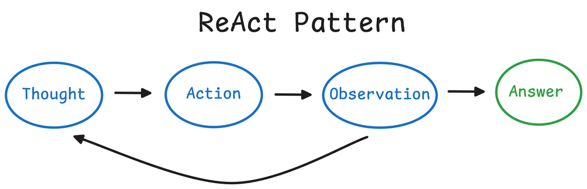
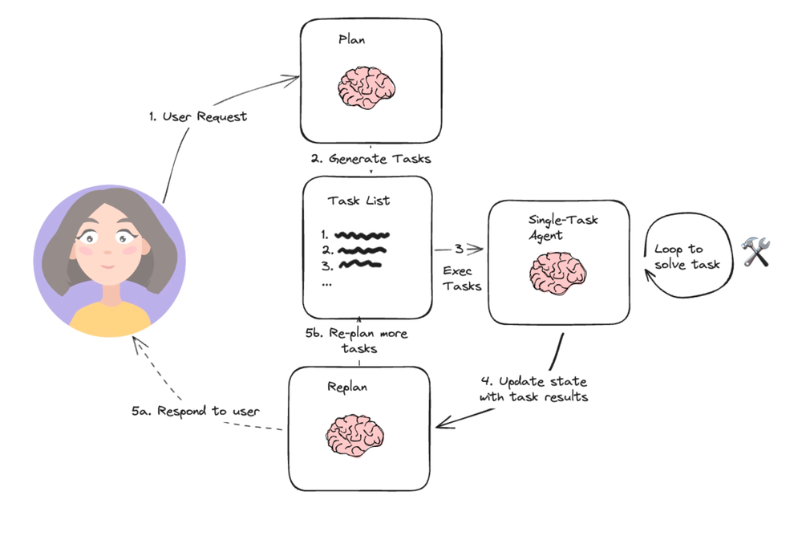
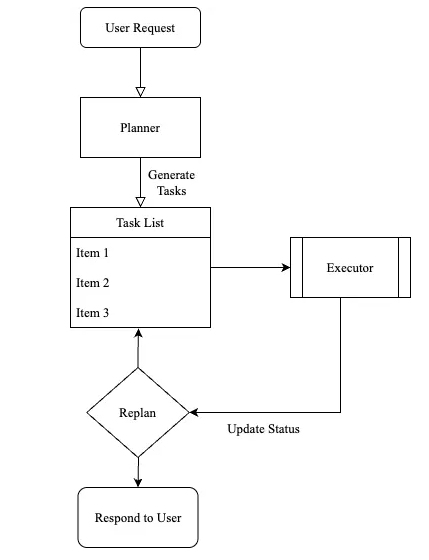

[What is an Agent?](https://www.promptingguide.ai/agents/introduction)  
[Agents](https://docs.langchain.com/oss/python/langchain/agents)  
[Agent的概念、原理与构建模式](https://github.com/MarkTechStation/VideoCode/tree/main)  
[AI Agents 101: Everything You Need to Know About Agents](https://medium.com/@sahin.samia/ai-agents-101-everything-you-need-to-know-about-agents-265fba8b9267)  
[LLM Agents 101](https://github.com/aishwaryanr/awesome-generative-ai-guide/blob/main/resources/agents_101_guide.md)  
[Agent Runtime Execution Model](https://learn.microsoft.com/en-us/agent-framework/agents/?pivots=programming-language-python)  
[microsoft agent-framework](https://github.com/microsoft/agent-framework)  
  
  
  

## 2 Implemention Patterns
### ReAct Pattern
[ReAct Pattern](https://www.dailydoseofds.com/ai-agents-crash-course-part-10-with-implementation/)  
  
### Plan-and-Execute Pattern
  
  
  
[langchain](https://github.com/langchain-ai/langchain)  
  
  
  
  
[ai-agents-for-beginners](https://github.com/microsoft/ai-agents-for-beginners)  
[Agent Development Kit](https://google.github.io/adk-docs/)  
  