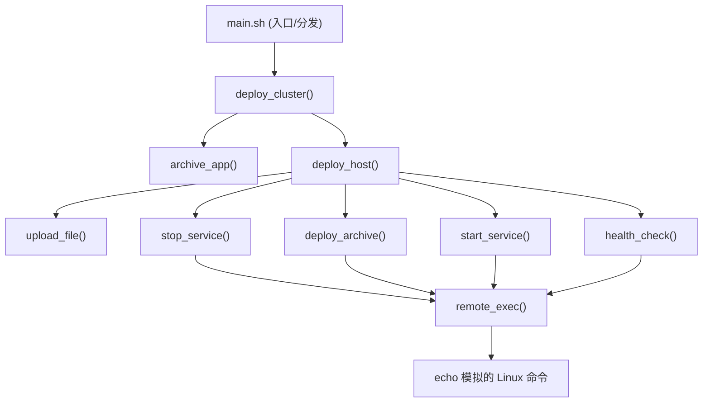

# 大型 Bash 项目组织实战：可运行的分层发布 demo

本目录 [`bash/deploy/`](./deploy/) 是对 [大型 Bash 项目的组织方式——以「网站发布」为例](./howto_organize_shell_script.md) 一文的可运行落地实现。

它把"将一个 Web 应用发布到多台 Linux 服务器"的流程，严格按照 **Data / Workflow / Primitive / Execution** 四层拆开，让你可以直接运行、直观看到分层调用关系。

> 所有 `tar / scp / ssh / systemctl / curl` 等真实命令都用 `echo` 模拟，**不会产生任何副作用**，因此可以安全地反复运行，专注于理解"组织方式"本身。

---

## 一、目录结构

```
deploy/
+-- main.sh              # 入口：source 各层 + 按参数分发 deploy/rollback
+-- config/
|     config.sh          # Data 层：HOSTS / APP_DIR / ARCHIVE / SERVICE
+-- lib/                 # Primitive 层：每个文件封装一种系统能力
|     ssh.sh             #   remote_exec() + log()
|     archive.sh         #   archive_app() / deploy_archive()
|     upload.sh          #   upload_file()
|     service.sh         #   stop_service() / start_service()
|     health.sh          #   health_check()
+-- workflow/            # Workflow 层：只编排，不碰底层命令
|     deploy.sh          #   deploy_host() / deploy_cluster()
|     rollback.sh        #   rollback_host() / rollback_cluster()
+-- app/                 # 待发布内容
      index.html         #   占位的示例页面
```

---

## 二、各层职责说明

| 层               | 目录 / 文件        | 职责                       | 回答的问题             |
| ---------------- | ------------------ | -------------------------- | ---------------------- |
| Data 层          | `config/config.sh` | 只描述资源，不含执行逻辑   | 我有什么？             |
| Workflow 层      | `workflow/*.sh`    | 只编排，按顺序调用原语     | 为完成业务要做哪些动作？ |
| Primitive 层     | `lib/*.sh`         | 封装单个系统能力           | 一个动作怎么完成？     |
| Execution 层     | `echo` 出的命令    | 真正落到 Linux 的命令      | Linux 如何执行？       |

### Data 层 —— `config/config.sh`

只放数据，Workflow 只认识 `HOSTS` / `SERVICE` 这些名字，不知道具体是 `web01` 还是 `nginx`：

```bash
HOSTS=(web01 web02 web03)
APP_DIR=/opt/app
ARCHIVE=app.tar.gz
SERVICE=nginx
```

### Primitive 层 —— `lib/`

每个文件封装一种系统能力，是"将来要改的唯一地方"：

- `ssh.sh`：`remote_exec()` 是访问远端的唯一入口（将来 ssh 换别的方式只改这里），外加 `log()` 分层日志。
- `archive.sh`：`archive_app()` 打包、`deploy_archive()` 远端解包。
- `upload.sh`：`upload_file()`（将来 `scp` 换 `rsync` 只改这一个函数）。
- `service.sh`：`stop_service()` / `start_service()`（将来 `systemctl` 换 `supervisorctl` 只改这里）。
- `health.sh`：`health_check()`。

### Workflow 层 —— `workflow/`

只编排，读起来像一本说明书，完全不知道 `scp / ssh / tar / curl` 的存在：

- `deploy.sh`：`deploy_host()` 串起 上传 -> 停服务 -> 解包 -> 起服务 -> 健康检查；`deploy_cluster()` 先打包一次再遍历 `HOSTS`。
- `rollback.sh`：`rollback_host()` / `rollback_cluster()`，停服务 -> 切回上一版本 -> 起服务 -> 健康检查。

### 入口 —— `main.sh`

`set -euo pipefail`，用脚本自身路径定位并 `source` 各层，按 `$1`（`deploy` | `rollback`，缺省 `deploy`）分发。

---

## 三、调用关系



注意：Workflow 层根本不知道 `scp / ssh / tar / curl` 这些细节，它只调用 Primitive。

---

## 四、运行方式

```bash
bash bash/deploy/main.sh deploy     # 演示发布全流程
bash bash/deploy/main.sh rollback   # 演示回滚全流程
bash bash/deploy/main.sh --help     # 查看用法
```

`deploy` 的示例输出（已做缩进，直观体现分层）：

```
[WORKFLOW ] == deploy cluster start ==
    [tar] czf app.tar.gz app/
[WORKFLOW ] >> deploy host: web01
    [scp] app.tar.gz -> web01:/tmp/app.tar.gz
    [ssh] web01 -> systemctl stop nginx
    [ssh] web01 -> rm -rf /opt/app && mkdir -p /opt/app && tar xzf /tmp/app.tar.gz -C /opt/app
    [ssh] web01 -> systemctl start nginx
    [ssh] web01 -> curl -fs http://127.0.0.1/health
... (web02 / web03 同理) ...
[WORKFLOW ] == deploy cluster done ==
```

---

## 五、为什么这样组织？

- **改 `scp` 为 `rsync`**：只改 `lib/upload.sh` 里的 `upload_file()`，Workflow 一行不用动。
- **改 `systemctl` 为 `supervisorctl`**：只改 `lib/service.sh`，Workflow 一行不用动。
- **加一台主机 / 改服务名**：只改 `config/config.sh`，其余全部不动。

这就是分层与抽象带来的好处：

> Data 描述资源，Workflow 描述业务流程，Primitive 封装系统能力，CLI 负责真正执行。高层只负责"编排"，低层只负责"执行"，每层只承担一种职责。
