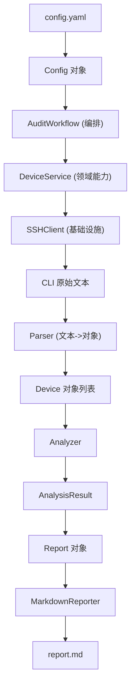

# Python 自动化示例项目实战：可运行的分层 network_audit demo

> **定位**
>
> 本文是 [python_automation_guide.md](./python_automation_guide.md)（理论）的**实战配套**。
> 指南讲"应该怎么分层"，本文给出一个**真实可运行**的项目 `network_audit/`，
> 把抽象的分层心智模型落成可以 `python3 main.py` 跑起来的代码。
>
> 项目位置：[../network_audit/](../network_audit/)。SSH 等外部访问用"打印命令 + 内置假 CLI 文本"代替，无需真实设备。

---

## 一、需求与思路

需求：**采集多台设备信息 -> 解析输出 -> 分析 -> 生成 Markdown 报告**。

Shell 思维组织的是「命令流（Command Stream）」：

```
printf -> ssh -> awk -> sort -> grep
```

Python 思维组织的是「对象流（Object Flow）」：

```
Config -> Device -> AnalysisResult -> Report -> Markdown
```

核心原则：**各层之间传递的是对象，而不是到处拼接的字符串。**

---

## 二、目录结构

```
network_audit/
+-- main.py                 # 入口：装配依赖并启动 Workflow
+-- config/
|     +-- config.yaml       # 外部配置：hosts / username / timeout
|     +-- loader.py         # YAML -> Config 对象（含无依赖降级解析）
+-- models/
|     +-- device.py         # Device / Interface 数据模型
|     +-- report.py         # AnalysisResult / Report 数据模型
+-- infra/
|     +-- ssh.py            # SSHClient：打印式 mock + 假 CLI 输出
+-- services/
|     +-- device_service.py # 领域能力：collect_version / collect_interfaces
+-- parsers/
|     +-- parser.py         # 纯函数：CLI 文本 -> 模型对象
+-- analysis/
|     +-- analyzer.py       # Device 列表 -> AnalysisResult
+-- workflow/
|     +-- audit.py          # 编排：collect -> parse -> analyze -> report
+-- reporter/
|     +-- markdown.py       # Report 对象 -> report.md
+-- utils/
      +-- logger.py         # 统一日志配置
```

---

## 三、数据流（Object Flow）



注意整条链路：**没有裸 dict / 字符串在各层之间乱传**，传的都是对象。

---

## 四、逐层代码讲解

### 1. Configuration —— 配置永远来自外部

`config/config.yaml`：

```yaml
hosts:
  - sw1
  - sw2
  - sw3
username: admin
timeout: 10
report_path: report.md
```

`config/loader.py` 把它读成一个**对象**，程序里用 `config.hosts`、`config.timeout`，
而不是裸 dict 的 `data["hosts"]`：

```python
@dataclass
class Config:
    hosts: list[str] = field(default_factory=list)
    username: str = "admin"
    timeout: int = 10
    report_path: str = "report.md"

def load_config(path: str | Path) -> Config:
    data = _parse_yaml(path.read_text(encoding="utf-8"))
    return Config(hosts=list(data.get("hosts", [])), ...)
```

> 细节：`_parse_yaml` 优先 `import yaml`，没装 PyYAML 时降级到内置极简解析器，保证开箱即跑。

### 2. Model —— 用对象描述现实世界

不要传 dict，应该传 `Device`：

```python
@dataclass
class Interface:
    name: str
    status: str  # up / down
    @property
    def is_up(self) -> bool:
        return self.status.lower() == "up"

@dataclass
class Device:
    hostname: str
    version: str = ""
    interfaces: list[Interface] = field(default_factory=list)
```

以后整个程序用的都是 `device.hostname` / `device.version` / `device.interfaces`。

### 3. Infrastructure —— 只懂"发命令、回文本"

这一层不知道 Device/Report/Workflow，它只负责访问外部世界。
真实项目这里是 paramiko/netmiko，本 demo 用打印 + 假数据代替：

```python
class SSHClient:
    def execute(self, command: str) -> str:
        self.log.info("[SSH %s] $ %s", self.host, command)
        host_table = _FAKE_OUTPUT.get(self.host, {})
        return host_table.get(command, f"% Unknown command: {command}")
```

> 想换成真实 SSH？**只改这一个文件**，其余各层完全不动。

### 4. Service —— 领域能力，向上屏蔽 SSH 细节

Service 知道"采集版本"= 执行 `show version`，但把文本解析留给 Parser：

```python
class DeviceService:
    def collect_version(self, host: str) -> str:
        with self._client(host) as client:
            return client.execute("show version")
```

### 5. Parser —— 文本到对象的转换，集中处理"脏活"

所有 split/regex 都关在这里，Workflow 永远不用碰文本格式：

```python
def parse_version(text: str) -> str:
    m = re.search(r"Version\s+(\S+)", text)
    return m.group(1).rstrip(",") if m else "unknown"

def parse_interfaces(text: str) -> list[Interface]:
    interfaces = []
    for line in text.splitlines():
        fields = line.split()
        if len(fields) < 4 or fields[0] == "Interface":
            continue
        interfaces.append(Interface(name=fields[0], status=fields[2]))
    return interfaces
```

### 6. Analyzer —— 对象到汇总对象

只接收对象、产出对象，不碰 SSH / 文本 / 输出格式：

```python
def analyze(devices: list[Device]) -> AnalysisResult:
    version_counter = Counter()
    total_up = total_down = 0
    for d in devices:
        version_counter[d.version] += 1
        total_up += d.up_count
        total_down += d.down_count
    return AnalysisResult(total_devices=len(devices), total_up=total_up,
                          total_down=total_down, version_distribution=dict(version_counter))
```

### 7. Workflow —— 只回答"做什么"

编排层不出现 ssh / regex / open，只把各层能力按顺序串起来：

```python
class AuditWorkflow:
    def run(self) -> Report:
        devices = self._collect()      # -> list[Device]
        result = analyze(devices)      # -> AnalysisResult
        report = Report(devices=devices, analysis=result)
        self.reporter.write(report)    # Report -> report.md
        return report
```

### 8. Reporter —— 对象到输出格式

把渲染独立出来，想换 HTML/JSON 只需新增一个 Reporter：

```python
class MarkdownReporter:
    def write(self, report: Report) -> Path:
        self.output_path.write_text(self.render(report), encoding="utf-8")
        return self.output_path
```

### 9. main —— 只负责"装配与启动"

```python
def main() -> None:
    setup_logging()
    config = load_config(BASE_DIR / "config" / "config.yaml")
    service = DeviceService(config)
    reporter = MarkdownReporter(BASE_DIR / config.report_path)
    workflow = AuditWorkflow(config=config, service=service, reporter=reporter)
    workflow.run()
```

main 里看不到 SSH/regex/markdown 细节——这正是分层解耦的体现。

---

## 五、逐层职责对照表

| 层 | 目录 | 职责 | 关键类型/函数 |
| --- | --- | --- | --- |
| Configuration | `config/` | 外部配置 -> 对象 | `load_config` -> `Config` |
| Model | `models/` | 描述现实世界 | `Device`、`Interface`、`Report` |
| Infrastructure | `infra/` | 访问外部系统 | `SSHClient.execute` |
| Service | `services/` | 领域能力 | `DeviceService` |
| Parser | `parsers/` | 文本 -> 对象 | `parse_version`、`parse_interfaces` |
| Analyzer | `analysis/` | 对象 -> 汇总对象 | `analyze` -> `AnalysisResult` |
| Workflow | `workflow/` | 编排流程 | `AuditWorkflow.run` |
| Reporter | `reporter/` | 对象 -> 输出格式 | `MarkdownReporter.write` |

---

## 六、运行方式与预期输出

```bash
cd network_audit
python3 main.py
```

终端日志（节选）：

```
INFO  | main             | loaded config: hosts=['sw1', 'sw2', 'sw3'] timeout=10
INFO  | workflow.audit   | audit start: 3 hosts
INFO  | infra.ssh        | [SSH] connect admin@sw1 (timeout=10s)
INFO  | infra.ssh        | [SSH sw1] $ show version
INFO  | infra.ssh        | [SSH sw1] $ show ip interface brief
INFO  | workflow.audit   | collected sw1: version=15.2(4)E7 interfaces=3
...
INFO  | reporter.markdown | markdown report written: .../report.md
```

生成的 `report.md`：

```markdown
# 网络设备审计报告

- 设备总数：3
- 接口总数：8（up: 6 / down: 2）

## 版本分布

| 版本 | 设备数 |
| --- | --- |
| 15.2(4)E7 | 2 |
| 16.9(3) | 1 |

## 设备明细

| 主机 | 版本 | 接口数 | up | down |
| --- | --- | --- | --- | --- |
| sw1 | 15.2(4)E7 | 3 | 2 | 1 |
| sw2 | 15.2(4)E7 | 2 | 1 | 1 |
| sw3 | 16.9(3) | 3 | 3 | 0 |
```

---

## 七、如何"改成真实项目"

| 想做的事 | 只需改动 | 其它层是否改动 |
| --- | --- | --- |
| 换成真实 SSH（paramiko） | `infra/ssh.py` | 否 |
| 增加 `show running-config` 采集 | `services/` + `parsers/` | 否 |
| 输出 HTML / JSON | 新增一个 Reporter | 否 |
| 改主机/超时 | `config/config.yaml` | 否 |

这张表就是分层解耦的最佳证明：**变化被隔离在单一层内**。

---

## 八、黄金原则回顾

1. Workflow（做什么）与 Infrastructure（怎么做）彻底分离。
2. 一切业务数据都建模，避免裸 `dict` / 字符串到处传。
3. Service 封装领域能力，Workflow 只编排流程。
4. Parser 专职文本->对象，Reporter 专职对象->输出。
5. 把项目看成一条"对象流"，而不是一串函数调用。
