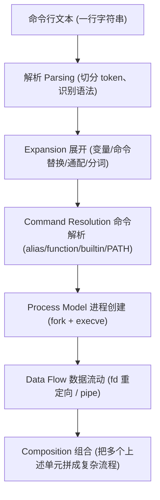
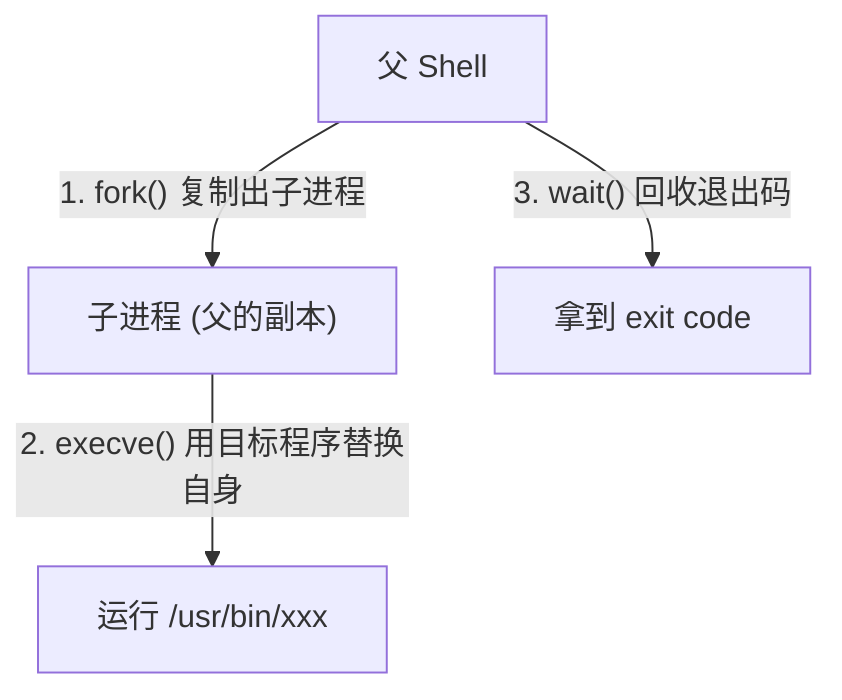
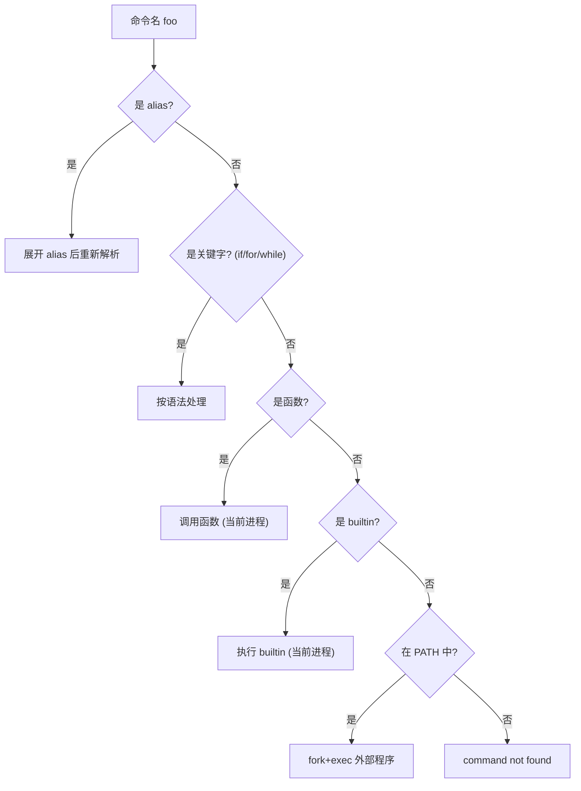
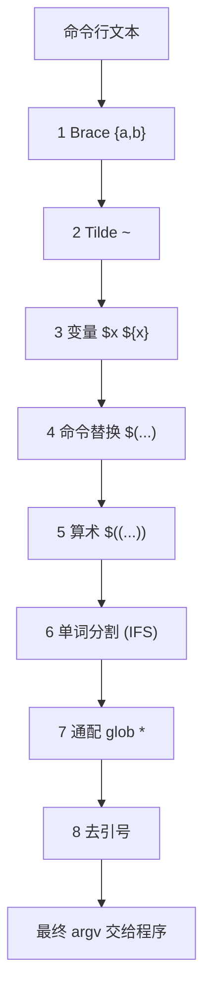
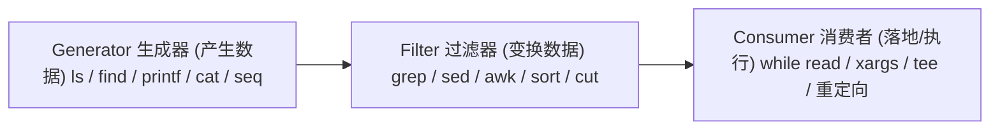
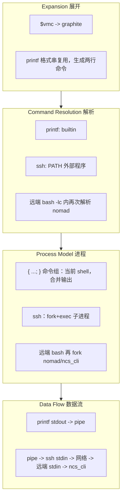

# 围绕五大心智模型的 Shell 知识体系

> **核心断言**
>
> 不要按「命令」去背 shell，而要按「模型」去理解 shell。
>
> Shell 自己几乎不理解数据的业务含义。它只做三件事：**展开文本、编排进程、搬运字节流**。
>
> **数据的语义，永远由最终消费数据的程序（Application）解释。**

本文围绕下面 5 个心智模型组织知识。它们不是 5 个孤立话题，而是**同一条命令执行流水线的 5 个观察视角**。

| 心智模型 | 核心问题 | 典型知识 |
| --- | --- | --- |
| Data Flow（数据流） | 数据如何在程序之间流动？ | stdin、stdout、pipe、重定向、Here Document、Process Substitution |
| Process Model（进程模型） | Shell 如何创建和组织进程？ | fork、execve、子 Shell、命令替换、后台任务 |
| Command Resolution（命令解析） | Shell 如何找到并执行命令？ | alias、函数、builtin、PATH、外部程序 |
| Expansion（展开模型） | Shell 在执行前如何处理命令行？ | 参数展开、命令替换、通配符、引用、单词分割 |
| Composition（组合模型） | 如何把小工具组合成复杂流程？ | pipeline、filter、generator、consumer、函数、模板 |

---

# 〇、总览：一行命令的生命周期

当你敲下一行命令并回车，Shell 内部经历的顺序大致是：



关键认知：

- **Expansion 先于执行**：等到真正运行外部程序时，命令行里已经没有 `$`、`*`、`~` 了，它们早被替换成最终文本。
- **Command Resolution 决定「谁来跑」**：同一个名字可能是 alias、函数、builtin 或磁盘上的程序，查找顺序决定结果。
- **Process Model 决定「在哪跑、状态归谁」**：是否 fork 出新进程，直接影响变量、`cd`、环境的可见性。
- **Data Flow 决定「数据怎么进出」**：每个进程只认 fd（文件描述符）0/1/2，重定向与管道就是在「接线」。
- **Composition 是上层抽象**：把前四者当作积木，搭出可维护的脚本。

> 理解一条复杂命令的万能方法：**按这 5 个视角逐层拆解它**。第六章会用一个真实例子完整演示。

如何使用本文档：先通读总览建立全局观，再逐节深入；每节末尾的「延伸阅读」链接到本仓库已有的细分专题文档，可作为该模型的深水区。

---

# 一、Data Flow（数据流）

> **核心问题**：数据如何在程序之间流动？
>
> **第一性原理**：对 Shell 而言，一切都是 **Byte Stream（字节流）**。它不区分 JSON、SQL、命令、图片，只负责把「生产者」的字节接到「消费者」的输入口。

## 1.1 心智模型：进程只认三个 fd

每个进程启动时，内核默认给它三个文件描述符（file descriptor）：

```
+--------+-----------------+-------------------------+
| fd     | 名称            | 默认指向                |
+--------+-----------------+-------------------------+
| 0      | stdin  标准输入 | 键盘 / 上游管道         |
| 1      | stdout 标准输出 | 终端 / 下游管道         |
| 2      | stderr 标准错误 | 终端                    |
+--------+-----------------+-------------------------+
```

**重定向与管道，本质都是在执行 execve 之前，悄悄改写这三个 fd 指向哪里。** 程序本身对此一无所知，它只是照常读 fd 0、写 fd 1/2。

```
Producer ──(写 fd 1)──▶ Byte Stream ──(读 fd 0)──▶ Consumer
```

## 1.2 重定向：把 fd 接到文件

```bash
cmd > out.txt       # stdout(1) 覆盖写入文件
cmd >> out.txt      # stdout(1) 追加写入文件
cmd < in.txt        # stdin(0) 从文件读取
cmd 2> err.txt      # stderr(2) 写入文件
cmd > out 2>&1      # 先把1指向out，再让2复制1的指向 -> 都进 out
cmd &> out          # bash 简写：1和2都进 out
cmd 2>&1 > out      # 陷阱！顺序反了，见下
```

**最经典的陷阱：`2>&1` 的位置。** 重定向**从左到右**生效，`2>&1` 的含义是「让 fd 2 复制 fd 1 此刻的指向」：

```bash
# 正确：1 先指向 out，2 再复制 1 -> 两者都进 out
cmd > out 2>&1

# 错误：2 先复制 1(此刻还是终端)，1 之后才改去 out
#       结果 stderr 仍然打到终端
cmd 2>&1 > out
```

丢弃输出用 `/dev/null`：

```bash
cmd >/dev/null 2>&1   # 安静运行，丢弃一切输出
```

## 1.3 管道（pipe）：把上游 fd1 接到下游 fd0

```bash
producer | filter | consumer
```

内核创建一个匿名管道（内存中的环形缓冲区），把 `producer` 的 stdout 接到 `filter` 的 stdin，依此类推。


两个常被忽视的事实：

- **管道里每一段都是独立进程**，并发运行（不是顺序跑完上一个再跑下一个）。这是下一章「进程模型」的重点。
- **默认只有 stdout 进管道，stderr 不进**。要把错误也送进管道：`cmd 2>&1 | next`。

## 1.4 命令组配合重定向：合并多个命令的输出流

把多条命令的 stdout 合成同一个流，再统一喂给消费者：

```bash
{
    printf '%s\n' "step 1"
    printf '%s\n' "step 2"
} | consumer
```

`{ ...; }` 是「命令组」，在**当前 shell**中按顺序执行并合并输出（注意花括号内每条命令要以 `;` 或换行结尾，且 `{` 后、`}` 前要有空格）。

## 1.5 Here Document（`<<`）：把内联文本当作 stdin

当一个程序需要从 stdin 读「一段多行文本」时，用 Here Document 把文本直接写在脚本里：

```bash
consumer <<'EOF'
unhide debug
show cable modem brief
exit
EOF
```

要点：

- `<<'EOF'`（定界符**加引号**）：内部**不做任何展开**，所见即所得，最安全。
- `<<EOF`（不加引号）：内部会做变量/命令替换，可插值。
- `<<-EOF`：允许用 **Tab**（仅 Tab，非空格）缩进定界符与内容，便于排版。

```bash
name=world
cat <<EOF        # 会展开
hello $name
EOF
# -> hello world

cat <<'EOF'      # 不展开
hello $name
EOF
# -> hello $name
```

## 1.6 Here String（`<<<`）：把一个字符串当 stdin

```bash
grep foo <<< "$text"          # 等价于 printf '%s\n' "$text" | grep foo，但不开子进程
read -r a b c <<< "1 2 3"     # 把字符串喂给 read
```

## 1.7 Process Substitution（`<(...)` / `>(...)`）：把命令的输出当文件名

有些命令只接受**文件路径**，不接受 stdin。Process Substitution 让一条命令的输出/输入伪装成一个文件（`/dev/fd/N`）：

```bash
# <(...) ：把命令输出当作可读文件
diff <(sort a.txt) <(sort b.txt)
comm -13 <(sort old) <(sort new)

# >(...) ：把命令输入当作可写文件，常配合 tee 分流
make 2>&1 | tee >(grep -i error > errors.log)
```

它和管道的关键区别：管道是「线性单链」，而 `<(...)` 可以同时给一个命令**喂多个输入流**（如 `diff` 需要两个文件）。

## 1.8 常见陷阱

- **`2>&1` 顺序错误**：见 1.2，记住「从左到右、复制的是此刻的指向」。
- **管道导致变量丢失**：`echo x | read v; echo "$v"` 打印为空——因为 `read` 在子 shell 里（详见第二章）。
- **SIGPIPE**：`producer | head -1` 中，`head` 读够就退出，`producer` 继续写会收到 SIGPIPE 而提前结束，这是正常行为，不是 bug。
- **`stderr` 不自动进管道**：需要 `2>&1 | next`。

## 1.9 最佳实践

- 默认给所有可能含空格/特殊字符的内容加双引号（与第四章「展开」强相关）。
- 需要「字面文本」的多行输入，优先 `<<'EOF'`，避免意外插值。
- 需要把命令输出当文件喂给 `diff`/`comm`/`paste` 等，用 `<(...)`，不要先写临时文件。
- 调试数据流时，在管道中间插一个 `tee /tmp/debug` 观察中间结果。

## 1.10 延伸阅读

- [复杂 Shell 命令的数据流心智模型](./cmd_io_stream.md)
- [Linux Pipeline 底层实现：系统调用、Pipe 对象与数据流动](./how_pipe_works.md)
- [Linux Pipeline（管道）工作原理及心智模型](./how_pipeline_works.md)
- [Here Document 与重定向的工作原理及心智模型](./here_doc_and_redirection.md)
- [Heredoc 用法](./heredoc.md)
- [Process Substitution：>(cmd) 与 <(cmd) 的底层实现](./how_process_sub_works.md)
- [Shell `{}` + `time` + 重定向 的工作模型](./time_redirection_model.md)

---

# 二、Process Model（进程模型）

> **核心问题**：Shell 如何创建和组织进程？
>
> **第一性原理**：在 Unix 上，**新进程只能由 `fork` + `execve` 两步诞生**。理解了「什么时候 fork、什么时候不 fork」，就能解释 shell 里几乎所有「变量为什么没了 / `cd` 为什么不生效 / 后台任务怎么等」的问题。

## 2.1 心智模型：fork + execve 两步



- `fork()`：把当前进程**整体复制**一份（内存、fd、环境变量都继承）。
- `execve()`：在子进程里**把自己替换**成目标程序的镜像。
- `wait()`：父进程等待子进程结束，拿到退出码（`$?`）。

**关键推论：子进程对环境的修改，影响不到父进程。** 这解释了大量「奇怪」现象。

## 2.2 哪些会 fork，哪些不会

```
+-------------------------------+----------------+----------------------------+
| 形式                          | 是否 fork      | 状态变更是否影响当前 shell |
+-------------------------------+----------------+----------------------------+
| 外部命令 (ls, grep, awk)      | 是             | 否 (在子进程里)            |
| 子 Shell ( ... )              | 是             | 否                         |
| 命令替换 $( ... )             | 是             | 否                         |
| 管道的每一段 a | b | c        | 是 (各自子进程)| 否                         |
| 后台任务 cmd &                | 是             | 否                         |
| builtin (cd, export, read)    | 否             | 是 (在当前进程)            |
| 命令组 { ...; }               | 否             | 是                         |
| 函数调用                      | 否             | 是                         |
+-------------------------------+----------------+----------------------------+
```

## 2.3 子 Shell `( ... )` vs 命令组 `{ ...; }`

```bash
# 子 Shell：开新进程，里面的 cd / 变量改动不影响外面
( cd /tmp && tar czf a.tgz . )
pwd   # 仍在原目录，因为 cd 发生在子进程里

# 命令组：在当前 shell 执行，cd / 变量改动会保留
{ cd /tmp && do_something; }
pwd   # 现在在 /tmp
```

口诀：**圆括号开子进程（隔离），花括号留在原地（共享）。**

## 2.4 命令替换 `$( ... )`：在子进程里跑，只把 stdout 拿回来

```bash
today=$(date +%F)        # 子进程运行 date，stdout 被捕获赋给变量
files=$(ls *.log)
```

- 在子进程执行，因此其中的 `cd`、变量赋值不影响父 shell。
- 只捕获 **stdout**；stderr 仍会打到终端（除非 `2>&1`）。
- 会去掉结尾换行。

## 2.5 管道每段都是独立子进程——「变量丢失」之谜

```bash
echo "hello" | read greeting
echo "$greeting"      # 空！
```

因为 `read` 运行在管道右侧的**子进程**里，它读到的变量随子进程一起消失。解决方案：

```bash
# 方案 A：用 here string，避免开子进程
read -r greeting <<< "hello"

# 方案 B：把消费逻辑放进同一个 (代码块) 内
echo "data" | { read -r x; echo "got $x"; }

# 方案 C（bash）：lastpipe，让管道最后一段在当前 shell 运行
shopt -s lastpipe
echo "hello" | read -r greeting   # 需在非交互式脚本中
```

同理，`... | while read -r line; do count=$((count+1)); done` 之后 `count` 仍是 0——循环体在子进程里。

## 2.6 后台任务与等待

```bash
long_task &            # 放后台，立刻返回
pid=$!                 # 拿到刚启动后台任务的 PID
jobs                   # 查看本 shell 的后台任务
wait "$pid"            # 等待指定任务，拿到它的退出码
wait                   # 等待所有后台任务
```

并行执行的标准骨架：

```bash
pids=()
for host in host1 host2 host3; do
    do_work "$host" &
    pids+=("$!")
done

rc=0
for pid in "${pids[@]}"; do
    wait "$pid" || rc=1     # 收集每个任务的退出码
done
exit "$rc"
```

## 2.7 常见陷阱

- **指望管道改全局变量**：见 2.5，管道段在子进程，改不到当前 shell。
- **`( ... )` 里 `cd` 后纳闷外面没变**：那是子进程，正是设计如此。
- **忘记 `wait`**：脚本主体跑完就退出，后台任务可能被一起终止或变成孤儿。
- **`export` 只向下传递**：子进程能看到父导出的变量，反之看不到子进程的修改。

## 2.8 最佳实践

- 需要修改当前 shell 状态（`cd`、设变量）的逻辑，放进函数或 `{ ...; }`，不要放进 `( ... )` 或管道末段。
- 并行任务务必收集 `$!` 并逐个 `wait`，据此聚合退出码。
- 用 `$(...)` 而非反引号 `` `...` ``，可嵌套、更易读。
- 后台守护类进程注意脱离当前 shell（`nohup`、`disown`、`setsid`），见延伸阅读。

## 2.9 延伸阅读

- [Linux / Bash 执行模型心智模式](./execute_model.md)
- [Shell 函数执行与后台执行的心智模型](./how_function_call_works.md)
- [Shell 下并行执行（Parallel Execution）最佳实践](./parallel_execution.md)
- [Bash 并行执行任务的方法](./run_parallel_functions.md)
- [后台运行进程 - run service at background](./run_service_at_background.md)

---

# 三、Command Resolution（命令解析）

> **核心问题**：Shell 如何找到并执行命令？
>
> **第一性原理**：当 Shell 看到 `foo arg1 arg2`，它并不知道 `foo` 是 alias、函数、builtin 还是磁盘上的程序。它必须按**固定优先级**查找。理解这个顺序，就能解释「为什么 `ls` 跑的是函数」「为什么 `command ls` 又绕开了」。

## 3.1 心智模型：查找优先级



优先级简记（从高到低）：

```
alias  >  keyword  >  function  >  builtin  >  $PATH 外部程序
```

> 注意：alias 仅在**交互式 shell** 默认开启；非交互脚本默认不展开 alias（除非 `shopt -s expand_aliases`）。这正是脚本里不该依赖 alias 的原因。

## 3.2 用 `type` 看清一个名字到底是什么

```bash
type ls          # ls is aliased to `ls --color=auto'
type -t ls       # alias    (只输出类型，便于脚本判断)
type cd          # cd is a shell builtin
type grep        # grep is /usr/bin/grep
type -a echo     # 列出 echo 的所有身份 (builtin + /usr/bin/echo)
```

对比三个常见探查工具：

```
+-------------+------------------------------------------+
| 工具        | 说明                                     |
+-------------+------------------------------------------+
| type        | bash builtin，能识别 alias/函数/builtin  |
| command -v  | POSIX，脚本中判断命令是否存在的首选      |
| which       | 外部程序，只查 PATH，看不到函数/builtin  |
+-------------+------------------------------------------+
```

脚本里判断命令是否存在，用 `command -v`，不要用 `which`：

```bash
if command -v jq >/dev/null 2>&1; then
    parse_with_jq
else
    echo "jq not installed" >&2
fi
```

## 3.3 主动「绕过」查找顺序

```bash
command ls      # 跳过 alias 和函数，直接找 builtin/外部程序
builtin cd /tmp # 强制用 builtin cd（即使被函数覆盖）
\ls             # 反斜杠转义，临时跳过 alias
enable -n test  # 禁用某个 builtin，使其落到外部程序
```

典型用途：你写了一个名为 `ls` 的包装函数，但函数内部又想调用真正的 `ls`，否则会无限递归：

```bash
ls() {
    command ls --color=auto -F "$@"   # 用 command 调用真正的 ls，避免递归
}
```

## 3.4 PATH 与 hash 缓存

- 外部程序按 `$PATH` 从左到右第一个命中者执行。
- Bash 用 `hash` 表缓存已找到的路径，避免每次都搜 PATH。
- 换了二进制位置后命令仍指向旧路径，用 `hash -r` 清缓存。

```bash
echo "$PATH"
hash               # 查看已缓存的命令路径
hash -r            # 清空缓存（升级/移动二进制后用）
```

## 3.5 常见陷阱

- **脚本里依赖交互式 alias**：脚本默认不展开 alias，行为与交互终端不一致。
- **`which` 在脚本里误判**：它看不到函数/builtin，结果可能与实际执行不符。
- **函数与外部命令重名导致递归**：函数内调用同名命令必须用 `command`。
- **PATH 被污染**：当前目录 `.` 在 PATH 中会带来安全风险，不要把 `.` 放进 PATH。

## 3.6 最佳实践

- 脚本中判断命令存在性统一用 `command -v`。
- 包装同名命令时，函数内用 `command <name>` 调真身。
- 不在脚本里依赖 alias；需要复用就写函数。
- 关键脚本可显式设置 `PATH`，或对外部工具用绝对路径，提升确定性。

## 3.7 延伸阅读

- [Bash 命令查找顺序（Command Resolution Order）心智模型](./cmd_resolve_order.md)
- [Bash命令替换 - command substitution](./command_substitution.md)

---

# 四、Expansion（展开模型）

> **核心问题**：Shell 在执行命令前如何处理命令行？
>
> **第一性原理**：在 Shell 真正运行程序之前，会对命令行做一连串**文本展开**。等程序启动时，命令行里早已没有 `$`、`*`、`~`，全部变成了最终的「词（words）」。**几乎所有「为什么带空格就出错」的问题，根源都在这里。**

## 4.1 心智模型：展开有固定顺序

Bash 的展开顺序（同一行内）大致如下：

```
1. Brace Expansion          {a,b}      纯文本，先发生
2. Tilde Expansion          ~          ~ -> $HOME
3. Parameter / Variable     $x ${x}    变量展开
4. Command Substitution     $(...)     命令替换
5. Arithmetic Expansion     $((...))   算术
6. Word Splitting           按 $IFS 把展开结果切成多个词
7. Filename / Glob          * ? [...]  通配匹配文件
8. Quote Removal            去掉起语法作用的引号
```



**关键点：变量展开（第 3 步）发生在单词分割（第 6 步）之前。** 所以变量里若含空格，未加引号就会被拆成多个词——这是 shell 最大的坑源。

## 4.2 引用（Quoting）：控制展开的开关

```
+-----------+----------------------------------------------+
| 形式      | 行为                                         |
+-----------+----------------------------------------------+
| '单引号'  | 全字面，内部什么都不展开                     |
| "双引号"  | 保留 $ 展开，但抑制单词分割与通配            |
| \ 转义    | 转义紧跟的单个字符                           |
| 不加引号  | 全部展开 + 单词分割 + 通配（最危险）         |
+-----------+----------------------------------------------+
```

经典对比：

```bash
file="my report.txt"

rm $file          # 危险！展开后分词 -> rm my report.txt（删了两个文件）
rm "$file"        # 正确，作为单个参数 my report.txt

echo "$HOME"      # /home/morrism
echo '$HOME'      # 字面 $HOME
```

## 4.3 `"$@"` vs `$*`：参数转发的唯一正确姿势

```bash
demo() {
    printf '[%s]\n' "$@"     # 每个参数独立、原样保留
}
demo a "b c" d
# [a]
# [b c]
# [d]
```

- `"$@"`：展开为**每个参数各自一个词**，正确保留含空格的参数。**转发参数永远用 `"$@"`。**
- `$*` / `"$*"`：把所有参数拼成一个字符串，几乎只在需要拼接时才用。
- 不加引号的 `$@` / `$*`：会被再次分词与通配，几乎总是错的。

## 4.4 参数展开（Parameter Expansion）：内建的字符串处理

无需调用 `sed`/`basename`，shell 自带强大的字符串操作：

```bash
path="/var/log/app.log"

echo "${path##*/}"      # app.log     去掉最长前缀匹配（取文件名）
echo "${path%/*}"       # /var/log    去掉最短后缀匹配（取目录）
echo "${path%.log}"     # /var/log/app 去扩展名

name=""
echo "${name:-default}" # default     为空则用默认值
echo "${name:=def}"     # 为空则赋默认值并返回
echo "${var:?must set}" # 未设置则报错退出

text="a-b-c"
echo "${text/-/_}"      # a_b-c       替换第一个
echo "${text//-/_}"     # a_b_c       替换全部

s="hello"
echo "${#s}"            # 5           长度
echo "${s:1:3}"         # ell         子串(偏移1取3个)
```

## 4.5 Brace Expansion 与 Glob 的区别

```bash
# Brace：纯文本生成，不关心文件是否存在
echo file{1,2,3}.txt        # file1.txt file2.txt file3.txt
mkdir -p proj/{src,test,doc}
echo {1..5}                 # 1 2 3 4 5

# Glob：根据现有文件匹配
echo *.txt                  # 展开为当前目录真实存在的 .txt 文件
```

**空目录陷阱**：当没有任何匹配文件时，默认 `*.txt` 不展开，**原样**作为字面 `*.txt` 传给程序：

```bash
for f in *.log; do
    [ -e "$f" ] || continue   # 防止无匹配时把字面 "*.log" 当文件名
    process "$f"
done
# 或者：shopt -s nullglob  让无匹配时展开为空
```

## 4.6 `[[ ]]` vs `[ ]`：为什么推荐前者

```bash
# [ ] 是普通命令(test)，参数会被展开和分词，必须处处加引号
[ -n "$var" ] && echo nonempty

# [[ ]] 是 bash 关键字，不做单词分割/通配，更安全
[[ -n $var ]] && echo nonempty
[[ "$str" == *.log ]] && echo "is log"       # 支持模式匹配
[[ "$str" =~ ^[0-9]+$ ]] && echo "is number" # 支持正则
```

## 4.7 常见陷阱

- **变量不加引号** → 含空格/glob 字符时被分词、被通配，行为失控。
- **`$@` 不加引号** → 参数边界丢失。
- **glob 无匹配** → 字面量被当成参数（用 `nullglob` 或 `[ -e ]` 防护）。
- **`echo $var` 看不出问题** → 改用 `printf '%s\n' "$var"` 或 `declare -p var` 调试，能看清真实内容。

## 4.8 最佳实践

- **默认给所有变量展开加双引号**，除非你明确需要分词或通配。
- 转发参数永远用 `"$@"`。
- 能用参数展开（`${var##*/}` 等）就别 fork 外部 `basename`/`sed`，更快更安全。
- 条件判断优先 `[[ ]]`；处理用户输入/文件名时尤其注意引用。
- 用 `set -u`（或 `set -euo pipefail`）让未定义变量直接报错，提前暴露 bug。

## 4.9 延伸阅读

- [Bash 完整指南：变量与参数 / 字符串操作](../bash.md)
- [string 操作](./string.md)
- [Bash 中「构造命令」的方式总结](./bash_cmd_construct.md)
- [Shell Parameter Expansion（官方手册）](https://www.gnu.org/software/bash/manual/html_node/Shell-Parameter-Expansion.html)

---

# 五、Composition（组合模型）

> **核心问题**：如何把小工具组合成复杂流程？
>
> **第一性原理**：Unix 哲学是「每个程序只做一件事，并通过文本流互相连接」。Shell 是这套哲学的**胶水层**。组合的本质，是把前四章的积木（数据流、进程、命令、展开）按 **generator → filter → consumer** 的范式拼起来。

## 5.1 心智模型：生成器 / 过滤器 / 消费者



把每个程序看成一个「函数」，管道 `|` 就是函数组合 `f ∘ g`：

```bash
# 生成器 -> 过滤器 -> 过滤器 -> 消费者
find . -name '*.log' \
  | grep -v 'archive' \
  | sort \
  | while read -r f; do gzip "$f"; done
```

## 5.2 三类角色的典型工具

```
+-----------+------------------------------------------------+
| 角色      | 常用工具                                       |
+-----------+------------------------------------------------+
| Generator | printf, echo, seq, ls, find, cat, curl         |
| Filter    | grep, sed, awk, sort, uniq, cut, tr, head/tail |
| Consumer  | while read, xargs, tee, >, >>, mail            |
+-----------+------------------------------------------------+
```

设计准则：**过滤器最好是「纯函数」**——只依赖 stdin、只写 stdout，不改全局状态。这样它们可以任意重排、复用、测试。

## 5.3 用函数封装「命令原语」

把重复的命令调用抽象成小而正交的函数（primitive），上层再组合它们：

```bash
EVC_JOB=evc

# 原语：把 stdin 的命令送进远端 CLI 执行
run_ncs() {
    nomad alloc exec -task evc -job "$EVC_JOB" ncs_cli -u admin
}

# 生成器：根据参数构造命令流
gen_vmc_report() {
    local vmc=$1
    printf 'show cable modem vmc %s brief | tab | nomore\n' "$vmc"
    printf 'show cable modem vmc %s summary\n' "$vmc"
}

# 组合：生成器 | 消费者
gen_vmc_report graphite | run_ncs
```

注意这里同时用到了五个模型：`printf` 生成数据（数据流）、函数不 fork 共享变量（进程模型）、`run_ncs` 经命令解析为函数（命令解析）、`"$vmc"`/`"$@"` 的引用（展开）、最后用管道把它们组合（组合）。

## 5.4 数据与逻辑分离

把「数据」（要处理什么）和「逻辑」（怎么处理）解耦，是可维护脚本的核心：

```bash
# 数据：集中声明
hosts=(host1 host2 host3)

# 逻辑：单一处理函数
deploy() {
    local host=$1
    ssh "$host" 'systemctl restart myapp'
}

# 组合：遍历数据，套用逻辑
for h in "${hosts[@]}"; do
    deploy "$h"
done
```

## 5.5 模板 × 变量集合 = 执行器

当「逻辑固定、只有参数在变」时，用一个模板函数 + 一组变量批量展开执行：

```bash
backup_one() {                      # 模板（逻辑）
    local db=$1
    pg_dump "$db" > "/backup/${db}.sql"
}

dbs=(users orders billing)          # 变量集合（数据）

for db in "${dbs[@]}"; do           # 展开执行
    backup_one "$db"
done
```

需要并行时，直接复用第二章 2.6 的 `& + wait` 骨架即可，逻辑与数据无需改动。

## 5.6 `while read` 与 `xargs`：两种消费者范式

```bash
# while read：每行一条记录，灵活但每条都在 shell 里处理
find . -name '*.tmp' | while IFS= read -r f; do
    rm -- "$f"
done

# xargs：把 stdin 批量变成命令参数，支持并行，性能更好
find . -name '*.tmp' -print0 | xargs -0 -P4 -n100 rm --
```

处理文件名务必用 `-print0` + `xargs -0` 或 `read -r`，避免空格/换行被分词破坏（呼应第四章）。

## 5.7 常见陷阱

- **在 `... | while read` 里改全局变量**：循环在子进程，改动丢失（见 2.5）。把结果写文件，或用进程替换 `done < <(...)`。
- **过滤器有副作用**：破坏可组合性，难以复用与调试。
- **不处理文件名特殊字符**：用 `-print0`/`read -r`/引用来防护。
- **一个函数做太多事**：拆成正交的小原语，再组合。

## 5.8 最佳实践

- 让每个函数/工具只做一件事，输入输出走 stdin/stdout。
- 用 `done < <(generator)` 代替 `generator | while` 来避免子 shell 变量丢失。
- 数据集中声明、逻辑单点实现、用循环/管道组合三者解耦。
- 复杂脚本按「生成 → 过滤 → 消费」分层组织，每层可独立测试。

## 5.9 延伸阅读

- [复杂 Shell 脚本的组织心智模型与通用模板](./shell_script_organization.md)
- [Shell 构造命令流（Generate Command Stream）最佳实践](./generate_cmd_stream.md)
- [Bash Primitive（命令原语）的设计哲学与心智模式](./bash_primitive_guide.md)
- [通用 Bash 模板：模板 × 变量集合 = 任务展开执行器](./template_var_executor.md)
- [Shell 脚本最佳实践 —— 「数据」与「处理逻辑」分离](./data_logic_seperation.md)
- [Shell 脚本数据遍历最佳实践及心智模式](./data_traverse_buide.md)
- [多层命令执行链的工程化实践与核心认知](./multi_layer_cmd_exec_pipeline.md)

---

# 六、五模型协同实战

> 理解一条复杂命令的万能方法：**用 5 个视角逐层拆解。**

以这条真实的复杂命令为例：

```bash
vmc="graphite"
{
    printf 'show cable modem vmc %s brief | tab | nomore\n' "$vmc"
    printf 'show cable modem vmc %s summary\n' "$vmc"
} | ssh csl-41 'bash -lc "nomad alloc exec -task evc -job evc ncs_cli -u admin"'
```

逐层拆解：



1. **Expansion（展开）**：`"$vmc"` 先被替换成 `graphite`；`printf` 的格式串被复用，生成两行最终文本。引号保证 `graphite` 作为单个参数。
2. **Command Resolution（解析）**：`printf` 命中 builtin；`ssh` 在 `$PATH` 中找到外部程序；远端 `bash -lc` 字符串里的 `nomad` 在远端再次走一遍解析。
3. **Process Model（进程）**：`{ ...; }` 在当前 shell 顺序执行、合并 stdout（不 fork）；`ssh` 被 fork+exec 成子进程；远端 `bash` 再 fork 出 `nomad`/`ncs_cli`。
4. **Data Flow（数据流）**：两个 `printf` 的 stdout 经命令组汇成一个字节流 → 管道 → `ssh` 的 stdin → 网络 → 远端进程 stdin → 被 `ncs_cli` 当作命令逐行消费。
5. **Composition（组合）**：整体是「生成器（printf 命令组）→ 消费者（ssh+远端 CLI）」的组合；可进一步把生成器抽成 `gen_report` 函数、把消费者抽成 `run_ncs` 原语，复用到其它流程。

**当一条命令让你困惑时，依次问这 5 个问题，几乎总能定位到症结。**

---

# 七、最佳实践速查

把五个模型的关键守则汇总成一张可执行清单：

- 脚本头部：`set -euo pipefail`（出错即停、未定义变量报错、管道任一段失败即失败）。
- **Expansion**：所有变量展开默认加双引号；转发参数用 `"$@"`；条件判断优先 `[[ ]]`；glob 无匹配用 `nullglob` 或 `[ -e ]` 防护。
- **Data Flow**：清楚 `2>&1` 的顺序语义；需要错误也进管道时显式 `2>&1 |`；多行字面输入用 `<<'EOF'`；需把命令输出当文件用 `<(...)`。
- **Process Model**：要改当前 shell 状态的逻辑放进函数或 `{ ...; }`，别放进 `( ... )` 或管道末段；并行任务收集 `$!` 并逐个 `wait` 聚合退出码；用 `$(...)` 而非反引号。
- **Command Resolution**：判断命令存在用 `command -v`（不用 `which`）；包装同名命令时函数内用 `command <name>` 调真身；脚本不依赖交互式 alias。
- **Composition**：每个函数/工具只做一件事、走 stdin/stdout；用 `done < <(generator)` 避免子 shell 变量丢失；数据与逻辑分离；处理文件名用 `-print0`/`read -r`。
- 调试：用 `printf '%s\n' "$var"` 或 `declare -p var` 看变量真实值；用 `set -x` 观察展开后的实际命令；在管道中插 `tee` 观察中间数据。

> **总结**：把 shell 当成一台「展开文本 → 解析命令 → 编排进程 → 搬运字节 → 组合流程」的机器。当你能用这 5 个视角解释任何一条命令时，你就真正理解了 shell。

## 参考与延伸

- [Bash 完整指南（本仓库主文档）](../bash.md)
- [Google Shell Style Guide](https://google.github.io/styleguide/shellguide.html)
- [BashPitfalls](https://mywiki.wooledge.org/BashPitfalls)
- [GNU Bash Reference Manual](https://www.gnu.org/software/bash/manual/bash.html)
