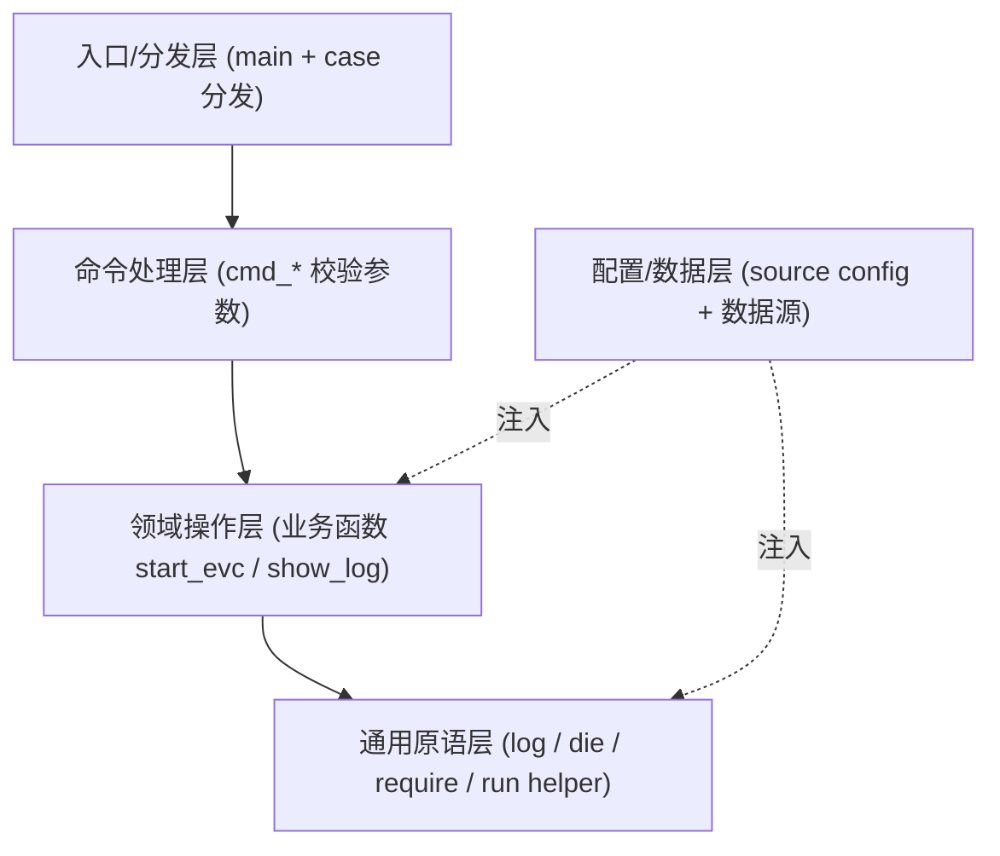

# 复杂 Shell 脚本的组织心智模型与通用模板

> 这篇笔记回答两个问题：
>
> 1. 一个复杂脚本，应该在脑子里**怎么分层**？
> 2. 这个分层**怎么落成一份可以直接复制的模板**？
>
> 它不重复逐条最佳实践（见 [shell_script_guide.md](shell_script_guide.md)），
> 也不重复数据流模型（见 [data_logic_seperation.md](data_logic_seperation.md)、
> [cmd_io_stream.md](cmd_io_stream.md)），而是讲**结构与组织**。

---

# 一、核心心智模型：把脚本看成「分层管道」

一句话原则：

> **上层只负责"决定做什么"，下层只负责"怎么做"，依赖单向向下。**

把任何一个复杂脚本拆成 5 层：



各层职责：

| 层 | 职责 | 不该做的事 |
|----|------|-----------|
| 入口/分发层 `main` | 解析第一个动作，分发到对应 handler | 不写业务逻辑、不拼命令 |
| 命令处理层 `cmd_*` | 校验本动作的参数（target 合法性） | 不直接执行底层命令 |
| 领域操作层 | 一个函数 = 一件业务事（启动容器、看日志） | 不解析命令行、不写死配置值 |
| 通用原语层 | 与业务无关的积木：日志、报错、依赖检查、命令封装 | 不知道任何业务名词 |
| 配置/数据层 | 所有可变值（路径、token、前缀、镜像） | 不含任何逻辑 |

**核心约束：只能向下调用，禁止向上回调。** 这样每一层都能被单独读懂、单独替换。

## 违反分层的坏味道

```bash
# 坏味道 1：业务函数里散落硬编码（配置层泄漏到领域层）
start_evc() {
    nomad job run -var "image=artifactory.../evc:latest" \
                  -var "host=dev5" evc.nomad.hcl     # 改个环境就要改代码
}

# 坏味道 2：参数解析和执行混在一起（入口层和领域层粘连）
if [[ "$1" == "-s" ]]; then
    cd /some/dir
    nomad job run ...                                 # main 里直接干活
fi

# 坏味道 3：多个布尔 flag 共享一个变量，循环后多个 if 顺序执行
#（脆弱，详见第三节）
```

---

# 二、三条分离原则

分层能成立，靠的是三条"分离"。

## 1. 数据与逻辑分离

来自 [data_logic_seperation.md](data_logic_seperation.md) 的结论：

> **循环应该消费数据，而不是保存数据。**

写脚本先问"数据来自哪里（数组 / heredoc / 文件 / 命令输出）"，
再决定 `for` / `while read` 怎么消费它。逻辑里不内嵌数据清单。

## 2. 配置与代码分离

所有"换个环境/换个人就要改"的值，都不该写在逻辑里：

```bash
# 代码侧：只引用变量，不知道具体值
CONFIG_FILE="${MYTOOL_CONFIG:-$SCRIPT_DIR/tool.conf}"
source "$CONFIG_FILE"

# 配置侧（tool.conf）：只有数据，没有逻辑
SERVICE_PREFIX="dentist"
IMAGE_PATH="artifactory.../evc:latest"
```

好处：同一份脚本 + 不同 conf = 不同环境；密钥不进版本库。

## 3. 编排与执行分离

重复的命令模板，抽成"原语"。脚本只负责**编排**（决定调用顺序与参数），
原语负责**执行**（怎么把参数拼成真正的命令）。

```bash
# 把 key=value 列表展开成 -var key=value，编排者不关心展开细节
nomad_job_run() {
    local hcl=$1; shift
    local -a args=()
    local v
    for v in "$@"; do args+=(-var "$v"); done
    ( cd "$HCL_DIR" && nomad job run "${args[@]}" "$hcl" )
}

start_evc() {                      # 编排：我只说"用这些参数跑这个 job"
    nomad_job_run "$EVC_HCL" \
        "force=true" \
        "image_path=$EVC_IMAGE_PATH"
}
```

> 这三条分离，对应数据流笔记里反复出现的
> `Data Source -> Processing -> Output` 模型：数据在底层，逻辑在中层，编排在上层。

---

# 三、反模式 -> 正模式：从「标志泥潭」到「子命令分发」

## 反模式：布尔 flag + 共享变量 + 顺序 if

```bash
# 解析阶段：设置一堆布尔标志，共用同一个 container 变量
while [[ "$1" != "" ]]; do
    case $1 in
        -s) shift; start="true";    container=$1 ;;
        -p) shift; purge="true";    container=$1 ;;
        -t) shift; terminal="true"; container=$1 ;;
    esac
    shift
done

# 执行阶段：多个独立 if 顺序判断
if [[ "$start" == "true" ]]; then ... ; fi
if [[ "$purge" == "true" ]]; then ... ; fi
if [[ "$terminal" == "true" ]]; then ... ; fi
```

为什么脆弱：

- `container` 被所有动作共享，`-s evc -p all` 会互相覆盖，语义不清。
- 动作之间没有互斥，多个 `if` 块可能**同时**触发。
- 校验逻辑散落在每个 `if` 里，重复又不一致。
- 加一个新动作要同时改"解析"和"执行"两处。

## 正模式：case 分发到 cmd_*

```bash
main() {
    local cmd=${1:-help}; shift || true
    case $cmd in
        start)    cmd_start "$@" ;;
        terminal) cmd_terminal "$@" ;;
        purge)    cmd_purge "$@" ;;
        help|-h)  usage ;;
        *)        usage >&2; die "unknown command: $cmd" ;;
    esac
}

cmd_start() {                       # 每个动作自己校验自己的 target
    local target=${1:-}
    case $target in
        evc|event) start_"$target" ;;
        *) die "usage: start <evc|event>" ;;
    esac
}
```

好处：动作天然互斥；每个 `cmd_*` 自包含（校验 + 转发）；加动作只改一处。

## 选择指南：三种参数风格怎么挑

```
+------------------------+-------------------------------+
| 场景                   | 推荐风格                      |
+------------------------+-------------------------------+
| 单一职责小脚本         | 位置参数  $1 $2               |
| 选项 + 开关型工具      | getopts -f file -v            |
| 多动作子命令型工具     | 子命令分发 tool <cmd> <arg>   |
+------------------------+-------------------------------+
```

- `getopts` 细节见 [shell_script_guide.md](shell_script_guide.md) 第 10 节与
  [parse_cmd_args.md](parse_cmd_args.md)。
- 子命令分发适合"一个脚本管多件事"（start/log/purge/show…）。

---

# 四、通用原语层：可复用的积木

与业务无关、几乎每个复杂脚本都会用到：

```bash
# 统一输出：正常信息到 stdout，错误到 stderr
log() { printf '%s\n' "$*"; }
die() { printf 'error: %s\n' "$*" >&2; exit 1; }

# 依赖检查：缺命令就早失败
require() {
    command -v "$1" >/dev/null 2>&1 || die "$1 not found"
}

# 副作用隔离：在子 shell 里 cd，不污染主 shell 的工作目录
in_dir() {
    local dir=$1; shift
    ( cd "$dir" && "$@" )
}

# 命令模板封装：把可变参数数组化，避免 word splitting / 注入
#（命令构造为何用数组，见 shell_script_guide.md 第 12 节）
```

> 原语层的判定标准：**把脚本里所有业务名词删掉，函数依然成立**。
> `log` / `die` / `require` 不知道 "evc" 是什么，所以它们是原语。

---

# 五、通用模板（可直接复制的骨架）

下面这份骨架，是把分层模型 + 三条分离 + 子命令分发固化下来的结果，
新脚本从它起步即可（含外置配置）。

```bash
#!/usr/bin/env bash
#
# <一句话描述脚本用途>
# 配置见 tool.conf.example；用 MYTOOL_CONFIG 覆盖配置路径。

set -Eeuo pipefail

# --- 0. 定位与配置路径 ---------------------------------------------------
readonly SCRIPT_DIR="$(cd "$(dirname "${BASH_SOURCE[0]}")" && pwd)"
readonly SCRIPT_NAME="$(basename "$0")"
CONFIG_FILE="${MYTOOL_CONFIG:-$SCRIPT_DIR/tool.conf}"

# --- 1. 通用原语层 -------------------------------------------------------
log()     { printf '%s\n' "$*"; }
die()     { printf 'error: %s\n' "$*" >&2; exit 1; }
require() { command -v "$1" >/dev/null 2>&1 || die "$1 not found"; }

usage() {
    cat <<EOF
usage: $SCRIPT_NAME <command> [args]

commands:
  start <a|b>   ...
  show  <x>     ...
  help          show this help
EOF
}

# --- 2. 配置/数据层 ------------------------------------------------------
load_config() {
    [[ -f "$CONFIG_FILE" ]] || die "config not found: $CONFIG_FILE"
    # shellcheck source=/dev/null
    source "$CONFIG_FILE"
    : "${REQUIRED_VAR:?REQUIRED_VAR not set in $CONFIG_FILE}"   # 必填校验
}

# --- 3. 领域操作层 -------------------------------------------------------
do_start() {
    local target=$1
    log "starting $target ..."
    # 真正的业务命令（引用配置变量，不写死）
}

# --- 4. 命令处理层 -------------------------------------------------------
cmd_start() {
    local target=${1:-}
    case $target in
        a|b) do_start "$target" ;;
        *)   die "usage: start <a|b>" ;;
    esac
}

# --- 5. 入口/分发层 ------------------------------------------------------
main() {
    local cmd=${1:-help}; shift || true
    case $cmd in
        help|-h|--help) usage; return 0 ;;
    esac

    load_config            # 需要配置的命令才加载（help 不需要）

    case $cmd in
        start) cmd_start "$@" ;;
        *)     usage >&2; die "unknown command: $cmd" ;;
    esac
}

main "$@"
```

## 精简版（无配置的小工具）

不需要外置配置、动作很少时，砍掉配置层即可：

```bash
#!/usr/bin/env bash
set -Eeuo pipefail

log() { printf '%s\n' "$*"; }
die() { printf 'error: %s\n' "$*" >&2; exit 1; }

main() {
    local input=${1:-}
    [[ -n "$input" ]] || die "usage: $(basename "$0") <input>"
    # ... 处理 input ...
}

main "$@"
```

---

# 六、配置文件模式细节

```bash
# 1) 路径可覆盖：默认同目录，允许环境变量指定
CONFIG_FILE="${MYTOOL_CONFIG:-$SCRIPT_DIR/tool.conf}"

# 2) 必填校验：用 ${VAR:?msg}，缺值立即报错退出
: "${NOMAD_TOKEN:?NOMAD_TOKEN not set in $CONFIG_FILE}"

# 3) 派生值放配置里，减少重复
SERVICE_PREFIX="dentist"
KAFKA_SERVICE_NAME="${SERVICE_PREFIX}-kafka-bootstrap-server"
```

配套约定：

- 仓库里只提交 `tool.conf.example`（占位值），**不提交**含真实密钥的 `tool.conf`。
- 含密钥的真实配置 `chmod 600`。
- 配置文件**只放数据，不放逻辑**（呼应第二节"配置与代码分离"）。

---

# 七、决策速查表 + 检查清单

## 结构选择速查

```
+----------------------+----------------------+-------------------------+
| 维度                 | 简单                 | 复杂                    |
+----------------------+----------------------+-------------------------+
| 动作数               | 1 个 -> 位置参数     | 多个 -> 子命令分发      |
| 选项/开关            | 无 -> 位置参数       | 有 -> getopts           |
| 可变值/密钥          | 无 -> 顶部常量       | 有 -> 外置 config       |
| 行数                 | <100 -> 单文件       | >500 -> 拆 lib/ 或迁移  |
|                      |                      |        Python           |
+----------------------+----------------------+-------------------------+
```

> 何时该弃用 Shell 改 Python、目录怎么拆 `bin/ lib/ config/`，
> 见 [shell_script_guide.md](shell_script_guide.md) 第 28、29 节。

## 落地检查清单

```
[ ] set -Eeuo pipefail，变量全部加引号
[ ] 分层：main 分发 / cmd_* 校验 / 领域函数干活 / 原语无业务名词
[ ] 配置外置，必填项用 ${VAR:?} 校验，密钥不进版本库
[ ] 重复命令模板抽成 helper（数组化参数）
[ ] cd 用子 shell 隔离，不污染主 shell
[ ] 有 usage；未知命令/缺参数时 die 并返回非零
[ ] shellcheck + shfmt 过一遍
```

> 逐条最佳实践与"工程级黄金法则"清单见
> [shell_script_guide.md](shell_script_guide.md) 第 31 节，这里不重抄。

---

# 八、一句话总结

> 复杂脚本不是"一堆命令的堆叠"，而是
> **分发 -> 校验 -> 业务 -> 原语 -> 配置** 的单向分层管道。
>
> 先想清楚每个值/每段逻辑属于哪一层，模板自然就长出来了。
