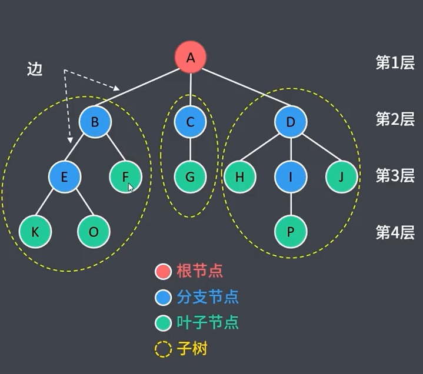
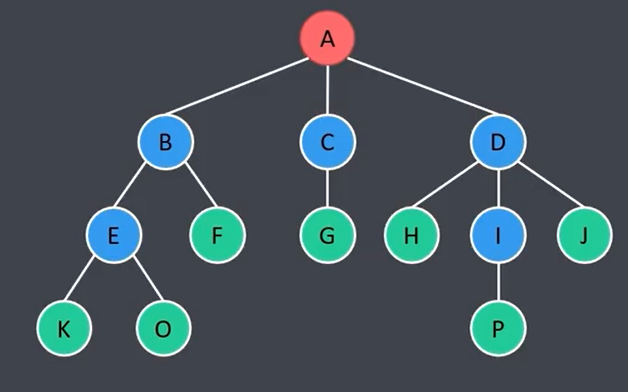
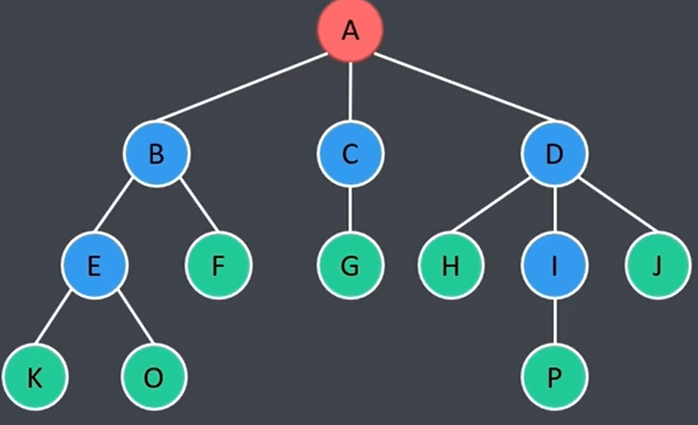
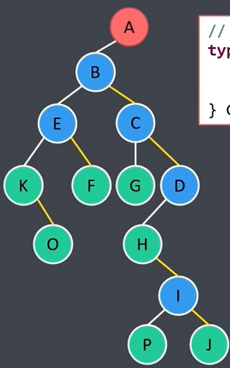
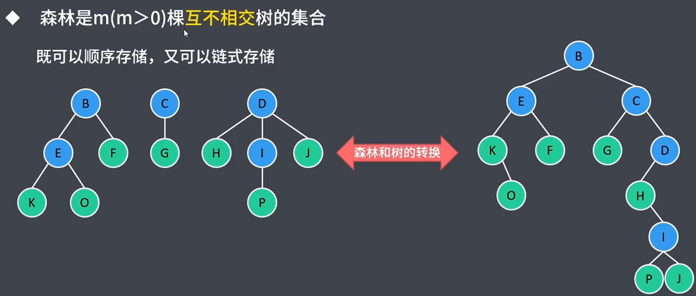
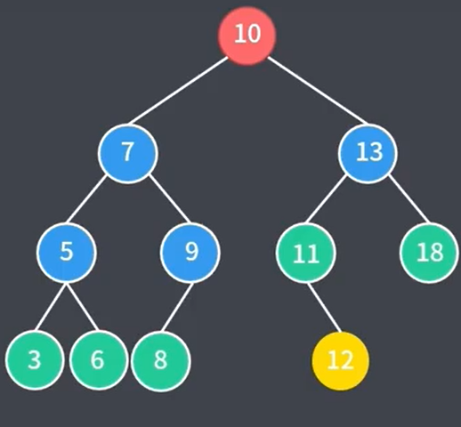
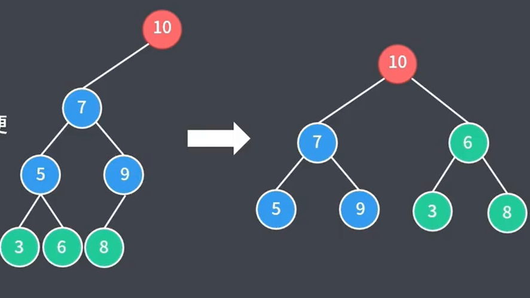

- 树（逻辑结构）
	- 
- 基本概念
	- 树
		- ^^有层次关系^^的N个节点有限集合
		- 空树
			- N=0
		- 非空树
			- 有且仅有一个根节点
			- 有序树
				- 各节点的子树从左至右有序
			- 无序树
				- 各节点的子树从左至右无序
	- 节点（数据）
		- 根节点
			- 非空树的根节点有且仅有一个
		- 分支节点
			- 该节点下^还有^分支，即还有叶子几点，称之为分支节点
		- 叶子节点
			- 该节点下^没有^分支，即没有叶子几点，称之为叶子节点
		- 节点之间的关系
			- 前驱
				- 父节点
				- 每个节点最多只有1个前驱节点
			- 后继
				- 子节点
				- 每个节点可以有0个或多个后继节点
	- 子树
		- 除根节点外，m个互不相交的有限集合
		- 例如：B子树，C子树，E子树，I子树，G子树
	- 边，度，高度（深度，层次）
		- 高度
			- 高度即深度，即层次
			- 整个树的高度取决于所有子树中的最大高度
		- 边
		- 度
			- 度本意指边，描述的是节点和节点之间测层次关系，度描述的是节点边的数量，在树型结构里节点的度特指该节点有多少个子节点，即B节点的度为2
	- 多叉树
		- 具体为几叉树，取决于所有节点中子树最多的个数
- 树的性质
	- 节点数 = 总度数 + 1
	- 节点的度 = 节点孩子个数
	- 度为m的树：各节点度的最大值为m
		- 任意节点的度小于等于m
		- 至少有一个节点的度等于m
	- m叉树：每个节点最多有m个孩子（可能对树进行删除节点的操作）
		- 任意节点的度小于等于m
		- 允许所有节点的度都小于m
		- 第i层至多有m^(i-1)个节点
		- 高度为h的m叉树至多有m^(h-1)/(m-1)个节点
			- 等比数列求和1 + m + m^2 + ... + m^(h-1)
			- 高度为h的m叉树至少有h个节点
			- 高度为h度为m的树至少有h+m-1个节点
		- 有n个节点的m叉树的最小高度h
			- 前h-1层最多有S(h-1)=(m^(h-1)-1)/(m-1)个节点
			- 前h层最多有S(h)=(m^h-1)/(m-1)个节点
			- S(h-1)<n<=S(h) 推导出 h=log_m(n*(m-1)+1)
- 树的实际存储结构
	- 双亲表示法（顺序存储）
	  collapsed:: true
		- 使用一组连续空间（数组）存储每个节点，同时每个节点中有一个伪指针，指示其双亲节点在数组中的位置
			- ```C
			  #define MAX_TREE_SIZE 100
			  // 树的节点定义
			  typedef struct ParentTreeNode {
			    ElemType data; // 数据域
			    int parent;	 // 伪指针，指向双亲位置域
			  } PTNode;
			  // 树的类型定义
			  type define ParentTree {
			    // 数组结构的树节点
			    PTNode nodes[MAX_TREE_SIZE];
			    int num; // 实际节点数
			  } PTree;
			  
			  # 根节点固定存储在索引为0，parent为-1的位置，表示没有双亲
			  # 新增元素无须按照逻辑顺序存储
			  ```
		- 缺点
			- 只能根据子节点查找父节点，如果需要根据父节点来查找子节点，需要遍历整个数组，开销大
		- 示例
			- 
			- ```c
			  parent: -1  0  0  0  1  1  2  3  3  3  4  4  8
			  data:    A  B  C  D  E  F  G  H  I  J  K  O  P
			  index:   0  1  2  3  4  5  6  7  8  9  10 11 12 13 14 15
			  ```
	- 孩子表示法（顺序存储+链式存储）
	  collapsed:: true
		- 将每个节点的孩子节点都用单链表链接起来，形成一个线性结构，N个节点就会有N个孩子链表
		- ```c
		  #define MAX_TREE_SIZE 100
		  // 树的节点定义
		  typedef struct ChildrenLinkedNode {
		    ElemType data; // 数据域
		    CLNode *child; // 指向第一个孩子
		  } CLNode;
		  // 树的类型定义
		  type define ChildrenTree {
		    // 数组结构的树节点
		    CLNode nodes[MAX_TREE_SIZE];
		    int num; // 实际节点数
		  } CTree;
		  ```
		- 示例
			- 
			- ```c
			  index  data  child
			  0       A      -> B -> C -> D -> null
			  1       B      -> E -> F -> null
			  2       C      -> G -> null
			  3       D      -> E -> I -> J -> null
			  4       E      -> K -> O -> null
			  5       F      -> null  
			  6       G      -> null
			  7       H      -> null
			  8       I      -> P -> null
			  9       J      -> null
			  10      K      -> null
			  11      O      -> null
			  12      P      -> null
			  13      
			  14      
			  15      
			  ```
	- 孩子兄弟表示法（链式存储）
	  collapsed:: true
		- 也称作二叉树表示法，或者二叉链表表示法，即以二叉链表作为树的存储结构。链表中节点的两个链域分别指向该节点的第一个孩子节点和下一个兄弟节点：firstChild, nextSibling
		- ```c
		  //树的节点定义
		  typedef struct ChildBrotherNode {
		    ElemType data; // 数据域
		    CBNode *firstChild;, *nextSibling;
		  } CBNode;
		  ```
		- 示例
			- 
			- 
	- 森林
	  collapsed:: true
		- 森林是m(m>=0)棵互不相交的树的集合，既可以顺序存储，也可以链式存储
		- 
- 二叉树
	- 节点的^^度<=2的有序树^^
	- 二叉树的性质
		-
	- 满二叉树
		- 高度为h，节点数为2^h - 1
		- 只有最后一层有叶子结点
		- 不存在度为1的节点
		- 按层序从1编号，i的左子节点编号为2i，右子节点编号为2i+1，父节点编号为i/2
	- 完全二叉树
		- 当且仅当树中的每个节点序号都与同等高度的满二叉树序号一一对应时，该树为完全二叉树
		- 只有最后两层可能有叶子结点
		- 最多有一个度为1的节点
		- 按层序从1编号，序号与位置关系与满二叉树相同，i<=n/2为分支节点，i>n/2为叶子节点
	- 二叉排序树
	  collapsed:: true
		- 任意节点都与其左右子节点的关键字大小关系都满足：左<中<右
		- 常用于元素的排序，搜索
		- 示例：插入新元素12
			- 从根节点出发进行比较，直到找到合适的位置
			- 
	- 平衡二叉树
	  collapsed:: true
		- 任意节点的左右子树深度差不超过1
		- 插入或删除元素后，动态调整树的结构，以便于提高下次搜索效率
		- 
		- 如何将普通树调整为平衡二叉树 ？