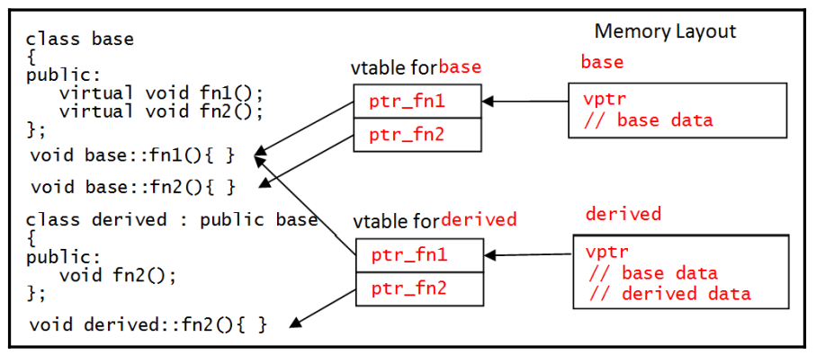
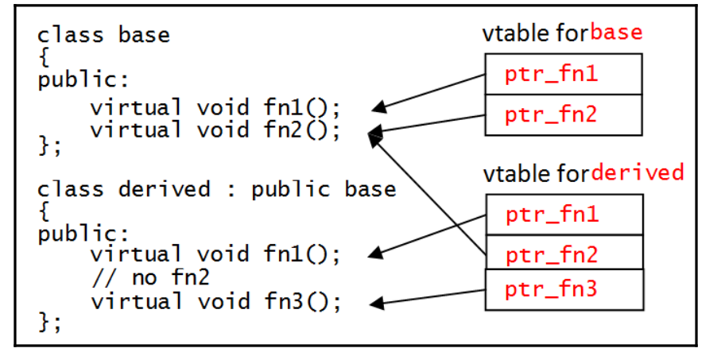
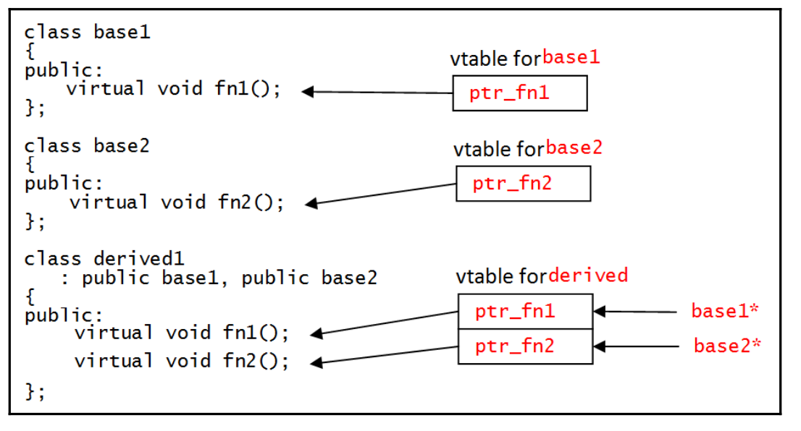

[C++ reference](https://en.cppreference.com/w)  
[C++ Standard Library](https://en.cppreference.com/w/cpp/standard_library)  
  
[The C++ Standard Library - A Tutorial and Reference source code](http://www.cppstdlib.com/)  
[C++ Templates The Complete Guide, 2nd Edition](https://github.com/xuchen-tech/Books/blob/main/C%2B%2B%20Templates%20The%20Complete%20Guide%2C%202nd%20Edition%20%5BBooxRack%5D.pdf) #pdf  
 #pdf  
[C++ Templates - The Complete Guide souce code](http://www.tmplbook.com/)  
[C+++Templates+完全导引](https://github.com/xuchen-tech/Books/blob/main/C%2B%2B%2BTemplates%2B%E5%AE%8C%E5%85%A8%E5%AF%BC%E5%BC%95.pdf) #pdf  

[深度探索C++对象模型](https://github.com/xuchen-tech/Books/blob/main/%E6%B7%B1%E5%BA%A6%E6%8E%A2%E7%B4%A2C%2B%2B%E5%AF%B9%E8%B1%A1%E6%A8%A1%E5%9E%8B(jb51.net).pdf) #pdf  


[Learn C++ Programming](https://www.programiz.com/cpp-programming)  
[LEARN C++](https://www.learncpp.com/)  
[cppbestpractices](https://github.com/cpp-best-practices/cppbestpractices/tree/master)  
[Effective-Modern-Cpp](https://github.com/downdemo/Effective-Modern-Cpp/tree/master)  

[Threading in C++](https://ananyapam7.github.io/blog/2023/threading/)  

[**Modernes C++**](https://www.modernescpp.com/index.php/table-of-content/)  
[**algorithm**](https://cplusplus.com/reference/algorithm/)  
[**string**](https://cplusplus.com/reference/string/string/)  
[编程指北](https://csguide.cn/cpp)  
[**C++ online compiler**](https://www.programiz.com/cpp-programming/online-compiler/)  
[**Online Compiler**](https://www.mycompiler.io/new/asm-x86_64) #online  
[C++ 文档](https://learn.microsoft.com/zh-cn/cpp/cpp/?view=msvc-170)  
[**C++ Language Reference**](https://learn.microsoft.com/en-us/cpp/cpp/cpp-language-reference?view=msvc-170)  
[**Apache C++ Standard Library User's Guide**](https://stdcxx.apache.org/doc/stdlibug/booktoc.html)  
[CPP C++ Papyrus](https://caiorss.github.io/C-Cpp-Notes/)  
[The Standard Template Library Tutorial](https://www4.rcf.bnl.gov/~phoncs/oncs/stl_tutorial/prwmain.htm#i)  
## functor:    
[What are C++ functors and their uses?](https://stackoverflow.com/questions/356950/what-are-c-functors-and-their-uses)  
[C++ Functors](https://euccas.github.io/blog/20170115/c-plus-plus-functors.html)  
[Functors: Function Objects in C++](https://www.cprogramming.com/tutorial/functors-function-objects-in-c++.html)  
[**C++ Lambda Anonymous Functions - The Simple Guide**](https://www.moreofless.co.uk/lamba-cplusplus)  
[Lambda expressions (since C++11)](https://en.cppreference.com/w/cpp/language/lambda)  
[**C++ Algorithms library**](https://en.cppreference.com/w/cpp/algorithm)  
[std::accumulate](https://en.cppreference.com/w/cpp/algorithm/accumulate)  
[**using**](https://en.cppreference.com/w/cpp/keyword/using)  
[How do C++ using-directives work?](https://quuxplusone.github.io/blog/2020/12/21/using-directive/)  
```cpp

/*
#include tells the compiler to copy the contents of the specified file into the source file at this point
<> 表示 编译器会从标准路径查找头文件
C++标准库通常使用不带后缀的头文件，用户的自定义头文件通常使用.h, .hpp, .hxx的后缀
*/
#include <iostream>

// 单行注释

/*
function 定义：
返回类型 函数名(类型1 参数名称1, 类型2 参数名称2, ...))
{
    函数体；
}

{} 标识一个 code block

对于C++而言main函数是程序执行时第一个被call到的函数
*/
int main(int argc, char *argv[])
{
/*
std 表示 std namespace
:: 是 scope resolution operator, 表示cout对象是在std的命名空间下声明的
std::cout 表示 cout stream object 是C++标准库的一部分
<< means that a function called "operator <<" is called and is passed the string
C++支持operator overloading，因此对于不同类型的参数，operator 的行为也不同

cout对象是ostream class的一个实例，在main函数调用之前创建
*/
    std::cout << "there are " << argc << " parameters" << std::endl;
    for(int i = 0; i < argc; i++)
    {
        std::cout << argv[i] << std::endl;
    }
/*
在C++中如果函数声明了返回值，则必须返回指定类型的值，main函数是唯一的例外，main函数默认返回0
*/
}


Pragmas是针对编译器的指令,不同的编译器支持不同的#pragma指令.
库文件的后缀：
	Windows:
		静态库	".lib"
		动态库	".dll"
	GNU gcc:
		静态库	".a"
		动态库	".so"

Function prototype（函数原型）在不给定函数定义的情况下，向编译器声明调用函数所必须遵循的接口规范
如果函数A调用函数B，则函数B必须在函数A之前定义或者声明，通常将函数名的声明写在一个单独的头文件里，函数的实现写在另外一个源文件里。

build
	target: the output of a build step
	the dependencies of that target: the inputs of the build step


An expression(表达式) is a sequence of operators and operands (variables or literals) that results in some value.

A statement（语句） can be a declaration of a variable, an expression that evaluates to a value, or it can be a definition of a type. A statement may also be a control structure to affect the flow of the execution through your code. A statement ends with a semicolon. A semicolon on its own is called a null statement. A null statement does nothing, so having too many semicolons is usually benign.

通常来讲，表达式后加分号可以变为语句
每个表达式要么是lvalue，要么是rvalue, lvalue是一个表达式，它指向特定的内存位置，lvalue可以出现在赋值的左边或者右边，所有变量都是lvalues
rvalue是一个临时的值，它的生命周期只存在于使用它的表达式，它有特定的值但是不能接受赋值，所以它只能存在在赋值的右边，典型的rvalue是字面常量


Comma operator（逗号） 操作符的优先级最低
通常，在使用变量时再进行变量的声明，可以有效的避免命名冲突

变量赋值的3中方法：
1. assign a value (直接赋值)
	int i = 1;
2. call the type constructor (调用类型的构造函数)
	int j = int(2);
3. initialize a variable using function syntax （使用函数式语法进行赋值）
	int k(3);

每一种类型都有对应的字面常量的表示

常量:
const double pi = 3.1415;

constant expressions（常量表达式）:
constexpr 关键字适用于表达式，表明该表达式 should be evaluated at compile type rather than at runtime

constexpr double pi = 3.1415;
constexpr double twopi = 2 * pi;

当 constexpr 关键字应用于函数时，表明该函数代码允许编译器在编译期间对代码进行常量优化（evaluated at compile time），如果编译器无法在编译期间确定参数的值，则函数被视普通的函数不进行优化。
constexpr int triang(int i)
{
	return (i == 0) ? 0 : triang(i - 1) + i;
}
如果一个函数用constexpr进行修饰，则该函数必须只包含一个表达式（A function marked with the constexpr keyword must only have one expression）


编译器假定 enum 的默认类型为 int 类型，但是用户可以在声明时显式指定其类型

enum suits {clubs, diamonds, hearts, spades};			// 默认为 int 类型
enum suits : char {clubs, diamonds, hearts, spades};	// 指定 enum 的类型为 char

suits card1 = diamonds;
suits card2 = suits::diamonds;    // scope it with the name of the enumeration which is better

使用关键字 class 可以强制用户在使用enum的值的时候指定scope
enum class suits : char {clubs, diamonds, hearts, spades};	// 强制用户在使用enum的值的时候指定scope
suits card3 = suits::diamonds;    // scope it with the name of the enumeration which is better

编译器默认给定 enum 的第一个值为0，之后依次累加1
enum ports {ftp=21, ssh, telnet, smtp=25, http=80};

命名空间 namespace 是一种模块化组织代码的机制，命名空间使用 scope resolution operator :: 来 label your types, functions, and variables with a unique name  


// 1
namespace utilities
{
	bool poll_data()
	{
		// code that returns a bool
	}
	int get_data()
	{
		// code that returns an integer
	}
}

// 2
namespace utilities
{
	// declare the functions
	bool poll_data();
	int get_data();
}

//define the functions
bool utilities::poll_data()
{
	// code that returns a bool
}

int utilities::get_data()
{
	// code that returns an integer
}

命名空间的应用之一就是用来管理代码的版本
 namespace utilities
 {
	bool poll_data();
	int get_data();

	namespace V2
	{
		bool poll_data();
		int get_data();
		int new_feature();
	}
 }
当命名空间中函数调用同级命名空间下的函数时，不需要使用 a qualified name
当声明嵌套的命名空间时，需要手动进行嵌套声明

inline namespace 用来定义嵌套的命名空间，但是当进行argument-dependent lookup时允许编译器将该嵌套的命名空间当作其parent namespace进行查找

namespace utilities
{
	inline namespace V1			// 此时utilities::get_data 与 utilities::V1::get_data 等效
	{
		bool poll_data();
		int get_data();
	}

	namespace V2
	{
		bool poll_data();
		int get_data();
		int new_feature();
	}
}

使用 using statement 用来将特定的 namespace 中声明的符号引入当前的命名空间而不必使用完整的路径(symbols declared in the specified namespace can be used without a fully qualified name)
using namespace utilities;
int i = get_data();
int j = V2::get_data();

using std::cout;
using std::endl;
cout << "Hello, World!" << endl;

namespace 的作用是将定义的 items 限制在特定的范围里，避免与其他命名空间下的同名 items 产生冲突

namespace alias: 用于对特定的 namespace 定义别名

namespace com_packtpub_richard_grimes
{
	int get_data();
}

int i = com_packtpub_richard_grimes::get_data();
可以被简化为
namespace packtRG = com_packtpub_richard_grimes;
int i = packtRG::get_data();

没有名字的 namespace 意味着内部链接（internal linkage），即只能在当前的文件中使用，在其他文件中不可用
A namespace without a name has the special meaning that it has internal linkage, that is, the items can only be used in the current translation unit, the current file, and not in any other file.

没有声明在任何命名空间中的代码意味着 global namespace, 在这种情况下code可以省略 namesapce name，也可以显式的使用 scope resolution operator without a namespace name 来表明 该 item 时在 global namespace 下
Code that is not declared in a namespace will be a member of the global namespace.  You can call the code without a namespace name, but you may want to explicitly indicate that the item is in the global namespace using the scope resolution operator without a namespace name

int version = 42;
void print_version()
{
	std::cout << "Version = " << ::version << std::endl;
}


The vector template is a class that contains items of the type specified in the angle brackets (<>); 
The vector can be initialized in a special way called "list initialization" which is new to C++11, 

// traverse 1
using namespace std;
vector<string> beatles = { "John", "Paul", "George", "Ringo" };
for (int i = 0; i < beatles.size(); ++i)
{
	cout << beatles.at(i) << endl;
}

// Range-based for:
vector<string> beatles = { "John", "Paul", "George", "Ringo" };
for (string musician : beatles)
{
	cout << musician << endl;
}

// traverse 2
int birth_years[] = { 1940, 1942, 1943, 1940 };
for (int birth_year : birth_years)
{
	cout << birth_year << endl;
}

变量是类型的实例化，代表了容纳这个数据类型大小的内存单元。

// #include <cstdint>
using namespace std; // Values for x86
cout << sizeof(int8_t) << endl; // 1
cout << sizeof(int16_t) << endl; // 2
cout << sizeof(int32_t) << endl; // 4
cout << sizeof(int64_t) << endl; // 8

// Using bitset to show bit patterns

#include <iostream>
#include <bitset>

int main()
{
    // The compiler ignores the quote; it is just used as a visual aid.
    unsigned long long every_other = 0xAAAA'AAAA'AAAA'AAAA;
    unsigned long long each_other = 0x5555'5555'5555'5555;
    std::cout << std::hex << std::showbase << std::uppercase;
    std::cout << every_other << std::endl;
    std::cout << each_other << std::endl;

    // Using bitset to show bit patterns
    std::bitset<64> bs_every(every_other);
    std::cout << bs_every << std::endl;
    
    bs_every.set(0);
    every_other = bs_every.to_ullong();
    std::cout << bs_every << std::endl;
    std::cout << every_other << std::endl;
}


big-endian and little-endian 的转换:
	unsigned short reverse(unsigned short us)
	{
		return ((us & 0xff) << 8) | ((us & 0xff00) >> 8);
	}

字符处理相关的宏定义
/*
	Macro 		Tests if the character is:
	isalnum 	An alphanumeric character, A to Z, a to z, 0 to 9
	isalpha 	An alphabetic character, A to Z, a to z
	isascii 	An ASCII character, 0x00 to 0x7f
	isblank 	A space or horizontal tab
	iscntrl 	A control character, 0x00 to 0x1f or 0x7f
	isdigit 	A decimal digit 0 to 9
	isgraph 	A printable character other than space, 0x21 to 0x7e
	islower 	A lowercase character, a to z
	isprint 	A printable character, 0x20 to 0x7e
	ispunct 	A punctuation character, ! " # $ % & ' ( ) * + , - . / : ; < = > ? @ [ ] ^ _ ` { | } ~ \
	isspace 	A space
	isupper 	An uppercase character, A to Z
	isxdigit 	A hexadecimal digit, 0 to 9, a to f, A to F


	toupper 	The uppercase version of the character
	tolower 	The lowercase version of the character
*/

Raw strings(原始字符串), 当需要 switch off 转义字符时候会用到 raw string
	R"(xxxxxxxxx)"

	cout << R"(newline is \n in C++ and "quoted text" use quotes)";
	打印结果：
	newline is \n in C++ and "quoted text" use quotes


String byte order（字符串字节序）
扩展字符集的一个字符可能会使用多个字节进行表示，如果这类字符在文件中进行存储，那么字节序就变得很关键，此时会用到  Byte Order Mark (BOM)

The bool type : true or false.

void 并不是一个类型，因此不能定义一个 void 类型的变量， void 代表 the absence of a type

变量的初始化：
	int i = 1;			// initialized to a value
	int j = int(2);		// calling the type as if it is a function
	int k(3);			// calls the constructor of the int type
	int m{4};			// initializes the variable using an initialize list between curly braces ({})

auto：变量类型自动推导，因为编译器需要根据 initializer 进行类型推导，所以所有的 auto 变量必须初始化。
	auto i = 42; // int
	auto l = 42l; // long
	auto ll = 42ll; // long long
	auto f = 1.0f; // float
	auto d = 1.0; // double
	auto c = 'q'; // char
	auto b = true; // bool
auto 变量通常用于在使用 container 时候自动推导 container 内的元素类型。

Storage classes
声明变量时，可以通过指定变量的 storage class 来限定变量的 lifetime, linkage(what other code can access it) 以及变量的内存位置

static variable in a function
	变量只能在函数内部访问， 但是变量的 lifetime is the same as the program
static variable declared at file scope
	变量只能在当前文件内部访问（internal linkage）
variable declared at file scope without static
	external linkage,变量对别的文件可见

extern 关键字表明 variable 或者 function 具有 external linkage 属性，可以被外部文件访问


thread_local 也是storage class specifier 之一

使用类型别名
// 1 typedef
	typedef tuple<string, int> name_year_t;
	vector<name_year_t> beatles;

// 2 using
	using name_year = tuple<string, int>;


struct 用来 Aggregating data in record types

	struct time_of_day
	{
		int sec;
		int min;
		int hour;
	};

There are several ways to initialize an instance of a structure.
	time_of_day lunch {0, 0, 13};	// 按照结构体的成员顺序进行 list initializer
	time_of_day midnight {};		// 提供的初始化的值的个数少于结构体成员个数，the remaining members are initialized to zero
	time_of_day midnight_30 {0, 30};

	// 结构体提的成员类型可以时另外一个结构体
	struct working_hours
	{
		time_of_day start_work;
		time_of_day end_work;
	};

	working_hours weekday{ {0, 30, 8}, {0, 0, 17} };


Structure fields
结构体成员可以是单个比特(bit-field)，结构体成员可以是匿名的
	struct item_length
	{
		unsigned short len : 10;
		unsigned short : 5;
		bool dirty : 1;
	};

使用 struct name
在一些场景下，在定义 struct 之前可能会用到它，此时只要确保不访问 struct 成员的情况下，可以对 struct 进行声明并使用
	struct time_of_day;
	void print_day(time_of_day time);
然而也有例外，a type can hold pointers to instances of the same type before the type is fully declared。原因是指针的大小是确定的，因此编译器可以为结构体成员分配足够的内存。但是创建类型的实例之前类型定义必须确定下来，典型的例子是链表的定义

结构体成员内存对齐
	The compiler will place variables in memory in the way that is the most efficient, in terms of memory usage, or speed of access. The various types will be aligned to alignment boundaries.
	alignof 操作符用来测试特定类型的 alignment
	std::cout << "alignment boundary for int is " << alignof(int) << std::endl;

A union is a struct where all the members occupy the same memory. The size of such a type is the size of the largest member. Since a union can only hold one item of data, it is a mechanism to interpret the data in more than one way.

// edited version
 struct VARIANT
 {
	unsigned short vt;
	union
	{
		unsigned char bVal;
		short iVal;
		long lVal;
		long long llVal;
		float fltVal;
		double dblVal;
	};
 }


typeid 操作符用于返回运行时变量的类型信息
Runtime Type Information (RTTI) is significant when you use custom types that can be used in a polymorphic way

cout << "int type name: " << typeid(int).name() << endl;
int i = 42;
cout << "i type name: " << typeid(i).name() << endl;


auto a = i;
if (typeid(a) == typeid(int))
{
	cout << "we can treat a as an int" << endl;
}


Determining type limits
	cout << "The int type can have values between ";
	cout << numeric_limits<int>::min() << " and ";
	cout << numeric_limits<int>::max() << endl;

类型转换（Type conversions）
promotion
	不损失数据
narrowing
	存在数据损失的风险


Casting(convert between types)
Various cast operations you can use in C++11:
	Name 												Syntax
	Construction										{}
	Remove const requirement 							const_cast
	Cast with no runtime checks 						static_cast
	Bitwise casting of types 							reinterpret_cast
	Cast between class pointers, with runtime checks 	dynamic_cast
	C style 											()
	Function style 										()


Casting without runtime checks
Most casts are performed using the static_cast operator, and this can be used to convert pointers to related pointer types as well as converting between numeric types.

double pi = 3.1415;
int pi_whole = static_cast<int>(pi);

void unsafe_d(void* pData)
{
	double* pd = static_cast<double*>(pData);
	cout << *pd << endl;
}


Casting pointers without runtime checks
The reinterpret_cast operator allows pointers to one type to be converted to pointers of another type, and it can convert from a pointer to an integer and an integer to a pointer

double pi = 3.1415;
int i = reinterpret_cast<int>(&pi);
cout << hex << i << endl;


Casting with runtime checks
The dynamic_cast operator is used to convert pointers between related classes


Casting with list initializer
The C++ compiler will allow some implicit conversions; in some cases, they may be intentional and in some cases, they may not be.


double pi = 3.1415;
// possibly loss of code
int i = pi;


int i = {pi};
In this case, if pi can be converted to an int without loss (for example, if pi is a short) then the code will compile without even a warning. However, if pi is an incompatible type (in this case, a double) the compiler will issue an error


char c = 35;
cout << c << endl;	// "#" printed out

To get the variable to be treated as a number you can use one of the following:

cout << static_cast<short>(c) << endl;
cout << short{ c } << endl;


Using C casts
	double pi = 3.1415;
	float f1 = (float)pi;
	float f2 = float(pi);


Using memory in C++

常量 nullptr 的类型不是整形，而是 std::nullptr_t ，所有指针类型都可以转换为 nullptr ，因此 nullptr 用来初始化所有指针类型的变量  
The type of constant nullptr is not an integer, it is std::nullptr_t. All pointer types can be implicitly converted to this type, so nullptr can be used to initialize variables of all pointer types

内存类型
	static or global
	string pool
	automatic or stack
	free store

void* 指针类型可以指向任何类型

当多维数组用作函数参数时，第一维被看作指针类型
	bool safe_torques(double nut_torques[][5], int num_wheels);
	bool safe_torques(double (*nut_torques)[5], int num_wheels);

new 操作符用来分配特定类型大小的内存，返回指向内存地址的特定类型的指针（内置类型不存在构造函数，因此通常初始化该变量为 zero）

int *p = new int; // allocate memory for one int
delete p;
p = nullptr;

当对指针执行 delete 操作时，object 对应的 destructor 被调用，对于内置类型的变量，delete 什么也不做。
对指针执行 delete 操作后，最好将该指针赋值为 nullptr

int *p1 = new int (42);
int *p2 = new int {42};

int *p = new int[2];
delete [] p;


Handling failed allocations
	// VERY_BIG_NUMER is a constant defined elsewhere
	int *pi;
	try
	{
		pi = new int[VERY_BIG_NUMBER];
		// other code
	}
	catch(const std::bad_alloc& e)
	{
		cout << "cannot allocate" << endl;
		return;
	}
	// use pointer
	delete [] pi;

// not throw an exception if the allocation fails
	int *pi = new (std::nothrow) int [VERY_BIG_NUMBER];
	if (nullptr == pi)
	{
		cout << "cannot allocate" << endl;
	}
	else
	{
		// use pointer
		delete [] pi;
	}


Resource Acquisition Is Initialization (RAII), RAII 使用 C++ 对象的一些特性来管理资源，准确点说用到了C++ 类的拷贝构造函数和析构函数。

Standard Template Library (STL), STL 提供了一系列的方法向集合对象插入元素，访问集合元素以及通过迭代器便利整个集合等方法

array 类 用于在 stack 上分配固定大小的数组，该数组的大小在运行时不能动态的改变
	array<int, 4> arr { 1, 2, 3, 4 };
	for (int i : arr) cout << i << endl;	// array 类实现了 begin 和 end 方法 支持这种语法

	for (int i = 0; i < arr.size(); ++i) cout << arr[i] << endl;

	为了防止数组访问越界，array class 提供了 at 方法，用来执行 range check，如果访问越界会触发 out_of_range exception

	array<int, 4> arr3;
	arr3.fill(42); // put 42 in each item
	arr2.swap(arr3); // swap items in arr2 with items in arr3

vector 类 和 array 类 类似，用于内存分配，vector 的大小可以在运行时动态的增加或者减小，vector 支持随机访问，同样也提供了 at 方法

引用时对象的别名，通过引用访问对象和通过变量名访问对象效果相同
一个变量可能存在多个别名（引用），引用在声明时必须同时进行初始化，并且引用一旦声明该引用不能指向另外一个变量

如下代码会编译失败:
 int& r1; // error, must refer to a variable
 int& r2 = nullptr; // error, must refer to a variable
(由于引用是变量的别名，因此只有初始化后才有意义，同样只能通过变量的名称来对引用就行初始化，也没有空引用的概念)

int x = 1, y = 2;
int& rx = x; // declaration, means rx is an alias for x
rx = y; // assignment, changes value of x to the value of y

Constant reference （使得引用只读）
	int i = 42;
	const int& ri = i;
	ri = 99; // error!

Returning references
函数返回引用是一项常用的功能，但是当使用这项功能时一定要确保引用对应的变量的生命周期在函数返回后依然存在。

Temporaries and references
lvalue reference 必须指向一个变量，但是 C++ 对于在 stack 上声明的常量引用有一些特殊的规则，对于常量引用编译器会扩展临时变量的生命周期为引用的生命周期。
	const int& cri { 42 };	// 编译器创建临时整形变量42并初始化为常量引用 cri ，通过常量引用 42 的 lifetime 扩展至 cri 的生命周期.


rvalue reference
rvalue reference 用于 move the data from the temporary into the object being assigned，防止 a potentially expensive allocation and copy （move semantic）

 string global{ "global" };

 string& get_global()
 {
 	return global;
 }

 string& get_static()
 {
 	static string str { "static" };
 	return str;
 }

 string get_temp()
 {
 	return "temp";
 }

string get_temp()
{
	return "temp";	// returns a temporary object
}

cout << get_temp() << endl;

// use string
void use_string(string& rs)
{
	string s { rs };	// a copy overhead--creating the string, s, from the reference, rs;
	for (size_t i = 0; i < s.length(); ++i)
	{
		if ('a' == s[i] || 'b' == s[i] || 'o' == s[i])
			s[i] = '_';
	}
	cout << s << endl;
}

// use move semantics
void use_string(string&& s)		// the parameter is identified as an rvalue reference using the && suffix to the type
{
	for (size_t i = 0; i < s.length(); ++i)
	{
		if ('a' == s[i] || 'b' == s[i] || 'o' == s[i])
			s[i] = '_';
	}
	cout << s << endl;
}

当执行函数调用时，编译器会根据调用参数（类型 + 个数）确定对应的函数原型调用正确的函数
use_string(get_global()); // string& version
use_string(get_static()); // string& version
use_string(get_temp()); // string&& version
use_string("C string"); // string&& version
string str{"C++ string"};
use_string(str); // string& version

Ranged for and references
// read the value
for (int j : squares)
{
	cout << J << endl;
}

// change the value
for (int& k : squares)
{
	k *= 2;
}


Ranged "for" for multidimensional arrays
int arr[2][3] { { 2, 3, 4 }, { 5, 6, 7} };
for (auto row : arr)
{
	for (auto col : row) // will not compile
	{
		cout << col << " " << endl;
	}
}
Ranged "for" 使用迭代器对象即使 begin 和 end 来创建 元素对象，因此对于外层循环 每个元素的类型为 int[3] array ，因此外层循环尝试创建 int[3] 类型的元素拷贝，但是对于 array 类型不支持此类拷贝，因此编译器提供的是指向第一个元素的指针，即 int* 给内层循环使用，编译器尝试获取 int* 类型的 iterator 但是是不可能成功的因为 int* 没有任何它所指向多少个元素的信息，int[3] 有对应的 begin 和 end，但是 int* 却没有。


// 外层循环的元素类型为 int (&)[3], 即 int[3] 类型的引用 (括号用来表明是 int[3] 类型的引用，而不是 int& 类型的数组)
for (auto& row : arr)	
{
	for (auto col : row)
	{
		cout << col << " " << endl;
	}
}


生命和定义函数
function definition
function declaration （function prototype）
编译器根据 function prototype 进行函数的类型检查，即函数调用时是否使用了正确的参数（类型和个数）


function forward declaration（函数前向声明）
You do not have to define the function before it is used as long as the function prototype is defined before the function is called

内部链接和外部链接
	static int mult(int, int); // defined in this file
	extern int mult(int, int); // defined in another file

constexpr and inline specifier 对于编译器只是提示作用, 并不意味着 编译器 一定会对代码进行对应的优化


trailing return type 函数返回类型

inline auto mult(int lhs, int rhs) -> int	// auto 表示函数的返回类型在参数列表之后指定，-> int 表示返回类型为整形
{
	return lhs * rhs;
}

// the compiler will deduce the return type from the actual value returned.
// compiler will only know what the return type is from the function body, so you cannot provide a prototype for such functions
inline auto mult(int lhs, int rhs)
{
	return lhs * rhs;	// 函数返回类型为 auto ，编译器会对返回类型进行自动推导
}


早期C++版本的异常表示:
1. 使用 a comma separated list of the types of the exceptions 表示函数体执行过程中可能发生的异常类型
2. 使用 ellipsis (...)  表示函数体执行过程中可能发生异常
3. 使用 an empty pair of parentheses 表明函数不会产生异常

int calculate(int param) throw(overflow_error)
{
	// do something which potentially may overflow
}

C++11 使用 noexcept 关键字表示函数不会产生异常
// C++11 style: 
// no exception will be thrown was found
int increment(int param) noexcept
{
	// check the parameter and handle overflow appropriately
}


Initializer list 作为函数参数
	point p;
	p.x = 1; p.y = 1;
	set_point(p);
	set_point({ 1, 1 });


default parameter （默认参数）
默认参数出现在函数的定义中（不是 function prototype），并且出现在函数参数列表的最右边

void log_message(const string& msg, bool clear_screen = false)
{
	if (clear_screen) clear_the_screen();
	cout << msg << endl;
}

log_message("first message", true);
log_message("second message");
bool user_decision = ask_user();
log_message("third message", user_decision);

可变参数的3中形式: 
initializer lists
C-style variable argument lists
variadic templated functions

初始化列表:
	#include <initializer_list>
	int sum(initializer_list<int> values)
	{
		int sum = 0;
		for (int i : values) sum += i;
		return sum;
	}

	cout << sum({}) << endl; // 0
	cout << sum({-6, -5, -4, -3, -2, -1}) << endl; // -21
	cout << sum({10, 20, 30}) << endl; // 60

参数列表:
// 1
int sum(int first, ...)
{
	int sum = 0;
	va_list args;
	va_start(args, first);
	int i = first;
	while (i != -1)
	{
		sum += i;
		i = va_arg(args, int);
	}
	va_end(args);
	return sum;
}

cout << sum(-1) << endl; // 0
cout << sum(-6, -5, -4, -3, -2, -1) << endl; // -20 !!!
cout << sum(10, 20, 30, -1) << endl; // 60

// 2
int sum(int count, ...)
{
	int sum = 0;
	va_list args;
	va_start(args, count);
	while(count--)
	{
		int i = va_arg(args, int);
		sum += i;
	}
	va_end(args);
	return sum;
}

cout << sum(0) << endl; // 0
cout << sum(6, -6, -5, -4, -3, -2, -1) << endl; // -21
cout << sum(3, 10, 20, 30) << endl; // 60


name mangling
C++ compiler 在编译期间会对根据函数返回类型即参数对函数名进行修饰以支持函数重载等，因此重载后的函数编译后有不同的函数名称

extern "C" 表明 采用 C 语言的链接规则，即不使用 C++ name mangling

函数重载
多个函数具有相同的名称，但是参数列表不同（参数个数 或者 参数类型不同）

编译器根据函数参数列表查找最优函数原型的过程
1. 编译器根据参数列表查找最优的函数原型
2. 如果没有最优的函数原型，则尝试对参数进行参数类型转换（例如数组转换为指针类型，普通类型转换为 const 类型）
3. 如果步骤 2 失败，编译器尝试 promote the type (例如将 bool 提升为 int)
4. 如果步骤 3 失败，编译器尝试 prstandard conversions（例如将引用转换为对应的类型），如果转换后存在多个备选函数原型则报错

Functions and scope （函数的作用范围）
void f(int i) { /*does something*/ }
void f(double d) { /*does something*/ }

int main()
{
	void f(double d);	// The prototype is in the same scope as the function call, it hides the version with an int parameter
	f(1);
	return 0;
}

Deleted functions （函数调用者显示声明不使用的函数原型，避免编译器对内置类型的 implicit conversion）

void f(double) = delete;
void g()
{
	f(1); // compiles
	f(1.0); // C2280: attempting to reference a deleted function
}


引用作为函数参数
bool get_items(int count, vector<int>& values)
{
	if (count > 100) return false;
	for (int i = 0; i < count; ++i)
	{
		values.push_back(i);
	}
	return true;
}

vector<int> items {};
get_items(10, items);

Asserts 使用条件编译，之后存在于 debug build 版本
```

```cpp
Using invariants （不变式）
对于类似 cout object 等函数外部的数据，必须确保函数在使用该数据之后，该数据和函数调用前是完全一致的


函数指针
int (*fn)() = get_status;
int error_value = fn();

函数类型别名
// typedef 或者 using
	typedef bool(*MyPtr)(MyType*, MyType*);
	using MyPtr = bool(*)(MyType*, MyType*);	// more clear

using two_ints = void (*)(int, int);

void do_something(int l, int r){/* some code */}

void caller()
{
	two_ints fn = do_something;	// Notice: not use a * for fn
	fn(42, 99);
}

函数指针作为函数参数
using callback = void(*)(const string&);
void big_routine(int loop_count, const callback progress)
{
	for (int i = 0; i < loop_count; ++i)
	{
		if (i % 100 == 0)
		{
			string msg("loop ");
			msg += to_string(i);
			progress(msg);
		}
	// routine
	}
}

Templated functions （函数模板）
编译器会根据模板函数及实际函数调用的参数类型生成对应的函数原型

// 1
	template<typename T>
	T maximum(T lhs, T rhs)
	{
		return (lhs > rhs) ? lhs : rhs;
	}

// 2
	template<typename T, typename U>
	T maximum(T lhs, U rhs)
	{
		return (lhs > rhs) ? lhs : rhs;
	}

// 调用函数时显示提供类型，调用特定的版本的模板函数，如果有必要编译器可能会进行隐式的参数类型转换
	// call template<typename T> maximum(T,T);
	int i = maximum<int>(false, 100.99);

使用模板的参数值
	template<int size, typename T>		// parameter size can be used in the function as a local (read-only) variable
	T* init(T t)
	{
		T* arr = new T[size];
		for (int i = 0; i < size; ++i) arr[i] = t;
		return arr;
	}

	int *i10 = init<10>(42);	// init<10,int>(42) can be used to explicitly indicate that you require an int array
	for (int i = 0; i < 10; ++i) cout << i10[i] << ' ';
	cout << endl;
	delete [] i10;

// the compiler will instantiate this function for every combination of xxx and yyy that your code calls. 
// If the template function has a large amount of code, then this may be an issue. One way around this is to use a helper function 
	template<typename T> void print_array(T* arr, int size)
	{
		for (int i = 0; i < size; ++i)
		{
			cout << arr[i] << endl;
		}
	}

	template<typename T, int N> inline void print_array(T (&arr)[N])
	{
		print_array(arr, N);
	}

	int squares[] = { 1, 4, 9, 16, 25 };
	print_array(squares);


Specialized templates （为特定类型实现定制化实现）
	template <typename T> int number_of_bytes(T t)
	{
		return sizeof(T);
	}

	template<> int number_of_bytes<const char *>(const char *str)	// add the specialized type to the function name
	{
		return strlen(str) + 1;
	}

	// 2
	template<typename T>
	T maximum(T lhs, T rhs)
	{
		return (lhs > rhs) ? lhs : rhs;
	}

	// delete the specialization for bool
	template<> bool maximum<bool>(bool lhs, bool rhs) = delete;


Variadic templates（可变参数模板）

template<typename T, typename... Arguments>
void func(T t, Arguments... args);

// unpack the parameter pack, sizeof... 可以用来获取可变参数的个数

// 1 使用递归
template<typename T> void print(T t)
{
	cout << t << endl;
}

template<typename T, typename... Arguments>
void print(T first, Arguments ... next)
{
	print(first);
	print(next...);
}

print(1, 2.0, "hello", false);

// 2 使用初始化列表 (所有可变参数的类型必须一致)
template<typename... Arguments>
void print(Arguments ... args)
{
	int arr [sizeof...(args)] = { args... };	// all the parameters have to be the same type of the array
	for (auto i : arr) cout << i << endl;
}

// 3 使用逗号运算符
template<typename T> void print(T t)
{
	cout << t << endl;
}

template<typename... Arguments>
void print(Arguments ... args)
{
	int dummy[sizeof...(args)] = { (print(args), 0)... };
}

运算符重载
使用操作符的语法而不是函数调用的语法进行函数调用

支持运算符重载的一元运算符:
	! & + - * ++ -- ~
支持运算符重载的二进制运算相关运算符:
	!= == < <= > >= && ||
	% %= + += - -= * *= / /= & &= | |= ^ ^= << <<= = >> =>>
	-> ->* ,
也可以对如下运算符进行重载
function call operator ()
array subscript []
conversion operators
the cast operator ()
new and delete

不能对如下操作符进行重载
., .*, ::, ?:, # or ## operators, nor the "named" operators, sizeof, alignof or typeid.

struct point
{
	int x;
	int y;
};

bool operator==(const point& lhs, const point& rhs)
{
	return (lhs.x == rhs.x) && (lhs.y == rhs.y);
}

bool operator!=(const point& lhs, const point& rhs)
{
	return !(lhs == rhs);
}

ostream& operator<<(ostream& os, const point& pt)
{
	os << "(" << pt.x << "," << pt.y << ")";
	return os;
}

point p1{ 1,1 };
point p2{ 1,1 };
cout << boolalpha;
cout << (p1 == p2) << endl; // true
cout << (p1 != p2) << endl; // false

Function objects（函数对象，functor）
function object 或者叫做 functor, 是自定义类型实现了函数调用操作符 ()，函数对象可以使用类似函数的方式进行使用

<functional> 头文件包含了不同的可以被用作函数对象的类型
<algorithm> 头文件包含了作用于不同函数对象的函数

lambda expression（lambda 表达式）
C++11 provides a mechanism to get the compiler to determine the function objects that are required and bind parameters to them. These are called lambda expressions.
lambda 表达式用来在函数对象被用到的地方创建匿名函数

auto less_than_10 = [](int a) {return a < 10; };	// [] 被称作 captrue list，用于捕获lambda 表达式之外的变量，该示例中没有捕捉任何变量所以为空
bool b = less_than_10(4);


captured by a reference (use [&]) 
captured by a value (use [=])，此时可以省略 = 号

// 1
int limit = 99;
auto less_than = [limit](int a) {return a < limit; };

// 2
auto incr = [] { static int i; return ++i; };
incr();
incr();
cout << incr() << endl; // 3

// 3
auto swap = [](int& a, int& b) { int x = a; a = b; b = x; };
int i = 10, j = 20;
cout << i << " " << j << endl;
swap(i, j);
cout << i << " " << j << endl;

// 4
vector<int> v { 1, 2, 3, 4, 5 };
int less_than_3 = count_if(
	v.begin(), v.end(),
	[](int a) { return a < 3; });
cout << "There are " << less_than_3 << " items less than 3" << endl;


class 用来定义类，即封装自定义的数据类型并且定义可以对该类型数据进行操作的函数，背后的思想是封装数据以便于明确哪些字节的数据可以被操作并且只允许该类型进行操作

C++用于类型封装的结构：
struct
class
union

class:
method 是类的实例可以调用的函数，通常对类的数据成员进行操作
data members 定义了类对象的状态

class cartesian_vector
{
	// public 关键字表明类的成员可以被类之外的代码访问
	// 默认类的成员属性为 private 
	// private 关键字表明类的成员只能被被该类的其他成员访问
	public:
		double x;
		double y;
		// other methods
		double get_magnitude() { return std::sqrt((x * x) + (y * y)); }
};

struct 和 class 区别是，struct 的成员默认为 public， class 的成员默认为 private

this 指针表示当前对象
class cartesian_vector
{
public:
	double x;
	double y;
	// other methods
	double get_magnitude()
	{
		// this makes it explicit that the items are members of the class
		return std::sqrt((this->x * this->x) + (this->y * this->y));
	}
	reset(double x, double y) { this->x = x; this->y = y; }
};

// 2
class cartesian_vector
{
	public:
		double x;
		double y;
		// other methods
		double magnitude();
};

double cartesian_vector::magnitude()
{
	return sqrt((this->x * this->x) + (this->y * this->y));
}
当成员是 private 时，意味着你不能使用 initializer list 语法进行对象的初始化

class cartesian_vector
{
	double x;
	double y;
	public:
		double get_x() { return this->x; }
		double get_y() { return this->y; }
		// other methods
};

// 当类的数据成员是public属性时才能采用如下的直接初始化的方式，如果数据成员是private属性代码会编译失败
cartesian_vector vec { 10, 10 };
cartesian_vector *pvec = new cartesian_vector { 5, 5 };
// use pvec
delete pvec

C++11 allows direct initialization to provide default values in the class:
class point
{
	public:
		int x = 0;
		int y = 0;
};

class car
{
	public:
		double tire_pressures[4] { 25.0, 25.0, 25.0, 25.0 };
};


构造函数用来定义特殊的成员函数来对对象进行初始化，构造函数的名称和类名相同并且不返回任何值

构造函数的类型:
Default constructor默认构造函数: This is called to create an object with the default value.
Copy constructor拷贝构造函数: This is used to create a new object based on the value of an existing object.
Move constructor移动构造函数: This is used to create a new object using the data moved from an existing object.
Destructor析构函数: This is called to clean up the resources used by an object.
Copy assignment拷贝赋值: This copies the data from one existing object into another existing object.
Move assignment移动赋值: This moves the data from one existing object into another existing object.

编译器创建的默认构造函数默认是 public 属性

// 1
class point
{
	double x; double y;
public:
	point() { x = 0; y = 0; }
};

point p; // default constructor called
point p {}; // calls default constructor


// direct initialization with a member list
point(double x, double y) : x(x), y(y) {}	// 括号外部的 x 表示类的成员， 括号里的 x 表示传递给构造函数的参数
point p(10.0, 10.0);

point arr[4];	// 数组的每个成员都会调用默认构造函数进行初始化，此种情况下没有办法调用别的构造函数，因此需要对每个成员进行单独初始化


// 带默认参数的构造函数
class car
{
	array<double, 4> tire_pressures;;
	double spare;
public:
	car(double front, double back, double s = 25.0)
	: tire_pressures{front, front, back, back}, spare{s} {}
};

car commuter_car(25, 27);
car sports_car(26, 28, 28);

Delegating constructors 代理构造函数：构造函数使用成员列表的语法调用其他构造函数
class car
{
// data members
public:
	car(double front, double back, double s = 25.0)
		: tire_pressures{front, front, back, back}, spare{s} {}
	car(double all) : car(all, all) {}
};


Copy constructor拷贝构造函数
当 按值传递对象，或者 按值返回 或者 显式的通过已有对象构造新的对象时拷贝构造函数被调用

class point
{
	int x = 0;int y = 0;
public:
	point(const point& rhs) : x(rhs.x), y(rhs.y) {}
};

point p1(10, 10);

point p2(p1);	// 通过已有对象构造新的对象，拷贝函数被调用
point p3 = p1;	// 按值传递对象，拷贝函数被调用

不同类型的类对象之间的转换（编译失败的代码）
	class cartesian_vector
	{
		double x; double y;
	public:
		cartesian_vector(const point& p) : x(p.x), y(p.y) {}
	};

	point p(10, 10);
	cartesian_vector v1(p);
	cartesian_vector v2 { p };
	cartesian_vector v3 = p;
// 编译失败的原因是因为cartesian_vector类访问了point类的私有成员

解决办法：使用友元类
class cartesian_vector; // forward decalartion

class point
{
	double x; double y;
public:
	point(double x, double y) : x(x), y(y){}
	friend class cartesian_point;
	// 友元类的声明，表明cartesian_vector可以访问point类的所有私有成员（数据成员或者方法）
};

// declare friend functions
ostream& operator<<(ostream& stm, const point& pt)
 {
 stm << "(" << pt.x << "," << pt.y << ")";
 return stm;
 }

friend ostream& operator<<(ostream&, const point&);
// 友元类的声明需要声明在point类中，放在public 或者 private 部分都可以，没有区别

显示声明构造函数Marking constructors as explicit，即强制必须使用括号的语法调用构造函数

class mytype
{
public:
	explicit mytype(double x);
};

mytype t1 = 10.0; // will not compile, cannot convert
mytype t2(10.0); // OK


析构函数 destructor

// 1
void f(mytype t) // copy created
{
	// use t
} 	// t destroyed

void g()
{
	mytype t1;
	f(t1);
	if(true)
	{
		mytype t2;
	} 	// t2 destroyed

	mytype arr[4];
} 	// 4 objects in arr destroyed in reverse order to creation
	// t1 destroyed


// when you return an object
mytype get_object()
{
	mytype t; // default constructor creates t
	return t; // copy constructor creates a temporary
} 			  // t destroyed
void h()
{
	test tt = get_object(); // copy constructor creates tt
							// temporary destroyed, tt destroyed
}

// 2
mytype *get_object()
{
	return new mytype; // default constructor called
}

void f()
{
	mytype *p = get_object();
	// use p
	delete p; // object destroyed
}

如果类的数据成员是实现了destructor自定义数据类型，那么当包含对象被销毁时，包含对象的析构函数也会被调用。不过请注意，这只是在对象是类成员的情况下。
如果类成员是指向空闲存储空间中对象的指针，则必须在包含对象的析构函数中显式删除该指针。

class buffer
{
	// data members
public:
	buffer(const buffer&); // copy constructor
	buffer& operator=(const buffer&); // copy assignment operator
};

buffer a, b, c; // default constructors called
// do something with them
a = b = c; // make them all the same value (more clear)
a.operator=(b.operator=(c)); // make them all the same value


复制构造函数与复制赋值方法的主要区别：
复制构造函数创建的新对象在调用前并不存在。如果构造失败，就会引发异常。
在复制赋值时，两个对象都已存在，因此你是在将值从一个对象复制到另一个对象。这应被视为一个原子操作，所有的复制都应执行


move constructor and a move assignment operator
which are called when a temporary object is used either to create another object or to be assigned to an existing object, the contents of the temporary can be moved to the other object, leaving the temporary object in an invalid state.


//  use only move and never to use copy
class mytype
{
	int *p;
public:
	mytype(const mytype&) = delete; 			// copy constructor
	mytype& operator= (const mytype&) = delete; // copy assignment
	mytype&(mytype&&); 							// move constructor
	mytype& operator=(mytype&&); 				// move assignment
};

mytype::mytype(mytype&& tmp)
{
	this->p = tmp.p;
	tmp.p = nullptr;
}

类的静态成员
	静态数据成员（the item is associated with the class and not with a specific instance， there is one data item shared by all instances of the class）
	静态方法（A static method is part of the namespace of a class，the static function cannot call nonstatic methods on the class because a nonstatic method will need a this pointer, but a nonstatic method can call a static method）

class mytype
{
public:
	static void f(){}
	void g(){ f(); }
};

mytype c;
c.g(); // call the nonstatic method
c.f(); // can also call the static method thru an object
mytype::f(); // call static method without an object


class mytype
{
public:
	static int i;
	static void incr() { i++; }
};

int mytype::i = 42;
// 类的静态成员需要在类的外部进行定义，并且定义时需要带上类型T

可以在静态方法中声明变量。在这种情况下，变量值会在所有对象中的所有方法调用中保持不变，因此其效果与静态类成员相同，但不会出现在类外定义变量的问题

全局函数中的静态变量将在函数首次调用前的某个时刻创建。同样，作为类成员的静态对象也会在首次访问前的某个时刻被初始化。
静态对象和全局对象在主函数被调用前创建，并在主函数结束后销毁。

命名构造函数
这是公共静态方法的一种应用。其原理是，由于静态方法是类的成员，这意味着它可以访问类实例的私有成员，因此这种方法可以创建一个对象，执行一些额外的初始化，然后将对象返回给调用者。这是一个工厂方法

class point
{
	double x; double y;
public:
	point(double x, double y) : x(x), y(y){}
	static point polar(double r, double th)		//  use a static method as a named constructor
	{
		return point(r * cos(th), r * sin(th));
	}
}

const double pi = 3.141529;
const double root2 = sqrt(2);
point p11 = point::polar(root2, pi/4);

// polar 方法的实现细节如下
point point::polar(double r, double th)
{
	point pt;
	pt.x = r * cos(th);
	pt.y = r * sin(th);
	return pt;
}


嵌套类
可以在一个类中定义一个类。如果将嵌套类声明为公共类，那么就可以在容器类中创建对象并将其返回给外部代码。不过，通常情况下，你会希望声明一个被类使用的类，并且该类应该是私有的。 

// declares a public nested class
class outer
{
	public:
		class inner
		{
			public:
				void f();
		};
		inner g() { return inner(); }
};

void outer::inner::f()	// Notice how the name of the nested class is prefixed with the name of the containing class.
{
	// do something
}

访问常量对象

class point
{
	double x; double y;
public:
	double get_x() { return x; }
	double get_y() { return y: }
};

void print_point(const point& p)
{
	cout << "(" << p.get_x() << "," << p.get_y() << ")" << endl;
}

// ERROR: cannot convert 'this' pointer from 'const point' to 'point &'

// solution
double get_x() const { return x; }
double get_y() const { return y: }

this 指针是常量。const 关键字是函数原型的一部分，因此方法可以在此基础上重载。
标记为 const 的方法不能改变数据成员，哪怕是暂时改变也不行，这样的方法只能调用 const 方法。
在极少数情况下，数据成员可能会通过 const 对象进行更改；在这种情况下，成员的声明会标记为 mutable 关键字


class cartesian_vector
{
public:
	// other items
	double get_magnitude() const
	{
		return std::sqrt((this->x * this->x) + (this->y * this->y));
	}
};

double (cartesian_vector::*fn)() const = nullptr;	// 声明指向method的指针
fn = &cartesian_vector::get_magnitude;	// 指向类的方法的函数指针必须通过类的对象进行调用

cartesian_vector vec(1.0, 1.0);
double mag = (vec.*fn)();		// 使用对象的成员操作符 .* 进行函数指针的调用
								// The pointer to the member operator says that the function pointer on the right is called with the object on the left

// syntax for an object pointer
cartesian_vector *pvec = new cartesian_vector(1.0, 1.0);
double mag = (pvec->*fn)();
delete pvec;


运算符重载

// inline in point
point operator-() const
{
	return point(-this->x, -this->y);
}

point p1(-1,1);
point p2 = -p1; // p2 is (1,-1)


cartesian_vector point::operator-(point& rhs) const
{
	return cartesian_vector(this->x - rhs.x, this->y - rhs.y);
}

class mytype
{
public:
	mytype& operator++()
	{
		// do actual increment
		return *this;
	}
	mytype operator++(int)
	{
		mytype tmp(*this);
		operator++(); // call the prefix code
		return tmp;
	}
};

函数类
函数类是一个实现（）操作符的类。这意味着可以使用与函数相同的语法调用对象

class factor
{
	double f = 1.0;
public:
	factor(double d) : f(d) {}
	double operator()(double x) const { return f * x; }
};

factor threeTimes(3); // create the functor object  函数对象不仅提供了一些行为，还可以有一个状态
double ten = 10.0;
double d1 = threeTimes(ten); // calls operator(double)
double d2 = threeTimes(d1); // calls operator(double)
double d2 = threeTimes.operator()(d1);	// 等价


template<typename Fn>
void print_value(double d, Fn& fn)
{
	double ret = fn(d);
	cout << ret << endl;
}
Fn 可以是 global function, a functor 或者 a lambda expression.


定义转换操作符，将对象转换为另一种类型

class mytype
{
	int i;
public:
	mytype(int i) : i(i) {}
	explicit mytype(string s) : i(s.size()) {}
	operator int () const { return i; }			//  convert an object back to an int
};

string s = "hello";
mytype t = mytype(s); // explicit conversion
int i = t; // implicit conversion


// using a conversion operator: returning values from a stateful functor

class averager
{
	double total;
	int count;
public:
	averager() : total(0), count(0) {}
	void operator()(double d) { total += d; count += 1; }
	operator double() const
	{
		return (count != 0) ? (total / count) :
			numeric_limits<double>::signaling_NaN();
	}
};

vector<double> vals { 100.0, 20.0, 30.0 };
double avg = for_each(vals.begin(), vals.end(), averager());


Resource Acquisition Is Initialization (RAII):
资源在对象的构造函数中分配，在析构函数中释放，因此资源的生命周期就是对象的生命周期。通常情况下，这种封装对象是在栈上分配的，这意味着无论对象如何退出作用域，都能保证资源会被释

C++中管理资源的方法
Writing wrapper classes
	There are several issues that you must address when writing a class to wrap a resource ...
Using smart pointers
	https://www.luozhiyun.com/archives/762
	https://iliubang.cn/posts/cpp/2022-04-20-c++%E4%B8%ADunique_ptr%E7%9A%84%E4%B8%80%E4%BA%9B%E4%BD%BF%E7%94%A8%E6%8A%80%E5%B7%A7/

	The C++ Standard Library provides several classes to wrap resources accessed through pointers.
	The Standard Library has three smart pointer classes: unique_ptr, shared_ptr, and weak_ptr. Each handles how the resource is released in a different way, and how or whether you can copy a pointer.
Managing exclusive ownership
	The unique_ptr class is constructed with a pointer to the object it will maintain.

// version 1
void f1()
{
	int* p = new int;
	*p = 42;
	cout << *p << endl;
	delete p;
}

// version 2
void f2()
{
	unique_ptr<int> p(new int);
	*p = 42;
	cout << *p << endl;
	delete p.release();
}

// version 3: deterministic releasing of the resource
void f3()
{
	unique_ptr<int> p(new int);
	*p = 42;
	cout << *p << endl;
	p.reset();
}

void f4()
{
	unique_ptr<int> p(new int);
	*p = 42;
	cout << *p << endl;
} // memory is deleted

void f5()
{
	unique_ptr<int> p = make_unique<int>();		// C++14
	*p = 42;
	cout << *p << endl;
} // memory is deleted

void f6()
{
	unique_ptr<point> p = make_unique<point>(1.0, 1.0);
	p->x = 42;
	cout << p->x << "," << p->y << endl;
} // memory is deleted


Sharing ownership (shared_ptr)
在某些情况下，您需要共享一个指针，您需要一种机制，让多个对象可以持有一个指针，该指针将一直有效，直到所有使用该指针的对象都表示不再需要使用它为止

shared_ptr<point> sp1 = make_shared<point>(1.0,1.0);

以从一个 unique_ptr 对象创建一个 shared_ptr 对象，这意味着指针会被移动到新对象上，并创建引用计数控制块

处理悬空指针
需要从一个 shared_ptr 对象创建一个 weak_ptr 对象，当你想访问资源时，再从 weak_ptr 对象创建一个 shared_ptr 对象。这意味着 weak_ptr 对象与 shared_ptr 对象具有相同的原始指针，并可访问相同的控制块，但不参与引用计数。

创建 weak_ptr 对象后，您就可以测试封装指针是指向现有资源，还是指向已被销毁的资源。
有两种方法可以做到这一点： 
1.要么调用已失效的成员函数，要么尝试从 weak_ptr 创建一个 shared_ptr
2.从中创建一个 shared_ptr 对象

	shared_ptr<point> sp1 = make_shared<point>(1.0,1.0);
	weak_ptr<point> wp(sp1);

	// code that may call sp1.reset() or may not

	if (!wp.expired()) { /* can use the resource */}

	shared_ptr<point> sp2 = wp.lock();
	if (sp2 != nullptr) { /* can use the resource */}

	try
	{
		shared_ptr<point> sp3(wp);
		// use the pointer
	}
	catch(bad_weak_ptr& e)
	{
		// dangling weak pointer
	}


类模板

template <int N, typename T>
class simple_array
{
	T data[N];
public:
	const T* begin() const { return data; }
	const T* end() const { return data + N; }
	int size() const { return N; }

	T& operator[](int idx)
	{
		if (idx < 0 || idx >= N)
			throw range_error("Range 0 to " + to_string(N));
		return data[idx];
	}
};

simple_array<4, int> four;
four[0] = 10; four[1] = 20; four[2] = 30; four[3] = 40;
for(int i : four) cout << i << " "; // 10 20 30 40
cout << endl;
four[4] = -99; // throws a range_error exception

//  define a function out of the class declaration
template<int N, typename T>
T& simple_array<N,T>::operator[](int idx)
{
	if (idx < 0 || idx >= N)
		throw range_error("Range 0 to " + to_string(N));
	return data[idx];
}

// have default values for template parameters
template<int N, typename T=int> class simple_array
{
	// same as before
};


// have a specific implementation for a template parameter
template<int N> 
class simple_array<N, char>
{
	char data[N];
public:
	simple_array<N, char>(const char* str)
	{
		strncpy(data, str, N);
	}
	int size() const { return N; }
	char& operator[](int idx)
	{
		if (idx < 0 || idx >= N)
			throw range_error("Range 0 to " + to_string(N));
		return data[idx];
	}
	operator const char*() const { return data; }
};

通过特殊化，你不能从类模板中获得任何代码；你必须实现类模板的所有方法


composition and inheritance （组合和继承）

class os_file
{
	const string file_name;
	int file_handle;
	// other data members
public:
	long get_size_in_bytes();
	// other methods
};

class mp3_file : public os_file		// public inheritance
{
	long length_in_secs;
	// other data members
public:
	long get_length_in_seconds();
	// other methods
};

尽管子类对象包含基类数据成员，但它们只能由基类方法进行更改

创建派生对象时，必须先创建基对象（使用适当的构造函数），同样，销毁派生对象时，也必须先销毁对象的派生部分（通过派生类的析构函数），然后再调用基类的析构函数

如果没有明确调用基类构造函数，那么编译器将调用基类的默认构造函数作为派生类构造函数的第一个动作。如果成员列表初始化了数据成员，那么这些成员将在基类构造函数被调用后被初始化。

派生类继承了基类的功能（取决于方法的访问级别），因此基类方法可以通过派生类对象调用。

struct base
{
	void f(){ /* do something */ }
	void g(){ /* do something */ }
};

struct derived : base
{
	void f(int i)
	{
		base::f();
		// do more stuff with i
	}
};

derived d;
d.f(42); // OK
d.f(); // won't compile, derived::f(int) hides base::f

derived d;
d.derived::f(42); // same call as above
d.base::f(); // call base class method
derived *p = &d; // get an object pointer
p->base::f(); // call base class method
delete p;

指向派生类实例的指针（或引用）可以隐式转换为指向基类对象的指针（或引用）

// cast base class pointer to a derived class pointer
// bad code
void print_y(base *pb)
{
	// be wary of this
	derived *pd = static_cast<derived*>(pb);
	cout << "y = " << pd->y << endl;
}

void f()
{
	derived d;
	print_y(&d); // implicit cast to base*
}

访问级别 https://csguide.cn/cpp/object_oriented/member_accessibility.html
public
private
protected


class base
{
protected:
	void test();
};

class derived : public base
{
public:
	void f() { test(); }
};

base b;
b.test(); // won't compile
derived d;
d.f(); // OK
d.test(); // won't compile

如果您编写的基类只能作为基类使用（客户端代码不应创建它的实例），那么将析构函数设置为 protected

class base
{
public:
	// methods available through the derived object
	protected:
	~base(){}
};


覆盖派生类中的方法时，方法的访问权限由派生类定义。因此，派生类可以更改访问权限

class base
{
protected:
	void f();
public:
	void g();
};

class derived : public base
{
public:
	void f();
protected:
	void g();
};

// You can also expose a protected base class from a derived class as a public member with a using statement

class base
{
protected:
	void f(){ /* code */};
};

class derived: public base
{
public:
	using base::f;		// the derived::f method is public without the derived class creating a new method
};


// make a method private so that it is not available to derived classes

class base
{
public:
	void f();
};

class derived: public base
{
protected:
	using base::f;
};

base b;
b.f(); // OK
derived d;
d.f(); // won't compile because the f method is protected


// make the method available only in the derived class and not to in any classes that may derive from it

class derived: public base
{
public:
	void f() = delete;
	void g()
	{
		base::f(); // call the base class method
	}
};

https://learn.microsoft.com/zh-cn/cpp/cpp/member-access-control-cpp?view=msvc-170

public inheritance （通常大部分继承都是 public 继承）: 
	派生类不能访问基类的 private 成员，它只能访问 public 和 private 成员，派生类的对象只能访问基类的 public 成员，并且继承自该派生类的类也只能访问 public 和 private 成员
protected inheritance:
	派生类可以访问基类的 public 和 private 成员，但是基类的 public 和 private 成员在派生类中的属性变为 protected ，继承自该派生类的类不能访问基类的任何成员
private inheritance:
	所有基类的成员在派生类中的属性变为 private，因此尽管派生类可以访问基类的 public 和 private 成员，但是继承自该派生类的类不能访问基类的任何成员


多重继承

class base1 { public: void a(); };
class base2 { public: void b(); };
class derived : public base1, public base2
{
public:
	// gets a and b
};

多重继承通常很少遇到，如果遇到的时候考虑是否 组合 更合适

如果将派生类对象转换为基类对象，则会创建一个新对象，该对象就是基类对象，只是基类对象而已。

通过引用传递对象几乎总是更好的方法


多态polymorphism
多态性是指通过指针（或引用），一个类的实例可以被视为其继承层次结构中任何一个类的实例


虚方法virtual method 是实现多态的基础
Methods that can take part in method dispatching are marked with the keyword virtual in the base class, and hence are usually called virtual methods. When you call such a method through a base class pointer, the compiler ensures that the method on the actual object's class is called. Since every method has a this pointer as a hidden parameter, the method dispatching mechanism must ensure that the this pointer is appropriate when the method is called. 


// 1
struct base
{
    // void who() { cout << "base "; }				// output: base base base
    virtual void who() { cout << "base "; }			// output: derived1 derived2 derived3
};

struct derived1 : base
{
    void who() { cout << "derived1 "; }
};

struct derived2 : base
{
    void who() { cout << "derived2 "; }
};

struct derived3 : derived2
{
    void who() { cout << "derived3 "; }
};

void who_is_it(base& p)
{
    p.who();
}

derived1 d1;
derived2 d2;
derived3 d3;
who_is_it(d1);
who_is_it(d2);
who_is_it(d3);
cout << endl;

method dispatching 只适用于基类中标记为 virtual 的方法
派生类会默认继承基类的 virtual 方法，因此自动获得了 method dispatching 的能力
对于 method dispatching， 派生类中的方法签名必须和基类的 virtual 方的完全一致，唯一的例外是方法的返回值的类型可以相互转换


虚方法表Virtual method table






多重继承的虚方法表




通常不应该在派生类构造函数或析构函数中调用虚方法，如果这样做的话调用的将是该方法的基类版本。
一般来说，基类的析构函数应该是受保护的非虚拟方法，或者是公共的虚拟方法


// not work
derived1 d1;
derived2 d2;
derived3 d3;
vector<base> vec = { d1, d2, d3 };
for (auto b : vec) b.who();
cout << endl;

// work version
vector<reference_wrapper<base>> vec = { d1, d2, d3 };
for (auto b : vec) b.get().who();						// the get method will return a reference to the wrapped object
cout << endl;

friend 是不可继承的，如果在一个 class 中声明其他类或者函数为 friend，那么 friend 就可以访问该 class 中的 private 和 protected 成员，就像该 friend 是该 class 的成员一样
如果派生类继承自友元类，那么派生类不是 first class 的友元，派生类不能访问 first class 的成员

class base
{
	int x = 0;
public:
	friend ostream& operator<<(ostream& stm, const base& b)
	{
		// thru b we can access the base private/protected members
		stm << "base: " << b.x << " ";
		return stm;
	}
};

友元函数不能作为 虚函数 进行调用，但是他可以调用虚函数从而获取 method dispatching 的能力

class base
{
	int x = 0;
protected:
	// The actual work of printing out the object is delegated to a virtual function called output
	virtual void output(ostream& stm) const { stm << x << " "; }
public:
	friend ostream& operator<<(ostream& stm, const base& b)
	{
		b.output(stm);
		return stm;
	}
};

class derived : public base
{
	int y = 0;
protected:
	virtual void output(ostream& stm) const
	{
		base::output(stm);
		stm << y << " ";
	}
};

override 用来在派生类中覆写继承链上匹配的基类的 virtual 方法

struct base
{
	virtual int f(int i);
};

struct derived: base
{
	// derived::f won't compile because there is no method in the inheritance chain with the same signature
	virtual int f(short i) override;
};

override specifier 会让编译器执行一些有用的 check，因此对于在派生类覆写的方法最好都加上 override

final 用来标识在派生类中的不能覆写基类的方法，在基类中使用时标识该类不能被继承

class complete final { /* code */ };
class extend: public complete{}; // won't compile


虚继承Virtual inheritance

多重继承可能会导致的菱形问题：
	struct base { int x = 0; };
	struct derived1 : base { /*members*/ };
	struct derived2 : base { /*members*/ };
	struct most_derived : derived1, derived2 { /*members*/ };
    d.derived1::x = 1;
    d.derived2::x = 2;
    cout << d.derived1::x << endl;		// 1
    cout << d.derived2::x << endl;		// 2

虚继承:
	struct derived1 : virtual base { /*members*/ };
	struct derived2 : virtual base { /*members*/ };

	如果没有虚继承，派生类只会调用其直接父类的构造函数。
	使用虚继承时，派生类有责任调用最上层父类的构造函数，如果没有明确调用基类的构造函数，编译器将自动调用默认构造函数

	derived1::derived1() : base(){}
	derived2::derived2() : base(){}
	most_derived::most_derived() : derived1(), derived2(), base(){}

抽象类 abstract class
具有虚方法的类仍然是一个具体类，即你可以创建该类的实例。
为了提供一种机制强制派生类提供这些虚方法的实现，C++ 提供了一种称为纯虚方法（pure virtual method）的机制，表示该方法应被派生类重写。

struct abstract_base
{
	virtual void f() = 0;	// the = 0 syntax indicates that the method body is not provided by the abstract class
	void g()
	{
		cout << "do something" << endl;
		f();
	}
};

abstract_base b;	// can not compile

// can create pointers or references to the class and call code on them
void call_it(abstract_base& r)
{
	r.g();
}

// you can call the pure virtual function outside the class too
void call_it2(abstract_base& r)
{
	r.f();
}

通过声明 pure virtual function 把该类成为 abstract class ，意味着不能创建该类的实例，但是可以创建该类的指针或者引用并对其进行代码调用
使用抽象类的唯一方法就是继承该抽象类并且实现纯虚函数

struct derived1 : abstract_base
{
	virtual void f() override { cout << "derived1::f" << endl; }
};

struct derived2 : abstract_base
{
	virtual void f() override { cout << "derived2::f" << endl; }
};

derived1 d1;
call_it(d1);
derived2 d2;
call_it(d2);


// 在抽象类中可以提供方法的函数体
struct abstract_base
{
	virtual int h() = 0 { return 42; }
};

struct derived : abstract_base
{
	virtual int h() override { return abstract_base::h() * 10; }	// 派生类可以调用抽象类的 纯虚函数
};


Runtime Type Information (RTTI) 用于在运行时获取对象的类型信息

string str = "hello";
const type_info& ti = typeid(str);
cout << ti.name() << endl;


// 
struct base {};
struct derived { void f(); };
void call_me(base *bp)
{
	derived *dp = (typeid(*bp) == typeid(derived))
		? static_cast<derived*>(bp) : nullptr;
	if (dp != nullptr) dp->f();
}

int main()
{
	derived d;
	call_me(&d);
	return 0;
}

// new call_me function
void call_me(base *bp)
{
	derived *dp = dynamic_cast<derived*>(bp);
	if (dp != nullptr) dp->f();
}

dynamic_cast and static_cast in C++ (https://stackoverflow.com/questions/2253168/dynamic-cast-and-static-cast-in-c)


//
struct base1 { void f(); };
struct base2 { void g(); };
struct derived : base1, base2 {};

void call_me(base1 *b1)
{
	base2 *b2 = dynamic_cast<base2*>(b1);
	if (b2 != nullptr) b2->g();
}

智能指针和虚方法
如果要使用动态创建的对象，可以使用智能指针来管理它们的生命周期。好消息是，虚方法的分派可以通过智能指针进行（它们只是对象指针的包装），坏消息是，使用智能指针时，类的关系会丢失。


interface
interface 是一个只包含纯虚函数的类，它的目的是为了约定行为，继承自 interface 的派生类必须实现 interface 约定的所有方法

#define interface struct
interface IPrint
{
	virtual void set_page(/*size, orientation etc*/) = 0;
	virtual void print_page(const string &str) = 0;
};

class inkjet_printer : public IPrint
{
public:
	virtual void set_page(/*size, orientation etc*/) override
	{
	// set page properties
	}

	virtual void print_page(const string &str) override
	{
	cout << str << endl;
	}
};

void print_doc(IPrint *printer, vector<string> doc);

inkjet_printer inkjet;
IPrint *printer = &inkjet;
printer->set_page(/*properties*/);
vector<string> doc {"page 1", "page 2", "page 3"};
print_doc(printer, doc);


interface IScan
{
	virtual void set_page(/*resolution etc*/) = 0;
	virtual string scan_page() = 0;
};

class inkjet_printer : public IPrint, public IScan
{
public:
	// The class already implements a method called set_page, We can address this with two different methods and qualifying their names
	virtual void IPrint::set_page(/*etc*/) override { /*etc*/ }
	virtual void print_page(const string &str) override
	{
		cout << str << endl;
	}
	virtual void IScan::set_page(/*etc*/) override { /*etc*/ }
	virtual string scan_page() override
	{
		static int page_no;
		string str("page ");
		str += to_string(++page_no);
		return str;
	}
};

void scan_doc(IScan *scanner, int num_pages);

inkjet_printer inkjet;
IScan *scanner = &inkjet;
scanner->set_page(/*properties*/);
scan_doc(scanner, 5)

IPrint *printer = dynamic_cast<IPrint*>(scanner);
if (printer != nullptr)
{
	printer->set_page(/*properties*/);
	vector<string> doc {"page 1", "page 2", "page 3"};
	print_doc(printer, doc);
}

interface 相对于 class 的优势是，class的实现可能会发生变化，但是只要它实现了接口固定的方法， 使用该类的客户端就不需要做改动


接口继承interface inheritance

	interface IPrint2 : IPrint
	{
		virtual void print_doc(const vector<string> &doc) = 0;
	};

	class inkjet_printer : public IPrint2, public IScan
	{
	public:
		virtual void print_doc(const vector<string> &doc) override {
			/* code*/
		}
		// other methods
	}

类 使用过程中的3需要注意的问题：
	Rigidity: 改变一个类的实现是很难的，因为任何改变都可能影响其他的类
	Fragility: 当改变类的实现时，可能会引起其他类的意想不到改变
	Immobility: 由于类的实现依赖于其他类，因此类的复用变得很难

一般来说，在设计类时应避免类与类之间的紧密耦合，而接口编程正是实现这一点的绝佳方法，因为接口只是一种行为，而不是特定类的实例。
另一个原则是，一般来说，设计的类应具有可扩展性。refining an algorithm 的一种更轻量级的形式是将方法指针（或函数）或接口指针传递给类的方法，让该方法在适当的时候调用，以refining an algorithm的工作方式。(例如，大多数排序算法都要求传递一个方法指针，以便对排序类型的两个对象进行比较）


Using mixin classes
What are Mixins (as a concept): https://stackoverflow.com/questions/18773367/what-are-mixins-as-a-concept

// Library code
template <typename BASE>
class mixin : public BASE
{
public:
	void something()
	{
		cout << "mixin do something" << endl;
		// a client developer using the functionality of the mixin class must implement a method with this name and with the same prototype, otherwise the mixin class cannot be used
		BASE::something();
		cout << "mixin something else" << endl;
	}
};

// Client code to adapt the mixin class
class impl
{
public:
	void something()
	{
		cout << "impl do something" << endl;
	}
};

mixin<impl> obj;
obj.something();

output:
mixin do something
impl do something
mixin something else


标准库下的 container

template <typename T1, typename T2>
struct pair
{
	T1 first;
	T2 second;
	// other members
};

auto name_age = make_pair("Richard", 52);

pair <int, int> a(1, 1);
pair <int, int> a(1, 2);
cout << boolalpha;
cout << a << " < " << b << " " << (a < b) << endl;


int i1 = 0, i2 = 0;
pair<int&, int&> p(i1, i2);
++p.first; // changes i1

In C++11 you can use the ref function (in <functional>) to specify that the pair will be for references
	auto p2 = make_pair(ref(i1), ref(i2));
	++p2.first; // changes i1

pair 类提供了一种返回包含两个值的对象 (https://en.cppreference.com/w/cpp/utility/pair)


auto p = minmax(20,10);
cout << "{" << p.first << "," << p.second << "}" << endl;

tuple 类提供了一种返回包含多个值的对象 (https://en.cppreference.com/w/cpp/utility/tuple)

tuple<int, int, int> t3 { 1,2,3 };
cout << "{"
	<< get<0>(t3) << "," << get<1>(t3) << "," << get<2>(t3)
	<< "}" << endl; // {1,2,3}


int& tmp = get<0>(t3);
tmp = 42;				// changes the first item to 42
get<1>(t3) = 99;		// changes the second item to 99

// extract all the items with one call
int i1, i2, i3;
tie(i1, i2, i3) = t3;
cout << i1 << "," << i2 << "," << i3 << endl;

//
tuple<int&, int&, int&> tr3 = tie(i1, i2, i3);
tr3 = t3;


容器 container

// 1
vector<int> primes{1, 3, 5, 7, 11, 13};
for (size_t idx = 0; idx < primes.size(); ++idx)
{
	cout << primes[idx] << " ";
}
cout << endl;


// better version for 1 since not all containers allow random access
template<typename container> void print(container& items)
{
	for (container::iterator it = items.begin();
		it != items.end(); ++it)
	{
		cout << *it << " ";
	}
	cout << endl;
}


sequence container 

list
底层实现是双向链表

list<int> primes{ 3,5,7 };
primes.push_back(11);
primes.push_back(13);
primes.push_front(2);
primes.push_front(1);

int last = primes.back(); // get the last item
primes.pop_back(); // remove it

auto start = primes.begin(); // 1
start++; // 2
auto last = start; // 2
last++; // 3
last++; // 5
primes.erase(start, last); // remove 2 and 3

list<int> planck{ 6,6,2,6,0,7,0,0,4,0 };
planck.remove(6); // {2,0,7,0,0,4,0}

list<int> planck{ 6,6,2,6,0,7,0,0,4,0 };
auto it = planck.begin();
++it;
++it;
planck.insert(it, -1); // {6,6,-1,2,6,0,7,0,0,4,0}

//
struct point
{
	double x = 0, y = 0;
	point(double _x, double _y) : x(_x), y(_y) {}
};

list<point> points;
point p(1.0, 1.0);
points.push_back(p);
points.emplace_back(2.0, 2.0);

//
list<int> num1 { 2,7,1,8,2,8 }; // digits of Euler's number
list<int> num2 { 3,1,4,5,6,8 }; // digits of pi
num1.swap(num2);

//
list<int> num1 { 2,7,1,8,2,8 }; // digits of Euler's number
list<int> num2 { 3,1,4,5,6,8 }; // digits of pi
num1.sort(); // {1,2,2,7,8,8}
num2.sort(); // {1,3,4,5,6,8}
num1.merge(num2); // {1,1,2,2,3,4,5,6,7,8,8,8}

num1.unique(); // {1,2,3,4,5,6,7,8}


forward list
forward_list 类似 list, 但是只允许向 list的前端插入和删除元素

forward_list<int> euler { 2,7,1,8,2,8 };
euler.push_front(-1); 		// { -1,2,7,1,8,2,8 }
auto it = euler.begin(); 	// iterator points to -1
euler.insert_after(it, -2); // { -1,-2,2,7,1,8,2,8 }
euler.pop_front(); 			// { -2,2,7,1,8,2,8 }
euler.remove_if([](int i){return i < 0;});
							// { 2,7,1,8,2,8 }


vector
vector 的行为类似于 动态数组

vector<int> distrib(10); // ten intervals
for (int count = 0; count < 1000; ++count)
{
	int val = rand() % 10;
	++distrib[val];
}
for (int i : distrib) cout << i << endl;


deque (double-ended queue)
deque grows from both ends, 尽管可以从中间向 deque 插入元素但是效率不高，并且由于可以从两端向deque插入元素，因此元素的顺序和插入的顺序不一致


关联容器associative container

map and multimap

map<string, int> people;
people.emplace("Washington", 1789);
people.emplace("Adams", 1797);
people.emplace("Jefferson", 1801);
people.emplace("Madison", 1809);
people.emplace("Monroe", 1817);
auto it = people.begin();
pair<string, int> first_item = *it;
cout << first_item.first << " " << first_item.second << endl;

map 元素的查找：
	at method
	[] operator
	find function
	begin method and end method
	lower_bound method
	upper_bound method
	equal_range method

set and multiset

set<string> people{
	"Washington","Adams", "Jefferson","Madison","Monroe",
	"Adams", "Van Buren","Harrison","Tyler","Polk"};
for (string s : people) cout << s << endl;


queue<int> primes;
primes.push(1);
primes.push(2);
primes.push(3);
primes.push(5);
primes.push(7);
primes.push(11);
while (primes.size() > 0)
{
	cout << primes.front() << ",";
	primes.pop();
}
cout << endl; // prints 1,2,3,5,7,11

//
struct task
{
	string name;
	int priority;
	task(const string& n, int p) : name(n), priority(p) {}
	bool operator <(const task& rhs) const {
		return this->priority < rhs.priority;
	}
};

priority_queue<task> to_do;
to_do.push(task("tidy desk", 1));
to_do.push(task("check in code", 10));
to_do.push(task("write spec", 8));
to_do.push(task("strategy meeting", 8));
while (to_do.size() > 0)
{
	cout << to_do.top().name << " " << to_do.top().priority << endl;
	to_do.pop();
}


迭代器iterators
迭代器的行为类似于函数指针，迭代器通常是 iterator class 的对象

所有迭代器都具有如下行为:
Operator 						Behaviors
* 								Gives access to the element at the current position
++ 								Moves forward to the next element (usually you will use the prefix operator)(this is only if the iterator allows forward movement)
-- 								Moves backward to the previous element (usually you will use the prefix operator)(this is only if the iterator allows backward movement)
== and != 						Compares if two iterators are in the same position
= 								Assigns an iterator


input and output iterator
input iterator 只能向前移动并且只有 read 权限
output iterator 只能向后移动并且只有 write 权限


stream iterator
流迭代器用于从输入流读取数据或者向输出流写入数据

vector<int> data { 1,2,3,4,5 };
ostream_iterator<int> my_out(cout, " ");
copy(data.cbegin(), data.cend(), my_out);
cout << endl;


algorithm
C++标准库提供了一系列通用的算法，这些算法可以通过迭代器访问container里面的元素而不必知道具体迭代器的实现

迭代容器中的元素
//
vector<int> vec;
vec.resize(5);
fill(vec.begin(), vec.end(), 42);

//
vector<int> vec(5);
generate(vec.begin(), vec.end(),
	[]() {static int i; return ++i; });

//
vector<int> vec { 1,4,9,16,25 };
for_each(vec.begin(), vec.end(),
	[](int i) { cout << i << " "; });
cout << endl;

//
vector<int> vec { 1,2,3,4,5 };
for_each(vec.begin(), vec.end(),
	[](int& i) { i *= i; });

//
vector<int> vec { 1,2,3,4,5 };
vector<int> results;
for_each(vec.begin(), vec.end(),
	[&results](int i) { results.push_back(i*i); });

//
vector<int> vec1 { 1,2,3,4,5 };
vector<int> vec2 { 5,4,3,2,1 };
vector<int> results;
transform(vec1.begin(), vec1.end(), vec2.begin(),
	back_inserter(results), [](int i, int j) { return i*j; });


vector<int> planck{ 6,6,2,6,0,7,0,0,4,0 };
auto number = count(planck.begin(), planck.end(), 6);	// 返回指定范围内和数值相等的元素个数

容器的比较操作
vector<int> v1 { 1,2,3,4 };
vector<int> v2 { 1,2 };
vector<int> v3 { 5,6,7 };
cout << boolalpha;
cout << (v1 > v2) << endl; // true
cout << (v1 > v3) << endl; // false


vector<int> planck{ 6,6,2,6,0,7,0,0,4,0 };
vector<int> result(4); // we want 4 items
auto it1 = planck.begin(); // get the first position
it1 += 2; // move forward 2 places
auto it2 = it1 + 4; // move 4 items
move(it1, it2, result.begin()); // {2,6,0,7} 把指定范围内的元素移动到从指定位置开始的位置


vector<int> planck{ 6,6,2,6,0,7,0,0,4,0 };
vector<int> result;
remove_copy(planck.begin(), planck.end(),
	back_inserter(result), 6);


vector<int> planck{ 6,6,2,6,0,7,0,0,4,0 };
vector<int> temp;
unique_copy(planck.begin(), planck.end(), back_inserter(temp));
planck.assign(temp.begin(), temp.end());


元素查找
vector<int> planck{ 6,6,2,6,0,7,0,0,4,0 };
auto imin = min_element(planck.begin(), planck.end());
auto imax = max_element(planck.begin(), planck.end());
cout << "values between " << *imin << " and "<< *imax << endl;


// search for duplicates and get the position of those duplicates
vector<int> vec{0,1,2,3,4,4,5,6,7,7,7,8,9};
vector<int>::iterator it = vec.begin();
do
{
	it = adjacent_find(it, vec.end());
	if (it != vec.end())
	{
		cout << "duplicate " << *it << endl;
		++it;
	}
} while (it != vec.end());


元素排序
vector<int> vec{45,23,67,6,29,44,90,3,64,18};
auto middle = vec.begin() + 5;
partial_sort(vec.begin(), middle, vec.end());
cout << "smallest items" << endl;
for_each(vec.begin(), middle, [](int i) {cout << i << " "; });
cout << endl; // 3 6 18 23 29
cout << "biggest items" << endl;
for_each(middle, vec.end(), [](int i) {cout << i << " "; });
cout << endl; // 67 90 45 64 44


数学库函数
double radius_nm = 10.0;
double volume_nm = pow(radius_nm, 3) * 3.1415 * 4.0 / 3.0;
cout << "for " << radius_nm << "nm "
"the volume is " << volume_nm << "nm3" << endl;
double factor = ((double)nano::num / nano::den);
double vol_factor = pow(factor, 3);
cout << "for " << radius_nm * factor << "m "
"the volume is " << volume_nm * vol_factor << "m3" << endl;


//
template<typename units>
class dist_units
{
	double data;
public:
	dist_units(double d) : data(d) {}
	
	template <class other>
	dist_units(const dist_units<other>& len) : data(len.value() *
		ratio_divide<units, other>::type::den /
		ratio_divide<units, other>::type::num) {}
	
	double value() const { return data; }
};

dist_units<kilo> earth_diameter_km(12742);
cout << earth_diameter_km.value() << "km" << endl;
dist_units<ratio<1>> in_meters(earth_diameter_km);
cout << in_meters.value()<< "m" << endl;
dist_units<ratio<1609344, 1000>> in_miles(earth_diameter_km);
cout << in_miles.value()<< "miles" << endl;


复数
complex<double> a(1.0, 1.0);
complex<double> b(-0.5, 0.5);
complex<double> c = a + b;
cout << a << " + " << b << " = " << c << endl;
complex<double> d = polar(1.41421, -3.14152 / 4);
cout << d << endl;


字符串 string

string s = "hellon";
copy(s.begin(), s.end(), ostream_iterator<char>(cout));

vector<char> v(s.begin(), s.end());
copy(v.begin(), v.end(), ostream_iterator<char>(cout));

// 
string str = "012the678the234the890";
string::size_type pos = 0;
while(true)
{
	pos++;
	pos = str.find("the",pos);
	if (pos == string::npos) break;
	cout << pos << " " << str.substr(pos) << "n";
}
// 3 the678the234the890
// 9 the234the890
// 15 the890

//
string str = "012the678the234the890";
string::size_type pos = string::npos;
while(true)
{
	pos--;
	pos = str.rfind("the",pos);
	if (pos == string::npos) break;
	cout << pos << " " << str.substr(pos) << "n";
}
// 15 the890
// 9 the234the890
// 3 the678the234the890

//
string str = "012the678the234the890";
string::size_type pos = str.find_first_of("eh");
if (pos != string::npos)
{
	cout << "found " << str[pos] << " at position ";
	cout << pos << " " << str.substr(pos) << "n";
}
// found h at position 4 he678the234the890

//
string str = "012the678the234the890";
string::size_type pos = str.find_first_not_of("0123456789");
cout << "found " << str[pos] << " at position ";
cout << pos << " " << str.substr(pos) << "n";
// found t at position 3 the678the234the890

//
string str = " hello ";
cout << "|" << str << "|n"; // | hello |
string str1 = str.substr(str.find_first_not_of(" trn"));
cout << "|" << str1 << "|n"; // |hello |
string str2 = str.substr(0, str.find_last_not_of(" trn") + 1);
cout << "|" << str2 << "|n"; // | hello|


国际化 internationalization

字符串转换为数字
string str = "49.5 red balloons";
size_t idx = 0;
double d = stod(str, &idx);
d *= 2;
string rest = str.substr(idx);
cout << d << rest << "n"; // 99 red balloons


数字转换为字符串

Using stream classes

Outputting floating point numbers

Outputting time and money

Converting numbers to strings using streams

Reading numbers from strings using streams

正则表达式
regex rx("[at]"); // search for either a or t
cout << boolalpha;
cout << regex_match("a", rx) << "n"; // true
cout << regex_match("a", rx) << "n"; // true
cout << regex_match("at", rx) << "n"; // false


//
string str("trumpet");
regex rx("(trump)(.*)");
match_results<string::const_iterator> sm;
if (regex_match(str, sm, rx))
{
	cout << "the matches were: ";
	for (unsigned i = 0; i < sm.size(); ++i)
	{
		cout << "[" << sm[i] << "," << sm.position(i) << "] ";
	}
	cout << "n";
} // the matches were: [trumpet,0] [trump,0] [et,5]


//
regex rx("bd{2}b");
smatch mr;
string str = "1 4 10 42 100 999";
string::const_iterator cit = str.begin();
while (regex_search(cit, str.cend(), mr, rx))
{
	cout << mr[0] << "n";
	cit += mr.position() + mr.length();
}


//
string str("trumpet");
regex rx("(trump)(.*)");
match_results<string::const_iterator> sm;
if (regex_match(str, sm, rx))
{
	string fmt = "Results: [$1] [$2]";
	cout << sm.format(fmt) << "n";
} // Results: [trump] [et]

//
string str = "the cat sat on the mat in the bathroom";
regex rx("(b(.at)([^ ]*)");
regex_iterator<string::iterator> next(str.begin(), str.end(), rx);
regex_iterator<string::iterator> end;

for (; next != end; ++next)
{
	cout << next->position() << " " << next->str() << ", ";
}
cout << "n";
// 4 cat, 8 sat, 19 mat, 30 bathroom


string str = "use the list<int> class in the example";
regex rx("b(list)(<w*> )");
string result = regex_replace(str, rx, "vector$2");
cout << result << "n"; // use the vector<int> class in the example

// 如何让 cout 的输出是线程安全的（即在多线程的情况下保证输出完整性）How to easily make std::cout thread-safe
//There are other ways, but stringstream uses << just like cout.. 
	std::stringstream msg;
	msg << "Error:" << Err_num << ", " << ErrorString( Err_num ) << "\n"; 
	std::cout << msg.str();

```

[**C++ Core Guidelines**](https://isocpp.github.io/CppCoreGuidelines/CppCoreGuidelines#main)


[**C++ reference**](https://en.cppreference.com/w/)
[**Standard C++ Library reference**](https://cplusplus.com/reference/)

[**Working Draft Programming Languages — C++**](https://eel.is/c++draft/) #online

[OOPS Guidebook](https://github.com/MadhavBahl/OOPS/tree/master) #github

 #pdf
 #pdf

[Demystified Object Oriented Programming with CPP](https://github.com/PacktPublishing/Demystified-Object-Oriented-Programming-with-CPP) #github

[Standard for Programming Language C++](https://open-std.org/jtc1/sc22/wg21/docs/papers/2016/n4594.pdf) #online

[**C++ - Standards**](https://www.open-std.org/jtc1/sc22/wg21/docs/standards)

[**LEARN C++**](https://www.learncpp.com/) #online

[C++ By Example](https://cppbyexample.com/) #online

- [**C++ Online Compiler**](https://www.mycompiler.io/new/cpp)

- [**C/C++ Programming**](https://www3.ntu.edu.sg/home/ehchua/programming/#Cpp)


- [OOPS Concepts in C++ with Examples](https://www.prepbytes.com/blog/cpp-programming/oops-concepts-in-c-with-examples/)

- [Learn C++ by Example](https://www.manning.com/books/learn-c-plus-plus-by-example)
- [C++ By Example](https://cppbyexample.com/index.html)
- [LearnCPP](https://github.com/Lakhankumawat/LearnCPP)
- [C-plusplus-Programming-By-Example](https://github.com/PacktPublishing/C-plusplus-Programming-By-Example/tree/master)
- [CPP_Beginner_to_Expert](https://github.com/tridibsamanta/CPP_Beginner_to_Expert/tree/master)

- C++
  collapsed:: true
	- 面向过程
		- 提供低层硬件访问能力
		- C语言强调的是编程的算法方面
			- 结构化编程
			- 自顶向下
	- 面向对象
		- 提供高级抽象
		- 管理大型项目的工具
		- 采用自下向上的编程方法
		- 首先设计类，用来表示程序要处理的对象
			- 信息隐藏
			- 多态
			- 继承
	- 泛型编程
		- 提供执行常见任务(数据排序，合并链表)的工具
		- 独立于特定数据类型，泛型generic指创建独立于类型的代码，C++的模板提供了完成这种任务的机制
- ```cpp
  # 头文件包含
  #include <iostream>
  #include <cmatch> //对应于c语言中的 #include <math.h>
  
  # 使用命名空间
  # 名称空间namespace是一项C++特性，用于区分不同厂商的同名函数，对于编写大型程序是十分必要的
  using namespace std
    
  cout << "C++ RULES" << 2 << endl; // << 运算符重载，可以接收不同类型的输入
  
  a = b = c = 25; // 连续赋值
  
  sizeof(int) // 类型名称必须用括号括起来
  sizeof i    // 变量名称可以不用括号
    
  #include <climits> // 不同整数类型的最大最小值
  int n_int = INT_MAX;
  bool is_ready = true; // bool类型 true/false
  
  const int SIZE = 5; 	// 必须在声明变量的同时进行初始化
  
  l/L: long
  u/U: unsigned int
  ul/UL: unsigned long
  ll/LL: long long
  ull/ULL: unsigned long long
  
  
  ```
- 类
  collapsed:: true
	- 类用来描述数据和对数据可执行的操作
	- 对象是根据数据描述创建的实体，类指定了可对对象执行的所有操作
	- 对特定对象执行操作有两种方法
		- 类方法(本质是函数调用)
		- 定义运算符
- 浮点数的内存表示
  collapsed:: true
	- ```cpp
	  # 浮点数的内存表示，符号位 + 指数位 + 小数位
	  # 以32 bit为例，符号位，指数位和小数位分别为1，8，23
	  float 26.0 (32 bits)
	  1. 转换为二进制 11010.00...0
	  2. 二进制的指数表示形式 1.1010...0 * 2^4
	  3. 确定符号位，指数部分和小数部分
	     符号位: 0
	     指数部分: 127 + 4 = 131
	     小数部分: 10100...0
	  0 10000011 10100000000000000000000
	       
	  12.34
	  2.52E8
	  
	  浮点常量
	  1.234f // float常量
	  2.45E20F // float常量
	  2.345324E28 // double常量
	  2.2L  // long double常量
	  ```
	- 浮点数优缺点
		- 优点
			- 可以表示整数之间的值
			- 表示的范围比整数大得多
		- 缺点
			- 运算速度慢
			- 精度可能会降低
- 自动类型
	- 编译器能够根据初始值的类型推断变量的类型
		- ```c++
		  auto y = 1.3e12L    // y is long double
		  ```
	- 自动推断类型主要是针对复杂类型，如标准模块库（STL）中的类型时，自动类型推断才能显现出来威力
		- ```c++
		  std::vector<double> scores;
		  std::vector<double>::iterator pv = scores.begin()
		  可以重新写做
		  std::vector<double> scores;
		  auto pv = scores.begin()
		  ```
- 内存的申请和释放
	- ```c++
	  int *ps = new int;    // allocate memory with new
	  ...                   // use the memory
	  delete ps;            // free memory with delete when done
	  
	  int *psome = newt int[10];
	  ...
	  delete [] psome;
	  
	  不要使用delete来释放不是new分配的内存。
	  不要使用delete释放同一个内存块两次。
	  如果使用new [ ]为数组分配内存，则应使用delete [ ]来释放。
	  如果使用new 为一个实体分配内存，则应使用delete（没有方括号）来释放。
	  对空指针应用delete是安全的
	  
	  通常数组名被解释为其第一个元素的地址，而对数组名应用地址运算符时，得到的是整个数组的地址
	  short tell[10];          // tell an array of 20 bytes
	  cout << tell << endl;    // display &tell[0]
	  cout << &tell << endl;    // display address of whole array tell
	  ```
- 文件操作
  collapsed:: true
	- 读
		- 包含头文件fstream,头文件fstream定义了一个用于处理输入的ifstream类。
		- 声明ifstream变量（对象）
		- 将ifstream对象与文件关联起来
		- 使用完文件使用close( )方法将其关闭。
		- 可以结合使用ifstream和eof( )、fail( )等方法来判断输入是否成功。ifstream对象本身被用作测试条件时，如果最后一个读取操作成功，它将被转换为布尔值true，否则被转换为false
		- ```c++
		  #include <fstream>
		  using namespace std;
		  ifstream inFile;
		  inFile.open(fileName);
		  if(!inFile.is_open())
		      error handling;
		  inFile >> value;     // get first value
		  while(inFile.good())
		      read more data
		  if(inFile.eof())
		      cout << "end of file";
		  else if(inFile.fail())
		      cout << "data mismatch";
		  else
		      cout << "unknown reason";
		  inFile.close();
		  
		  可以将
		  inFile >> value;     // get first value
		  while(inFile.good())
		      read more data
		  简化为
		  while(inFile >> value)
		      read Data
		  ```
	- 写
	  collapsed:: true
		- 包含头文件fstream
		- 创建一个ofstream对象
		- 将该ofstream对象同一个文件关联起来
		- 就像使用cout那样使用该ofstream对象
		- ```c++
		  #include <fstream>
		  using namespace std;
		  
		  ofstream outFile;
		  outFile.open("out.txt");
		  // display information on screen with cout
		  cout << fixed;
		  cout.precision(2);
		  cout.setf(ios_base::showpoint);
		  cout << 1.2345;
		  cout << "end";
		  
		  // do exact same things using outFile instead of cout
		  outFile << fixed;
		  outFile.precision(2);
		  outFile.setf(ios_base::showpoint);
		  outFile << 1.2345;
		  outFile << "end";
		  
		  outFile.close();
		  ```
- 引用
	- 引用变量的主要用途是**用作函数的形参**。通过将引用变量用作参数，**函数将使用原始数据**，而不是其副本。
	- 引用变量必须在声明的同时进行初始化操作
		- ```c++
		  int a;
		  int &b = a;
		  ```
	- 引用参数传递的优点
		- 程序员能够**修改调用函数中的数据对象**
		- 通过传递引用而不是整个数据对象，可以**提高程序的运行速度**
	- 尽可能将引用形参声明为const
		- 使用const可以避免无意中修改数据的编程错误
		- 使用const使函数能够处理const和非const实参，否则将只能接受非const数据
		- 使用const引用使函数能够正确生成并使用临时变量
	- 指针或者引用作为形参
		- 对于使用传递的值而不作修改的函数
			- 如果数据对象很小，如内置数据类型或**小型结构，则按值传递**
			- **如果数据对象是数组，则使用指针**，因为这是唯一的选择，并将指针声明为指向const的指针
			- **如果数据对象是较大的结构，则使用const指针或const引用**，以提高程序的效率。这样可以**节省复制结构所需的时间和空间**
			- **如果数据对象是类对象，则使用const引用**。类设计的语义常常要求使用引用，这是C++新增这项特性的主要原因。因此，**传递类对象参数的标准方式是按引用传递**
		- 对于修改调用函数中数据的函数
			- 如果数据对象是内置数据类型，则使用指针。如果看到诸如fixit（&x）这样的代码（其中x是int），则很明显，该函数将修改x
			- 如果数据对象是数组，则只能使用指针
			- 如果数据对象是结构，则使用引用或指针
			- 如果数据对象是类对象，则使用引用
- 默认参数
	- 使用不同数目的参数调用同一个函数
	- 只有函数原型指定默认值，函数定义与默认参数无关
- 函数重载
	- 为了使用多个同名的函数
	- 定义多个同名函数，但是函数的特征不同(**参数数目+参数类型+参数排列顺序**)，参数名和函数返回类型则是无关紧要的，即对函数名称进行了重载
	- 仅当**函数执行相同的任务，但使用不同形式的数据时**，才应采用函数重载
	- ```c++
	  void print(const char *str, int width);    // #1
	  void print(double d, int width);    // #2
	  void print(long l, int width);        // #3
	  void print(int i, int width);        // #4
	  void print(const char *str);        // #5
	  
	  
	  print("Pancakes", 15);            # uses #1
	  print("Pancakes");            # uses #5
	  print(1999.0, 10);            # uses #2
	  print(1999, 12);            # uses #4
	  print(1999L, 15);            # uses #3
	  如果函数调用不与任何原型匹配则C++将尝试使用标准类型转换强制进行匹配
	  
	  注意
	  double cube(double x);
	  doulbe cube(double &x);
	  不是函数重载，因为对于函数调用cube(x)编译器无法确定究竟使用哪个原型，
	  因此编译器在检查函数特征标时，将把类型引用和类型本身视为同一个特征标
	  
	  
	  重载引用参数
	  void sink(double &r1);        // matches modifiable lvalue
	  void sink(const double &r2);    // matches modifiable or const lvalue, rvalue
	  void sink(double &&r3);        // matches rvalue
	  ```
- 函数模板
	- 解决不同类型使用同一种算法函数的需求
	- 使用泛型定义函数，将类型作为参数传递给模板，编译器使用模板为特定类型生成函数定义，得到模板实例(instantiation)，隐式实例化(implicit instantiation)：编译器根据程序调用提供的参数类型，生成针对特定类型的函数定义。
	- 类型用参数表示，因此模板特性也称为参数化类型(parameterized types)
	- 模板不创建函数，而是告诉编译器如何定义函数
	- 函数模板不减小可执行程序，最终仍然将有多个独立的函数定义，最终的代码不包含任何模板，而只包含为程序生成的实际函数，使用模板的好处是为了是生成多个函数定义更简单可靠
	- ```c
	  // function template prototype
	  template <typename T>
	  void swap(T &a, T &b);
	  
	  // function template definition
	  template <typename T>
	  void swap(T &a, T &b)
	  {
	      T temp;
	      temp = a;
	      a = b;
	      b = temp;
	  }
	  ```
	- 通常将模板放在头文件中，在需要使用模板的文件中包含头文件
- 重载模板
	- 解决不同类型使用不同算法的需求，但函数名相同
	- 与常规重载类似，被重载的模板的函数特征标必须不同
	- ```c++
	  template <typename T>    // original template
	  void swap(T &a, T &b);
	  
	  template <typename T>    // new template
	  void swap(T *a, T *b, int n);
	  
	  template <typename T>
	  void swap(T &a, T &b)
	  {
	      T temp;
	      temp = a;
	      a = b;
	      b = temp;
	  }
	  
	  template <typename T>
	  void swap(T *a, T *b, int n)
	  {
	      T temp;
	      for(int i = 0; i < n; i++) {
	          temp = a[i];
	          a[i] = b[i];
	          b[i] = temp;
	      }
	  }
	  ```
	- 需要注意的是，编写的模板函数很可能无法处理某些类型的数据，例如模板函数`void swap(T &a, T &b)`通常无法处理数组类型的参数。解决方法是显式具体化(explicit specialization)
- 显式具体化
	- 提供一个具体化函数定义，当编译器找到与函数调用匹配的具体化定义时则使用该定义，而不再继续查找模板函数
	- ```c++
	  template <> void swap<int>(int &, int &);    // explicit specialization
	  template <> void swap(int &, int &);        // explicit specialization
	  “不要使用Swap( )模板来生成函数定义，而应使用专门为int类型显式地定义的函数定义”。
	  这些原型必须有自己的函数定义。显式具体化声明在关键字template后包含<>，而显式实例化没有。
	  ```
- 对于给定函数名，可能存在如下匹配的函数类型
	- 非模板函数
	- 模板函数
	- 显示具体化模板函数
	- 以上函数的重载版本
	- 非模板函数优先级高于具体化模板，具体化模板优先级高于常规模板
	- ```c++
	  // 非模板函数
	  void swap(job &, job &);
	  
	  // 模板函数
	  template <typename T>
	  void swap(T &, T &);
	  
	  // 针对job类型的显式具体化
	  // explicit specialization for the job type
	  template <> void swap<job>(job &, job &);
	  template <> void swap(job &, job &);    // simpler form
	  ```
- 显式实例化
	- explicit instantiation
	- 无需给该函数重新编写函数体，这只是个声明，目的是为了提高程序执行的效率，在使用模板之前，编译器根据显式实例化指定的类型生成模板实例，相当于本程序里有了针对该类型的函数实现，否则每次调用针对该类型的代码时都需要重新生成该类型的代码
	- 显式实例化声明
		- ```c++
		  // explicit instantiation 显式实例化声明在关键字template后不包含<>
		  template void swap<int>(int, int);
		  ```
	- 注意，在同一个文件中同时使用同一种类型的显式具体化和显式实例化将出错
- 不同具体化函数的比较
	- 隐式实例化
		- 使用模板之前，编译器不生成模板实例，后面有程序用到了编译器才会根据模板生成模板实例
	- 显式实例化
		- 无论程序是否用到，编译器都会生成实例函数
	- 具体实例化
		- 针对某些类型，不适合函数模板来实现，需要重新定义实现，此时使用具体实例化
	- ```c++
	  #include <iostream>
	  #include <string>
	  using namespace std;
	  
	  struct job
	  {
	          string name;
	          int salary;
	          job(string _name, int _salary) : name(_name), salary(_salary) {};
	  };
	  
	  // 函数模板
	  template <typename T>
	  void Swap(T &a, T &b)
	  {
	          T temp;
	          temp = a;
	          a = b;
	          b = temp;
	  }
	  
	  // 针对 job 类型的显示具体化
	  template <> void Swap<job>(job &a, job &b)
	  {
	          int temp;
	          temp = a.salary;
	          a.salary = b.salary;
	          b.salary = temp;
	  }
	  
	  // 针对int类型的显式实例化
	  template void Swap<int>(int &, int &);
	  int main(void)
	  {
	          char a = 'a', b = 'b';
	          cout << "a:" << a << " b:" << b << endl;
	          Swap(a, b);     // 针对char类型的隐式实例化
	          cout << "a:" << a << " b:" << b << endl;
	  
	          int c = 1, d = 2;
	          cout << "c:" << c << " d:" << d << endl;
	          Swap(c, d);     // 针对 int 类型显式实例化
	          cout << "c: " << c << " d:" << d << endl;
	  
	          Swap<int>(c, d);        // 针对 int 类型显式实例化
	          cout << "c: " << c << " d:" << d << endl;
	  
	          job e("lucy", 100), f("bob", 200);
	          cout << "lucy:" << e.name << " " << e.salary << "; bob: " << f.name << " " << f.salary << endl;
	          Swap(e, f);     //针对 job 类型的显示具体化
	          cout << "lucy:" << e.name << " " << e.salary << "; bob: " << f.name << " " << f.salary << endl;
	  }
	  ```
- 重载解析
	- 编译器决定为函数调用使用哪一个函数定义的具体策略
	- 步骤
		- **创建候选函数列表**。其中包含与被调用函数的**名称相同的函数和模板函数**
		- 使用候选函数列表**创建可行函数列表**。这些都是参数数目正确的函数，为此有一个隐式转换序列，其中包括实参类型与相应的形参类型完全匹配的情况。例如，使用float参数的函数调用可以将该参数转换为double，从而与double形参匹配，而模板可以为float生成一个实例
		- **确定是否有最佳的可行函数**。如果有，则使用它，否则该函数调用出错
			- **完全匹配**，但常规函数优先于模板
			- **提升转换**（例如，char和shorts自动转换为int，float自动转换为double）
			- **标准转换**（例如，int转换为char，long转换为double）
			- **用户定义的转换**，如类声明中定义的转换
- 名称空间
	- 控制名称的作用域
	- ```c++
	  namespace Jack {
	      double pail;        // variable declaration
	      void fetch();        // function prototype
	      int pal;        // variable declaration
	      struct Well {...};    // structure declaration
	  }
	  
	  
	  namespace Jill {
	      double bucket(double n_int) {...}    // function definition
	      double fetch;                // variable declaration
	      int pal;                // variable declaration
	      struct Hill {...};            // structure declaration
	  }
	  ```
	- 名称空间可以是全局的，也可以位于另一个名称空间中，但不能位于代码块中
	- 名称空间的主要是为了简化大型编程项目的管理工作
	- 指导原则
		- 使用在已命名的名称空间中声明的变量，而不是使用外部全局变量。
		- 使用在已命名的名称空间中声明的变量，而不是使用静态全局变量。
		- 如果开发了一个函数库或类库，将其放在一个名称空间中。事实上，C++当前提倡将标准函数库放在名称空间std中，这种做法扩展到了来自C语言中的函数。例如，头文件math.h是与C语言兼容的，没有使用名称空间，但C++头文件cmath应将各种数学库函数放在名称空间std中。实际上，并非所有的编译器都完成了这种过渡
		- 仅将编译指令using作为一种将旧代码转换为使用名称空间的权宜之计。
		- 不要在头文件中使用using编译指令。首先，这样做掩盖了要让哪些名称可用；另外，包含头文件的顺序可能影响程序的行为。如果非要使用编译指令using，应将其放在所有预处理器编译指令`#include`之后。
		- 导入名称时，首选使用作用域解析运算符或using声明的方法。
		- 对于using声明，首选将其作用域设置为局部而不是全局
- 声明区域
	- declaration region
	- 可以在其中进行声明的区域
		- 例如，可以在函数外面声明全局变量，对于这种变量，其声明区域为其声明所在的文件。对于在函数中声明的变量，其声明区域为其声明所在的代码块
- 作用域
	- scope
	- 变量对程序而言的可见范围
		- 潜在作用域
			- potential scope
			- 从声明点开始，到其声明区域的结尾
			- 潜在作用域比声明区域小，因为它可能被另一个在嵌套声明区域中声明的同名变量隐藏
- 类
	- 类声明
	  collapsed:: true
		- 以数据成员描述数据部分，以成员函数描述公有接口
	- 类方法定义
	  collapsed:: true
		- 描述如何实现成员函数
		- ```c++
		  // stock00.h -- Stock class interface
		  // version 00
		  #ifndef STOCK00_H_
		  #define STOCK00_H_
		  
		  #include <string>
		  
		  class Stock    // class declaration
		  {
		  private:
		      std::string company;
		      long shares;
		      double share_val;
		      double total_val;
		      void set_tot() { total_val = shares * share_val; }
		  public:
		  // two constructors
		      Stock();    // default constructor
		      Stock(const std::string &co, long n = 0; double pr = 0.0);
		      ~Stock();    // noisy destructor
		      void acquire(const std::string &co, long n, doulbe pr);
		      void buy(long num, double price);
		      void sell(long num, double price);
		      void update(double price);
		      void show() const;    // promises not to change invoking object
		  };    // note semicolon at the end
		  ```
	- 类成员访问控制
	  collapsed:: true
		- private
		- public
		- 类对象可以直接访问共有部分，但是只能通过共有成员函数或者友元函数访问对象的私有成员
		- 公有成员函数是程序和对象私有成员之间的桥梁，提供了对象和程序之间的接口，防止了程序直接访问私有数据，公有成员函数可以直接访问对象的私有成员
	- 内联方法
	  collapsed:: true
		- 位于类声明中的函数自动称为内联函数
	- 构造函数
	  collapsed:: true
		- 显示调用构造函数
		  collapsed:: true
			- ```c++
			  Stock food = Stock("World Cabbage", 250, 1.25);
			  ```
		- 隐式调用构造函数
		  collapsed:: true
			- ```c++
			  Stock food("World Cabbage", 250, 1.25);
			  ```
		- 默认构造函数
		  collapsed:: true
			- 在用户未显式提供初始值时，会调用默认构造函数，用来创建对象，不使用圆括号
			  collapsed:: true
				- ```c++
				  Stock fluffy_the_cat;
				  ```
			- 当且仅当没有定义任何构造函数时，编译器才会提供默认构造函数。为类定义了构造函数后，程序员就必须为它提供默认构造函数
	- 析构函数
	  collapsed:: true
		- 对象过期时，程序自动调用的特殊成员函数
		- 通常析构函数由编译器决定何时调用，而不应该在代码中显式调用
	- const类型的成员函数
	  collapsed:: true
		- 用来保证函数不会修改调用对象
		- ```c++
		  // declaration
		  void show() const;
		  
		  // definition
		  void stock::show() const
		  {
		  
		  }
		  ```
	- this指针
	  collapsed:: true
		- 指向调用函数的对象本身，this作为隐藏参数传递给成员函数，通常所有类方法将this指针设置为调用对象的地址，例如total_val只不过是`this->total_val`的简写
	- 类作用域
	  collapsed:: true
		- 定义类作用域内的常量
		  collapsed:: true
			- ```c++
			  class Bakery
			  {
			  private:
			      enum {Months = 12};
			    // 用这种方式声明枚举并不会创建类数据成员, Months只是一个符号名称，
			    // 在作用域为整个类的代码中遇到它时，编译器将用30来替换它
			  }
			  
			  class Bakery
			  {
			  private:
			      static const int Months = 12;
			      // 创建一个名为Months的常量，该常量将与其他静态变量存储在一起，而不是存储在对象中
			  }
			  ```
	- 作用域内枚举
	  collapsed:: true
		- ```c++
		  enum class egg {Small, Medium, Large, Junbo};
		  enum class t_shirt {Small, Medium, Large, Xlarge};
		  
		  enum choice = egg:Large;    // the Large enumerator of the egg enum
		  t_shirt Floyd = t_shirt::Large    // the Large enumerator of the t_shirt enum
		  ```
	- 类的类型转换
	  collapsed:: true
		- 自动转换
			- ```c++
			  对于如下的构造函数
			  Stonewt::Stonewt(double lbs)
			  {...}
			  可以编写这样的代码
			  Stonewt myCat;        // create a Stonewt object
			  myCat = 19.6;        // use Stonewt(double) to convert 19.6 to Stonewt
			  
			  隐式转换:
			    将Stonewt对象初始化为double值时。
			    将double值赋给Stonewt对象时。
			    将double值传递给接受Stonewt参数的函数时。
			    返回值被声明为Stonewt的函数试图返回double值时。
			  在上述任意一种情况下，使用可转换为double类型的内置类型时
			  ```
		- 强制转换
			- 在某些时候这种自动转换特性并非总是合乎需要的，因为这会导致意外的类型转换,C++新增了关键字explicit，用于关闭这种自动特性
				- ```c++
				  explicit Stonewt(double lbs);    // no implicit conversions allowed
				  
				  Stonewt myCat;        // create a Stonewt object
				  myCat = 19.6;        // not valid if Stonewt(double) is declared as explicit
				  myCat = Stonewt(19.6);    // ok, an explicit conversion
				  myCat = (Stonewt)19.6;    // ok, old form for explicit typecast
				  ```
			- 转换函数
				- 用户定义的强制类型转换，可以像使用强制类型转换那样使用它们
					- 转换函数必须是类方法
					- 转换函数不能指定返回类型
					- 转换函数不能有参数
					- 类型转换函数通常应该是 const
				- 语法
					- `operator typeName();`
				- 示例
					- ```c++
					  // conversion functions
					      operator int() const;
					      operator double() const;
					  
					  Stonewt::operator int() const
					  {
					      return int(pounds + 0.5);
					  }
					  
					  Stonewt::operator double() const
					  {
					      return pounds;
					  }
					  ```
			- 转换函数 or 友元函数
				- ```c++
				  将double量和Stonewt量相加，有两种选择
				  1. 定义成员函数，让Stonewt(double)构造函数将double类型的参数转换为Stonewt类型的参数
				  operator+(const Stonewt &, const Stonewt &);
				  2. 将加法运算符重载为一个显式使用double类型参数的函数
				  Stonewt operator+(double x);    // member function
				  friend Stonewt operator+(double x, Stonewt &s);
				  
				  这样
				  total = jennySt + kennyD;    // Stonewt + double
				  与成员函数
				  operator+(double x)
				  完全匹配
				  
				  total = kennyD + jennySt;    // double + Stonewt
				  与友元函数
				  operator+(double x, Stonewt &s)
				  完全匹配
				  
				  第一种方法（依赖于隐式转换）使程序更简短，缺点是，每次需要转换时，都将调用转换构造函数，这增加时间和内存开销
				  第二种方法（增加一个显式地匹配类型的函数）程序较长，但运行速度较快
				  ```
	- 类和动态内存分配
	  collapsed:: true
		- 存在问题的string类实现
		  collapsed:: true
			- ```c++
			  // stringbad.h
			  #include <iostream>
			  #ifndef STRINGBAD_H_
			  #define STRINGBAD_H_
			  
			  class StringBad
			  {
			  private:
			      char *str;        // pointer to string
			      int len;        // length of string
			      static int num_strings;    // number of objects
			  public:
			      StringBad(const char *s);    // constructor
			      StringBad();            // default constructor
			      ~StringBad();            // destructor
			  // friend function
			      friend std::ostream & operator<<(std::ostream &os, const StringBad &st);
			  }
			  
			  #endif
			  
			  // stringbad.cpp -- StringBad class methods
			  #include <cstring>
			  #include "stringbad.h"
			  using std:cout;
			  
			  // initializing static class member
			  int StringBad::num_strings = 0;
			  
			  // class methods
			  StringBad::StringBad(const char *s)
			  {
			      len = std::strlen(s);
			      str = new char[len + 1];
			      std::strcpy(str, s);
			      num_strings++;
			      cout << "num_strings: " << num_strings << "\n";
			  }
			  
			  StringBad::StringBad()
			  {
			      len = 4;
			      str = new char[4];
			      std::strcpy(str, "C++");
			      num_strings++;
			      cout << "num_strings: " << num_strings << "\n";
			  }
			  
			  StringBad::~StringBad()
			  {
			      cout << "\"" << str << "\" object deleted, ";
			      --num_strings;
			      cout << num_strings << " objects left\n";
			      delete [] str;
			  }
			  
			  std::ostream & operator<<(std::ostream &os, const StringBad &st)
			  {
			      os << st.str;
			      return os;
			  }
			  ```
		- 存在的问题
		  collapsed:: true
			- 程序无法准确地记录对象计数
			- ```c++
			  StringBad sailor = sports;
			  等价于
			  StringBad sailor = StringBad(sports);    // construct using sports
			  对应的构造函数原型
			  StringBad(const StringBad &);
			  (当使用一个对象来初始化另一个对象时，编译器将自动生成上述构造函数(复制构造函数))，
			  该构造函数不会自动更新num_strings，会导致计数变乱
			  ```
				- 如何解决问题
					- 提供一个对计数进行更新的显式复制构造函数
					- ```c++
					  StringBad::StringBad(const StringBad &s)
					  {
					      num_strings++;
					      ...
					  }
					  ```
			- 字符串内容出现乱码
				- ```c++
				  隐式复制构造函数是按值进行复制，隐式复制构造函数的功能相当于：
				  sailor.str = sport.str;
				  这里复制的并不是字符串，而是一个指向字符串的指针
				  另一个症状是，析构函数StringBad释放str指针指向的内存
				  之后试图第二次释放内存则可能导致程序异常终止
				  ```
				- 如何解决问题
					- 定义一个显式复制构造函数进行深度复制
					- ```c++
					  StringBad::StringBad(const StringBad &st)
					  {
					      num_strings++;
					      len=st.len;
					      str = new char[len+1];
					      std::strcpy(str, st.str);
					  }
					  必须定义复制构造函数的原因在于，一些类成员是使用new初始化的、指向数据的指针，
					  而不是数据本身
					  ```
		- 类的默认成员函数
		  collapsed:: true
			- 如果用户没有定义，编译器自动为用户生成的类成员函数
				- 默认构造函数
					- 只能有1个默认构造函数
					- 只要所有参数都有默认值，默认构造函数也可以带参数
				- 默认析构函数
				- 复制构造函数
					- 用于将一个对象复制到新创建的对象中,它用于初始化过程中(包括按值传递)
					- 新建一个对象并将其初始化为同类现有对象时，复制构造函数都将被调用
					- ```c++
					  StringBad ditto(motto);
					  StringBad metoo = motto;
					  StringBad also = StringBad(motto);
					  StringBad *pStringBad = new StringBad(motto);
					  
					  每当程序生成了对象副本时，编译器都将使用复制构造函数,
					  即当函数按值传递对象或函数返回对象时，都将使用复制构造函数
					  ```
					- 默认复制构造函数
						- 逐个复制非静态成员（成员复制也称为浅复制），复制的是成员的值
						- 如果成员本身就是类对象，则将使用这个类的复制构造函数来复制成员对象。静态函数（如num_strings）不受影响，因为它们属于整个类，而不是各个对象
						- ```c++
						  StringBad sailor = sports;
						  等价于
						  StringBad sailor;
						  sailor.str = sports.str;
						  sailor.len = sports.len;
						  ```
				- 赋值运算符
					- `Class_name & Class_name::operator=(const Class_name &);`
					- 将已有的对象赋给另一个对象时，将使用重载的赋值运算符
						- ```c++
						  StringBad headline1("ABC");
						  StringBad knot;
						  knot = headline1;    // assignment operator invoked
						  ```
					- 与复制构造函数相似，赋值运算符的隐式实现也对成员进行逐个复制,如果成员本身就是类对象，则程序将使用为这个类定义的赋值运算符来复制该成员，但静态数据成员不受影响
					- 赋值运算符（进行深度复制）定义,其实现与复制构造函数相似，但也有一些差别，由于目标对象可能引用了以前分配的数据，所以函数应使用delete[]来释放这些数据，函数应当避免将对象赋给自身；否则，给对象重新赋值前，释放内存操作可能删除对象的内容，函数返回一个指向调用对象的引用
						- ```c++
						  StringBad & StringBad::operator=(const StringBad &st)
						  {
						      if(this == &st)            // object assigned to itself
						          return *this;        // all done
						      delete [] str;            // free old string
						      len = st.len;
						      str = new char[len + 1];    // get space for new string
						      std:strcpy(str, st.str);    // copy the string
						      return *this;            // return reference to invoking object
						  }
						  ```
					- 赋值运算符是只能由类成员函数重载的运算符之一,赋值操作并不创建新的对象，因此不需要调整静态数据成员num_strings的值
				- 地址运算符
				- 对于复制构造函数，赋值运算符和地址运算符，如果程序使用对象的方式要求这样做，例如将一个对象赋值给另一个对象，编译器将生成函数的定义
		- 静态类成员函数
		  collapsed:: true
			- 静态成员函数不与特定的对象相关联，因此只能使用静态数据成员
			- ```c++
			  类声明中的原型定义：
			  static int HowMany() { return num_strings; }
			  调用方式：
			  int count = String::HowMany();    // invoking a static member function
			  ```
		- 改进StringBad类
		  collapsed:: true
			- ```c++
			  // 功能完善
			  int length() const { return len; }
			  friend bool operator<(const String &st, const String &str2);
			  friend bool operator>(const String &st, const String &str2);
			  friend bool operator==(const String &st, const String &str2);
			  friend operator>>(istream &is, String &st);
			  char & operator[](int i);
			  const char & operator[](int i) const;
			  static int HowMany();
			  
			  // string1.h -- fixed and augmented string class definition
			  
			  #ifndef STRING1_H_
			  #define STRING1_H_
			  
			  #include <iostream>
			  using std::ostream;
			  using std::istream;
			  
			  class String
			  {
			  private:
			      char *str;            // pointer to string
			      int len;            // length of string
			      static int num_strings;        // number of objects
			      static const int CINLIM = 80;    // cin input limit
			  public:
			  // constructors and other methods
			      String(const char *s);        // constructor
			      String();            // default constructor
			      String(const String &);        // copy constructor
			      ~String();            // destructor
			      int length() const { return len; }
			  // overloaded operator methods
			      String & operator=(const String &);
			      String & operator=(const char *);
			      char & operator[](int i);
			      const char & operator[](int i) const;
			  // overloaded operator friends
			      friend bool operator<(const String &st, const String &str2);
			      friend bool operator>(const String &st, const String &str2);
			      friend bool operator==(const String &st, const String &str2);
			      friend ostream & operator<<(ostream &os, const String &st);
			      friend istream & operator>>(istream &is, String &st);
			  // static function
			      static int HowMany();
			  }
			  #endif
			  
			  
			  // string1.cpp -- String class methods
			  #include <cstring>
			  #include "string1.h"
			  
			  using std::cin;
			  using std::cout;
			  
			  // initializing static class member
			  
			  int String::num_strings = 0;
			  
			  // static method
			  int String::HowMany()
			  {
			      return num_strings;
			  }
			  
			  // class methods
			  String::String(const char *s)
			  {
			      len = std::strlen(s);
			      str = new char[len + 1];
			      std::strcpy(str, s);
			      num_strings++;
			  }
			  
			  String::String()
			  {
			      len = 4;
			      str = new char[1];
			      str[0] = '\0';
			      num_strings++;
			  }
			  
			  String::String(const String &st)
			  {
			      num_strings++;
			      len = st.len;
			      str = new char[len + 1];
			      std::strcpy(str, st.str);
			  }
			  
			  String::~String()
			  {
			      --num_strings;
			      delete [] str;
			  }
			  
			  // overloaded operator methods
			  // assign a String to a String
			  String & String::operator=(const String &st)
			  {
			      if(this == &st)
			          return *this;
			      delete [] str;
			      len = st.len;
			      str = new char[len + 1];
			      std::strcpy(str, st.str);
			      return *this;
			  }
			  
			  // assign a C string to a String
			  String & String::operator=(const char *s)
			  {
			      delete [] str;
			      len = std::strlen(s);
			      str = new char[len + 1];
			      std::strcpy(str, s);
			      return *this;
			  }
			  
			  // read-write char access for non-const String
			  char & String::operator[](int i)
			  {
			      return str[i];
			  }
			  
			  // read-only char access for non-const String
			  const char & String::operator[](int i) const
			  {
			      return str[i];
			  }
			  
			  
			  // overloaded operator friends
			  bool operator<(const String &st1, const String &st2)
			  {
			      return (std::strcmp(st1.str, st2.str) < 0);
			  }
			  
			  bool operator>(const String &st1, const String &st2)
			  {
			      return st2 < st1;
			  }
			  
			  bool operator==(const String &st1, const String &st2)
			  {
			      return (std::strcmp(st1.str, st2.str) == 0);
			  }
			  
			  // simple String output
			  ostream & operator<<(ostream &os, const String &st)
			  {
			      os << st.str;
			      return os;
			  }
			  
			  // quick and dirty String input
			  istream & operator>>(istream &is, String &st)
			  {
			      char temp[String::CINLIM];
			      is.get(temp, String::CINLIM);
			      if(is)
			          st = temp;
			      while(is && is.get() != '\n')
			          continue;
			      return is;
			  }
			  ```
	- 成员初始化列表
	  collapsed:: true
		- 提出问题：对于const数据成员，必须在执行到构造函数体之前，即创建对象时进行初始化
		- 解决问题：成员初始化列表
		- 成员初始化列表由逗号分隔的初始化列表组成（前面带冒号）
		- 成员初始化列表位于参数列表的右括号之后、函数体左括号之前
		- 初值可以是常量或构造函数的参数列表中的参数
		- ```c++
		  Queue::Queue(int qs) : qsize(qs)    // initialize qsize to qs
		  {
		      front = rear = NULL;
		      items = 0;
		  }
		  
		  Queue::Queue(int qs) : qsize(qs), front(NULL), rear(NULL), items(0)
		  {
		  }
		  ```
		- 只有构造函数可以使用这种初始化列表语法
		- 对于非静态const数据成员，必须使用这种语法
		- 对于引用数据成员，也必须使用这种语法(因为引用与const数据类似，只能在被创建时进行初始化)
		- 数据成员被初始化的顺序与它们出现在类声明中的顺序相同，与初始化器中的排列顺序无关
			- `Classy::Classy(int n, int m) : mem1(n), mem2(0), mem3(n*m + 2)`
		- C++11的类内初始化
			- ```c++
			  class Classy
			  {
			      int mem1 = 10;        // in-class initialization
			      const int mem2 = 20;    // in-class initialization
			  }
			  与在构造函数中使用成员初始化列表等价：
			  Classy::Classy() : mem1(n), mem2(20) {...}
			  ```
	- 类定义示例
	  collapsed:: true
		- 用队列类Queue模拟ATM
			- 队列存储有序的项目序列
			- 队列所能容纳的项目数有一定的限制
			- 应当能够创建空队列
			- 应当能够检查队列是否为空
			- 应当能够检查队列是否是满的
			- 应当能够在队尾添加项目
			- 应当能够从队首删除项目
			- 应当能够确定队列中项目数
		- 代码
		  collapsed:: true
			- ```c++
			  class Queue
			  {
			  private:
			  // class scope definitions
			      // Node is a nested structure definition local to this class
			      struct Node { Item item; struct Node *next; };
			      enum { Q_SIZE = 10 };
			  // private class members
			      Node *front;
			      Node *rear;
			      int items;
			      const int qsize;
			  public:
			      Queue(int qs = Q_SIZE);    // create queue with a qs limit
			      ~Queue();
			      bool isempty() const;
			      bool isfull() const;
			      int queuecout() const;
			      bool enqueue(const Item &item);
			      bool dequeue(Item &item);
			  };
			  
			  bool Queue::enqueue(const Item &item)
			  {
			      if(isfull())
			          return false;
			      Node *add = new Node;
			      add->item = item;
			      add->next = NULL;
			      items++;
			      if(front == NULL)
			          front = add;
			      else
			          rear->next = add;
			      rear = add;
			      return true;
			  }
			  
			  bool Queue::dequeue(Item &item)
			  {
			      if(front == NULL)
			          return false;
			      item = front->item;
			      items--;
			      Node *temp = front;
			      front = front->next;
			      delete temp;
			      if(items == 0)
			          rear = NULL;
			      return true;
			  }
			  
			  Queue::~Queue()
			  {
			      Node *temp;
			      while(front != NULL) {
			          temp = front;
			          front = front->next;
			          delete temp;
			      }
			  }
			  
			  Class Queue
			  {
			  private:
			      Queue(const Queue &q) : qsize(0) {}    // preemptive definition
			      Queue & operator=(const Queue &q) { return *this; }
			  //...
			  };
			  这样做有两个作用：
			  第一，它避免了本来将自动生成的默认方法定义。
			  第二，因为这些方法是私有的，所以不能被广泛使用。
			  也就是说，如果nip和tuck是Queue对象，则编译器就不允许这样做
			  Queue snick(nip);    // not allowed
			  tuck = nip;        // not allowed
			  
			  Customer类：
			  class Customer
			  {
			  private:
			      long arrive;        // arrival time for customer
			      int processtime;    // process time for customer
			  public:
			      Customer() { arrive = processtime = 0; }
			      void set(long when);
			      long when() const { return arrive; }
			      int ptime() const { return processtime; }
			  }
			  
			  void Customer::set(long when)
			  {
			      processtime = std::rand() % 3 + 1;
			      arrive = when;
			  }
			  
			  // queue.h -- interface for a queue
			  #ifndef QUEUE_H_
			  #define QUEUE_H_
			  // This queue will contain Customer items
			  class Customer
			  {
			  private:
			      long arrive;
			      int processtime;
			  public:
			      Customer() { arrive = processtime = 0; }
			      void st(long when);
			      long when() const { return arrive; }
			      int ptime() const { return processtime; }
			  };
			  
			  typedef Customer Item;
			  
			  class Queue
			  {
			  private:
			  // class scope definitions
			      // Node is a nested structure definition local to this class
			      struct Node { Item item; struct Node *next; };
			      enum { Q_SIZE = 10 };
			  // private class members
			      Node *front;
			      Node *rear;
			      int items;
			      const int qsize;
			      // preemptive definitions to prevent public copying
			      Queue & operator=(const Queue & q) { return *this; }
			  public:
			      Queue(int qs = Q_SIZE);
			      ~Queue();
			      bool isempty() const;
			      bool isfull() const;
			      int queuecount() const;
			      bool enqueue(const Item &item);
			      bool dequeue(Item &item);
			  }
			  #endif
			  ```
			-
	- 类继承
		- 从已有的类派生出新的类，而派生类继承了原有类（称为基类）的特征，包括方法
		- 派生类对象存储了基类的数据成员
		- 派生类对象可以使用基类的方法(派生类继承了基类的接口)
		- 派生类需要自己的构造函数
		- 派生类可以根据需要添加额外的数据成员和成员函数
		- 派生类不能直接访问基类的私有成员，而必须通过基类方法进行访问
		- 派生类构造函数必须使用基类构造函数
		- 创建派生类对象时，程序首先创建基类对象，这意味着基类对象应当在程序进入派生类构造函数之前被创建
		- ```c++
		  RatedPlayer::RatedPlayer(unsigned int r, const string &fn,
		      const string &ln, bool ht) : TableTennisPlayer(fn, ln, ht)
		  {
		      rating = r;
		  }
		  ```
		- 派生类构造函数
			- 首先创建基类对象
			- 派生类构造函数应通过成员初始化列表将基类信息传递给基类构造函数
			- 派生类构造函数应初始化派生类新增的数据成员
		- 派生类和基类之间的关系
			- 派生类对象可以使用基类的方法，条件是方法不是私有的
			- 基类指针可以在不进行显式类型转换的情况下指向派生类对象
			- 基类引用可以在不进行显式类型转换的情况下引用派生类对象
			- 基类指针或引用只能用于调用基类方法,不可以将基类对象和地址赋给派生类引用和指针
		- 继承方式
			- 公有继承
				- is-a关系，即派生类对象也是一个基类对象，更准确关系描述应该是is-a-kind-of
					- Banana类派生自Fruit类
				- 公有继承^^不建立^^has-a关系
					- 午餐可能包含水果但通常午餐并不是水果
				- 公有继承^^不建立^^is-like-a关系
					- 律师就像鲨鱼，但律师并不是鲨鱼
				- 公有继承^^不建立^^is-implemented-as-a关系
					- 可以使用数组来实现栈，但从Array类派生出Stack类是不合适的
				- 公有继承^^不建立^^uses-a关系
					- 计算机可以使用激光打印机，但从Computer类派生出Printer类（或反过来）是没有意义的
			- 保护继承
			- 私有继承
- 运算符重载
	- 赋予运算符多重含义，多态的一种形式，与函数重载类似，扩展了重载的概念
	- ```c++
	  class Time
	  {
	  private:
	      int hours;
	      int minutes;
	  public:
	      ...
	      Time operator+(const Time &t) const;
	  }
	  
	  Time Time::operator+(const Time &t) const
	  {
	      Time sum;
	      sum.minutes = minutes + t.minutes;
	      sum.hours = hours + t.hours + sum.minutes / 60;
	      sum.minutes %= 60;
	      return sum;
	  }
	  
	  // 调用形式
	  total = coding.operator+(fixing);    // function notation 函数记法
	  total = coding + fixing;        // operator notation 运算符记法
	  
	  t4 = t1 + t2 + t3;
	  等价于
	  t4 = t1.operator+(t2.operator+(t3))
	  ```
	- 运算符重载的限制
		- 重载后的运算符必须至少有一个操作数是用户定义的类型，这将防止用户为标准类型重载运算符
		- 使用运算符时不能违反运算符原来的句法规则,例如不能将求模运算符（%）重载成使用一个操作数
		- 不能创建新运算符
		- 不能重载下面的运算符
		  collapsed:: true
			- ```c++
			  sizeof sizeof运算符
			  . 成员运算符
			  . * 成员指针运算符
			  :: 作用域解析运算符
			  ?: 条件运算符
			  typeid 一个RTTI运算符
			  const_cast 强制类型转换运算符
			  dynamic_cast 强制类型转换运算符
			  reinterpret_cast 强制类型转换运算符
			  static_cast 强制类型转换运算符
			  ```
		- 下面的运算符只能通过成员函数进行重载
		  collapsed:: true
			- ```c++
			  = 赋值运算符。
			  ( ) 函数调用运算符。
			  [ ] 下标运算符。
			  -> 通过指针访问类成员的运算符
			  ```
- 友元
	- 让函数成为类的友元，赋予该函数与类的成员函数相同的访问权限
	- 友元类型
		- 友元函数
			- 类的友元函数是非成员函数，其访问权限与成员函数相同,友元函数是类的扩展接口的组成部分
			- 友元函数解决的问题
				- ```c++
				  例如
				  对于重载的乘法运算符
				  A = B * 2.75;
				  相当于
				  A = B.operator*(2.75);
				  
				  但是 A = 2.75 * B; 则会出错，因为没有对应的成员函数与之对应
				  
				  解决方法：使用非成员函数，因为非成员函数不是由对象调用的，
				  它使用的所有值(包括对象)都是显示参数，因此编译器能够将
				  A = 2.75 * B;
				  与
				  A = operator*(2.75, B);
				  对应起来
				  
				  非成员函数存在的问题：非成员函数不能直接访问类的私有数据，至少常规非成员函数不能访问，
				  但是友元函数作为特殊的非成员函数，具有访问类的私有成员的能力
				  ```
			- 创建友元函数
				- 将友元函数原型放在类声明中
				- 实现友元函数
					- ```c++
					  友元函数原型放在类声明中
					  friend Time operator*(double m, const Time &t); // goes in class declaration
					  该原型意味着：
					  1.虽然operator *( )函数是在类声明中声明的，但它不是成员函数，因此不能使用成员运算符
					  来调用
					  2.虽然operator *( )函数不是成员函数，但它与成员函数的访问权限相同
					  
					  友元函数实现
					  Time operator*(double multi, const Time &t) // 不需要friend关键字
					  {
					      Time result;
					      long totalminutes = t.hours * multi * 60 + t.minutes * mult;
					      result.hours = totalminutes % 60;
					      return result;
					  }
					  或者
					  Time operator*(double multi, const Time &t)
					  {
					      return t * m;    // use t.operator*(m)
					  }
					  ```
				- 友元函数应用
					- 为类重载运算符，将非类的项作为第一个参数，此时可使用友元函数来反转操作数的顺序
					- 重载`<<`运算符
						- ```c++
						  draft 实现
						  void operator<<(ostream &os, const Time &t)
						  {
						      os << t.hours << " hours, " << t.minutes << " minutes";
						  }
						  存在的问题：
						  调用方式只能是 cout << trip;
						  cout << "Trip time: " << trip << " (Tuesday)\n"; 会出错
						  
						  改进后的实现
						  ostream & operator<<(ostream &os, const Time &t)
						  {
						      os << t.hours << " hours, " << t.minutes << " minutes";
						      return os;
						  }
						  
						  示例1：
						  // mytime3.h -- Time class with friends
						  #ifndef MYTIME3_H_
						  #define MYTIME3_H_
						  #include <iostream>
						  
						  class Time
						  {
						  private:
						      int hours;
						      int minutes;
						  public:
						      Time();
						      Time(int h, int m = 0);
						      void AddMin(int m);
						      void AddHr(int h);
						      void Reset(int h = 0, int m = 0);
						      Time operator+(const Time &t) const;
						      Time operator-(const Time &t) const;
						      Time operator*(double n) const;
						      friend Time operator*(double m, const Time &t)
						          { return t * m; }    // inline definition
						      friend std::ostream & operator<<(std::ostream &os, const Time &t);
						  }
						  #endif
						  
						  示例2:
						  // vect.h -- Vector class with <<, mode state
						  #ifndef VECT_H_
						  #define VECT_H_
						  #include <iostream>
						  namespace VECTOR
						  {
						      class Vector
						      {
						      public:
						          enum Mode {RECT, POL};
						          // RECT for rectangular, POL for Polar modes
						      private:
						          doulbe x;        // horizontal value
						          doulbe y;        // vertical value
						          double mag;        // length of vector
						          doulbe ang;        // direction of vector in degrees
						          Mode mode;        // RECT or POL
						      // private methods for setting values
						          void set_mag();
						          void set_ang();
						          void set_x();
						          void set_y();
						      public:
						          Vector();
						          Vector(double n1, double n2, Mode form = RECT);
						          void reset(double n1, double n2, Mode form = RECT);
						          ~Vector();
						          double xval() const {return x;}        // report x value
						          double yval() const {return y;}        // report y value
						          double magval() const {return mag;}    // report mag value
						          double angval() const {return ang;}    // report ang value
						          void polar_mode();            // set mode to POL
						          void rect_mode();            // set mode to RECT
						      // operator overloading
						          Vector operator+(const Vector &b) const;
						          Vector operator-(const Vector &b) const;
						          Vector operator-() const;        // 对已重载的运算符进行重载
						          Vector operator*(double n) const;
						      // friends
						          friend Vector operator*(double n, const Vector &a);
						          friend std::ostream & operator<<(std::ostream &os, const Vector &v);
						      }
						  }    // end namespace VECTOR
						  #endif
						  ```
				- 重载运算符
					- 成员函数 or 友元函数 ?
						- ```c++
						  // 成员函数版本
						  Time operator+(const Time &t) const;
						  
						  // 非成员函数(友元函数)实现
						  friend Time operator+(const Time &t1, const Time &t2);
						  ```
						- 在定义运算符时，只能选择其中的一种格式，而不能同时选择这两种格式。因为这两种格式都与同一个表达式匹配，同时定义这两种格式将被视为二义性错误，导致编译错误
		- 友元类
		- 友元成员函数
- 参考文档
	- [**Beginning C++ Programming**](https://notalentgeek.github.io/note/note/project/project-independent/pi-brp-beginning-c-programming/document/20170807-1504-cet-1-book-and-source-1.pdf) #pdf
	- [**code repository for Beginning C++ Programming**](https://github.com/PacktPublishing/Beginning-Cpp-Programming)
	- [leveldb](https://github.com/google/leveldb/tree/main)
	- [LevelDB 源码分析](https://sf-zhou.github.io/leveldb/leveldb_01_data_structure.html)
	- [LevelDB 源码分析](https://github.com/balloonwj/CppGuide/tree/master/articles/leveldb%E6%BA%90%E7%A0%81%E5%88%86%E6%9E%90)
	- [LevelDB 源码分析](https://hardcore.feishu.cn/mindnotes/bmncnzpUmXNQruVGOwRwisHyxoh)
	- [The C++ Programming Language Fourth Edition](https://www.academia.edu/41763404/The_C_Programming_Language_Fourth_Edition_Bjarne_Stroustrup)
	- [Essential C++](https://www.programming-books.io/essential/cpp/index.html) #online
	- [C++ Templates](https://github.com/xiaoweiChen/Cpp-Templates-2nd) #pdf
	- [力扣](https://leetcode.cn/)
	- [C++学习](https://github.com/chengxumiaodaren/cpp-learning)
	- [设计模式和重构](https://refactoringguru.cn)
	- [A Tour of C++](http://www.staroceans.org/e-book/ATourofC%2B%2B.pdf) #pdf
	- [A Tour of C++ Second Edition](https://eldalin.com/private/library/A_Tour_of_C++_2nd_edition.pdf) #pdf
	- [C and C++ Projects](https://www.codewithc.com/c-projects-with-source-code/)
	- [Sams Teach Yourself C++](http://library.uc.edu.kh/userfiles/pdf/17.SAMS%20Teach%20Yourself%20C++%20in%2024%20Hours.pdf) #pdf
	- Learn C++ Quickly #pdf
	- [C++ Language](https://en.cppreference.com/w/cpp/language)
	- [C++ 参考手册](https://c-cpp.com/cpp)
	- [Standard C++ Library reference](https://cplusplus.com/reference/)
	- [The GNU C++ Library Manual](https://gcc.gnu.org/onlinedocs/libstdc++/manual/index.html)
	- [C++ Language Tutorial](https://cplusplus.com/files/tutorial.pdf)
	- [The GNU C++ Library](https://gcc.gnu.org/onlinedocs/libstdc++/index.html)
	- [C++ Standard Template Library](https://www.cppreference.com/Cpp_STL_ReferenceManual.pdf) #pdf
	- [C++ Standard Library reference (STL)](https://learn.microsoft.com/en-us/cpp/standard-library/cpp-standard-library-reference?view=msvc-170)
	- [Code Examples of C++ Templates - The Complete Guide](http://tmplbook.com/code/toc.html) #code
	- [C++ Templates - The Complete Guide](http://www.tmplbook.com/tmplbooktoc.pdf)
	- [**Large scale C++ Software development tutorials**](https://github.com/kks32/cpp-software-development/blob/master/README.md)
	- [The comprehensive catalog of C++ books](https://github.com/yuchdev/CppBooks?tab=readme-ov-file)
	- [Large Scale C++ Software Design](https://github.com/wonter/learning-distributed-storage/blob/master/sources/ebooks/Large%20Scale%20C%2B%2B%20Software%20Design.pdf) #github #pdf
	- [The Definitive C++ Book Guide and List.md](https://gist.github.com/tassoevan/0f7edd03e19f9674df07)
	- [Programming Principles and Practice Using C++(code)](https://github.com/Chrinkus/stroustrup-ppp/tree/master)
	- [Programming Principles and Practice Using C++(code)](https://github.com/LIParadise/DSnP_textbook/blob/master/Programming%20Principles%20and%20Practice%20Using%20C%2B%2B%202nd%20edition.pdf) #github #pdf
	- [API Design for Cpp.pdf](https://github.com/GeorgeQLe/Textbooks-and-Papers/blob/master/%5BC%2B%2B%5D%20API%20Design%20for%20Cpp.pdf)
	- [**C++ Books**](https://github.com/EbookFoundation/free-programming-books/blob/main/books/free-programming-books-langs.md#c-2)
	- [Open Data Structures (in C++)](http://opendatastructures.org/ods-cpp.pdf) #pdf
	- [What is meant by Resource Acquisition is Initialization (RAII)?](https://stackoverflow.com/questions/2321511/what-is-meant-by-resource-acquisition-is-initialization-raii)
	- []()
	- []()
	- []()
	- []()


Examples
```c++
// enum class (https://en.cppreference.com/w/cpp/language/enum)
/* Scoped enumerations :
	enum struct|class name { enumerator = constant-expression , enumerator = constant-expression , ... }				(1)	
	enum struct|class name : type { enumerator = constant-expression , enumerator = constant-expression , ... }			(2)	
	enum struct|class name ;																							(3)	
	enum struct|class name : type ;																						(4)	
	1) declares a scoped enumeration type whose underlying type is int (the keywords class and struct are exactly equivalent)
	2) declares a scoped enumeration type whose underlying type is type
	3) opaque enum declaration for a scoped enumeration whose underlying type is int
	4) opaque enum declaration for a scoped enumeration whose underlying type is type
*/
enum class WbTriggerType : uint8
{
	None = 0, // used for freerun
	Timestamp,
	MapSid,
	MapMiniSlot,
	MapIuc,
	PmapSid
};

// map (https://en.cppreference.com/w/cpp/container/map)
std::map<WbTriggerType, std::string> WbTriggerTypeStringMap = {
	{WbTriggerType::None, "None"},
	{WbTriggerType::Timestamp, "Timestamp"},
	{WbTriggerType::MapSid, "MapSid"},
	{WbTriggerType::MapMiniSlot, "MapMiniSlot"},
	{WbTriggerType::MapIuc, "MapIuc"},
	{WbTriggerType::PmapSid, "PmapSid"} };

// override (https://en.cppreference.com/w/cpp/language/override)
/*
In a member function declaration or definition, override specifier ensures that the function is virtual and is overriding a virtual function from a base class. The program is ill-formed (a compile-time error is generated) if this is not true.
override is an identifier with a special meaning when used after member function declarators; it is not a reserved keyword otherwise.
*/
class GatingHandler {
 public:
...
    virtual bool isReady(ChannelIdentifier channel) = 0;
...
};

class UsQamGatingHandler : public GatingHandler {
 public:
    bool isReady(ChannelIdentifier channel) override;
...
};


// Zero-initialization (https://en.cppreference.com/w/cpp/language/zero_initialization)
uint8 channel{};


// Member functions with cv-qualifiers (https://en.cppreference.com/w/cpp/language/member_functions#Member_functions_with_cv-qualifiers)
struct Array
{
    std::vector<int> data;
    Array(int sz) : data(sz) {}
 
    // const member function
    int operator[](int idx) const
    {                     // the this pointer has type const Array*
        return data[idx]; // transformed to (*this).data[idx];
    }
}

// Deleted functions (https://en.cppreference.com/w/cpp/language/function)
/*
= delete ;	(4)	(since C++11)
4) Explicitly deleted function definition.
*/
struct T
{
    void* operator new(std::size_t) = delete;
};
 
T* p = new T;    // Error: attempts to call deleted T::operator new


// Default constructors (https://en.cppreference.com/w/cpp/language/default_constructor)
/*
What does "default" mean after a class' function declaration? (https://stackoverflow.com/questions/6502828/what-does-default-mean-after-a-class-function-declaration)
" = default" means that you want to use the compiler-generated version of that function, so you don't need to specify a body.

You can also use "= delete" to specify that you don't want the compiler to generate that function automatically.
*/
class ConfigHandler final: public EthStatusdHandler
{
public:
    ConfigHandler() = default;
    virtual ~ConfigHandler() = default;
};


// Constructors and member initializer lists (https://en.cppreference.com/w/cpp/language/constructor)
struct S
{
    int n;
 
    S(int);       // constructor declaration
 
    S() : n(7) {} // constructor definition:
                  // ": n(7)" is the initializer list
                  // ": n(7) {}" is the function body
};

// Destructors
/*
A destructor is a special member function that is called when the lifetime of an object ends. The purpose of the destructor is to free the resources that the object may have acquired during its lifetime.
*/
struct A
{
	int i;

	A(int num) : i(num) { std::cout << "ctor a " << std::endl; }
	~A() { std::cout << "dctor a " << std::endl; }
}


// RAII (https://en.cppreference.com/w/cpp/language/raii)	(https://medium.com/@gealleh/the-importance-of-practicing-raii-in-c-87011f3e3931)
/*
Resource Acquisition Is Initialization or RAII, is a C++ programming technique which binds the life cycle of a resource that must be acquired before use to the lifetime of an object.
The main idea is to bind the lifecycle of a resource that must be explicitly acquired and released to the lifetime of an object.
When an object is created, it acquires some resource (like opening a file, allocating memory, etc.), and when the object goes out of scope, its destructor is automatically called, releasing the resource.
In C++, RAII is implemented using constructors and destructors. A constructor acquires the resource, and the corresponding destructor releases it.

RAII can be summarized as follows:
	encapsulate each resource into a class, where
		the constructor acquires the resource and establishes all class invariants or throws an exception if that cannot be done,
		the destructor releases the resource and never throws exceptions;
	always use the resource via an instance of a RAII-class that either
		has automatic storage duration or temporary lifetime itself, or
		has lifetime that is bounded by the lifetime of an automatic or temporary object.
*/

// 1
std::mutex m;
 
void bad() 
{
    m.lock();             // acquire the mutex
    f();                  // if f() throws an exception, the mutex is never released
    if (!everything_ok())
        return;           // early return, the mutex is never released
    m.unlock();           // if bad() reaches this statement, the mutex is released
}
 
void good()
{
    std::lock_guard<std::mutex> lk(m); // RAII class: mutex acquisition is initialization
    f();                               // if f() throws an exception, the mutex is released
    if (!everything_ok())
        return;                        // early return, the mutex is released
}

// Memory Management
class MyArray {
public:
    MyArray(size_t size) : data(new int[size]) {}  // Constructor acquires memory
    ~MyArray() { delete[] data; }                   // Destructor releases memory
private:
    int* data;
};
// When an object of MyArray goes out of scope, its destructor is automatically called, and the memory is freed.

// File Handling
#include <fstream>
#include <string>
class FileHandler {
public:
    FileHandler(const std::string& filename) : file(filename) {
        // Open the file in the constructor
        if (!file.is_open()) {
            throw std::runtime_error("Unable to open file");
        }
    }
    ~FileHandler() {
        // Close the file in the destructor
        file.close();
    }
    // ... (Other file operations)
private:
    std::fstream file;
};
// This ensures that the file is always closed properly, even if an exception occurs in the program.

// Creating and Removing Files
#include <cstdio>
#include <string>
class TempFile {
public:
    TempFile(const std::string& name) : filename(name) {
        // Create the file
        std::ofstream temp(filename);
        temp << "Temporary content";
    }
    ~TempFile() {
        // Remove the file
        std::remove(filename.c_str());
    }
private:
    std::string filename;
};
//  The destructor removes the file from the filesystem, ensuring that no temporary files are left behind when the program ends or if an exception is thrown


// 文件操作 (https://en.cppreference.com/w/cpp/io/basic_fstream)
#include <fstream>
//#include <ifstream>

using namespce std;

fstream myfile("test.txt", ios::out)
// ifstream myfile("test.txt")

if(!myfile.is_open()) {
	cout << "file not opened!" << endl;
	return -1;
}

myfile << "hello world" << endl;

myfile.close();


// template (https://en.cppreference.com/w/cpp/language/templates)
/*
C++ 是强类型编程语言，模板是C++支持泛型的主要手段
1.函数模板
2.类模板
*/

// 函数模板

// 1
template <typename T>
T add2(T t1, T t2)
{
	return t1 + t2;
}

cout << add2(1, 2) << endl;
cout << add2(1.1, 2.2) << endl;

// 2
template <typename T1, typename T2>
void printPair(T1 t1, T2 t2) {
	cout << "Pair: " << t1 << " and " << t2 << endl;
}

printPair<string, int>("key1", 1);
printPair<int, double>(1, 2.2);

// 隐式实例化:编译器根据调用的数据类型自动实例化模板
printPair("key1", 1);
printPair(1, 2.2);

// 3 非类型参数
template <int N>
void printNTimes(const std::string& message) {
	for(int i = 0; i< N; ++i) {
		cout << message << endl;
	}
}

printNTimes<3>("hello");
printNTimes<5>("world");

// 模板特化：允许为特定的数据类型提供定制的实现
template <typename T>
T add(T t1, T t2)
{
	return t1 + t2;
}

template <>
int add(int i1, int i2){
	return 2 * (i1 + i2);
}

cout << add(2, 3) << endl;
cout << add(1.1, 2.2) << endl;

// 延迟实例化和.hpp


// 类模板
/*
类模板的类型参数可以有默认值
类模板没有自动推导的使用方式
*/
template <typename T1, typename T2=double>
class Student {
public:
	Student(string name, T1 age, T2 score) {
		this->name = name;
		this->age = age;
		this->score = score;
	}

	void showMe() {
		cout << this->name << " " << this->age << " " << this->score << endl;
	}
private:
	string name;
	T1 age;
	T2 score;
};


Student<int, double> s1("Tom", 23, 78.5);
s1.showMe();

Student<double, double> s2("Tom", 23.5, 78.5);
s2.showMe();

Student<int> s3("Tom", 24, 78.5);
s3.showMe();


// 类模板成员函数的实例化：延迟实例化，在调用的时候才会实例化
class Me {
public:
    void showMe() {
        cout << "This is me" << endl;
    }
};

template <typename T>
class MyClass {
public:
    void execute() {
        T obj;
        obj.showMe();   // not defined
    }
};

MyClass<Me> obj;
obj.execute();

// 在模板类的外部完成成员函数的实现
template <typename T>
class Me {
public:
    void showMe(T info);
};

template <typename T>
void Me<T>::showMe(T info) {
    cout << info << endl;
}

Me<int> me;
me.showMe(24);

// 类模板对象作为参数
template <typename T1, typename T2=double>
class Student {
public:
	Student(string name, T1 age, T2 score) {
		this->name = name;
		this->age = age;
		this->score = score;
	}

	void showMe() {
		cout << this->name << " " << this->age << " " << this->score << endl;
	}
private:
	string name;
	T1 age;
	T2 score;
};

// 1 确定类型的传入
void func1(Student<int,double> &stu)
{
    stu.showMe();
}

// 2 参数模板化
template <typename T1, typename T2>
void func2(Student<T1, T2> &stu)
{
    stu.showMe();
}

// 3 将整个类模板化
template <typename T>
void func3(T &stu)
{
    stu.showMe();
}

Student<int,double> stu1("Tom", 20, 61.2);
func1(stu1);

Student<int,double> stu2("Lily", 23, 80.2);
func2(stu2);

Student<int,double> stu3("Xiao", 24, 91.3);
func3(stu3);

// 类模板与继承

// 1 基类是模板类， 子类是普通类
// 确定父类的具体类型
template <typename T>
class Base {
public:
    T var;
};

class child: public Base(int)
{
    
}

// 父类是模板类，子类也是模板类
template <typename T>
class Base {
public:
    T var;
};

template <typename T, typename U>
class child: public Base(T)
{
public:
    U age;
};


// 友元函数和模板类

// 1 在类内部实现全局友元函数
template <typename T1, typename T2=double>
class Student {
    // 在类的内部实现的友元函数是全局函数，直接使用函数名称进行使用
    friend void PrintS(Student<T1, T2>& stu) {
        cout << stu.name << " " << stu.age << " " << stu.score << endl; // access private data
        stu.showMe();   // access public function
    }
public:
	Student(string name, T1 age, T2 score) {
		this->name = name;
		this->age = age;
		this->score = score;
	}

	void showMe() {
		cout << this->name << " " << this->age << " " << this->score << endl;
	}
private:
	string name;
	T1 age;
	T2 score;
};

// 2 在类外部实现全局友元函数
// 提前向编译器声明类
template <typename T1, typename T2>
class Student;

// 提前向编译器声明函数
template <typename T1, typename T2>
void PrintS(Student<T1, T2>& stu);

// 2 在类外部实现全局友元函数
template <typename T1, typename T2=double>
class Student {
    // 在类的内部用<>声明友元函数关联的类是一个模板类
    friend void PrintS<>(Student<T1, T2>& stu);
public:
	Student(string name, T1 age, T2 score) {
		this->name = name;
		this->age = age;
		this->score = score;
	}

	void showMe() {
		cout << this->name << " " << this->age << " " << this->score << endl;
	}
private:
	string name;
	T1 age;
	T2 score;
};

template <typename T1, typename T2>
void PrintS(Student<T1, T2>& stu) {
    cout << stu.name << " " << stu.age << " " << stu.score << endl; // access private data
    stu.showMe();   // access public function
}


Student<int,double> stu1("Tom", 20, 61.2);
PrintS(stu1);


// STL (Standard Template Library)
// CPP/C++ STL Iterators and Algorithms (https://caiorss.github.io/C-Cpp-Notes/STL%20Iterators%20and%20Algorithms.html)
/*
Key STL Features: Containers, Iterators, & Algorithms
	Container class: Holds elements & iterators
	Functor class: result used to guide algorithm
	Algorithm function: performs action indirectly on container’s elements, using iterators, optionally guided by a functor (iterators provide structured access to elements, functors guide algorithm behaviors)

Containers:
	Sequential: vector, deque, list
	Associative: set, multi set, map, multimap
	Adapters: stack, queue, priority_queue

Iterators
	Input, output, forward, bidirectional, & random access
	Each container declares a trait for the type of iterator it provides

Generic Algorithms
	Mutating, non-mutating, sorting, & numeric

Functors
	Objects that define operator() & act like functions

Adapters that provide alternative access sequential & associative containers
*/

// vector (https://cplusplus.com/reference/vector/vector/)

// iterator (https://cplusplus.com/reference/iterator/iterator/)

// deque (https://cplusplus.com/reference/deque/deque/)

// list (https://cplusplus.com/reference/list/)

// map (https://cplusplus.com/reference/map/)

// set (https://cplusplus.com/reference/set/)

// stack (https://cplusplus.com/reference/stack/)

// queue (https://cplusplus.com/reference/queue/)

// unordered_map (https://cplusplus.com/reference/unordered_map/)

// functor (https://euccas.github.io/blog/20170115/c-plus-plus-functors.html)

// algorithm (https://cplusplus.com/reference/algorithm/)

// function adaptor (https://www.all4coders.com/2023/05/14/function-adaptors/)

// Projections are Function Adaptors (https://brevzin.github.io/c++/2022/02/13/projections-function-adaptors/)

// Adapter in C++, the Right Way (https://medium.com/@antwang/adapter-in-c-the-right-way-de7d6d853b83)


// Multi-thread
// thread (https://cplusplus.com/reference/thread/thread/)

    // 原始字面量
    cout << "D:\hello\world\test.text" << endl;
    cout << R"(D:\hello\world\test.text)" << endl;
    cout << R"xyz(D:\hello\world\test.text)xyz" << endl;

	// nullptr
	#ifndef NULL
		#ifdef __cplusplus
			#define NULL 0				// 源码是C++程序NULL就是0
		#else
			#define NULL ((void *)0)	// C程序NULL表示(void*)0
		#endif
	#endif

	void func(char *p)
	{
		cout << "void func(char *p)" << endl;
	}

	void func(int p)
	{
		cout << "void func(int p)" << endl;
	}

	func(NULL);		// 想要调用重载函数 void func(char *p)，实际调用的是函数void func(int p)
	func(nullptr);	// 调用重载函数 void func(char *p)
	// nullptr 无法隐式转换为整形，但是可以隐式匹配指针类型。在 C++11 标准下，相比 NULL 和 0，使用 nullptr 初始化空指针可以令我们编写的程序更加健壮


	// constexpr
	void func(const int num)
	{
		const int count = 24;
		int array[num];            // error，num是一个只读变量，不是常量，即变量只读并不等价于常量
		int array1[count];         // ok，count是一个常量
	}
	constexpr 关键字是用来修饰常量表达式的。所谓常量表达式，指的就是由多个常量（值不会改变）组成并且在编译过程中就得到计算结果的表达式，即常量表达式的计算发生在程序的编译阶段，这可以极大提高程序的执行效率

	使用中建议将 const 和 constexpr 的功能区分开，即凡是表达“只读”语义的场景都使用 const，表达“常量”语义的场景都使用 constexpr

	定义常量时，const 和 constexpr 是等价的，都可以在程序的编译阶段计算出结果
	const int m = f();  // 不是常量表达式，m的值只有在运行时才会获取。
	const int i=520;    // 是一个常量表达式
	const int j=i+1;    // 是一个常量表达式

	constexpr int i=520;    // 是一个常量表达式
	constexpr int j=i+1;    // 是一个常量表达式

	对于 C++ 内置类型的数据，可以用 constexpr 修饰，如果是自定义的数据类型（用 struct或者class 实现），用 constexpr 修饰是不行的

	// 常量表达式函数 (函数主要包括以下几种：普通函数/类成员函数、类的构造函数、模板函数)
	// 普通函数/类的成员函数
	1.函数必须要有返回值，并且return 返回的表达式必须是常量表达式
	2.函数在使用之前，必须有对应的定义语句，即使用前常量表达式函数的定义必须存在
	3.函数体中，不能出现非常量表达式之外的语句（using 指令、typedef 语句以及 static_assert 断言、return语句除外）

	class Test
	{
	public:
		constexpr int func()
		{
			constexpr int var = 100;
			return 5 * var;
		}
	};

	constexpr int num = t.func();

	// 模板函数 (如果 constexpr 修饰的模板函数实例化结果不满足常量表达式函数的要求，则 constexpr 会被自动忽略，即该函数就等同于一个普通函数
	template<typename T>
	constexpr T dispaly(T t) {
		return t;
	}

	struct Person p { "luffy", 19 };
	struct Person ret = dispaly(p);		// 参数p是变量，constexpr 无效

	constexpr int ret1 = dispaly(250);	// 参数p是常量，constexpr 有效

	constexpr struct Person p1 { "luffy", 19 };
	constexpr struct Person p2 = dispaly(p1);	// 参数p是常量，constexpr 有效

	// 构造函数 (构造函数的函数体必须为空，并且必须采用初始化列表的方式为各个成员赋值)
	struct Person {
		constexpr Person(const char* p, int age) :name(p), age(age)
		{
		}
		const char* name;
		int age;
	};

	constexpr struct Person p1("luffy", 19);

    // auto
    使用auto声明的变量必须要进行初始化，以让编译器推导出它的实际类型，在编译时将auto占位符替换为真正的类型
    规则：
    当变量不是指针或者引用类型时，推导的结果中不会保留const、volatile关键字
    当变量是指针或者引用类型时，推导的结果中会保留const、volatile关键字

    auto pi = 3.14;
    //auto nb;    // error,auto变量必须初始化
    
    int i1 = 10;
    auto* p1 = &i1;    // &i 的类型为 int*，因此此时 auto的类型为 int
    auto p2 = &i1;    // &i 的类型为 int*，因此此时 auto的类型为 int*
    
    int i2 = 11;
    const auto i = i2;  // auto 被替换为 int ，i 的类型为 const int
    
    auto i3 == i2;          //  不是指针或者引用类型时，推导的结果中不会保留const、volatile关键字,   i3 的类型为 int
    const auto& i4 = i2;    // i4 的类型为 const int*
    auto& i5 = i4;          // i5 的类型为 const int*
    
    auto* p3 = &i;          // p3 的类型为 const int*


    auto的应用
    1.用于STL的容器遍历
    map<int, string> mp;
    mp.insert(make_pair(1, "a"));
    mp.insert(make_pair(2, "b"));
    mp.insert(make_pair(3, "c"));
    
    // map<int, string>::iterator it = mp.begin();
    auto it = mp.begin();
    for(; it != mp.end(); ++it)
        cout << "key: " << it->first << ", value: " << it->second << endl;
    2.用于泛型编程
    class T1
    {
    public:
        static int get()
        {
            return 10;
        }
    };

    class T2
    {
    public:
        static string get()
        {
            return "hello, world";
        }
    };

    template <class A>
    void func(void)
    {
        auto val = A::get();
        cout << "val: " << val << endl;
    }

    func<T1>();     // val: 10
    func<T2>();     // val: hello, world

    // 不使用 auto 的版本
    template <class T, typename P>
    void func(void)
    {
        P val = T::get();
        cout << "val: " << val << endl;
    }


    func<T1, int>();
    func<T2, string>();

    // decltype
    1. 表达式为普通变量或者普通表达式或者类表达式，在这种情况下，使用decltype推导出的类型和表达式的类型是一致的

    int a = 10;
    decltype(a) b = 99;                 // b -> int
    decltype(a+3.14) c = 52.13;         // c -> double
    decltype(a+b*c) d = 520.1314;       // d -> double
    
    const int& e = a;                   // e -> const int&
    decltype(e) f = a;                  // f -> const int&
    
    decltype(Test::value) c = 0;        // c -> const int
    
    Test t;
    decltype(t.text) g = "hello";       // g -> string
    
    2. 表达式是函数调用，使用decltype推导出的类型和函数返回值一致 (对于纯右值而言，只有类类型可以携带const、volatile限定符，除此之外需要忽略掉这两个限定符)
    class Test{...};
    //函数声明
    int func_int();                 // 返回值为 int
    int& func_int_r();              // 返回值为 int&
    int&& func_int_rr();            // 返回值为 int&&
    
    const int func_cint();          // 返回值为 const int
    const int& func_cint_r();       // 返回值为 const int&
    const int&& func_cint_rr();     // 返回值为 const int&&
    
    const Test func_ctest();        // 返回值为 const Test
    
    //decltype类型推导
    int n = 100;
    decltype(func_int()) a = 0;		
    decltype(func_int_r()) b = n;	
    decltype(func_int_rr()) c = 0;	
    decltype(func_cint())  d = 0;	
    decltype(func_cint_r())  e = n;	
    decltype(func_cint_rr()) f = 0;	
    decltype(func_ctest()) g = Test();
    
    3.表达式是一个左值，或者被括号( )包围，使用 decltype推导出的是表达式类型的引用（如果有const、volatile限定符不能忽略）
	class Test
	{
	public:
		int num;
	};

    const Test obj{1};
    decltype(obj.num) a = 0;    // a -> int (1)
    decltype((obj.num)) b = a;  // b -> const int& (3)
    //加法表达式
    int n = 0, m = 0;
    decltype(n + m) c = 0;      // c -> int (1)
    decltype(n = n + m) d = n;  // d -> int& (3)

	// decltype在泛型编程中的应用
	template <class T>
	class Container
	{
	public:
		void func(T& c)
		{
			for (m_it = c.begin(); m_it != c.end(); ++m_it)
			{
				cout << *m_it << " " << endl;
			}
			cout << endl;
		}
	private:
		// T::iterator m_it; // compile error, T must be a specific type during compiling
		decltype(T().begin()) m_it;  // 这里不能确定迭代器类型
	};

	list<int> lst{ 1,2,3,4,5,6,7,8,9 };
	Container<list<int>> obj;
	obj.func(lst);

	const list<int> lst1{ 1,2,3,4,5,6,7,8,9 };
	Container<const list<int>> obj1;
	obj1.func(lst1);

	// 返回类型后置

	// 不使用返回类型后置的代码版本
	// R->返回值类型, T->参数1类型, U->参数2类型
	template <typename R, typename T, typename U>
	R add(T t, U u)
	{
		return t + u;
	}

    int x = 520;
    double y = 13.14;
    // auto z = add<decltype(x + y), int, double>(x, y);
    auto z = add<decltype(x + y)>(x, y);	// 简化之后的写法
	该解决方案过于理想化，通常函数的具体实现细节是看不到的，因此根据decltype(x + y)进行返回值类型的推导是不合理的

	C++11中增加了返回类型后置语法，说明白一点就是将decltype和auto结合起来完成返回类型的推导

	template <typename T, typename U>
	// 返回类型后置语法
	auto add(T t, U u) -> decltype(t+u) 
	{
		return t + u;	// 此处简化了函数的实现细节，具体的返回类型可能发生转换，decltype(t+u) 只需保证 t+u 表达式的类型和具体函数返回值的类型以致即可，和函数的具体实现细节无关
	}

    int x = 520;
    double y = 13.14;
    // auto z = add<int, double>(x, y);
    auto z = add(x, y);		// 简化之后的写法

	// 示例 2
	int& test(int &i)
	{
		return i;
	}

	double test(double &d)
	{
		d = d + 100;
		return d;
	}

	template <typename T>
	auto myFunc(T& t) -> decltype(test(t))
	{
		return test(t);
	}

	int x = 520;
	double y = 13.14;
	// auto z = myFunc<int>(x);
	auto z = myFunc(x);             // 简化之后的写法
	cout << "z: " << z << endl;		// z: 520

	// auto z = myFunc<double>(y);
	auto z1 = myFunc(y);            // 简化之后的写法
	cout << "z1: " << z1 << endl;	// z1: 113.14

	// final关键字来限制某个类不能被继承，或者某个虚函数不能被重写
	如果使用final修饰函数，只能修饰虚函数，并且要把final关键字放到类或者函数的后面

	// 1
	class Base
	{
	public:
		virtual void test()
		{
			cout << "Base class...";
		}
	};

	class Child : public Base
	{
	public:
		void test() final
		{
			cout << "Child class...";
		}
	};

	class GrandChild : public Child
	{
	public:
		// 语法错误, 不允许重写
		void test()
		{
			cout << "GrandChild class...";
		}
	};

	// 2
	class Base
	{
	public:
		virtual void test()
		{
			cout << "Base class...";
		}
	};

	class Child final: public Base
	{
	public:
		void test()
		{
			cout << "Child class...";
		}
	};

	// error, 语法错误
	class GrandChild : public Child
	{
	public:
	};


	override关键字确保在派生类中声明的重写函数与基类的虚函数有相同的签名，同时也明确表明将会重写基类的虚函数，这样就可以保证重写的虚函数的正确性，也提高了代码的可读性
	class Base
	{
	public:
		virtual void test()
		{
			cout << "Base class...";
		}
	};

	class Child : public Base
	{
	public:
		void test() override		// 确保在派生类中声明的重写函数与基类的虚函数有相同的签名，同时也明确表明将会重写基类的虚函数
		{
			cout << "Child class...";
		}
	};

	class GrandChild : public Child
	{
	public:
		void test() override		// // 确保在派生类中声明的重写函数与基类的虚函数有相同的签名，同时也明确表明将会重写基类的虚函数
		{
			cout << "Child class...";
		}
	};

	C++11 关于 模板的优化
	C++11 之前，在泛型编程中，模板实例化有一个非常繁琐的地方，那就是连续的两个右尖括号（>>）会被编译器解析成右移操作符，而不是模板参数表的结束，C++11对此进行了优化
	C++11 之前，不支持函数模板默认参数，C++11添加了对函数模板默认参数的支持


	当默认模板参数和模板参数自动推导同时使用时（优先级从高到低）：
		如果可以推导出参数类型则使用推导出的类型
		如果函数模板无法推导出参数类型，那么编译器会使用默认模板参数
		如果无法推导出模板参数类型并且没有设置默认模板参数，编译器就会报错。
		(模板参数类型的自动推导不会参考函数模板中指定的默认参数)

	template <typename T = long, typename U = int>
	void mytest(T t = 'A', U u = 'B')
	{
		cout << "t: " << t << ", u: " << u << endl;
	}

	mytest('a', 'b');
	mytest<int>('a', 'b');
	mytest<char>('a', 'b');
	mytest<int, char>('a', 'b');
	mytest<char, int>('a', 'b');
	mytest();


	// using 定义类型别名
	typedef unsigned int uint_t;
	using uint_t = int;

	typedef int(*func_ptr)(int, double);
	using func_ptr = int(*)(int, double);

	template <typename T>
	typedef map<int, T> mymap;	// error, 语法错误

	// solution
		template <typename T>
		// 定义外敷类
		struct MyMap
		{
			typedef map<int, T> type;
		};

		MyMap<string>::type m;
		m.insert(make_pair(1, "luffy"));
		m.insert(make_pair(2, "ace"));

		MyMap<int>::type m1;
		m1.insert(1, 100);
		m1.insert(2, 200);

	template <typename T>
	using mymap = map<int, T>;

	// 示例
	template <typename T>
	using mymap = map<int, T>;

	// map的value指定为string类型
	mymap<string> m;
	m.insert(make_pair(1, "luffy"));
	m.insert(make_pair(2, "ace"));

	// map的value指定为int类型
	mymap<int> m1;
	m1.insert(1, 100);
	m1.insert(2, 200);


	// 委托构造函数
	委托构造函数允许使用同一个类中的一个构造函数调用其它的构造函数，从而简化相关变量的初始化
	class Test
	{
	public:
		Test() {};
		Test(int max)
		{
			this->m_max = max > 0 ? max : 100;
		}
	/*
		Test(int max, int min)
		{
			this->m_max = max > 0 ? max : 100;              // 冗余代码
			this->m_min = min > 0 && min < max ? min : 1;   
		}
	*/

		Test(int max, int min):Test(max)
		{
			// this->m_max = max > 0 ? max : 100;              // 冗余代码
			this->m_min = min > 0 && min < max ? min : 1;   
		}
	/*
		Test(int max, int min, int mid)
		{
			this->m_max = max > 0 ? max : 100;             // 冗余代码
			this->m_min = min > 0 && min < max ? min : 1;  // 冗余代码
			this->m_middle = mid < max && mid > min ? mid : 50;
		}
	*/
		Test(int max, int min, int mid):Test(max, min)
		{
			// this->m_max = max > 0 ? max : 100;             // 冗余代码
			// this->m_min = min > 0 && min < max ? min : 1;  // 冗余代码
			this->m_middle = mid < max && mid > min ? mid : 50;
		}

		int m_min;
		int m_max;
		int m_middle;
	};

    Test t(90, 30, 60);
    cout << "min: " << t.m_min << ", middle: " 
         << t.m_middle << ", max: " << t.m_max << endl;


	// 继承构造函数可以让派生类直接使用基类的构造函数，而无需自己再写构造函数，尤其是在基类有很多构造函数的情况下，可以极大地简化派生类构造函数的编写

	class Base
	{
	public:
		Base(int i) :m_i(i) {}
		Base(int i, double j) :m_i(i), m_j(j) {}
		Base(int i, double j, string k) :m_i(i), m_j(j), m_k(k) {}

		void func(int i)
		{
			cout << "base class: i = " << i << endl;
		}
		
		void func(int i, string str)
		{
			cout << "base class: i = " << i << ", str = " << str << endl;
		}

		int m_i;
		double m_j;
		string m_k;
	};

	class Child : public Base
	{
	public:
	/*
		Child(int i) :Base(i) {}
		Child(int i, double j) :Base(i, j) {}
		Child(int i, double j, string k) :Base(i, j, k) {}
	*/
		using Base::Base;	// 子类中直接继承父类的所有的构造函数
		using Base::func;	// 子类中隐藏了父类中的同名函数，可以通过using的方式在子类中使用基类中的函数
		void func()
		{
			cout << "child class: i'am luffy!!!" << endl;
		}
	};

    Child c(520, 13.14, "i love you");
    cout << "int: " << c.m_i << ", double: " 
         << c.m_j << ", string: " << c.m_k << endl;


    Child c(250);
    c.func();
    c.func(19);
    c.func(19, "luffy");


	// 列表初始化
	class Person {
	public:
		Person(int age):age(age) {}
		Person(int age, string name):age(age), name(name) {}
	private:
		int age;
		string name;
	};

	Person get_person()
	{
		return { 20, "xiaoming" };	// 调用对应的构造函数Person(int age, string name)返回匿名对象
	}

	Person p1(20);
	Person p2 = 20;
	Person p3 = { 20 };	// 列表初始化
	Person p4{ 20 };	// 列表初始化

    int i1 = { 123 };
    int i2{ 123 };
    int arr1[] = { 1, 2, 3 };
    int arr2[]{ 1, 2, 3 };
    
    int *pp1 = new int{ 123 };
    int i3 = int{ 123 };
    int *arr3 = new int[3]{ 1, 2, 3 };


	// std::initializer_list 进行任意长度的数据的初始化
	void print_list(initializer_list<int> ls)
	{
		auto it = ls.begin();
		for(; it != ls.end(); it++)
		cout << *it << endl;
	}

	print_list({ 1, 2, 3, 4, 5 });

	// 2
	class Test
	{
	public:
		Test(std::initializer_list<string> list)
		{
			for (auto it = list.begin(); it != list.end(); ++it)
			{
				cout << *it << " ";
				m_names.push_back(*it);
			}
			cout << endl;
		}
	private:
		vector<string> m_names;
	};

	Test t({ "jack", "lucy", "tom" });
	Test t1({ "hello", "world", "nihao", "shijie" });

	// 基于范围的 for 循环
    vector<int> v = { 1, 2, 3 };
    
    for(const auto &item : v)
        cout << item << endl;
    
    for(auto &item : v)
        cout << item++ << endl;

    for(auto item : v)
        cout << item << endl;

	// 对应set容器来说，内部元素都是只读的，这是由容器的特性决定的，因此在for循环中auto&会被视为const auto &

    set<int> st{ 1, 2, 3 };
    
    for(auto &item : st)		// item -> const int&
        cout << item << endl;


	// 在遍历关联型容器时也会出现同样的问题，基于范围的for循环中，虽然可以得到一个std::pair引用，但是我们是不能修改里边的first值的，也就是key值

    map<int, string> m{
        {1, "lucy"},{2, "lily"},{3, "tom"}
    };

    for(auto& item : m)
    {
        // item.first 是一个常量
        cout << "id: " << item.first++ << ", name: " << item.second << endl;  // error
    }

	// 容器对象访问次数
	vector<int> v{ 1,2,3,4,5,6 };
	vector<int>& getRange()
	{
		cout << "get vector range..." << endl;
		return v;
	}

	for (auto val : getRange())	// 只获取一次容器对象，一次性确定了访问边界
	{
		cout << val << " ";
	}
	cout << endl;


	可调用对象
	1.函数指针
	int print(int i)
	{
		cout << i << endl;
		return 0;
	}

	// int (*func)(int) = &print;
	int (*func)(int) = print;

	func(1);

	2.具有operator()成员函数的类对象（仿函数）
	struct MyClass
	{
		// ()操作符重载
		void operator()(string msg)
		{
			cout << "msg: " << msg << endl;
		}
	};


	MyClass obj;
	obj("我是要成为海贼王的男人!!!");	// 仿函数

	3.可被转换为函数指针的类对象
	using func_ptr = void(*)(int, string);
	struct MyClass
	{
		static void print(int a, string b)
		{
			cout << "name: " << b << ", age: " << a << endl;
		}

		// 将类对象转换为函数指针
		operator func_ptr()
		{
			return print;
		}
	};


	MyClass obj;
	// 对象转换为函数指针, 并调用
	obj(19, "Monkey D. Luffy");

	4.是类成员函数指针或者类成员指针
	struct Test
	{
		void print(int a, string b)
		{
			cout << "name: " << b << ", age: " << a << endl;
		}
		int m_num;
	};

	// 定义类成员函数指针指向类成员函数
	void (Test::*func_ptr)(int, string) = &Test::print;
	// 类成员指针指向类成员变量
	int Test::*obj_ptr = &Test::m_num;

	Test t;
	// 通过类成员函数指针调用类成员函数
	(t.*func_ptr)(19, "Monkey D. Luffy");
	// 通过类成员指针初始化类成员变量
	t.*obj_ptr = 1;

	由此可见，C++中的可调用类型虽然具有比较统一的操作形式，但定义方式五花八门，因此，C++11通过提供std::function 和 std::bind统一了可调用对象的各种操作。
	使用std::function作为函数的传入参数，可以将定义方式不相同的可调用对象进行统一的传递，这样大大增加了程序的灵活性


	std::function是可调用对象的包装器

	int add(int a, int b)
	{
		cout << a << " + " << b << " = " << a + b << endl;
		return a + b;
	}

	class T1
	{
	public:
		static int sub(int a, int b)
		{
			cout << a << " - " << b << " = " << a - b << endl;
			return a - b;
		}
	};

	class T2
	{
	public:
		int operator()(int a, int b)
		{
			cout << a << " * " << b << " = " << a * b << endl;
			return a * b;
		}
	};


	// 绑定一个普通函数
	function<int(int, int)> f1 = add;
	// 绑定一个静态类成员函数
	function<int(int, int)> f2 = T1::sub;
	// 绑定一个仿函数
	T2 t;
	function<int(int, int)> f3 = t;

	// 函数调用
	f1(9, 3);
	f2(9, 3);
	f3(9, 3);

	std::function作为回调函数使用
	class A
	{
	public:
		// 构造函数参数是一个包装器对象
		A(const function<void()>& f) : callback(f)
		{
		}

		void notify()
		{
			callback(); // 调用通过构造函数得到的函数指针
		}
	private:
		function<void()> callback;
	};

	class B
	{
	public:
		void operator()()
		{
			cout << "我是要成为海贼王的男人!!!" << endl;
		}
	};

	B b;
	A a(b); // 仿函数通过包装器对象进行包装
	a.notify();

	std::bind绑定器用来将可调用对象与其参数一起进行绑定。绑定后的结果可以使用std::function进行保存，并延迟调用到任何我们需要的时候
	它主要有两大作用：
	1.将可调用对象与其参数一起绑定成一个仿函数。
	2.将多元（参数个数为n，n>1）可调用对象转换为一元或者（n-1）元可调用对象，即只绑定部分参数。

	std::bind绑定器返回的是一个仿函数类型，得到的返回值可以直接赋值给一个std::function，在使用的时候我们并不需要关心绑定器的返回值类型，使用auto进行自动类型推导就可以了

	可调用对象包装器std::function是不能实现对类成员函数指针或者类成员指针的包装的，但是通过绑定器std::bind的配合之后，就可以完美的解决这个问题了

	// 绑定非类成员函数/变量
	auto f = std::bind(可调用对象地址, 绑定的参数/占位符);
	// 绑定类成员函/变量
	auto f = std::bind(类函数/成员地址, 类实例对象地址, 绑定的参数/占位符);

	// 1
	void callFunc(int x, const function<void(int)>& f)
	{
		if (x % 2 == 0)
		{
			f(x);
		}
	}

	void output(int x)
	{
		cout << x << " ";
	}

	void output_add(int x)
	{
		cout << x + 10 << " ";
	}


	// 使用绑定器绑定可调用对象和参数
	auto f1 = bind(output, placeholders::_1);
	for (int i = 0; i < 10; ++i)
	{
		callFunc(i, f1);
	}
	cout << endl;

	auto f2 = bind(output_add, placeholders::_1);
	for (int i = 0; i < 10; ++i)
	{
		callFunc(i, f2);
	}
	cout << endl;

	// 2
	void output(int x, int y)
	{
		cout << x << " " << y << endl;
	}

	// 使用绑定器绑定可调用对象和参数, 并调用得到的仿函数
	bind(output, 1, 2)();                       // 1 2
	bind(output, placeholders::_1, 2)(10);      // 10 2
	bind(output, 2, placeholders::_1)(10);      // 2 10

	// error, 调用时没有第二个参数
	// bind(output, 2, placeholders::_2)(10);
	// 调用时第一个参数10被吞掉了，没有被使用
	bind(output, 2, placeholders::_2)(10, 20);  // 2 20

	bind(output, placeholders::_1, placeholders::_2)(10, 20);   // 10 20
	bind(output, placeholders::_2, placeholders::_1)(10, 20);   // 20 10

	// 3
	class Test
	{
	public:
		void output(int x, int y)
		{
			cout << "x: " << x << ", y: " << y << endl;
		}
		int m_number = 100;
	};

	Test t;
	// 绑定类成员函数
	function<void(int, int)> f1 =  bind(&Test::output, &t, placeholders::_1, placeholders::_2);
	// 绑定类成员变量(公共)
	function<int&(void)> f2 = bind(&Test::m_number, &t);

	// 调用
	f1(520, 1314);
	f2() = 2333;
	cout << "t.m_number: " << t.m_number << endl;


	Lambda表达式
	[capture](params) opt -> ret {body;};

	很多时候，lambda表达式的返回值是非常明显的，因此在C++11中允许省略lambda表达式的返回值
	labmda表达式不能通过列表初始化自动推导出返回值类型

	捕获列表
	[] - 不捕捉任何变量
	[&] - 捕获外部作用域中所有变量, 并作为引用在函数体内使用 (按引用捕获)
	[=] - 捕获外部作用域中所有变量, 并作为副本在函数体内使用 (按值捕获)
		拷贝的副本在匿名函数体内部是只读的
	[=, &foo] - 按值捕获外部作用域中所有变量, 并按照引用捕获外部变量 foo
	[bar] - 按值捕获 bar 变量, 同时不捕获其他变量
	[&bar] - 按引用捕获 bar 变量, 同时不捕获其他变量
	[this] - 捕获当前类中的this指针
		让lambda表达式拥有和当前类成员函数同样的访问权限
		如果已经使用了 & 或者 =, 默认添加此选项


	opt:
	mutable
		可以修改按值传递进来的拷贝（注意是能修改拷贝，而不是值本身）
	exception
		指定函数抛出的异常，如抛出整数类型的异常，可以使用throw()

	class Test
	{
	public:
		void output(int x, int y)
		{
			auto x1 = [] {return m_number; };                      // error
			auto x2 = [=] {return m_number + x + y; };             // ok
			auto x3 = [&] {return m_number + x + y; };             // ok
			auto x4 = [this] {return m_number; };                  // ok
			auto x5 = [this] {return m_number + x + y; };          // error
			auto x6 = [this, x, y] {return m_number + x + y; };    // ok
			auto x7 = [this] {return m_number++; };                // ok
		}
		int m_number = 100;
	};

	int main(void)
	{
		int a = 10, b = 20;
		auto f1 = [] {return a; };                        // error 没有捕获外部变量，因此无法访问变量 a
		auto f2 = [&] {return a++; };                     // ok 使用引用的方式捕获外部变量，可读写
		auto f3 = [=] {return a; };                       // ok 使用值拷贝的方式捕获外部变量，可读
		auto f4 = [=] {return a++; };                     // error 使用值拷贝的方式捕获外部变量，可读不能写
		auto f5 = [a] {return a + b; };                   // error 使用拷贝的方式捕获了外部变量a，没有捕获外部变量b，因此无法访问变量b
		auto f6 = [a, &b] {return a + (b++); };           // ok 使用拷贝的方式捕获了外部变量a，只读，使用引用的方式捕获外部变量b，可读写
		auto f7 = [=, &b] {return a + (b++); };           // ok 使用值拷贝的方式捕获所有外部变量以及b的引用，b可读写，其他只读

		return 0;
	}

	被mutable修改是lambda表达式就算没有参数也要写明参数列表，并且可以去掉按值捕获的外部变量的只读（const）属性

	int a = 0;
	auto f1 = [=] {return a++; };              // error, 按值捕获外部变量, a是只读的
	auto f2 = [=]()mutable {return a++; };     // ok

	为什么通过值拷贝的方式捕获的外部变量是只读的:
		lambda表达式的类型在C++11中会被看做是一个带operator()的类，即仿函数。
		按照C++标准，lambda表达式的operator()默认是const的，一个const成员函数是无法修改成员变量值的。
	mutable选项的作用就在于取消operator()的const属性。

	因为lambda表达式在C++中会被看做是一个仿函数，因此可以使用std::function和std::bind来存储和操作lambda表达式
		// 包装可调用函数
		std::function<int(int)> f1 = [](int a) {return a; };
		// 绑定可调用函数
		std::function<int(int)> f2 = bind([](int a) {return a; }, placeholders::_1);

		// 函数调用
		cout << f1(100) << endl;
		cout << f2(200) << endl;

	对于没有捕获任何变量的lambda表达式，还可以转换成一个普通的函数指针：
	using func_ptr = int(*)(int);
	// 没有捕获任何外部变量的匿名函数
	func_ptr f = [](int a)
	{
		return a;  
	};
	// 函数调用
	f(1314);


	右值引用
	Lvalue (Locator Value)
	Rvalue (Read Value)

	// 左值
	int i = 1;
	// 左值引用
	int& j = i;
	// 右值引用
	int&& k = 1;
	// 常量左值引用
	const int& l1 = i;
	const int& l2 = k;
	// 常量右值引用
	const int&& l = 1;
	const int& m = l;

	右值引用就是对一个右值进行引用的类型。因为右值是匿名的，所以我们只能通过引用的方式找到它
	右值引用的主要作用是延长临时对象的生命周期

	class Test
	{
	public:
		Test() : m_num(new int(100))
		{
			cout << "construct Test" << endl;
		}

		Test(const Test& a) : m_num(new int(*a.m_num))
		{
			cout << "copy construct Test" << endl;
		}

		// 添加移动构造函数 -> 复用其他对象中的资源(堆内存)
		Test(Test&& a) : m_num(a.m_num)
		{
			a.m_num = nullptr;
			cout << "move construct Test" << endl;
		}

		~Test()
		{
			cout << "destruct Test" << endl;
			delete m_num;
		}

		int* m_num;
	};

	Test getObj()
	{
		Test t;
		return t;   // 返回临时对象
	}

	int main()
	{
		Test t = getObj();
		cout << "t.m_num: " << *t.m_num << endl;
		return 0;
	};


	在C++中，并不是所有情况下 && 都代表是一个右值引用，具体的场景体现在模板和自动类型推导中.
	在以下两种场景下 &&被称作未定的引用类型
		如果是模板参数需要指定为T&&
		如果是自动类型推导需要指定为auto &&

	另外还有一点需要额外注意const T&&表示一个右值引用，不是未定引用类型

	template<typename T>
	void f(T&& param);
	void f1(const T&& param);
	f(10); 	// 右值引用
	int x = 10;
	f(x);   // 左值引用
	f1(x);	// error, x是左值
	f1(10); // ok, 10是右值


	T&&或者auto&&这种未定引用类型，当它作为参数时，有可能被一个右值引用初始化，也有可能被一个左值引用初始化，在进行类型推导时右值引用类型（&&）会发生变化，这种变化被称为引用折叠。在C++11中引用折叠的规则如下：
	1.通过右值推导 T&& 或者 auto&& 得到的是一个右值引用类型
	2.通过非右值（右值引用、左值、左值引用、常量右值引用、常量左值引用）推导 T&& 或者 auto&& 得到的是一个左值引用类型


	int&& a1 = 5;
	auto&& bb = a1;     // a1为右值引用，推导出的bb为左值引用类型
	auto&& bb1 = 5;     // 5为右值，推导出的bb1为右值引用类型

	int a2 = 5;
	int &a3 = a2;
	auto&& cc = a3;     // a3为左值引用，推导出的cc为左值引用类型
	auto&& cc1 = a2;    // a2为左值，推导出的cc1为左值引用类型

	const int& s1 = 100;
	const int&& s2 = 100;
	auto&& dd = s1;     // s1为常量左值引用，推导出的dd为常量左值引用类型
	auto&& ee = s2;     // s2为常量右值引用，推导出的ee为常量左值引用类型

	const auto&& x = 5; // x为右值引用，不需要推导，只能通过右值初始化


	总结一下关于&&的使用：
	左值和右值是独立于他们的类型的，右值引用类型可能是左值也可能是右值。
	编译器会将已命名的右值引用视为左值，将未命名的右值引用视为右值。
	auto&&或者函数参数类型自动推导的T&&是一个未定的引用类型，它可能是左值引用也可能是右值引用类型，这取决于初始化的值类型（上面有例子）。
	通过右值推导 T&& 或者 auto&& 得到的是一个右值引用类型，其余都是左值引用类型

	void printValue(int &i)
	{
		cout << "l-value: " << i << endl;
	}

	void printValue(int &&i)
	{
		cout << "r-value: " << i << endl;
	}

	void forward(int &&k)
	{
		printValue(k);  // 右值引用作为函数参数进行传递被视作左值引用
	}

	int main()
	{
		int i = 520;
		printValue(i);
		printValue(1314);
		forward(250);

		return 0;
	};


	在C++11添加了右值引用，并且不能使用左值初始化右值引用，如果想要使用左值初始化一个右值引用需要借助std::move()函数，使用std::move方法可以将左值转换为右值。使用这个函数并不能移动任何东西，而是和移动构造函数一样都具有移动语义，将对象的状态或者所有权从一个对象转移到另一个对象，只是转移，没有内存拷贝。

	从实现上讲，std::move基本等同于一个类型转换：static_cast<T&&>(lvalue);

	list<string> ls1 = {
		"str1", "str2", "str3", "str4"
	};

	list<string> ls2 = move(ls1);   // ls1 不再使用的情况下，可以使用move进行资源的转移


	右值引用类型是独立于值的，一个右值引用作为函数参数的形参时，在函数内部转发该参数给内部其他函数时，它就变成一个左值，并不是原来的类型了。如果需要按照参数原来的类型转发到另一个函数，可以使用C++11提供的std::forward()函数，该函数实现的功能称之为完美转发

	// 函数原型
	template <class T> T&& forward (typename remove_reference<T>::type& t) noexcept;
	template <class T> T&& forward (typename remove_reference<T>::type&& t) noexcept;

	// 精简之后的样子
	std::forward<T>(t);

	当T为左值引用类型时，t将被转换为T类型的左值
	当T不是左值引用类型时，t将被转换为T类型的右值

	template<typename T>
	void printValue(T& t)
	{
		cout << "l-value: " << t << endl;
	}

	template<typename T>
	void printValue(T&& t)
	{
		cout << "r-value: " << t << endl;
	}

	template<typename T>
	void testForward(T && v)
	{
		printValue(v);
		printValue(move(v));
		printValue(forward<T>(v));
		cout << endl;
	}


	testForward(520);
	int num = 1314;
	testForward(num);
	testForward(forward<int>(num));
	testForward(forward<int&>(num));
	testForward(forward<int&&>(num));

	output:
		l-value: 520
		r-value: 520
		r-value: 520

		l-value: 1314
		r-value: 1314
		l-value: 1314

		l-value: 1314
		r-value: 1314
		r-value: 1314

		l-value: 1314
		r-value: 1314
		l-value: 1314

		l-value: 1314
		r-value: 1314
		r-value: 1314

	testForward(520);函数的形参为未定引用类型T&&，实参为右值，初始化后被推导为一个右值引用
		printValue(v);已命名的右值v，编译器会视为左值处理，实参为左值
		printValue(move(v));已命名的右值编译器会视为左值处理，通过move又将其转换为右值，实参为右值
		printValue(forward<T>(v));forward的模板参数为右值引用，最终得到一个右值，实参为``右值`
	testForward(num);函数的形参为未定引用类型T&&，实参为左值，初始化后被推导为一个左值引用
		printValue(v);实参为左值
		printValue(move(v));通过move将左值转换为右值，实参为右值
		printValue(forward<T>(v));forward的模板参数为左值引用，最终得到一个左值引用，实参为左值
	testForward(forward<int>(num));forward的模板类型为int，最终会得到一个右值，函数的形参为未定引用类型T&&被右值初始化后得到一个右值引用类型
		printValue(v);已命名的右值v，编译器会视为左值处理，实参为左值
		printValue(move(v));已命名的右值编译器会视为左值处理，通过move又将其转换为右值，实参为右值
		printValue(forward<T>(v));forward的模板参数为右值引用，最终得到一个右值，实参为右值
	testForward(forward<int&>(num));forward的模板类型为int&，最终会得到一个左值，函数的形参为未定引用类型T&&被左值初始化后得到一个左值引用类型
		printValue(v);实参为左值
		printValue(move(v));通过move将左值转换为右值，实参为右值
		printValue(forward<T>(v));forward的模板参数为左值引用，最终得到一个左值，实参为左值
	testForward(forward<int&&>(num));forward的模板类型为int&&，最终会得到一个右值，函数的形参为未定引用类型T&&被右值初始化后得到一个右值引用类型
		printValue(v);已命名的右值v，编译器会视为左值处理，实参为左值
		printValue(move(v));已命名的右值编译器会视为左值处理，通过move又将其转换为右值，实参为右值
		printValue(forward<T>(v));forward的模板参数为右值引用，最终得到一个右值，实参为右值


	C++11中提供了三种智能指针，使用这些智能指针时需要引用头文件<memory>：
		std::shared_ptr：共享的智能指针
		std::unique_ptr：独占的智能指针
		std::weak_ptr：弱引用的智能指针，它不共享指针，不能操作资源，是用来监视shared_ptr的

	共享智能指针是指多个智能指针可以同时管理同一块有效的内存

	shared_ptr的初始化
	1.通过构造函数初始化
		// 使用智能指针管理一块 int 型的堆内存
		shared_ptr<int> ptr1(new int(520));
		cout << "ptr1管理的内存引用计数: " << ptr1.use_count() << endl;     // 1
		// 使用智能指针管理一块字符数组对应的堆内存
		shared_ptr<char> ptr2(new char[12]);
		cout << "ptr2管理的内存引用计数: " << ptr2.use_count() << endl;     // 1
		// 创建智能指针对象, 不管理任何内存
		shared_ptr<int> ptr3;
		cout << "ptr3管理的内存引用计数: " << ptr3.use_count() << endl;     // 0
		// 创建智能指针对象, 初始化为空
		shared_ptr<int> ptr4(nullptr);
		cout << "ptr4管理的内存引用计数: " << ptr4.use_count() << endl;     // 0
	2.通过拷贝和移动构造函数初始化
		// 使用智能指针管理一块 int 型的堆内存, 内部引用计数为 1
		shared_ptr<int> ptr1(new int(520));
		cout << "ptr1管理的内存引用计数: " << ptr1.use_count() << endl;     // 1
		//调用拷贝构造函数
		shared_ptr<int> ptr2(ptr1);
		cout << "ptr2管理的内存引用计数: " << ptr2.use_count() << endl;     // 2
		shared_ptr<int> ptr3 = ptr1;
		cout << "ptr3管理的内存引用计数: " << ptr3.use_count() << endl;     // 3
		//调用移动构造函数
		shared_ptr<int> ptr4(std::move(ptr1));
		cout << "ptr4管理的内存引用计数: " << ptr4.use_count() << endl;     // 3
		std::shared_ptr<int> ptr5 = std::move(ptr2);
		cout << "ptr5管理的内存引用计数: " << ptr5.use_count() << endl;     // 3
	3.通过std::make_shared初始化
		class Test
		{
		public:
			Test() 
			{
				cout << "construct Test..." << endl;
			}
			Test(int x) 
			{
				cout << "construct Test, x = " << x << endl;
			}
			Test(string str) 
			{
				cout << "construct Test, str = " << str << endl;
			}
			~Test()
			{
				cout << "destruct Test ..." << endl;
			}
		};


		// 使用智能指针管理一块 int 型的堆内存, 内部引用计数为 1
		shared_ptr<int> ptr1 = make_shared<int>(520);
		cout << "ptr1管理的内存引用计数: " << ptr1.use_count() << endl;

		shared_ptr<Test> ptr2 = make_shared<Test>();
		cout << "ptr2管理的内存引用计数: " << ptr2.use_count() << endl;

		shared_ptr<Test> ptr3 = make_shared<Test>(520);
		cout << "ptr3管理的内存引用计数: " << ptr3.use_count() << endl;

		shared_ptr<Test> ptr4 = make_shared<Test>("我是要成为海贼王的男人!!!");
		cout << "ptr4管理的内存引用计数: " << ptr4.use_count() << endl;

		output:
			ptr1管理的内存引用计数: 1
			construct Test...
			ptr2管理的内存引用计数: 1
			construct Test, x = 520
			ptr3管理的内存引用计数: 1
			construct Test, str = 我是要成为海贼王的男人!!!
			ptr4管理的内存引用计数: 1
			destruct Test ...
			destruct Test ...
			destruct Test ...
	4.通过 reset方法初始化
		// 使用智能指针管理一块 int 型的堆内存, 内部引用计数为 1
		shared_ptr<int> ptr1 = make_shared<int>(520);
		shared_ptr<int> ptr2 = ptr1;
		shared_ptr<int> ptr3 = ptr1;
		shared_ptr<int> ptr4 = ptr1;
		cout << "ptr1管理的内存引用计数: " << ptr1.use_count() << endl;
		cout << "ptr2管理的内存引用计数: " << ptr2.use_count() << endl;
		cout << "ptr3管理的内存引用计数: " << ptr3.use_count() << endl;
		cout << "ptr4管理的内存引用计数: " << ptr4.use_count() << endl;

		ptr4.reset();
		cout << "ptr1管理的内存引用计数: " << ptr1.use_count() << endl;
		cout << "ptr2管理的内存引用计数: " << ptr2.use_count() << endl;
		cout << "ptr3管理的内存引用计数: " << ptr3.use_count() << endl;
		cout << "ptr4管理的内存引用计数: " << ptr4.use_count() << endl;

		shared_ptr<int> ptr5;
		ptr5.reset(new int(250));
		cout << "ptr5管理的内存引用计数: " << ptr5.use_count() << endl;
	5.获取原始指针
		int len = 128;
		shared_ptr<char> ptr(new char[len]);
		// 得到指针的原始地址
		char* add = ptr.get();
		memset(add, 0, len);
		strcpy(add, "我是要成为海贼王的男人!!!");
		cout << "string: " << add << endl;
		
		shared_ptr<int> p(new int);
		*p = 100;
		cout << *p.get() << "  " << *p << endl;

	指定删除器
	// 自定义删除器函数，释放int型内存
	void deleteIntPtr(int* p)
	{
		delete p;
		cout << "int 型内存被释放了...";
	}

	shared_ptr<int> ptr(new int(250), deleteIntPtr);
	return 0;

	在C++11中使用shared_ptr管理动态数组时，需要指定删除器，因为std::shared_ptr的默认删除器不支持数组对象

	int main()
	{
		shared_ptr<int> ptr(new int[10], [](int* p) {delete[]p; });
		// shared_ptr<int> ptr(new int[10], default_delete<int[]>());

		shared_ptr<Test> ptr(new Test[10], [](Test* p) {delete[]p; });
		// shared_ptr<Test> ptr(new Test[10], default_delete<Test[]>());
		return 0;
	}

	自己封装一个make_shared_array方法来让shared_ptr支持数组
	template <typename T>
	shared_ptr<T> make_share_array(size_t size)
	{
		// 返回匿名对象
		return shared_ptr<T>(new T[size], default_delete<T[]>());
	}

	int main()
	{
		shared_ptr<int> ptr1 = make_share_array<int>(10);
		cout << ptr1.use_count() << endl;
		shared_ptr<char> ptr2 = make_share_array<char>(128);
		cout << ptr2.use_count() << endl;
		return 0;
	}

	独占的智能指针
	std::unique_ptr是一个独占型的智能指针，不允许通过赋值将一个unique_ptr赋值给另一个unique_ptr
	std::unique_ptr不允许复制，但是可以通过函数返回给其他的std::unique_ptr，还可以通过std::move来转译给其他的std::unique_ptr，这样原始指针的所有权就被转移了，这个原始指针还是被独占的

	unique_ptr<int> func()
	{
		return unique_ptr<int>(new int(520));
	}


	// 通过构造函数初始化
	unique_ptr<int> ptr1(new int(10));
	// 通过转移所有权的方式初始化
	unique_ptr<int> ptr2 = move(ptr1);
	unique_ptr<int> ptr3 = func();

	// reset
	unique_ptr<int> ptr1(new int(10));
	unique_ptr<int> ptr2 = move(ptr1);

	ptr1.reset();
	ptr2.reset(new int(250));

	unique_ptr指定删除器和shared_ptr指定删除器是有区别的，unique_ptr指定删除器的时候需要确定删除器的类型，所以不能像shared_ptr那样直接指定删除器


	shared_ptr<int> ptr1(new int(10), [](int*p) {delete p; });	// ok
	unique_ptr<int> ptr1(new int(10), [](int*p) {delete p; });	// error

	int main()
	{
		using func_ptr = void(*)(int*);
		unique_ptr<int, func_ptr> ptr1(new int(10), [](int*p) {delete p; });

		return 0;
	}


	int main()
	{
		using func_ptr = void(*)(int*);
		// unique_ptr<int, func_ptr> ptr1(new int(10), [=](int*p) {delete p; });	// error
		unique_ptr<int, function<void(int*)>> ptr1(new int(10), [&](int*p) {delete p; });
		return 0;
	}


	弱引用智能指针std::weak_ptr可以看做是shared_ptr的助手，它不管理shared_ptr内部的指针。
	std::weak_ptr没有重载操作符*和->，因为它不共享指针，不能操作资源，所以它的构造不会增加引用计数，析构也不会减少引用计数，它的主要作用就是作为一个旁观者监视shared_ptr中管理的资源是否存在

	shared_ptr 使用注意事项
	1.不能使用一个原始地址初始化多个共享智能指针
	1.函数不能返回管理了this的共享智能指针对象
	1.共享智能指针不能循环引用

	// 问题代码
	struct Test
	// fix: struct Test : public enable_shared_from_this<Test>
	{
		shared_ptr<Test> getSharedPtr()
		{
			return shared_ptr<Test>(this);
			// fix: return shared_from_this();
		}
		
		~Test()
		{
			cout << "class Test is disstruct ..." << endl;
		}

	};

	int main() 
	{
		// error 1
		Test* t = new Test;
		shared_ptr<Test> ptr1(t);
		shared_ptr<Test> ptr2 = ptr1;

		// error 2
		shared_ptr<Test> sp1(new Test);
		cout << "use_count: " << sp1.use_count() << endl;
		shared_ptr<Test> sp2 = sp1->getSharedPtr();
		cout << "use_count: " << sp1.use_count() << endl;
		return 0;
	}

	// free(): double free detected in tcache 2

	通过weak_ptr来解决，通过wek_ptr返回管理this资源的共享智能指针对象shared_ptr。
	C++11中为我们提供了一个模板类叫做std::enable_shared_from_this<T>，这个类中有一个方法叫做shared_from_this()，通过这个方法可以返回一个共享智能指针，在函数的内部就是使用weak_ptr来监测this对象，并通过调用weak_ptr的lock()方法返回一个shared_ptr对象


	// 问题代码(智能指针循环引用导致内存泄露)
	struct TA;
	struct TB;

	struct TA
	{
		shared_ptr<TB> bptr;
		// fix: weak_ptr<TB> bptr; (在TA或者TB中把其中之一变为weak_ptr都能解决问题)
		~TA()
		{
			cout << "class TA is disstruct ..." << endl;
		}
	};

	struct TB
	{
		shared_ptr<TA> aptr;
		~TB()
		{
			cout << "class TB is disstruct ..." << endl;
		}
	};

	void testPtr()
	{
		shared_ptr<TA> ap(new TA);
		shared_ptr<TB> bp(new TB);
		cout << "TA object use_count: " << ap.use_count() << endl;
		cout << "TB object use_count: " << bp.use_count() << endl;

		ap->bptr = bp;
		bp->aptr = ap;
		cout << "TA object use_count: " << ap.use_count() << endl;
		cout << "TB object use_count: " << bp.use_count() << endl;
	}

	int main()
	{
		testPtr();
		return 0;
	}

```
[C++](https://subingwen.cn/categories/C/)  
[设计模式](https://subingwen.cn/categories/%E8%AE%BE%E8%AE%A1%E6%A8%A1%E5%BC%8F/)  
[C++完美转发](https://gukaifeng.cn/posts/c-wan-mei-zhuan-fa/index.html)  
[C++ std::move() 实现详解](https://gukaifeng.cn/posts/c-stdmove-shi-xian-xiang-jie/)  
[C++'s most vexing parse](https://gukaifeng.cn/posts/c-zui-ma-fan-de-jie-shi-c-s-most-vexing-parse/)    
[Design Patterns In Modern C++ 中文版翻译](https://github.com/liuzengh/design-pattern/tree/main)    
