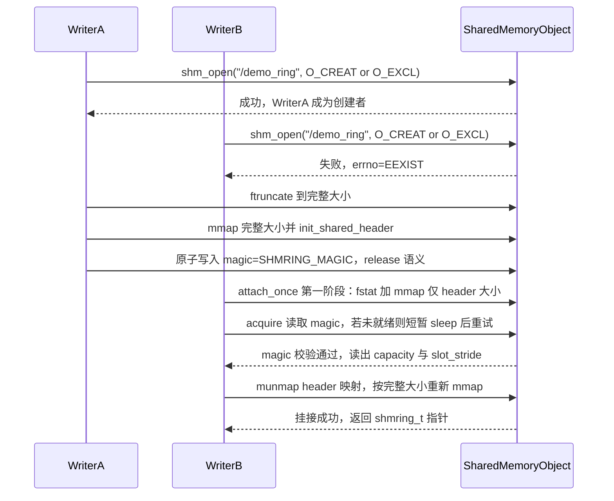
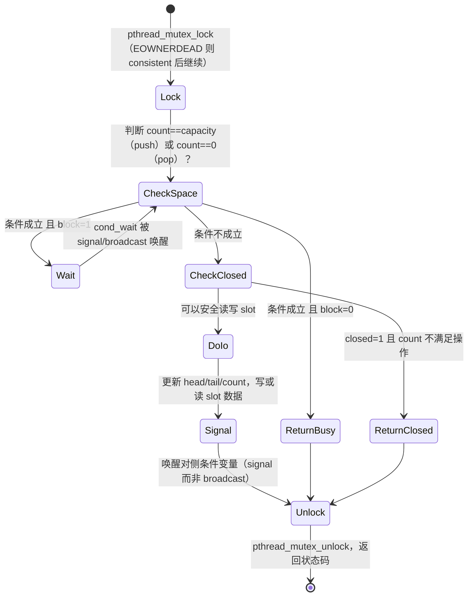

# 共享内存环形缓冲区（SHM Ring Buffer）设计与使用说明

本文档说明 `shm-ring-buffer-demo` 项目的设计原理与使用方法。这是一个用于学习目的的**独立**实现，与 `vmc-common/pkt-mirror-shm` 没有代码依赖关系，但在设计上刻意采用了不同的思路，方便对照学习两种典型的共享内存环形缓冲区设计。

## 目录

1. [概述与适用场景](#1-概述与适用场景)
2. [与 pkt-mirror-shm 参考实现的设计对比](#2-与-pkt-mirror-shm-参考实现的设计对比)
3. [共享内存布局](#3-共享内存布局)
4. [核心数据结构](#4-核心数据结构)
5. [创建与挂接流程](#5-创建与挂接流程)
6. [生产/消费流程（push / pop）](#6-生产消费流程push--pop)
7. [并发正确性](#7-并发正确性)
8. [关闭与销毁语义](#8-关闭与销毁语义)
9. [构建与运行](#9-构建与运行)
10. [扩展方向](#10-扩展方向)
11. [常见陷阱 FAQ](#11-常见陷阱-faq)

---

## 1. 概述与适用场景

`shm_ring` 是一个运行在**多个独立进程**之间的、**有界（bounded）、阻塞式、支持多写者/多读者（MPMC）**的环形缓冲区。它基于三项 POSIX 能力构建：

- `shm_open` / `mmap`：在多个进程间共享同一块物理内存。
- `pthread_mutex_t`（`PTHREAD_PROCESS_SHARED`）：跨进程互斥锁。
- `pthread_cond_t`（`PTHREAD_PROCESS_SHARED`）：跨进程条件变量，实现"队列满则写者等待，队列空则读者等待"的经典有界缓冲区（bounded buffer）模型。

典型适用场景：一个进程（或多个进程）产生数据，另一个进程（或多个进程）消费数据，两者都需要**精确接收每一条消息、不丢数据**，并且在缓冲区暂时满/空时愿意阻塞等待，而不是丢弃数据。

## 2. 与 pkt-mirror-shm 参考实现的设计对比

`vmc-common/pkt-mirror-shm` 是一个不同哲学的环形缓冲区：它是"覆盖式广播环"，专为数据面高频镜像抓包设计——写者绝不能被阻塞，宁可覆盖旧数据；读者只能对整环做一次性快照，不追踪自己的读位置。本项目刻意选择了另一种同样典型、但语义完全不同的设计：

| 维度 | pkt-mirror-shm（参考实现） | shm_ring（本项目） |
| --- | --- | --- |
| 环形语义 | 覆盖式广播环：写满即覆盖旧数据，可能丢数据 | 有界阻塞队列：FIFO 精确投递，慢则等待，不丢数据 |
| 并发原语 | `pthread_rwlock_t`（反转用法：写者持读锁并发写，读者持写锁做整体快照） | `pthread_mutex_t` + 两个 `pthread_cond_t`（`not_full`/`not_empty`），教科书式有界缓冲区 |
| 读位置追踪 | 无：读者只能整体快照，不知道"读到哪了" | 有：`head`/`tail`/`count`，读写双方各自独立推进游标 |
| 容量确定方式 | 编译期固定数组 `slots[PKT_MIRROR_SHM_RING_CAP]` | 创建时由调用者指定，用柔性数组成员 + 两阶段 `mmap` 在运行时确定共享内存大小 |
| 角色模型 | 单一写者持续写，读者只读快照 | 原生 MPMC：多个写者、多个读者可同时安全操作同一个环 |
| 崩溃健壮性 | 未处理锁持有者崩溃的情况 | 使用 `PTHREAD_MUTEX_ROBUST`，捕获 `EOWNERDEAD` 并恢复 |
| 关闭语义 | 无"关闭"概念 | 显式 `shmring_shutdown()`，唤醒所有阻塞的读写者，避免永久阻塞 |

两种设计没有优劣之分，只是解决的问题不同：pkt-mirror-shm 优化的是"写者零阻塞、只关心最新数据"（类似日志/抓包镜像），shm_ring 优化的是"数据必须精确送达、生产消费速率会自然被对方调节"（类似任务队列/消息管道）。

## 3. 共享内存布局

一个 `shm_ring` 的共享内存段由一个固定大小的头部 + 若干个等长消息槎（slot）构成：

```
+----------------------------------------------------------------+
| shmring_hdr_t                                                  |
|                                                                |
| magic            uint32_t                                      |
| capacity         uint32_t                                      |
| max_payload      uint32_t                                      |
| slot_stride      uint32_t                                      |
| lock             pthread_mutex_t                               |
| not_full         pthread_cond_t                                |
| not_empty        pthread_cond_t                                |
| head, tail, count   uint32_t (x3)                              |
| closed           uint32_t                                      |
| next_seq         uint64_t                                      |
| total_pushed     uint64_t                                      |
| total_popped     uint64_t                                      |
+----------------------------------------------------------------+
| slots[0]      = shmring_slot_t { seq, ts, len, payload[] }     |
| slots[1]      = shmring_slot_t { seq, ts, len, payload[] }     |
| ...                                                            |
| slots[N-1]    = shmring_slot_t { seq, ts, len, payload[] }     |
+----------------------------------------------------------------+
```

要点：

- `capacity`（槎位数）和 `max_payload`（单条消息最大字节数）在**创建时**由调用者指定，因此整段共享内存的总大小 = `sizeof(shmring_hdr_t) + capacity * slot_stride`，**不是编译期常量**。
- `slot_stride` = `align8(sizeof(shmring_slot_t) + max_payload)`，即每个槎位的头部（`seq`/`ts`/`len`）加上负载空间，再向上对齐到 8 字节，保证每个槎位起始地址都是 8 字节对齐的（`uint64_t seq` 等字段要求对齐访问）。
- `slots` 在 `shmring_hdr_t` 里声明为 `uint8_t slots[]`（柔性数组，不是 `shmring_slot_t` 数组），因为 `shmring_slot_t` 本身大小依赖 `max_payload`，编译期无法确定其数组步长。实现内部通过 `hdr->slots + idx * hdr->slot_stride` 手动计算每个槎位的地址。

## 4. 核心数据结构

```c
typedef struct {
    uint64_t seq;          /* 写者分配的单调递增消息号 */
    struct timespec ts;    /* 生产时刻的时间戳（CLOCK_REALTIME） */
    uint32_t len;           /* payload 实际长度 */
    uint8_t payload[];      /* 最长 max_payload 字节 */
} shmring_slot_t;

typedef struct {
    uint32_t magic;          /* 校验魔数，确认这是一个已初始化的合法 ring */
    uint32_t capacity;        /* 槎位总数，创建后不可更改 */
    uint32_t max_payload;     /* 单条消息最大负载字节数 */
    uint32_t slot_stride;     /* 每个槎位占用字节数（含头部，8字节对齐） */

    pthread_mutex_t lock;      /* 跨进程互斥锁：PROCESS_SHARED + ROBUST */
    pthread_cond_t  not_full;   /* count == capacity 时写者等待此条件变量 */
    pthread_cond_t  not_empty;  /* count == 0 时读者等待此条件变量 */

    uint32_t head;    /* 下一个待 pop 的槎位索引 */
    uint32_t tail;    /* 下一个待 push 的槎位索引 */
    uint32_t count;   /* 当前占用的槎位数，0..capacity */
    uint32_t closed;  /* shmring_shutdown() 后置 1，唤醒所有等待者 */

    uint64_t next_seq;       /* 下一个待分配的消息序号 */
    uint64_t total_pushed;   /* 累计入队计数（受 lock 保护） */
    uint64_t total_popped;   /* 累计出队计数（受 lock 保护） */

    uint8_t slots[];  /* capacity 个槎位，见上文布局说明 */
} shmring_hdr_t;

typedef struct {
    shmring_hdr_t *hdr;         /* 指向共享内存的本进程私有指针 */
    size_t         map_size;     /* 本进程 mmap 的总大小，用于 munmap */
    char           name[64];     /* 共享内存对象名，如 "/demo_ring" */
} shmring_t;
```

`shmring_hdr_t` 是**多个进程共同看到的那一份数据**（位于共享内存里），`shmring_t` 是**每个进程各自持有的、指向它的句柄**（位于进程私有堆内存里，通过 `calloc` 分配）。写者和读者各自调用 `shmring_create`/`shmring_attach` 后，都会得到一个属于自己的 `shmring_t*`，但其中的 `hdr` 字段指向同一块物理内存。

## 5. 创建与挂接流程

写者调用 `shmring_create()`；读者（以及第二个、第三个写者）调用 `shmring_attach()`。两者的核心差异在于：`create` 需要处理"我是不是第一个创建者"的竞争，而 `attach` 需要处理"共享内存的真实大小要读了 header 才知道"的问题（两阶段 `mmap`）。



关键实现细节：

1. **创建者选举**：用 `shm_open(name, O_CREAT | O_EXCL | O_RDWR, ...)`。成功即为创建者，负责 `ftruncate` 到正确大小并调用 `init_shared_header()` 初始化互斥锁/条件变量/索引。失败且 `errno == EEXIST` 说明别的写者已经创建（或正在创建）它，回退到"挂接"逻辑。
2. **`magic` 作为发布屏障**：`init_shared_header()` 先清零并设置好所有字段，**最后**才用 `__ATOMIC_RELEASE` 写入 `magic`。任何进程只要用 `__ATOMIC_ACQUIRE` 读到 `magic == SHMRING_MAGIC`，就能保证看到它之前写的全部字段——这是一个跨进程的 release/acquire 同步点，用来解决"创建者的 `shm_open` 成功了，但 `ftruncate`/初始化还没做完，另一个进程就 `attach` 上来了"的竞态。
3. **两阶段 `mmap`（挂接方）**：`capacity` 和 `slot_stride` 只有读到 header 之后才知道，所以第一次只 `mmap(sizeof(shmring_hdr_t))` 字节去读 header，校验通过后再算出完整大小，`munmap` 旧映射，重新 `mmap` 完整大小。这是处理"共享内存大小在运行期才能确定"的典型技巧。
4. **`shmring_create()` 内部的竞态重试**：如果输给了创建者竞争，会以 10ms 间隔重试挂接最多 100 次（约 1 秒），足够覆盖创建者从 `shm_open` 成功到完成初始化之间的窗口。

## 6. 生产/消费流程（push / pop）

`shmring_push`/`shmring_pop` 是一个标准的有界缓冲区（bounded buffer）实现：



`push` 的核心代码逻辑（简化）：

```c
lock_ring(hdr);
while (hdr->count == hdr->capacity && !hdr->closed) {
    if (!block) { rc = SHMRING_ERR_FULL; goto out; }
    pthread_cond_wait(&hdr->not_full, &hdr->lock);
}
if (hdr->closed) { rc = SHMRING_ERR_CLOSED; goto out; }

slot = slot_at(hdr, hdr->tail);
slot->seq = hdr->next_seq++;
clock_gettime(CLOCK_REALTIME, &slot->ts);
slot->len = len;
memcpy(slot->payload, data, len);
hdr->tail = (hdr->tail + 1) % hdr->capacity;
hdr->count++;
if (out_seq) *out_seq = slot->seq;   /* 全局唯一序号，与写者自己的发送计数无关 */
pthread_cond_signal(&hdr->not_empty);
out: pthread_mutex_unlock(&hdr->lock);
```

`pop` 是完全对称的逻辑：等待条件是 `count == 0`，操作的是 `head` 而不是 `tail`，唤醒的是 `not_full` 而不是 `not_empty`。

为什么用 `while` 而不是 `if` 包裹 `cond_wait`？因为条件变量存在"惊群/虚假唤醒"的可能：即使被唤醒，也必须重新检查条件是否真的满足（这是使用 `pthread_cond_wait` 的标准写法，与线程数、进程数无关）。

## 7. 并发正确性

- **跨进程可见性**：`pthread_mutex_t`/`pthread_cond_t` 只要用 `pthread_mutexattr_setpshared(PTHREAD_PROCESS_SHARED)`/`pthread_condattr_setpshared(...)` 初始化，且位于多个进程共同 `mmap` 的同一块共享内存中，就可以像多线程程序里一样跨进程使用——本质上它们底层是基于共享内存地址上的 futex，与"是不是同一个进程"无关。
- **健壮互斥锁（robust mutex）**：如果某个写者/读者进程在持有 `hdr->lock` 期间被杀死（如 `kill -9`），后续调用 `pthread_mutex_lock` 的进程会收到 `EOWNERDEAD` 而不是永久死锁。本实现约定：收到 `EOWNERDEAD` 后调用 `pthread_mutex_consistent()`标记锁状态"可信"，然后照常处理——因为 `push`/`pop` 的临界区只操作若干个普通整数计数器，即使上一个持有者在临界区中途被杀死，`count`/`head`/`tail` 也只会停留在"更新前"或"更新后"两种状态之一，不会出现半更新的中间态破坏不变式（`memcpy` 之外的索引更新都是最后才做的简单赋值/自增）。
- **内存序**：`magic` 用 `__ATOMIC_RELEASE`/`__ATOMIC_ACQUIRE` 保证初始化的发布顺序；`head`/`tail`/`count`/`closed` 的读写全部在 `lock` 保护下进行，因此互斥锁本身提供的顺序保证（POSIX 规定解锁前的所有写入，对之后加锁成功的另一方可见）已经足够，不需要额外的原子操作。`shmring_count()`/`shmring_stats()` 为了不引入额外加锁开销，用 `__ATOMIC_RELAXED` 做"最佳努力"的无锁读取，仅用于监控展示，不参与正确性判断。

## 8. 关闭与销毁语义

本项目区分两个不同层次的生命周期操作，这是与参考实现最大的差异之一（参考实现没有"关闭"概念）：

| 操作 | 作用范围 | 谁来调用 | 效果 |
| --- | --- | --- | --- |
| `shmring_close()` | 仅影响调用者自己的进程 | 每个使用完 ring 的写者/读者，退出前都应调用 | `munmap` 本进程的映射并释放本地 `shmring_t`；不影响共享内存对象本身，其他进程可以继续用 |
| `shmring_shutdown()` | 影响所有正在使用这个 ring 的进程 | 通常由写者在计划停止生产时调用一次 | 置位 `hdr->closed=1` 并 `broadcast` 两个条件变量，唤醒所有当前阻塞在 `push`/`pop` 里的调用（无论在哪个进程），让它们返回 `SHMRING_ERR_CLOSED` 而不是永久等待 |
| `shmring_destroy()` | 整个共享内存对象 | 生命周期的最终所有者，确认没有进程再需要这个 ring 时调用一次 | `shm_unlink()`，从系统中移除该共享内存对象（等价于 `rm /dev/shm/<name>`）|

典型使用顺序：写者 `shmring_shutdown()` 通知所有读者"不会再有新数据了" → 各读者的 `pop` 返回 `SHMRING_ERR_CLOSED` 后各自 `shmring_close()` 退出 → 写者自己也 `shmring_close()` → 最后（如果确定没有其他消费者了）由某一方调用 `shmring_destroy()` 彻底清理。

## 9. 构建与运行

```bash
cd shm-ring-buffer-demo
make            # 生成 ./shm_writer 与 ./shm_reader
```

打开两个终端窗口，演示一个写者、一个读者：

```bash
# 终端 1：创建容量为 8、单条消息最大 128 字节的环，推送 20 条消息，间隔 200ms
./shm_writer /demo_ring 8 128 20 200

# 终端 2：挂接同一个环，持续弹出直到写者关闭
./shm_reader /demo_ring
```

预期输出（节选）：

```
[writer pid=12345] ring '/demo_ring' ready (capacity=8, max_payload=128)
[writer] pushed seq=0 len=21 "hello #0 from pid 12345" (ring_count=1)
...
[reader pid=12346] waiting for ring '/demo_ring'...
[reader] attached to '/demo_ring'
[reader] popped seq=0 len=21 "hello #0 from pid 12345" latency=0.412ms (ring_count=0)
...
[writer] stopping. total_pushed=20 total_popped(all readers)=20
[reader] ring was shut down by writer, stopping
```

也可以先启动读者（它会打印"waiting for ring..."并轮询等待），再启动写者，验证挂接时序不影响正确性；或者用一个很小的 `capacity`（如 1）配合较大的 `interval_ms` 差异，观察写满时写者阻塞、读空时读者阻塞的现象。

清理残留的共享内存对象（如果进程被强制终止、未调用 `shmring_destroy`）：

```bash
rm -f /dev/shm/demo_ring
```

## 10. 扩展方向

- **超时等待**：`pthread_cond_timedwait()` 替换 `pthread_cond_wait()`，为 `push`/`pop` 增加超时参数，避免无限阻塞。
- **批量收发**：一次性 `push`/`pop` 多条消息，减少加锁/解锁与条件变量唤醒的次数，提升吞吐。
- **动态扩容**：当前 `capacity` 创建后不可变；如果需要扩容，需要设计"创建新的更大共享内存段，双写一段时间后切换"的迁移方案。
- **变长消息优化**：当前每个槎位固定占用 `slot_stride` 字节（即使消息很短也占用整槎），如果消息长度分布差异很大，可以考虑改为环形字节流（byte-stream ring）而不是固定槎位数组。
- **多态通知**：结合 `eventfd`/`signalfd` 或自管道（self-pipe）技巧，让消费者可以用 `select`/`epoll` 同时等待"环不空"和其他 I/O 事件，而不是只能阻塞在 `pthread_cond_wait`。

## 11. 常见陷阱 FAQ

**Q: 为什么互斥锁和条件变量必须显式设置 `PTHREAD_PROCESS_SHARED`？**
默认情况下 `pthread_mutex_init`/`pthread_cond_init` 创建的是"进程私有（`PTHREAD_PROCESS_PRIVATE`）"的锁，其内部实现可能依赖只在本进程地址空间内有效的状态（如线程 ID 的解释方式）。跨进程共享必须显式通过 `pthread_mutexattr_setpshared`/`pthread_condattr_setpshared` 声明，否则行为未定义，实践中常见的表现是死锁或崩溃。

**Q: 为什么 `capacity`/`slot_stride` 要保存进 header，而不是让读者自己传参？**
因为共享内存对象在文件系统层面（`/dev/shm/<name>`）是"匿名"的，`attach` 时除了名字什么都不知道；如果读者传入和创建者不一致的 `capacity`/`max_payload`，会按错误的步长/大小去解析内存，读出脏数据甚至越界。把这些参数保存进 header 并在挂接时读出来，可以保证所有进程对内存布局的理解完全一致。

**Q: Ctrl-C（`SIGINT`）发给正在阻塞在 `shmring_push`/`shmring_pop` 里的写者/读者，会立刻生效吗？**
不一定。`writer_main.c`/`reader_main.c` 里的信号处理函数只是设置了一个 `volatile sig_atomic_t` 标志（这是信号处理函数里唯一安全的操作），真正检查这个标志、调用 `shmring_shutdown()` 的代码在 `push`/`pop` **返回之后**才会执行。如果此刻恰好阻塞在 `pthread_cond_wait()` 里（环满了/空了），要等到对方进程操作了一次环（腾出空间/放入数据）才会被唤醒并有机会检查标志。生产环境如果需要"立即可中断"的阻塞等待，通常会引入超时（`pthread_cond_timedwait`）或者用 `eventfd`/自管道配合 `epoll` 来代替纯条件变量等待。

**Q: 为什么 `push`/`pop` 里用 `pthread_cond_signal` 而不是 `pthread_cond_broadcast`？**
因为一次 `push` 只腾出/占用了一个槎位，最多只应该唤醒一个正在等待的对端（比如一次 `push` 之后最多让一个阻塞的 `pop` 有机会消费）。若用 `broadcast`，多个读者都会被唤醒但只有一个能真正取到数据，其余会重新检查条件、发现仍然为空后继续等待——虽然逻辑上也正确，但会造成不必要的"惊群"式唤醒开销。`shmring_shutdown()` 中则改用 `broadcast`，因为关闭是一次性事件，需要唤醒**所有**等待者。

**Q: `EOWNERDEAD` 处理是否意味着数据一定完好？**
`pthread_mutex_consistent()` 只是让互斥锁本身恢复可用状态，不会自动修复共享内存里的业务数据。本实现之所以可以安全地"标记一致后继续"，是因为它的临界区足够简单（只有整数计数器的读改写与一次 `memcpy`），不存在"跨多个字段的多步更新中途崩溃导致状态不一致"的风险。如果未来往临界区里加入更复杂的多步操作，需要重新评估崩溃恢复的安全性。
