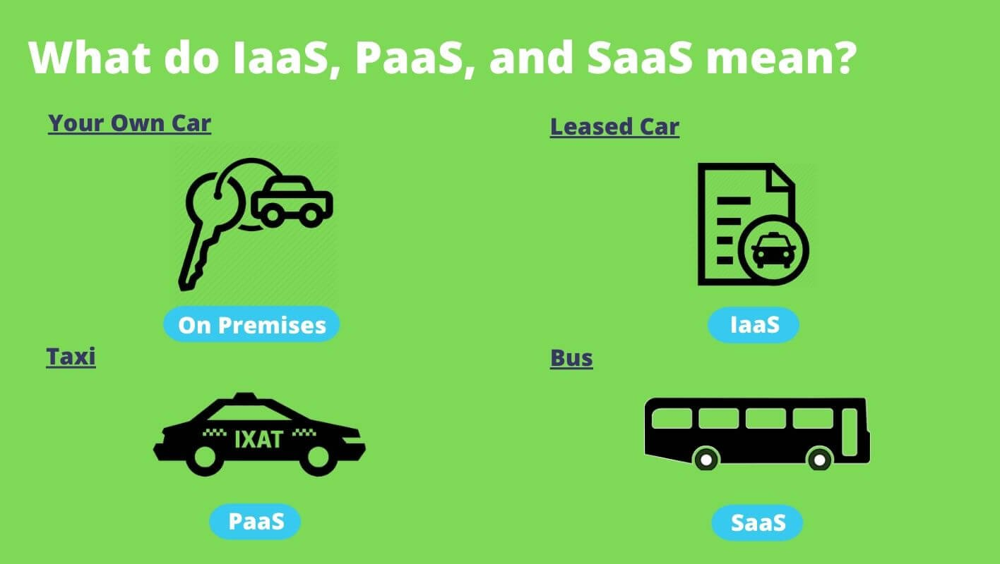

- 什么是云服务
  {:height 446, :width 776}
-
-
- 不同云服务的类比
  
	- #### On Premises
		- 类似==买了一辆车==，自己负责维护、升级、安全等......
	- #### IaaS(Infrastructure)
		- 类似==租了一辆车==，根据自己的预算和需求租用合适的车辆，想开的时候可以开，但车不是你的，当有升级的需求时，直接租用一辆新车即可
	- #### PaaS(Platform)
		- 类似于乘坐==出租车==，自己不需要开车，只需要简单的告诉司机目的地即可
	- #### SaaS(Software)
		- 类似于乘坐==公交车==，乘客没有对公交车的任何控制，只是简单的与别的乘客共享服务