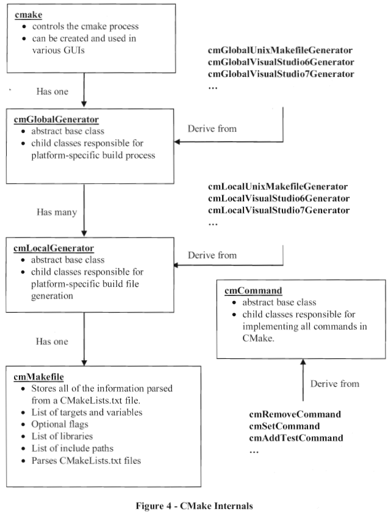

```cmake
CMake 的编译过程由一个或者多个CMakeLists.txt来控制

CMakeLists.txt 中的命令格式：
command (args...)
command 为命令的名称，args是空格分割的参数列表

CMake支持的变量类型包括：字符串 或者 字符串列表(strings or lists of strings)
变量引用：${VAR}

set(Foo a b c)	# 多个参数可以通过set命令 grouped together into a list
command(${Foo})
等价于
command(a b c)

command("${Foo"})	# 使用双引号将 a list of arguments 
等价于
command("a b c")


CMake 可以直接获取环境变量 $ENV{VAR}

CMake 基本概念
CMake 的基本概念的底层实现是 C++ classes，这些类被 CMake 的其他命令所引用
CMake 的最底层是源文件，target 由多个源文件组成，通常 target 是一个可执行文件或者库
directory 代表一个源文件目录，通常包含一个 CMakeLists.txt 文件，并且有一个或者多个target与之关联
每个 directory 有一个 local generator，它负责产生该目录对应的Makefile即相关的 project files
所有的 local generators 共享同一个公共的 global generator，全局的generator在整个构建过程都是可见的
最终，global generator 被创建并且由 cmake class 本身驱动

CMake 的执行过程开始于创建 cmake class 的实例并且将命令行参数传递给该实例，cmake class 管理整个的配置过程并且保存了构建过程的全局信息，例如 cache values
cmake class 基于用户选择使用何种 generator (Borland Makefiles, UNIX Makefiles)
cmake class 通过调用configure 和 generate 将控制流程转交给它所创建的 global generator

global generator 负责管理配置和产生项目所有的Makefiles
实际上绝大部分的工作都是由 global generator 产生的 local generator 所完成的
每个目录都有自己的local generator 
一个project只有一个 global generator，但是可能有多个 local generator
每个 local generator 都有一个 cmMakefile 的实例，cmMakefile 主要用来保存解析 CMakeLists 后的结果
对于project下的每个目录，都有一个 cmMakefile 的实例，这也是为什么 cmMakefile class 被称为 the directory
换一种思路，cmMakefile class 可以被看作是是一种初始化了来自于父目录的一些变量的结构，这个结构之后在CMakeLists 文件被处理的过程中继续被填充
读取 CMakeLists 文件的过程就是 CMake 按顺序执行 CMakeLists 文件中的命令的过程
CMake的每个命令都对应着一个C++的class，每个class主要有两个部分：1.InitialPass method: 该方法接收参数和当前正在处理的目录的 cmMakefile 实例，之后执行对应的操作 2. FinalPass: FinalPass在整个 CMake project 的所有命令的 InitialPass 执行完成后执行。许多命令没有 FinalPass 方法，但是在很少的情况下，命令必须操作 global information，并且该操作在 InitialPass 阶段是不合适的
当所有的 CMakeLists 文件处理完成，并且 generators 使用收集在 cmMakefile instance中的信息产生对应目标系统的对应的文件(例如Makefiles)

Target 代表 CMake 构建生成的 可执行文件，库，实用程序，通常通过如下命令创建 Target
add_library()
add_executable()
add_custom_target()
Target 一旦创建，target 的 name 可以在 project 的其他任何地方都是可用的，CMake 可以根据 target name 获取该 target 的相关信息

CMake 不但保存了 target 的 type，同时 track 了一些 general properties，这个属性可以通过下面的命令进行设置和获取
set_target_properties()
get_target_properties()
或者更 general 的命令
set_property()
get_property()
常用的属性包括：LINK_FLAGS

// 示例(链接 foo 和 bar 库文件到 foobar 可执行文件)
add_library (foo foo.cxx)
target_link_libraries (foo bar)

add_executable (foobar foobar.cxx)
target_link_libraries (foobar foo)
```
- CMake Internals

- 只有单一源文件的CMakeLists.txt的编写
    ```bash
    ## 目录结构
    tree .
    .
    ├── CMakeLists.txt
    └── main.c

    0 directories, 2 files

    ## main.c 内容

    #include <stdio.h>

    int main(void)
    {
            printf("hello world!\n");

            return 0;
    }

    ## CMakeLists.txt 内容

    # 指定项目所需的最低 CMake 版本
    cmake_minimum_required(VERSION 3.10)

    # 定义项目的名称、版本和其他属性
    project(mytest)

    # 创建一个可执行目标
    add_executable(mytest
            ${CMAKE_CURRENT_SOURCE_DIR}/main.c

    ## 执行cmake命令生成对应的Makefile及相关文件
    cmake -S . -B build

    ## 进入build目录执行make命令生成对应的可执行文件
    # cd build/
    tree . -L 1
    .
    ├── CMakeCache.txt
    ├── CMakeFiles
    ├── cmake_install.cmake
    └── Makefile

    1 directory, 3 files

    # make
    Scanning dependencies of target mytest
    make[2]: Warning: File 'CMakeFiles/mytest.dir/depend.make' has modification time 0.55 s in the future
    [ 50%] Building C object CMakeFiles/mytest.dir/main.c.o
    [100%] Linking C executable mytest
    make[2]: warning:  Clock skew detected.  Your build may be incomplete.
    [100%] Built target mytest

    # ./mytest
    hello world!
    ```
- 编译静态库
    ```bash
    ## tree .
    .
    ├── CMakeLists.txt
    ├── include
    │   └── myadd.h
    └── src
        ├── CMakeLists.txt
        └── myadd.c

    2 directories, 4 files

    # cat CMakeLists.txt
    add_subdirectory(src)

    # cat include/myadd.h
    #ifndef _MYADD_H_
    #define _MYADD_H_

    int maydd(int, int);

    #endif

    # cat src/CMakeLists.txt
    add_library(myadd STATIC
            ${CMAKE_CURRENT_SOURCE_DIR}/myadd.c
    )

    target_include_directories(myadd PRIVATE
            ${CMAKE_CURRENT_SOURCE_DIR}/../include
    )

    # cat src/myadd.c
    int myadd(int i1, int i2)
    {
            return i1 + i2;
    }

    ## cmake -S . -B buid

    ## ls
    CMakeCache.txt  CMakeFiles  cmake_install.cmake  Makefile  src

    ## tree . -L 1
    .
    ├── CMakeCache.txt
    ├── CMakeFiles
    ├── cmake_install.cmake
    ├── Makefile
    └── src

    2 directories, 3 files

    ## make
    ## ls src/
    CMakeFiles  cmake_install.cmake  libmyadd.a  Makefile
    ```