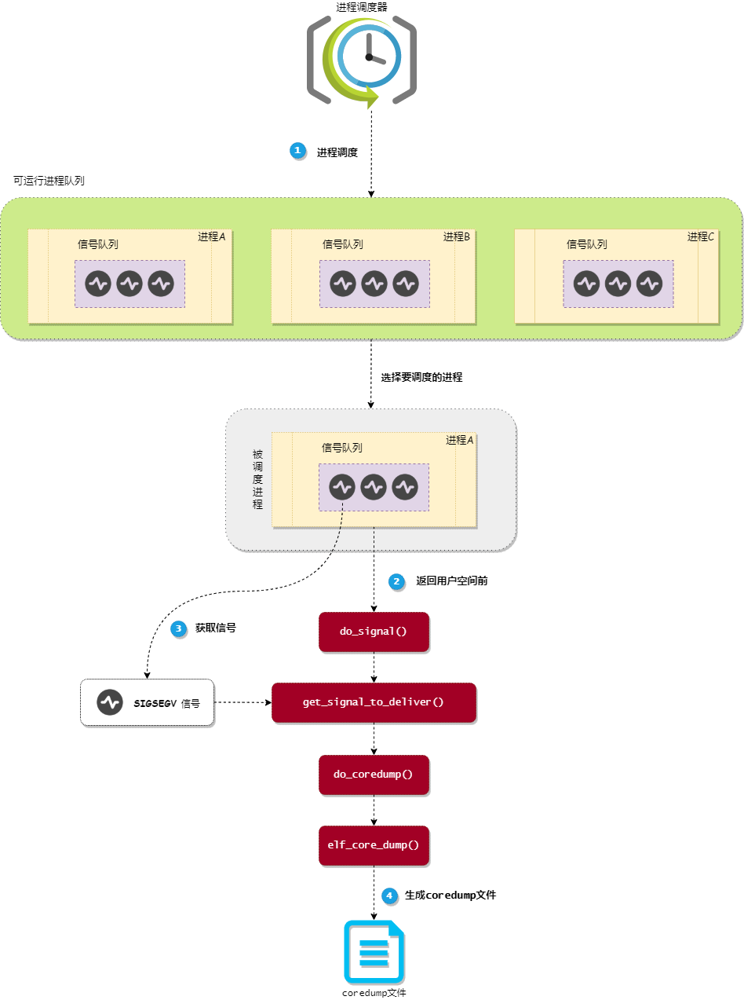

- coredump是一个磁盘文件，用来记录当进程意外退出时的==内存快照以及程序状态==等信息，==由linux内核处理一些特殊信号时产生==，如：SIGQUIT, SIGILL, SIGABRT, SIGFPE and SIGSEGV
  > A _core file_ or _core dump_ is a ==disk file== that records the memory image of a running process and its process status (register values etc.) at the moment of its termination, generated by the Linux kernel when processing some signals like SIGQUIT, SIGILL, SIGABRT, SIGFPE and SIGSEGV.
-
- coredump相关配置
  background-color:: red
	- 配置core文件大小
		- `ulimit -c unlimited` : 设置资源不受限制
		- `ulimit -c 0 : 设置为不产生core文件
	- 配置core文件名称
		- `/proc/sys/kernel/core_pattern`
		- `core_pattern`也可以通过 [[sysctl]] 命令来查看或者设置, `sysctl kernel.core_pattern`
-
- coredump基本原理
	- 进程运行过程中出现异常，CPU在执行完当前的指令后会立刻停止执行当前上下文中的指令，而进入异常处理流程
	- 异常处理流程，判断发生异常的CPU模式
		- 发生异常时处于内核态 -->  [[kernel panic]]
		- 发生异常时处于用户态 --> 向用户态进程发送相应的信号
	- 当用户态进程有处理信号的时机时(比如得到调度)，其会检查pending的信号，然后进行处理，如果发现pending的信号为`SIG_KERNEL_COREDUMP_MASK`中的一个，则会进入core文件搜集流程，最终根据用户配置生成core文件。
	  ```c
	  #define SIG_KERNEL_COREDUMP_MASK (\
	  rt_sigmask(SIGQUIT)   |  rt_sigmask(SIGILL)    | \
	  	rt_sigmask(SIGTRAP)   |  rt_sigmask(SIGABRT)   | \
	  rt_sigmask(SIGFPE)    |  rt_sigmask(SIGSEGV)   | \
	  	rt_sigmask(SIGBUS)    |  rt_sigmask(SIGSYS)    | \
	  rt_sigmask(SIGXCPU)   |  rt_sigmask(SIGXFSZ)   | \
	  	SIGEMT_MASK	
	  ```
-
- coredump文件生成过程
  
- 进程从内核态返回到用户态==的地方有很多，如 **从系统调用返回**、**从硬中断处理程序返回** 和 **从进程调度程序返回** 等。上图主要通过 从进程调度程序返回 作为示例，来展示内核是怎么生成 coredump 文件的
- 信号处理do_signal()
	- 当进程从内核态返回到用户态前，内核会查看==进程的信号队列中是否有信号没有被处理==，如果有就调用 `do_signal` 内核函数处理信号
		- ```c
		  static void fastcall do_signal(struct pt_regs *regs)
		  {
		  siginfo_t info;
		  int signr;
		  struct k_sigaction ka;
		  sigset_t *oldset;
		  
		  ...
		  signr = get_signal_to_deliver(&info, &ka, regs, NULL);
		  ...
		  }
		  ```
		  `get_signal_to_deliver` 内核函数的主要工作是==从进程的信号队列中获取一个信号==，然后根据信号的类型来进行不同的操作
		  
		  ```c
		  int get_signal_to_deliver(siginfo_t *info, struct k_sigaction *return_ka,
		                        struct pt_regs *regs, void *cookie)
		  {
		  sigset_t *mask = &current->blocked;
		  int signr = 0;
		  
		  ...
		  for (;;) {
		      ...
		      // 1. 从进程信号队列中获取一个信号
		      signr = dequeue_signal(current, mask, info); 
		  
		      ...
		      // 2. 判断是否会生成 coredump 文件的信号
		      if (sig_kernel_coredump(signr)) {
		          // 3. 调用 do_coredump() 函数生成 coredump 文件
		          do_coredump((long)signr, signr, regs);
		      }
		      ...
		  }
		  ...
		  }
		  ```
- `get_signal_to_deliver` 函数主要完成3个工作：
	- 调用 `dequeue_signal` 函数从进程的信号队列中获取一个信号。
	- 调用 `sig_kernel_coredump` 函数判断信号是否会生成 coredump 文件。
	- 如果信号会生成 coredump 文件，那么就调用 `do_coredump` 函数生成 coredump 文件
-
- 生成 coredump 文件
	- 如果要处理的信号会触发生成 coredump 文件，那么内核就会调用 `do_coredump` 函数来==生成 coredump 文件==
	- ```c
	  int do_coredump(long signr, int exit_code, struct pt_regs *regs)
	  {
	    char corename[CORENAME_MAX_SIZE + 1];
	    struct mm_struct *mm = current->mm;
	    struct linux_binfmt *binfmt;
	    struct inode *inode;
	    struct file *file;
	    int retval = 0;
	    int fsuid = current->fsuid;
	    int flag = 0;
	    int ispipe = 0;
	  
	    binfmt = current->binfmt; // 当前进程所使用的可执行文件格式（如ELF格式）
	  
	    ...
	    // 1.判断当前进程可生成的 coredump 文件大小是否受到资源限制
	    if (current->signal->rlim[RLIMIT_CORE].rlim_cur < binfmt->min_coredump)
	    goto fail_unlock;
	  
	    ...
	    // 2.生成 coredump 文件名
	    ispipe = format_corename(corename, core_pattern, signr);
	  
	    ...
	    // 3.创建 coredump 文件
	    file = filp_open(corename, O_CREAT|2|O_NOFOLLOW|O_LARGEFILE|flag, 0600);
	  
	    ...
	    // 4.把进程的内存信息写入到 coredump 文件中
	    retval = binfmt->core_dump(signr, regs, file);
	  
	    fail_unlock:
	    ...
	    return retval;
	  }
	  ```
	- `do_coredump` 函数完成4个工作：
		- ==判断==当前进程可生成的 coredump 文件大小是否受到==资源限制==。
		- 如果不受限制，那么调用 `format_corename` 函数==生成 coredump 文件的文件名==。
		- 调用 `filp_open` 函数==创建 coredump 文件==。
		- 根据当前进程所使用的可执行文件格式来选择相应的填充方法来==填充 coredump 文件的内容==，对于 ELF文件格式 使用的是 `elf_core_dump` 方法。
			- `elf_core_dump` 方法的主要工作是：==把进程的内存信息和内容写入到 coredump 文件中，并且以 ELF文件格式 作为 coredump 文件的存储格式==
- 产生当前运行程序的core file
	- [[gcore]]
- 参考文档
	- [man 5 core](https://man7.org/linux/man-pages/man5/core.5.html)
	- [Anatomy of an ELF core file](https://www.gabriel.urdhr.fr/2015/05/29/core-file/)
-