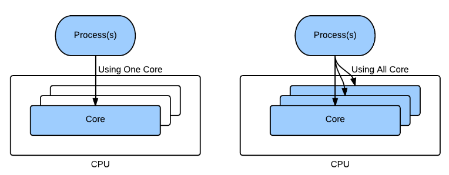

- cpu亲和性指的是在linux下绑定进程到指定的一个或者多个cpu核上运行
	- > **Binding a process to a specific set of processors is called processor affinity or CPU pinning.**
	- cpu亲和性的好处
		- 主要优势是较少高速缓存(cache miss)缺失引起的延迟，优化高速[[缓存]]性能
		- 如果多线程访问相同的数据可以保证线程不会争用数据并导致缓存未命中，这确实会降低SMP上多线程的性能，但是如果线程本身就需要序列化的操作，那么提高缓存命中率是值得的。
		- 在实时系统或者其他时间敏感的应用当中，可以将关键进程绑定在固定的cpu核上，而将其他的进程绑定在别的核心上，用来确保关键进程获得足够的cpu处理时间
- 
- 示例代码
	- sched_setaffinity
		- ```c
		  #include <stdio.h>
		  #include <stdlib.h>
		  #define __USE_GNU
		  #include <sched.h>
		  #include <errno.h>
		  #include <unistd.h>
		  
		  int main(void)
		  {
		  	int mypid, cpu, ncpu, prio, r;
		  	cpu_set_t cpuset;
		  	struct sched_param sched_param;
		  
		  	printf("Input the cpu you want to bind the process to: ");
		  	scanf("%d", &cpu);
		  
		  	ncpu = sysconf(_SC_NPROCESSORS_ONLN);
		  	if(cpu < 0 || cpu >= ncpu) {
		  		printf("Invalid cpu core\n");
		  		return -1;
		  	}
		  
		  	mypid = getpid();
		  
		  	CPU_ZERO(&cpuset);
		  	CPU_SET(cpu, &cpuset);
		  	r = sched_setaffinity(mypid, sizeof(cpuset), &cpuset);
		  	if(r != 0) {
		  		perror("sched_setaffinity");
		  		exit(-1);
		  	}
		  
		  	r = sched_getaffinity(mypid, sizeof(cpuset), &cpuset);
		  	if(r != 0) {
		  		perror("sched_getaffitnity");
		  		exit(-1);
		  	}
		  
		  	if(CPU_ISSET(cpu, &cpuset)) {
		  		printf("Successfully set thread %d to CPU %d\n", mypid, cpu);
		  	} else {
		  		printf("Failed to set thread %d to CPU %d\n", mypid, cpu);
		  	}
		  
		  	printf("Input schedule priority for this process: ");
		  	scanf("%d", &prio);
		  	if(prio == 0)
		  		return 0;
		  	sched_param.sched_priority = prio;
		  	r = sched_setscheduler(mypid, SCHED_FIFO, &sched_param);
		  	if(r != 0) {
		  		perror("sched_setscheduler");
		  		return -1;
		  	}
		  
		  	return 0;
		  }
		  ```
- taskset
	- 用来改变进程的cpu亲和性
	- ```bash
	  # 检查可用的cpu核心数目
	  lscpu | grep "On-line CPU(s) list"
	  
	  # 使用 taskset 启动新进程
	  taskset –c 0 cat /dev/random >& /dev/null &
	  
	  # 获取进程的cpu亲和性
	  taskset -p $(pidof cms)
	  pid 3172's current affinity mask: 1
	  
	  taskset -cp $(pidof cms)
	  pid 3172's current affinity list: 0
	  
	  # 改变进程的cpu亲和性
	  taskset -p 0x11 9726
	  
	  taskset -cp 0,3 9726
	  ```