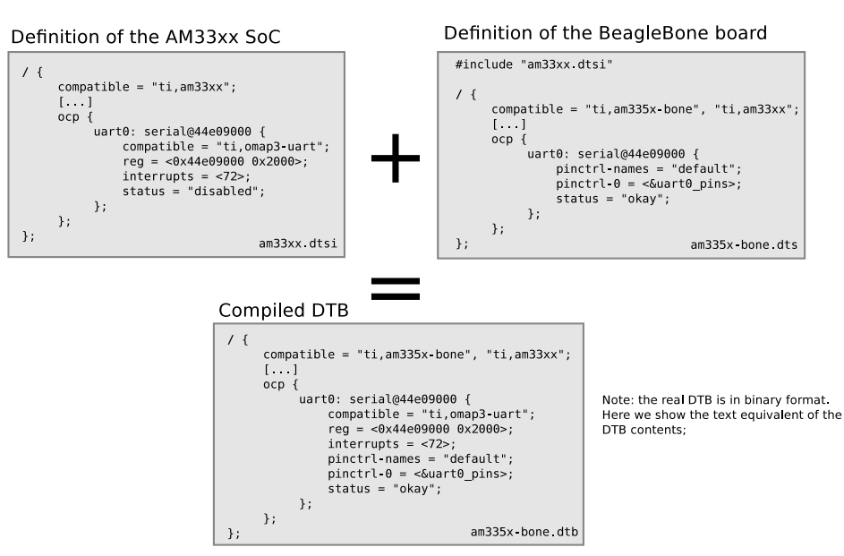

- 设备树基本结构
  collapsed:: true
	- 文件包含层次
	  collapsed:: true
		- `.dtsi`文件包含SoC级(SoC-level)信息的定义
		- `.dts`文件包含板级(board-level)信息的定义
		  collapsed:: true
			- 
			- 
	- 设备节点
	  collapsed:: true
		- 
- bindings
  collapsed:: true
	- bindings描述了特定类型或者特定类别的设备在设备树中如何表示
	- bindings参考文档`Documentation/devicetree/bindings`
- 示例
  collapsed:: true
	- 
	  collapsed:: true
		- `tegra20.dtsi`
		  collapsed:: true
			- 
		- `tegra20-harmony.dts`
		  collapsed:: true
			- 
- 设备树目录
  collapsed:: true
	- `arch/arm/boot/dts`
- dts节点格式
  collapsed:: true
	- ```c
	  [label:] <node-name> [@<unit-address>] {
	      [property]
	      [child nodes]
	      [child nodes]
	      ......
	  };
	  ```
	- `[]`表示可胜率，`<>`表示不可省略
	- `[label]`标签为了方便其他节点访问当前节点，其他节点可以通过`&label`来访问该节点
	- node-name，节点名称，根节点名臣必须为`/`
	- `[@<unit-address>]`，地址表示，具体格式与节点的类型相关，例如如果是cpu节点，则unit-address可以是0，1，如果是i2c或者uart，unit-address则可以是形如0x12340000的寄存器的基地址
	- property属性格式
	  collapsed:: true
		- 每个property是1个key value对，property-name就是key
		- 属性可以有值和没有值
		  collapsed:: true
			- ```c
			  [label:] property-name = value;
			  [label:] property-name;
			  ```
			- value的取值
			  collapsed:: true
				- ```c
				  字符串				compatible = "arm,cortex-a7";
				  32位无符号整数	  reg = <1 0x123456 100>;
				  16进制字节序列	  reg = [00 11 22 33];	//每个数据2位，也可以附加上0x
				  字符串列表		   compatible = "fsl,imx6ull-gpmi-nand", "fsl,imx6ul-gpmi-nand";
				  ```
		- 常见预定义标准属性
		  collapsed:: true
			- compatible
			  collapsed:: true
				- 用来匹配内核驱动的兼容性列表
				- 根节点的compatible属性比较特殊，用来确认内核是否适配该dtb，即uboot传递的dtb和传递的内核image是否匹配
			- model
			  collapsed:: true
				- 描述设备模块信息，比如名字、详细版本号
			- status
			  collapsed:: true
				- 描述设备状态信息，如"okey", "disabled", "fail", "failed"
			- reg
			  collapsed:: true
				- 描述硬件模块对应的地址范围信息，reg是region的缩写
- 确定设备节点对应的驱动
  collapsed:: true
	- 示例1
	  collapsed:: true
		- GPIO驱动分析
		  collapsed:: true
			- `drivers/gpio/gpio-pl061.c`
			- 根据dts中gpio节点的compatible属性，在内核驱动中查找
			- 在编译过的内核中查看`drivers/gpio`，找到`.o`文件对应的c文件
			- 检查`drivers/gpio/Makefile`文件，查找`.config`文件中CONFIG的对应选项
-
- 设备树
	- 设备树的基本概念
	  collapsed:: true
		- 为什么引入设备树
			- 平台总线模型将将驱动分为device和driver两个部分，实现了设备信息和驱动实现的分离，device部分用来描述硬件设备信息，该部分代码放在内核源码的`arch/arm/plat-xxx`和`arch/arm/mach-xxx`目录下，随着linux内核支持的硬件越来越多，该部分代码越来越多，由于它是关于硬件信息的描述和linux本身关系不大，所有对linux而言，该部分代码为“垃圾代码”，需要将其从linux内核分离出去
		- 什么是设备树
			- 设备树是用来描述硬件资源的文件，用来替代原来的device部分的代码
			- 基本概念
				- DT: Device Tree
				- FDT: Flattened Device Tree
					- 在ARM下用DT表示设备树，在其他架构下可能会有FDT来表示设备树
				- dts: device tree source
					- 设备树源文件
					- 设备树的内核源文件路径
						- `arch/arm64/boot/dts`
				- dtsi: device tree source include
					- 通用的设备树源文件
				- dtb: device tree blob
					- 设备树二进制文件
				- dtc: device tree comiler
					- 设备树编译器
					- 编译内核源码时，会编译生成dtc
						- ```bash
						  dtc的linux内核源码路径
						  	scripts/dtc
						  
						  dtc对应的内核编译选项
						  	CONFIG_DTC
						  ```
					- 编译设备树
						- ```bash
						  编译设备树
						  dtc -I dts -O dtb -o xxx.dtb xxx.dts
						  反编译设备树
						  dtc -I dtb -O dts -o xxx.dts xxx.dtb
						  ```
					- vscode插件
						- devicetree
	- 设备树的基本语法及如何编译设备树
		- 根节点是设备树必须包含的节点，名称为`/`
		  collapsed:: true
			- ```c
			  /dts-v1/;	dts文件的版本号
			  / {
			  
			  };
			  ```
		- 设备树子节点格式
		  collapsed:: true
			- ```c
			  [label:] node-name[@unit-address] {
			    [property definitions]
			    [child nodes]
			  };
			  
			  同级节点名称不能相同，不同级节点名称可以相同
			  节点名称的命名应该体现设备的类型，此处的设备地址unit-address没有实际的意义，用于在名称上区分同一类
			  设备的多个不同设备，避免了同一节点下的节点名称相同的问题，让节点的名称更人性化，便于阅读
			  ```
		- 节点属性
		  collapsed:: true
			- reg属性
				- region属性，用来描述地址范围
				- ```c
				  #address-cells和#size-cells用来描述当前节点的直接子节点中的reg属性中的具体地址和长度信息
				  reg = <address1 length1 address2 length2 ...>
				  
				  例1：
				  node1 {
				  	#address-cells = <1>;
				      #size-cells = <0>;
				      node1-child {
				      	reg = <0>;
				      };
				  };
				  
				  例2：
				  node2 {
				  	#address-cells = <1>;
				      #size-cells = <1>;
				      node2-child {
				      	reg = <0x02200000 0x4000>;
				      };
				  };
				  
				  例3：
				  node3 {
				  	#address-cells = <2>;
				      #size-cells = <0>;
				      node3-child {
				      	reg = <0x00 0x01>;
				      };
				  };
				  
				  ```
			- model属性
				- model属性的值是一个字符串，用来描述如设备名称等信息
			- status属性
				- 用来描述设备状态，是一个字符串，例如："ok"，"disabled"，"fail"， "fail-xxx"
			- compatible属性
				- ^^用来和驱动进行匹配^^，该属性有多个值时，会按照字符串的顺序进行优先匹配
			- device_type属性
			  collapsed:: true
				- 只用于对cpu节点或者memory节点进行描述
					- ```c
					  memory@30000000 {
					    device_type = "memory";
					    reg = <0x30000000 0x4000000>;
					  };
					  
					  cpu1: cpu@1 {
					    device_type = "cpu";
					    compatible = "arm,cortex-35", "arm,armv8";
					    reg = <0x0 0x1>;
					  };
					  ```
			- 自定义属性
				- ```c
				  pingnum = <0 1 2 3 4>;
				  ```
		- 特殊设备节点
		  collapsed:: true
			- aliases节点
				- 用来批量定义别名，定义别名的目的是为了方便引用节点
				  collapsed:: true
					- ```c
					  aliases {
					    mmc0 = &sdmmc0;
					    mmc1 = &sdmmc1;
					    mmc2 = &sdhci;
					    serial0 = "/simple@fe000000/serial@11c500";
					  };
					  ```
			- chosen节点
				- 用于uboot给内核传递参数，重点是bootargs参数，chosen节点必须是根节点的子节点
					- ```c
					  chosen {
					    bootargs = "root=/dev/nfs rw nfsroot=192.168.1.1 console=ttyS0,115200";
					  };
					  ```
		- 设备树实例
			- 中断实例
				- RK处理器
					- 原厂BSP提供的设备树节点
						- ```c
						  gpio0: gpio@fdd60000 {
						    compatible = "rockchip,gpio-bank";
						    reg = <0x0 0xfdd60000 0x0 0x100>;
						    interrupts = <GIC_SPI 33 IRQ_TYPE_LEVEL_HIGH>;
						    clocks = <&pmucru PCLK_GPIO0>, <&pmucru DBCLK_GPIO0>;
						      
						    gpio-controller;			#表示该节点是一个gpio控制器
						    #gpio-cells = <2>;
						    gpio-ranges = <&pinctrl 0 0 32>;
						    interrupt-controller;		#表示该节点是一个中断控制器
						    #interrupt-cells = <2>;
						  };
						  ```
					- 开发人员根据具体需求进行适配的设备树节点
						- ```c
						  ft5x06:ft5x06@38 {
						    status = "disabled";
						    compatible = "edt,edt-ft5306";
						    reg = <0x38>;
						    touch-gpio = <&gpio0 RK_PB5 IRQ_TYPE_EDGE_RISING>;
						    interrupt-parent = <&gpio0>;				#引用对应的中断控制器
						    interrupts = <RK_PB5 IRQ_TYPE_LEVEL_LOW>;	#中断使用的GPIO管脚及触发方式
						    reset-gpios = <&gpio0 RK_PB6 GPIO_ACTIVE_LOW>;
						    touchscreen-size-x = <800>;
						    touchscreen--size-y = <1200>;
						    touch_type = <1>;
						  };
						  ```
				- IMX处理器
				  collapsed:: true
					- 原厂BSP提供的设备树节点
						- ```c
						  gpio1: gpio@0209c000 {
						    compatible = "fsl,imx6ul-gpio", "fsl,imx35-gpio";
						    reg = <0x0209c000 0x4000>;
						    interrupts = <GIC_SPI 66 IRQ_TYPE_LEVEL_HIGH,
						    				GIC_SPI 67 IRQ_TYPE_LEVEL_HIGH>;
						    gpio-controller;			#表示该节点是一个gpio控制器
						    #gpio-cells = <2>;
						    interrupt-controller;		#表示该节点是一个中断控制器
						    #interrupt-cells = <2>;
						  };
						  ```
					- 开发人员根据具体需求进行适配的设备树节点
						- ```c
						  edt-ft5x06@38 {
						    compatible = "edt,edt-ft5306", "edt,edt-ft5x06", "edt,edt-ft5406";
						    pinctrl-names = "default";
						    pinctrl-0 = <&ts_int_pin
						      		   &ts_reset_pin>;
						  
						    reg = <0x38>;
						    interrupt-parent = <&gpio1>;				#引用对应的中断控制器
						    interrupts = <9 0>;	#中断使用的GPIO管脚及触发方式
						    reset-gpios = <&gpio5 9 GPIO_ACTIVE_LOW>;
						    irq-gpios = <&gpio1, 9 GPIO_ACTIVE_LOW>;
						    status = "disabled";
						  };
						  ```
				- 三星处理器
				  collapsed:: true
					- 原厂BSP提供的设备树节点
						- ```c
						  gpio_c: gpio_c {
						    gpio-controller;			#表示该节点是一个gpio控制器
						    #gpio-cells = <2>;
						  
						    interrupt-controller;		#表示该节点是一个中断控制器
						    #interrupt-cells = <2>;
						  };
						  ```
					- 开发人员根据具体需求进行适配的设备树节点
						- ```c
						  ft5x06:ft5x06@38 {
						    compatible = "edt,edt-ft5406";
						    reg = <0x38>;
						    pinctrl-names = "default";
						  #if defined(RGB_1024X600) || defined(RGB_800X480)
						    pinctrl-0 = <&tsc2007_irq>;
						    interrupt-parent = <&gpio_c>;				#引用对应的中断控制器
						    interrupts = <26 IRQ_TYPE_EDGE_FALLING>;
						  #endif
						  #if defined(LVDS_800X1280) || defined(LVDS_1024X768)
						    pinctrl-0 = <&gt911_irq>;
						    interrupt-parent = <&gpio_b>;				#引用对应的中断控制器
						    interrupts = <29 IRQ_TYPE_EDGE_FALLING>;
						  #endif
						    reset-gpios = <&gpio_e 30 0>;
						  };
						  ```
				- 关于中断相关的设备树节点总结
					- 在中断控制器中，必须有属性`#interrupt-cells`，表示其他节点如果使用这个中断控制器需要几个cell来表示使用哪一个中断
					- 在中断控制器中，必须有属性`#interrupt-controller`，表示它是一个中断控制器
					- 在其他节点中使用中断，需要使用属性`interrupt-parent=<&xxx>`来表明中断信号连接的是哪个中断控制器，之后使用`interrupts=<>`来表示中断引脚和触发方式
						- interrupts里有几个cell，是由interrupt-parent对应的中断控制器里面的`interrupt-cells`决定的
				- 其他写法
					- 写法1
					  collapsed:: true
						- 子节点以父节点中的interrupt-parent属性作为自己的中断控制器
						- ```c
						  / {
						    interrupt-parent = <&gic>;
						    ...
						    ft5x@38 {
						      compatible = "ft5x06";
						      interrupts = <26 1>;
						    };
						  };
						  ```
					- 写法2
					  collapsed:: true
						- 中断控制器级联的写法
						- ```c
						  gic1:interrupt-controller@20220101 {
						    compatible = "arm,gic1";
						    #interrupt-cells = <2>;
						    interrupt-controller;
						  };
						  
						  gic2:interrupt-controller@20220102 {
						    compatible = "arm,gic2";
						    #interrupt-cells = <2>;
						    interrupt-controller;
						    interrupt-parent = <&gic1>;
						  };
						  ```
					- 写法3
					  collapsed:: true
						- 定义多组中断（与三星的写法实现的是类似的功能）
						- ```c
						  gic1:interrupt-controller@20220101 {
						    compatible = "arm,gic1";
						    #interrupt-cells = <2>;
						    interrupt-controller;
						  };
						  
						  gic2:interrupt-controller@20220102 {
						    compatible = "arm,gic2";
						    #interrupt-cells = <2>;
						    interrupt-controller;
						    interrupt-parent = <&gic1>;
						  };
						  
						  interrupt@38 {
						    compatible = "interrupt";
						    interrupt-extended = <&gic1 9 1>, <&gic2 10 1>;
						  };
						  ```
		- 设备树中断实例
		  collapsed:: true
			- 
			- ```c
			  /dts-v1/;
			  
			  /include/ "my_device_tree_core.dts"
			  /include/ "dt-bindings/pinctrl/rockchip.h"
			  /include/ "dt-bindings/interrupt-controller/irq.h"
			  
			  / {
			  	model = "This is my device tree";
			  
			  	ft5x06@38 {
			  		compatible = "edt,edt-ft5206";	#此处需要和驱动中的compatible属性一致
			  		interrupt-parent = <&gpio0>;
			  		interrupts = <RK_PB5 IRQ_TYPE_EDGE_RISING>;
			  	}
			  };
			  ```
		- 设备树时钟实例
		  collapsed:: true
			- 绝大部分外设工作都需要时钟，时钟一般以时钟树的形式呈现，在arm平台可以以设备树来描述时钟树，设备树中，时钟分为消费者和生产者
			- 生产者属性
				- `#clock-cells`代表时钟输出的路数，当`#clock-cells`为0时，代表仅有1路时钟输出，当`#clock-cells`大于0时，代表有多路时钟输出
				- `clock-frequency`定义了时钟的频率
				- `clock-output-names`定义了输出时钟的名字
					- ```c
					  示例1
					  osc24m: osc24m {
					  	compatible = "clock";
					  	clock-frequency = <24000000>;
					  	clock-output-names = "osc24m";
					  	#clock-cells = <0>;
					  };
					  
					  示例2
					  clock: clock {
					  	#clock-cells = <1>;
					  	clock-output-names = "clock1", "clock2";
					  }
					  ```
				- `assigned-clocks`和`assigned-clock-rates`一般成对使用。当输出多路时钟时，为每路时钟进行编号
					- ```c
					  cru: clock-controller@fdd20000 {
					  	#clock-cells = <1>;		#输出2路时钟
					  	assigned-clocks = <&pmucru CLK_RTC_32K, &rcu ACLK_RKVDEC_PRE>;	#2路时钟分别为:使用模块pmucru输出CLK_RTC_32K时钟信号，使用模块rcu输出ACLK_RKVDEC_PRE时钟信号
					  	assigned-clock-rates = <32768>, <300000000>;	#2路时钟对应的时钟频率分别为32768和300000000
					  }
					  ```
				- `clock-indicies`可以用来指定索引号，索引号可以在时钟引用的时候使用，如果没有这个属性则`clock-output-names`和`index`的对应关系是0, 1, 2, ... 如果这个对应关系不是线性的，则可以通过`clock-indicies`属性来定义映射关系
					- ```c
					  scpi_dvfs: clocks-0 {
					  	#clock-cells = <1>;
					  	clock-indicies = <0>, <1>, <2>;				# 此处可省略
					  	clock-output-names = "atlclk", "aplclk", "gpuclk";	#默认"atlclk"对应索引号0，"aplclk"对应索引号1，...
					  };
					  
					  scpi_clk: clocks-1 {
					  	#clock-cells = <1>;
					  	clock-indicies = <3>;
					  	clock-output-names = "pxlclk";		#此处"pxlclk"对应的索引号为3
					  };
					  ```
				- `assigned-clock-parents`属性用来设置时钟的父时钟
					- ```c
					  clock:clock {
					  	assigned-clocks = <&clkcon 0>, <&pll 2>;	#此处的0和2位时钟的索引号
					  	assigned-clock-parents = <&pll 2>;		#设置<&clkcon 0>的父时钟为<&pll 2>
					  	assigned-clock-rates = <115200>, <9600>;
					  };
					  ```
				- 生产者实例
					- ```c
					  usb2phy0: usb2-phy@fe8a0000 {
					  	......
					  	interrupts = <GIC_SPI 135 IRQ_TYPE_EDGE_RISING>;
					  	clocks = <&pmucru CLK_USBPHY0_REF>;	#该节点使用了pmucru提供的CLK_USBPHY0_REF时钟
					  	clock-names = "phyclk";			#时钟的名称为phyclk
					  	#clock-cells = <0>;
					  	assigned-clocks = <&cru USB480M>;	#提供1路时钟输出
					  	assigned-clock-parents = <&usb2phy0>;	#提供的1路时钟输出挂载到usb2phy0上
					  	clock-output-names = "usb480m_phy";	#输出的时钟名称为usb480m_phy
					  	......
					  }
					  ```
			- 消费者属性
				- clocks属性和clocks-names属性用来指定使用的时钟源和消费者中时钟的名称
				- ```c
				  clock:clock {
				  	clocks = <&cru CLK_VOP>;	#指定该节点使用的时钟源是cru模块提供的CLK_VOP时钟
				  	clock-names = "clk_vop";
				  
				  };
				  cru: clock & reset unit
				  pmu: power management unit
				  ```
				- 消费者示例
					- ```c
					  gpio1: gpio@fe740000 {
					  	compatible = "rockchip,gpio-bank";
					  	reg = <0x0 0xfe740000 0x0 0x100>;
					  	interrupts = <GIC_SPI 34 IRQ_TYPE_LEVEL_HIGH>;
					  	clocks = <&rcu PCLK_GPIO1>, <&rcu DBCLK_GPIO1>;
					  	......
					  }
					  
					  spi0: spi@fe610000 {
					  	......
					  	clocks = <&rcu CLK_SPI0>, <&rcu PCLK_SPI0>;
					  	clock-names = "spiclk", "apb_pclk";
					  	......
					  }
					  ```
		- 设备树中的CPU节点
		  collapsed:: true
			- cpu的层次结构通过不同的节点来描述系统中物理CPU的布局
			- ^^cpus^^节点包含了物理cpu的布局
			- ^^cpu-map^^节点用来描述大小核架构处理器
				- 单核处理器不需要使用cpu-map节点，cpu-map的节点名必须是cpu-map，cpu-map的父节点必须是cpus节点，子节点必须是一个或者多个cluster和socket节点
			- ^^socket^^节点用来描述主板上的cpu插槽，socket节点的子节点必须是一个或者多个cluster节点。当有多个cpu插槽时，socket节点的命名方式必须是socketN(N=0, 1, 2...)
			- ^^cluster^^节点用来描述cpu的集群
				- 例如RK3399的架构是双核A72+四核A53，双核A72是一个集群，四核A53也是一个集群，分别用一个cluster节点来描述。cluster节点的命名方式必须是clusterN(N=0,1,2...)，cluster节点的子节点必须是一个或者多个cluster节点或者一个或多个core节点
			- ^^core^^节点用来描述一个cpu，如果是单核则core节点就是cpus节点的子节点。core节点的命名方式必须是coreN(N=0, 1, 2...)，core节点的子节点必须是一个或者多个thread节点
			- ^^thread^^节点用来描述处理器的线程，命名方式必须是threadN(N=0, 1, 2...)
			- 实例
				- 单核cpu
				  collapsed:: true
					- ```c
					  cpus {
					  	#address-cells = <1>;
					  	#size-cells = <0>;
					  
					  	cpu: cpu@0 {
					  		compatible = "arm,cortex-a7";
					  		device_type = "cpu";
					  	};
					  };
					  ```
				- 四核cpu
				  collapsed:: true
					- ```c
					  cpus {
					  	#address-cells = <1>;
					  	#size-cells = <0>;
					  
					  	cpu0: cpu@0 {
					  		compatible = "arm,cortex-a9";
					  		device_type = "cpu";
					  	};
					  
					  	cpu1: cpu@1 {
					  		compatible = "arm,cortex-a9";
					  		device_type = "cpu";
					  	};
					  
					  	cpu2: cpu@2 {
					  		compatible = "arm,cortex-a9";
					  		device_type = "cpu";
					  	};
					  
					  	cpu3: cpu@3 {
					  		compatible = "arm,cortex-a9";
					  		device_type = "cpu";
					  	};
					  
					  };
					  ```
				- 四核A53 + 双核A72
				  collapsed:: true
					- ```c
					  cpus {
					  	#address-cells = <2>;
					  	#size-cells = <0>;
					  
					  	cpu-map {
					  		cluster0 {
					  			core0 {
					  				cpu = <&cpu_l0>;
					  			};
					  			core1 {
					  				cpu = <&cpu_l1>;
					  			};
					  			core2 {
					  				cpu = <&cpu_l2>;
					  			};
					  			core3 {
					  				cpu = <&cpu_l3>;
					  			};
					  		};
					  
					  		cluster1 {
					  			core0 {
					  				cpu = <&cpu_b0>;
					  			};
					  			core1 {
					  				cpu = <&cpu_b1>;
					  			};
					  		};
					  	};
					  
					  	cpu_l0: cpu@0 {			#可能放的位置不对
					  		device_type = "cpu";
					  		compatible = "arm-cortex-a53", "arm,armv8";
					  	}
					  	cpu_l1: cpu@1 {
					  		device_type = "cpu";
					  		compatible = "arm-cortex-a53", "arm,armv8";
					  	}
					  	cpu_l2: cpu@2 {
					  		device_type = "cpu";
					  		compatible = "arm-cortex-a53", "arm,armv8";
					  	}
					  	cpu_l3: cpu@3 {
					  		device_type = "cpu";
					  		compatible = "arm-cortex-a53", "arm,armv8";
					  	}
					  
					  	cpu_b0: cpu@100 {
					  		device_type = "cpu";
					  		compatible = "arm,cortex-a72", "arm,armv8";
					  	}
					  	cpu_b1: cpu@101 {
					  		device_type = "cpu";
					  		compatible = "arm,cortex-a72", "arm,armv8";
					  	}
					  };
					  ```
				- 描述一个16核CPU，一个物理插槽，每个集群中有两个集群，每个CPU里面有两个线程
				  collapsed:: true
					- ```c
					  cpus {
					  	#size-cells = <0>;
					  	#address-cells = <2>;
					  
					  	cpu-map {
					  		socket0 {
					  			cluster0 {
					  				cluster0 {
					  					core0 {
					  						thread0 {
					  							cpu = <&CPU0>;
					  						};
					  						thread1 {
					  							cpu = <&CPU1>;
					  						};
					  					};
					  					core1 {
					  						thread0 {
					  							cpu = <&CPU2>;
					  						};
					  						thread1 {
					  							cpu = <&CPU3>;
					  						};
					  					};
					  				};
					  				cluster1 {
					  					core0 {
					  						thread0 {
					  							cpu = <&CPU4>;
					  						};
					  						thread1 {
					  							cpu = <&CPU5>;
					  						};
					  					};
					  					core1 {
					  						thread0 {
					  							cpu = <&CPU6>;
					  						};
					  						thread1 {
					  							cpu = <&CPU7>;
					  						};
					  					};
					  				};
					  			};
					  			cluster1 {
					  				cluster0 {
					  					core0 {
					  						thread0 {
					  							cpu = <&CPU8>;
					  						};
					  						thread1 {
					  							cpu = <&CPU9>;
					  						};
					  					};
					  					core1 {
					  						thread0 {
					  							cpu = <&CPU10>;
					  						};
					  						thread1 {
					  							cpu = <&CPU11>;
					  						};
					  					};
					  				};
					  				cluster1 {
					  					core0 {
					  						thread0 {
					  							cpu = <&CPU12>;
					  						};
					  						thread1 {
					  							cpu = <&CPU13>;
					  						};
					  					};
					  					core1 {
					  						thread0 {
					  							cpu = <&CPU14>;
					  						};
					  						thread1 {
					  							cpu = <&CPU15>;
					  						};
					  					};
					  				};
					  			};
					  		};
					  	};
					  };
					  ```
		- 设备树的GPIO实例
			- RK处理器GPIO节点实例
				- 处理器原厂BSP工程师编写
					- ```c
					  gpio0: gpio@fdd60000 {
					    compatible = "rockchip,gpio-bank";
					    reg = <0x0 0xfdd60000 0x0 0x100>;
					    interrupts = <GIC_SPI 33 IRQ_TYPE_LEVEL_HIGH>;
					    clocks = <&pmucru PCLK_GPIO0>, <&pmucru DBCLK_GPIO0>;
					      
					    gpio-controller;			#表示该节点是一个gpio控制器
					    #gpio-cells = <2>;
					    gpio-ranges = <&pinctrl 0 0 32>;
					    interrupt-controller;
					    #interrupt-cells = <2>;
					  };
					  ```
				- 开发工程师根据具体需求编写
	- 设备树DTB的格式以及内核时如何加载使用设备树
	- 设备树的操作函数
- 参考文档
	- [Device Tree for Dummies](https://events.static.linuxfound.org/sites/events/files/slides/petazzoni-device-tree-dummies.pdf)
	- [Device Tree Reference](https://elinux.org/Device_Tree_Reference)
	- [Devicetree Specification](https://www.devicetree.org/specifications/)
	- [Linux and the Devicetree](https://www.kernel.org/doc/html/next/devicetree/usage-model.html)
	- [Device Tree](http://trac.gateworks.com/wiki/linux/devicetree)
	- [linux device tree源代码解析](http://www.embeddedlinux.org.cn/emb-linux/kernel-driver/201703/10-6247.html#)
	- [Linux DTS(Device Tree Source)设备树详解](https://e-mailky.github.io/tags/)
	-
-