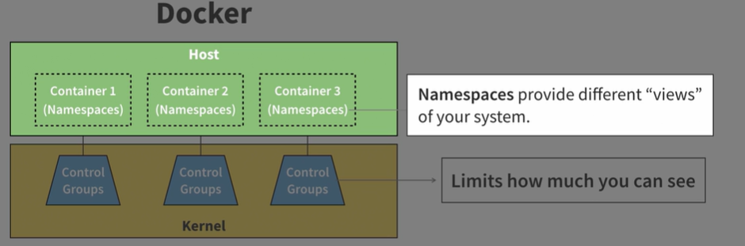
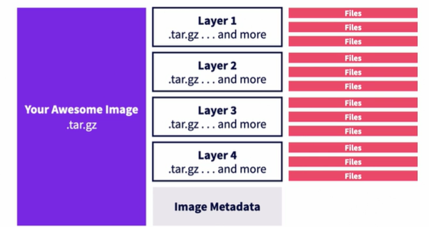
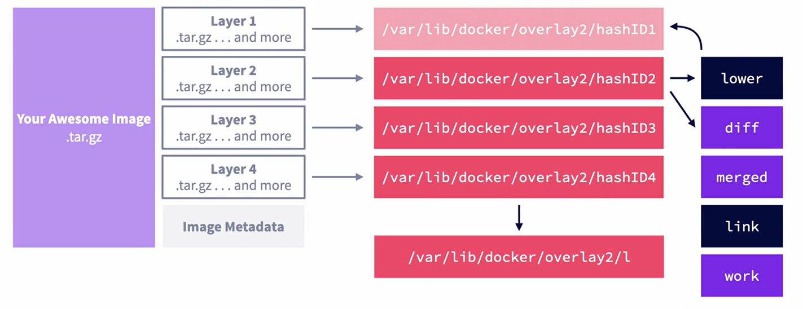
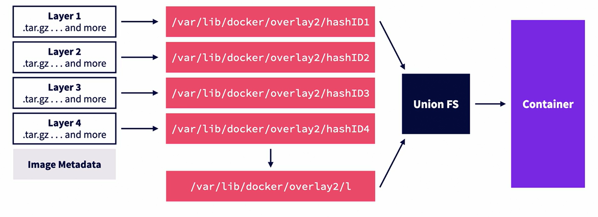

Namespace + "Control Groups"
	Namespace: Limits what you can see
	Control Groups: Limits how much you can use

Docker make containers easy:
	1.Configuration through Dockerfiles, not shell commands
	2.Share images with others through image registries
	3.A super easy command line client and API

Container Runtimes:
	Can:
		Create namespaces
		Create and associate cgroups to namespaces(container)
		Map filesystems to containers
		Set container capabilities
		Start, stop and remove individual containers

	Cannot:
		Build images
		Pull images
		Serve APIs for interacting with containers

Types of container runtimes:
OCI runtimes
	Open Container Initiative(OCI)
		OCI aims to standardize container technology, like container images and runtimes.
		The OCI Runtime Specification outlines what a container is and how they should be managed.
		runtime-spec does not dictate how to do these things.

		runc
		crun (smaller than runc and faster at starting and stopping containers)
		youki (written in Rust)
CRI runtimes
	Container Runtime Interface(CRI)
		CRI provides an API for running containers on container runtimes, This allows projects like Kubernetes to not be tied to any specific runtime or runtime standard

	containerd is a popular CRI tuntime that uses runc by default to create OCI containers
	CRI-O is a lightweight CRI runtime optimized for Kubernetes, maintained by Redhat, Intel and others


The Container Engine:
	Container engines make managing containers easy

	Docker Engine
		Uses containerd as its runtime by default
	Podman
		The Redhat container engine
		Uses crun as its runtime by default

/var/lib/docker: containers, volumes, and metadata

morrism@PC24036:~$ sudo ls /var/lib/docker
buildkit  containers  engine-id  image  network  overlay2  plugins  runtimes  swarm  tmp  volumes

/var/run/docker.sock: the pipe between the Docker client and Docker Engine

morrism@PC24036:~$ sudo ls -l /var/run/docker.sock
srw-rw---- 1 root docker 0 Jun 26 09:32 /var/run/docker.sock

/etc/docker/daemon.json: Docker Engine configuration(might not exist first)

morrism@PC24036:~$ sudo ls -l /etc/docker/daemon.json
-rw-r--r-- 1 root root 193 Jun 21 17:04 /etc/docker/daemon.json


Container images:
Container images are prepackaged filesystems for containers.

morrism@PC24036:~/ubuntu/docker$ tar -t -f ./hello-world.tar.gz
247460e92ef67fdf643394f29fdfdfcec2fde609010ec63e3b7bee779e1a4846/
247460e92ef67fdf643394f29fdfdfcec2fde609010ec63e3b7bee779e1a4846/VERSION
247460e92ef67fdf643394f29fdfdfcec2fde609010ec63e3b7bee779e1a4846/json
247460e92ef67fdf643394f29fdfdfcec2fde609010ec63e3b7bee779e1a4846/layer.tar
7b473dec0fa9e1cd2ffeb04ca39b125972ca0927000ccd033404674671768b8a/
7b473dec0fa9e1cd2ffeb04ca39b125972ca0927000ccd033404674671768b8a/VERSION
7b473dec0fa9e1cd2ffeb04ca39b125972ca0927000ccd033404674671768b8a/json
7b473dec0fa9e1cd2ffeb04ca39b125972ca0927000ccd033404674671768b8a/layer.tar
d68fcc334f453a8c889c682226e6c6dc39694eaa4af54fdc8cc03bba03fdbb1c.json
manifest.json
repositories

morrism@PC24036:~/ubuntu/docker$ tar -x -O -f ./hello-world.tar.gz manifest.json
[{"Config":"d68fcc334f453a8c889c682226e6c6dc39694eaa4af54fdc8cc03bba03fdbb1c.json","RepoTags":["test:latest"],"Layers":["7b473dec0fa9e1cd2ffeb04ca39b125972ca0927000ccd033404674671768b8a/layer.tar","247460e92ef67fdf643394f29fdfdfcec2fde609010ec63e3b7bee779e1a4846/layer.tar"]}]

morrism@PC24036:~/ubuntu/docker$ tar -x -O -f ./hello-world.tar.gz manifest.json | jq .
[
  {
    "Config": "d68fcc334f453a8c889c682226e6c6dc39694eaa4af54fdc8cc03bba03fdbb1c.json",
    "RepoTags": [
      "test:latest"
    ],
    "Layers": [
      "7b473dec0fa9e1cd2ffeb04ca39b125972ca0927000ccd033404674671768b8a/layer.tar",
      "247460e92ef67fdf643394f29fdfdfcec2fde609010ec63e3b7bee779e1a4846/layer.tar"
    ]
  }
]

morrism@PC24036:~/ubuntu/docker$ tar -x -O -f ./hello-world.tar.gz 247460e92ef67fdf643394f29fdfdfcec2fde609010ec63e3b7bee779e1a4846/layer.tar | tar -t -f -                                   hello-from-linkedin-learning                                                                                                                                                      

Storage drivers define how layers are stored on disk and represented to containers.
overlay2 is the most popular storage driver.




docker command cli
```bash
morrism@PC24036:~$ docker --help
morrism@PC24036:~$ docker network --help
morrism@PC24036:~$ docker network create --help

morrism@PC24036:~$ sudo docker container create hello-world:linux
	[sudo] password for morrism:
	Unable to find image 'hello-world:linux' locally
	linux: Pulling from library/hello-world
	Digest: sha256:b7d87b72c676fe7b704572ebdfdf080f112f7a4c68fb77055d475e42ebc3686f
	Status: Downloaded newer image for hello-world:linux
	4d899b2443ed4ca6ec50c8994cbd31f3ed0ed016433129f8f6495df623d23bec

morrism@PC24036:~$ sudo docker ps --all
	CONTAINER ID   IMAGE               COMMAND    CREATED              STATUS    PORTS     NAMES
	4d899b2443ed   hello-world:linux   "/hello"   About a minute ago   Created             elated_napier

morrism@PC24036:~$ sudo docker start 4d899b2443ed4c
	4d899b2443ed4c

morrism@PC24036:~$ sudo docker ps --all
	CONTAINER ID   IMAGE               COMMAND    CREATED         STATUS                      PORTS     NAMES
	4d899b2443ed   hello-world:linux   "/hello"   2 minutes ago   Exited (0) 10 seconds ago             elated_napier

morrism@PC24036:~$ sudo docker logs 4d899b2443ed
	Hello from Docker!
	This message shows that your installation appears to be working correctly.
	......

morrism@PC24036:~$ sudo docker container start --attach 4d899b2443ed
	Hello from Docker!
	This message shows that your installation appears to be working correctly.

morrism@PC24036:~$ sudo docker run hello-world:linux              (docker run = docker container create + docker container start + docker container attach)
	Hello from Docker!
	This message shows that your installation appears to be working correctly.


--------- Creat a Docker container from Dockerfile 1 --------------------

morrism@PC24036:~/myFirstDockerImage$ cat Dockerfile
	FROM ubuntu

	LABEL maintainer="morrism"

	USER root

	COPY ./entrypoint.bash /

	RUN apt -y update
	RUN apt -y install curl bash
	RUN chmod 755 /entrypoint.bash

	USER nobody

	ENTRYPOINT [ "/entrypoint.bash" ]
	morrism@PC24036:~/myFirstDockerImage$ cat entrypoint.bash
	#!/usr/bin/env bash

	echo "The current time is ${date}"

morrism@PC24036:~/myFirstDockerImage$ sudo docker run my-first-image
	The current time is

--------- Creat a Docker container from Dockerfile 2 --------------------

morrism@PC24036:~/myFirstDockerImage$ cat server.Dockerfile
	FROM ubuntu
	LABEL maintainer="Carlos Nunez <dev@carlosnunez.me>"

	USER root
	COPY ./server.bash /

	RUN chmod 755 /server.bash
	RUN apt -y update
	RUN apt -y install bash

	USER nobody

	ENTRYPOINT [ "/server.bash" ]
	morrism@PC24036:~/myFirstDockerImage$ cat server.bash
	#!/usr/bin/env bash

	bash_is_current_version() {
	bash --version | grep -q 'version 5'
	}

	start_server() {
	echo "Server started. Press CTRL-C to stop..."
	while true
	do sleep 10
	done
	}

	if ! bash_is_current_version
	then
	>&2 echo "ERROR: Bash not installed or not the right version."
	exit 1
	fi

	start_server


morrism@PC24036:~/myFirstDockerImage$ sudo docker run my-server-image
	Server started. Press CTRL-C to stop...
	......

morrism@PC24036:~/myFirstDockerImage$ sudo docker run -d my-server-image
	1db9dd9e0c90a27964e87c98d9a8859c204ff2755a6c6d87585b92c35637791a

morrism@PC24036:~/myFirstDockerImage$ sudo docker ps
	CONTAINER ID   IMAGE             COMMAND          CREATED          STATUS          PORTS     NAMES
	baa4fc37a2e3   my-server-image   "/server.bash"   20 seconds ago   Up 19 seconds             sharp_germain

morrism@PC24036:~/myFirstDockerImage$ sudo docker exec 1db9dd9e0c90 date
	Mon Jun 24 08:36:01 UTC 2024

morrism@PC24036:~/myFirstDockerImage$ sudo docker exec --interactive --tty 1db9dd9e0c90  bash
	nobody@1db9dd9e0c90:/$ ls
	bin  boot  dev  etc  home  lib  lib64  media  mnt  opt  proc  root  run  sbin  server.bash  srv  sys  tmp  usr  var
	nobody@1db9dd9e0c90:/$
	exit

morrism@PC24036:~/myFirstDockerImage$ sudo docker kill baa4fc37a2e3
	baa4fc37a2e3

morrism@PC24036:~/myFirstDockerImage$ sudo docker ps
	CONTAINER ID   IMAGE             COMMAND          CREATED         STATUS         PORTS     NAMES
	1db9dd9e0c90   my-server-image   "/server.bash"   6 minutes ago   Up 6 minutes             interesting_varahamihira
morrism@PC24036:~/myFirstDockerImage$ sudo docker stop 1db9dd9e0c90
	1db9dd9e0c90

morrism@PC24036:~/myFirstDockerImage$ sudo docker ps
	CONTAINER ID   IMAGE             COMMAND          CREATED         STATUS         PORTS     NAMES
	34e53ee129c6   my-server-image   "/server.bash"   4 seconds ago   Up 2 seconds             busy_satoshi
morrism@PC24036:~/myFirstDockerImage$ sudo docker stop -t 0 1db9dd9e0c90
	1db9dd9e0c90

morrism@PC24036:~/myFirstDockerImage$ sudo docker ps -a
	CONTAINER ID   IMAGE               COMMAND              CREATED             STATUS                            PORTS     NAMES
	34e53ee129c6   my-server-image     "/server.bash"       53 seconds ago      Up 52 seconds                               busy_satoshi

morrism@PC24036:~/myFirstDockerImage$ sudo docker rm -f 							34e53ee129c6                                                                                                                          	34e53ee129c6                                                                                                                                                                            

morrism@PC24036:~/myFirstDockerImage$ sudo docker ps -aq | xargs sudo docker rm
1db9dd9e0c90
baa4fc37a2e3
abc7c336bbec
6cee9483cde4
f52170766a0c
ff4875b197b0
6a2920de51ed
4d899b2443ed
morrism@PC24036:~/myFirstDockerImage$ sudo docker ps -a
CONTAINER ID   IMAGE     COMMAND   CREATED   STATUS    PORTS     NAMES


morrism@PC24036:~/myFirstDockerImage$ sudo docker images
REPOSITORY        TAG       IMAGE ID       CREATED          SIZE
my-server-image   latest    836da8e91653   19 minutes ago   115MB

morrism@PC24036:~/myFirstDockerImage$ sudo docker rmi -f my-server-image
...

morrism@PC24036:~/myFirstDockerImage$ sudo docker images -q                                                                                   553be8cf2c8b                                                                                                                                                                                  2e1f9fa4aa03                                                                                                                                                                                  67f3a9b219ad                                                                                                                                                                                  35a88802559d                                                                                                                                                                                  d2c94e258dcb                                                                                                                                                                                  d2c94e258dcb                                                                                                                                                                                  

morrism@PC24036:~/myFirstDockerImage$ sudo docker images -q | xargs sudo docker rmi -f
......

-----------------------------------------
morrism@PC24036:~/myFirstDockerImage$ cat web-server.Dockerfile
	FROM ubuntu
	LABEL maintainer="Carlos Nunez <dev@carlosnunez.me>"

	USER root
	COPY ./web-server.bash /

	RUN chmod 755 /web-server.bash
	RUN apt -y update
	RUN apt -y install bash netcat

	USER nobody

	ENTRYPOINT [ "/web-server.bash" ]
	morrism@PC24036:~/myFirstDockerImage$ cat web-server.bash
	#!/usr/bin/env bash

	start_server() {
	echo "Server started. Visit http://localhost:5000 to use it."
	message=$(echo "<html><body><p>Hello! Today's date is $(date).</p></body></html>")
	length=$(wc -c <<< "$message")
	payload="\
	HTTP/1.1 200 OK
	Content-Length: $((length-1))

	$message"
	while true
	do echo -ne "$payload" | nc -l -p 5000
	done
	}

	start_server


morrism@PC24036:~/myFirstDockerImage$ sudo docker build -t my-web-server -f web-server.Dockerfile .
	[sudo] password for morrism:
	DEPRECATED: The legacy builder is deprecated and will be removed in a future release.
				Install the buildx component to build images with BuildKit:
				https://docs.docker.com/go/buildx/

	Sending build context to Docker daemon  7.168kB
	Step 1/9 : FROM ubuntu
	......

sudo docker run -d --name my-web-server -p 5001:5000 my-web-server


morrism@PC24036:~/myFirstDockerImage$ sudo docker run --rm --entrypoint sh ubuntu -c "echo 'hello world' > /tmp/file && cat /tmp/file"
[sudo] password for morrism:
hello world
morrism@PC24036:~/myFirstDockerImage$ ls /tmp/file
ls: cannot access '/tmp/file': No such file or directory
morrism@PC24036:~/myFirstDockerImage$ sudo docker run --rm --entrypoint sh -v /tmp/container:/tmp ubuntu -c "echo 'hello world' > /tmp/file && cat /tmp/file"
hello world
morrism@PC24036:~/myFirstDockerImage$ cat /tmp/container/file
hello world
morrism@PC24036:~/myFirstDockerImage$

Push images to the Docker registry:
1.注册 Dockerhub
2.在客户端通过 docker login 登录 Dockerhub
3.重命令 docker iamge: docker tag my-web-server USERNAME/my-web-server:0.0.1
4. docker push USERNAME/my-web-server:0.0.1


sudo docker run --name website -v "$PWD/website:/usr/share/nginx/html" -p 8080:80 --rm nginx


```

[Container from scratch: table of contents](https://kevinboone.me/containerfromscratch_toc.html)
[Difference Between chroot and Docker](https://www.baeldung.com/ops/chroot-vs-docker)
[ruri](https://github.com/Moe-hacker/ruri)

- [[podman]]
- linux容器
	- linux容器是一种虚拟化技术，LXC(Linux Containers)不是模拟一个完整的操作系统，而是对进程进行隔离，对于容器里的进程来说，各种资源是虚拟的，从而实现与底层系统的隔离。
	- 特点
		- 启动快
			- 容器里面的应用是底层系统的一个进程，因此容器可以达到进程级启动速度
		- 资源占用少
			- 相比于虚拟机，容器只占用需要的资源。另外，多个容器可以共享资源
		- 体积小
			- 相比于虚拟机，容器只包含用到的组件，因此相比虚拟机文件要小很多
- docker
	- docker 属于 Linux容器的一种封装，提供简单易用的容器使用接口，是目前最流行的linux容器解决方案
	- 
	- {:height 326, :width 593}
	- docker镜像
	  collapsed:: true
		- {:height 304, :width 716}
		-
- docker的用途
	- 提供一次性环境
	- 提供弹性的云服务
	- 组件微服务架构
- 参考文档
	- [**Mini Container Series**](https://hechao.li/2020/06/09/Mini-Container-Series-Part-0-Not-a-Real-Container/)
	- [Container engines, runtimes and orchestrators: an overview](https://sarusso.github.io/blog/container-engines-runtimes-orchestrators.html)
	  id:: 65644675-7f26-472a-8bbc-3cd1f46e1d47
	- [每天5分钟玩转Docker容器技术](https://github.com/loveLynch/Book/blob/master/%E6%AF%8F%E5%A4%A95%E5%88%86%E9%92%9F%E7%8E%A9%E8%BD%ACDocker%E5%AE%B9%E5%99%A8%E6%8A%80%E6%9C%AF.CloudMan(%E8%AF%A6%E7%BB%86%E4%B9%A6%E7%AD%BE).pdf) #pdf #github
	- [每天5分钟玩转Kubernetes](https://github.com/YoungLC/ebooks/blob/master/docker%26K8S/%E6%AF%8F%E5%A4%A95%E5%88%86%E9%92%9F%E7%8E%A9%E8%BD%ACKubernetes.pdf) #pdf #github
	- [Docker 简易入门教程](https://iphysresearch.github.io/blog/post/programing/docker-tutorial/)
	- [Docker 入门教程](https://www.ruanyifeng.com/blog/2018/02/docker-tutorial.html)
	- [Docker 微服务教程](https://www.ruanyifeng.com/blog/2018/02/docker-wordpress-tutorial.html)
		- #+BEGIN_QUOTE
		  image 仓库的镜像网址
		  打开/etc/default/docker文件（需要sudo权限），在文件的底部加上一行
		  DOCKER_OPTS="--registry-mirror=https://registry.docker-cn.com"
		  重启 Docker 服务
		  sudo service docker restart
		  #+END_QUOTE
	- [docker Reference documentation](https://docs.docker.com/reference/)
	- [Digging Into Runtimes – runc](https://blog.quarkslab.com/digging-into-runtimes-runc.html)
	- [Digging into the OCI Image Specification](https://blog.quarkslab.com/digging-into-the-oci-image-specification.html)
	- [Digging into Linux namespaces - part 1](https://blog.quarkslab.com/digging-into-linux-namespaces-part-1.html)
	- [Digging into Linux namespaces - part 2](https://blog.quarkslab.com/digging-into-linux-namespaces-part-2.html)
	- [The differences between Docker, containerd, CRI-O and runc](https://www.tutorialworks.com/difference-docker-containerd-runc-crio-oci/)
	- [docker architecture](https://docs.docker.com/get-started/overview/#docker-architecture)
- [Learning Containers From The Bottom Up](https://iximiuz.com/en/posts/container-learning-path/)
- [A Practical Introduction to Container Terminology](https://developers.redhat.com/blog/2018/02/22/container-terminology-practical-introduction#)
- [Difference Between Docker Images and Containers](https://www.baeldung.com/ops/docker-images-vs-containers)
- OCI
  id:: 654cb239-caf4-4432-a388-d977ff7f17e1
	- [Open Container Initiative](https://github.com/opencontainers/image-spec/blob/main/spec.md#open-container-initiative)
	- [OCI Image Layout Specification](https://github.com/opencontainers/image-spec/blob/main/image-layout.md#oci-image-layout-specification)
	-
	- [Open Container Initiative Runtime Specification](https://github.com/opencontainers/runtime-spec/blob/main/spec.md)
	- [OCI runtime-spec config](https://github.com/opencontainers/runtime-spec/blob/main/config.md#configuration)
	- [COI runtime-spec Configuration Schema Example](https://github.com/opencontainers/runtime-spec/blob/main/config.md#configuration-schema-example)
	- [Runtime and Lifecycle](https://github.com/opencontainers/runtime-spec/blob/main/runtime.md#lifecycle)
	- [Modifying OCI Images the hard way](https://www.justinpolidori.it/posts/20230219_modifying_oci_images_the_hard_way/)
- [runc](https://github.com/opencontainers/runc)
	- #+BEGIN_QUOTE
	  runc is a CLI tool for spawning and running containers on Linux according to the OCI specification.
	  #+END_QUOTE
- [**Docker Deep Dive.pdf**](https://github.com/Ameen-Alam/CNC-Docker/blob/master/Docker%20Deep%20Dive.pdf)
- [**Docker Cookbook.pdf**](https://github.com/mr-nsin/references/blob/master/Docker%20Cookbook.pdf)
- [Most Popular Container Runtimes](https://www.cloudraft.io/blog/container-runtimes)
- [Overview of Different Container Runtimes](https://cto.ai/blog/overview-of-different-container-runtimes/)
- [Container Runtimes](https://kubernetes.io/docs/setup/production-environment/container-runtimes/)
- [Understanding containers](https://www.redhat.com/en/topics/containers?extIdCarryOver=true&sc_cid=701f2000001Css5AAC#overview)