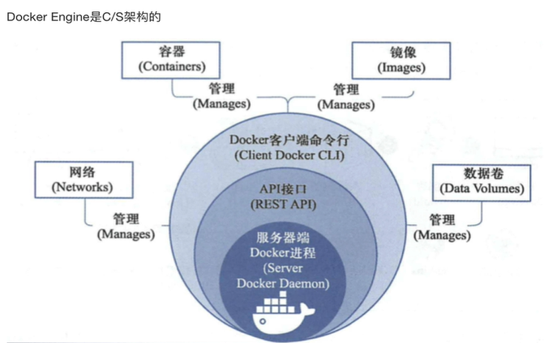
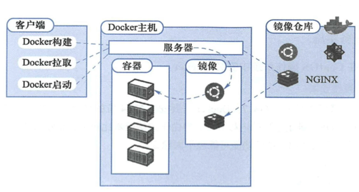
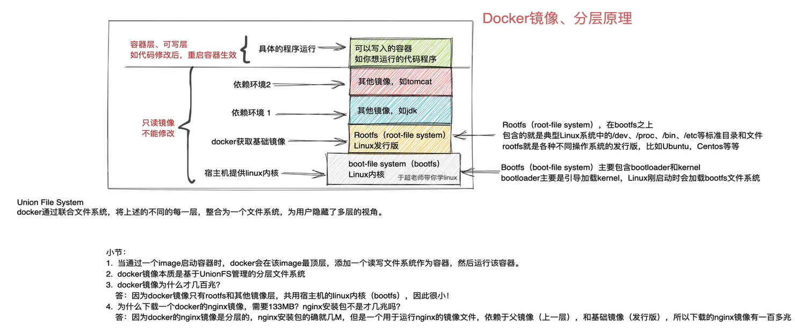

[Understanding Hypervisors: Exploring Type-1 vs Type-2 and Full vs Para Virtualization](https://medium.com/@ravipatel.it/understanding-hypervisors-exploring-type-1-vs-type-2-and-full-vs-para-virtualization-71b4dad9abd9)  

[LXD](https://documentation.ubuntu.com/lxd/en/stable-5.21/explanation/)  
[oVirt](https://www.ovirt.org/)  

[Kubernetes Deployment Antipatterns](https://codefresh.io/blog/kubernetes-antipatterns-1/)  
[Docker anti-patterns](https://codefresh.io/blog/docker-anti-patterns/)  

## LXD, Docker 和 oVirt
```
LXD(Linux Container Daemon)是一种基于 Linux容器 (LXC) 的系统级容器，提供类似虚拟机的轻量级容器环境，同时保持接近原生的性能，它通过抽象底层 LXC 技术，简化了容器管理的复杂性，并扩展了容器的高级功能

LXC 是操作系统级虚拟化（容器），容器共享宿主机内核，属于进程级隔离，性能开销小，启动速度快，仅支持 Linux （需要兼容内核版本）
LXC：
​核心技术：
	​命名空间（Namespaces）​：隔离进程、网络、文件系统等资源
	​控制组（cgroups）​：限制 CPU、内存等资源使用
	​用户空间（User Space）​：容器内运行完整的用户态环境（如 Ubuntu、CentOS）
​共享内核：所有容器直接使用宿主机内核，无法运行不同内核版本的系统
​轻量级：无硬件虚拟化层，资源占用极低

KVM 是硬件级虚拟化，每个虚拟机运行独立内核，属于硬件级隔离（独立虚拟机内核），性能开销较大（需模拟硬件，CPU/内存开销5%~20%），启动速度较慢，支持多种操作系统(Linux, Windows)
KVM:
核心技术：
	​硬件虚拟化扩展：依赖 CPU 的 Intel VT-x/AMD-V 技术实现指令级虚拟化
	​QEMU 设备模拟：模拟虚拟硬件（如磁盘、网卡）
	​独立内核：每个虚拟机运行完整的操作系统（包括内核）
​完全隔离：虚拟机之间通过硬件虚拟化层隔离，安全性更高
​资源独占：虚拟机需预分配 CPU、内存等资源

Docker 是应用级容器(单进程模型)

oVirt 基于 KVM/QEMU 虚拟化，通过硬件辅助虚拟化运行和管理虚拟机，每个虚拟机有独立的镜像，即可以运行异构的操作系统

```


[Container from scratch: table of contents](https://kevinboone.me/containerfromscratch_toc.html)
[Difference Between chroot and Docker](https://www.baeldung.com/ops/chroot-vs-docker)
[ruri](https://github.com/Moe-hacker/ruri)


- linux容器
	- linux容器是一种虚拟化技术，LXC(Linux Containers)不是模拟一个完整的操作系统，而是对进程进行隔离，对于容器里的进程来说，各种资源是虚拟的，从而实现与底层系统的隔离。
	- 特点
		- 启动快
			- 容器里面的应用是底层系统的一个进程，因此容器可以达到进程级启动速度
		- 资源占用少
			- 相比于虚拟机，容器只占用需要的资源。另外，多个容器可以共享资源
		- 体积小
			- 相比于虚拟机，容器只包含用到的组件，因此相比虚拟机文件要小很多
- docker
	- docker 属于 Linux容器的一种封装，提供简单易用的容器使用接口，是目前最流行的linux容器解决方案
	- 
	- 
	- docker镜像
		- 


[**Mini Container Series**](https://hechao.li/2020/06/09/Mini-Container-Series-Part-0-Not-a-Real-Container/)  
[Container engines, runtimes and orchestrators: an overview](https://sarusso.github.io/blog/container-engines-runtimes-orchestrators.html)  
[每天5分钟玩转Docker容器技术](https://github.com/loveLynch/Book/blob/master/%E6%AF%8F%E5%A4%A95%E5%88%86%E9%92%9F%E7%8E%A9%E8%BD%ACDocker%E5%AE%B9%E5%99%A8%E6%8A%80%E6%9C%AF.CloudMan  (%E8%AF%A6%E7%BB%86%E4%B9%A6%E7%AD%BE).pdf) #pdf #github
[每天5分钟玩转Kubernetes](https://github.com/YoungLC/ebooks/blob/master/docker%26K8S/%E6%AF%8F%E5%A4%A95%E5%88%86%E9%92%9F%E7%8E%A9%E8%BD%ACKubernetes.pdf) #pdf #github  
[Docker 简易入门教程](https://iphysresearch.github.io/blog/post/programing/docker-tutorial/)  
[Docker 入门教程](https://www.ruanyifeng.com/blog/2018/02/docker-tutorial.html)  
[Docker 微服务教程](https://www.ruanyifeng.com/blog/2018/02/docker-wordpress-tutorial.html)  
[docker Reference documentation](https://docs.docker.com/reference/)  
[Digging Into Runtimes – runc](https://blog.quarkslab.com/digging-into-runtimes-runc.html)  
[Digging into the OCI Image Specification](https://blog.quarkslab.com/digging-into-the-oci-image-specification.html)  
[Digging into Linux namespaces - part 1](https://blog.quarkslab.com/digging-into-linux-namespaces-part-1.html)  
[Digging into Linux namespaces - part 2](https://blog.quarkslab.com/digging-into-linux-namespaces-part-2.html)  
[The differences between Docker, containerd, CRI-O and runc](https://www.tutorialworks.com/difference-docker-containerd-runc-crio-oci/)  
[docker architecture](https://docs.docker.com/get-started/overview/#docker-architecture)  
[Learning Containers From The Bottom Up](https://iximiuz.com/en/posts/container-learning-path/)  
[A Practical Introduction to Container Terminology](https://developers.redhat.com/blog/2018/02/22/container-terminology-practical-introduction#)  
[Difference Between Docker Images and Containers](https://www.baeldung.com/ops/docker-images-vs-containers)  
[Open Container Initiative](https://github.com/opencontainers/image-spec/blob/main/spec.md#open-container-initiative)  
[OCI Image Layout Specification](https://github.com/opencontainers/image-spec/blob/main/image-layout.md#oci-image-layout-specification)  
[Open Container Initiative Runtime Specification](https://github.com/opencontainers/runtime-spec/blob/main/spec.md)  
[OCI runtime-spec config](https://github.com/opencontainers/runtime-spec/blob/main/config.md#configuration)  
[COI runtime-spec Configuration Schema Example](https://github.com/opencontainers/runtime-spec/blob/main/config.md#configuration-schema-example)  
[Runtime and Lifecycle](https://github.com/opencontainers/runtime-spec/blob/main/runtime.md#lifecycle)  
[Modifying OCI Images the hard way](https://www.justinpolidori.it/posts/20230219_modifying_oci_images_the_hard_way/)  
[runc](https://github.com/opencontainers/runc)  
[**Docker Deep Dive.pdf**](https://github.com/Ameen-Alam/CNC-Docker/blob/master/Docker%20Deep%20Dive.pdf)  
[**Docker Cookbook.pdf**](https://github.com/mr-nsin/references/blob/master/Docker%20Cookbook.pdf)  
[Most Popular Container Runtimes](https://www.cloudraft.io/blog/container-runtimes)  
[Overview of Different Container Runtimes](https://cto.ai/blog/overview-of-different-container-runtimes/)  
[Container Runtimes](https://kubernetes.io/docs/setup/production-environment/container-runtimes/)  
[Understanding containers](https://www.redhat.com/en/topics/containers?extIdCarryOver=true&sc_cid=701f2000001Css5AAC#overview)  