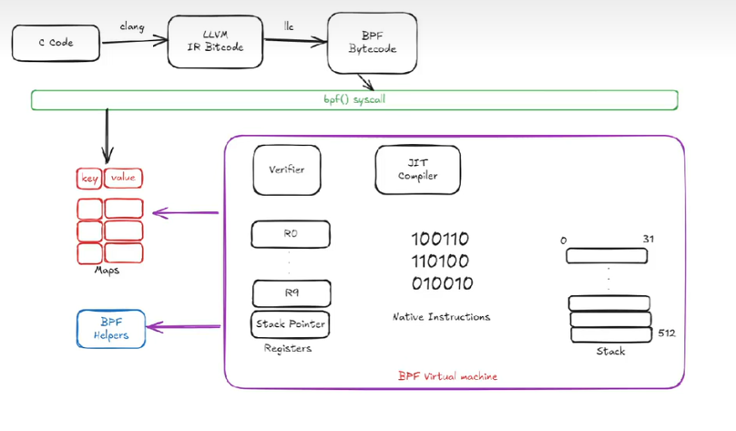

  
[eBPF For Humans | 00 | Intro](https://medium.com/@ilaygilman/ebpf-for-humans-00-intro-b36dc04fefe9)  
[First eBPF program](https://prateek-singh.hashnode.dev/first-ebpf-program)  
[Dive into eBPF: An Introduction](https://medium.com/@sumant1122/dive-into-ebpf-an-introduction-d367d29bf145)  
[Bottom-up eBPF](https://medium.com/@phylake/bottom-up-ebpf-d7ca9cbe8321)  
[BPF and XDP Reference Guide](https://docs.cilium.io/en/stable/reference-guides/bpf/#bpf-guide)  

[eBPF Major Applications](https://ebpf.io/applications/)  

 #pdf  
[learning-ebpf](https://github.com/lizrice/learning-ebpf/tree/main) #github  
 #pdf  

[eBPF Docs](https://docs.ebpf.io/)  
[**eBPF Documentation**](https://ebpf.io/what-is-ebpf/)  
[BPF Documentation](https://docs.kernel.org/bpf/index.html)  
[An eBPF overview, part 1: Introduction](https://www.collabora.com/news-and-blog/blog/2019/04/05/an-ebpf-overview-part-1-introduction/)  
[**Introduction and practice of eBPF**](https://www.sobyte.net/post/2022-04/ebpf/)  

[**Building BPF applications with libbpf-bootstrap**](https://nakryiko.com/posts/libbpf-bootstrap/)  
[libbpf-bootstrap](https://github.com/libbpf/libbpf-bootstrap)  

[Linux Observability with BPF](https://www.oreilly.com/library/view/linux-observability-with/9781492050193/) #pdf  
[Linux Observability with BPF](https://github.com/bpftools/linux-observability-with-bpf) #github  
[BPF Performance Tools](https://www.oreilly.com/library/view/bpf-performance-tools/9780136588870/)  

[libbpf](https://docs.ebpf.io/ebpf-library/libbpf/)  
[libbpf](https://libbpf.readthedocs.io/en/latest/index.html)  
[libbpf](https://github.com/libbpf/libbpf) #github  

[eBPF-Guide](https://github.com/mikeroyal/eBPF-Guide)  
[A Deep Dive into eBPF: Writing an Efficient DNS Monitoring](https://medium.com/@nurkholish.halim/a-deep-dive-into-ebpf-writing-an-efficient-dns-monitoring-2c9dea92abdf)  
  
  
  
  
  
  
  
  
  

## arXiv
> arXiv is a free distribution service and an open-access archive for nearly 2.4 million scholarly articles in the fields of physics, mathematics, computer science, quantitative biology, quantitative finance, statistics, electrical engineering and systems science, and economics.

[The eBPF Runtime in the Linux Kernel](https://arxiv.org/abs/2410.00026)  
[bpftime: userspace eBPF Runtime for Uprobe, Syscall and Kernel-User Interactions](https://arxiv.org/abs/2311.07923)  
[Programmable System Call Security with eBPF](https://arxiv.org/abs/2302.10366)  
[Beyond socket options: making the Linux TCP stack truly extensible](https://arxiv.org/abs/1901.01863)  
[Leveraging eBPF for programmable network functions with IPv6 Segment Routing](https://arxiv.org/abs/1810.10247)  
[COP2: Continuously Observing Protocol Performance](https://arxiv.org/abs/1902.04280)  
  
  
  
  

[eBPF Tutorial by Example: Learning CO-RE eBPF Step by Step](https://eunomia.dev/tutorials/)  
[BPF and XDP Reference Guide](https://docs.cilium.io/en/stable/reference-guides/bpf/index.html)  
[eBPF 完全入门指南.pdf（万字长文）](https://mp.weixin.qq.com/s/zCjk5WmnwLD0J3J9gC4e0Q)  

[bpf-developer-tutorial](https://github.com/eunomia-bpf/bpf-developer-tutorial/tree/main)  
[eBPF 开发者教程](https://github.com/eunomia-bpf/bpf-developer-tutorial/blob/main/README.zh.md)  
[bpftrace(8)](https://github.com/bpftrace/bpftrace/blob/master/man/adoc/bpftrace.adoc)  

[bpftrace(8)](https://www.mankier.com/8/bpftrace)  

[BPF and XDP Reference Guide](https://docs.cilium.io/en/latest/bpf/)  

[bcc](https://github.com/iovisor/bcc)  
[BCC to libbpf conversion guide](https://nakryiko.com/posts/bcc-to-libbpf-howto-guide/)  

[eBPF Tutorial by Example](https://eunomia.dev/tutorials/)  
[TIL: eBPF is awesome](https://filipnikolovski.com/posts/ebpf/)  

[Linux kernel profiling with perf](https://perf.wiki.kernel.org/index.php/Tutorial)  

[The art of writing eBPF programs: a primer](https://sysdig.com/blog/the-art-of-writing-ebpf-programs-a-primer/)  

[0x00C - eBPF](https://unzip.dev/0x00c-ebpf/)  

[Linux Socket Filtering aka Berkeley Packet Filter (BPF)](https://www.kernel.org/doc/Documentation/networking/filter.txt)  
[perf Examples](https://www.brendangregg.com/perf.html)  
[FlameGraph](https://github.com/brendangregg/FlameGraph)  
[The Flame Graph](https://queue.acm.org/detail.cfm?id=2927301)  