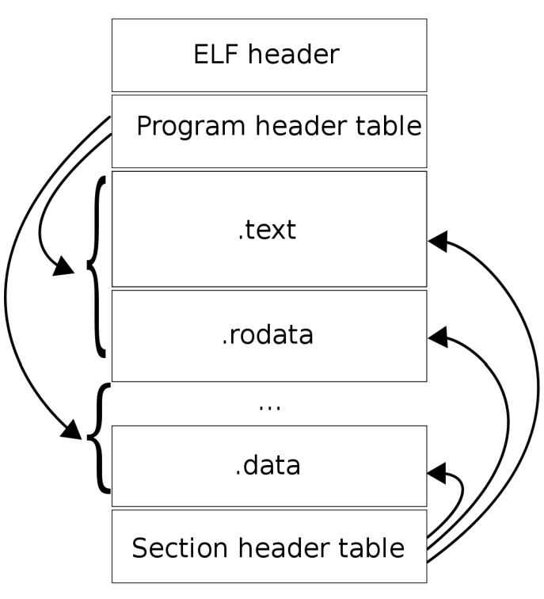

[elfcat](https://github.com/rbakbashev/elfcat) #github
> elfcat - ELF visualizer. Generates HTML files from ELF binaries.

- [[Binary Analysis]]
- Executable and Linkable Format
- elf文件的双重属性，elf文件是一系列segments和headers的集合
	- 内核看到是segments，内核使用mmap(2)将segments映射到虚拟地址空间
	- 链接器看到的是sections，它将sections合并为可执行文件或者共享目标文件
	- 

- elf文件类型
	- 可执行文件executables (ET_EXEC)
		- 可执行程序，必须包含segments
	- 目标文件object file (ET_REL, *.o)
		- 与其他目标文件进行链接，必须包含sections
	- 动态库文件(ET_DYN, *.so)
		- 与其他目标文件或者可执行文件进行链接
		- 同时包含segments和sections
	- core文件(ET_CORE)
		- 当进程收到SIGABRT等信号时产生
		- 不包含sections，只包含segments(PT_LOAD/PT_NOTE)

## elf分析工具
[GNU Binutils](https://sourceware.org/binutils/docs/binutils/index.html)  
[Linux nm Command with Practical Examples](https://labex.io/tutorials/linux-linux-nm-command-with-practical-examples-422841)  
[Figuring out corrupt stacktraces on ARM(addr2line)](https://eocanha.org/blog/2020/10/16/figuring-out-corrupt-stacktraces-on-arm/)  
[]()  
[]()  
[]()  
[]()  
[]()  
```bash
addr2line
	convert addresses into file names and line numbers.
size
	list section sizes and total size.
strings
	print the strings of printable characters in files.
strip
	Discard symbols from object files.
od
	dump files in octal and other formats
	od -Ax -t x1 -N 52 main
hexdump
	display file contents in hexadecimal, decimal, octal, or ascii
file
	determine file type
readelf
	Displays information about ELF files.
ldd
	print shared object dependencies
pldd
	display dynamic shared objects linked into a process
nm
	list symbols from object files
objdump
	display information from object files.
strace
	trace system calls and signals
xxd
	make a hexdump or do the reverse
	xxd -s +12636 -l 1657 main
```
- ```bash
    
  type ElfHeader struct {
  	E_type      Elf64_Half /* Object file type */
  	E_machine   Elf64_Half /* Architecture */
  	E_version   Elf64_Word /* Object file version */
  	E_entry     Elf64_Addr /* Entry point virtual address */
  	E_phoff     Elf64_Off  /* Program header table file offset */
  	E_shoff     Elf64_Off  /* Section header table file offset */
  	E_flags     Elf64_Word /* Processor-specific flags */
  	E_ehsize    Elf64_Half /* ELF header size in bytes */
  	E_phentsize Elf64_Half /* Program header table entry size */
  	E_phnum     Elf64_Half /* Program header table entry count */
  	E_shentsize Elf64_Half /* Section header table entry size */
  	E_shnum     Elf64_Half /* Section header table entry count */
  	E_shstrndx  Elf64_Half /* Section header string table index */
  }
  
  type ProgramHeader struct {
  	P_type   Elf64_Word  /* Segment type */
  	P_flags  Elf64_Word  /* Segment flags */
  	P_offset Elf64_Off   /* Segment file offset */
  	P_vaddr  Elf64_Addr  /* Segment virtual address */
  	P_paddr  Elf64_Addr  /* Segment physical address */
  	P_filesz Elf64_Xword /* Segment size in file */
  	P_memsz  Elf64_Xword /* Segment size in memory */
  	P_align  Elf64_Xword /* Segment alignment, file & memory */
  }
  ```
- elf header
	- 从文件的起始开始
	- 结构体定义Elf64_Ehdr
	- ```bash
	  morrism@PC2886:~/x$  readelf -Wh /lib64/ld-linux-x86-64.so.2
	  ELF Header:
	    Magic:   7f 45 4c 46 02 01 01 00 00 00 00 00 00 00 00 00
	    Class:                             ELF64
	    Data:                              2's complement, little endian
	    Version:                           1 (current)
	    OS/ABI:                            UNIX - System V
	    ABI Version:                       0
	    Type:                              DYN (Shared object file)
	    Machine:                           Advanced Micro Devices X86-64
	    Version:                           0x1
	    Entry point address:               0x1090
	    Start of program headers:          64 (bytes into file)
	    Start of section headers:          164096 (bytes into file)
	    Flags:                             0x0
	    Size of this header:               64 (bytes)
	    Size of program headers:           56 (bytes)
	    Number of program headers:         9
	    Size of section headers:           64 (bytes)
	    Number of section headers:         24
	    Section header string table index: 23
	  
	  ```
- program header
	- 是一个结构数组，每个数组成员是一个segment
	- segment包含sections
	- 结构体定义Elf64_Phdr
	- ```bash
	  morrism@PC2886:~/x$ readelf -Wl /lib64/ld-linux-x86-64.so.2
	  
	  Elf file type is DYN (Shared object file)
	  Entry point 0x1090
	  There are 9 program headers, starting at offset 64
	  
	  Program Headers:
	    Type           Offset   VirtAddr           PhysAddr           FileSiz  MemSiz   Flg Align
	    LOAD           0x000000 0x0000000000000000 0x0000000000000000 0x000f08 0x000f08 R   0x1000
	    LOAD           0x001000 0x0000000000001000 0x0000000000001000 0x01db50 0x01db50 R E 0x1000
	    LOAD           0x01f000 0x000000000001f000 0x000000000001f000 0x0073dc 0x0073dc R   0x1000
	    LOAD           0x026640 0x0000000000027640 0x0000000000027640 0x0019b8 0x001b50 RW  0x1000
	    DYNAMIC        0x026e78 0x0000000000027e78 0x0000000000027e78 0x000170 0x000170 RW  0x8
	    NOTE           0x000238 0x0000000000000238 0x0000000000000238 0x000024 0x000024 R   0x4
	    GNU_EH_FRAME   0x023620 0x0000000000023620 0x0000000000023620 0x0006d4 0x0006d4 R   0x4
	    GNU_STACK      0x000000 0x0000000000000000 0x0000000000000000 0x000000 0x000000 RW  0x10
	    GNU_RELRO      0x026640 0x0000000000027640 0x0000000000027640 0x0009c0 0x0009c0 R   0x1
	  
	   Section to Segment mapping:
	    Segment Sections...
	     00     .note.gnu.build-id .hash .gnu.hash .dynsym .dynstr .gnu.version .gnu.version_d .rela.dyn .rela.plt
	     01     .plt .plt.got .text
	     02     .rodata .eh_frame_hdr .eh_frame
	     03     .data.rel.ro .dynamic .got .got.plt .data .bss
	     04     .dynamic
	     05     .note.gnu.build-id
	     06     .eh_frame_hdr
	     07
	     08     .data.rel.ro .dynamic .got
	  ```
- section header
	- 是一个结构数组，每个数组成员是一个section
	- 结构体定义Elf64_Shdr
	- section类型
		- SHT_PROGBITS bits of the program
		- SHT_SYMTAB symbol table; an array of ELF symbol structures
		- SHT_STRTAB string table; holds null-terminated strings
		- SHT_RELA relocation table
		- SHT_HASH hash table used by rtld to speed symbol lookup
		- SHT_DYNAMIC dynamic tags used by rtld, same as PT DYNAMIC
		- SHT_NOBITS zero-initialized data
		- ......
	- ```bash
	  morrism@localhost /tmp/x $ readelf -WS sub.o
	  There are 11 section headers, starting at offset 0x1c0:
	  
	  Section Headers:
	    [Nr] Name              Type            Addr     Off    Size   ES Flg Lk Inf Al
	    [ 0]                   NULL            00000000 000000 000000 00      0   0  0
	    [ 1] .text             PROGBITS        00000000 000034 00000c 00  AX  0   0  1
	    [ 2] .data             PROGBITS        00000000 000040 000004 00  WA  0   0  4
	    [ 3] .bss              NOBITS          00000000 000044 000000 00  WA  0   0  1
	    [ 4] .comment          PROGBITS        00000000 000044 00002d 01  MS  0   0  1
	    [ 5] .note.GNU-stack   PROGBITS        00000000 000071 000000 00      0   0  1
	    [ 6] .eh_frame         PROGBITS        00000000 000074 000038 00   A  0   0  4
	    [ 7] .rel.eh_frame     REL             00000000 000164 000008 08   I  8   6  4
	    [ 8] .symtab           SYMTAB          00000000 0000ac 0000a0 10      9   8  4
	    [ 9] .strtab           STRTAB          00000000 00014c 000017 00      0   0  1
	    [10] .shstrtab         STRTAB          00000000 00016c 000053 00      0   0  1
	  Key to Flags:
	    W (write), A (alloc), X (execute), M (merge), S (strings), I (info),
	    L (link order), O (extra OS processing required), G (group), T (TLS),
	    C (compressed), x (unknown), o (OS specific), E (exclude),
	    p (processor specific)
	  ```
	- 特殊的section
		- .text    executable instructions
		- .bss/.tbss    Block Started by Symbol, uninitialized data, zeroes
		- .data/.tdata    initialized data/ thread data
		- .rodata     read-only data
		- .dynamic     dynamic linking, information—DT {NEEDED,RUNPATH,SONAME,...}
		- .got{,.plt}     Global Offset Table
		- .plt      Procedure Linkage Table
		- .gnu.hash     symbol hash table
		- .strtab     string table
		- .init/.fini    executable insns, initialization code
		- .{init,fini}_array     array of function pointers to init functions


[Executable and Linkable Format (ELF)](https://www.cs.cmu.edu/afs/cs/academic/class/15213-f00/docs/elf.pdf)  
[ELF Header](https://refspecs.linuxfoundation.org/elf/gabi4+/ch4.eheader.html)  
[System V Application Binary Interface](https://refspecs.linuxfoundation.org/elf/gabi4+/contents.html)  
[Executable And Linking Format (ELF)](https://refspecs.linuxbase.org/LSB_5.0.0/LSB-Core-generic/LSB-Core-generic/elf-generic.html)  
[The 101 of ELF files on Linux: Understanding and Analysis](https://linux-audit.com/elf-binaries-on-linux-understanding-and-analysis/)  
[10 ways to analyze binary files on Linux](https://opensource.com/article/20/4/linux-binary-analysis)  
[man 5 elf](https://man7.org/linux/man-pages/man5/elf.5.html)  
[The ELF file format](https://www.gabriel.urdhr.fr/2015/09/28/elf-file-format/)  
[ELF loading and dynamic linking](https://www.gabriel.urdhr.fr/2015/01/22/elf-linking/)  
[Linkers and Loaders](https://www.wh0rd.org/books/linkers-and-loaders/linkers_and_loaders.pdf)  
[Introduction to ELF](https://people.redhat.com/mpolacek/src/devconf2012.pdf)  
[Acronyms relevant to Executable and Linkable Format](https://stevens.netmeister.org/631/elf.html)  
[anatomy-of-a-binary-executable](https://oswalt.dev/2020/11/anatomy-of-a-binary-executable/)  
[GNU Binutils: A Collection of Binary Tools](https://www.opensourceforu.com/2011/10/gnu-binutils-collection-of-binary-tools/)  
[Understanding ELF, the Executable and Linkable Format](https://www.opensourceforu.com/2020/02/understanding-elf-the-executable-and-linkable-format/)  
[Elements of Parsing an ELF Header](https://course.ccs.neu.edu/cs7680sp17/elf-parser/)  
[Special Sections](https://refspecs.linuxfoundation.org/LSB_1.3.0/gLSB/gLSB/specialsections.html)  
[GNU Binutils: the ELF Swiss Army Knife](https://interrupt.memfault.com/blog/gnu-binutils#gnu-binutil-command-examples)  
[Linking](https://people.cs.pitt.edu/~xianeizhang/notes/Linking.html#top)  
[ELF](https://students.mimuw.edu.pl/ZSO/PUBLIC-SO/2017-2018/_build/html/03_elf/index-en.html)  
[GNU Binary Utilities](https://docs.adacore.com/live/wave/binutils-stable/html/binutils/binutils.html#Top)  
[A ToC of the 20 part linker essay](https://lwn.net/Articles/276782/)  
[Special sections in Linux binaries](https://lwn.net/Articles/531148/)  

[ELF Format Cheatsheet](https://gist.github.com/x0nu11byt3/bcb35c3de461e5fb66173071a2379779)  
[Executable and Linkable Format (ELF)](https://www.cs.cmu.edu/afs/cs/academic/class/15213-f00/docs/elf.pdf)  
[Practical Binary Analysis](https://terrorgum.com/tfox/books/practicalbinaryanalysis.pdf)  
[Tool Interface Standard (TIS) Portable Formats Specification](https://refspecs.linuxfoundation.org/elf/TIS1.1.pdf)  
[Tool Interface Standard (TIS) Executable and Linking Format (ELF) Specification](https://refspecs.linuxfoundation.org/elf/elf.pdf)  
[The 101 of ELF files on Linux: Understanding and Analysis](https://linux-audit.com/elf-binaries-on-linux-understanding-and-analysis/)  
[readelf elf文件格式分析](https://linuxtools-rst.readthedocs.io/zh-cn/latest/tool/readelf.html)  
[打造史上最小可执行ELF文件(45字节)](https://tinylab-1.gitbook.io/cbook/02-chapter8)  
[ELF转二进制](https://tinylab.org/elf2bin-part1/)  
[Go elf package](https://pkg.go.dev/debug/elf)  

[Shared libraries with GCC on Linux](https://www.cprogramming.com/tutorial/shared-libraries-linux-gcc.html)  
[When to actually use dlopen()? Does dlopen() means dynamic loading?](https://stackoverflow.com/questions/63306734/when-to-actually-use-dlopen-does-dlopen-means-dynamic-loading)  
```c
#include <stdlib.h>
#include <stdio.h>
#include <dlfcn.h>

int main(int argc, char **argv) {
	void *handle;
	double (*cosine)(double);
	char *error;

	handle = dlopen ("/lib/libm.so.6", RTLD_LAZY);
	if (!handle) {
		fputs (dlerror(), stderr);
		exit(1);
	}

	cosine = dlsym(handle, "cos");
	if ((error = dlerror()) != NULL)  {
		fputs(error, stderr);
		exit(1);
	}

	printf ("%f\n", (*cosine)(2.0));
	dlclose(handle);
}

# gcc -rdynamic -o progdl progdl.c -ldl
```

[A programmer's guide to GNU C Compiler](https://opensource.com/article/22/5/gnu-c-compiler)  
[Dynamically linking libraries while compiling code](https://opensource.com/article/22/5/compile-code-ldlibrarypath)  
[Anyone can compile open source code in these three simple steps](https://opensource.com/article/21/11/compiling-code)  
[How to handle dynamic and static libraries in Linux](https://opensource.com/article/20/6/linux-libraries)  
[How dynamic linking for modular libraries works on Linux](https://opensource.com/article/22/5/dynamic-linking-modular-libraries-linux)  
[man readelf](https://man7.org/linux/man-pages/man1/readelf.1.html)  

[Binary analysis tools](https://linuxsecurity.expert/security-tools/binary-analysis-tools)  
[Linux修改ELF解决glibc兼容性问题](https://zohead.com/archives/mod-elf-glibc/) #elf  
[LIFE](https://linuxsecurity.expert/tools/lief/)  
	> LIEF is short for **Library to Instrument Executable Formats**.
od
hexdump
xxd
strings
hexedit