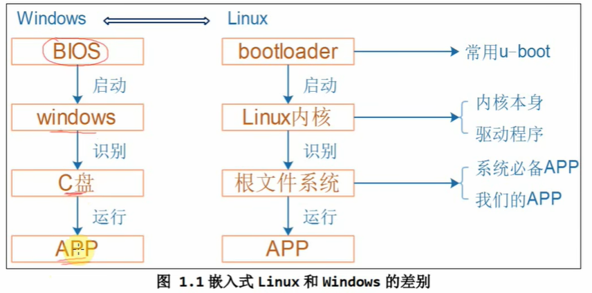

- [[嵌入式linux应用开发基础知识]]
- 嵌入式linux与windows的差异
	- 
- 参考文档
	- 韦东山
		- [jz2440 参考文档](http://wiki.100ask.org/Jz2440)
	- [jz2440 代码参考](https://github.com/zzb2760715357/100ask)
	- [百问网嵌入式Linux wiki](http://wiki.100ask.org/Mainpage)
	- [百问网嵌入式BeginnerLearningRoute](http://wiki.100ask.org/BeginnerLearningRoute)
	- Linux/UNIX系统编程手册 #pdf

[Designing Embedded Systems and the Internet of Things]()  
  
  