- [[嵌入式linux应用开发基础知识]]
- 嵌入式linux与windows的差异
	- 
- 参考文档
	- 韦东山
		- [jz2440 参考文档](http://wiki.100ask.org/Jz2440)
	- [jz2440 代码参考](https://github.com/zzb2760715357/100ask)
	- [百问网嵌入式Linux wiki](http://wiki.100ask.org/Mainpage)
	- [百问网嵌入式BeginnerLearningRoute](http://wiki.100ask.org/BeginnerLearningRoute)
	- Linux/UNIX系统编程手册 #pdf

[Designing Embedded Systems and the Internet of Things]()  
[]()  
[]()  

## GPIO
  
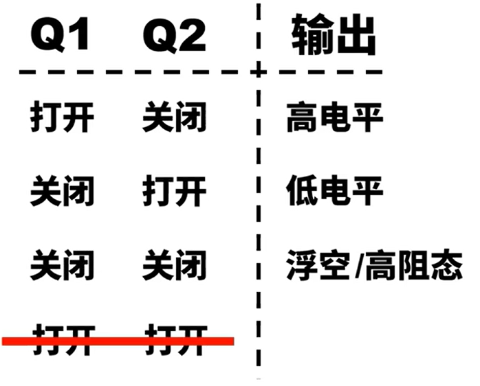  
- 推挽模式
```
Q1    Q2    |  Output Level
---------------------------
On    Off   |  High
Off   On    |  Low
```
- 开漏模式
```
Q1    Q2    |  Output Level
---------------------------
Off   On    |  Low
Off   Off   |  高阻
```
- 开漏模式的作用
1. 改变高电平的电压
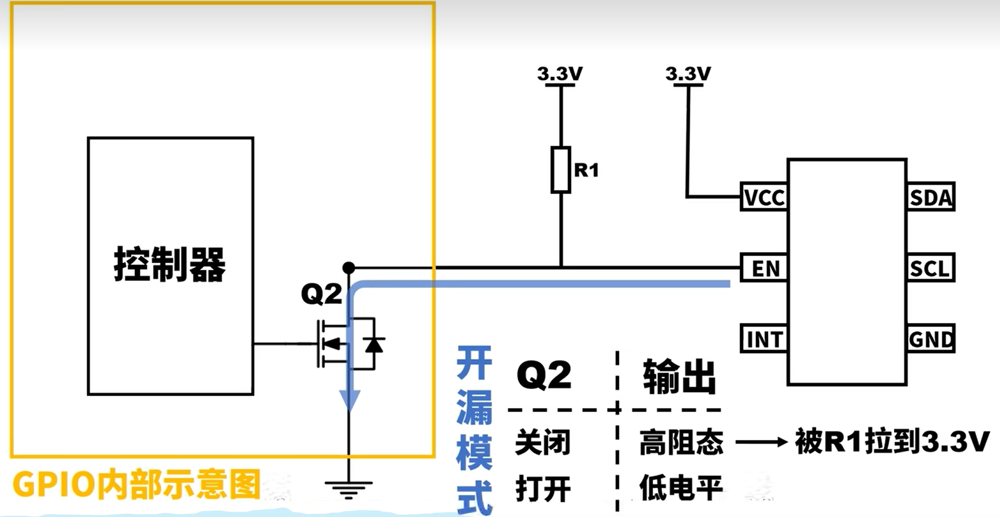  
2. 几个GPIO同时控制一个输入
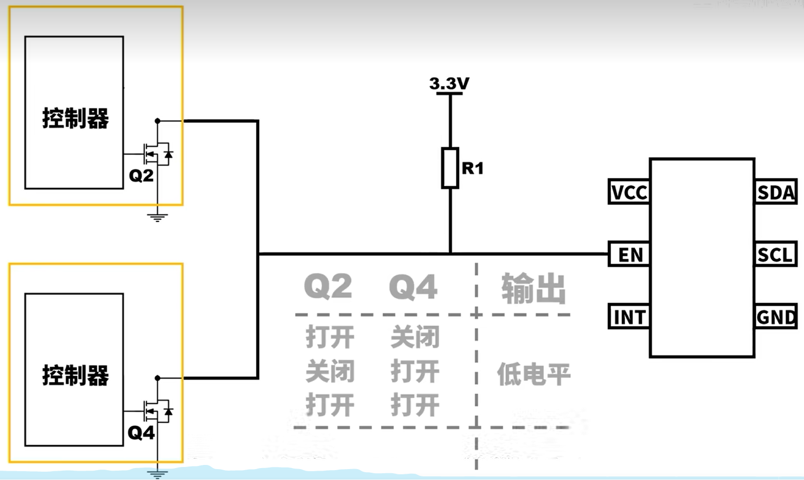  

## 上拉电阻
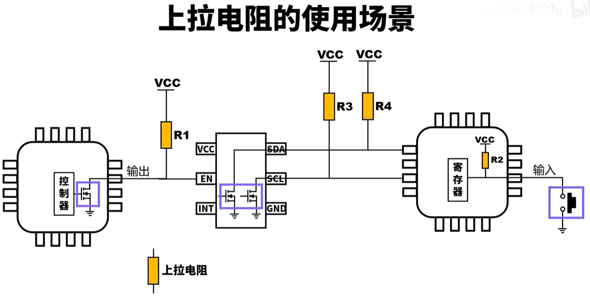  
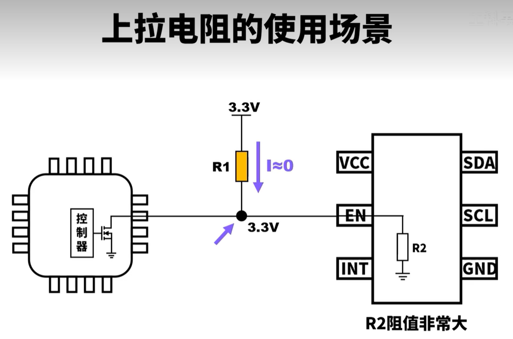  
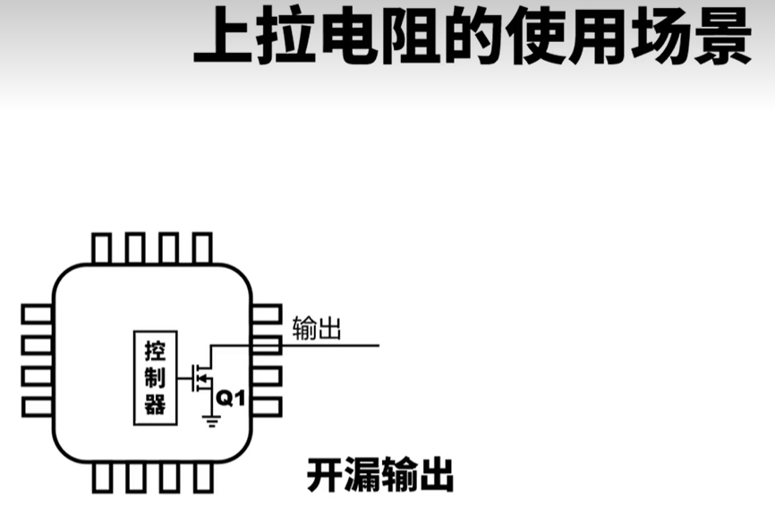  
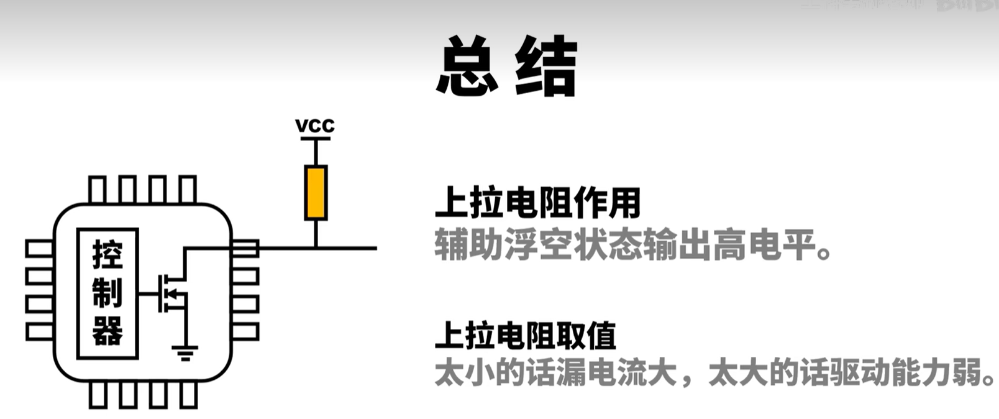  
  
  
- 上拉电阻的作用
	解决浮空状态时电压不确定的问题，辅助浮空状态输出高电平
- 上拉电阻的取值(控制开关:10K - 100K, PWM或通讯:1K - 10K)
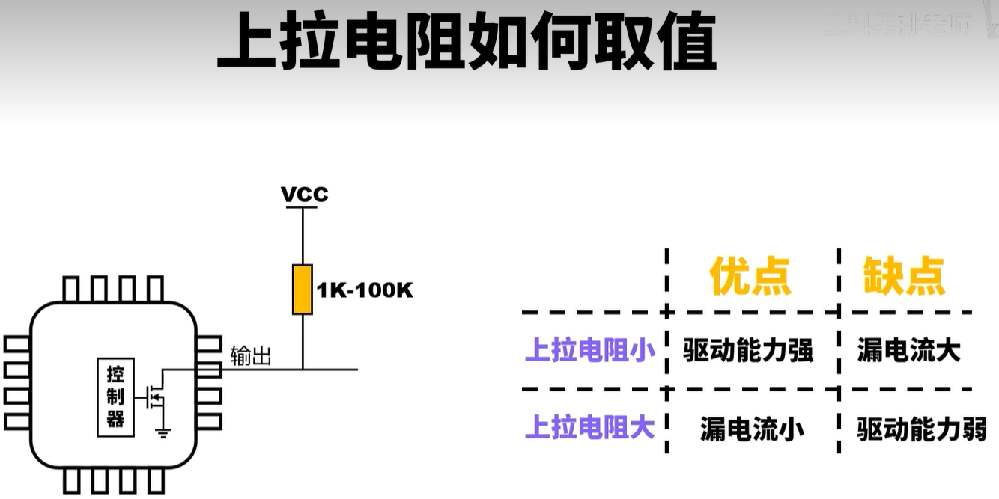  
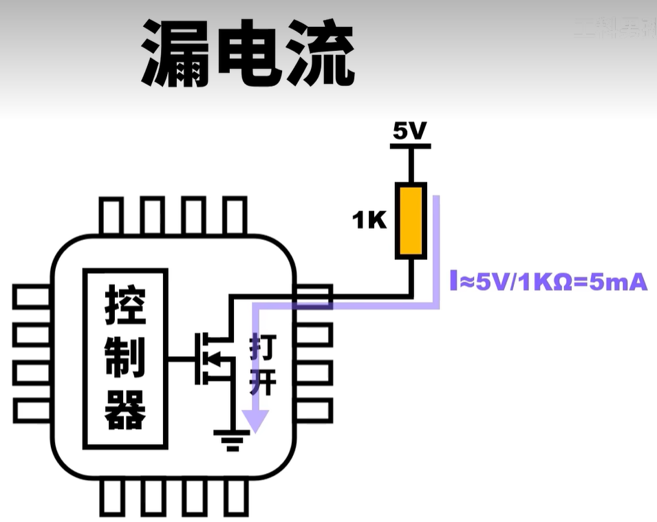  
> 当芯片内的MOS管打开时: 1. 电流浪费 2.在系统内部产生热量，只考虑漏电流的特性，上拉电阻越大越好
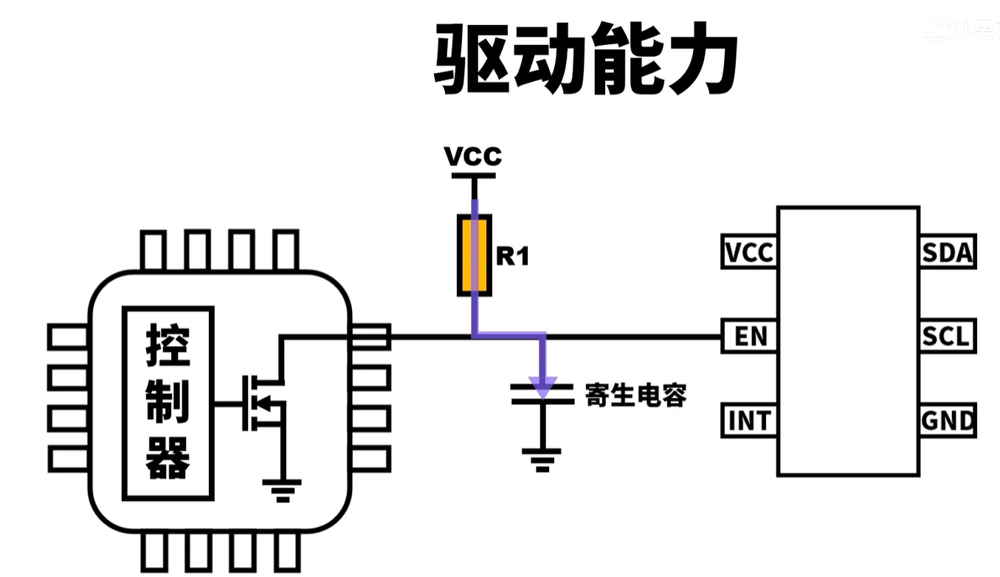  
> 低电平到高电平的转换不是瞬时完成的，而是一个爬升的过程，该爬升的过程是通过电阻给电容充电的过程来完成的，即电阻越大爬升过程越慢，电阻越小爬升过程越快，只考虑驱动能力，上拉电阻越小越好

## UART
- 物理上两根线(RX, TX)，支持同时发送和接收数据
- 双方约定波特率(9600, 115200)
- 一次发送8位数据(1 Byte)

使用TTL电平，信号容易收到干扰，只能在很短的距离内通信

缺点:
1. 不能远距离传输信号  -- RS232, RS485
2. 通信速度慢  -- SPI
3. 不能一对多通信  -- I2C

## RS232
通信距离: 30M

## RS485
通信距离: 1000M
支持一对多通信

## SPI
需要额外的时钟同步信号
通信速率10M+

## I2C
引入总线的概念(CLK + DATA)，支持一对多通信
	由于采用 开漏输出 +上拉电阻 的实现方式，I2C抗干扰能力弱，只适合于同一电路板上的芯片之间进行通信
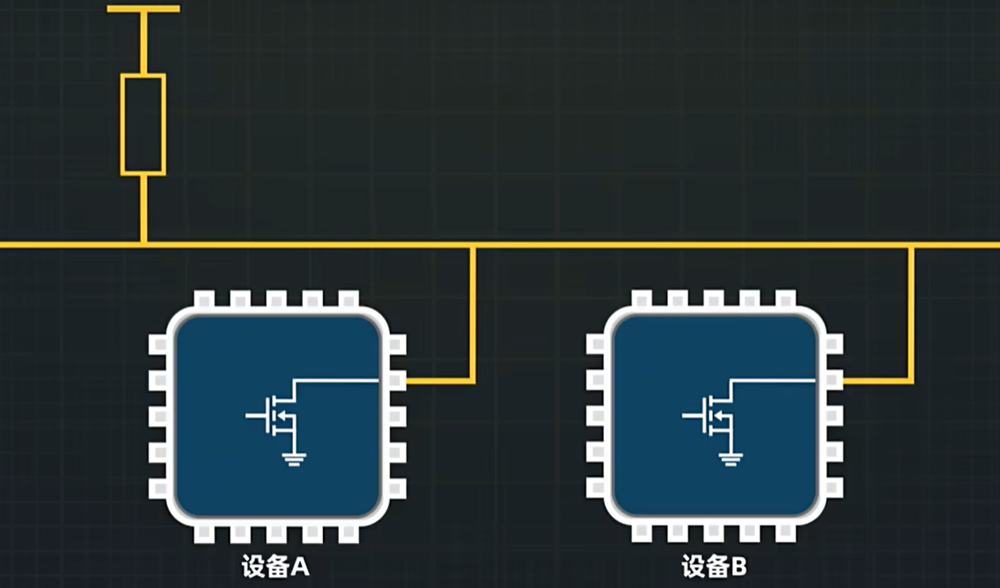  
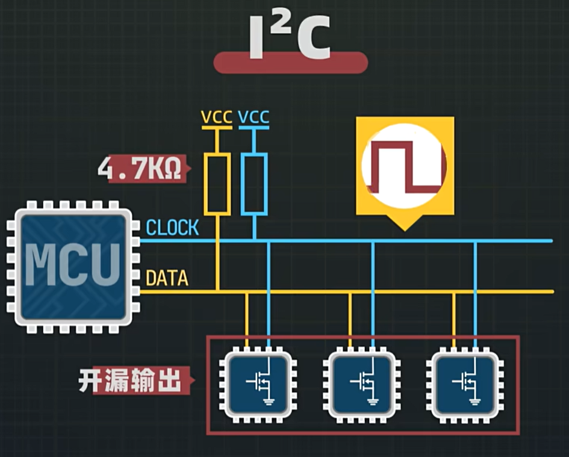  
  