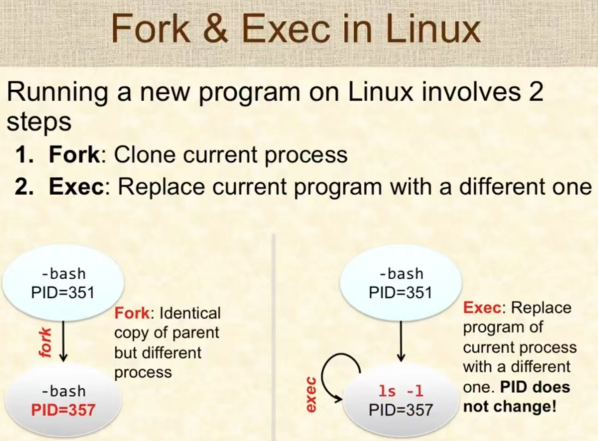

- 
- linux提供fork系统调用，用来创建子进程
	- 参数
		- 无
	- 返回值
		- 一次调用两次返回
		- `> 0`
			- 在主进程中返回子进程的进程ID
		- `= 0`
			- 在子进程中返回0
		- `< 0`
			- fork调用出错
	- fork创建子进程后，主进程和子进程同时开始从^^下一条指令^^开始执行(并发执行，具体哪个进程先执行取决于资源和调度算法)
- 示例
	- 代码总共打印几次hello
	- 示例1
		- ```c
		  int main(void)
		  {
		    fork();
		    fork();
		    printf("hello\n");
		    return 0;
		  }
		  //
		          F
		         -F-
		          P
		   F
		  -F-
		   P
		   
		   //
		          F
		         -F-
		          P
		   F
		   F
		  -P-
		         F
		         F
		        -P-
		  
		  //
		          F
		          F
		         -P-
		   F				F
		   F				F
		  -P-			   -P-
		         F
		         F
		        -P-
		  fork创建子进程后，主进程和子进程同时从下一条语句开始执行，
		  总共打印4次，打印的顺序取决于调度算法和当时的资源是否可以得到满足
		  ```
	- 示例2
		- ```c
		  int main(void)
		  {
		    p = fork();
		    if(p > 0) {
		      fork();
		      printf("hello\n");
		    }
		    printf("hello\n");
		    return 0;
		  }
		  
		  //
		                  F
		                 -IF-
		                      F
		                      P
		                  P
		    F
		   -IF-
		  		F
		    		P
		    P
		   
		   //
		                  F
		                 -IF-
		                      F
		                      P
		                  P
		    F
		    IF // false
		  		F
		    		P
		     P
		  
		  //
		                  F
		                  IF // true
		                      F
		                     -P-
		                  P
		    F								F
		    IF 							IF
		  		F							F
		    		P						   -P-
		    -P-							P
		  
		  //
		                  F
		                  IF
		                      F
		                     -P-
		                  -P-
		    F								F
		    IF							IF
		  		F							F
		    		P						   -P-
		    -P-							-P-
		  共打印5次
		  ```
		-
- 参考文档
	- [man 2 fork](https://man7.org/linux/man-pages/man2/fork.2.html)
	- [The fork() System Call](https://www.csl.mtu.edu/cs4411.ck/www/NOTES/process/fork/create.html)
	- [Creating a new process using fork()](https://teaching.csse.uwa.edu.au/units/CITS2002/lectures/lecture09/singlepage.html)
	- [Processes and Signals](https://home.adelphi.edu/~pe16132/csc271/ppt/summaries/ProcessesAndSignals.htm)
	- [LINUX PROCESSES AND SIGNALS](https://www.bogotobogo.com/Linux/linux_process_and_signals.php)
	- [fork() and pipe()](https://ops-class.org/slides/2017-02-10-forksynch/)
	- [Multiprocessing](http://web.stanford.edu/~hhli/CS110Notes/CS110NotesCollection/Topic%202%20Multiprocessing%20(1).html)
	- [CS110NotesCollection](https://web.stanford.edu/~hhli/CS110Notes/CS110NotesCollection/) #linux