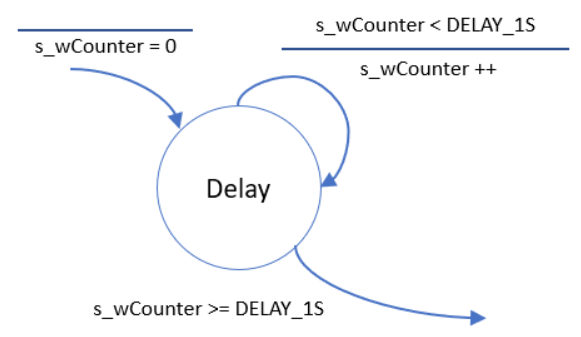
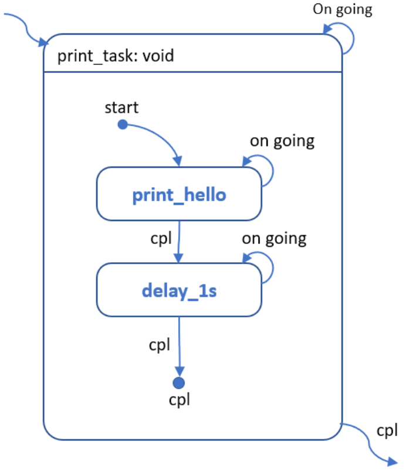

[**Practical UML Statecharts in C/C++**](https://www.state-machine.com/category/books)  
[**Practical Statecharts in C/C++**](https://www.state-machine.com/category/books)  


  
  
  
  
  
  
  
  
  
  
  

- Implementation
  
  
  
```
Table-Driven FSM	2D array [state][event] = transition
Function Pointer	Per-state handler functions
Macro-Based DSL	X-macro generates code from spec

+=====================================================================================+
|                    THREE FSM APPROACHES COMPARISON                                  |
+=====================================================================================+

                        TABLE-DRIVEN         FUNCTION POINTER       MACRO DSL
+-------------------+--------------------+---------------------+--------------------+
| Single Source of  | Transition table   | Handler functions   | TRANSITIONS macro  |
| Truth             | (2D array)         | (1D array)          | (X-macro)          |
+-------------------+--------------------+---------------------+--------------------+
| Transition        | One struct per     | Switch-case inside  | One line per       |
| Visibility        | cell, all visible  | each handler        | transition         |
+-------------------+--------------------+---------------------+--------------------+
| Complex Logic     | Limited (action    | Unlimited (full     | Limited (action    |
| Support           | function only)     | code in handler)    | function only)     |
+-------------------+--------------------+---------------------+--------------------+
| Guard Conditions  | Needs extra field  | Natural if/else     | Needs extra macro  |
+-------------------+--------------------+---------------------+--------------------+
| Unit Testing      | Test engine only   | Test each handler   | Test engine only   |
+-------------------+--------------------+---------------------+--------------------+
| Documentation     | Manual sync        | Manual sync         | Auto-generated!    |
+-------------------+--------------------+---------------------+--------------------+
| Learning Curve    | Low                | Low                 | Medium (macros)    |
+-------------------+--------------------+---------------------+--------------------+
| Best For          | Simple, uniform    | Complex, varied     | Stable, documented |
|                   | transitions        | per-state logic     | FSMs               |
+=====================================================================================+

```
## 三种方案各有适用场景：

### 表驱动：适合转换规则统一、逻辑简单的场景，易于理解和验证
	转换规则集中在一个二维表中，一目了然
	添加新状态只需在表中加一行
	结果处理逻辑集中在 switch 中，避免重复
	易于自动生成文档和测试用例

### 函数指针：适合每个状态有复杂独立逻辑、需要单元测试的场景
	每个状态转换有复杂的独立逻辑
	需要独立进行单元测试
	愿意接受更多的代码量换取更清晰的职责分离

### 宏DSL：适合规格稳定、需要自动生成文档的场景，团队需熟悉宏技术
	追求极致的代码简洁和自文档化
	愿意接受宏的复杂性
	需要从代码自动生成状态图文档


## 如何理解状态
1. 尝试做一件事情，这件事情不是每次去做就一定会成功，每次尝试都有可能产生至少2种以上的结果，那么针对这件事情的尝试就应该单独划分为一个状态
	1.一件事情你要不停的尝试才有可能成功
	2.每次做都可能会产生2个以上的结果

`extern bool serial_out(uint8_t chByte);`


- Concepts
	- 状态(所有的箭头我们都称之为“跃迁”，即从当前状态跳转到箭头所指向的目标状态)
	- 跃迁
		- 扇入
		- 扇出
		- 自返


2. 如何只是单纯的在等待某一个事情发生，或者等待某一个结果，这个结果由2个以上的返回值组成等等，那么这个等待行为可以单独作为一个状态
`int32_t get_sensor_voltage(void);`


### 状态的跃迁
- 所有的神奇都在状态跃迁上
	跃迁不是无条件的，也不允许无条件——换句话说，每个跃迁都必须有一个条件

	1. 一个状态所有的跃迁条件必须是彼此“互斥”的、唯一的；
	2. 所有的跃迁必须能覆盖一个状态机所有可能的情况——绝不允许出现漏网之鱼，否则一旦没有被覆盖的情况出现就有可能导致整个状态机的行为存在“不确定性”
	3. 跃迁是个瞬间的行为，你只能认为当条件满足时跃迁的行为就像白驹过隙一样一下就做完了



- 状态机的起点和终点


一个状态机可以没有终点，但一定有一个起点，我们称之为 start (习惯用一个黑色的实心小圆点来表示)，start 不仅是状态机的起点，由一个跃迁来连接它和第一个状态；start 还是“兼任” 这一跃迁的条件

虽然每个状态机只有一个start点，但却可以拥有0个到多个cpl点。一旦状态机跃迁到了cpl点，这就意味着当前状态机结束了，下次再执行状态机就自动从start点开始了。

### 示例
`serial_out("hello")`
  
  

### 状态机调用子状态机
  

- 通过对已有的状态机进行“搭积木”的方式构建新的状态机 (考虑到任何一个状态机其实都可以在未来被其它状态机调用，我们实际操作上会把每一个状态机都按照子状态机的格式进行绘制)



## 关于状态机的几个注意点
- 状态机的翻译方式众多
- 不同翻译方式在代码的行为特性上天壤之别
- 抛开具体翻译方式谈状态机特性是没有意义的

## 状态机的翻译
- 示例1

### 实现方式1(阻塞)
```c
#include <stdbool.h>
#include <stdint.h>

void print_hello(void)
{
	//! 对应 start部分
	uint8_t *s_pchSrc = "Hello";

	do {
		//! 对应 Print Hello 状态
		while(!serial_out(*s_pchSrc));

		//! serial_out返回值为true的状态迁移
		s_pchSrc++;

		//! 对应 "Is End of String"状态
		if (*s_pchSrc == '\0') {
			//! true分支，结束状态机
			return ;
		}
		//! false分支，跳转到 "Print Hello" 状态
	} while(true);
}
```

### 实现方式2(非阻塞)
```c
#include <stdbool.h>
#include <stdint.h>

typedef enum {
	fsm_rt_err = -1,
	fsm_rt_on_going = 0,
	fsm_rt_cpl = 1,
} fsm_rt_t;

#define PRINT_HELLO_RESET_FSM() \
	do {s_tState = START;} while(0)

fsm_rt_t print_hello(void)
{
	static enum {
		START = 0,
		PRINT_HELLO,
		IS_END_OF_STRING,
	} s_tState = {START};

	static const uint8_t *s_pchSrc = NULL;

	switch (s_tState) {
		case START:
			//! 这个赋值写法只在嵌入式环境下“可能”是安全的
			s_pchSrc = "Hello world";
			s_tState++;
			//break;
		case PRINT_HELLO:
			if (!serial_out(*s_pchSrc)) {
				break;
			};
			s_tState = IS_END_OF_STRING;
			s_pchSrc++;
			//break;
		case IS_END_OF_STRING:
			if (*s_pchSrc == '\0') {
				PRINT_HELLO_RESET_FSM();
				return fsm_rt_cpl;
			}
			s_tState = PRINT_HELLO;
			break;
	}

	return fsm_rt_on_going;
}
```

- 裸机思维(傻孩子)系列
[从零开始的状态机漫谈1](https://aijishu.com/a/1060000000122957)  
[从零开始的状态机漫谈2](https://aijishu.com/a/1060000000185409)  
[从零开始的状态机漫谈3](https://aijishu.com/a/1060000000187948)  
[从零开始的状态机漫谈4](https://aijishu.com/a/1060000000241386)  
[]()  


[Finite State Machine Designer](https://madebyevan.com/fsm/)  
[Finite States Machines (in C)](https://dev.to/rdentato/finite-states-machines-in-c-129n)  
[fsm](https://github.com/rdentato/fsm)  
[C_StateMachine](https://github.com/endurodave/C_StateMachine/tree/master)  
[]()  
[]()  
[]()  