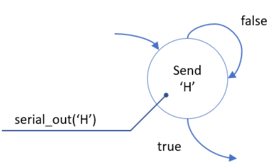
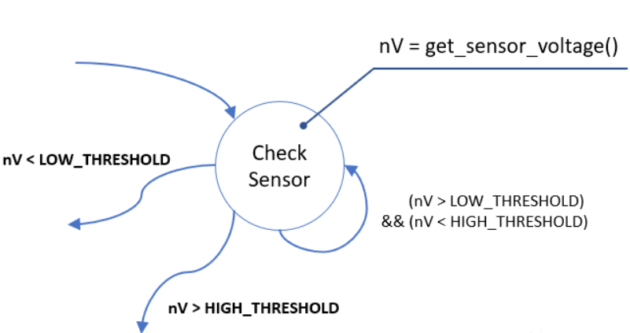
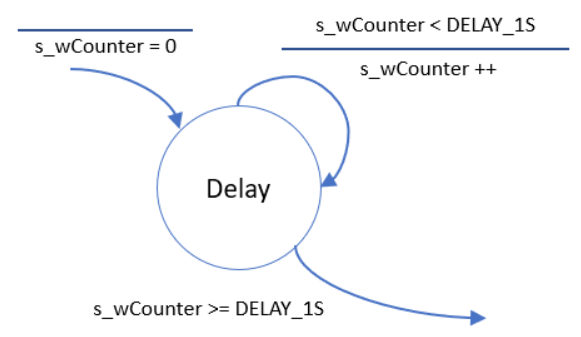
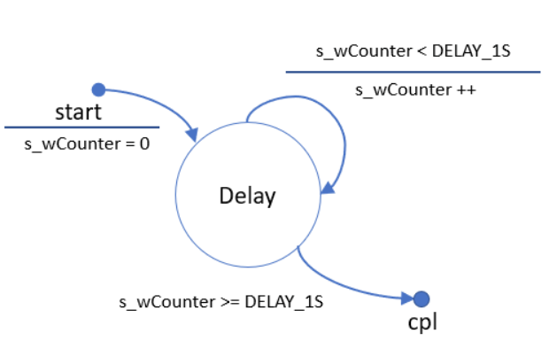
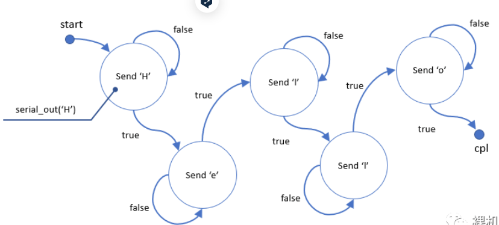
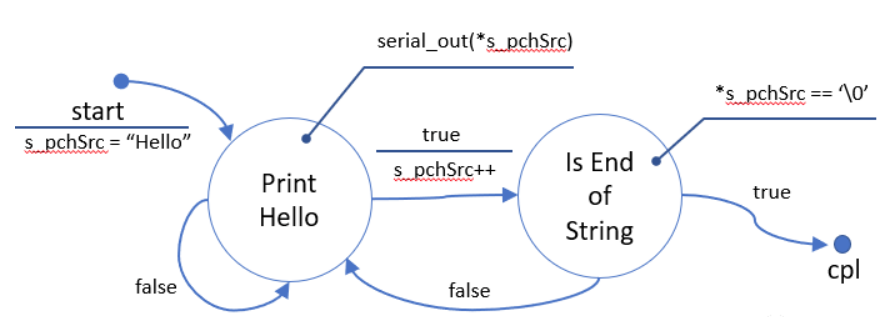
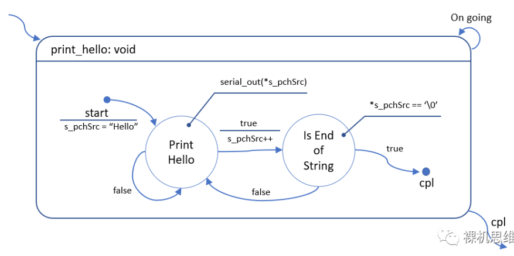
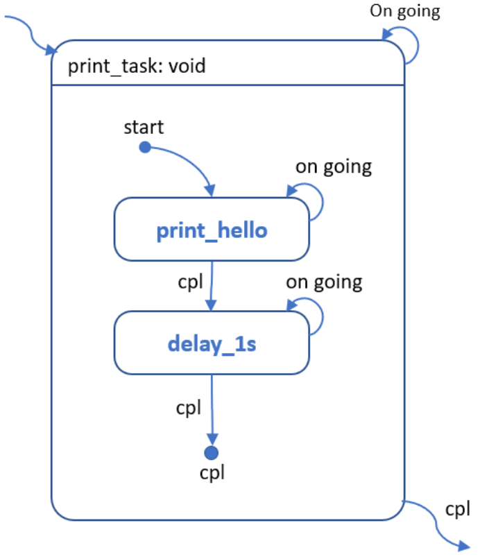
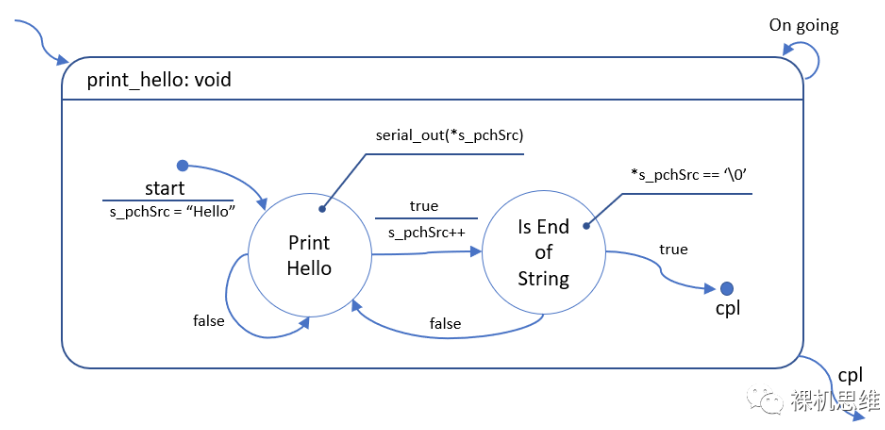

[**Practical UML Statecharts in C/C++**](https://www.state-machine.com/category/books)  
[**Practical Statecharts in C/C++**](https://www.state-machine.com/category/books)  


  
  
  
  
  
  
  
  
  
  
  


# 状态机
## 状态
### 状态的定义
1. 假设尝试做一件事情，每次尝试都有可能产生至少2中以上的结果，那么针对这件事情的尝试就应该单独划分为一个状态
	一件事情要不停的尝试才可能成功
	每次尝试都可能会产生2个以上的结果
	示例
		`extern bool serial_out(uint8_t chByte);`
		
2. 假设只是单纯的在等待某一个事情发生，或者等待某一个结果---这个结果由2个以上的返回值组成等等，那么这个等待行为可以单独作为一个状态
	示例
		函数`get_sensor_volatage()`可以返回某个传感器的电压值；我们设置了上下两个门限，一旦电压超过了任何一个门限，我们就切换到其它状态
		`int32_t get_sensor_voltage(void);`
		

### 状态的表示
- 圆圈表示状态
- 圆圈中心的内容为注释
- 扇入
	从其他转态跃迁到当前状态
- 扇出
	从当前状态跃迁到其他状态
- 自返
	从当前状态扇出后又返回当前状态
- 标注
	可以通过标注的方式添加更详细的注释

### 状态的跃迁
- 每个跃迁都必须有一个条件
	- 跃迁不是无条件的，也不允许无条件
	- 一个状态的所有跃迁条件必须是彼此互斥的，唯一的
	- 所有的跃迁必须能覆盖一个状态机所有可能的情况---绝不允许有漏网之鱼，否则会导致状态机的行为存在不确定性
	- 跃迁是个瞬间行为，可以认为当条件满足时跃迁的行为在瞬间完成
- 
	- 横线上方为跃迁条件，下方为跃迁执行的动作
- 状态机的起点和终点
	- 
		- 状态机的起点和终点用实心原点表示
		- 每个状态机只有1个起点，但可以有多个终点

### 示例
- 使用**serial_out()**发送字符串“**hello**”
	- 
	- 更为通用的方法
		- 

### 子状态机
- 解决状态机调用状态机
- 
	- 子状态机被圆角矩形包裹
	- 子状态机的右上角有一个自返的状态迁移，条件"On going"意味着子状态机正在执行，还未得出结果
	- 子状态机的右下角有一个标记有cpl条件的状态迁移，表示当子状态机内部达到了终点cpl以后，子状态机从这里退出并跃迁到指定的状态
	- 子状态机的标题栏列举了状态机的名称以及传递给当前子状态机的形参列表
- 可以通过对已有的状态机进行“搭积木”的方式构建新的状态机
	- 

## 关于状态机的几个注意点
- 状态机的翻译方式众多
- 不同翻译方式在代码的行为特性上天壤之别
- 抛开具体翻译方式谈状态机特性是没有意义的

## 状态机的翻译
- 示例1

### 实现方式1(阻塞)
```c
#include <stdbool.h>
#include <stdint.h>

void print_hello(void)
{
	//! 对应 start部分
	uint8_t *s_pchSrc = "Hello";

	do {
		//! 对应 Print Hello 状态
		while(!serial_out(*s_pchSrc));

		//! serial_out返回值为true的状态迁移
		s_pchSrc++;

		//! 对应 "Is End of String"状态
		if (*s_pchSrc == '\0') {
			//! true分支，结束状态机
			return ;
		}
		//! false分支，跳转到 "Print Hello" 状态
	} while(true);
}
```

### 实现方式2(非阻塞)
```c
#include <stdbool.h>
#include <stdint.h>

typedef enum {
	fsm_rt_err = -1,
	fsm_rt_on_going = 0,
	fsm_rt_cpl = 1,
} fsm_rt_t;

#define PRINT_HELLO_RESET_FSM() \
	do {s_tState = START;} while(0)

fsm_rt_t print_hello(void)
{
	static enum {
		START = 0,
		PRINT_HELLO,
		IS_END_OF_STRING,
	} s_tState = {START};

	static const uint8_t *s_pchSrc = NULL;

	switch (s_tState) {
		case START:
			//! 这个赋值写法只在嵌入式环境下“可能”是安全的
			s_pchSrc = "Hello world";
			s_tState++;
			//break;
		case PRINT_HELLO:
			if (!serial_out(*s_pchSrc)) {
				break;
			};
			s_tState = IS_END_OF_STRING;
			s_pchSrc++;
			//break;
		case IS_END_OF_STRING:
			if (*s_pchSrc == '\0') {
				PRINT_HELLO_RESET_FSM();
				return fsm_rt_cpl;
			}
			s_tState = PRINT_HELLO;
			break;
	}

	return fsm_rt_on_going;
}
```

- 裸机思维(傻孩子)系列
[从零开始的状态机漫谈1](https://aijishu.com/a/1060000000122957)  
[从零开始的状态机漫谈2](https://aijishu.com/a/1060000000185409)  
[从零开始的状态机漫谈3](https://aijishu.com/a/1060000000187948)  
[从零开始的状态机漫谈4](https://aijishu.com/a/1060000000241386)  
[]()  


[Finite State Machine Designer](https://madebyevan.com/fsm/)  
[Finite States Machines (in C)](https://dev.to/rdentato/finite-states-machines-in-c-129n)  
[fsm](https://github.com/rdentato/fsm)  
[C_StateMachine](https://github.com/endurodave/C_StateMachine/tree/master)  
[]()  
[]()  
[]()  