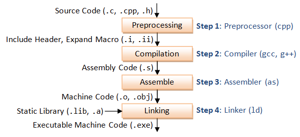

- [[Cross compiling]]
- gcc编译过程
  collapsed:: true
	- 
	- ```bash
	  morrism@PC2886:~$ gcc --help
	  Usage: gcc [options] file
	  Options:
	    -E                       Preprocess only; do not compile, assemble or link.
	    -S                       Compile only; do not assemble or link.
	    -c                       Compile and assemble, but do not link.
	    -o <file>                Place the output into <file>.
	    -v                       verbose display, Display the programs invoked by the compiler.
	    -Wa,<options>            Pass comma-separated <options> on to the assembler.
	    -Wp,<options>            Pass comma-separated <options> on to the preprocessor.
	    -Wl,<options>            Pass comma-separated <options> on to the linker.
	    -Xassembler <arg>        Pass <arg> on to the assembler.
	    -Xpreprocessor <arg>     Pass <arg> on to the preprocessor.
	    -Xlinker <arg>           Pass <arg> on to the linker.
	    -Wall					   This enables all the warnings about constructions that some users consider questionable, 
	    						   and that are easy to avoid (or modify to prevent the warning), even in conjunction with macros.
	    
	  
	  morrism@PC2886:~$ as --help
	  Usage: as [option...] [asmfile...]
	  Options:
	  ......
	    -o OBJFILE              name the object-file output OBJFILE (default a.out)
	  ```
	- ```bash
	  # hello.c
	  #include <stdio.h>
	  
	  int main(void)
	  {
	          printf("hello world\n");
	  
	          return 0;
	  }
	  
	  # 预处理preprocess
	  gcc -E hello.c -o hello.i
	  # 编译compile
	  gcc -S hello.i
	  # 汇编assemble
	  as hello.s -o hello.o
	  # 链接link
	  ld -m elf_x86_64 -dynamic-linker /lib64/ld-linux-x86-64.so.2 -o hello1 /usr/lib/gcc/x86_64-redhat-linux/8/../../../../lib64/crt1.o /usr/lib/gcc/x86_64-redhat-linux/8/../../../../lib64/crti.o /usr/lib/gcc/x86_64-redhat-linux/8/crtbegin.o -L/usr/lib/gcc/x86_64-redhat-linux/8 -L/usr/lib/gcc/x86_64-redhat-linux/8/../../../../lib64 -L/lib/../lib64 -L/usr/lib/../lib64 -L/usr/lib/gcc/x86_64-redhat-linux/8/../../.. -lgcc --as-needed -lgcc_s --no-as-needed -lc -lgcc --as-needed -lgcc_s --no-as-needed /usr/lib/gcc/x86_64-redhat-linux/8/crtend.o /usr/lib/gcc/x86_64-redhat-linux/8/../../../../lib64/crtn.o hello.o -o hello
	  
	  # 执行execute
	  morrism@localhost /tmp/x/dir1 $ ./hello
	  hello world
	  
	  # 手动链接时所依赖的动态库可以通过 gcc -v hello.c -o hello_test来观察"-m elf_x86_64 -dynamic-linker"获得
	  # gcc -v hello.c -o hello1
	  ......
	  COMPILER_PATH=/usr/libexec/gcc/x86_64-redhat-linux/8/:/usr/libexec/gcc/x86_64-redhat-linux/8/:/usr/libexec/gcc/x86_64-redhat-linux/:/usr/lib/gcc/x86_64-redhat-linux/8/:/usr/lib/gcc/x86_64-redhat-linux/
	  LIBRARY_PATH=/usr/lib/gcc/x86_64-redhat-linux/8/:/usr/lib/gcc/x86_64-redhat-linux/8/../../../../lib64/:/lib/../lib64/:/usr/lib/../lib64/:/usr/lib/gcc/x86_64-redhat-linux/8/../../../:/lib/:/usr/lib/
	  COLLECT_GCC_OPTIONS='-v' '-o' 'hello1' '-mtune=generic' '-march=x86-64'
	   /usr/libexec/gcc/x86_64-redhat-linux/8/collect2 -plugin /usr/libexec/gcc/x86_64-redhat-linux/8/liblto_plugin.so -plugin-opt=/usr/libexec/gcc/x86_64-redhat-linux/8/lto-wrapper -plugin-opt=-fresolution=/tmp/ccg9cror.res -plugin-opt=-pass-through=-lgcc -plugin-opt=-pass-through=-lgcc_s -plugin-opt=-pass-through=-lc -plugin-opt=-pass-through=-lgcc -plugin-opt=-pass-through=-lgcc_s --build-id --no-add-needed --eh-frame-hdr --hash-style=gnu -m elf_x86_64 -dynamic-linker /lib64/ld-linux-x86-64.so.2 -o hello1 /usr/lib/gcc/x86_64-redhat-linux/8/../../../../lib64/crt1.o /usr/lib/gcc/x86_64-redhat-linux/8/../../../../lib64/crti.o /usr/lib/gcc/x86_64-redhat-linux/8/crtbegin.o -L/usr/lib/gcc/x86_64-redhat-linux/8 -L/usr/lib/gcc/x86_64-redhat-linux/8/../../../../lib64 -L/lib/../lib64 -L/usr/lib/../lib64 -L/usr/lib/gcc/x86_64-redhat-linux/8/../../.. /tmp/ccq6diGp.o -lgcc --as-needed -lgcc_s --no-as-needed -lc -lgcc --as-needed -lgcc_s --no-as-needed /usr/lib/gcc/x86_64-redhat-linux/8/crtend.o /usr/lib/gcc/x86_64-redhat-linux/8/../../../../lib64/crtn.o
	  COLLECT_GCC_OPTIONS='-v' '-o' 'hello1' '-mtune=generic' '-march=x86-64'
	  
	  ```
- `__attribute__`编译指令
	- 关键字`__attribute__`用来为变量，函数，或者结构体，联合体等指定特殊的编译属性
	- 语法格式
		- `__attribute__ ((attribute-list))`
			- attribute-list是由逗号分割的一系列属性的列表
	- 示例
	  collapsed:: true
		- section属性
		- ```c
		  # test.c
		  #include <stdio.h>
		  #include <string.h>
		  
		  typedef void(*func)();
		  
		  void func_a()
		  {
		      printf("%s:%d\n", __func__, __LINE__);
		  }
		  
		   void func_b()
		   {
		       printf("%s:%d\n", __func__, __LINE__);
		   }
		  
		   static func * const fn_a __attribute__((used, section("init"))) = (func * const)&func_a;
		   static func * const fn_b __attribute__((used, section("init"))) = (func * const)&func_b;
		  
		   int main()
		   {
		       extern const func __start_init;
		       extern const func __stop_init;
		  
		       func *f = (func *)&__start_init;
		  
		       while (f < (func *)&__stop_init) {
		           (*f++)();
		       }
		  
		       return 0;
		   }
		  
		  # __start_init 和 __stop_init 由链接器自动生成的，规则是在 section 名前加上 __start_ 和 __stop_
		  
		  gcc -Wall -O2 test.c && ./a.out
		  func_b:13
		  func_a:8
		  
		  ```
	-
- 参考文档
	- [GCC online documentation](https://gcc.gnu.org/onlinedocs/)
		- ### Predefined Macros
			- [Standard Predefined Macros](https://gcc.gnu.org/onlinedocs/gcc-13.2.0/cpp/Standard-Predefined-Macros.html)
			- [Common Predefined Macros](https://gcc.gnu.org/onlinedocs/gcc-13.2.0/cpp/Common-Predefined-Macros.html)
			- [System-specific Predefined Macros](https://gcc.gnu.org/onlinedocs/gcc-13.2.0/cpp/System-specific-Predefined-Macros.html)
	- [Using the GNU Compiler Collection](https://gcc.gnu.org/onlinedocs/gcc/index.html#SEC_Contents)
	- [The GNU Assembler](https://web.mit.edu/gnu/doc/html/as_toc.html)
	- [man gcc](https://man7.org/linux/man-pages/man1/gcc.1.html)
	- [Common-Function-Attributes](https://gcc.gnu.org/onlinedocs/gcc/Common-Function-Attributes.html#Common-Function-Attributes)
	- [Attribute Syntax](https://gcc.gnu.org/onlinedocs/gcc/Attribute-Syntax.html#Attribute-Syntax)
	- [The GNU linker](https://sourceware.org/binutils/docs-2.37/ld.pdf)
-
- 交叉编译时可以通过指定 [[sysroot]]目录来指定头文件和库文件的查找目录