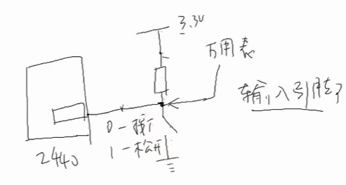
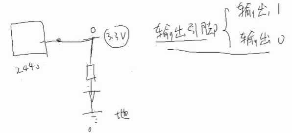
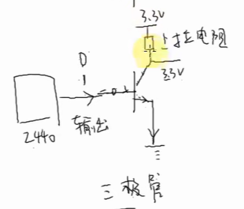
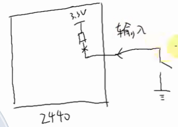
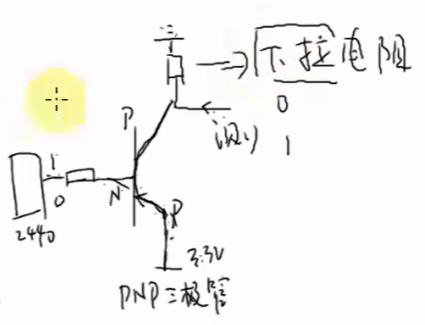
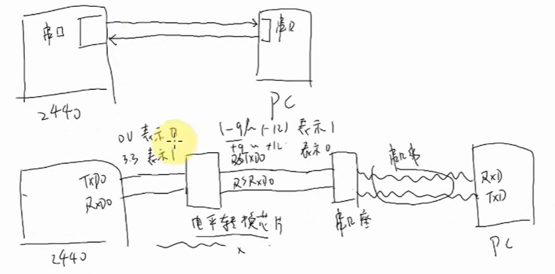
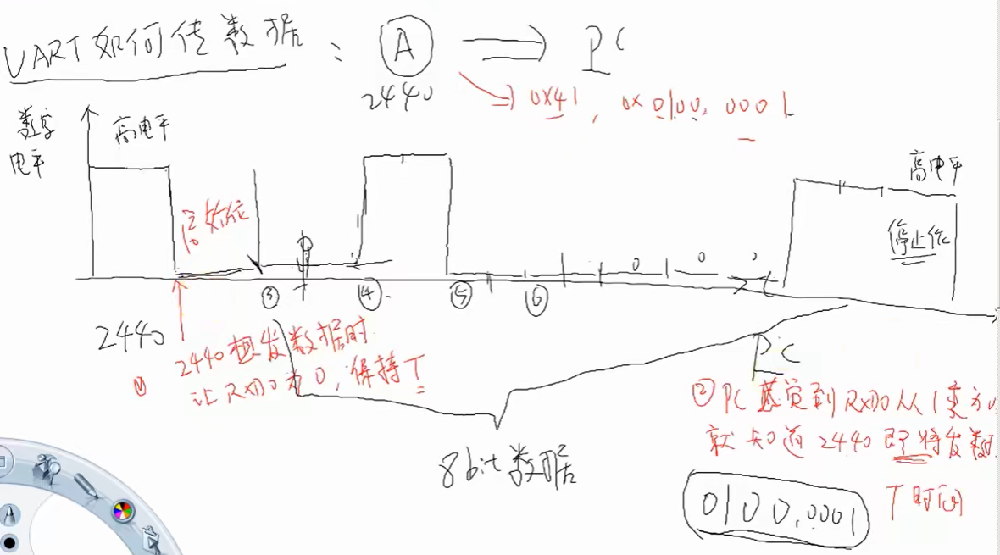

- GPIO
  collapsed:: true
	- 输入引脚
		- 
	- 输出引脚
		- 
	- 上拉电阻
		- 在某些场景下，如果没有上拉电阻的话，节点处于悬空状态，电压无法确定，如下图所示，GPIO用做输出功能时，加上上拉电阻后，节点的电压是确定的，要么为0要么为1
			- 
		- 芯片内部可能存在PULL UP使能的开关来使能或关闭上拉电阻的功能，如下图所示，当GPIO引脚用做输入功能时，需要使能GPIO引脚的PULL UP功能，用来读取按键的状态（按键按下为0，否则为1），同理，上拉电阻用来确定状态，否则悬空状态的GPIO引脚的电压无法确定
			- 
	- 下拉电阻
		- 如下图所示的PNP型三极管，下拉电阻同样同来确定节点的电压状态，当GPIO引脚输出1时，测试点电压被拉低为0，当GPIO输出低电平时，测试点电压为3.3V
		- 
	- 中断引脚
		- 有输入功能
		- 可以中断CPU
- 协议类接口
	- 双方约定信号的协议
		- 你说的别人能听的懂
	- 双方满足时序要求
		- 你的语速，要让别人接受
	- UART
	  collapsed:: true
		- 
			- 引脚电压不同，因此需要电平转换芯片，用来提高信号的抗干扰性
		- 以2440发送数据为例说明UART的工作原理
			- TX默认为高电平
			- 2440需要发送数据时，TX输出低电平并保持时间T（起始位）
			- PC端的RX从高电平变为低电平，即从1变为0，PC端感知到2440在T时间后即将发送数据（即将发送的时间T由波特率决定，例如`1/115200`）
			- 假设2440需要发送额数据为0x41，则TX先发送比特0，即TX为低电平并维持时间T，之后发送比特1，即TX为高电平并维持时间T
			- PC通常会在T+0.5T的时间间隔对2440 TX发送的来的信号BIT 0进行检测，之后以间隔T对之后的BIT数据进行检测，从而得到2440发送的8 BIT数据为0x41
			- 2440发送完8 BIT数据后，需要恢复到原来的状态，即保持高电平至少一个时间T（停止位）
			- 
		- 通过设置UART控制器的寄存器，可以使得上述数据发送过程自动进行
	- [[i2c]]
		-