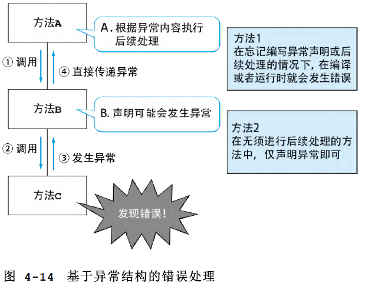
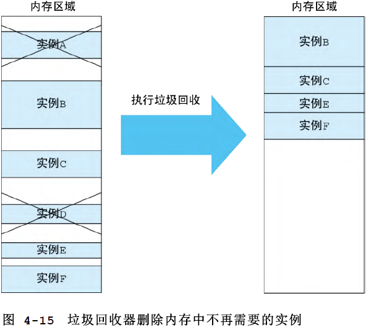

- 面向对象的全貌和发展过程
  collapsed:: true
	- 
	- OOP 使得大规模软件的可重用构件群的创建成为可能，这些被称为^^类库或者框架^^。创建可重用构件群时使用固定的设计思想被提炼为^^设计模式^^。使用图形来表示利用 OOP 结构创建的软件结构的方法称为统一建模语言（Unified Modeling Language，^^UML^^）。在此基础上，还出现了将 OOP 思想应用于^^上流工程的建模^^，以及用于顺利推进系统开发的^^开发流程^^。
- 基本概念
	- ^^类^^class是面向对象的最基本的结构，与其对应的概念是^^实例^^instance。类指类型，实例指具体的物，类和实例相当于集合和元素
	- 方法
	- 消息传递（类的实例（对象）调用类中定义的方法）
	- 多态polymorphism
		- 让向相似的类发送消息的方法通用的结构，发送消息时不关心对方具体是哪一个类的实例的结构
	- 继承
		- 系统地整理物的种类的共同点和不同点的结构，整理相似事物的类的共同点和不同点的结构，继承相当于全集和子集
- 类和实例这种最基本的结构，在面向对象和现实世界中也存在很大的不同
	- 在面向对象和现实世界中，对类的定位有很大不同。在面向对象中，类是用来创建实例的结构，实例只属于一个类。而在现实世界中，首先有具体的物（实例），然后再根据观察该物的人的立场和兴趣而采用不同的基准进行分类（类）。
	- 此外还存在其他不同之处。在面向对象的世界中，实例固定属于唯一的类，即使经过一段时间，也无法变为属于其他类。由婴儿类创建的实例无论经过多少年，也无法成长为青年、中年和老年。
	- 现实世界的人和物并不只是根据消息来行动
	- 软件并不会直接表示现实世界，几乎所有的软件都只能涵盖人类工作的一部分
- 高级语言的发明使程序更加接近人类
  collapsed:: true
	- 
	- 机器语言
	- 汇编语言
	- 高级语言
	- 结构化编程
		- 提倡只使用循序、选择和重复这三种结构来表达逻辑
		- 子程序被用于将在程序中的多个位置出现的相同命令汇总到一处，以减小程序的大小，提高编程的效率
		- 只是简单地将相同的命令语句汇总到一处还不够，为了强化程序的可维护性，提高子程序的独立性也是很重要的。
		- 提高子程序独立性的方法是减少在调用端（主程序）和子程序之间的共享信息，即全局变量，具体措施
			- 局部变量
			- 按值传递
		- 结构化编程有两个无法解决的问题，那就是全局变量问题和可重用性差的问题
			- 
		- 软件的进化方向演变为重视可维护性和可重用性
- 面向对象编程技术：去除冗余、进行整理
  collapsed:: true
	- OOP 具有不使用全局变量的结构
	- OOP 具有除公用子程序之外的可重用结构
	- ^^类^^的功能是汇总、隐藏和“创建很多个”
	  collapsed:: true
		- “汇总”子程序和变量
		  collapsed:: true
			- 汇总和整理操作本身就是有价值的(。如果使用 OOP 平均在每个类中汇总 10 个子程序，那么类的总数就比子程序的总数减少 1 位)
				- 
				- 构件的数量会减少
				- 方法（子程序）的命名变得轻松
				- 方法（子程序）变得容易查找
		- “隐藏”只在类内部使用的变量和子程序
			- 将实例变量的访问范围仅限定在类中
			- 如果需要可以将方法声明为显示公开
			- 对其他类隐藏类中定义的变量和方法（子程序），在写程序时就可以不使用全局变量
		- 从一个类“创建很多个”实例
			- 一旦定义了类，在运行时就可以由此创建很多个实例
			- 通过“指定实例，调用方法”，就可以指定哪个实例变量是处理对象
		- 实例变量是限定访问范围的全局变量
			- 能够隐藏，让其他类的方法无法访问
			- 实例在被创建之后一直保留在内存中，直到不再需要
			- 实例变量融合了局部变量能够将影响范围局部化的优点以及全局变量存在期间长的优点。我们可以将实例变量理解为存在期间长的局部变量或者限定访问范围的全局变量
			- 
	- ^^多态^^实现了调用端公用化处理
	  collapsed:: true
		- 公用主程序将被调用端的逻辑汇总为一个逻辑，而多态则相反，它统一调用端的逻辑
			- 
		- 为了使用多态，被调用的方法的参数和返回值的形式必须统一
		- 
		-
	- ^^继承^^用来去除类的重复定义
	  collapsed:: true
		- 继承是将类定义的共同部分汇总到另外一个类中，并去除重复代码的结构
		- 继承就是“将类的共同部分汇总到其他类中的结构”。通过利用该结构，我们可以创建一个公用类来汇总变量和方法，其他类则可以完全借用其定义
			- {:height 394, :width 640}
	- 声明继承也就是声明使用多态，在声明继承的子类中，为了统一方法调用方式，继承的方法的参数和返回值类型必须与超类一致
		- 
	- 
	- OOP 中可以将类作为类型进行处理
		- 作为类型的类与数值型、字符串型一样，可以在变量定义、方法的参数以及返回值声明等多处进行指定
	- 包
	  collapsed:: true
		- 包是进一步对类进行汇总的结构，包只是进行汇总的容器，它不同于类，不能定义方法和实例变量，其作用类似于文件系统中的目录
			- 
		-
	- 异常
	  collapsed:: true
		- 采用与返回值不同的形式，从方法返回特殊错误的结构
		- 传统的子程序结构中，通常使用错误码来处理这种情况，但是这种方法存在两个问题
			- 需要在应用程序中执行错误码的判断处理。如果忘记编写判断处理，或者弄错值，那么在发生故障时就很难确定具体原因。另外，在添加、删除错误码的值的情况下，程序员需要亲自确认所有相关的子程序来改写
			- 判断错误码的相同逻辑在子程序之间是连锁的。通常在调用端的子程序中必须编写判断错误码的值的逻辑。另外，当调用端的子程序中无法执行错误的后续处理时，就会返回同样的错误码。像这样，如果错误码的判断处理在整个应用程序中连锁，那么程序逻辑就会变得很冗长
			- 
			- 
	- 垃圾回收
	  collapsed:: true
		- 由系统自动进行删除实例的处理的结构
			- 
- OOP 程序的运行机制
  collapsed:: true
	- 程序运行方式
		- 编译器
		  collapsed:: true
			- 将程序中编写的命令转换为计算机能够理解的机器语言之后再运行的方式。将命令转换为机器语言的程序称为编译器
			- 优点是运行效率高
		- 解释器
		  collapsed:: true
			- 将源代码中编写的程序命令边解释边运行的方式。这种方式能读取源代码并立即运行，因此不需要编译器。如果程序有语法错误，运行时就会发生错误
			- 优点是可以立即运行
		- {:height 527, :width 634}
		- 中间代码方式
		  collapsed:: true
			- 首先使用编译器将源代码转换为不依赖于特定机器语言的中间代码，然后使用专门的解释器来解释中间代码并运行
				- 
			- 汲取两种方式的优点。既可以将同一个程序发布到不同的机器上，又可以发扬编译器运行效率高的优点，采用中间代码方式，同一个程序可以在不同的运行环境中高效地运行
			- 由于^^中间代码的命令是不依赖于特定运行环境的形式，所以 CPU 无法直接读取并运行^^。因此，我们需要一种解释中间代码并将其转换为 CPU 能够直接运行的机器语言的结构。这种结构一般被称为^^虚拟机^^
				- 
			-
		- CPU 同时运行多个线程
		  collapsed:: true
			- 线程是程序的运行单位，进程也是一种运行单位，进程表示的单位比线程大，一个进程可以包含多个线程
			- 能够同时运行多个线程的环境称为^^多线程环境^^。这种多线程功能基本上都是作为操作系统的功能提供的
		- 内存使用方式
		  collapsed:: true
			- 静态区
				- 静态区从程序开始运行时产生，在程序结束前一直存在
				- 静态变量，即全局变量和将程序命令转换为可执行形式的代码信息就存储在该区域中
			- 堆区
				- 堆区是程序运行时动态分配的内存区域
				- 由于在程序开始运行时预先分配大量的内存区域，所以命名为堆区，一般由操作系统或虚拟机提供管理功能。堆区供多个线程共同使用
			- 栈区
				- 用于线程的控制的内存区域，堆区供多个线程共同使用，而栈区则是为每个线程准备一个
				- 栈区是用于控制子程序调用的内存区域，存储着子程序的参数、局部变量和返回位置等信息
			- 每个类只加载一个类信息
				- 加载类信息的时间点
					- 预先整体加载所有类信息（C++）
					- 在需要时依次将类信息加载到内存中（Jave，.NET）
			- 每次创建实例都会使用堆区
			  collapsed:: true
				- 
			- 多态让不同的类看起来一样
				- 具体的实现方法有很多种，最典型的是方法表，也称为虚函数表
				  collapsed:: true
					- 首先在各个类中准备一个方法表。该方法表中依次存储着各个类定义的方法在内存中展开的位置，即方法的指针
						- 
					- 类继承的信息在内存中的表示
						- 
				- 孤立的实例由垃圾回收处理
					- 垃圾回收是由一个被称为垃圾回收器的专用程序执行的，该程序由编程语言的运行环境提供，并作为独立的线程运行。该程序会在适当的时间点确认堆区的状态，当发现空内存域变少时，就会启动垃圾回收处理
					- 垃圾回收器是怎么判断实例不被需要了呢
						- 发现孤立的实例
						- 栈区和方法区中存储着应用程序处理所需的信息，因此这里引用的实例不会成为垃圾回收的对象。也就是说，栈区和方法区是网络的“根部“，脱离网络关系的实例，即从根部无法到达的实例，就是垃圾回收的对象
							- 
		- OOP 带来的软件重用和思想重用
		  collapsed:: true
			- 
			- 类库
			  collapsed:: true
				- 集合了很多具有通用功能的类
				- 
				- 
			- 框架
			  collapsed:: true
				- 使用特定编程语言编写的具有特定目的的可重用构件群，用于特定目的的应用程序的半成品。
				- 从应用程序中的使用方法上来说，并不是像传统的函数库那样简单地进行调用，而是从框架来调用应用程序。也就是说，在框架端预先提供基本的控制流程，在应用程序中嵌入个别的处理
				- 
			- 组件
			  collapsed:: true
				- 粒度比 OOP 的类大
				- 提供的形式是二进制形式，而不是源代码形式
				- 提供时包含组件的定义信息
				- 功能的独立性高，即使不了解内部的详细内容，也可以使用
			- 设计模式
				- 不依赖于编程语言和应用程序的应用领域，对在各种情况下反复出现的类结构进行命名，形成模式
			-
			-
	-
- UML:查看无形软件的工具
  collapsed:: true
	- 表示软件功能和结构的图形的绘制方法
	- UML 有 13 种图形
	- UML 的使用方法
		- 表示OOP 程序的结构和动作
		- 表示归纳整理法的成果
		- 表示面向对象无法表示的信息
- 建模:填补现实世界和软件之间的沟壑
  collapsed:: true
	- 现实世界和软件之间存在沟壑
	- 计算机擅长固定工作和记忆工作
	- 通过业务分析、需求定义和设计来填补沟壑
		- 推进软件开发3个阶段的工作
			- 第 1 阶段（业务分析）：整理现实世界的工作的推进方法
			- 第 2 阶段（需求定义）：确定交给计算机的作业范围
			- 第 3 阶段（设计）：确定软件的编写方法
	- 建模的目的
	  collapsed:: true
		- 业务分析：直接把握现实世界的情形
		- 需求定义：考虑计算机的性质，确定让计算机承担的工作范围
		- 设计： 考虑硬件性能、操作系统和中间件的特性以及编程语言的表现能力等，确定软件结构
	- 建模举例：对图书馆的借阅业务进行建模
		- 业务分析需要表现人们在引入计算机之前进行的工作的情况
		  collapsed:: true
			- 用活动图来表示工作流程
				- 活动图可以帮助我们理解实际的工作情形
				- 
				-
		- 需求定义是查看活动图，找出计算机擅长的记忆工作和固定工作，从而定义交给计算机的工作
		  collapsed:: true
			- 使用用例图，可以简洁地表示交给计算机的工作
				- 
		- 引入计算机之后的借阅业务流程的活动图
		  collapsed:: true
			- 在确定计算机的工作范围之后，我们再来改写前面在进行业务分析时画的活动图
				- 
				- 通过将藏书和用户信息记录在计算机中，我们可以把大部分搜索藏书和处理借阅的工作交给计算机。不过，像站着阅读、决定借书和取书等工作是无法交给计算机处理的。从该示例中也可以看出，业务应用程序通常只将现实世界中的一部分工作交给计算机
		- 用概念模型表示图书馆系统的信息
			- 类图可以表示集合与其元素之间的关系，被用于表示所管理的信息的结构
				- 
		- 
- 面向对象设计：拟人化和职责分配
  collapsed:: true
	- 相比运行效率，现在更重视可维护性和可重用性
	- 易于维护和重用的软件结构的目标
		- 去除重复
		- 提高构件的独立性
			- 内聚度是评判软件构件所提供的功能互相结合的紧密程度的标准，结合得越紧密，内聚度越高，设计就越好
			- 耦合度是评判多个软件构件之间互相依赖的程度的标准，依赖程度越低，耦合度越低，设计就越好
			- 
			- 针对类和方法的几个提高构件独立性的具体窍门
				- 起一个能用一句话表示类功能的的名称
				- 创建许多秘密，将向外部公开的信息控制在最小限度
				- 创建得小一点，类和方法要尽可能地小
		- 避免依赖关系发生循环
- 函数式语言是怎样工作的
	- 函数式语言的 7 个特征
		- 特征 1：使用函数编写程序
		- 特征 2：所有表达式都返回值
		- 特征 3：将函数作为值进行处理
		- 特征 4：可以灵活组合函数和参数
		- 特征 5：没有副作用
		- 特征 6：使用分类和递归来编写循环处理
		- 特征 7：编译器自动进行类型推断