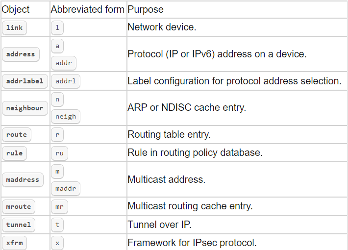
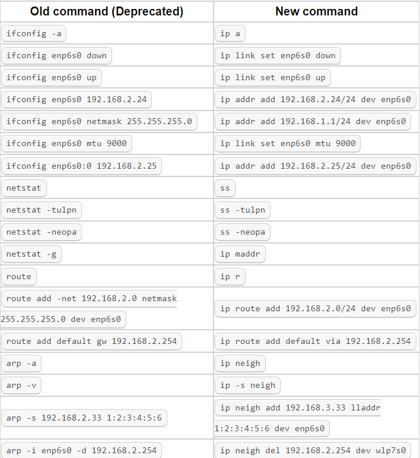

- 命令语法
	- {:height 518, :width 710}
-
- 命令示例
	- 
-
- 参考文档
	- [Guide to IP Layer Network Administration with Linux](http://linux-ip.net/html/index.html)
	- [IP Command](https://www.techplayon.com/ip-command-for-red-hat-enterprise-linux/)
	- [man ip](https://man7.org/linux/man-pages/man8/ip.8.html)
	-