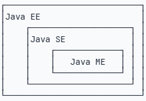
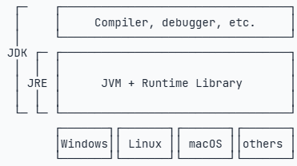

[Java Documentation](https://docs.oracle.com/en/java/)  
[**Java Programming**](https://www3.ntu.edu.sg/home/ehchua/programming/#Java)  
[The Java Tutorials](https://docs.oracle.com/javase/tutorial/)  
[The Java Tutorials](https://docs.oracle.com/javase/tutorial/java/)  
[Classes and Objects](https://docs.oracle.com/javase/tutorial/java/javaOO/index.html)  
[A Guide to Java Enums](https://www.baeldung.com/a-guide-to-java-enums)  
[Java - The Complete Reference](https://github.com/Nitin96Bisht/Java-Books/blob/master/Java%20-%20The%20Complete%20Reference%20-%2011%20Edition.pdf)  
[An Introduction to Object-Oriented Programming](https://books-library.website/files/download-pdf-ebooks.org-1494095049Ne2H5.pdf)  
[JavaSE教程](https://dunwu.github.io/javacore/pages/69d2f8/)  
[Java 基础 - 面向对象](https://pdai.tech/md/java/basic/java-basic-oop.html)  
[]()  
[]()  
[]()  
[]()  
[]()  
[]()  
[]()  
[]()  
[]()  

[ELEMENTS OF PROGRAMMING INTERVIEWS in Java](https://inprogrammer.com/wp-content/uploads/2022/01/Adnan-Aziz-Tsung-Hsien-Lee-Amit-Prakash-Elements-of-Programming-Interviews-in-Java_-The-Insiders-Guide-2016-CreateSpace-Independent-Publishing-Platform-libgen.lc_.pdf)  

[Java 教程（廖雪峰）](https://liaoxuefeng.com/books/java/introduction/index.html)  
[JavaPark](https://github.com/cunyu1943/JavaPark)  

[Package java.util](https://docs.oracle.com/javase/7/docs/api/java/util/package-summary.html)  
[Java-Projects-Collections](https://github.com/kishanrajput23/Java-Projects-Collections/tree/main)  

[Kotlin Programming: The Big Nerd Ranch Guide Book](https://lmsspada.kemdiktisaintek.go.id/pluginfile.php/751912/course/section/65846/kotlin-programming-the-big-nerd-ranch-guide-1nbsped-013516236x_compress%20%281%29.pdf)  

[Effective Java 3rd Edition](https://kea.nu/files/textbooks/new/Effective%20Java%20%282017%2C%20Addison-Wesley%29.pdf)  


## Jave Editions
1. Java SE: Standard Edition
2. Java EE: Enterprise Edition
3. Java ME: Micro Edition

  

## Java Concepts
1. JDK: Java Development Kit
2. JRE: Jave Runtime Environment



- JDK binary commands
	- java
	- javac
	- jar
	- javadoc
	- jdb

(source code)      compile           (byte code)        execute
Hello.java       ----------->        Hello.class    ------------>       (Run on JVM)

## OOP
[Object-Oriented-Programming Concepts in Java](https://www.baeldung.com/java-oop)  
[Abstract Classes in Java](https://www.baeldung.com/java-abstract-class)  
[Java Interfaces](https://www.baeldung.com/java-interfaces)  
[]()  
[]()  
[]()  
[]()  
[]()  
[]()  

```java
// class
public class Car {
    // member fields
    private String type;
    private String model;
    private String color;
    private int speed;

    // constructor
    public Car(String type, String model, String color) {
        this.type = type;
        this.model = model;
        this.color = color;
    }

    // member methods
    public int increaseSpeed(int increment) {
        this.speed = this,speed + increment;
        return this.speed;
    }

    // ....
}

// object
Car veyron = new Car("Bugatti", "Veyron", "crimson");
Car corvette = new Car("Chevrolet", "Corvette", "black");

// abstraction
If we think about a typical computer, one can only see the external interface, which is most essential for interacting with it, while internal chips and circuits are hidden from the user.

In OOP, abstraction means hiding the complex implementation details of a program, exposing only the API required to use the implementation. In Java, we achieve abstraction by using interfaces and abstract classes.

// encapsulation
Encapsulation is hiding the state or internal representation of an object from the consumer of an API and providing publicly accessible methods bound to the object for read-write access. This allows for hiding specific information and controlling access to internal implementation.

For example, member fields in a class are hidden from other classes, and they can be accessed using the member methods. One way to do this is to make all data fields private and only accessible by using the public member methods.

// inheritance
Inheritance is the mechanism that allows one class to acquire all the properties from another class by inheriting the class.

public class Car extends Vehicle {
    // ...
}

// polymorphism
// static or compile-time polymorphism and is also called method overloading
public class TextFile extends GenericFile {
    // ...

    public String read() {
        return this.getContent()
            .toString();
    }

    public String read(int limit) {
        return this.getContent()
            .toString()
            .substring(0, limit);
    }

    public String read(int start, int stop) {
        return this.getContent()
            .toString()
            .substring(start, stop);
    }
}
// dynamic polymorphism (child class overrides the parent's method)
public class GenericFile {
    private String name;
    
    //...

    public String getFileInfo() {
        return "Generic File Impl";
    }
}

public class ImageFile extends GenericFile {
    private int height;
    private int width;

    // ... gettters and setters

    public String getFileInfo() {
        return "Image File Impl";
    }
}

// abstract class
public abstract class BaseFileReader {
    
    protected Path filePath;

    protected BaseFileReader(Path filePath) {
        this.filePath = filePath;
    }

    public Path getFilePath() {
        return filePath;
    }

    public List<String> readFile() throws IOException {
        return Files.lines(filePath)
            .map(this::mapFileLine).collect(Collectors.toList());
    }

    protected abstract String mapFileLine(String line);
}

public class LowercaseFileReader extends BaseFileReader {
    public LowercaseFileReader(Path filePath) {
        super(filePath);
    }

    @Override
    public String mapFileLine(String line) {
        return line.toLowerCase();
    }
}

public class UppercaseFileReader extends BaseFileReader {
    public UppercaseFileReader(Path filePath) {
        super(filePath);
    }

    @Override
    public String mapFileLine(String line) {
        return line.toUpperCase();
    }
}

@Test
public void givenLowercaseFileReaderInstance_whenCalledreadFile_thenCorrect() throws Exception {
    URL location = getClass().getClassLoader().getResource("files/test.txt")
    Path path = Paths.get(location.toURI());
    BaseFileReader lowercaseFileReader = new LowercaseFileReader(path);
        
    assertThat(lowercaseFileReader.readFile()).isInstanceOf(List.class);   
}

// interface
// 1
public class Employee {

    private double salary;

    public double getSalary() {
        return salary;
    }

    public void setSalary(double salary) {
        this.salary = salary;
    }
}

public class EmployeeSalaryComparator implements Comparator<Employee> {

    @Override
    public int compare(Employee employeeA, Employee employeeB) {
        if (employeeA.getSalary() < employeeB.getSalary()) {
            return -1;
        } else if (employeeA.getSalary() > employeeB.getSalary()) { 
            return 1;
        } else {
            return 0;
        }
    }
}
// 2
public interface Transform {
    void transform();
}

public interface Fly {
    void fly();
}

public class Car implements Fly, Transform {

    @Override
    public void fly() {
        System.out.println("I can Fly!!");
    }

    @Override
    public void transform() {
        System.out.println("I can Transform!!");
    }
}
// 3
public interface Shape {
    String name();
}

public class Circle implements Shape {

    @Override
    publist String name() {
        return "Circle";
    }
}

public class Square implements Shape {

    @Override
    publist String name() {
        return "Square";
    }
}

list<Shape> shapes = new ArrayList<>();
Shape circleShape = new Circle();
Shape squareShape = new Square();

shapes.add(circleShape);
shapes.add(squareShape);

for (Shape shape : shapes) {
    System.out.println(shape.name());
}

// an interface extends another interface
public interface HasColor {
    String getColor();
}

public interface Box extends HasColor {
    int getHight();
}

// an abstract class implements an interface
public interface Transform {

    void transform();
    default void printSpecs() {
        System.out.println("Transform Specification");
    }
}

public abstract class Vehicle implements Transform {}
// the Vehicle class inherits two methods: the abstract transform method and the default printSpecs method


// 单行注释

/*
多行
注释
/*

// 特殊的多行注释，以/**开头，以*/结束，如果有多行，每行通常以星号开头，写在类和方法的定义处，用于自动创建文档
/**
 * comments
 */
public class Hello {							// 类名首字母大写
	public static void main(String[] args) {	// class内部可以定义若干方法，方法名首字母小写
		System.out.println("Hello world!");
	}
}

// 变量类型
	// 基本类型
		byte, short, int, long
		float, double
		char
		boolean

		int i1 = -1;
		long n1 = 9000000000000000000000L;

		float f1 = 3.14f
		float f2 = 3.14e38f;
		float f3 = 1.0;	// error: 不带 f 结尾类型是 double, 不能赋值给 float

		double d1 = -1.79e308;
		double d2 = 4.9e-324;

		char zh = '中';

		boolean b1 = true;
		boolean b2 = false;

	// 引用类型

		String s = "hello";

// 常量

	final double PI = 3.14; // final 关键字用来定义常量

// 编译器类型推断

	var sb = new StringBuilder();	// var 用来简化变量类型的书写

	等价于

	StringBuilder sb = new StringBuilder();

// 数组

	// traverse
		// 1
		int[] ns = { 1, 2, 3 };
		for (int i = 0; i < ns.length; i++) {
			System.out.println(ns[i]);
		}

		// 2
		int[] ns = { 1, 2, 3 };
		for (int n : ns) {
			System.out.println(n);
		}

		// 3
		import java.util.Arrays;

		int[] ns = { 1, 2, 3 };
		System.out.println(Arrays.toString(ns));

	// sort

	import java.util.Arrays;

	// 1
	int[] ns = {3, 2, 1};
	Arrays.sort(ns);
	System.out.println(Arrays.toString(ns));
	
	// 2
	String[] ns = { "banana", "apple", "pear" };
	Arrays.sort(ns);
	System.out.println(Arrays.toString(ns));
	
	// 3
	int[][] ns = {
		{ 1, 2, 3 },
		{ 4, 5, 6 },
		{ 7, 8, 9 },
	};
	System.out.println(Arrays.deepToString(ns));

// 面向对象编程
class Person {				// 没有明确写extends的类，编译器会自动加上extends Object. Java只允许一个class继承自一个类，因此，一个类有且仅有一个父类
	private String name;
	private int age;

	// 默认构造方法(如果一个类没有定义构造方法，编译器会自动为我们生成一个默认构造方法，它没有参数，也没有执行语句)
	/*
	public Person {
	}
	*/
	// 注意: 如果自定义了一个构造方法，那么，编译器就不再自动创建默认构造方法
	//      如果既要能使用带参数的构造方法，又想保留不带参数的构造方法，那么只能把两个构造方法都定义出来

	public String getName() {
		return name;	// 没有命名冲突，此时可以省略 this，相当于 this.name
	}

	public String setName(String name) {
		if (name == null || name.isBlank()) {
			throw new IllegalArgumentException("invalid name");
		}
		this.name = name;	// this.name 前面的 this 不可省略，否则为函数中的局部变量 name
	}

	public int getAge() {
		return this.age;
	}

	public void setAge(int age) {
		if (age < 0 || age > 100) {
			throw new IllegalArgumentException("invalid age value");
		}
		this.age = age;
	}
}

// 可变参数
	// 1
	class Group {
		private String[] names;

		public void setNames(String... names) {
			this.names = names;
		}
	}
	Group g = new Group();
	g.setNames("A", "B", "C")
	g.setNames("A")
	g.setNames()	// 可变参数可以保证无法传入 null，因为传入 0 个参数时，实际值是一个空数组而不是 null

	// 2
	class Group {
		private String[] names;

		public void setNames(String[] names) {
			this.names = names;
		}
	}
	Group g = new Group();
	g.setNames(new String[] {"A", "B", "C"});	// 调用者需要自己构造 String[]
	g.setNames(null)	// 传入 null 是合法的，因此可能不符合预期

// 构造方法
	// 默认构造方法
		class Person {
			private String name;
			private int age;

			// 默认构造方法(如果一个类没有定义构造方法，编译器会自动为我们生成一个默认构造方法，它没有参数，也没有执行语句)
			/*
			public Person {
			}
			*/
		}

	// 自定义构造方法
		class Person {
			private String name;
			private int age;

			// 自定义构造方法(如果自定义了一个构造方法，那么，编译器就不再自动创建默认构造方法)
			public Person(String name, int age) {
				this.name = name;
				this.age = age;
			}
			// 注意: 如果自定义了一个构造方法，那么，编译器就不再自动创建默认构造方法
			//      如果既要能使用带参数的构造方法，又想保留不带参数的构造方法，那么只能把两个构造方法都定义出来
		}

	// 同时保留默认构造函数和自定义函数(同时定义两个构造方法)
		class Person {
			private String name;	// null
			private int age;		// 0

			public Person() {	// 定义构造方法1
			}

			public Person(String name, int age) {	// 定义构造方法2
				this.name = name;
				this.age = age;
			}
		}

	// 对象实例的初始化顺序
		class Person {
			private String name = "Unamed";
			private int age = 10;

			public Person(String name, int age) {
				this.name = name;
				this.age = age;
			}
		}

		// step 1: 初始化字段
		// step 2: 执行构造方法的代码进行初始化

	// 多个构造方法
		class Person {
			private String name;	// null
			private int age;		// 0

			public Person(String name, int age) {
				this.name = name;
				this.age = age;
			}

			public Person(String name) {	// 调用构造方法 Person(String, int)
				this(name, 18);
			}

			public Person() {
				this("Unamed");		// 调用构造方法 Person(String)
			}
		}

// 方法重载
	class Hello {
		public void hello() {
			System.out.println("Hello, world!");
		}

		public void hello(String name) {
			System.out.println("Hello, " + name + "!");
		}

		public void hello(String name, int age) {
			if (age < 18) {
				System.out.println("Hi, " + name + "!");
			} else {
				System.out.println("Hello, " + name + "!");

			}
		}
	}
	// 注意：方法重载的返回值类型通常都是相同的

// 继承
	class Person {
		protected String name;	// 子类无法访问父类的 private 字段或者 private 方法, protected 修饰的字段可以被子类访问 
		protected int age;

		public String getName() {...}
		public void setName(String name) {...}
		public int getAge() {...}
		public void setAge(int age) {...}
	}

	class Student extends Person {
		private int score;

		public Student(String name, int age, int score) {
								// 当子类没有明确调用父类的构造方法时，编译器会自动调用父类的构造方法，即 super()
			super(name, age);	// 如果父类没有默认的构造方法，子类必须显式调用 super() 并给出参数以便让编译器定位到父类的合适的构造方法
			this.score = score;
		}

		public int getScore() { ... }
		public int setScore(int score) { ... }

		public String hello() {
			return "Hello, " + super.name;	// 子类引用父类的字段
		}
	}

// 阻止继承
	public sealed class Shape permits Rect, Circle, Triangle {	// sealed 类 Shape 只允许 指定的 Rect, Circle, Triangle 这 3 个类继承它
		...
	}

	public final class Rect extends Shape { ... }

// 向上转型
	class Person { ... }
	class Student extends Person { ... }

	Person p = new Student();	// upcasting(向上转型): 把一个子类类型转变为父类类型的赋值

// 向下转型 (downcasting: 把一个父类类型强制转型为子类类型)
	class Person { ... }
	class Student extends Person { ... }

	Person p1 = new Student(); // upcasting, ok
	Person p2 = new Person();
	Student s1 = (Student) p1; // downcasting, ok (p1 确实指向 Student 实例)
	Student s2 = (Student) p2; // runtime error! ClassCastException!

	// instanceof: 判断一个变量所指向的实例是否是指定类型，或者这个类型的子类, 如果一个引用变量为null，那么对任何instanceof的判断都为false
	Person p = new Person();
	System.out.println(p instanceof Person); // true
	System.out.println(p instanceof Student); // false

	Student s = new Student();
	System.out.println(s instanceof Person); // true
	System.out.println(s instanceof Student); // true

	Student n = null;
	System.out.println(n instanceof Student); // false

	// Java 14开始，判断instanceof后，可以直接转型为指定变量，避免再次强制转型
	Object obj = "hello";
	if (obj instanceof String) {
		String s = (String) obj;
		System.out.println(s.toUpperCase());
	}
	可以改写为
	Object obj = "hello";
	if (obj instanceof String s) {
		System.out.println(s.toUpperCase());
	}

// 多态 Polymorphic
// Override: 子类定义了一个与父类方法签名完全相同的方法
class Person {
	public void run() { ... }
}

class Student extends Person {
									// @Override 不是必需的
	@Override						// @Override 让编译器检查是否进行了覆写，如果方法签名有误编译器会报错
	public void run() { ... }
}

// 多态：针对某个类型的方法调用，其真正执行的方法取决于运行时实际类型的方法，即在运行时动态决定调用的方法

public class Main {
	public static void main(String[] args) {
		// 给一个有普通收入，工资收入和享受国务院特殊津贴的小伙伴算税
		Income[] incomes = new Income[] {
			new Income(3000),
			new Salary(7500),
			new StateCouncilSpecialAllowance(15000)
		}
	}
}

class Income {
	protected double income;

	public double getTax() {
		return income * 0.1;
	}
}

class Salary extends Income {
	@Override
	public double getTax() {
		if (income <= 5000) {
			return 0;
		}
		return (income - 5000) * 0.2;
	}
}

class StateCouncilSpecialAllowance  extends Income {
	@Override
	public double getTax() {
		return 0;
	}
}

// 覆写 Object 方法
toString()
equals()
hashCode()

class Person {
	...

	@Override
	public String toString() {
		return "Person:name = " + name;
	}

	@Override
	public boolean equals(Object o) {
		if (o instanceof Person) {
			Person p = (Person) o;
			return this.name.equals(p.name);
		}
		return false;
	}

	@Override
	public int hashCode() {
		return this.name.hashCode();
	}
}

// super() : 在子类覆写的方法中，调用父类被覆写的方法
class Person {
	...

	public String hello() {
		return "Hello, " + name;
	}
}

class Student extends Person {
	@Override
	public String hello() {
		return super.hello() + "!";	// 调用父类被覆写的方法
	}
}

// final 修饰的方法不能被 Override, 即父类不允许子类对它的某个方法进行覆写
class Person {
	...

	public final String hello() {	// final 关键字 修饰的方法
		return "Hello, " + name;
	}
}

class Student extends Person {
	@Override
	public String hello() {
		return super.hello() + "!";	// comile error : 子类不允许覆写父类的方法
	}
}

// final 修饰的类不能被继承，即一个类不希望任何其他类继承它
final class Person {
    protected String name;
}

class Student extends Person {	// compile error: 不允许继承自Person
}

// final 修饰的字段在初始化后不能被修改，即类的实例字段初始化后不能被修改
class Person {
    public final String name = "Unamed";
}

Person p = new Person();
p.name = "New Name"; // compile error!

// 可以在构造方法中初始化 final 字段
class Person {
	public final String name;

	public Person(String name) {
		this.name = name;
	}
}


// 抽象类
如果一个 class 定义了方法，但没有具体的执行代码逻辑，该方法是抽象方法，抽象方法用 abstract 修饰
因为抽象方法无法执行，因此该类必须声明为抽象类，即使用 abstract 关键字进行修饰
抽象类本身只能用于被继承，即强迫子类实现其定义的抽象方法，否则编译会报错，相当于定义了"规范"

public class Main {
	public static void main(String[] args) {
		Person p = new Student();
		p.run();
	}
}

// abstrct class
abstract class Person {
	public abstract void run();
}

class Student extends Person {
	@Override
	public void run() {
		System.out.println("Student.run");
	}
}

// 接口
如果一个抽象类没有字段，即所有方法全部都是抽象方法，那么可以将该抽象类改写为接口 interface，接口定义的所有方法默认都是 public abstract
当具体的 class 实现一个 interface 时，需要使用 implements 关键字
一个类只能继承自另一个类，不能从多个类继承，但是，一个类可以实现多个 interface
一个 interface 可以使用 extends 继承自另一个 interface, 相当于扩展了接口的方法

// 合理设计interface和abstract class的继承关系，可以充分复用代码, 一般来说，公共逻辑适合放在abstract class中，具体逻辑放到各个子类，而接口层次代表抽象程度
Iterable
            Object
    ^          ^
    |          |
Collection     |
    ^  ^    AbstractCollection
    |  |-------|    ^
    |               |
   List             |
    ^               |
    |--------- AbstractList
                ^       ^
                |       |
            ArrayList LinkedList
使用的时候，实例化的对象永远只能是某个具体的子类，但总是通过接口去引用它，因为接口比抽象类更抽象
List list = new ArrayList();	// 用 List 接口应用具体的子类示例
Collection coll = list;			// 向上转型为 Collection 接口
Iterable it = coll;				// 向上转型为 Iterable 接口

// default 方法
在接口中使用 default 关键字来定义方法，并且提供方法的默认实现
实现类可以选择重写此默认方法，也可以直接使用接口中定义的默认实现

使用 default 方法的目的:
1. 引入 default 方法的主要目的是为了接口向后兼容，避免每次接口发生变化（比如新增方法）时，所有实现该接口的类都必须进行更新
	当你想要给现有的接口添加新方法时，不想破坏已有的代码兼容性，可以通过 default 方法提供一个默认实现
2. 接口扩展：允许在接口中定义一些共同的逻辑，供实现类复用
	当接口中有一些通用的功能，但并非每个实现类都需要这些功能时，可以用 default 方法来定义这些可选功能
3. 提升代码的可维护性
	当多个类有共同的行为逻辑时，可以在接口中通过 default 方法提供默认实现，从而减少代码重复
4. 避免抽象类的限制

// 1
public interface Vehicle {
    void start();

    default void stop() {
        System.out.println("Vehicle stopped.");
    }
}

public class Car implements Vehicle {
    @Override
    public void start() {
        System.out.println("Car started.");
    }
}

// 2
public interface Printer {
    void print(String message);

    default void printUpperCase(String message) {
        System.out.println(message.toUpperCase());
    }
}

public class SimplePrinter implements Printer {
    @Override
    public void print(String message) {
        System.out.println(message);
    }
}

// 3
public interface Logger {
    void log(String message);

    default void logError(String error) {
        log("[ERROR] " + error);
    }
}

public class ConsoleLogger implements Logger {
    @Override
    public void log(String message) {
        System.out.println(message);
    }
}

public class FileLogger implements Logger {
    @Override
    public void log(String message) {
        // 将日志写入文件
    }
}

// 4
public interface Walkable {
    default void walk() {
        System.out.println("Walking");
    }
}

public interface Runnable {
    default void run() {
        System.out.println("Running");
    }
}

public class Athlete implements Walkable, Runnable {
    // Athlete 可以同时继承 walk() 和 run() 的默认实现
}

// 静态字段 和 静态方法
静态字段 和 静态方法 不属于类的实例对象，而属于类本身，因此应该用类名来进行访问
因为静态方法属于class而不属于实例，因此，静态方法内部，无法访问this变量，也无法访问实例字段，它只能访问静态字段
class Person {
	...
	public static int number;

	public static void setNumber(int value) {
		number = value;
	}
	...
}

Person.number = 99;
Person.setNumber(99);

// interface是可以有静态字段的，并且静态字段必须为final类型
public interface Person {
	public static final int MALE = 1;
	public static final int FEMALE = 2;
}

因为interface的字段只能是 public static final 类型, 代码可以简写为

public interface Person {
	int MALE = 1;
	int FEMALE = 2;
}

// package (包)
package 定义了一种命名空间，一个类总是属于某个包，类名只是一种简写，完整的类名是 包名.类名，目的是为了解决类名冲突
包可以是多层接口，例如 java.util，包没有父子关系，com.apache和com.apache.abc是不同的包

// 包作用域
位于同一个包的类，可以访问包作用域的字段和方法。不用public、protected、private修饰的字段和方法就是包作用域
// Person.class
package hello;

public class Person {
	void hello() {	// package scoped
		System.out.println("Hello");
	}
}
// Main.class
package hello;

public class Main {
	public static void main(String[] args) {
		Person p = new Person();
		p.hello();	// Main 和 Person 在同一个包 hello
	}
}

// import 用于在一个 class 中引用其他 class

编写class的时候，编译器会自动帮我们做两个import动作：
	默认自动import当前package的其他class
	默认自动import java.lang.* (java.lang下的例如java.lang.reflect这些包仍需要手动导入)

// 作用域
public
	定义为public的class、interface可以被其他任何类访问

private
	定义为private的field、method无法被其他类访问 (private访问权限被限定在class的内部，而且与方法声明顺序无关。推荐把private方法放到后面，因为public方法定义了类对外提供的功能，阅读代码的时候，应该先关注public方法)
	Java支持嵌套类，如果一个类内部还定义了嵌套类，那么，嵌套类拥有访问private的权限

protected
	protected作用于继承关系。定义为protected的字段和方法可以被子类访问，以及子类的子类

package
	包作用域是指一个类允许访问同一个package的没有public、private修饰的class，以及没有public、protected、private修饰的字段和方法

局部变量

final
	final修饰class可以阻止被继承
	final修饰method可以阻止被子类覆写
	final修饰field可以阻止被重新赋值
	final修饰局部变量可以阻止被重新赋值

// 内部类
定义在另一个类的内部的类称为内部类 (Inner Class)
// 内部类的类型
Inner Class
	Inner Class的作用域在Outer Class内部，所以能访问Outer Class的private字段和方法

Anonymous Class
	class Outer {
		private String name;

		Outer(String name) {
			this.name = name;
		}

		void asyncHello() {
			Runnable r = new Runnable() {	// 定义了一个实现了Runnable接口的匿名类，并且通过new实例化该匿名类，然后转型为Runnable
				@Override
				public void run() {
					System.out.println("Hello, " + Outer.this.name);
				}
			};
			new Thread(r).start();
		}
	}

Static Nested Class

// classpath
classpath是JVM用到的一个环境变量，用来指示JVM如何搜索class

// jar 包
jar 包用来把 package 组织的目录层级，以及各个目录下的所有文件打包成一个 jav 文件，便于备份或者发布给客户，开源工具 Maven 用来方便的创建 jar 包

// class 版本
通常说的Java 8，Java 11，Java 17，是指JDK的版本，也就是JVM的版本，更确切地说，就是java.exe这个程序的版本 (jave --version)。每个版本的JVM，它能执行的class文件版本也不同。例如，Java 11对应的class文件版本是55，而Java 17对应的class文件版本是61

在编写源代码的时候，我们通常会预设一个源码的版本。在编译的时候，如果用--source或--release指定源码版本，则使用指定的源码版本检查语法

运行时使用哪个JDK版本，编译时就尽量使用同一版本的JDK编译源码

// 模块 (Module)
jar只是用于存放class的容器，它并不关心class之间的依赖，而模块(Module)主要是为了解决"依赖"问题

// Java 核心类
// String
String是引用类型，它本身也是一个class

String s1 = "Hello";
等价于
String s1 = new String(new char[] {'H', 'e', 'l', 'l', 'o'});

Java字符串的一个重要特点就是字符串不可变。这种不可变性是通过内部的private final char[]字段，以及没有任何修改char[]的方法实现的

// 比较
String s1 = "hello";
String s2 = "hello";
System.out.println(s1 == s2);	// 比较的是引用
System.out.println(s1.equals(s2));	// 比较的是内容

System.out.println(s1.equalsIgnoreCase(s2));

// 子串
s1.contains(s2);	// contains()方法的参数是CharSequence而不是String，因为CharSequence是String实现的一个接口

"Hello".startsWith("He"); // true
"Hello".endsWith("lo"); // true

// 索引
"Hello".indexOf("l"); // 2
"Hello".lastIndexOf("l"); // 3

// trim/strip
"  \tHello\r\n ".trim(); // "Hello"	(返回了一个新字符串)

"\u3000Hello\u3000".strip(); // "Hello"	(和trim()不同的是，类似中文的空格字符\u3000也会被移除)
" Hello ".stripLeading(); // "Hello "
" Hello ".stripTrailing(); // " Hello"

// 空串 和 空白字符判断
"".isEmpty(); // true，因为字符串长度为0
"  ".isEmpty(); // false，因为字符串长度不为0

"  \n".isBlank(); // true，因为只包含空白字符
" Hello ".isBlank(); // false，因为包含非空白字符

// 替换
String s = "hello";
s.replace('l', 'w'); // "hewwo"，所有字符'l'被替换为'w'
s.replace("ll", "~~"); // "he~~o"，所有子串"ll"被替换为"~~"

String s = "A,,B;C ,D";
s.replaceAll("[\\,\\;\\s]+", ","); // "A,B,C,D"

// 分割
String s = "A,B,C,D";
String[] ss = s.split("\\,"); // {"A", "B", "C", "D"}

// 连接
String[] arr = {"A", "B", "C"};
String s = String.join("***", arr); // "A***B***C"

// 格式化打印
String s = "Hi %s, your score is %d!";
System.out.println(s.formatted("Alice", 80));
System.out.println(String.format("Hi %s, your score is %.2f!", "Bob", 59.5));

// 类型转换
String.valueOf(123); // "123"
String.valueOf(45.67); // "45.67"
String.valueOf(true); // "true"
String.valueOf(new Object()); // 类似java.lang.Object@636be97c

int n1 = Integer.parseInt("123"); // 123
int n2 = Integer.parseInt("ff", 16); // 按十六进制转换，255

boolean b1 = Boolean.parseBoolean("true"); // true
boolean b2 = Boolean.parseBoolean("FALSE"); // false

char[] cs = "Hello".toCharArray(); // String -> char[]
String s = new String(cs); // char[] -> String

// 把字符串转换成其他编码 (转换编码后，就不再是char类型，而是byte类型表示的数组)
byte[] b1 = "Hello".getBytes(); // 按系统默认编码转换，不推荐
byte[] b2 = "Hello".getBytes("UTF-8"); // 按UTF-8编码转换
byte[] b2 = "Hello".getBytes("GBK"); // 按GBK编码转换
byte[] b3 = "Hello".getBytes(StandardCharsets.UTF_8); // 按UTF-8编码转换

// 把已知编码的byte[]转换为String
byte[] b = ...
String s1 = new String(b, "GBK"); // 按GBK转换
String s2 = new String(b, StandardCharsets.UTF_8); // 按UTF-8转换

注意：Java的String和char在内存中总是以Unicode编码表示

// StringBuilder
为了能高效拼接字符串，Java标准库提供了StringBuilder，它是一个可变对象，可以预分配缓冲区，这样，往StringBuilder中新增字符时，不会创建新的临时对象
StringBuilder可以支持链式操作，实现链式操作的关键是返回实例本身

var sb = new StringBuilder(1024);
sb.append("Mr ")
  .append("Bob")
  .append("!")
  .insert(0, "Hello, ");
System.out.println(sb.toString());

// 仿照 StringBuilder 实现支持链式操作的类
public class Main {
	public static void main(String[] args) {
		Adder adder = new Adder();
		adder.add(3)
			 .add(5)
			 .inc()
			 .add(10);
		System.out.println(adder.value());
	}
}

class Adder {
	private int sum = 0;

	public Adder add(int n) {
		sum += n;
		return this;
	}

	public Adder inc() {
		sum ++;
		return this;
	}

	public int value() {
		return sum;
	}
}

// StringJoiner
StringJoiner 专门用来拼接数组的处理

import java.util.StringJoiner;

public class Main {
	public static void main(String[] args) {
		String[] names = {"Bob", "Alice", "Grace"};
		var sj = new StringJoiner(", ", "Hello ", "!");	// 指定开头和结尾
		for (String name : names) {
			sj.add(name);
		}
		System.out.println(sj.toString());
	}
}

// 不需要指定开头和结尾时，使用 String.join() 更方便
String[] names = {"Bob", "Alice", "Grace"};
var s = String.join(", ", names);

// 包装类型
基本类型	对应的引用类型
boolean	   java.lang.Boolean
byte	   java.lang.Byte
short	   java.lang.Short
int		   java.lang.Integer
long	   java.lang.Long
float	   java.lang.Float
double	   java.lang.Double
char	   java.lang.Character

//
int i = 100;
Integer n1 = Integer.valueOf(i);		// 通过静态方法valueOf(int)创建Integer实例
Integer n2 = Integer.valueOf("100");	// 通过静态方法valueOf(String)创建Integer实例

// Auto Boxing
自动装箱和自动拆箱只发生在编译阶段，目的是为了少写代码。

int i = 100;
Integer n = Integer.valueOf(i);		// 创建新对象时，优先选用静态工厂方法而不是new操作符
int x = n.intValue();				// 创建新对象时，优先选用静态工厂方法而不是new操作符

可以简写为

Integer n = 100;	// 编译器自动使用 Integer.valueOf(int)
int x = n;			// 编译器自动使用 Integer.intValue()

// 不变类
所有的包装类型都是不变类，即一旦创建了不变类的对象，该对象就是不变的

Integer 源码如下：
public final class Integer {
	private final int value;
}

因此对两个 Integer 实例进行比较时，必须使用 equals() ，因为 Integer 是引用类型

// 进制转换
int x1 = Integer.parseInt("100");
int x2 = Integer.parseInt("100", 16);

String s1 = Integer.toString(100);
String s1 = Integer.toString(100, 36);
String s1 = Integer.toHexString(100);
String s1 = Integer.toOctalString(100);
String s1 = Integer.toBinaryString(100);

// 包装类的常用静态变量
Boolean t = Boolean.TRUE;
Boolean f = Boolean.FALSE;

int max = Integer.MAX_VALUE; // 2147483647
int min = Integer.MIN_VALUE; // -2147483648

int sizeOfLong = Long.SIZE; // 64 (bits)
int bytesOfLong = Long.BYTES; // 8 (bytes)

Number num = new Integer(999);	// 向上转型为 Number
// 获取byte, int, long, float, double
byte b = num.byteValue();
int n = num.intValue();
long ln = num.longValue();
float f = num.floatValue();
double d = num.doubleValue();

// 无符号类型和有符号类型的转换
byte x = -1;
byte y = 127;
System.out.println(Byte.toUnsignedInt(x)); // 255
System.out.println(Byte.toUnsignedInt(y)); // 127

// JavaBean
JavaBean是一种符合命名规范的class，它通过getter和setter来定义属性

// 枚举类
enum Weekday {
	SUN, MON, TUE, WED, THU, FRI, SAT;
}

enum定义的枚举类是一种引用类型，引用类型比较时需要使用 equals() 方法，使用 == 比较的是两个引用类型的变量是否是同一个对象
由于 enum 类型的每个常量在 JVM 中只有一个唯一的实例，因此可以直接使用 == 进行比较
if (day == Weekday.FRI) {

}

if (day.equals(Weekday.SUN)) {

}

enum 定义的类型就是 class，它有以下特点:
	定义的enum类型总是继承自java.lang.Enum，且无法被继承
	只能定义出enum的实例，而无法通过new操作符创建enum的实例
	定义的每个实例都是引用类型的唯一实例
	可以将enum类型用于switch语句

public enum Color {
	RED, GREEN, BLUE;
}

编译器编译出的 class 如下所示

public final class Color extends Enum { // 继承自Enum，标记为final class
    // 每个实例均为全局唯一:
    public static final Color RED = new Color();
    public static final Color GREEN = new Color();
    public static final Color BLUE = new Color();
    // private构造方法，确保外部无法调用new操作符:
    private Color() {}
}

String s = Weekday.SUN.name(); // "SUN"
int n = Weekday.MON.ordinal(); // 1

// 定义 private 构造方法，给每个枚举常量添加字段
enum Weekday {
    MON(1, "星期一"), TUE(2, "星期二"), WED(3, "星期三"), THU(4, "星期四"), FRI(5, "星期五"), SAT(6, "星期六"), SUN(0, "星期日");

    public final int dayValue;
    private final String chinese;

    private Weekday(int dayValue, String chinese) {
        this.dayValue = dayValue;
        this.chinese = chinese;
    }

    @Override
    public String toString() {	// toString()可以被覆写，而name()则不行，因此判断枚举常量的名字，要始终使用name()方法，绝不能调用toString()
        return this.chinese;
    }
}

// switch
public class Main {
    public static void main(String[] args) {
        Weekday day = Weekday.SUN;
        switch(day) {
        case MON:
        case TUE:
        case WED:
        case THU:
        case FRI:
            System.out.println("Today is " + day + ". Work at office!");
            break;
        case SAT:
        case SUN:
            System.out.println("Today is " + day + ". Work at home!");
            break;
        default:
            throw new RuntimeException("cannot process " + day);
        }
    }
}

enum Weekday {
    MON, TUE, WED, THU, FRI, SAT, SUN;
}

// 记录类
使用 record 定义的是不变类
可以编写 Compact Constructor 对参数进行验证
可以定义静态方法

public class Main {
    public static void main(String[] args) {
        Point p = new Point(123, 456);
        System.out.println(p.x());
        System.out.println(p.y());
        System.out.println(p);
    }
}

record Point(int x, int y) {}	// record关键字，可以非常方便地定义Data Class

// 自定义构造方法 和 静态方法
public record Point(int x, int y) {
    public Point {					// 自定义构造函数 (Compact Constructor) 进行参数检查
        if (x < 0 || y < 0) {
            throw new IllegalArgumentException();
        }
    }

    public static Point of() {		// 一种常用的静态方法是of()方法，用来创建Point
        return new Point(0, 0);
    }

    public static Point of(int x, int y) {
        return new Point(x, y);
    }
}

Point p = new Point(123, 456);
var z = Point.of();
var p = Point.of(123, 456);

// BigInteger
BigInteger 用于表示任意大小的整数

// BigDecimal
BigDecimal 用来表示一个任意大小且精度完全准确的浮点数

// 常用工具类
Math
HexFormat
Random
SecureRandom

// 异常处理
异常是一种class，它本身带有类型信息
异常可以在任何地方抛出，但只需要在上层捕获，这样就和方法调用分离了

Object
└── Throwable
    ├── Error						// Error 表示严重的错误，程序对此一般无能为力
    │   └── OutOfMemoryError
    └── Exception					// Exception 则是运行时的错误，它可以被捕获并处理
        ├── RuntimeException
        │   ├── NullPointerException
        │   └── IllegalArgumentException
        └── IOException


public byte[] getBytes(String charsetName) throws UnsupportedEncodingException {
    ...
}

在方法定义的时候，使用throws XXX 表示该方法可能抛出的异常类型。调用方在调用的时候，必须强制捕获这些异常，否则编译器会报错

// try...catch
import java.io.UnsupportedEncodingException;
import java.util.Arrays;

public class Main {
    public static void main(String[] args) {
        try {
            byte[] bs = toGBK("中文");
            System.out.println(Arrays.toString(bs));
        } catch (UnsupportedEncodingException e) {
            System.out.println(e);
        }
    }

    static byte[] toGBK(String s) throws UnsupportedEncodingException {
        // 用指定编码转换String为byte[]:
        return s.getBytes("GBK");
    }
}

// 多 catch 语句
public static void main(String[] args) {
    try {
        process1();
        process2();
        process3();
    } catch (UnsupportedEncodingException e) {		// catch的顺序非常重要：子类必须写在前面
        System.out.println("Bad encoding");
    } catch (IOException e) {
        System.out.println("IO error");
    }
}

// finally 语句
public static void main(String[] args) {
    try {
        process1();
        process2();
        process3();
    } catch (UnsupportedEncodingException e) {
        System.out.println("Bad encoding");
    } catch (IOException e) {
        System.out.println("IO error");
    } finally {										// 无论是否有异常发生，finally 语句都会执行
        System.out.println("END");
    }
}

// 捕获多种异常
public static void main(String[] args) {
    try {
        process1();
        process2();
        process3();
    } catch (IOException | NumberFormatException e) {		// IOException 或 NumberFormatException
        System.out.println("Bad input");
    } catch (Exception e) {
        System.out.println("Unknown error");
    }
}

// 异常的传播
当某个方法抛出了异常时，如果当前方法没有捕获异常，异常就会被抛到上层调用方法，直到遇到某个 try ... catch 被捕获为止
public class Main {
    public static void main(String[] args) {
        try {
            process1();
        } catch (Exception e) {
            e.printStackTrace();
        }
    }

    static void process1() {
        process2();
    }

    static void process2() {
        Integer.parseInt(null); // 会抛出 NumberFormatException
    }
}

// 抛出异常
public class Main {
    public static void main(String[] args) {
        try {
            process1();
        } catch (Exception e) {
            e.printStackTrace();
        }
    }

    static void process1() {
        try {
            process2();
        } catch (NullPointerException e) {
            throw new IllegalArgumentException(e);	// 构造异常的时候，把原始的Exception实例传进去，新的Exception就可以持有原始Exception信息，这样才能追踪到完整的异常栈
        }											// 捕获到异常并再次抛出时，一定要留住原始异常，否则很难定位第一案发现场！
    }

    static void process2() {
        throw new NullPointerException();
    }
}

// 异常屏蔽

// 自定义异常
// Java标准库定义的常用异常
Exception
├─ RuntimeException
│  ├─ NullPointerException
│  ├─ IndexOutOfBoundsException
│  ├─ SecurityException
│  └─ IllegalArgumentException
│     └─ NumberFormatException
├─ IOException
│  ├─ UnsupportedCharsetException
│  ├─ FileNotFoundException
│  └─ SocketException
├─ ParseException
├─ GeneralSecurityException
├─ SQLException
└─ TimeoutException

public class BaseException extends RuntimeException {	// 通常建议从RuntimeException派生
}

public class UserNotFoundException extends BaseException {	// 其他业务类型的异常从BaseException派生
}

public class LoginFailedException extends BaseException {
}

// NullPointerException

// 断言 Assertion
断言用于开发和测试阶段，不能用于可恢复的程序错误，断言失败时会抛出AssertionError，导致程序结束退出
对于可恢复的程序错误，不应该使用断言，应该抛出异常并在上层捕获
public static void main(String[] args) {
    double x = Math.abs(-123.45);
    assert x >= 0;
    // assert x >= 0 : "x must >= 0";
    System.out.println(x);
}

// java.util.logging
import java.util.logging.Level;
import java.util.logging.Logger;

public class Hello {
    public static void main(String[] args) {
        Logger logger = Logger.getGlobal();
        logger.info("start process...");
        logger.warning("memory is running out...");
        logger.fine("ignored.");
        logger.severe("process will be terminated...");
    }
}

// 第三方日志库 Commons Logging
import org.apache.commons.logging.Log;
import org.apache.commons.logging.LogFactory;

public class Main {
    public static void main(String[] args) {
        Log log = LogFactory.getLog(Main.class);
        log.info("start...");
        log.warn("end.");
    }
}

// 日志框架 Log4j

// Commons Logging -> SLF4J
// Log4j	-> 	Logback

// 反射 Reflection
反射是为了解决在运行期，对某个实例一无所知的情况下，如何调用其方法
反射是通过Class实例获取class信息的方法

class (包括interface) 的本质是数据类型(Type), class 是由 JVM 在执行过程中动态加载的, JVM 在第一次读取到一种 class 类型时，将其加载进内存，每加载一种 class, JVM 就为其创建一个 Class 类型的实例，并关联起来，这里的 Class 类型是一个名叫 Class 的 class
public final class Class {
    private Class() {}
}

以String类为例，当JVM加载String类时，它首先读取 String.class 文件到内存，然后，为 String 类创建一个 Class 实例并关联起来
Class cls = new Class(String);

JVM 持有的每个 Class 实例都指向一个数据类型
------------------------------
| Class Instance			 |	--->	String
| name = "java.lang.String"  |
|----------------------------|
| Class Instance			 |	--->	Random
| name = "java.lang.Random"  |
|----------------------------|
| Class Instance			 |	--->	Runnable
| name = "java.lang.Runnable"|
------------------------------

一个Class实例包含了该class的所有完整信息
┌───────────────────────────┐
│      Class Instance       │ ────▶ String
├───────────────────────────┤
│name = "java.lang.String"  │
├───────────────────────────┤
│package = "java.lang"      │
├───────────────────────────┤
│super = "java.lang.Object" │
├───────────────────────────┤
│interface = CharSequence...│
├───────────────────────────┤
│field = value[],hash,...   │
├───────────────────────────┤
│method = indexOf()...      │
└───────────────────────────┘

// 获取一个 class 的 Class 实例 (Class实例在JVM中是唯一的)
// 1
Class cls = String.calss;

// 2
String s = "Hello";
Class cls = s.getClass();

// 3
Class cls = Class.forName("java.lang.String");

// instanceof 不但匹配指定类型，还匹配指定类型的子类
// 用 == 判断 class 实例可以精确的判断数据类型，但不能作子类型比较

// 从Class实例获取获取的基本信息
public class Main {
    public static void main(String[] args) {
        printClassInfo("".getClass());
        printClassInfo(Runnable.class);
        printClassInfo(java.time.Month.class);
        printClassInfo(String[].class);
        printClassInfo(int.class);
    }

    static void printClassInfo(Class cls) {
        System.out.println("Class name: " + cls.getName());
        System.out.println("Simple name: " + cls.getSimpleName());
        if (cls.getPackage() != null) {
            System.out.println("Package name: " + cls.getPackage().getName());
        }
        System.out.println("is interface: " + cls.isInterface());
        System.out.println("is enum: " + cls.isEnum());
        System.out.println("is array: " + cls.isArray());
        System.out.println("is primitive: " + cls.isPrimitive());
    }
}

// 动态加载
JVM在执行Java程序的时候，并不是一次性把所有用到的class全部加载到内存，而是第一次需要用到class时才加载

// 访问字段
Field getField(name)	// 根据字段名获取某个 public 的 field (包括父类)
Field getDeclaredField(name)	// 根据字段名获取某个 public 的 field (不包括父类)
Field[] getFields()	// 获取所有 public 的 field (包括父类)
Field[] getDeclaredFields()	// 获取所有 public 的 field (不包括父类)

public class Main {
	public static void main(String[] args) throws Exception {
		Class stdClass = Student.class;
		System.out.println(stdClass.getField("score"));
		System.out.println(stdClass.getField("name"));
		System.out.println(stdClass.getDeclaredField("grade"));
	}
}

class Student extends Person {
	public int score;
	private int grade;
}

class Person {
	public String name;
}

// 一个 Field 对象包含了一个字段的所有信息
getName()		// 返回字段名称
getType()		// 返回字段类型
getModifiers()	// 返回字段的修饰符 (不同 bit 表示不同的含义)

// 以 String 类的 value 字段为例，它的定义如下
public final class String {
	private final byte[] value;
}

// 通过反射获取该字段的信息
Field f = String.class.getDeclaredField("value");
f.getName();
f.getType();
int m = f.getModifiers();
Modifier.isFinal(m);
Modifier.isPublic(m);
Modifier.isProtected(m);
Modifier.isPrivate(m);
Modifier.isStatic(m);

// 获取字段值
import java.lang.reflect.Field;
public class Main {

    public static void main(String[] args) throws Exception {
        Object p = new Person("Xiao Ming");
        Class c = p.getClass();
        Field f = c.getDeclaredField("name");
        f.setAccessible(true);	// 正常情况下，Main类无法访问Person类的private字段
		Object value = f.get(p);
        System.out.println(value); // "Xiao Ming"
    }
}

class Person {
    private String name;

    public Person(String name) {
        this.name = name;
    }
}

// 设置字段值
import java.lang.reflect.Field;

public class Main {

    public static void main(String[] args) throws Exception {
        Person p = new Person("Xiao Ming");
        System.out.println(p.getName()); // "Xiao Ming"
        Class c = p.getClass();
        Field f = c.getDeclaredField("name");
        f.setAccessible(true);
        f.set(p, "Xiao Hong");
        System.out.println(p.getName()); // "Xiao Hong"
    }
}

class Person {
    private String name;

    public Person(String name) {
        this.name = name;
    }

    public String getName() {
        return this.name;
    }
}

// 调用方法
// 通过Class实例获取所有Method信息
Method getMethod(name, Class...)			// 获取某个public的Method（包括父类）
Method getDeclaredMethod(name, Class...)	// 获取当前类的某个Method（不包括父类）
Method[] getMethods()						// 获取所有public的Method（包括父类）
Method[] getDeclaredMethods()				// 获取当前类的所有Method（不包括父类）

public class Main {
    public static void main(String[] args) throws Exception {
        Class stdClass = Student.class;
        System.out.println(stdClass.getMethod("getScore", String.class));
        System.out.println(stdClass.getMethod("getName"));
        System.out.println(stdClass.getDeclaredMethod("getGrade", int.class));
    }
}

class Student extends Person {
    public int getScore(String type) {
        return 99;
    }
    private int getGrade(int year) {
        return 1;
    }
}

class Person {
    public String getName() {
        return "Person";
    }
}

// 一个Method对象包含一个方法的所有信息
getName()				// 返回方法名称，例如："getScore"；
getReturnType()			// 返回方法返回值类型，也是一个Class实例，例如：String.class；
getParameterTypes()		// 返回方法的参数类型，是一个Class数组，例如：{String.class, int.class}；
getModifiers()			// 返回方法的修饰符，它是一个int，不同的bit表示不同的含义

// 调用方法
import java.lang.reflect.Method;

public class Main {
    public static void main(String[] args) throws Exception {
        String s = "Hello world";
        Method m = String.class.getMethod("substring", int.class);
        String r = (String) m.invoke(s, 6);	// 在对应实例上按照参数要求调用方法
        System.out.println(r); // "world"
    }
}

// 调用静态方法
import java.lang.reflect.Method;

public class Main {
    public static void main(String[] args) throws Exception {
        Method m = Integer.class.getMethod("parseInt", String.class);
        Integer n = (Integer) m.invoke(null, "12345");	// 调用静态方法时，无需指定实例对象，所以invoke方法传入的第一个参数为null
        System.out.println(n);
    }
}

// 调用非public方法
import java.lang.reflect.Method;

public class Main {
    public static void main(String[] args) throws Exception {
        Person p = new Person();
        Method m = p.getClass().getDeclaredMethod("setName", String.class);
        m.setAccessible(true);		// 通过Method.setAccessible(true)允许其调用 (如果JVM运行期存在SecurityManager，那么它会根据规则进行检查，有可能阻止setAccessible(true))
        m.invoke(p, "Bob");
        System.out.println(p.name);
    }
}

class Person {
    String name;
    private void setName(String name) {
        this.name = name;
    }
}

// 多态
import java.lang.reflect.Method;

public class Main {
    public static void main(String[] args) throws Exception {
        Method h = Person.class.getMethod("hello");
        h.invoke(new Student());				// 使用反射调用方法时，仍然遵循多态原则：即总是调用实际类型的覆写方法（如果存在）
    }
}

class Person {
    public void hello() {
        System.out.println("Person:hello");
    }
}

class Student extends Person {
    public void hello() {
        System.out.println("Student:hello");
    }
}

// 调用构造方法
// 通过Class实例获取Constructor的方法 (Constructor总是当前类定义的构造方法，和父类无关，因此不存在多态的问题)
getConstructor(Class...)			// 获取某个public的Constructor
getDeclaredConstructor(Class...)	// 获取某个Constructor
getConstructors()					// 获取所有public的Constructor
getDeclaredConstructors()			// 获取所有Constructor


import java.lang.reflect.Constructor;

public class Main {
    public static void main(String[] args) throws Exception {
        Constructor cons1 = Integer.class.getConstructor(int.class);
        Integer n1 = (Integer) cons1.newInstance(123);
        System.out.println(n1);

        Constructor cons2 = Integer.class.getConstructor(String.class);
        Integer n2 = (Integer) cons2.newInstance("456");
        System.out.println(n2);
    }
}

// 获取继承关系
// 获取类的类型
当我们获取到某个Class对象时，实际上就获取到了一个类的类型
// 1
Class cls = String.class; // 获取到String的Class
// 2
String s = "";
Class cls = s.getClass(); // s是String，因此获取到String的Class
// 3
Class s = Class.forName("java.lang.String");

这三种方式获取的Class实例都是同一个实例，因为JVM对每个加载的Class只创建一个Class实例来表示它的类型

// 获取父类的 Class
public class Main {
    public static void main(String[] args) throws Exception {
        Class i = Integer.class;
        Class n = i.getSuperclass();
        System.out.println(n);
        Class o = n.getSuperclass();
        System.out.println(o);
        System.out.println(o.getSuperclass());
    }
}

// 获取 interface
一个类可能实现一个或多个接口，通过Class查询实现的接口类型

import java.lang.reflect.Method;

public class Main {
    public static void main(String[] args) throws Exception {
        Class s = Integer.class;
        Class[] is = s.getInterfaces();		// getInterfaces()只返回当前类直接实现的接口类型，不包括父类实现的接口类型
        for (Class i : is) {
            System.out.println(i);
        }
    }
}

// 继承关系
// instanceof
Object n = Integer.valueOf(123);
boolean isDouble = n instanceof Double; // false
boolean isInteger = n instanceof Integer; // true
boolean isNumber = n instanceof Number; // true
boolean isSerializable = n instanceof java.io.Serializable; // true

// 判断两个 Class 实例向上转型是否成立
Integer i = ?;
Integer.class.isAssignableFrom(Integer.class); // true，因为Integer可以赋值给Integer
Number n = ?;
Number.class.isAssignableFrom(Integer.class); // true，因为Integer可以赋值给Number
Object o = ?;
Object.class.isAssignableFrom(Integer.class); // true，因为Integer可以赋值给Object
Integer i = ?;
Integer.class.isAssignableFrom(Number.class); // false，因为Number不能赋值给Integer

// 动态代理

// interface类型的变量总是通过某个实例向上转型并赋值给接口类型变量
CharSequence cs = new StringBuilder();

// 动态代理 Dynamic Proxy 机制是在运行期动态创建某个 interface 的实例

import java.lang.reflect.InvocationHandler;
import java.lang.reflect.Method;
import java.lang.reflect.Proxy;

public class Main {
    public static void main(String[] args) {
        InvocationHandler handler = new InvocationHandler() {										// InvocationHandler实例负责实现接口的方法调用
            @Override
            public Object invoke(Object proxy, Method method, Object[] args) throws Throwable {
                System.out.println(method);
                if (method.getName().equals("morning")) {
                    System.out.println("Good morning, " + args[0]);
                }
                return null;
            }
        };
        Hello hello = (Hello) Proxy.newProxyInstance(			// 创建 interface 实例
            Hello.class.getClassLoader(), 						// 参数1: 传入ClassLoader
            new Class[] { Hello.class }, 						// 参数2:传入要实现的接口
            handler); 											// 参数3:传入处理调用方法的InvocationHandler
        hello.morning("Bob");					// 将返回的Object强制转型为接口
    }
}

interface Hello {
    void morning(String name);
}

动态代理实际上是JVM在运行期动态创建class字节码并加载的过程, 上面的动态代理改写为静态实现类大概长这样

public class HelloDynamicProxy implements Hello {
    InvocationHandler handler;
    public HelloDynamicProxy(InvocationHandler handler) {
        this.handler = handler;
    }
    public void morning(String name) {
        handler.invoke(
           this,
           Hello.class.getMethod("morning", String.class),
           new Object[] { name }
        );
    }
}

// 注解 Annotation: 放在Java源码的类、方法、字段、参数前的一种特殊 "注释", 从 JVM 的角度看，注解本身对代码逻辑没有任何影响，如何使用注解完全由工具决定

// 3 类注解:
1. 编译器使用的注解, 这类注解不会被编译进入.class文件，它们在编译后就被编译器扔掉了
2. 由工具处理.class文件使用的注解，比如有些工具会在加载class的时候，对class做动态修改，实现一些特殊的功能
3. 程序运行期能够读取的注解，它们在加载后一直存在于JVM中

// 定义注解

// 处理注解

// 泛型
泛型是一种 "代码模板"，可以用一套代码套用各种类型

public class ArrayList<T> {
    private T[] array;
    private int size;
    public void add(T e) {...}
    public void remove(int index) {...}
    public T get(int index) {...}
}

// 向上转型
public class ArrayList<T> implements List<T> {
    ...
}

List<String> list = new ArrayList<String>();

// 泛型的继承关系: T不变时，可以向上转型，T本身不能向上转型

  List<Integer>     ArrayList<Number>			// ArrayList<Integer>和ArrayList<Number>两者完全没有继承关系。
    ▲                            ▲
    │                            │
    │                            X
    │                            │
ArrayList<Integer>  ArrayList<Integer>

// 不定义泛型类型时，泛型类型实际上就是Object
List list = new ArrayList();
相当于
List list = new ArrayList<Object>();


List<String> list = new ArrayList<String>();	// 定义泛型类型<String>后，List<T>的泛型接口变为强类型List<String>

List<Number> list = new ArrayList<Number>();	// 定义泛型类型<Number>后，List<T>的泛型接口变为强类型List<Number>

// 编译器如果能自动推断出泛型类型，就可以省略后面的泛型类型
List<Number> list = new ArrayList<Number>();
可以被简写为
List<Number> list = new ArrayList<>();		// 编译器看到泛型类型List<Number>就可以自动推断出后面的ArrayList<T>的泛型类型必须是ArrayList<Number>

// 泛型接口

// Comparable<T> 泛型接口

public interface Comparable<T> {
    /**
     * 返回负数: 当前实例比参数o小
     * 返回0: 当前实例与参数o相等
     * 返回正数: 当前实例比参数o大
     */
    int compareTo(T o);
}

// 对 String 数组进行排序
import java.util.Arrays;

public class Main {
    public static void main(String[] args) {
        String[] ss = new String[] { "Orange", "Apple", "Pear" };
        Arrays.sort(ss);											// String 实现了 Comparable<String> 接口, 因此可以进行排序
        System.out.println(Arrays.toString(ss));
    }
}

// 自定义类实现 Comparable<String> 接口
import java.util.Arrays;

public class Main {
    public static void main(String[] args) {
        Person[] ps = new Person[] {
            new Person("Bob", 61),
            new Person("Alice", 88),
            new Person("Lily", 75),
        };
        Arrays.sort(ps);
        System.out.println(Arrays.toString(ps));
    }
}

class Person implements Comparable<Person> {
    String name;
    int score;
    Person(String name, int score) {
        this.name = name;
        this.score = score;
    }
    public int compareTo(Person other) {			// 实现接口方法
        return this.name.compareTo(other.name);
    }
    public String toString() {
        return this.name + "," + this.score;
    }
}

// 编写泛型, 可以先按照某种特定类型进行编写，之后替换特定类型为泛型
public class Pair<T> {
    private T first;
    private T last;
    public Pair(T first, T last) {
        this.first = first;
        this.last = last;
    }
    public T getFirst() {
        return first;
    }
    public T getLast() {
        return last;
    }
}

// 泛型类型<T>不能用于静态方法

public class Pair<T> {
    private T first;
    private T last;
    public Pair(T first, T last) {
        this.first = first;
        this.last = last;
    }
    public T getFirst() { ... }
    public T getLast() { ... }

    // 静态泛型方法应该使用另外一个类型进行区分
    public static <K> Pair<K> create(K first, K last) {
        return new Pair<K>(first, last);
    }
}

// 多个泛型类型
public class Pair<T, K> {
    private T first;
    private K last;
    public Pair(T first, K last) {
        this.first = first;
        this.last = last;
    }
    public T getFirst() { ... }
    public K getLast() { ... }
}

Pair<String, Integer> p = new Pair<>("test", 123);

// Java使用擦拭法实现泛型，即 Java的泛型是由编译器在编译时实行的，编译器把类型<T>视为Object，编译器根据<T>实现安全的强制转型

编译器看到的代码
Pair<String> p = new Pair<>("Hello", "world");
String first = p.getFirst();
String last = p.getLast();

虚拟机执行的代码
Pair p = new Pair("Hello", "world");
String first = (String) p.getFirst();
String last = (String) p.getLast();

Java泛型的局限性：
	1. <T>不能是基本类型
	2. 无法取得带泛型的Class
	3. 无法判断带泛型的类型
	4. 不能实例化T类型

// 泛型继承：一个类可以继承自一个泛型类
public class IntPair extends Pair<Integer> {
}

IntPair ip = new IntPair(1, 2);

// 在继承了泛型类型的情况下，子类可以获取父类的泛型类型
import java.lang.reflect.ParameterizedType;
import java.lang.reflect.Type;

public class Main {
    public static void main(String[] args) {
        Class<IntPair> clazz = IntPair.class;
        Type t = clazz.getGenericSuperclass();
        if (t instanceof ParameterizedType) {
            ParameterizedType pt = (ParameterizedType) t;
            Type[] types = pt.getActualTypeArguments(); // 可能有多个泛型类型
            Type firstType = types[0]; // 取第一个泛型类型
            Class<?> typeClass = (Class<?>) firstType;
            System.out.println(typeClass); // Integer
        }
    }
}

class Pair<T> {
    private T first;
    private T last;
    public Pair(T first, T last) {
        this.first = first;
        this.last = last;
    }
    public T getFirst() {
        return first;
    }
    public T getLast() {
        return last;
    }
}

class IntPair extends Pair<Integer> {
    public IntPair(Integer first, Integer last) {
        super(first, last);
    }
}

// 因为Java引入了泛型，所以，只用Class来标识类型已经不够了。实际上，Java的类型系统结构
                       ┌────┐
                       │Type│
                       └────┘
                         ▲
                         │
   ┌────────────┬────────┴─────────┬───────────────┐
   │            │                  │               │
┌─────┐┌─────────────────┐┌────────────────┐┌────────────┐
│Class││ParameterizedType││GenericArrayType││WildcardType│
└─────┘└─────────────────┘└────────────────┘└────────────┘

// extends 通配符
	<? extends T>允许调用读方法T get()获取T的引用，但不允许调用写方法set(T)传入T的引用（传入null除外）
// super 通配符
	<? super T>允许调用写方法set(T)传入T的引用，但不允许调用读方法T get()获取T的引用（获取Object除外）
// 无限定通配符 <?>
	不允许调用set(T)方法并传入引用（null除外）
	不允许调用T get()方法并获取T引用（只能获取Object引用）

// 泛型和反射

// 集合
// Java 集合框架
Iterable (接口)
└── Collection (接口)
    ├── List (接口) → 有序可重复
    │    ├── ArrayList (数组实现)
    │    ├── LinkedList (双向链表实现)
    │    └── Vector (线程安全，已过时)		// deprecated 
    │         └── Stack (后进先出)		   // deprecated 
    │
    ├── Set (接口) → 无序唯一
    │    ├── HashSet (哈希表实现)
    │    │    └── LinkedHashSet (维护插入顺序)
    │    └── SortedSet (接口)
    │         └── TreeSet (红黑树实现)
    │
    └── Queue (接口) → 队列
         ├── PriorityQueue (优先堆实现)
         └── Deque (接口) → 双端队列
              ├── ArrayDeque (数组实现)
              └── LinkedList (双向链表实现)

Map (接口) → 键值对存储
├── HashMap (哈希表实现)
│    └── LinkedHashMap (维护插入顺序)
├── Hashtable (线程安全，已过时)			// deprecated 
├── SortedMap (接口)
│    └── TreeMap (红黑树实现)
└── ConcurrentHashMap (线程安全高效实现)

// List 接口
List内部按照放入元素的先后顺序存放，并且每个元素都可以通过索引确定自己的位置
boolean add(E e)
boolean add(int index, E e)
E remove(int index)
boolean remove(Object e)
E get(int index)
int size()

// ArrayList (通常情况下，优先使用ArrayList)
// LinkedList
					ArrayList			LinkedList
获取指定元素	 	 速度很快			  需要从头开始查找元素
添加元素到末尾	  	 速度很快			  速度很快
在指定位置添加/删除	  需要移动元素	       不需要移动元素
内存占用			 少				     较大

List<String> list = new ArrayList<>();
list.add("apple");
list.add(null);
list.add("pear");

// 使用 of() 方法，根据给定元素快速创建List
List<Integer> list = List.of(1, 2, 5);

// 遍历 List

// 1
import java.util.Iterator;
import java.util.List;

public class Main {
    public static void main(String[] args) {
        List<String> list = List.of("apple", "pear", "banana");
        for (Iterator<String> it = list.iterator(); it.hasNext(); ) {
            String s = it.next();
            System.out.println(s);
        }
    }
}

// 2: Java编译器会自动把for each循环变成Iterator的调用, 因为Iterable接口定义了一个Iterator<E> iterator()方法，强迫集合类必须返回一个Iterator实例
import java.util.List;

public class Main {
    public static void main(String[] args) {
        List<String> list = List.of("apple", "pear", "banana");
        for (String s : list) {
            System.out.println(s);
        }
    }
}

// List 和 Array 转换
import java.util.List;

public class Main {
    public static void main(String[] args) {
        List<Integer> list = List.of(12, 34, 56);
		Integer[] array = list.toArray(Integer[]::new);
		// Integer[] array = list.toArray(new Integer[list.size()]);
        // Integer[] array = list.toArray(new Integer[3]);
        for (Integer n : array) {
            System.out.println(n);
        }
    }
}

// Array -> List
Integer[] array = { 1, 2, 3 };
List<Integer> list = List.of(array);

// contains 和 indexOf
import java.util.List;

public class Main {
    public static void main(String[] args) {
        List<String> list = List.of("A", "B", "C");
        System.out.println(list.contains("C")); // true
		System.out.println(list.contains(new String("C")));	// true, 因为List内部并不是通过 == 判断两个元素是否相等，而是使用 equals() 方法判断两个元素是否相等
        System.out.println(list.contains("X")); // false
        System.out.println(list.indexOf("C")); // 2
		System.out.println(list.indexOf(new String("C")));	// 2, 因为List内部并不是通过 == 判断两个元素是否相等，而是使用 equals() 方法判断两个元素是否相等
        System.out.println(list.indexOf("X")); // -1
    }
}

// equals 方法
	1. 自反性（Reflexive）：对于非null的x来说，x.equals(x)必须返回true
	2. 对称性（Symmetric）：对于非null的x和y来说，如果x.equals(y)为true，则y.equals(x)也必须为true
	3. 传递性（Transitive）：对于非null的x、y和z来说，如果x.equals(y)为true，y.equals(z)也为true，那么x.equals(z)也必须为true
	4. 一致性（Consistent）：对于非null的x和y来说，只要x和y状态不变，则x.equals(y)总是一致地返回true或者false
	5. 对null的比较：即x.equals(null)永远返回false

// equals()方法的正确编写方法
	1. 先确定实例“相等”的逻辑，即哪些字段相等，就认为实例相等
	2. 用instanceof判断传入的待比较的Object是不是当前类型，如果是，继续比较，否则，返回false
	3. 对引用类型用Objects.equals()比较，对基本类型直接用==比较

public class Person {
    public String name;
    public int age;
}

public boolean equals(Object o) {
    if (o instanceof Person p) {
        boolean nameEquals = false;
        if (this.name == null && p.name == null) {
            nameEquals = true;
        }
        if (this.name != null) {
            nameEquals = this.name.equals(p.name);
        }
        return nameEquals && this.age == p.age;
    }
    return false;
}

使用Objects.equals()静态方法简化引用类型的比较

public boolean equals(Object o) {
    if (o instanceof Person p) {
        return Objects.equals(this.name, p.name) && this.age == p.age;
    }
    return false;
}

// Map: Map<K, V>是一种键-值映射表

// 遍历 Map
// 1
import java.util.HashMap;
import java.util.Map;

public class Main {
    public static void main(String[] args) {
        Map<String, Integer> map = new HashMap<>();
        map.put("apple", 123);
        map.put("pear", 456);
        map.put("banana", 789);
        for (String key : map.keySet()) {			// 遍历 key
            Integer value = map.get(key);
            System.out.println(key + " = " + value);
        }
    }
}

// 2
import java.util.HashMap;
import java.util.Map;

public class Main {
    public static void main(String[] args) {
        Map<String, Integer> map = new HashMap<>();
        map.put("apple", 123);
        map.put("pear", 456);
        map.put("banana", 789);
        for (Map.Entry<String, Integer> entry : map.entrySet()) {	// 遍历 key 和 value
            String key = entry.getKey();
            Integer value = entry.getValue();
            System.out.println(key + " = " + value);
        }
    }
}

// Map是一种键-值（key-value）映射表, HashMap之所以能根据key直接拿到value，原因是它内部通过空间换时间的方法，用一个大数组存储所有value，并根据key直接计算出value应该存储在哪个索引

Map<String, Person> map = new HashMap<>();
map.put("a", new Person("Xiao Ming"));
map.put("b", new Person("Xiao Hong"));
map.put("c", new Person("Xiao Jun"));

map.get("a"); // Person("Xiao Ming")
map.get("x"); // null

  ┌───┐
0 │   │
  ├───┤
1 │ ●─┼───▶ Person("Xiao Ming")
  ├───┤
2 │   │
  ├───┤
3 │   │
  ├───┤
4 │   │
  ├───┤
5 │ ●─┼───▶ Person("Xiao Hong")
  ├───┤
6 │ ●─┼───▶ Person("Xiao Jun")
  ├───┤
7 │   │
  └───┘

// 在Map的内部，对key做比较是通过equals()实现的，这一点和List查找元素需要正确覆写equals()是一样的，即正确使用Map必须保证：作为key的对象必须正确覆写equals()方法
// 通过key计算索引的方式就是调用 key 对象的 hashCode() 方法，它返回一个 int 整数即 key 对应的 value 的索引，进而返回 value

// 正确使用Map必须保证
1. 作为key的对象必须正确覆写equals()方法，相等的两个key实例调用equals()必须返回true
2. 作为key的对象还必须正确覆写hashCode()方法，且hashCode()方法要严格遵循以下规范
	如果两个对象相等，则两个对象的hashCode()必须相等
	如果两个对象不相等，则两个对象的hashCode()尽量不要相等

即对应两个实例a和b：
	如果a和b相等，那么a.equals(b)一定为true，则a.hashCode()必须等于b.hashCode()
	如果a和b不相等，那么a.equals(b)一定为false，则a.hashCode()和b.hashCode()尽量不要相等

public class Person {
    String firstName;
    String lastName;
    int age;

    int hashCode() {
    	return Objects.hash(firstName, lastName, age);	// 借助Objects.hash()
	}
}

编写equals()和hashCode()遵循的原则
	equals()用到的用于比较的每一个字段，都必须在hashCode()中用于计算
	equals()中没有使用到的字段，绝不可放在hashCode()中计算

HashMap初始化时默认的数组大小只有16, 任何key，无论它的hashCode()有多大，都可以简单地通过如下计算
int index = key.hashCode() & 0xf; // 0xf = 15
添加超过一定数量的key-value时，HashMap会在内部自动扩容，每次扩容一倍，即长度为16的数组扩展为长度32，相应地，需要重新确定hashCode()计算的索引位置
int index = key.hashCode() & 0x1f; // 0x1f = 31
(由于扩容会导致重新分布已有的key-value，所以，频繁扩容对HashMap的性能影响很大)

// EnumMap：针对 key 的对象是 enum 类型的情况，可以使用 EnumMap，效率更高并且没有额外的空间浪费

import java.time.DayOfWeek;
import java.util.*;

public class Main {
    public static void main(String[] args) {
        Map<DayOfWeek, String> map = new EnumMap<>(DayOfWeek.class);
        map.put(DayOfWeek.MONDAY, "星期一");
        map.put(DayOfWeek.TUESDAY, "星期二");
        map.put(DayOfWeek.WEDNESDAY, "星期三");
        map.put(DayOfWeek.THURSDAY, "星期四");
        map.put(DayOfWeek.FRIDAY, "星期五");
        map.put(DayOfWeek.SATURDAY, "星期六");
        map.put(DayOfWeek.SUNDAY, "星期日");
        System.out.println(map);
        System.out.println(map.get(DayOfWeek.MONDAY));
    }
}

// TreeMap
SortedMap(接口类型)保证遍历时以Key的顺序来进行排序
       ┌───┐
       │Map│
       └───┘
         ▲
    ┌────┴─────┐
    │          │
┌───────┐ ┌─────────┐
│HashMap│ │SortedMap│
└───────┘ └─────────┘
               ▲
               │
          ┌─────────┐
          │ TreeMap │
          └─────────┘

// 1
import java.util.*;

public class Main {
    public static void main(String[] args) {
        Map<Person, Integer> map = new TreeMap<>(new Comparator<Person>() {
            public int compare(Person p1, Person p2) {
                return p1.name.compareTo(p2.name);
            }
        });
        map.put(new Person("Tom"), 1);
        map.put(new Person("Bob"), 2);
        map.put(new Person("Lily"), 3);
        for (Person key : map.keySet()) {
            System.out.println(key);
        }
        // {Person: Bob}, {Person: Lily}, {Person: Tom}
        System.out.println(map.get(new Person("Bob"))); // 2
    }
}

class Person {
    public String name;
    Person(String name) {
        this.name = name;
    }
    public String toString() {
        return "{Person: " + name + "}";
    }
}

// 2
import java.util.*;

public class Main {
    public static void main(String[] args) {
        Map<Student, Integer> map = new TreeMap<>(new Comparator<Student>() {
			public int compare(Student p1, Student p2) {
				if (p1.score == p2.score) {
					return 0;
				}
				return p1.score > p2.score ? -1 : 1;
			}
        });
        map.put(new Student("Tom", 77), 1);
        map.put(new Student("Bob", 66), 2);
        map.put(new Student("Lily", 99), 3);
        for (Student key : map.keySet()) {
            System.out.println(key);
        }
        System.out.println(map.get(new Student("Bob", 66))); // null?
    }
}

class Student {
    public String name;
    public int score;
    Student(String name, int score) {
        this.name = name;
        this.score = score;
    }
    public String toString() {
        return String.format("{%s: score=%d}", name, score);
    }
}

// Properties
配置文件的特点是，它的Key-Value一般都是String-String类型的，因此我们完全可以用Map<String, String>来表示它

// 读取配置文件
// setting.properties
last_open_file=/data/hello.txt
auto_save_interval=60

// read setting.properties
String f = "setting.properties";
Properties props = new Properties();
props.load(new java.io.FileInputStream(f));

String filepath = props.getProperty("last_open_file");
String interval = props.getProperty("auto_save_interval", "120");

// 从内存读取字节流
// properties
import java.io.*;
import java.util.Properties;

public class Main {
    public static void main(String[] args) throws IOException {
        String settings = "# test" + "\n" + "course=Java" + "\n" + "last_open_date=2019-08-07T12:35:01";
        ByteArrayInputStream input = new ByteArrayInputStream(settings.getBytes("UTF-8"));
        Properties props = new Properties();
        props.load(input);

        System.out.println("course: " + props.getProperty("course"));
        System.out.println("last_open_date: " + props.getProperty("last_open_date"));
        System.out.println("last_open_file: " + props.getProperty("last_open_file"));
        System.out.println("auto_save: " + props.getProperty("auto_save", "60"));
    }
}

// 写入配置文件
Properties props = new Properties();
props.setProperty("url", "http://www.liaoxuefeng.com");
props.setProperty("language", "Java");
props.store(new FileOutputStream("C:\\conf\\setting.properties"), "这是写入的properties注释");


// Set: 用于存储不重复的元素集合
       ┌───┐
       │Set│
       └───┘
         ▲
    ┌────┴─────┐
    │          │
┌───────┐ ┌─────────┐
│HashSet│ │SortedSet│
└───────┘ └─────────┘
               ▲
               │
          ┌─────────┐
          │ TreeSet │
          └─────────┘

import java.util.*;

public class Main {
    public static void main(String[] args) {
        Set<String> set = new HashSet<>();
        System.out.println(set.add("abc")); // true
        System.out.println(set.add("xyz")); // true
        System.out.println(set.add("xyz")); // false，添加失败，因为元素已存在
        System.out.println(set.contains("xyz")); // true，元素存在
        System.out.println(set.contains("XYZ")); // false，元素不存在
        System.out.println(set.remove("hello")); // false，删除失败，因为元素不存在
        System.out.println(set.size()); // 2，一共两个元素
    }
}

// Queue: 先进先出（FIFO）的队列
int size()							// 获取队列长度
boolean add(E)/boolean offer(E)		// 添加元素到队尾, offer()方法来添加元素失败时，不会抛异常，而是返回false
E remove()/E poll()					// 获取队首元素并从队列中删除
E element()/E peek()				// 获取队首元素但并不从队列中删除

// PriorityQueue: 出队顺序与元素的优先级有关的Queue，对PriorityQueue调用remove()或poll()方法，返回的总是优先级最高的元素
// 放入PriorityQueue的元素，必须实现Comparable接口，PriorityQueue会根据元素的排序顺序决定出队的优先级, 如果要放入的元素并没有实现Comparable接口, PriorityQueue允许我们提供一个Comparator对象来判断两个元素的顺序

import java.util.Comparator;
import java.util.PriorityQueue;
import java.util.Queue;

public class Main {
    public static void main(String[] args) {
        Queue<User> q = new PriorityQueue<>(new UserComparator());
        // 添加3个元素到队列:
        q.offer(new User("Bob", "A1"));
        q.offer(new User("Alice", "A2"));
        q.offer(new User("Boss", "V1"));
        System.out.println(q.poll()); // Boss/V1
        System.out.println(q.poll()); // Bob/A1
        System.out.println(q.poll()); // Alice/A2
        System.out.println(q.poll()); // null,因为队列为空
    }
}

class UserComparator implements Comparator<User> {
    public int compare(User u1, User u2) {
        if (u1.number.charAt(0) == u2.number.charAt(0)) {	// 逻辑错误：A10排在A2的前面
            // 如果两人的号都是A开头或者都是V开头,比较号的大小:
            return u1.number.compareTo(u2.number);
        }
        if (u1.number.charAt(0) == 'V') {
            // u1的号码是V开头,优先级高:
            return -1;
        } else {
            return 1;
        }
    }
}

class User {
    public final String name;
    public final String number;

    public User(String name, String number) {
        this.name = name;
        this.number = number;
    }

    public String toString() {
        return name + "/" + number;
    }
}

// Dequeue 双端队列
Deque
├─ ArrayDeque
├─ LinkedList

addLast(E e) / offerLast(E e)		// 添加元素到队尾
E removeFirst() / E pollFirst()		// 取队首元素并删除
E getFirst() / E peekFirst()		// 取队首元素但不删除
addFirst(E e) / offerFirst(E e)		// 添加元素到队首
E removeLast() / E pollLast()		// 取队尾元素并删除
E getLast() / E peekLast()			// 取队尾元素但不删除

面向抽象编程的一个原则就是：尽量持有接口，而不是具体的实现类
使用的时候，总是用特定的接口来引用它，这是因为持有接口说明代码的抽象层次更高，而且接口本身定义的方法代表了特定的用途
// 不推荐的写法:
LinkedList<String> d1 = new LinkedList<>();
d1.offerLast("z");
// 推荐的写法：
Deque<String> d2 = new LinkedList<>();
d2.offerLast("z");

// Stack
push(E)		// 压栈
pop()		// 出栈
peek()		// 取栈顶元素但不出栈

// Iterator
迭代器以统一的方式遍历各种集合类型，而不必关心它们内部的存储结构

Java 的集合类都可以使用 for each 循环

List<String> list = List.of("Apple", "Orange", "Pear");
for (String s : list) {
    System.out.println(s);
}

Java 编译器把 for each循环通过 Iterator 改写为了普通的 for 循环

for (Iterator<String> it = list.iterator(); it.hasNext();) {
     String s = it.next();
     System.out.println(s);
}

// 自定义集合类使用 for each 循环
	1. 集合类实现Iterable接口，该接口要求返回一个Iterator对象
	2. 用Iterator对象迭代集合内部数据

import java.util.*;

public class Main {
    public static void main(String[] args) {
        ReverseList<String> rlist = new ReverseList<>();
        rlist.add("Apple");
        rlist.add("Orange");
        rlist.add("Pear");
        for (String s : rlist) {
            System.out.println(s);
        }
    }
}

class ReverseList<T> implements Iterable<T> {
    private List<T> list = new ArrayList<>();

    public void add(T t) {
        list.add(t);
    }

    @Override
    public Iterator<T> iterator() {
        return new ReverseIterator(list.size());
    }

    class ReverseIterator implements Iterator<T> {
        int index;

        ReverseIterator(int index) {
            this.index = index;
        }

        @Override
        public boolean hasNext() {
            return index > 0;
        }

        @Override
        public T next() {
            index--;
            return ReverseList.this.list.get(index);
        }
    }
}

// Collections
Collections 提供了一系列静态方法，能更方便地操作各种集合

// 创建空集合
List.of()
Map.of()
Set.of()

// 创建元素集合
List.of(T...)
Map.of(T...)
Set.of(T...)

// 排序
Collections可以对List进行排序。因为排序会直接修改List元素的位置，因此必须传入可变List

// 可变集合封装成不可变集合 (通过创建一个代理对象，拦截掉所有修改方法)
List<T> unmodifiableList(List<? extends T> list)				// 封装成不可变List
Set<T> unmodifiableSet(Set<? extends T> set)					// 封装成不可变Set
Map<K, V> unmodifiableMap(Map<? extends K, ? extends V> m)		// 封装成不可变Map

// 
import java.util.*;

public class Main {
    public static void main(String[] args) {
        List<String> mutable = new ArrayList<>();
        mutable.add("apple");
        mutable.add("pear");
        // 变为不可变集合:
        List<String> immutable = Collections.unmodifiableList(mutable);
        // 立刻扔掉mutable的引用:
        mutable = null;
        System.out.println(immutable);
    }
}

// 线程安全集合 (线程不安全的集合变为线程安全的集合)
List<T> synchronizedList(List<T> list)		// 变为线程安全的List
Set<T> synchronizedSet(Set<T> s)			// 变为线程安全的Set
Map<K,V> synchronizedMap(Map<K,V> m)		// 变为线程安全的Map

// IO: 以内存为中心的 Input/Output

IO流以byte（字节）为最小单位，因此也称为字节流(InputStream/OutputStream)

InputStream:
╔═══════════╗
║  Memory   ║
╚═══════════╝
      ▲
      │0x48
      │0x65
      │0x6c
      │0x6c
      │0x6f
      │0x21
╔═══════════╗
║ Hard Disk ║
╚═══════════╝

OutputStream:
╔═══════════╗
║  Memory   ║
╚═══════════╝
      │0x21
      │0x6f
      │0x6c
      │0x6c
      │0x65
      │0x48
      ▼
╔═══════════╗
║ Hard Disk ║
╚═══════════╝

字符流(Reader/Writer) 本质上是一个能自动编解码的InputStream和OutputStream
// 把char[]数组Hi你好这4个字符用Writer字符流写入文件，并且使用UTF-8编码，得到的最终文件内容是8个字节，英文字符H和i各占一个字节，中文字符你好各占3个字节
0x48
0x69
0xe4bda0
0xe5a5bd

如果数据源不是文本，就只能使用InputStream，如果数据源是文本，使用Reader更方便一些

// File 对象

// 文件路径
import java.io.*;

public class Main {
    public static void main(String[] args) throws IOException {
        File f = new File("..");
        System.out.println(f.getPath());
        System.out.println(f.getAbsolutePath());
        System.out.println(f.getCanonicalPath());
		System.out.println(File.separator);		// 当前平台的路径分隔符
    }
}

// 文件 和 目录
import java.io.*;

public class Main {
    public static void main(String[] args) throws IOException {
        File f1 = new File("/tmp/t1.txt");
        System.out.println(f1.isFile());
        System.out.println(f1.canRead());
        System.out.println(f1.canWrite());
        System.out.println(f1.canExecute());
        System.out.println(f1.length());
    }
}

// 创建和删除文件
// 1
File file = new File("/path/to/file");
if (file.createNewFile()) {
    // TODO:
    if (file.delete()) {
        // TODO:
    }
}

// 创建临时文件
import java.io.*;

public class Main {
    public static void main(String[] args) throws IOException {
        File f = File.createTempFile("tmp-", ".txt"); // 提供临时文件的前缀和后缀
        f.deleteOnExit(); // JVM退出时自动删除
        System.out.println(f.isFile());
        System.out.println(f.getAbsolutePath());
    }
}

// 遍历文件和目录
import java.io.*;

public class Main {
    public static void main(String[] args) throws IOException {
        File f = new File("/tmp/dir1");
        File[] fs1 = f.listFiles(); // 列出所有文件和子目录
        printFiles(fs1);
        File[] fs2 = f.listFiles(new FilenameFilter() { // 仅列出.exe文件
            public boolean accept(File dir, String name) {
                return name.endsWith(".exe"); // 返回true表示接受该文件
            }
        });
        printFiles(fs2);
    }

    static void printFiles(File[] files) {
        System.out.println("==========");
        if (files != null) {
            for (File f : files) {
                System.out.println(f);
            }
        }
        System.out.println("==========");
    }
}

boolean mkdir()			// 创建当前File对象表示的目录
boolean mkdirs()		// 创建当前File对象表示的目录，并在必要时将不存在的父目录也创建出来
boolean delete()		// 删除当前File对象表示的目录，当前目录必须为空才能删除成功

// Path
需要对目录进行复杂的拼接、遍历等操作，使用Path对象更方便
import java.io.*;
import java.nio.file.*;

public class Main {
    public static void main(String[] args) throws IOException {
        Path p1 = Paths.get(".", "project", "study"); // 构造一个Path对象
        System.out.println(p1);
        Path p2 = p1.toAbsolutePath(); // 转换为绝对路径
        System.out.println(p2);
        Path p3 = p2.normalize(); // 转换为规范路径
        System.out.println(p3);
        File f = p3.toFile(); // 转换为File对象
        System.out.println(f);
        for (Path p : Paths.get("..").toAbsolutePath()) { // 可以直接遍历Path
            System.out.println("  " + p);
        }
    }
}

// InputStream
// 1
public void readFile() throws IOException {
    InputStream input = null;
    try {
        input = new FileInputStream("src/readme.txt");
        int n;
        while ((n = input.read()) != -1) {
            System.out.println(n);
        }
    } finally {
        if (input != null) { input.close(); }
    }
}

// 推荐写法
public void readFile() throws IOException {
    try (InputStream input = new FileInputStream("src/readme.txt")) {
        int n;
        while ((n = input.read()) != -1) {
            System.out.println(n);
        }
    } // 编译器看到 try(resource = ...)中的对象实现了java.lang.AutoCloseable接口，一次会自动加上finally语句并调用close()方法
}

// 缓冲
一次性读取多个字节到缓冲区
int read(byte[] b)						// 读取若干字节并填充到byte[]数组，返回读取的字节数
int read(byte[] b, int off, int len)	// 指定byte[]数组的偏移量和最大填充数

public void readFile() throws IOException {
    try (InputStream input = new FileInputStream("src/readme.txt")) {
        byte[] buffer = new byte[1000];
        int n;
        while ((n = input.read(buffer)) != -1) {
            System.out.println("read " + n + " bytes.");
        }
    }
}

// 阻塞

// InputStream 实现类
// FileInputStream
// ByteArrayInputStream

// 1
import java.io.*;

public class Main {
    public static void main(String[] args) throws IOException {
        byte[] data = { 72, 101, 108, 108, 111, 33 };
        try (InputStream input = new ByteArrayInputStream(data)) {	// 使用 ByteArrayInputStream 构造 InputStream
            int n;
            while ((n = input.read()) != -1) {
                System.out.println((char)n);
            }
        }
    }
}

// 从文件中读取所有字节，并转换成char然后拼成一个字符串
public class Main {
    public static void main(String[] args) throws IOException {
        String s;
        try (InputStream input = new FileInputStream("/tmp/README.txt")) {
            s = readAsString(input);
        }
        System.out.println(s);
    }

    public static String readAsString(InputStream input) throws IOException {	// 提取为单独的方法，方便测试，因为并不需要真的传入一个 FileInputStream
        int n;
        StringBuilder sb = new StringBuilder();
        while ((n = input.read()) != -1) {
            sb.append((char) n);
        }
        return sb.toString();
    }
}

// 测试
import java.io.*;

public class Main {
    public static void main(String[] args) throws IOException {
        byte[] data = { 72, 101, 108, 108, 111, 33 };
        try (InputStream input = new ByteArrayInputStream(data)) {	// 面向抽象编程：接受InputStream抽象类型，而不是具体的FileInputStream类型，使得代码可以处理InputStream的任意实现类
            String s = readAsString(input);
            System.out.println(s);
        }
    }

    public static String readAsString(InputStream input) throws IOException {
        int n;
        StringBuilder sb = new StringBuilder();
        while ((n = input.read()) != -1) {
            sb.append((char) n);
        }
        return sb.toString();
    }
}

// OutputStream

// FileOutputStream
public void writeFile() throws IOException {
    try (OutputStream output = new FileOutputStream("out/readme.txt")) {
        output.write("Hello".getBytes("UTF-8")); // Hello
    } // 编译器在此自动为我们写入finally并调用close()
}

// ByteArrayOutputStream

import java.io.*;

public class Main {
    public static void main(String[] args) throws IOException {
        byte[] data;
        try (ByteArrayOutputStream output = new ByteArrayOutputStream()) {
            output.write("Hello ".getBytes("UTF-8"));
            output.write("world!".getBytes("UTF-8"));
            data = output.toByteArray();
        }
        System.out.println(new String(data, "UTF-8"));
    }
}

// 同时操作多个 AutoCloseable 资源
// 读取input.txt，写入output.txt:
try (InputStream input = new FileInputStream("input.txt");
     OutputStream output = new FileOutputStream("output.txt"))
{
    input.transferTo(output); // 将输入流 input 中的数据传输到输出流 output
}

// Filter 模式 (Decorator 模式)
通过一个 "基础" 组件再叠加各种 "附加" 功能组件的模式, 即通过少量的类来实现各种功能的组合
                 ┌─────────────┐
                 │ InputStream │
                 └─────────────┘
                       ▲ ▲
┌────────────────────┐ │ │ ┌─────────────────┐
│  FileInputStream   │─┤ └─│FilterInputStream│
└────────────────────┘ │   └─────────────────┘
┌────────────────────┐ │     ▲ ┌───────────────────┐
│ByteArrayInputStream│─┤     ├─│BufferedInputStream│
└────────────────────┘ │     │ └───────────────────┘
┌────────────────────┐ │     │ ┌───────────────────┐
│ ServletInputStream │─┘     ├─│  DataInputStream  │
└────────────────────┘       │ └───────────────────┘
                             │ ┌───────────────────┐
                             └─│CheckedInputStream │
                               └───────────────────┘

                  ┌─────────────┐
                  │OutputStream │
                  └─────────────┘
                        ▲ ▲
┌─────────────────────┐ │ │ ┌──────────────────┐
│  FileOutputStream   │─┤ └─│FilterOutputStream│
└─────────────────────┘ │   └──────────────────┘
┌─────────────────────┐ │     ▲ ┌────────────────────┐
│ByteArrayOutputStream│─┤     ├─│BufferedOutputStream│
└─────────────────────┘ │     │ └────────────────────┘
┌─────────────────────┐ │     │ ┌────────────────────┐
│ ServletOutputStream │─┘     ├─│  DataOutputStream  │
└─────────────────────┘       │ └────────────────────┘
                              │ ┌────────────────────┐
                              └─│CheckedOutputStream │
                                └────────────────────┘

// 自定义 CountInputStream, 实现对输入的字节进行计数
import java.io.*;

public class Main {
    public static void main(String[] args) throws IOException {
        byte[] data = "hello, world!".getBytes("UTF-8");
        try (CountInputStream input = new CountInputStream(new ByteArrayInputStream(data))) {	// 最外层的InputStream关闭时, 内层的InputStream的close()方法也会被自动调用
            int n;
            while ((n = input.read()) != -1) {
                System.out.println((char)n);
            }
            System.out.println("Total read " + input.getBytesRead() + " bytes");
        }
    }
}

class CountInputStream extends FilterInputStream {
    private int count = 0;

    CountInputStream(InputStream in) {
        super(in);
    }

    public int getBytesRead() {
        return this.count;
    }

    public int read() throws IOException {
        int n = in.read();
        if (n != -1) {
            this.count ++;
        }
        return n;
    }

    public int read(byte[] b, int off, int len) throws IOException {
        int n = in.read(b, off, len);
        if (n != -1) {
            this.count += n;
        }
        return n;
    }
}
						   
// ZipInputStream
// ZipOutputStream

// 读取 classpath 资源
try (InputStream input = getClass().getResourceAsStream("/default.properties")) {	// 从classpath读取文件就可以避免不同环境下文件路径不一致的问题
    if (input != null) {
        // TODO:
    }
}

// 序列化 和 反序列化
序列化是指把一个Java对象变成二进制内容，本质上就是一个 byte[] 数组, 序列化后可以把 byte[] 保存到文件中，或者把 byte[] 通过网络传输到远程

Java 对象要序列化必须实现一个特殊的 java.io.Serializable 接口

public interface Serializable {	// Serializable接口没有定义任何方法，它是一个空接口。我们把这样的空接口称为 "标记接口"（Marker Interface）
}

// 序列化
import java.io.*;
import java.util.Arrays;

public class Main {
    public static void main(String[] args) throws IOException {
        ByteArrayOutputStream buffer = new ByteArrayOutputStream();
        try (ObjectOutputStream output = new ObjectOutputStream(buffer)) {	// ObjectOutputStream 将 Java 对象写入字节流
            output.writeInt(12345);
            output.writeUTF("Hello");
            output.writeObject(Double.valueOf(123.456));
        }
        System.out.println(Arrays.toString(buffer.toByteArray()));
    }
}

// 反序列化
try (ObjectInputStream input = new ObjectInputStream(...)) {
    int n = input.readInt();
    String s = input.readUTF();
    Double d = (Double) input.readObject();		// readObject()返回一个Object对象, 针对特定类型，必须强制转换
}


// Reader
InputStream 是一个字节流, 以 byte 为单位读取
Reader 是一个字符流, 以 char 为单位读取

public void readFile() throws IOException {
    try (Reader reader = new FileReader("src/readme.txt", StandardCharsets.UTF_8)) {
        char[] buffer = new char[1000];
        int n;
        while ((n = reader.read(buffer)) != -1) {
            System.out.println("read " + n + " chars.");
        }
    }
}

// CharArrayReader
CharArrayReader 在内存中模拟一个Reader，作用是把一个char[]数组变成一个Reader
try (Reader reader = new CharArrayReader("Hello".toCharArray())) {
}

// StringReader
try (Reader reader = new StringReader("Hello")) {
}

// InputStreamReader
把任何InputStream转换为Reader
try (Reader reader = new InputStreamReader(new FileInputStream("src/readme.txt"), "UTF-8")) {
    // TODO:
}

// Writer
Reader 是带编码转换器的 InputStream,Writer 是带编码转换器的 OutputStream

// FileWriter
try (Writer writer = new FileWriter("readme.txt", StandardCharsets.UTF_8)) {
    writer.write('H'); // 写入单个字符
    writer.write("Hello".toCharArray()); // 写入char[]
    writer.write("Hello"); // 写入String
}

// CharArrayWriter
try (CharArrayWriter writer = new CharArrayWriter()) {
    writer.write(65);
    writer.write(66);
    writer.write(67);
    char[] data = writer.toCharArray(); // { 'A', 'B', 'C' }
}

// StringWriter

// OutputStreamWriter
将任意的OutputStream转换为Writer
try (Writer writer = new OutputStreamWriter(new FileOutputStream("readme.txt"), "UTF-8")) {
    // TODO:
}


// PrintStream
// PrintWriter

// Files
封装了读写文件的简单方法, 用于方便的读写小文件
byte[] data = Files.readAllBytes(Path.of("/path/to/file.txt"));
String content1 = Files.readString(Path.of("/path/to/file.txt"));	// UTF-8
String content2 = Files.readString(Path.of("/path", "to", "file.txt"), StandardCharsets.ISO_8859_1);
List<String> lines = Files.readAllLines(Path.of("/path/to/file.txt"));

byte[] data = ...
Files.write(Path.of("/path/to/file.txt"), data);
Files.writeString(Path.of("/path/to/file.txt"), "文本内容...", StandardCharsets.ISO_8859_1);
List<String> lines = ...
Files.write(Path.of("/path/to/file.txt"), lines);

// 日期和时间
// Date
import java.util.*;

public class Main {
    public static void main(String[] args) {
        // 获取当前时间:
        Date date = new Date();
        System.out.println(date.getYear() + 1900);
        System.out.println(date.getMonth() + 1);
        System.out.println(date.getDate());
        System.out.println(date.toString());
        System.out.println(date.toGMTString());
        System.out.println(date.toLocaleString());
    }
}

// 自定义格式输出
// 1
import java.text.*;
import java.util.*;

public class Main {
    public static void main(String[] args) {
        Date date = new Date();
        var sdf = new SimpleDateFormat("yyyy-MM-dd HH:mm:ss");
        System.out.println(sdf.format(date));
    }
}

// 2
import java.text.*;
import java.util.*;

public class Main {
    public static void main(String[] args) {
        Date date = new Date();
        var sdf = new SimpleDateFormat("E MMM dd, yyyy");
        System.out.println(sdf.format(date));
    }
}

// Calender

// 1
import java.util.*;

public class Main {
    public static void main(String[] args) {
        Calendar c = Calendar.getInstance();
        int y = c.get(Calendar.YEAR);
        int m = 1 + c.get(Calendar.MONTH);
        int d = c.get(Calendar.DAY_OF_MONTH);
        int w = c.get(Calendar.DAY_OF_WEEK);
        int hh = c.get(Calendar.HOUR_OF_DAY);
        int mm = c.get(Calendar.MINUTE);
        int ss = c.get(Calendar.SECOND);
        int ms = c.get(Calendar.MILLISECOND);
        System.out.println(y + "-" + m + "-" + d + " " + w + " " + hh + ":" + mm + ":" + ss + "." + ms);
    }
}

// 设置新的日期和时间
import java.text.*;
import java.util.*;

public class Main {
    public static void main(String[] args) {
        Calendar c = Calendar.getInstance();
        c.clear();
        c.set(Calendar.YEAR, 2019);
        c.set(Calendar.MONTH, 8);
        c.set(Calendar.DATE, 2);
        c.set(Calendar.HOUR_OF_DAY, 21);
        c.set(Calendar.MINUTE, 22);
        c.set(Calendar.SECOND, 23);
        System.out.println(new SimpleDateFormat("yyyy-MM-dd HH:mm:ss").format(c.getTime()));
    }
}

// TimeZone

// 1
import java.util.*;

public class Main {
    public static void main(String[] args) {
        TimeZone tzDefault = TimeZone.getDefault();
        TimeZone tzGMT9 = TimeZone.getTimeZone("GMT+09:00");
        TimeZone tzNY = TimeZone.getTimeZone("America/New_York");
        System.out.println(tzDefault.getID());
        System.out.println(tzGMT9.getID());
        System.out.println(tzNY.getID());
    }
}

// 2
import java.text.*;
import java.util.*;

public class Main {
    public static void main(String[] args) {
        Calendar c = Calendar.getInstance();
        c.clear();
        c.setTimeZone(TimeZone.getTimeZone("Asia/Shanghai"));
        c.set(2019, 10 /* 11月 */, 20, 8, 15, 0);
        var sdf = new SimpleDateFormat("yyyy-MM-dd HH:mm:ss");
        sdf.setTimeZone(TimeZone.getTimeZone("America/New_York"));
        System.out.println(sdf.format(c.getTime()));
    }
}

// LocalDateTime
import java.time.*;

public class Main {
    public static void main(String[] args) {
        // LocalDate d = LocalDate.now();
        // LocalTime t = LocalTime.now();
        // LocalDateTime dt = LocalDateTime.now();
		LocalDateTime dt = LocalDateTime.now();	// 保证时间一致
		LocalDate d = dt.toLocalDate();
		LocalTime t = dt.toLocalTime();

        System.out.println(d);
        System.out.println(t);
        System.out.println(dt);
    }
}

// DateTimeFormatter
// Duration
// Period

// ZonedDateTime
// DateTimeFormatter

// Instant
┌─────────────┐
│LocalDateTime│────┐
└─────────────┘    │    ┌─────────────┐
                   ├───▶│ZonedDateTime│
┌─────────────┐    │    └─────────────┘
│   ZoneId    │────┘           ▲
└─────────────┘      ┌─────────┴─────────┐
                     │                   │
                     ▼                   ▼
              ┌─────────────┐     ┌─────────────┐
              │   Instant   │◀──▶│    long     │
              └─────────────┘     └─────────────┘

//
import java.time.*;
import java.time.format.*;
import java.util.Locale;

public class Main {
    public static void main(String[] args) {
        long ts = 1574208900000L;
        System.out.println(timestampToString(ts, Locale.CHINA, "Asia/Shanghai"));
        System.out.println(timestampToString(ts, Locale.US, "America/New_York"));
    }

    static String timestampToString(long epochMilli, Locale lo, String zoneId) {
        Instant ins = Instant.ofEpochMilli(epochMilli);
        DateTimeFormatter f = DateTimeFormatter.ofLocalizedDateTime(FormatStyle.MEDIUM, FormatStyle.SHORT);
        return f.withLocale(lo).format(ZonedDateTime.ofInstant(ins, ZoneId.of(zoneId)));
    }
}

// 单元测试
JUnit是一个开源的Java语言的单元测试框架

// FactorialTest.java
public class Factorial {
    public static long fact(long n) {
        long r = 1;
        for (long i = 1; i <= n; i++) {
            r = r * i;
        }
        return r;
    }
}

// FactorialTest.java
package com.itranswarp.learnjava;

import static org.junit.jupiter.api.Assertions.*;
import org.junit.jupiter.api.Test;

public class FactorialTest {

    @Test										// 带有@Test的方法被JUnit识别为测试方法
    void testFact() {
        assertEquals(1, Factorial.fact(1));
        assertEquals(2, Factorial.fact(2));
        assertEquals(6, Factorial.fact(3));
        assertEquals(3628800, Factorial.fact(10));
        assertEquals(2432902008176640000L, Factorial.fact(20));
    }
}

// Fixture
编写测试前准备、测试后清理的固定代码

// Calculator.java
public class Calculator {
    private long n = 0;

    public long add(long x) {
        n = n + x;
        return n;
    }

    public long sub(long x) {
        n = n - x;
        return n;
    }
}

// CalculatorTest.java
public class CalculatorTest {

    Calculator calculator;

    @BeforeEach
    public void setUp() {
        this.calculator = new Calculator();
    }

    @AfterEach
    public void tearDown() {
        this.calculator = null;
    }

    @Test
    void testAdd() {
        assertEquals(100, this.calculator.add(100));
        assertEquals(150, this.calculator.add(50));
        assertEquals(130, this.calculator.add(-20));
    }

    @Test
    void testSub() {
        assertEquals(-100, this.calculator.sub(100));
        assertEquals(-150, this.calculator.sub(50));
        assertEquals(-130, this.calculator.sub(-20));
    }
}

// 异常测试
// 条件测试
排除某些@Test方法
// 参数化测试
把测试数据组织起来，用不同的测试数据调用相同的测试方法


// 正则表达式
// 1
public class Main {
    public static void main(String[] args) {
        String re = "learn\\s(java|php|go)";
        System.out.println("learn java".matches(re));
        System.out.println("learn Java".matches(re));
        System.out.println("learn php".matches(re));
        System.out.println("learn Go".matches(re));
    }
}

// 2
import java.util.regex.*;

public class Main {
    public static void main(String[] args) {
        Pattern pattern = Pattern.compile("(\\d{3,4})\\-(\\d{7,8})");
        pattern.matcher("010-12345678").matches(); // true
        pattern.matcher("021-123456").matches(); // false
        pattern.matcher("022#1234567").matches(); // false
        // 获得Matcher对象:
        Matcher matcher = pattern.matcher("010-12345678");
        if (matcher.matches()) {
            String whole = matcher.group(0); // "010-12345678", 0表示匹配的整个字符串
            String area = matcher.group(1); // "010", 1表示匹配的第1个子串
            String tel = matcher.group(2); // "12345678", 2表示匹配的第2个子串
            System.out.println(area);
            System.out.println(tel);
        }
    }
}

// 分割
"a b c".split("\\s"); // { "a", "b", "c" }
"a b  c".split("\\s"); // { "a", "b", "", "c" }
"a, b ;; c".split("[\\,\\;\\s]+"); // { "a", "b", "c" }


// 搜索
import java.util.regex.*;

public class Main {
    public static void main(String[] args) {
        String s = "the quick brown fox jumps over the lazy dog.";
        Pattern p = Pattern.compile("\\wo\\w");
        Matcher m = p.matcher(s);
        while (m.find()) {
            String sub = s.substring(m.start(), m.end());
            System.out.println(sub);
        }
    }
}

// 替换
public class Main {
    public static void main(String[] args) {
        String s = "The     quick\t\t brown   fox  jumps   over the  lazy dog.";
        String r = s.replaceAll("\\s+", " ");
        System.out.println(r); // "The quick brown fox jumps over the lazy dog."
    }
}

// 反向引用
// regex
public class Main {
    public static void main(String[] args) {
        String s = "the quick brown fox jumps over the lazy dog.";
        String r = s.replaceAll("\\s([a-z]{4})\\s", " <b>$1</b> ");
        System.out.println(r);
    }
}


```