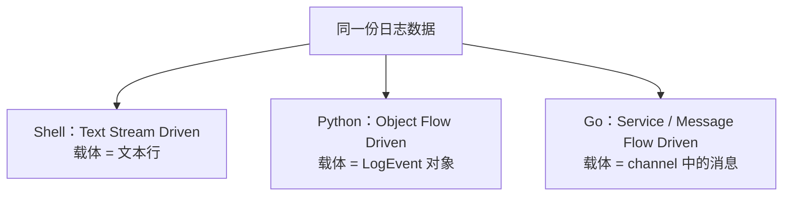

# 三种语言心智模型对比（Shell / Python / Go）

> **定位**
>
> 用 **同一个「多源日志聚合」任务**，分别以 Shell、Python、Go 三种语言最地道的风格实现，
> 让你在「同一份需求、同一份输入、同一份输出」的前提下，直观对比三种语言的
> **代码组织方式与心智模型**。
>
> 三个实现读取 **完全相同的样例日志**，因此产出 **完全相同的 `report.md`**——
> 差异只在「怎么组织代码」，不在「结果」。

---

## 一、统一任务

需求：**读取多个日志源 -> 过滤级别 -> 按服务/消息聚合 -> 取 Top-N 错误 -> 生成 Markdown 报告**。

外部访问（读日志源）统一用内置 `logs/*.log` 文本文件代替，无需任何真实系统即可运行。

日志行格式（空格分隔，message 取行尾剩余部分）：

```
2026-06-30T10:00:01 ERROR auth login failed for user bob
timestamp           level service message...
```

三个子项目：

- [shell/](./shell/README.md) — Text Stream Driven（文本流驱动）
- [python/](./python/README.md) — Object Flow Driven（对象流驱动）
- [go/](./go/README.md) — Service & Message Flow Driven（服务/消息流驱动）

---

## 二、统一心智模型：数据一直在「流动」

三种语言都在做同一件事——**让数据流过一连串处理阶段**。
区别只在于「流动的数据载体」抽象层次不同：



载体的演进：**文本（Text） -> 对象（Object） -> 消息（Message）**，抽象层次不断提升。

```
+----------+      +-----------+      +-------------+
| Shell    |      | Python    |      | Go          |
| Text     | ---> | Object    | ---> | Message     |
| Stream   |      | Flow      |      | / Service   |
+----------+      +-----------+      +-------------+
```

---

## 三、同一条流水线，三种表达

四个阶段（采集 ingest -> 解析 parse -> 聚合 aggregate -> 报告 report）在三种语言里的对应实现：

| 阶段 | Shell（文本流） | Python（对象流） | Go（服务/消息流） |
| --- | --- | --- | --- |
| 采集 ingest | `ingest.sh` 输出 TSV 行 | `IngestService` -> `RawLine` 对象 | `source.Stream` goroutine 扇入 `RawLine` |
| 解析 parse | `awk` 切分字段 | `parse_line` -> `LogEvent` 对象 | Parser 池 `RawLine` -> `LogEvent` |
| 聚合 aggregate | `stats.sh` / `topn.sh`（awk + sort） | `aggregate` -> `Aggregation` 对象 | `aggregator.Collect` 消费 channel |
| 报告 report | `report.sh` 拼 Markdown 文本 | `MarkdownReporter` 渲染对象 | `reporter.Write` 渲染 struct |
| 连接方式 | 管道 `\|`（stdin/stdout） | 函数调用 + 对象传参 | channel（消息传递） |
| 并发模型 | 进程级（`&` / `xargs -P`） | 一般顺序（或线程/asyncio） | goroutine + channel 原生并发 |

---

## 四、核心差异一句话总结

- **Shell = Pipeline**：一切皆文本，用管道把命令串起来，`stdin -> 命令 -> stdout`。最擅长「胶水」与「文本变换」。
- **Python = Workflow**：一切皆对象，用分层把职责拆开，`Config -> 对象 -> 对象 -> 输出`。最擅长「业务建模」与「自动化」。
- **Go = Service Pipeline**：一切皆服务，用 channel 把服务连起来，`Service -> Message -> Service`。最擅长「高并发」与「可拆分的大型/分布式系统」。

> 它们不是竞争关系，而是解决 **不同抽象层次** 的问题：
> 数据流层（Shell）-> 业务层（Python）-> 系统/分布式层（Go）。

---

## 五、运行（三者输出一致）

```bash
# Shell
bash shell/aggregate.sh

# Python
cd python && python3 main.py && cd ..

# Go（需安装 Go）
cd go && go run ./cmd/aggregate && cd ..
```

三个 `report.md` 内容应完全相同。预期报告见各子目录说明文档。
