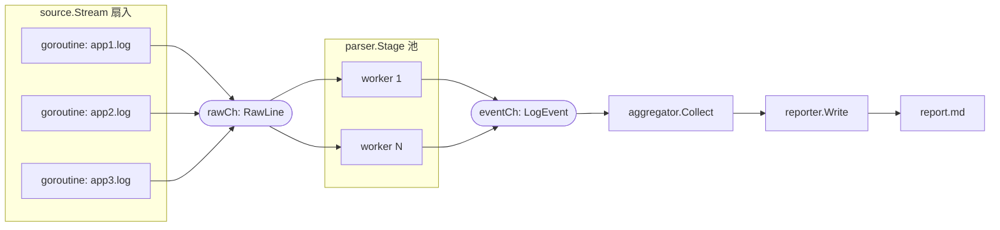

# Go 示例：Service / Message 服务消息流驱动

> 三种语言心智模型对比中的 **Go** 实现。总览见 [../README.md](../README.md)。
>
> 核心心智：**一切皆服务（Everything is Service）**。每个阶段是一个 Service（goroutine），
> `struct` 作为 Message 在 channel 间流动：`Service -> Message -> Service`。

---

## 一、目录结构

```
go/
+-- go.mod                          # module lang_mental_models/go
+-- cmd/
|     +-- aggregate/
|           +-- main.go             # 装配各 Service、用 channel 串联、启动流水线
+-- internal/
|     +-- model/
|     |     +-- event.go            # RawLine / LogEvent（Message 数据结构）
|     |     +-- report.go           # Aggregation / Report 等
|     +-- source/
|     |     +-- source.go           # 每源一个 goroutine 读取，扇入 rawCh
|     +-- parser/
|     |     +-- parser.go           # Parser 池：RawLine -> LogEvent
|     +-- aggregator/
|     |     +-- aggregator.go       # 汇聚 LogEvent -> Aggregation
|     +-- reporter/
|           +-- reporter.go         # Report -> report.md
+-- logs/                           # 多个日志源（fixtures 文本）
+-- report.md                       # 运行后生成
```

---

## 二、数据流（Service / Message Flow）

每个阶段是一个并发 Service，消息（struct）在 channel 间流动；
`source` 阶段把多个来源 **扇入（fan-in）** 到一个 channel，`parser` 阶段是 **worker pool**：



ASCII 版（与上图等价）：

```
app1.log --+
app2.log --+--> rawCh --> [Parser 池] --> eventCh --> Aggregator --> Reporter --> report.md
app3.log --+      (RawLine)               (LogEvent)
```

---

## 三、关键点讲解

### 1. struct 才是核心，不是 channel

整个系统都围绕明确的数据模型（消息）组织，而不是 `map[string]any`：

```go
type LogEvent struct {
    Source  string
    Level   string
    Service string
    Message string
}
```

### 2. 每个阶段是一个 Service，用 channel 连接

`main.go` 的装配就是把 Service 用 channel 串起来：

```go
rawCh := source.Stream(sources)               // 多源扇入 -> rawCh
eventCh := parser.Stage(rawCh, parserWorkers) // Parser 池 -> eventCh
agg := aggregator.Collect(eventCh, topN)      // 汇聚 -> Aggregation
```

### 3. 扇入 + worker pool + 优雅关闭

`source.Stream` 为每个来源开一个 goroutine 写入同一个 channel，并用 `sync.WaitGroup`
在全部写完后 `close(out)`，下游用 `for range` 自然结束：

```go
go func() {
    wg.Wait()
    close(out)
}()
```

`parser.Stage` 启动 N 个 worker 并发消费 `rawCh`，体现 Go 原生的并发阶段。

### 4. 并发但结果确定

事件并发乱序到达 `aggregator.Collect`，但它按 key 计数、最后统一排序，
因此输出与 Shell / Python 版本 **完全一致**（顺序无关 + 明确的 tie-break 规则）。

---

## 四、运行方式与预期输出

> 需要安装 Go（1.21+）。

```bash
cd go
go run ./cmd/aggregate
```

终端日志：

```
[main] pipeline start: 3 sources, N parser workers
[SOURCE] read logs/app1.log
[SOURCE] read logs/app2.log
[SOURCE] read logs/app3.log
[REPORTER] markdown report written: report.md
[main] pipeline done: 18 events aggregated
```

生成的 `report.md` 与 Shell / Python 版本完全一致：

```markdown
# 日志聚合报告

- 来源数：3
- 日志总行数：18（ERROR: 8 / WARN: 4 / INFO: 6）

## 各服务告警统计（ERROR + WARN，降序）

| 服务 | ERROR | WARN | 合计 |
| --- | --- | --- | --- |
| db | 3 | 2 | 5 |
| auth | 3 | 0 | 3 |
| cache | 1 | 2 | 3 |
| api | 1 | 0 | 1 |

## Top-5 错误消息

| 次数 | 服务 | 消息 |
| --- | --- | --- |
| 3 | auth | login failed for user bob |
| 3 | db | connection timeout |
| 1 | api | request POST /orders 500 |
| 1 | cache | eviction storm detected |

## 各来源明细

| 来源 | 行数 | ERROR | WARN | INFO |
| --- | --- | --- | --- | --- |
| app1 | 6 | 3 | 1 | 2 |
| app2 | 6 | 2 | 2 | 2 |
| app3 | 6 | 3 | 1 | 2 |
```

---

## 五、为什么这套结构擅长大型/分布式系统

每个 Service 现在用 channel 连接，以后可以几乎不改业务代码地拆成：

```
Process -> Container -> Pod -> Cluster
```

channel 换成 RPC / HTTP / Kafka 即可——这正是 Go「Service & Message Flow」的价值。

---

## 六、心智模型回顾

- 数据载体：**消息（Message / struct）**
- 阶段边界：**channel / interface**
- 组合方式：**Service Pipeline（goroutine + channel）**
- 处理单元：**Goroutine / Service**
- 一句话：**Everything is Service，用 channel 把服务连成消息流水线。**
