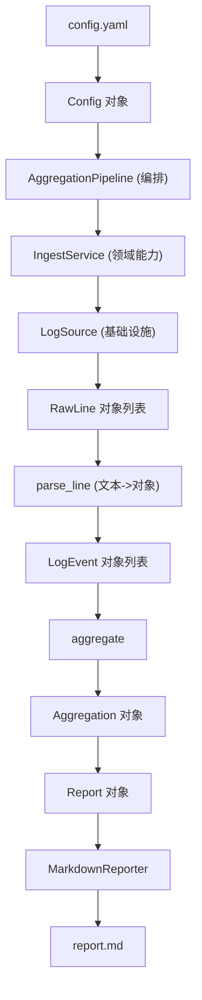

# Python 示例：Object Flow 对象流驱动

> 三种语言心智模型对比中的 **Python** 实现。总览见 [../README.md](../README.md)。
>
> 核心心智：**一切皆对象（Everything is Object）**。各层之间传递的是对象，
> 而不是到处拼接的字符串：`Config -> RawLine -> LogEvent -> Aggregation -> Report -> Markdown`。

---

## 一、目录结构

```
python/
+-- main.py                  # 入口：装配依赖并启动 Pipeline
+-- config/
|     +-- config.yaml        # 外部配置：sources / alert_levels / top_n
|     +-- loader.py          # YAML -> Config 对象（含无依赖降级解析）
+-- models/
|     +-- event.py           # RawLine / LogEvent 数据模型
|     +-- report.py          # Aggregation / Report 等数据模型
+-- infra/
|     +-- source.py          # LogSource：读取日志源（mock：读 fixtures）
+-- services/
|     +-- ingest_service.py  # 领域能力：从多个源采集 RawLine
+-- parsers/
|     +-- parser.py          # 纯函数：RawLine -> LogEvent
+-- analysis/
|     +-- aggregator.py      # LogEvent 列表 -> Aggregation
+-- workflow/
|     +-- pipeline.py        # 编排：ingest -> parse -> aggregate -> report
+-- reporter/
|     +-- markdown.py        # Report 对象 -> report.md
+-- utils/
|     +-- logger.py          # 统一日志配置
+-- logs/                    # 多个日志源（fixtures 文本）
+-- requirements.txt
+-- report.md                # 运行后生成
```

---

## 二、数据流（Object Flow）



注意整条链路：**没有裸 dict / 字符串在各层之间乱传**，传的都是对象。

---

## 三、逐层职责

| 层 | 目录 | 职责 | 关键类型/函数 |
| --- | --- | --- | --- |
| Configuration | `config/` | 外部配置 -> 对象 | `load_config` -> `Config` |
| Model | `models/` | 描述现实世界 | `RawLine`、`LogEvent`、`Aggregation`、`Report` |
| Infrastructure | `infra/` | 访问外部系统 | `LogSource.read_lines` |
| Service | `services/` | 领域能力 | `IngestService.collect` |
| Parser | `parsers/` | 文本 -> 对象 | `parse_line` |
| Analyzer | `analysis/` | 对象 -> 汇总对象 | `aggregate` -> `Aggregation` |
| Workflow | `workflow/` | 编排流程 | `AggregationPipeline.run` |
| Reporter | `reporter/` | 对象 -> 输出格式 | `MarkdownReporter.write` |

编排层只回答「做什么」：

```python
def run(self) -> Report:
    raw_lines = self.ingest.collect()          # -> list[RawLine]
    events = parse_lines(raw_lines)            # -> list[LogEvent]
    aggregation = aggregate(events, self.config.top_n)  # -> Aggregation
    report = Report(aggregation=aggregation)
    self.reporter.write(report)                # Report -> report.md
    return report
```

它不出现读文件 / split / open——这正是分层解耦的体现。

---

## 四、运行方式与预期输出

```bash
cd python
python3 main.py
# 可选：pip install -r requirements.txt（不装也能跑，loader 自带 YAML 降级解析）
```

终端日志（节选）：

```
INFO  | main               | loaded config: sources=['logs/app1.log', ...] top_n=5
INFO  | workflow.pipeline   | pipeline start: 3 sources
INFO  | infra.source        | [SOURCE] read .../python/logs/app1.log
INFO  | services.ingest     | collected app1: 6 lines
INFO  | workflow.pipeline   | parsed 18 events
INFO  | reporter.markdown    | markdown report written: .../python/report.md
```

生成的 `report.md` 与 Shell / Go 版本完全一致：

```markdown
# 日志聚合报告

- 来源数：3
- 日志总行数：18（ERROR: 8 / WARN: 4 / INFO: 6）

## 各服务告警统计（ERROR + WARN，降序）

| 服务 | ERROR | WARN | 合计 |
| --- | --- | --- | --- |
| db | 3 | 2 | 5 |
| auth | 3 | 0 | 3 |
| cache | 1 | 2 | 3 |
| api | 1 | 0 | 1 |

## Top-5 错误消息

| 次数 | 服务 | 消息 |
| --- | --- | --- |
| 3 | auth | login failed for user bob |
| 3 | db | connection timeout |
| 1 | api | request POST /orders 500 |
| 1 | cache | eviction storm detected |

## 各来源明细

| 来源 | 行数 | ERROR | WARN | INFO |
| --- | --- | --- | --- | --- |
| app1 | 6 | 3 | 1 | 2 |
| app2 | 6 | 2 | 2 | 2 |
| app3 | 6 | 3 | 1 | 2 |
```

---

## 五、如何「改成真实项目」

| 想做的事 | 只需改动 | 其它层是否改动 |
| --- | --- | --- |
| 换成真实日志源（SSH/Loki/Kafka） | `infra/source.py` | 否 |
| 增加新字段 / 新解析规则 | `parsers/parser.py` + `models/` | 否 |
| 输出 HTML / JSON | 新增一个 Reporter | 否 |
| 改来源 / Top-N | `config/config.yaml` | 否 |

---

## 六、心智模型回顾

- 数据载体：**对象（Object）**
- 阶段边界：**函数 / 方法**
- 组合方式：**分层 + 依赖注入**
- 处理单元：**Service / Class**
- 一句话：**Everything is Object，用分层把对象流串起来。**
