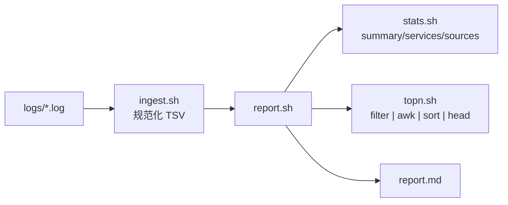

# Shell 示例：Text Stream 文本流驱动

> 三种语言心智模型对比中的 **Shell** 实现。总览见 [../README.md](../README.md)。
>
> 核心心智：**一切皆文本（Everything is Text）**。数据以「文本行」在管道里流动，
> 编排即管道：`ingest | report > report.md`。

---

## 一、目录结构

```
shell/
+-- aggregate.sh        # 主入口：编排即一条管道
+-- logs/               # 多个日志源（fixtures 文本）
|     +-- app1.log
|     +-- app2.log
|     +-- app3.log
+-- lib/
|     +-- ingest.sh     # 多源合并 -> 规范化 TSV 文本流
|     +-- filter.sh     # 按级别过滤的文本过滤器（可组合）
|     +-- stats.sh      # awk 聚合：summary / services / sources 三种视图
|     +-- topn.sh       # filter | awk | sort | head 取 Top-N 错误
|     +-- report.sh     # 中间 TSV -> Markdown 文本
+-- report.md           # 运行后生成
```

---

## 二、数据流（Text Stream）



规范化文本流的每一行都是统一的 TSV：

```
source <TAB> level <TAB> service <TAB> message
```

后续每个阶段都只面对这种「文本行」，这正是 Shell 的世界观。

---

## 三、关键点讲解

### 1. 一切皆文本：先规范化

`ingest.sh` 把杂乱的原始日志统一成一种 TSV 行，用 `awk` 把「第 4 字段起的剩余部分」
拼成 message：

```bash
awk -v src="$src" '
    NF >= 4 {
        msg = $4
        for (i = 5; i <= NF; i++) msg = msg " " $i
        printf "%s\t%s\t%s\t%s\n", src, $2, $3, msg
    }' "$f"
```

### 2. 可组合的文本过滤器

`filter.sh` 是标准的「读 stdin、写 stdout」过滤器，可被任意管道拼接：

```bash
ingest.sh logs/*.log | filter.sh ERROR        # 只看错误
ingest.sh logs/*.log | filter.sh 'ERROR|WARN' # 看告警
```

`topn.sh` 就复用了它：`filter ERROR | awk 计数 | sort -k1nr | head`——经典的文本统计三连。

### 3. 计算与排版分离

`stats.sh` 只算「中间 TSV」（不带表格），`report.sh` 才负责拼成 Markdown 表格。
一份规范化文本被缓存后喂给多个聚合器，得到「同一份数据、多种视图」。

### 4. 编排即管道

`aggregate.sh` 的核心只有一行：

```bash
"$LIB/ingest.sh" "$LOG_DIR"/*.log | "$LIB/report.sh" > "$OUT"
```

---

## 四、运行方式与预期输出

```bash
bash aggregate.sh
# 或自定义日志目录：bash aggregate.sh /path/to/logs
```

终端（stderr）日志：

```
[ingest] 读取日志源: .../shell/logs/*.log
[done] 报告已生成: .../shell/report.md
```

生成的 `report.md`：

```markdown
# 日志聚合报告

- 来源数：3
- 日志总行数：18（ERROR: 8 / WARN: 4 / INFO: 6）

## 各服务告警统计（ERROR + WARN，降序）

| 服务 | ERROR | WARN | 合计 |
| --- | --- | --- | --- |
| db | 3 | 2 | 5 |
| auth | 3 | 0 | 3 |
| cache | 1 | 2 | 3 |
| api | 1 | 0 | 1 |

## Top-5 错误消息

| 次数 | 服务 | 消息 |
| --- | --- | --- |
| 3 | auth | login failed for user bob |
| 3 | db | connection timeout |
| 1 | api | request POST /orders 500 |
| 1 | cache | eviction storm detected |

## 各来源明细

| 来源 | 行数 | ERROR | WARN | INFO |
| --- | --- | --- | --- | --- |
| app1 | 6 | 3 | 1 | 2 |
| app2 | 6 | 2 | 2 | 2 |
| app3 | 6 | 3 | 1 | 2 |
```

---

## 五、如何「改成真实项目」

| 想做的事 | 只需改动 |
| --- | --- |
| 换成真实日志源（journalctl / ssh / loki） | `lib/ingest.sh` |
| 改过滤级别 | `lib/filter.sh` 的参数 |
| 增加新的聚合视图 | 在 `lib/stats.sh` 加一个 mode |
| 改输出格式 | `lib/report.sh` |

---

## 六、心智模型回顾

- 数据载体：**文本行（Text）**
- 阶段边界：**stdin / stdout**
- 组合方式：**管道 `|`**
- 处理单元：**命令（command）**
- 一句话：**Everything is Text，用管道把命令串成数据流。**
