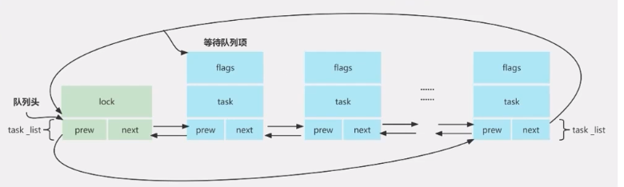

- IO模型
  collapsed:: true
	- 同步IO
		- 阻塞IO
		  collapsed:: true
			- 
			- 等待队列是内核实现阻塞和唤醒的内核机制。等待队列以循环链表为基础结构，链表头和链表项分别为等待队列头和等待队列元素。整个等待队列由等待队列头进行管理。
			- 等待队列使用方法
				- 初始化等待队列，并将条件置为假(condition 为 false 时阻塞)
				- 在需要阻塞的地方调用wait_event，使进程进入休眠
				- 当条件满足时，需要解除休眠（现将条件置为true，之后调用wake_up唤醒等待队列中的休眠进程）
			- ```c
			  struct __wait_queue_head {
			  	spinlock_t lock;
			  	struct list_head task_list;
			  };
			  typedef struct __wait_queue_head wait_queue_head_t;
			  
			  
			  struct __wait_queue {
			  	unsigned int flags;
			  #define WQ_FLAG_EXCLUSIVE	0x01
			  	void *private;
			  	wait_queue_func_t func;
			  	struct list_head task_list;
			  };
			  typedef struct __wait_queue wait_queue_t;
			  
			  
			  #define init_waitqueue_head(q)				\
			  	do {						\
			  		static struct lock_class_key __key;	\
			  							\
			  		__init_waitqueue_head((q), #q, &__key);	\
			  	} while (0)
			  
			  #define DECLARE_WAIT_QUEUE_HEAD(name) \
			  	wait_queue_head_t name = __WAIT_QUEUE_HEAD_INITIALIZER(name)
			  
			  #define DECLARE_WAITQUEUE(name, tsk)					\
			  	wait_queue_t name = __WAITQUEUE_INITIALIZER(name, tsk)
			  
			  extern void add_wait_queue(wait_queue_head_t *q, wait_queue_t *wait);
			  extern void add_wait_queue_exclusive(wait_queue_head_t *q, wait_queue_t *wait);
			  extern void remove_wait_queue(wait_queue_head_t *q, wait_queue_t *wait);
			  
			  static inline void __add_wait_queue(wait_queue_head_t *head, wait_queue_t *new)
			  {
			  	list_add(&new->task_list, &head->task_list);
			  }
			  static inline void __remove_wait_queue(wait_queue_head_t *head,
			  							wait_queue_t *old)
			  {
			  	list_del(&old->task_list);
			  }
			  
			  /**
			   * wait_event - sleep until a condition gets true
			   */
			  #define wait_event(wq, condition) 					\
			  do {									\
			  	if (condition)	 						\
			  		break;							\
			  	__wait_event(wq, condition);					\
			  } while (0)
			  
			  /**
			   * wait_event_interruptible - sleep until a condition gets true
			   */
			  #define wait_event_interruptible(wq, condition)				\
			  ({									\
			  	int __ret = 0;							\
			  	if (!(condition))						\
			  		__wait_event_interruptible(wq, condition, __ret);	\
			  	__ret;								\
			  })
			  
			  void __wake_up(wait_queue_head_t *q, unsigned int mode, int nr, void *key);
			  #define wake_up(x)			__wake_up(x, TASK_NORMAL, 1, NULL)
			  #define wake_up_interruptible(x)	__wake_up(x, TASK_INTERRUPTIBLE, 1, NULL)
			  ```
			- 
		- 非阻塞IO
		  collapsed:: true
			- 
			- ```c
			  # 在驱动中判断应用程序是否包含非阻塞的标志，如果包含的话根据条件判断条件是否ready进行返回
			  if(file->f_flags & O_NONBLOCK) {
			    if(dev->flag != 1)
			   	return -EAGAIN;
			  }
			  ```
		- 信号驱动IO
		  collapsed:: true
			- 
			- ```c
			  # 驱动程序实现fasync方法
			  1.当应用程序开启信号驱动IO时，会触发驱动中的fasync函数
			  2.在驱动中的fasync函数中调用fasync_helper函数来操作fasync_struct结构体
			  3.当设备准备好时，驱动程序调用kill_fasync函数通知应用程序，应用程序的SIGIO信号处理函数
			  会被执行
			  
			  int (*fasync) (int, struct file *, int);
			  /* SMP safe fasync helpers: */
			  extern int fasync_helper(int, struct file *, int, struct fasync_struct **);
			  
			  /* can be called from interrupts */
			  extern void kill_fasync(struct fasync_struct **, int, int);
			  
			  static int cdev_test_fasync(int fd, struct file *file, int on)
			  {
			    struct device_test *test_dev = (struct device_test *)file->private_data;
			    
			    return fasync_helper(fd, file, on, &test_dev->fasync);
			  }
			  
			  # 当数据ready时候，例如可以在驱动的write函数中模拟数据ready的条件（例如可读）
			  kill_fasync(&test_dev->fasync, SIGIO, POLLIN);
			  ```
		- IO多路复用
		  collapsed:: true
			- 
			- ```c
			  # 实现file_operations结构体中的poll函数，实现内容如下
			  1.对可能引起设备文件状态变化的等待队列调用poll_wait，将对应的等待队列头添加到poll_table
			  2.返回是否能对设备进行无阻塞读写访问的掩码
			  struct file_operations {
			  	......
			      unsigned int (*poll) (struct file *, struct poll_table_struct *);
			  }
			  
			  static __poll_t cdev_test_poll(struct file *file, struct poll_table_struct *polltable)
			  {
			    struct device_test *test_dev = (struct device_test *)file->private_data;
			    int mask = 0;
			    
			    poll_wait(file, &read_wq, polltable); // poll_wait函数不会阻塞
			    
			    if(test_dev->flag == 1)
			      mask = POLLIN;
			    
			    return mask;
			  }
			  ```
	- 异步IO
		- 
		- 异步IO可以在用户空间的glibc库进行实现，可以不依赖于内核
- 同步IO与异步IO的区别
  collapsed:: true
	- 是否等待IO的执行结果
- linux定时器
  collapsed:: true
	- 全局变量jiffies
		- 记录自系统启动以来产生的节拍总数，启动时内核将该变量初始化为0，在时钟中断处理函数中会对该变量进行加1操作
	- 定时器使用步骤
		- 初始化定时器
		- 向linux内核注册定时器（add_timer）
		- 删除定时器可以使用函数del_timer
	- ```c
	  struct timer_list {
	  	/*
	  	 * All fields that change during normal runtime grouped to the
	  	 * same cacheline
	  	 */
	  	struct list_head entry;
	  	unsigned long expires;
	  	struct tvec_base *base;
	  
	  	void (*function)(unsigned long);
	  	unsigned long data;
	  
	  	int slack;
	  
	  #ifdef CONFIG_TIMER_STATS
	  	int start_pid;
	  	void *start_site;
	  	char start_comm[16];
	  #endif
	  #ifdef CONFIG_LOCKDEP
	  	struct lockdep_map lockdep_map;
	  #endif
	  };
	  
	  /*
	   * Convert various time units to each other:
	   */
	  extern unsigned int jiffies_to_msecs(const unsigned long j);
	  extern unsigned int jiffies_to_usecs(const unsigned long j);
	  extern unsigned long msecs_to_jiffies(const unsigned int m);
	  extern unsigned long usecs_to_jiffies(const unsigned int u);
	  extern unsigned long timespec_to_jiffies(const struct timespec *value);
	  extern void jiffies_to_timespec(const unsigned long jiffies,
	  				struct timespec *value);
	  
	  #define DEFINE_TIMER(_name, _function, _expires, _data)		\
	  	struct timer_list _name =				\
	  		TIMER_INITIALIZER(_function, _expires, _data)
	  
	  #define init_timer(timer)						\
	  	do {								\
	  		static struct lock_class_key __key;			\
	  		init_timer_key((timer), #timer, &__key);		\
	  	} while (0)
	  
	  extern void add_timer(struct timer_list *timer);
	  extern void add_timer_on(struct timer_list *timer, int cpu);
	  extern int del_timer(struct timer_list * timer);
	  extern int mod_timer(struct timer_list *timer, unsigned long expires); // 修改定时器的值
	  extern int mod_timer_pending(struct timer_list *timer, unsigned long expires);
	  extern int mod_timer_pinned(struct timer_list *timer, unsigned long expires);
	  ```
- linux内核信息的打印等级
  collapsed:: true
	- 查看内核打印信息
		- [[dmesg]]
		- `cat /proc/kmsg`
	- 内核打印等级
		- ```bash
		  root@slot-120:~ [P1]# cat /proc/sys/kernel/printk
		  7       4       1       7
		  
		  int console_printk[4] = {
		  	DEFAULT_CONSOLE_LOGLEVEL,	/* console_loglevel */
		  	DEFAULT_MESSAGE_LOGLEVEL,	/* default_message_loglevel */
		  	MINIMUM_CONSOLE_LOGLEVEL,	/* minimum_console_loglevel */
		  	DEFAULT_CONSOLE_LOGLEVEL,	/* default_console_loglevel */
		  };
		  
		  #define KERN_EMERG	"<0>"	/* system is unusable			*/
		  #define KERN_ALERT	"<1>"	/* action must be taken immediately	*/
		  #define KERN_CRIT	"<2>"	/* critical conditions			*/
		  #define KERN_ERR	"<3>"	/* error conditions			*/
		  #define KERN_WARNING	"<4>"	/* warning conditions			*/
		  #define KERN_NOTICE	"<5>"	/* normal but significant condition	*/
		  #define KERN_INFO	"<6>"	/* informational			*/
		  #define KERN_DEBUG	"<7>"	/* debug-level messages			*/
		  ```
- 定位文件读写位置
  collapsed:: true
	- 使用llseek在驱动中定位文件读写位置
	- ```c
	  static loff_t cdev_test_llseekstruct file *file, loff_t offset, int whence)
	  {
	    loff_t new_offset;
	    
	    switch(whence) {
	      case SEEK_SET:
	        if(offset < 0) {
	          return -EINVAL;
	          break;
	        }
	        if(offset > BUFSIZE) {
	          return -EINVAL;
	          break;
	        }
	        new_offset = offset;
	        break;
	      case SEEK_CUR:
	        if((file->f_pos + offset) > BUFSIZE) {
	          return -EINVAL;
	          break;
	        }
	        if((file->f_pos + offset) < 0) {
	          return -EINVAL;
	          break;
	        }
	        new_offset = file->f_pos + offset;
	        break;
	      case SEEK_END:
	        if((file->f_pos + offset) < 0) {
	          return -EINVAL;
	          break;
	        }
	        new_offset = BUFSIZE + offset;
	        break;
	      default:
	        return -EINVAL;
	        break;
	    }
	    
	    file->f_pos = new_offset;
	    return new_offset;
	  }
	  
	  同时需要在read和write函数中对返回的count值进行相应的处理
	  ssize_t (*read) (struct file *, char __user *, size_t, loff_t *);
	  ssize_t (*write) (struct file *, const char __user *, size_t, loff_t *);
	  ```
- ioctl设备操作
  collapsed:: true
	- ```c
	  long (*unlocked_ioctl) (struct file *, unsigned int, unsigned long);
	  long (*compat_ioctl) (struct file *, unsigned int, unsigned long);
	  
	  /* used to create numbers */
	  #define _IO(type,nr)		_IOC(_IOC_NONE,(type),(nr),0)
	  #define _IOR(type,nr,size)	_IOC(_IOC_READ,(type),(nr),(_IOC_TYPECHECK(size)))
	  #define _IOW(type,nr,size)	_IOC(_IOC_WRITE,(type),(nr),(_IOC_TYPECHECK(size)))
	  #define _IOWR(type,nr,size)	_IOC(_IOC_READ|_IOC_WRITE,(type),(nr),(_IOC_TYPECHECK(size)))
	  #define _IOR_BAD(type,nr,size)	_IOC(_IOC_READ,(type),(nr),sizeof(size))
	  #define _IOW_BAD(type,nr,size)	_IOC(_IOC_WRITE,(type),(nr),sizeof(size))
	  #define _IOWR_BAD(type,nr,size)	_IOC(_IOC_READ|_IOC_WRITE,(type),(nr),sizeof(size))
	  
	  /* used to decode ioctl numbers.. */
	  #define _IOC_DIR(nr)		(((nr) >> _IOC_DIRSHIFT) & _IOC_DIRMASK)
	  #define _IOC_TYPE(nr)		(((nr) >> _IOC_TYPESHIFT) & _IOC_TYPEMASK)
	  #define _IOC_NR(nr)		(((nr) >> _IOC_NRSHIFT) & _IOC_NRMASK)
	  #define _IOC_SIZE(nr)		(((nr) >> _IOC_SIZESHIFT) & _IOC_SIZEMASK)
	  
	  
	  示例1（无参数交互的命令）：
	  #define CMD_TEST0 _IO('L', 0)
	  
	  static long cdev_test_unlocked_ioctl(struct file *file, unsigned int cmd, unsigned long arg)
	  {
	    switch(cmd) {
	      case CMD_TEST0:
	        printk("This is cmd test0\n");
	        break;
	      default:
	        break;
	    }
	    
	    return 0;
	  }
	  
	  # 如果用户空间要传递多个参数到内核驱动，可以定义结构体，并使用地址传参的方式进行传递，在内核驱动
	  中可以通过copy_from_user对参数进行传递
	  ```
	- [Ioctl Numbers](https://www.kernel.org/doc/html/latest/userspace-api/ioctl/ioctl-number.html)
	- [Command number definitions](https://www.kernel.org/doc/html/latest/driver-api/ioctl.html)
- 驱动的稳定性和效率
  collapsed:: true
	- 对用户空间传入的参数合法性进行判断
	- 检查用户空间是否可用
		- ```c
		  access_ok(addr, size);
		  if(!access_ok(addr, len)) {
		    printk("error!\n");
		    return -1;
		  }
		  ```
	- 使用likely和unlikely从编译阶段对代码进行优化，从而提高条件分支代码的执行效率
		- ```c
		  if(unlikely(copy_from_user(xxx))) {
		    ......
		  }
		  ```
- 驱动的调试方法
	- ```c
	  # dump函数调用栈
	  dump_stack();
	  WARN(condition, fmt, ...)和WARN_ON(condition)函数
	  
	  BUG和BUG_ON(condition)函数		// 触发内核OOPS
	  panic(fmt, ...)函数			// 触发系统死机并输出打印信息
	  ```