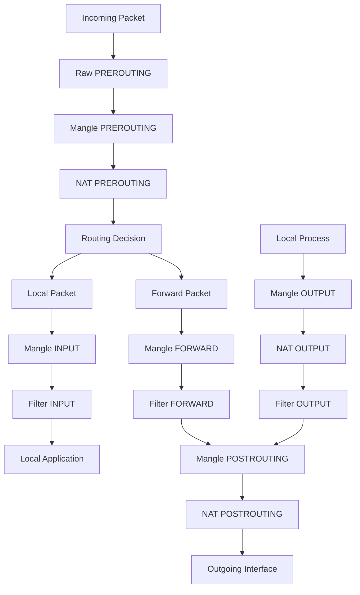

# Linux Netfilter Packet Processing Pipeline

**完整的包处理框架解析与iptables高效使用指南**

---

## 目录

1. [Netfilter核心概念](#1-netfilter核心概念)
2. [架构概览](#2-架构概览)
3. [包处理流水线详解](#3-包处理流水线详解)
4. [Hook点与Chain](#4-hook点与chain)
5. [表（Table）系统](#5-表table系统)
6. [连接跟踪机制](#6-连接跟踪机制)
7. [iptables命令详解](#7-iptables命令详解)
8. [故障排除方法](#8-故障排除方法)
9. [最佳实践](#9-最佳实践)
10. [高级应用场景](#10-高级应用场景)

---

## 1. Netfilter核心概念

### 1.1 什么是Netfilter

Netfilter是Linux内核中的**数据包过滤和处理框架**，它提供了一套Hook机制，允许内核模块在网络栈的特定位置注册回调函数来处理数据包。

```text
关键理解：
┌─────────────────────────────────────┐
│ iptables ≠ 防火墙                    │
│ iptables = Netfilter的配置接口        │
│ Netfilter = 真正的包处理引擎           │
└─────────────────────────────────────┘
```

### 1.2 核心设计思想

```text
数据包处理流水线 (Packet Processing Pipeline)

不是简单的规则匹配，而是：
┌───────────────────────────────────┐
│ Hook-based Processing System      │
│                                   │
│ 在网络栈的关键节点插入处理逻辑        │
└───────────────────────────────────┘
```

### 1.3 心智模型转换

```text
❌ 错误思维：
"iptables是一堆规则"

✅ 正确思维：
"Netfilter是数据包在内核中的处理流水线"
"iptables用来配置这个流水线"
```

---

## 2. 架构概览

### 2.1 系统层次结构

```text
┌─────────────────────────────────────┐
│           User Space                │
│  iptables | nftables | ebtables     │
├─────────────────────────────────────┤
│         Kernel Space                │
│                                     │
│  ┌─────────────────────────────┐    │
│  │        Netfilter            │    │
│  │    (Hook Framework)         │    │
│  │                             │    │
│  │  ┌─────┐ ┌─────┐ ┌─────┐    │    │
│  │  │Raw  │ │Mangle│ │NAT  │    │    │
│  │  └─────┘ └─────┘ └─────┘    │    │
│  │  ┌─────┐ ┌─────────────┐    │    │
│  │  │Filter│ │ Conntrack  │    │    │
│  │  └─────┘ └─────────────┘    │    │
│  └─────────────────────────────┘    │
├─────────────────────────────────────┤
│         Network Stack               │
│  ┌─────┐ ┌─────┐ ┌─────┐ ┌─────┐   │
│  │ TCP │ │ UDP │ │ IP  │ │ etc │   │
│  └─────┘ └─────┘ └─────┘ └─────┘   │
└─────────────────────────────────────┘
```

### 2.2 关键组件关系

```text
┌────────────────────────────────────┐
│ Component Interaction              │
│                                    │
│ iptables ──config──→ Netfilter     │
│     ↓                    ↓         │
│  Rules              Hook Points    │
│     ↓                    ↓         │
│ Tables/Chains    Kernel Processing │
│     ↓                    ↓         │
│  Targets         Packet Decision   │
└────────────────────────────────────┘
```

---

## 3. 包处理流水线详解

### 3.1 完整的数据包处理流程



### 3.2 各阶段详细分析

#### 3.2.1 Raw PREROUTING - 原始处理阶段
**位置**：数据包进入内核后的第一个处理点
**主要功能**：
- 连接跟踪控制（NOTRACK）
- 绕过连接跟踪以提高性能
- 最原始的包检查

```bash
# 示例：跳过高流量连接的跟踪
iptables -t raw -A PREROUTING \
    -p tcp --dport 80 \
    -j NOTRACK
```

**使用场景**：
```text
✓ 高性能Web服务器
✓ 大流量转发场景  
✓ DDoS防护
✓ 特殊协议处理
```

#### 3.2.2 Mangle PREROUTING - 包修改阶段
**位置**：Raw处理之后，路由决策之前
**主要功能**：
- 修改TOS/DSCP字段
- 设置包标记（MARK）
- TTL修改
- 策略路由准备

```bash
# 示例：为特定流量设置QoS标记
iptables -t mangle -A PREROUTING \
    -p tcp --dport 443 \
    -j DSCP --set-dscp 46
```

#### 3.2.3 NAT PREROUTING - 目标地址转换
**位置**：路由决策前的最后处理点
**主要功能**：
- DNAT（目标地址转换）
- 端口转发
- 负载均衡
- 透明代理

```bash
# 示例：将外网80端口转发到内网服务器
iptables -t nat -A PREROUTING \
    -p tcp --dport 80 \
    -j DNAT --to-destination 192.168.1.100:8080
```

**为什么在路由前？**
```text
必须先修改目标地址 → 才能正确路由
```

#### 3.2.4 Routing Decision - 路由决策点
**功能**：内核路由表查找，决定包的去向
```bash
# 查看路由决策结果
ip route get 8.8.8.8
```

**关键分岔**：
```text
          Routing Decision
          /            \
    Local Dest     Forward Dest
    (INPUT链)      (FORWARD链)
```

#### 3.2.5 Filter INPUT/FORWARD - 安全控制核心
**INPUT链**：保护本机服务
```bash
# 允许SSH连接
iptables -A INPUT -p tcp --dport 22 -j ACCEPT
# 默认拒绝
iptables -A INPUT -j DROP
```

**FORWARD链**：网关/路由器控制
```bash
# 允许内网访问外网
iptables -A FORWARD -s 192.168.1.0/24 -j ACCEPT
# 阻止外网访问内网
iptables -A FORWARD -d 192.168.1.0/24 -j DROP
```

#### 3.2.6 NAT POSTROUTING - 源地址转换
**位置**：包离开前的最后NAT机会
**主要功能**：
- SNAT（源地址转换）
- MASQUERADE（动态源地址转换）

```bash
# 共享上网配置
iptables -t nat -A POSTROUTING \
    -s 192.168.1.0/24 \
    -o eth0 \
    -j MASQUERADE
```

### 3.3 OUTPUT链的处理流程

```text
Local Process
      ↓
Mangle OUTPUT    ← 修改本机发出的包
      ↓
NAT OUTPUT       ← 本机发出包的DNAT
      ↓  
Filter OUTPUT    ← 控制本机发出的流量
      ↓
POSTROUTING      ← 最终的SNAT处理
      ↓
Interface
```

---

## 4. Hook点与Chain

### 4.1 五个Hook点详解

```text
┌─────────────────────────────────────────────┐
│                Hook Points                  │
│                                             │
│ NF_INET_PRE_ROUTING  → PREROUTING Chain     │
│ NF_INET_LOCAL_IN     → INPUT Chain          │
│ NF_INET_FORWARD      → FORWARD Chain        │
│ NF_INET_LOCAL_OUT    → OUTPUT Chain         │
│ NF_INET_POST_ROUTING → POSTROUTING Chain    │
└─────────────────────────────────────────────┘
```

### 4.2 Chain的本质理解

```text
Chain ≠ 规则列表
Chain = 数据包处理阶段

每个Chain代表：
┌─────────────────────────────────┐
│ 数据包在网络栈中的特定位置       │  
│ 在这个位置可以进行的操作         │
└─────────────────────────────────┘
```

### 4.3 Chain选择逻辑

```text
问题：这个包现在在哪里？

进入系统 → PREROUTING
发给本机 → INPUT  
通过本机 → FORWARD
本机发出 → OUTPUT
离开系统 → POSTROUTING
```

---

## 5. 表（Table）系统

### 5.1 四大表的功能定位

```text
┌─────────────────────────────────────────────┐
│                Table Functions              │
│                                             │
│ Raw Table    → 连接跟踪控制                  │
│ Mangle Table → 包头修改                     │  
│ NAT Table    → 地址转换                     │
│ Filter Table → 访问控制（默认表）            │
└─────────────────────────────────────────────┘
```

### 5.2 表的处理优先级

```text
数据包处理顺序：
Raw → Mangle → NAT → Filter

为什么这样排序？
┌─────────────────────────────────┐
│ Raw:    最早决定是否跟踪          │
│ Mangle: 修改包为后续处理做准备     │  
│ NAT:    地址转换影响路由          │
│ Filter: 最后决定通过与否          │
└─────────────────────────────────┘
```

### 5.3 表与链的映射关系

```text
┌────────────┬──────┬────────┬─────┬────────┬─────────────┐
│   Table    │ PRE  │ INPUT  │ FWD │ OUTPUT │ POSTROUTING │
├────────────┼──────┼────────┼─────┼────────┼─────────────┤
│ Raw        │  ✓   │        │     │   ✓    │             │
│ Mangle     │  ✓   │   ✓    │  ✓  │   ✓    │      ✓      │
│ NAT        │  ✓   │   ✓    │     │   ✓    │      ✓      │
│ Filter     │      │   ✓    │  ✓  │   ✓    │             │
└────────────┴──────┴────────┴─────┴────────┴─────────────┘
```

---

## 6. 连接跟踪机制

### 6.1 Conntrack的核心价值

```text
无状态处理 vs 有状态处理

❌ 无状态：
每个包独立判断 → 性能差 → 规则复杂

✅ 有状态：  
连接建立一次 → 后续包自动关联 → 高效
```

### 6.2 连接状态机

```text
┌─────────────────────────────────────────────┐
│            Connection States                │
│                                             │
│ NEW        → 新连接的第一个包                 │
│ ESTABLISHED → 双向通信已建立                  │
│ RELATED    → 与已知连接相关                   │
│ INVALID    → 无法识别的包                     │
│ UNTRACKED  → 未跟踪的包（Raw表NOTRACK）       │
└─────────────────────────────────────────────┘
```

### 6.3 Conntrack实用命令

```bash
# 查看连接跟踪表
cat /proc/net/nf_conntrack

# 使用conntrack工具
conntrack -L                    # 列出所有连接
conntrack -L -p tcp            # 只显示TCP连接  
conntrack -D -p tcp            # 删除所有TCP连接
conntrack -E                   # 实时监控连接事件

# 调整连接跟踪参数
echo 65536 > /proc/sys/net/netfilter/nf_conntrack_max
echo 300 > /proc/sys/net/netfilter/nf_conntrack_tcp_timeout_established
```

### 6.4 经典的状态规则

```bash
# 基础状态规则 - 几乎所有防火墙都需要
iptables -A INPUT -m conntrack --ctstate ESTABLISHED,RELATED -j ACCEPT

# 允许新的SSH连接
iptables -A INPUT -p tcp --dport 22 -m conntrack --ctstate NEW -j ACCEPT

# 丢弃无效包
iptables -A INPUT -m conntrack --ctstate INVALID -j DROP
```

---

## 7. iptables命令详解

### 7.1 命令语法结构

```text
iptables [表] [操作] [链] [匹配条件] [目标动作]
         │    │     │      │        │
         │    │     │      │        └─ Target (-j ACTION)
         │    │     │      └────────── Match Criteria  
         │    │     └─────────────────── Chain
         │    └───────────────────────── Operation (-A/-I/-D/-R)
         └────────────────────────────── Table (-t table)
```

### 7.2 常用操作参数

#### 表选择
```bash
-t filter    # 默认表，可省略
-t nat       # NAT表
-t mangle    # Mangle表  
-t raw       # Raw表
```

#### 链操作
```bash
-A CHAIN     # 追加规则到链末尾
-I CHAIN [N] # 插入规则到位置N（默认1）
-D CHAIN N   # 删除第N条规则
-D CHAIN rule # 删除匹配的规则
-R CHAIN N   # 替换第N条规则
-F [CHAIN]   # 清空链中所有规则
-X [CHAIN]   # 删除用户定义的链
-P CHAIN target # 设置链的默认策略
```

#### 查看操作
```bash
-L [CHAIN]   # 列出规则
-S [CHAIN]   # 以命令格式显示规则
-n           # 显示数字格式（不解析主机名/端口名）
-v           # 详细模式（显示包/字节计数）
--line-numbers # 显示行号
```

### 7.3 匹配条件详解

#### 通用匹配
```bash
-p protocol          # 协议：tcp, udp, icmp, all
-s source           # 源地址：IP, 网段, 主机名
-d destination      # 目标地址
-i interface        # 输入接口（INPUT, FORWARD, PREROUTING）
-o interface        # 输出接口（FORWARD, OUTPUT, POSTROUTING）
```

#### TCP/UDP匹配
```bash
--sport port[:port]     # 源端口
--dport port[:port]     # 目标端口  
--tcp-flags mask comp   # TCP标志位
--syn                   # TCP SYN包（等价于--tcp-flags SYN,RST,ACK SYN）
```

#### 扩展匹配模块
```bash
-m state --state STATE          # 连接状态（已弃用）
-m conntrack --ctstate STATE    # 连接跟踪状态（推荐）
-m limit --limit rate           # 速率限制
-m multiport --dports ports     # 多端口匹配
-m iprange --src-range IP1-IP2  # IP范围匹配
-m string --string pattern      # 字符串匹配
-m time --timestart HH:MM       # 时间匹配
-m mac --mac-source MAC         # MAC地址匹配
-m mark --mark value            # 包标记匹配
```

### 7.4 目标动作详解

#### 基本动作
```bash
-j ACCEPT    # 接受包，停止处理
-j DROP      # 静默丢弃包  
-j REJECT    # 拒绝包并发送错误响应
-j RETURN    # 返回到调用链继续处理
```

#### NAT动作
```bash
-j SNAT --to-source IP[:port]           # 源地址转换
-j DNAT --to-destination IP[:port]      # 目标地址转换  
-j MASQUERADE [--to-ports port-range]   # 动态源地址转换
-j REDIRECT --to-ports port             # 重定向到本地端口
```

#### 其他动作
```bash
-j LOG --log-prefix "prefix"            # 记录日志
-j MARK --set-mark value               # 设置包标记
-j TOS --set-tos value                 # 设置TOS字段
-j TCPMSS --set-mss value              # 设置TCP MSS
-j NOTRACK                             # 跳过连接跟踪
```

### 7.5 实用命令示例

#### 基本防火墙配置
```bash
# 清空所有规则
iptables -F
iptables -X  
iptables -t nat -F
iptables -t mangle -F

# 设置默认策略
iptables -P INPUT DROP
iptables -P FORWARD DROP  
iptables -P OUTPUT ACCEPT

# 允许本地回环
iptables -A INPUT -i lo -j ACCEPT

# 允许已建立连接
iptables -A INPUT -m conntrack --ctstate ESTABLISHED,RELATED -j ACCEPT

# 允许SSH
iptables -A INPUT -p tcp --dport 22 -j ACCEPT

# 允许HTTP/HTTPS
iptables -A INPUT -p tcp -m multiport --dports 80,443 -j ACCEPT
```

#### NAT网关配置
```bash
# 开启IP转发
echo 1 > /proc/sys/net/ipv4/ip_forward

# 配置MASQUERADE
iptables -t nat -A POSTROUTING -s 192.168.1.0/24 -o eth0 -j MASQUERADE

# 端口转发
iptables -t nat -A PREROUTING -p tcp --dport 80 -j DNAT --to-destination 192.168.1.100:8080
iptables -A FORWARD -p tcp -d 192.168.1.100 --dport 8080 -j ACCEPT
```

#### 高级流量控制
```bash
# 限制连接速率
iptables -A INPUT -p tcp --dport 22 -m limit --limit 3/min --limit-burst 3 -j ACCEPT

# 防止端口扫描
iptables -A INPUT -p tcp --tcp-flags ALL ALL -j DROP
iptables -A INPUT -p tcp --tcp-flags ALL NONE -j DROP

# 地理位置封锁（需要geoip模块）
iptables -A INPUT -m geoip --src-cc CN -j DROP
```

---

## 8. 故障排除方法

### 8.1 系统化排障流程

```text
┌─────────────────────────────────────┐
│         Troubleshooting Flow        │
│                                     │
│ 1. 确定包的路径                     │
│ 2. 检查路由决策                     │  
│ 3. 验证连接状态                     │
│ 4. 分析规则匹配                     │
│ 5. 抓包验证假设                     │
└─────────────────────────────────────┘
```

### 8.2 步骤1：包路径分析

#### 判断包的处理路径
```bash
# 问题：包会走哪个Chain？

# 本机作为客户端
ping 8.8.8.8        # OUTPUT链
curl google.com     # OUTPUT链

# 本机作为服务器  
ssh user@server     # INPUT链（服务器视角）

# 本机作为网关
# 从LAN到Internet  # FORWARD链
```

#### 路径判断法则
```text
┌─────────────────────────────────────┐
│          Path Decision              │
│                                     │
│ 目标是本机？ → INPUT                │
│ 本机发出？   → OUTPUT               │  
│ 经过本机？   → FORWARD              │
└─────────────────────────────────────┘
```

### 8.3 步骤2：路由决策检查

```bash
# 查看特定目标的路由
ip route get 8.8.8.8

# 输出示例：
# 8.8.8.8 via 192.168.1.1 dev eth0 src 192.168.1.100 uid 1000

# 关键信息：
# via：下一跳网关
# dev：出接口  
# src：源地址选择
```

#### 常见路由问题
```bash
# 检查默认路由
ip route show default

# 检查接口状态
ip link show

# 检查IP配置
ip addr show
```

### 8.4 步骤3：连接状态验证

```bash
# 查看连接跟踪状态
conntrack -L | grep "目标IP"

# 实时监控连接建立
conntrack -E

# 检查特定协议连接
conntrack -L -p tcp --dport 80
```

#### 连接状态排障
```text
问题诊断：
┌─────────────────────────────────────┐
│ 看不到连接记录？                    │
│ → 包可能被Raw表NOTRACK了            │
│                                     │
│ 连接状态是INVALID？                 │  
│ → 包可能损坏或序列号错误            │
│                                     │
│ 只有单向连接？                      │
│ → 回包路径有问题                    │
└─────────────────────────────────────┘
```

### 8.5 步骤4：规则匹配分析

#### 查看规则计数器
```bash
# 查看详细统计
iptables -L -n -v

# 示例输出：
# pkts bytes target     prot opt in     out     source          destination
#   42  2520 ACCEPT     tcp  --  *      *       0.0.0.0/0       0.0.0.0/0           tcp dpt:22

# 重置计数器
iptables -Z

# 监控规则匹配
watch 'iptables -L -n -v'
```

#### 计数器分析方法
```text
┌─────────────────────────────────────┐
│        Counter Analysis             │
│                                     │
│ pkts=0, bytes=0                     │
│ → 包根本没到这个规则                │
│                                     │  
│ 计数持续增长                        │
│ → 规则被命中                        │
│                                     │
│ 前面规则计数增长，后面不变           │
│ → 在前面规则就被处理了              │
└─────────────────────────────────────┘
```

### 8.6 步骤5：抓包验证

#### 抓包策略
```bash
# 在所有接口抓包
tcpdump -ni any host 8.8.8.8

# 指定接口抓包
tcpdump -ni eth0 port 80

# 抓包保存文件
tcpdump -ni any -w capture.pcap host 192.168.1.100

# 实时显示HTTP请求
tcpdump -ni any -A port 80
```

#### 抓包分析要点
```text
关键观察点：
┌─────────────────────────────────────┐
│ 1. 包是否到达入接口？               │
│ 2. 包是否从出接口发送？             │
│ 3. 在哪个接口消失？                 │  
│ 4. 包的地址是否被NAT修改？          │
│ 5. 是否有回包？                     │
└─────────────────────────────────────┘
```

### 8.7 常见问题诊断模式

#### 问题：连接超时
```bash
# 检查清单：
1. ping通吗？          → ip连通性
2. 端口开放吗？        → nmap -p 80 target
3. 防火墙规则对吗？    → iptables -L -n -v
4. 路由正确吗？        → ip route get target
5. 连接被跟踪吗？      → conntrack -L
```

#### 问题：NAT不工作  
```bash
# 检查清单：
1. IP转发开启？        → cat /proc/sys/net/ipv4/ip_forward
2. MASQUERADE规则？    → iptables -t nat -L -n -v
3. 路由表正确？        → ip route show
4. 接口配置？          → ip addr show
5. 连接跟踪？          → conntrack -L -p tcp
```

#### 问题：规则不生效
```bash
# 检查清单：
1. 规则位置对？        → iptables -L --line-numbers
2. 表选择对？          → -t 参数
3. 链选择对？          → 包路径分析  
4. 匹配条件对？        → -v 查看计数
5. 被其他规则拦截？    → 规则顺序检查
```

---

## 9. 最佳实践

### 9.1 规则编写原则

#### 原则1：明确包路径
```text
✅ 先分析：这个包会走哪个Chain？
❌ 直接写：反正试试看
```

#### 原则2：合理排序
```bash
# ✅ 正确顺序：常用规则在前
iptables -A INPUT -m conntrack --ctstate ESTABLISHED,RELATED -j ACCEPT
iptables -A INPUT -i lo -j ACCEPT
iptables -A INPUT -p tcp --dport 22 -j ACCEPT
iptables -A INPUT -j DROP

# ❌ 错误顺序：DROP在前会阻止后续规则
iptables -A INPUT -j DROP                                    # 这条会阻止所有
iptables -A INPUT -p tcp --dport 22 -j ACCEPT               # 永远不会执行
```

#### 原则3：使用状态跟踪
```bash
# ✅ 推荐：利用连接状态
iptables -A INPUT -m conntrack --ctstate ESTABLISHED,RELATED -j ACCEPT
iptables -A INPUT -p tcp --dport 80 -m conntrack --ctstate NEW -j ACCEPT

# ❌ 不推荐：每个包都独立判断  
iptables -A INPUT -p tcp --sport 80 -j ACCEPT              # 容易出错
iptables -A OUTPUT -p tcp --dport 80 -j ACCEPT
```

### 9.2 性能优化

#### 优化1：规则顺序优化
```bash
# 将最常匹配的规则放在前面
iptables -A INPUT -m conntrack --ctstate ESTABLISHED,RELATED -j ACCEPT  # 大部分流量
iptables -A INPUT -i lo -j ACCEPT                                        # 本地流量
iptables -A INPUT -p tcp --dport 22 -j ACCEPT                           # 管理流量
iptables -A INPUT -p icmp -j ACCEPT                                      # ICMP流量
```

#### 优化2：使用multiport模块
```bash  
# ✅ 高效：一条规则处理多端口
iptables -A INPUT -p tcp -m multiport --dports 80,443,8080,8443 -j ACCEPT

# ❌ 低效：多条规则
iptables -A INPUT -p tcp --dport 80 -j ACCEPT
iptables -A INPUT -p tcp --dport 443 -j ACCEPT  
iptables -A INPUT -p tcp --dport 8080 -j ACCEPT
iptables -A INPUT -p tcp --dport 8443 -j ACCEPT
```

#### 优化3：合理使用NOTRACK
```bash
# 对于高流量、无状态的服务跳过连接跟踪
iptables -t raw -A PREROUTING -p tcp --dport 80 -j NOTRACK
iptables -t raw -A OUTPUT -p tcp --sport 80 -j NOTRACK
```

### 9.3 安全加固

#### 加固1：默认拒绝策略
```bash
# 设置安全的默认策略
iptables -P INPUT DROP
iptables -P FORWARD DROP
iptables -P OUTPUT ACCEPT    # 或者也设为DROP，更严格
```

#### 加固2：防止常见攻击
```bash
# 防止无效包
iptables -A INPUT -m conntrack --ctstate INVALID -j DROP

# 防止端口扫描
iptables -A INPUT -p tcp --tcp-flags ALL ALL -j DROP
iptables -A INPUT -p tcp --tcp-flags ALL NONE -j DROP
iptables -A INPUT -p tcp --tcp-flags ALL FIN,URG,PSH -j DROP
iptables -A INPUT -p tcp --tcp-flags SYN,RST SYN,RST -j DROP
iptables -A INPUT -p tcp --tcp-flags SYN,FIN SYN,FIN -j DROP

# 限制连接速率
iptables -A INPUT -p tcp --dport 22 -m limit --limit 3/min --limit-burst 3 -j ACCEPT
iptables -A INPUT -p tcp --dport 22 -j DROP
```

#### 加固3：记录可疑活动
```bash
# 记录被丢弃的包（注意日志量）
iptables -A INPUT -m limit --limit 1/min -j LOG --log-prefix "iptables-dropped: "
iptables -A INPUT -j DROP
```

### 9.4 管理和维护

#### 配置持久化
```bash
# CentOS/RHEL
service iptables save

# Ubuntu/Debian  
iptables-save > /etc/iptables/rules.v4

# 开机自动加载
echo 'iptables-restore < /etc/iptables/rules.v4' >> /etc/rc.local
```

#### 备份和恢复
```bash
# 备份当前配置
iptables-save > iptables-backup-$(date +%Y%m%d).txt

# 恢复配置
iptables-restore < iptables-backup-20231201.txt

# 临时规则（重启失效）测试
iptables -A INPUT -s 攻击IP -j DROP
# 确认无误后再持久化
```

#### 监控和调试
```bash
# 实时监控规则匹配
watch -n1 'iptables -L -n -v'

# 监控连接跟踪
watch -n1 'cat /proc/sys/net/netfilter/nf_conntrack_count'

# 查看NAT转换
watch -n1 'iptables -t nat -L -n -v'
```

---

## 10. 高级应用场景

### 10.1 企业级防火墙配置

#### 多区域网络架构
```bash
# 定义网络区域
DMZ_NET="10.0.1.0/24"
LAN_NET="192.168.1.0/24"  
MGMT_NET="172.16.1.0/24"

# DMZ访问控制
iptables -A FORWARD -s $LAN_NET -d $DMZ_NET -p tcp --dport 80 -j ACCEPT
iptables -A FORWARD -s $LAN_NET -d $DMZ_NET -p tcp --dport 443 -j ACCEPT
iptables -A FORWARD -d $DMZ_NET -j DROP

# 管理网络隔离
iptables -A FORWARD -s $MGMT_NET -d $LAN_NET -j DROP
iptables -A FORWARD -s $MGMT_NET -d $DMZ_NET -p tcp --dport 22 -j ACCEPT
```

### 10.2 负载均衡和高可用

#### 基于iptables的负载均衡
```bash
# 使用statistic模块实现负载均衡
iptables -t nat -A PREROUTING -p tcp --dport 80 \
    -m statistic --mode nth --every 3 --packet 0 \
    -j DNAT --to-destination 192.168.1.10

iptables -t nat -A PREROUTING -p tcp --dport 80 \
    -m statistic --mode nth --every 2 --packet 0 \
    -j DNAT --to-destination 192.168.1.11

iptables -t nat -A PREROUTING -p tcp --dport 80 \
    -j DNAT --to-destination 192.168.1.12
```

### 10.3 QoS流量整形

#### 基于Mangle表的QoS
```bash
# 标记不同类型的流量
iptables -t mangle -A POSTROUTING -p tcp --dport 22 -j DSCP --set-dscp 46    # SSH高优先级
iptables -t mangle -A POSTROUTING -p tcp --dport 80 -j DSCP --set-dscp 26    # HTTP中优先级  
iptables -t mangle -A POSTROUTING -p tcp --dport 25 -j DSCP --set-dscp 8     # SMTP低优先级

# 配合tc进行流量控制
tc qdisc add dev eth0 root handle 1: htb default 30
tc class add dev eth0 parent 1: classid 1:1 htb rate 100mbit
tc class add dev eth0 parent 1:1 classid 1:10 htb rate 50mbit ceil 80mbit    # 高优先级
tc class add dev eth0 parent 1:1 classid 1:20 htb rate 30mbit ceil 60mbit    # 中优先级
tc class add dev eth0 parent 1:1 classid 1:30 htb rate 20mbit ceil 40mbit    # 低优先级
```

### 10.4 容器网络集成

#### Docker网络iptables规则
```bash
# Docker自动创建的规则示例
iptables -t nat -A DOCKER -p tcp --dport 8080 -j DNAT --to-destination 172.17.0.2:80
iptables -A DOCKER -d 172.17.0.2/32 -p tcp --dport 80 -j ACCEPT

# 自定义容器网络规则
iptables -A DOCKER-USER -s 192.168.1.0/24 -d 172.17.0.0/16 -j ACCEPT
iptables -A DOCKER-USER -j RETURN
```

#### Kubernetes网络策略  
```bash
# kube-proxy iptables模式规则示例
iptables -t nat -A KUBE-SERVICES -p tcp --dport 80 -j KUBE-SVC-XXX
iptables -A KUBE-SVC-XXX -m statistic --mode random --probability 0.33 -j KUBE-SEP-YYY
```

### 10.5 VPN和隧道

#### IPSec VPN配置
```bash
# 允许IPSec流量
iptables -A INPUT -p esp -j ACCEPT
iptables -A INPUT -p udp --dport 500 -j ACCEPT
iptables -A INPUT -p udp --dport 4500 -j ACCEPT

# VPN客户端NAT
iptables -t nat -A POSTROUTING -s 10.0.0.0/24 -o eth0 -j MASQUERADE
iptables -A FORWARD -s 10.0.0.0/24 -j ACCEPT
iptables -A FORWARD -d 10.0.0.0/24 -m conntrack --ctstate RELATED,ESTABLISHED -j ACCEPT
```

---

## 总结

### 核心理念

```text
┌─────────────────────────────────────────────┐
│           Netfilter核心理念                  │
│                                             │
│ 1. 包处理流水线思维                         │
│    不是规则集合，是处理管道                 │
│                                             │
│ 2. Hook点架构                               │
│    在关键节点插入处理逻辑                   │  
│                                             │
│ 3. 表链分离设计                             │
│    表定义功能，链定义位置                   │
│                                             │
│ 4. 状态跟踪机制                             │
│    连接级别的智能处理                       │
└─────────────────────────────────────────────┘
```

### 学习路径建议

1. **建立正确心智模型**：理解包处理流水线
2. **掌握基础操作**：熟练使用iptables命令
3. **理解各表作用**：Raw→Mangle→NAT→Filter
4. **学会状态跟踪**：利用conntrack提高效率
5. **系统化排障**：按流程定位问题
6. **实践高级应用**：QoS、负载均衡等场景

### 进一步学习

掌握了Netfilter包处理管道后，可以深入学习：

- **nftables**：新一代包过滤框架
- **eBPF/XDP**：更高性能的包处理
- **Kubernetes网络**：容器编排网络
- **SDN控制器**：软件定义网络
- **DPDK**：数据平面开发套件

所有这些技术都建立在对Linux网络栈和Netfilter深刻理解的基础上。

---

**文档创建时间**: 2026年6月2日  
**适用版本**: Linux Kernel 5.x+, iptables 1.8+  
**参考标准**: RFC 3022 (NAT), RFC 2474 (DSCP)