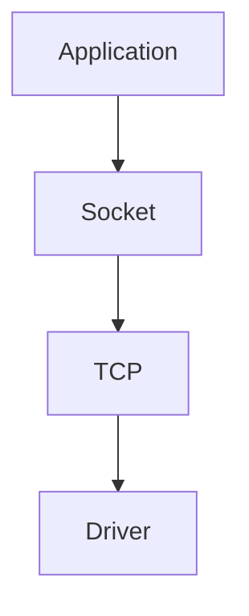
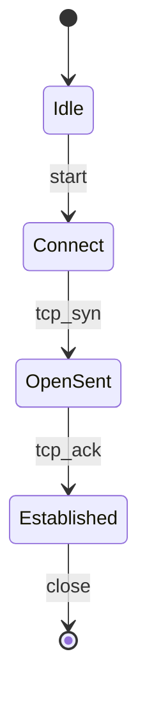
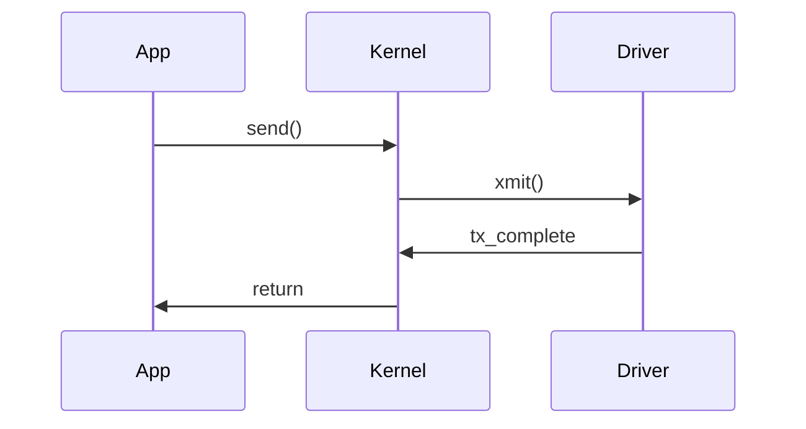
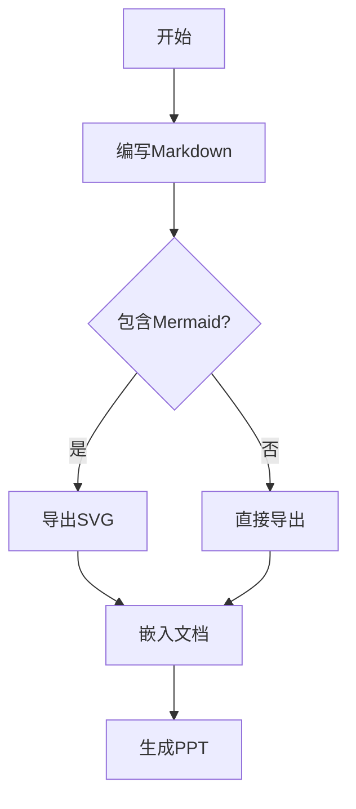
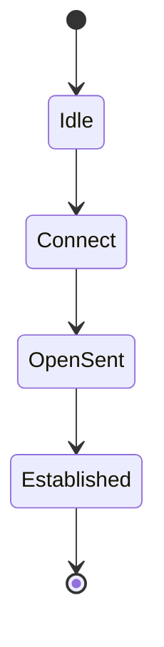

# 程序员 Markdown → Preview → PPT 工作流最佳实践

## 目录

- [一、核心目标](#一核心目标)
- [二、推荐技术栈](#二推荐技术栈)
- [三、推荐目录结构](#三推荐目录结构)
- [四、VSCode最佳实践](#四vscode最佳实践)
- [五、Marp幻灯片组织方式](#五marp幻灯片组织方式)
- [六、ASCII Diagram最佳实践](#六ascii-diagram最佳实践)
- [七、Mermaid最佳实践](#七mermaid最佳实践)
  - [Mermaid 导出 SVG](#mermaid-导出-svg)
- [八、ASCII与Mermaid分工](#八ascii与mermaid分工)
- [九、自动导出PPT](#九自动导出ppt)
- [十、一键构建](#十一键构建)
- [十一、自动监听生成](#十一自动监听生成)
- [十二、Git最佳实践](#十二git最佳实践)
- [十三、团队级最佳实践](#十三团队级最佳实践)
- [十四、常见问题解决](#十四常见问题解决)

---

## 一、核心目标

希望达到如下效果：

```text
                  ┌────────────────────┐
                  │   Markdown 源文件   │
                  │    docs/*.md       │
                  └─────────┬──────────┘
                            │
             ┌──────────────┼──────────────┐
             │              │              │
             ▼              ▼              ▼
      VSCode Preview     HTML网站      PPT演示文稿
             │              │              │
             │              │              │
             ▼              ▼              ▼
       日常编写阅读      在线分享       会议演示

                唯一事实来源（SSOT）
                      Markdown
```

### 最佳实践的核心原则

> **Markdown 是唯一源文件（Single Source of Truth）**

**❌ 不要维护：**

- `xxx.md`
- `xxx.pptx` 
- `xxx.html`

三份不同的内容文件。

**✅ 而是：**

```text
xxx.md
   │
   ├──► preview
   ├──► html
   ├──► pptx
   └──► pdf
```

所有格式均由 Markdown 自动生成。

---

## 二、推荐技术栈

### 方案选择

对于技术文档场景：

```text
                    Markdown
                        │
        ┌───────────────┼───────────────┐
        │                               │
        ▼                               ▼
     Marp生态                         Pandoc生态

     PPT导向                          文档导向

     演讲                              论文
     分享                              书籍
     培训                              PDF
```

### 程序员技术分享推荐方案

**推荐使用 Marp：**

```text
Markdown
   │
   ▼
Marp
   │
   ├── PPT
   ├── PDF
   ├── HTML
   └── Preview
```

**选择 Marp 的原因：**

- ✅ 原生支持 Markdown
- ✅ 原生支持 Mermaid
- ✅ VSCode 插件成熟
- ✅ PPT 导出效果优秀
- ✅ 动画控制简单
- ✅ 团队普遍采用

---

## 三、推荐目录结构

```text
tech-talk/
│
├── slides/
│   ├── frr-bgp.md
│   ├── dpdk-rx-path.md
│   └── linux-netdevice.md
│
├── images/
│   ├── architecture.png
│   ├── bgp-state.png
│   └── rx-flow.svg
│
├── themes/
│   └── company.css
│
├── scripts/
│   ├── build.sh
│   └── export.sh
│
└── output/
    ├── html/
    ├── pdf/
    └── pptx/
```

---

## 四、VSCode最佳实践

### 必需插件安装

```text
Marp for VS Code
Markdown All In One
Markdown Preview Mermaid Support
```

**安装命令：**

```bash
code --install-extension marp-team.marp-vscode
code --install-extension yzhang.markdown-all-in-one
code --install-extension bierner.markdown-mermaid
```

### 推荐配置

在 VSCode 的 `settings.json` 中添加以下配置：

```json
{
    "markdown.preview.breaks": true,
    "markdown.preview.scrollPreviewWithEditor": true,
    "marp.exportType": "pptx",
    "editor.wordWrap": "on",
    "markdown.extension.toc.updateOnSave": true,
    "markdown.extension.preview.autoShowPreviewToSide": true,
    "markdown.extension.tableFormatter.enabled": true
}
```

### 使用效果

```text
┌───────────────────────┬───────────────────────┐
│ Markdown Source       │ Live Preview          │
│                       │                       │
│ # DPDK RX Path        │ DPDK RX Path          │
│                       │                       │
│ mermaid {...}         │ rendered diagram      │
│                       │                       │
└───────────────────────┴───────────────────────┘
```

实现边写边看的实时预览效果。

### 快捷键配置

```json
{
    "key": "ctrl+shift+v",
    "command": "markdown.showPreviewToSide"
},
{
    "key": "ctrl+k v", 
    "command": "marp.showPreview"
}
```

---

## 五、Marp幻灯片组织方式

### 基本结构

**推荐的Marp文档结构：**

```markdown
---
marp: true
paginate: true
theme: default
size: 16:9
header: 'Linux网络子系统深度剖析'
footer: '© 2026 技术分享'
---

# Linux Netdevice
## 深入理解网络设备模型

---

# 目录

- 📚 Device Model 概述
- 🔧 net_device 结构
- 🗂️ sysfs 接口
- 💡 实践案例

---

# Device Model 概述

## Linux设备模型的核心概念

内容详述...

---

## 实际案例

具体代码示例...
```

### 重要概念

**分页标识符：**

```text
---
```

**表示：** 一页 PPT 幻灯片

**因此注意：**

```text
Markdown Section (# ## ###)
           ≠
      PPT Page (---)
```

**最佳实践：** 应该主动设计分页，而不是依赖标题自动分页。

### 常用主题

```markdown
# 内置主题
theme: default    # 默认主题
theme: gaia       # 现代风格
theme: uncover    # 简洁风格

# 自定义主题
theme: ./themes/company.css
```

---

## 六、ASCII Diagram最佳实践

这是技术文档中最常用的图表方式。

### 基本示例

```text
network interface
       │
       ▼
   net_device
       │
       ▼
     device
```

### 使用代码块包裹

**✅ 正确做法：**

```markdown
​```text
network interface
       │
       ▼
   net_device
       │
       ▼
     device
​```
```

**❌ 错误做法：**

不要直接写ASCII图而不用代码块包裹，否则：

- 字体对齐可能失效
- HTML导出可能错位  
- PPT导出可能错位

### 大型架构图示例

```text
                    net_device
                         │
      ┌──────────────────┼──────────────────┐
      │                  │                  │
      ▼                  ▼                  ▼
   eth0              bond0              vlan100
      │
      ▼
   device
      │
      ▼
   PCI device
```

### 设计建议

- **宽度：** ≤ 80字符
- **高度：** ≤ 20行
- **原因：** 超出限制在PPT中难以展示

### 常用符号

```text
连线符号：  │ ─ ┌ ┐ └ ┘ ├ ┤ ┬ ┴ ┼
箭头符号：  ↑ ↓ ← → ↖ ↗ ↘ ↙
方框符号：  ┌─┐ │ │ └─┘
```

---

## 七、Mermaid最佳实践
### 推荐用途

**Mermaid 适合绘制：**

- 🔄 状态机
- 📊 流程图  
- ⏱️ 时序图
- 🔗 调用链

**流程图示例：**



**状态机示例：**



**时序图示例：**



### 不推荐用途

**❌ 不要用 Mermaid 画：**

- Linux Device Model（层级结构）
- 复杂的树状结构
- 节点过多的架构图

**原因：**

- 层级太深
- 节点太多
- 字体太小
- 自动布局混乱

**例如这种结构：**

```text
PCI
 └── Device
      └── Driver
            └── net_device
```

**应该用 ASCII Diagram，更清晰易读。**

### Mermaid 导出 SVG

在某些场景下，需要将 Mermaid 图表导出为独立的 SVG 文件，用于：

- 📄 技术文档插图
- 🌐 网站静态资源
- 📊 高质量图表展示
- 🖼️ 其他格式转换的中间文件

#### 安装 Mermaid CLI

```bash
# 安装最新版本的 mermaid-cli
sudo npm install -g @mermaid-js/mermaid-cli@latest
```

#### 配置 Puppeteer 浏览器

Mermaid CLI 使用 Puppeteer 驱动 Chrome 浏览器进行图表渲染：

```bash
# 安装指定版本的 Chrome
npx puppeteer browsers install chrome@148.0.7778.97

# 查看已安装的浏览器
npx puppeteer browsers list
```

#### 创建 Puppeteer 配置

创建配置文件 `puppeteer-config.json`：

```bash
cat > puppeteer-config.json <<'EOF'
{
  "executablePath": "/home/morrism/.cache/puppeteer/chrome/linux-149.0.7827.22/chrome-linux64/chrome",
  "args": [
    "--no-sandbox",
    "--disable-setuid-sandbox",
    "--disable-dev-shm-usage",
    "--no-first-run"
  ]
}
EOF
```

**注意：** Chrome 路径可能因版本而异，使用 `npx puppeteer browsers list` 查看实际路径。

#### 转换 Mermaid 为 SVG

**创建 Mermaid 源文件 `workflow.mmd`：**



**执行转换命令：**

```bash
mmdc \
    -p puppeteer-config.json \
    -i workflow.mmd \
    -o workflow.svg
```

**输出结果：**

```text
Generating single mermaid chart
✅ workflow.svg 生成成功
```

#### 批量转换脚本

创建 `convert-mermaid.sh` 脚本：

```bash
#!/usr/bin/env bash

set -euo pipefail

MERMAID_DIR="diagrams"
OUTPUT_DIR="images"
CONFIG="puppeteer-config.json"

echo "🎨 开始转换 Mermaid 图表..."

# 创建输出目录
mkdir -p "$OUTPUT_DIR"

# 转换所有 .mmd 文件
for mermaid_file in "$MERMAID_DIR"/*.mmd; do
    if [[ -f "$mermaid_file" ]]; then
        filename=$(basename "$mermaid_file" .mmd)
        output_file="$OUTPUT_DIR/${filename}.svg"
        
        echo "📊 转换: $mermaid_file -> $output_file"
        
        mmdc \
            -p "$CONFIG" \
            -i "$mermaid_file" \
            -o "$output_file" \
            --quiet
    fi
done

echo "✅ 所有图表转换完成！"
ls -la "$OUTPUT_DIR"/*.svg
```

#### 在 Markdown 中使用 SVG

**直接嵌入：**

```markdown

```

**HTML 嵌入（更好的样式控制）：**

```html
<div align="center">
  
</div>
```

#### 与 Marp 集成

在 Marp 演示文稿中使用生成的 SVG：

```markdown
---
marp: true
---

# 系统架构


- 清晰的模块划分
- 标准的接口定义  
- 可扩展的设计

---
```

#### 自动化工作流

结合文件监听，实现自动转换：

```bash
# 监听 .mmd 文件变化，自动转换
chokidar "diagrams/*.mmd" -c "./convert-mermaid.sh"
```

#### 常见问题解决

**Chrome 路径错误：**

```bash
# 查找正确的 Chrome 路径
find ~/.cache/puppeteer -name chrome -type f 2>/dev/null
```

**权限问题：**

```bash
# 添加执行权限
chmod +x ~/.cache/puppeteer/chrome/*/chrome-linux64/chrome
```

**内存不足：**

在配置中添加内存限制：

```json
{
  "executablePath": "/path/to/chrome",
  "args": [
    "--no-sandbox",
    "--disable-setuid-sandbox",
    "--disable-dev-shm-usage",
    "--memory-pressure-off",
    "--max_old_space_size=4096"
  ]
}
```

---

## 八、ASCII与Mermaid分工

### 选择原则

```text
                 是否需要自动布局？
                         │
            ┌────────────┴────────────┐
            │                         │
           是                         否
            │                         │
            ▼                         ▼
        Mermaid                 ASCII Diagram
```

### Mermaid适合的场景

**适用类型：**
- 📊 流程图
- 🔄 状态机  
- ⏱️ 时序图
- 🔗 调用链

**示例：BGP 状态机**



### ASCII适合的场景

**适用类型：**
- 🌳 树结构
- 📶 层级结构
- 🔧 Linux对象关系
- 🏗️ 系统架构图

**示例：设备模型层次**

```text
net_device
     │
     ▼
 device
     │
     ▼
pci_dev
```

### 决策流程

1. **需要自动布局？** → 选择 Mermaid
2. **固定层级关系？** → 选择 ASCII
3. **交互流程？** → 选择 Mermaid  
4. **系统架构？** → 选择 ASCII

---

## 九、自动导出PPT

### 安装 Marp CLI

```bash
npm install -g @marp-team/marp-cli
```

### 导出PPT

```bash
marp slides.md --pptx
```

**生成流程：**

```text
slides.md
    │
    ▼
slides.pptx
```

### 导出其他格式

**导出 PDF：**
```bash
marp slides.md --pdf
```

**导出 HTML：**
```bash
marp slides.md --html
```

**导出所有格式：**
```bash
marp slides.md --pdf --pptx --html
```

### 高级导出选项

```bash
# 自定义主题
marp slides.md --theme ./themes/custom.css --pptx

# 指定输出目录
marp slides.md --output ./output/ --pptx

# 开启演讲者备注
marp slides.md --notes --pptx
```

---

## 十、一键构建

### 构建脚本

创建 `build.sh` 文件：

```bash
#!/usr/bin/env bash

set -euo pipefail

# 配置变量
SRC="slides/linux-netdevice.md"
OUT="output"
THEME="themes/company.css"
MERMAID_DIR="diagrams"
IMAGES_DIR="images"

# 创建输出目录
mkdir -p "$OUT" "$IMAGES_DIR"

echo "🚀 开始构建演示文稿..."

# 1. 转换 Mermaid 图表为 SVG
if [[ -d "$MERMAID_DIR" && -n "$(ls -A $MERMAID_DIR/*.mmd 2>/dev/null)" ]]; then
    echo "🎨 转换 Mermaid 图表..."
    for mermaid_file in "$MERMAID_DIR"/*.mmd; do
        if [[ -f "$mermaid_file" ]]; then
            filename=$(basename "$mermaid_file" .mmd)
            svg_output="$IMAGES_DIR/${filename}.svg"
            
            echo "  📊 $mermaid_file -> $svg_output"
            mmdc \
                -p puppeteer-config.json \
                -i "$mermaid_file" \
                -o "$svg_output" \
                --quiet || echo "  ⚠️ 转换失败: $mermaid_file"
        fi
    done
fi

# 2. 导出HTML
echo "📄 生成HTML..."
marp "$SRC" \
    --theme "$THEME" \
    --html \
    -o "$OUT/linux-netdevice.html"

# 3. 导出PDF  
echo "📑 生成PDF..."
marp "$SRC" \
    --theme "$THEME" \
    --pdf \
    -o "$OUT/linux-netdevice.pdf"

# 4. 导出PPTX
echo "🎯 生成PPTX..."
marp "$SRC" \
    --theme "$THEME" \
    --pptx \
    -o "$OUT/linux-netdevice.pptx"

echo "✅ 构建完成！"
echo "📁 输出文件："
ls -la "$OUT"
if [[ -d "$IMAGES_DIR" ]]; then
    echo "🖼️ 生成的SVG图表："
    ls -la "$IMAGES_DIR"/*.svg 2>/dev/null || echo "  (无SVG文件)"
fi
```

### 执行构建

```bash
chmod +x build.sh
./build.sh
```

### 生成结果

```text
output/
├── linux-netdevice.html
├── linux-netdevice.pdf
└── linux-netdevice.pptx
```

---

## 十一、自动监听生成

### 安装监听工具

```bash
# 安装文件监听工具
npm install -g chokidar-cli

# 或使用其他工具
npm install -g nodemon
```

### 设置自动监听

**使用 chokidar：**
```bash
chokidar "slides/*.md" -c "./build.sh"
```

**使用 nodemon：**
```bash
nodemon --watch slides/ --ext md --exec "./build.sh"
```

### 创建监听脚本

创建 `watch.sh` 文件：

```bash
#!/usr/bin/env bash

echo "🔍 开始监听 Markdown 文件变化..."
echo "📁 监听目录: slides/"
echo "🔄 变化时执行: ./build.sh"
echo ""

chokidar "slides/*.md" \
    --verbose \
    --command "./build.sh" \
    --initial
```

### 工作流程

```text
修改 Markdown
      │
      ▼
自动保存
      │
      ▼
触发 build.sh
      │
      ▼
重新生成 PPT
      │
      ▼
立即查看效果
```

### 开发模式启动

```bash
# 启动监听模式
./watch.sh

# 或直接使用
chokidar "slides/*.md" -c "./build.sh" --initial
```

**实现效果：** 修改保存后，PPT自动重新生成！

---

## 十二、Git最佳实践

### 版本控制策略

**✅ 应该提交到Git：**

```text
Git Repository
 │
 ├── 📝 Markdown 源文件
 ├── 🎨 Mermaid 图表  
 ├── 🖼️ Images 资源
 ├── 🎨 Theme 主题
 ├── 🔧 Build Scripts
 └── 📋 配置文件
```

**❌ 不要提交到Git：**

- `*.pptx` - PPT文件
- `*.pdf` - PDF文件  
- `output/` - 生成文件目录

### .gitignore 配置

```gitignore
# 构建输出
output/
dist/
build/

# 生成文件
*.pptx
*.pdf
*.html

# 临时文件
.DS_Store
Thumbs.db
*.tmp

# Node modules
node_modules/
```

### CI/CD 自动生成

**GitHub Actions 示例：**

```yaml
name: Build Presentations

on:
  push:
    branches: [ main ]
  pull_request:
    branches: [ main ]

jobs:
  build:
    runs-on: ubuntu-latest
    
    steps:
    - uses: actions/checkout@v3
    
    - name: Setup Node.js
      uses: actions/setup-node@v3
      with:
        node-version: '18'
        
    - name: Install Marp
      run: npm install -g @marp-team/marp-cli
      
    - name: Build presentations  
      run: ./build.sh
      
    - name: Upload artifacts
      uses: actions/upload-artifact@v3
      with:
        name: presentations
        path: output/
```

---

## 十三、团队级最佳实践

### 推荐架构

```text
                    Git Repository
                           │
                           ▼
                    docs/*.md
                           │
          ┌────────────────┼────────────────┐
          │                │                │
          ▼                ▼                ▼
     VSCode Preview      HTML           PPTX
          │                │                │
          ▼                ▼                ▼
       日常编写          在线阅读         会议分享

                Single Source of Truth
                       Markdown
```

### 最终推荐方案（长期维护）

| 组件 | 推荐方案 | 原因 |
|------|----------|------|
| **编辑器** | VSCode | 插件丰富，预览良好 |
| **格式** | Markdown | 简洁、版本控制友好 |
| **图表** | ASCII + Mermaid | 互补，覆盖所有场景 |
| **预览** | Marp Preview | 实时预览，所见即所得 |
| **导出** | Marp CLI | 多格式支持，质量高 |
| **自动化** | Scripts + 监听 | 提高效率，减少重复 |
| **版本管理** | Git | 标准实践 |
| **核心原则** | Markdown SSOT | 单一数据源 |

### 适用场景

对于 **Linux 网络协议栈、DPDK、FRR、Device Model** 这类技术分享，最稳定且维护成本最低的实践是：

```text
Markdown
   + ASCII Diagram  (架构图、层级关系)
   + Mermaid        (流程图、状态机)
   + Marp           (PPT生成)
   + Scripts        (自动化)

        ↓ 自动生成

    📖 Preview     (日常阅读)
    🌐 HTML        (在线分享)  
    📄 PDF         (文档存档)
    🎯 PPTX        (会议演示)
```

### 核心优势

- ✅ **单一维护：** 只需要维护 `.md` 文件
- ✅ **多种输出：** 同时满足4种使用场景
- ✅ **版本控制：** Git 友好，便于协作
- ✅ **自动化：** 减少重复工作
- ✅ **标准化：** 团队统一工作流

---

## 十四、常见问题解决

### 中文字体问题

**问题：** 生成的PPT中文字体显示异常

**解决：** 在CSS主题中指定中文字体

```css
/* themes/chinese.css */
section {
    font-family: "Microsoft YaHei", "SimHei", sans-serif;
}

code {
    font-family: "Consolas", "Monaco", "Courier New", monospace;
}
```

### 图片路径问题

**问题：** 图片在不同格式中显示不一致

**解决：** 使用相对路径，并确保目录结构

```markdown

```

```text
project/
├── slides/
│   └── presentation.md
├── images/
│   └── architecture.png
└── output/
```

### Mermaid渲染问题

**问题：** Mermaid图表在某些格式中不显示

**解决：** 检查语法，使用标准格式

```markdown
<!-- 正确格式 -->


<!-- 错误格式 -->

```

### 导出失败问题

**问题：** `marp` 命令执行失败

**解决步骤：**

1. 检查安装：`marp --version`
2. 检查文件路径是否正确
3. 检查Markdown语法是否有错误
4. 查看详细错误信息：`marp slides.md --pptx --verbose`

### 性能优化

**大文件处理：**

- 拆分大文件为多个小文件
- 优化图片大小和格式
- 使用增量构建

**构建加速：**

```bash
# 只构建变更的文件
marp slides/changed.md --pptx

# 并行构建多个文件
parallel marp {} --pptx ::: slides/*.md
```

### 协作最佳实践

1. **统一环境：** 团队使用相同的Marp版本
2. **共享主题：** 统一的CSS主题文件
3. **文档规范：** 制定Markdown编写规范
4. **自动检查：** CI中加入语法检查

---

## 总结

通过这套工作流，你可以：

- 📝 专注于内容创作，而非格式调整
- 🔄 一次编写，多格式输出
- 👥 团队协作友好，版本控制清晰
- 🚀 自动化程度高，效率提升显著

**记住核心原则：Markdown as Single Source of Truth** 

让技术分享回归本质—— **好内容** 📚