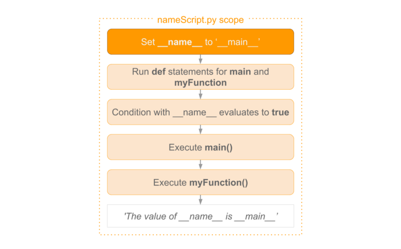

# Marp 语法速查指南

Marp 是一个基于 Markdown 的演示文稿工具，让你可以用简单的 Markdown 语法创建漂亮的幻灯片。

## 基本设置

### 启用 Marp
```markdown
---
marp: true
---
```

### 主题设置
```markdown
---
marp: true
theme: default
# 可选主题: default, gaia, uncover
---
```

### 页面设置
```markdown
---
marp: true
theme: default
size: 16:9
# 可选尺寸: 16:9, 4:3, A4
paginate: true
# 显示页码
---
```

## 幻灯片分隔

### 创建新幻灯片
```markdown
---
# 第一张幻灯片

内容...

---
# 第二张幻灯片

内容...
```

## 文本格式

### 标题层级
```markdown
# 一级标题
## 二级标题  
### 三级标题
#### 四级标题
```

### 文本样式
```markdown
**粗体文本**
*斜体文本*
~~删除线~~
`行内代码`

> 引用文本
```

### 列表
```markdown
<!-- 无序列表 -->
- 项目 1
- 项目 2
  - 子项目 2.1
  - 子项目 2.2

<!-- 有序列表 -->
1. 第一项
2. 第二项
3. 第三项
```

## 布局和样式

### 居中对齐
```markdown
<!-- _class: lead -->
# 居中标题

居中内容
```

### 分栏布局
```markdown
<div class="columns">
<div>

### 左栏
- 内容 1
- 内容 2

</div>
<div>

### 右栏
- 内容 3  
- 内容 4

</div>
</div>
```

### 背景色和文字颜色
```markdown
<!-- _backgroundColor: "#003d82" -->
<!-- _color: "#ffffff" -->

# 白色文字蓝色背景
```

## 图片和媒体

### 插入图片
```markdown


<!-- 设置图片大小 -->


<!-- 图片位置 -->
          # 背景图
          # 左侧背景
     # 右侧40%背景
```

### 背景图片
```markdown

           # 适应尺寸
       # 包含完整图片
         # 覆盖整个背景
```

## 代码块

### 基本代码块
````markdown
```python
def hello_world():
    print("Hello, Marp!")
    return True
```
````

### 高亮特定行
````markdown
```python
def calculate(x, y):
    result = x + y    # 这行会被高亮
    return result
```
````

## 数学公式

### 行内公式
```markdown
这是行内公式 $E = mc^2$ 的示例
```

### 块级公式
```markdown
$$
\sum_{i=1}^{n} x_i = x_1 + x_2 + \cdots + x_n
$$
```

## 表格

```markdown
| 列1 | 列2 | 列3 |
|-----|-----|-----|
| 数据1 | 数据2 | 数据3 |
| 数据4 | 数据5 | 数据6 |
```

## 高级功能

### 渐进式显示 (Fragment)
```markdown
- 第一个要点 <!-- .element: class="fragment" -->
- 第二个要点 <!-- .element: class="fragment" -->
- 第三个要点 <!-- .element: class="fragment" -->
```

### 自定义 CSS 类
```markdown
<!-- _class: invert -->
# 反色主题幻灯片

<!-- _class: lead -->  
## 居中显示的幻灯片
```

### 页面指令
```markdown
<!-- _paginate: false -->     # 隐藏页码
<!-- _header: "演示标题" -->    # 添加页眉
<!-- _footer: "作者名" -->      # 添加页脚
```

## 实用示例

### 完整的幻灯片模板
```markdown
---
marp: true
theme: default
size: 16:9
paginate: true
---

<!-- _class: lead -->
# 我的演示
## 副标题
**作者：张三**
2024年6月

---

# 目录

1. 介绍
2. 主要内容
3. 总结
4. 问答

---

## 介绍


- **背景**: 项目需求
- **目标**: 解决问题
- **方法**: 技术方案

---

<!-- _backgroundColor: "#f0f0f0" -->

## 主要内容

<div class="columns">
<div>

### 技术栈
- React
- Node.js
- MongoDB

</div>
<div>

### 特性
- 响应式设计
- 实时更新
- 安全认证

</div>
</div>

---

## 代码示例

```javascript
// 用户认证
async function authenticate(username, password) {
    const user = await User.findOne({ username });
    if (user && user.validatePassword(password)) {
        return jwt.sign({ id: user._id }, SECRET_KEY);
    }
    throw new Error('认证失败');
}
```

---

<!-- _class: lead -->

# 谢谢！

## 有什么问题吗？

**联系方式**: example@email.com
```

## 常用技巧

1. **预览幻灯片**: 使用 Marp 扩展或 CLI 工具
2. **导出格式**: 支持 PDF、HTML、PowerPoint 等
3. **主题定制**: 可以创建自定义 CSS 主题
4. **实时预览**: VS Code 中安装 Marp 扩展
5. **命令行使用**: `marp slides.md --pdf` 导出 PDF

## 调试建议

- 检查 YAML front matter 语法
- 确保幻灯片分隔符 `---` 独占一行
- 图片路径使用相对路径
- CSS 类名前加下划线 `_class`
- 背景设置使用 `bg` 关键词

---

*更多详细信息请参考 [Marp 官方文档](https://marp.app/)*