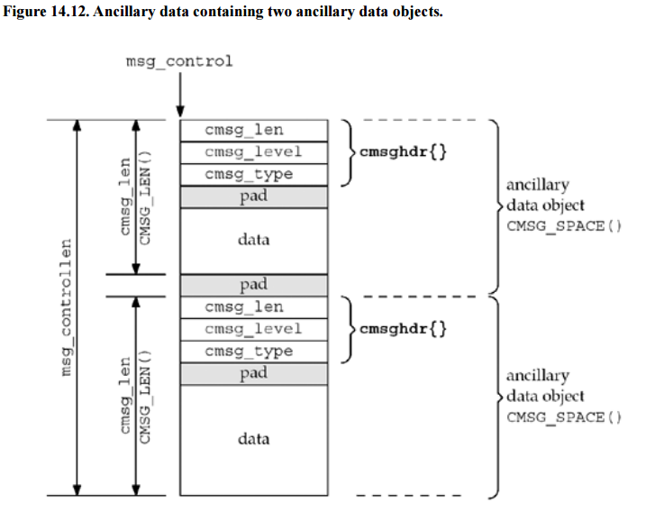

```bash
struct msghdr {
   // 1.socket address members
   void *msg_name;
   socklen_t msg_namelen;

   // 2.I/O vector references
   struct iovec *msg_iov;
   size_t msg_iovlen;

   // 3.Ancillary data buffer members
   void *msg_control;
   size_t msg_controllen;

   // 4.Received message flag bits
   int msg_flags;
};

结构体成员可以分为4个部分：
1.msg_name and msg_namelen.
	These members are required only when your socket is a datagram socket.
	The msg_name member points to the socket address that you are sending to or receiving from.
	The member msg_namelen indicates the length of this socket address.
	When calling recvmsg(2), msg_name will point to a receiving area for the address being received.
	When calling sendmsg(2), this will point to the destination address that the datagram is being addressed to.
2.I/O vector references msg_iov and msg_iovlen.
	These members specify where your I/O vector array is and how many entries it contains.
	The msg_iov member points to the struct iovec array(points to your buffers).
	The member msg_iovlen indicates how many elements are in your I/O vector array
3.Ancillary data buffer members msg_control and msg_controllen.
	These members will point to your ancillary data buffer and indicate the buffer size (recall that ancillary data is also known as control data).
	The member msg_control points to the ancillary data buffer whereas msg_controllen indicates the size of that buffer.
4.Received message flag bits msg_flags.
	This member is used for receiving special flag bits when recvmsg(2) is used (it is not used for sendmsg(2)).
	MSG_EOR
	MSG_TRUNC
	MSG_CTRUNC
	MSG_OOB
	MSG_ERRQUEUE
More information can be located in the man pages for recvmsg(2) and sendmsg(2) for those who are curious.

相关的结构体定义

struct iovec {                    /* Scatter/gather array items */
    void  *iov_base;              /* Starting address */
    size_t iov_len;               /* Number of bytes to transfer */
};


struct msghdr {
    void         *msg_name;       /* Optional address */
    socklen_t     msg_namelen;    /* Size of address */
    struct iovec *msg_iov;        /* Scatter/gather array */
    size_t        msg_iovlen;     /* # elements in msg_iov */
    void         *msg_control;    /* Ancillary data, see below */
    size_t        msg_controllen; /* Ancillary data buffer len */
    int           msg_flags;      /* Flags on received message */
};

struct cmsghdr {
	size_t cmsg_len;    /* Data byte count, including header(type is socklen_t in POSIX) */
	int    cmsg_level;  /* Originating protocol */
	int    cmsg_type;   /* Protocol-specific type */
	/* followed by
	unsigned char cmsg_data[]; */
};
```


```bash
Example:

sockopt = 1;
r = setsockopt(fd, SOL_PACKET, PACKET_AUXDATA, &sockopt, sizeof(sockopt));
if(r == -1) {
	printf("setsockopt error: pkt auxdata, ifname %s: %s", if_name, strerror(errno));
	close(fd);
	return -1;
}

int
eth_read(int fd, uint8_t *buf, int n, uint16_t *vlantag)
{
	int bytes;
	struct iovec iov;
	struct msghdr msg;
	struct cmsghdr *cmsg;
	struct tpacket_auxdata	*aux;
	uint8_t	cmsgbuf[CMSG_SPACE(sizeof(struct tpacket_auxdata))];

	iov.iov_base = buf;
	iov.iov_len = n;

	memset(&msg, 0, sizeof(msg));
	msg.msg_iov = &iov;
	msg.msg_iovlen = 1;
	msg.msg_control = cmsgbuf;
	msg.msg_controllen = sizeof(cmsgbuf);

	for(;;) {
		bytes = recvmsg(fd, &msg, 0);
		if(bytes < 0) {
			if(errno == EINTR)
				continue;

			DPL_LOG2(&ctx->lcfg, LG_SRCAPP, LG_ERR, "fmansim ethif: packet read error");
			return bytes;
		}
		/* Received a good packet */
		break;
	}

	/* Read the aux data that has slot vlan information */
	for(cmsg = CMSG_FIRSTHDR(&msg); cmsg; cmsg = CMSG_NXTHDR(&msg, cmsg)) {
		if(cmsg->cmsg_level == SOL_PACKET
		&& cmsg->cmsg_type == PACKET_AUXDATA) {
			aux = (struct tpacket_auxdata *)CMSG_DATA(cmsg);

			if(aux->tp_vlan_tci == 0) {
				continue;
			}

			*vlantag = aux->tp_vlan_tci & 0x0fff;
			break;
		}
	}

	return bytes;
}
```

- [UNIX网络编程读书笔记：辅助数据](https://www.cnblogs.com/nufangrensheng/p/3607487.html)
- [struct msghdr linux](http://www.ccplusplus.com/2012/02/struct-msghdr-linux.html)
- [recvmsg](https://man.cx/recvmsg(2))
- [access ancillary data](https://man.cx/cmsg(3))
- [tpacket_auxdata](https://man7.org/linux/man-pages/man7/packet.7.html)
- [CMSG_DATA(3)](https://www.daemon-systems.org/man/CMSG_DATA.3.html)
- [packet(7)](https://man7.org/linux/man-pages/man7/packet.7.html)
- [cmsg(3)](https://man7.org/linux/man-pages/man3/cmsg.3.html)
- [UNIX Network Programming, Volume 1, Third Edition, The Sockets Networking API](https://github.com/sqm2050/wiki/blob/master/Books/c%26programme/UNIX%20Network%20Programming%2C%20Volume%201%2C%20Third%20Edition%2C%20The%20Sockets%20Networking%20API.pdf) #pdf
- [struct cmsghdr cmsg](http://www.ccplusplus.com/2012/02/struct-cmsghdr-cmsg.html)

```bash
PACKET_AUXDATA (since Linux 2.6.21)
If this binary option is enabled, the packet socket passes a metadata structure **along with each packet in the recvmsg(2) control field**.  The structure can be read with cmsg(3).  It is defined as
struct tpacket_auxdata {
	__u32 tp_status;
	__u32 tp_len;      /* packet length */
	__u32 tp_snaplen;  /* captured length */
	__u16 tp_mac;
	__u16 tp_net;
	__u16 tp_vlan_tci;
	__u16 tp_vlan_tpid; /* Since Linux 3.14; earlier, these were unused padding bytes */
};
```