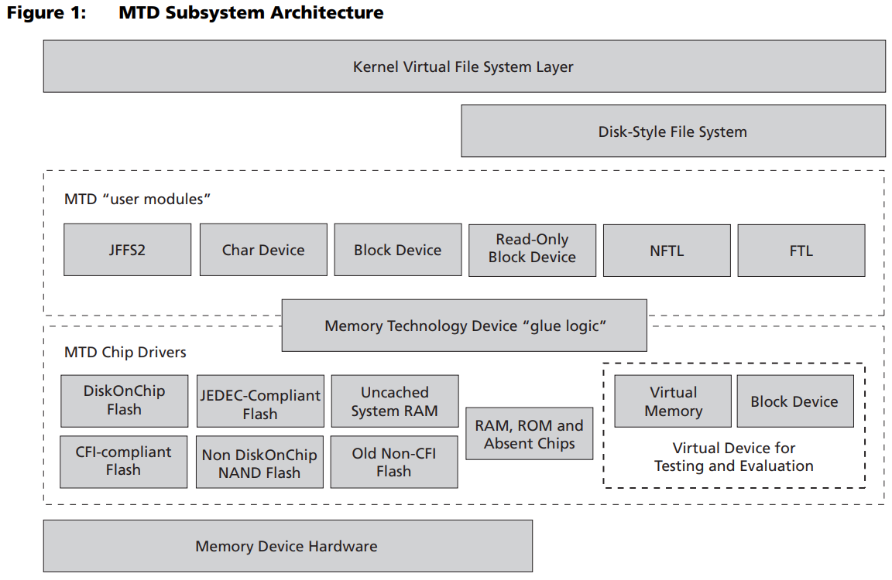

- MTD(memory technology device)内存技术设备是用于访问memory设备(ROM，flash)的linux子系统，主要目的是为了简化memory设备的驱动，在硬件和上层之间提供了一个抽象的接口。MTD源代码位于`/drivers/mtd`目录下，MTD设备从设备节点到底层硬件驱动可分为四层：设备节点，MTD设备层，MTD原始设备层，硬件驱动层。
- > In Linux terminology, the MTD is a segment of the kernel structure that provides a
  uniform and unified layer to enable a seamless combination of low-level chip drivers
  with higher-level interfaces called user modules. As far as modules are concerned, a
  distinction must be made between user modules and kernel modules.
  The MTD enables embedded system developers to rely on a uniform set of common
  capabilities among various technologies, rather than use tools and methods specific to
  that type of device.
- 
- MTD字符设备
  collapsed:: true
	- MTD字符设备驱动程序允许直接访问falsh器件，通常用来在flash上创建文件系统，也可以用来直接访问不频繁修改的是数据
	- `/dev/mtdN`是linux中的MTD架构中，系统自己实现的mtd分区所对应的字符设备（将mtd设备分成多个区，每个区为一个字符设备），字符驱动中添加了一些ioctl命令，如MEMGETINFO，MEMERASE等。mtd-util中的flash_eraseall等命令都是基于ioctl进行实现的falsh操作。
	- mtd字符设备的主设备号是90
		- ```c
		  #define MTD_CHAR_MAJOR   90
		  #define MTD_BLOCK_MAJOR 31
		  ```
	- 对mtd字符设备的操作，比如用nandwrite对`/dev/mtd0`写数据，实际就是操作`/dev/mtdblock0`，操作涉及到的偏移量offset指的是mtd分区内的偏移，比如向`/dev/mtd1`的offset为0的位置写入数据，实际操作的是物理偏移offset=`/dev/mtd0`的大小为1MB(0x100000)的位置
		- ```bash
		  # cat /proc/partitions
		  major minor #blocks name
		  
		  31     0       1024 mtdblock0
		  31     1       8192 mtdblock1
		  ......
		  ```
	- dump nand flash数据
	  collapsed:: true
		- 使用nanddump命令
			- 相比较于dd命令，nanddump的结果包含metadata Out-Of-Band (OOB)数据
			- ```bash
			  root@slot-120:~ [P1]# nanddump -c /dev/mtd2 | grep -C 3 "gs_profile.sh"
			  ECC failed: 0
			  ECC corrected: 0
			  Number of bad blocks: 2
			  Number of bbt blocks: 0
			  Block size 524288, page size 4096, OOB size 224
			  Dumping data starting at 0x00000000 and ending at 0x06400000...
			  0x02538e20: 00 00 00 00 d9 e6 12 c9 19 85 e0 01 00 00 00 35  |...............5|
			  0x02538e30: c4 4d 19 44 00 00 02 39 00 00 00 05 00 00 02 3a  |.M.D...9.......:|
			  0x02538e40: 63 41 29 c0 0d 08 0f 08 bb 37 b9 33 08 ca 68 b9  |cA)......7.3..h.|
			  0x02538e50: 67 73 5f 70 72 6f 66 69 6c 65 2e 73 68 ff ff ff  |gs_profile.sh...|
			  0x02538e60: 19 85 e0 02 00 00 01 d6 a3 f5 e1 17 00 00 02 3a  |...............:|
			  0x02538e70: 00 00 00 02 00 00 81 a4 00 00 00 00 00 00 02 ba  |................|
			  0x02538e80: 63 41 29 c0 63 41 29 c0 63 41 29 c0 00 00 00 00  |cA).cA).cA).....|
			  ```
		- 使用dd命令
			- ```bash
			  root@slot-120:~ [P1]# dd if=/dev/mtd2 of=/tmp/mtd2.dump bs=512 count=1
			  1+0 records in
			  1+0 records out
			  512 bytes copied, 0.000955015 s, 536 kB/s
			  root@slot-120:~ [P1]# hexdump -C /tmp/mtd2.dump
			  00000000  19 85 e0 02 00 00 03 38  d6 71 4c ea 00 00 13 82  |.......8.qL.....|
			  00000010  00 00 05 4c 00 00 81 ed  00 00 00 00 00 1d 2a 40  |...L..........*@|
			  00000020  5a a2 7f 70 5a a2 7f 70  63 41 29 f3 00 09 3c 0f  |Z..pZ..pcA)...<.|
			  00000030  00 00 02 f4 00 00 03 f1  06 00 00 00 ef f0 fc 69  |...............i|
			  00000040  6d 5a f4 8b 78 5e a4 92  3b 68 14 51 14 86 ff d9  |mZ..x^..;h.Q....|
			  00000050  8c ec 6c 10 1c 65 d0 a8  41 23 36 bb 3a ae 26 24  |..l..e..A#6.:.&$|
			  00000060  b0 93 c4 64 46 2d d6 6c  d0 71 49 34 f8 4a 7c 14  |...dF-.l.qI4.J|.|
			  00000070  96 26 12 d8 62 ee bc d2  08 5a b8 b3 0a 6a a5 68  |.&..b....Z...j.h|
			  00000080  e1 ab b0 09 d8 08 bb 5b  c8 96 11 44 82 85 24 31  |.......[...D..$1|
			  00000090  45 44 c1 07 04 42 4c bc  9e ab 09 58 0a 16 17 2e  |ED...BL....X....|
			  000000a0  dc 73 ce ff df ef 3f 99  c8 42 e6 78 0b 36 06 2d  |.s....?..B.x.6.-|
			  000000b0  80 93 98 83 59 55 06 8c  16 34 8c 9d 9d d5 9c f5  |....YU...4......|
			  000000c0  59 04 5d 4b 9f a3 00 66  74 1f 87 c2 bb 90 c3 c7  |Y.]K...ft.......|
			  ......
			  ```
		- 使用C程序
			- 获取MTD设备信息
				- 使用ioctl MEMGETINFO命令
				- ```c
				  #include <stdio.h>
				  #include <fcntl.h>
				  #include <sys/ioctl.h>
				  #include <mtd/mtd-user.h>
				   
				  int main()
				  {
				      mtd_info_t mtd_info;
				      int fd = open("/dev/mtd5", O_RDWR);
				  ioctl(fd, MEMGETINFO, &mtd_info);
				   
				      printf("MTD type: %u\n", mtd_info.type);
				      printf("MTD total size : %u bytes\n", mtd_info.size);
				      printf("MTD erase size : %u bytes\n", mtd_info.erasesize);
				   
				      return 0;
				  }
				  ```
			- 读取MTD设备
				- ```c
				  /* read something from last sector */
				  unsigned char buf[64];
				  lseek(fd, -mtd_info.erasesize, SEEK_END);
				  read(fd, buf, sizeof(buf));
				  ```
			- 擦除MTD设备
				- 擦除MTD分区，sector by sector
					- ```c
					  void erase_partition(mtd_info_t *mtd_info, int fd) {
					      erase_info_t ei;
					      ei.length = mtd_info->erasesize;
					    
					      for(ei.start = 0; ei.start < mtd_info->size; ei.start += mtd_info->erasesize) {
					          ioctl(fd, MEMUNLOCK, &ei);
					          ioctl(fd, MEMERASE, &ei);
					      }
					  }
					  ```
					- 删除擦除操作后，MTD设备的所有sector都可写了
					- 需要注意的是，在MEMERASE之前需要MEMUNLOCK，这对于擦除操作是必须的
			- 写入MTD设备
				- 假定MTD设备的sector已被擦除，此时可以利用和读取类似的方法进行写入
			- 完整示例代码
				- ```c
				  #include <stdio.h>
				  #include <fcntl.h>
				  #include <sys/ioctl.h>
				  #include <mtd/mtd-user.h>
				  
				  #include <string.h>
				  #include <unistd.h>
				  #include <errno.h>
				  #include <stdlib.h>
				  
				  #define CERT_PARTITION_SIZE 0x10000
				  #define CERT_SIZE sizeof(int)
				  #define MTD_NORFLASH 3
				  
				  int
				  mtd_read(const char *partition, int offset, const char *file)
				  {
				  	char *buf;
				  	int size, rc, fd, outfd;
				  	mtd_info_t mtdinfo;
				  
				  	fd = -1;
				  	outfd = -1;
				  	rc = 0;
				  	buf = NULL;
				  
				  	fd = open(partition, O_RDONLY);
				  	if(fd < 0) {
				  		printf("open %s failed!\n", partition);
				  		rc = -1;
				  		goto out;
				  	}
				  	
				  	if(ioctl(fd, MEMGETINFO, &mtdinfo) < 0) {
				  		printf("Cannot get MTD information");
				  		rc = -1;
				  		goto out;
				  	}
				  
				  	printf("MTD type: %u\n", mtdinfo.type);
				  	printf("MTD total size : %u bytes\n", mtdinfo.size);
				  	printf("MTD erase size : %u bytes\n", mtdinfo.erasesize);
				  
				  	if(mtdinfo.type != MTD_NORFLASH) {
				  		printf("Invalid flash type %d\n", mtdinfo.type);
				  		rc = -1;
				  		goto out;
				  	}
				  
				  	if(lseek(fd, offset, SEEK_SET) != offset) {
				  		printf("Failed to move to offset %d", offset);
				  		rc = -1;
				  		goto out;
				  	}
				  
				  	/*
				  	 * Read the size of certificate from the flash
				  	 */
				  	rc = read(fd, (char*)(&size), CERT_SIZE);
				  	if(rc < 0) {
				  		printf("Read size file failed, error %s\n", strerror(errno));
				  		goto out;
				  	}
				  
				  	// temporarily set size to 0x8000 for test purpose
				  	size = 0x8000 - CERT_SIZE;
				  
				  	if(size == 0xFFFFFFFF) {
				  		printf("Size not written to flash, certificate not flashed\n");
				  		/*
				  		 * Return 1 to indicate certificate is not flashed
				  		 */
				  		rc = 1;
				  		goto out;
				  	}
				  
				  	if(size > (CERT_PARTITION_SIZE - CERT_SIZE)) {
				  		printf("Invalid cert size %d\n", size);
				  		rc = -1;
				  		goto out;
				  	}
				  
				  	buf = calloc(CERT_SIZE + size, sizeof(char));
				  	if(buf == NULL) {
				  		printf("Not enough memory(%d bytes)\n",
				  					size);
				  		rc = -1;
				  		goto out;
				  	}
				  
				  	/*
				  	 * Read the certificate content
				  	 */
				  	rc = read(fd, buf, size);
				  	if(rc < 0) {
				  		printf("Read certificate failed size %d, error %s\n",
				  						size, strerror(errno));
				  		goto out;
				  	}
				  
				  	if(0)
				  		printf("%d:rc =%d\n", __LINE__, rc);
				  
				  	if(rc != size) {
				  		printf("Failed to read %dB, read %dB\n", size, rc);
				  		rc = -1;
				  		goto out;
				  	}
				  
				  	outfd = open(file, O_CREAT|O_WRONLY, 0664);
				  	if(outfd < 0) {
				  		printf("Failed to open file %s, error %s\n",
				  						file, strerror(errno));
				  		rc = -1;
				  		goto out;
				  	}
				  
				  	rc = write(outfd, buf, size);
				  	if(rc < 0) {
				  		printf("Write failed size %d, error %s\n",
				  						size, strerror(errno));
				  		rc = -1;
				  		goto out;
				  	}
				  
				  	if(rc != size) {
				  		printf("Failed to write %d bytes, wrote %d bytes\n",
				  					size, rc);
				  		rc = -1;
				  		goto out;
				  	}
				  
				  	if(0)
				  		printf("%d:Size =%d, to %s\n", __LINE__, size, file);
				  
				  	rc = 0;
				  
				  out:
				  	if(buf != NULL)
				  		free(buf);
				  	if(fd >= 0)
				  		close(fd);
				  	if(outfd >= 0)
				  		close(outfd);
				  
				  	return rc;
				  }
				  
				  int main(void)
				  {
				  	int r;
				  	const char *partition = "/dev/mtd14";
				  	const char *file = "/tmp/cert.txt";
				  
				  	printf("my test program\n");
				  
				  	r = mtd_read(partition, 0, file);
				  	if(r < 0) {
				  		printf("mtd_read failed!\n");
				  		return -1;
				  	}
				  
				  	return 0;
				  }
				  ```
- MTD块设备
  collapsed:: true
	- MTD块设备驱动程序可以让flash器件伪装成块设备，实际上它通过把整块的erase block放到RAM里面进行访问，然后再更新到flash，用户可以在这个块设备上创建通常的文件系统。
	- `/de/mtdblockN`是[[nand]] Flash驱动中通过add_mtd_partitions添加MTD设备分区(将mtd设备进行不同的分区，mtdblock分区与mtd分区是对应的)而生成的块设备。
	- mtd块设备的主设备号是31
	- mtd块设备的大小
		- ```bash
		  root@slot-120:/opt/cal# cat /proc/partitions
		  major minor  #blocks  name
		    31        0       6144 mtdblock0
		    31        1        512 mtdblock1
		    31        2     102400 mtdblock2
		    31        3     382464 mtdblock3
		  ......
		  块设备的大小以block的数目来标识，每个block是1KB
		  ```
	- 每个字符设备对应着每个块设备，即`/dev/mtd0`对应着`/dev/mtdblock0`，因此mtdblockN的属性也就是mtdN的属性，比如大小
	- mtdinfo 命令
		- ```bash
		  root@slot-120:~ [P1]# mtdinfo
		  Count of MTD devices:           23
		  Present MTD devices:            mtd0, mtd1, mtd2, mtd3, mtd4, mtd5, mtd6, mtd7, mtd8, mtd9, mtd10, mtd11, mtd12, mtd13, mtd14, mtd15, mtd16, mtd17, mtd18, mtd19, mtd20, mtd21, mtd22
		  Sysfs interface supported:      yes
		  
		  root@slot-120:~ [P1]# mtdinfo /dev/mtd2
		  mtd2
		  Name:                           RFS1
		  Type:                           nand
		  Eraseblock size:                524288 bytes, 512.0 KiB
		  Amount of eraseblocks:          200 (104857600 bytes, 100.0 MiB)
		  Minimum input/output unit size: 4096 bytes
		  Sub-page size:                  4096 bytes
		  OOB size:                       224 bytes
		  Character device major/minor:   90:4
		  Bad blocks are allowed:         true
		  Device is writable:             true
		  ```
	- flash_erase命令
		- ```bash
		  root@slot-18:~ [P2]# flash_erase --help
		  Usage: flash_erase [options] MTD_DEVICE <start offset> <block count>
		  Erase blocks of the specified MTD device.
		  Specify a count of 0 to erase to end of device.
		  
		    -j, --jffs2       format the device for jffs2
		    -N, --noskipbad   don't skip bad blocks
		    -u, --unlock      unlock sectors before erasing
		    -q, --quiet       do not display progress messages
		        --silent      same as --quiet
		        --help        display this help and exit
		        --version     output version information and exit
		  
		  # 擦除mtd分区，之后写入内容
		  flash_erase /dev/mtd5 0 1
		  nandwrite -pq /dev/mtd5 b4860g100-usdpaa-2013-09-21-05-15-insop.dtb
		  
		  flash_erase -q /dev/mtd6 0 0
		  mount -t jffs2 /dev/mtdblock6 /mnt/t1
		  tar -zxf fsl-image-g100-b4860qds-20130921091716.rootfs.insop.tgz -C /mnt/t1
		  ```
- [[nand]]
- [[jffs2]]
- [[UBIFS]]
- 常用命令
	- `cat /proc/mtd`
	- flash_erase
	- mtd_debug
		- ```bash
		  root@slot-120:~ [P2]# mtd_debug --help
		  usage: mtd_debug info <device>
		         mtd_debug read <device> <offset> <len> <dest-filename>
		         mtd_debug write <device> <offset> <len> <source-filename>
		         mtd_debug erase <device> <offset> <len>
		  
		  root@slot-120:~ [P2]# mtd_debug info /dev/mtd2
		  mtd.type = MTD_NANDFLASH
		  mtd.flags = MTD_CAP_NANDFLASH
		  mtd.size = 104857600 (100M)
		  mtd.erasesize = 524288 (512K)
		  mtd.writesize = 4096 (4K)
		  mtd.oobsize = 224
		  regions = 0
		  
		  root@slot-120:~ [P2]# mtd_debug info /dev/mtd11
		  mtd.type = MTD_NORFLASH
		  mtd.flags = MTD_CAP_NORFLASH
		  mtd.size = 1048576 (1M)
		  mtd.erasesize = 4096 (4K)
		  mtd.writesize = 1
		  mtd.oobsize = 0
		  regions = 0
		  
		  root@slot-120:~ [P2]# mtdinfo /dev/mtd2
		  mtd2
		  Name:                           RFS1
		  Type:                           nand
		  Eraseblock size:                524288 bytes, 512.0 KiB
		  Amount of eraseblocks:          200 (104857600 bytes, 100.0 MiB)
		  Minimum input/output unit size: 4096 bytes
		  Sub-page size:                  4096 bytes
		  OOB size:                       224 bytes
		  Character device major/minor:   90:4
		  Bad blocks are allowed:         true
		  Device is writable:             true
		  
		  root@slot-120:~ [P2]# mtdinfo /dev/mtd11
		  mtd11
		  Name:                           u-boot
		  Type:                           nor
		  Eraseblock size:                4096 bytes, 4.0 KiB
		  Amount of eraseblocks:          256 (1048576 bytes, 1024.0 KiB)
		  Minimum input/output unit size: 1 byte
		  Sub-page size:                  1 byte
		  Character device major/minor:   90:22
		  Bad blocks are allowed:         false
		  Device is writable:             true
		  ```
	- flash_eraseall
	- flashcp
	- nandwrite
	- nanddump
	-
- 参考文档
	- [Memory Technology Devices](http://linux-mtd.infradead.org/index.html)
	- [Working with MTD Devices](https://www.opensourceforu.com/2012/01/working-with-mtd-devices/)
	- [Linux系统中/dev/mtd与/dev/mtdblock的区别](https://www.cnblogs.com/hnrainll/archive/2011/06/09/2076075.html)
	- [MTD](https://daemons.net/linux/storage/mtd.html)
	- [Managing flash storage with Linux](https://bootlin.com/blog/managing-flash-storage-with-linux/)
	- [MTD NAND Driver Programming Interface](http://www.linux-mtd.infradead.org/tech/mtdnand/index.html)
	- [Enabling a Flash Device into the Linux MTD](https://media-www.micron.com/-/media/client/global/documents/products/technical-note/nand-flash/tn0025_enabling_flash_in_linux_mtd.pdf?rev=b75747a0371b4614bc1870f22f526bb6)
	- [MTD-Supported Devices](http://etutorials.org/Linux+systems/embedded+linux+systems/Chapter+7.+Storage+Device+Manipulation/7.1+MTD-Supported+Devices/)
	- [UBI FAQ and HOWTO](http://www.linux-mtd.infradead.org/faq/ubi.html)
	- [How To Use MTD](https://linuxlink.timesys.com/docs/wiki/engineering/HOWTO_Use_MTD)
	- [How to Find NAND Parameters](https://linuxlink.timesys.com/docs/wiki/engineering/HOWTO_Find_NAND_Parameters)
	  id:: 652e38e9-136f-4afc-901a-567210250775
- [Linux Flash for Newbies: How Linux Works with Flash](https://www.coresecurity.com/core-labs/articles/linux-flash-newbies-how-linux-works-flash)