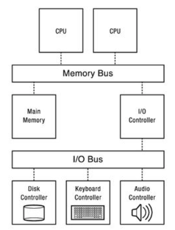

- CPU 需要和不同的外部设备进行通信，IO 映射主要解决的是CPU如何和外部设备通信的问题
	- 
- CPU访问IO设备的两种方式
	- MMIO
	  id:: 6386e262-950e-47d4-8264-293efd048109
		- Memory mapped I/O，内存映射IO，^^内存和IO设备共享同一个地址空间^^，当CPU访问某个内存地址时，它可能是物理内存，也可能是某个I/O设备的内存，访问内存的CPU指令也可以用来访问IO设备，每个IO设备监听CPU的地址总线，一旦CPU访问分配给它的地址，它就做出响应，将数据总线连接到需要访问的设备硬件寄存器。问了容纳I/O设备，CPU必须预留给I/O设备一个地址区域，该地址不能被物理内存占用。
		- 
		- MMIO的软件实现
			- 内核中通过`ioremap()`将IO设备的物理内存地址映射到内核空间的虚拟地址
			- 用户空间程序使用`mmap`系统调用将IO设备的物理内存地址映射到用户空间的虚拟内存地址
	- PMIO
	  id:: 6386e270-db56-444d-95e1-947f2404d285
		- Port mapped I/O，端口映射IO，^^内存和IO设备有各自的地址空间^^，端口映射I/O通常使用一种特殊的CPU指令，专门执行I/O操作。为了实现I/O设备地址空间与内存地址空间的隔离，需要在CPU物理接口上增加一个I/O引脚，或者增加一条专用的I/O总线。
		- 
-
-
- 参考文档
	- [Memory-mapped IO vs Port-mapped IO](https://www.bogotobogo.com/Embedded/memory_mapped_io_vs_port_mapped_isolated_io.php)