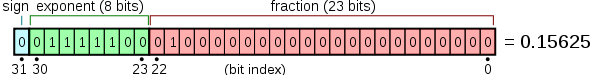
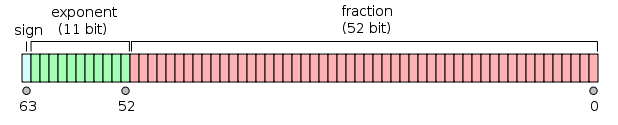

- 创建变量
    ```go
    1. 一行声明一个变量
    var name string = "Go编程时光"

    2. 多个变量一起声明
    var (
        name string
        age int
        gender string
    )

    3. 声明和初始化一个变量(推导声明写法或者短类型声明法：编译器会自动根据右值类型推断出左值的对应类型)
    name := "Go编程时光"
    等价于
    var name string = "Go编程时光"
    等价于
    var name = "Go编程时光"
    限制:这种方法只能用于函数内部

    4. 声明和初始化多个变量
    name, age := "wangbm", 28

    5. new 函数声明一个指针变量
    ptr := new(int)
    new 函数，是 Go 里的一个内建函数,使用表达式 new(Type) 将创建一个Type类型的匿名变量，初始化为Type类型的零值，然后返回变量地址，返回的指针类型为*Type
    ptr: 变量地址
    *ptr: 变量值

    new函数类似是一种语法糖，而不是一个新的基础概念
    func newInt() *int {
        return new(int)
    }
    等价于
    func newInt() *int {
        var dummy int
        return &dummy
    }

    变量/常量都只能声明一次，声明多次，编译就会报错,但是有一个例外，"匿名变量"，也称作占位符，或者空白标识符，用下划线表示
    匿名变量的优点
        1.不分配内存，不占用内存空间
        2.不需要你为命名无用的变量名而纠结
        3.多次声明不会有任何问题
    ```
- 数据类型
    - 整型
        - 无符号
            ```go
            uint
            uint8
            uint16
            uint32
            uint64
            ```
        - 有符号
            ```go
            int
            int8
            int16
            int32
            int64
            ```
        - 不同进制的表示
            ```go
            var num10 int = 10
            var num2 int = 0b1100 (0B1100)
            var num8 int = 0o14 (0O14)
            var num16 int = 0xC
            ```
    - 浮点型
        - float32

            
        - float 64

            
    - byte 与 rune
        > byte 和 uint8 没有区别，rune 和 int32 没有区别, byte 和 rune 类型的目的是：uint8 和 int32 ，直观上让人以为这是一个数值，但是实际上，它也可以表示一个字符，所以为了消除这种直观错觉，就诞生了 byte 和 rune 这两个别名类型
        - byte
            - byte，占用1个节字，就 8 个比特位, 和 uint8 类型本质上没有区别，它表示的是 ACSII 表中的一个字符
        - rune
            - rune，占用4个字节，共32位比特位，所以它和 int32 本质上也没有区别。它表示的是一个 Unicode字符（Unicode是一个可以表示世界范围内的绝大部分字符的编码规范）
        - Go 中单引号与 双引号并不是等价的
            > 单引号用来表示字符, 使用双引号就意味着你要定义一个字符串
    - 字符串
        ```go
        var mystr1 string = "hello"
        等价于
        var mystr2 [5]byte = [5]byte{104, 101, 108, 108, 111}
        字符串的表示方法，除了双引号之外，还可以使用反引号进行表示，即
        var mystr1 string = "\\r\\n"    (解释型表示法)
        等价于
        var mystr2 string = `\r\n`      (原生型表示法)

        原生型表示法 转换为 解释型表示法
        var mystr1 string = `\r\n`
        fmt.Printf(`\r\n`)
        fmt.Printf("的解释型字符串是: %q", mystr1)

        同时反引号可以不写换行符来表示一个多行的字符串
        var mystr string = `你好呀！
        这是一个多行的字符串`
        fmt.Println(mystr)
        输出为:
        你好呀!
        这是一个多行的字符串
        ```
    - 数组与切片
        - 数组
            > 数组是一个由固定长度的特定类型元素组成的序列，一个数组可以由零个或多个元素组成
            ```go
            # 数组的声明与赋值
            var arr [3]int
            arr[0] = 1
            arr[1] = 2
            arr[2] = 3

            var arr [3]int = [3]int{1, 2, 3}

            arr := [3]int{1, 2, 3}

            arr := [...]int{1, 2, 3}
            为了避免硬编码，使用...让Go语言根据时间情况来分配内存

            [3]int 和 [4]int 是不同的类型，使用fmt的 %T 可以检查具体的类型
            arr1 := [...]int{1, 2, 3}
            arr2 := [...]int{1, 2, 3, 4}
            fmt.Printf("%d 的类型是: %T\n", arr1, arr1)
            fmt.Printf("%d 的类型是: %T\n", arr2, arr2)

            别名类型
            type arr3 [3]int
            myarr := arr3{1, 2, 3}

            定义数组的简化写法
            arr := [4]int{2:3}
            [4]int{2:3}， 4表示数组有4个元素，2:3表示数组索引为2的值为3，其他未指定的值为0
            ```
        - 切片
            > 切片也是可以容纳若干相同类型的元素的容器，但是无法通过切片类型来确定其值的长度。切片是对数组的一个连续片段的引用，切片是一个引用类型，终止索引标识的项不包括在切片内(左闭右开区间). 数组的容器大小固定，而切片可以通过append进行元素的添加
            ```go
            切片的类型
            myarr := [...]int{1, 2, 3}
            fmt.Printf("%d 的类型是: %T\n", myarr[0:2], myarr[0:2])
            输出为:
            [1 2] 的类型是: []int

            切片的构造:
            #1
            myarr := [5]int{1, 2, 3, 4, 5}
            切片方式1
            myslice1 := myarr[1:3]
            切片方式2
            myslice2 := myarr[1:3:4]
            切片方式2中的第3个数决定了切片的终止索引只会到原数组的该索引值，即切片的第3个值只影响切片的容量，不影响切片的长度

            myarr := [5]int{1, 2, 3, 4, 5}
            fmt.Printf("myarr 的长度为: %d, 容量为: %d\n", len(myarr), cap(myarr))
            
            myslice1 := myarr[1:3]
            fmt.Printf("myslice1 的长度为: %d, 容量为: %d\n", len(myslice1), cap(myslice1))

            myslice2 := myarr[1:3:4]
            fmt.Printf("myslice2 的长度为: %d, 容量为: %d\n", len(myslice2), cap(myslice2))

            #2
            // 声明字符串切片
            var strList []string
            // 声明整型切片
            var numList []int
            // 声明一个孔切片
            var numListEmpty = []int{}

            #3
            使用 make([]Type, size, cap) 构造切片
            slice1 := make([]int , 2)
            slice2 := make([]int , 2, 10)

            fmt.Println(slice1, slice2)
            fmt.Println(len(slice1), cap(slice1))
            fmt.Println(len(slice2), cap(slice2))

            #4
            myslice := []int{4:2}
            fmt.Println(myslice)
            fmt.Println(len(myslice), cap(myslice))

            myslice := []int{1}
            // 追加一个元素
            myslice = append(myslice, 2)
            // 追加多个元素
            myslice = append(myslice, 3, 4)
            // 追加一个切片
            myslice = append(myslice, []int{7, 8}...)
            // 在第一个位置插入元素
            myslice = append([]int{0}, myslice...)
            // 在中间插入一个切片
            myslice = append(myslice[:5], append([]int{5, 6}, myslice[5:]...)...)
            ```
            - [How Slices Work in Go](https://blog.devgenius.io/how-slices-work-in-go-fbc772514001)
            - [Go Slices: usage and internals](https://go.dev/blog/slices-intro)
            - [Go Slices Demystified](https://reese.dev/go-slices-demystified/)
            - [What you should know about Go slices](https://developer20.com/what-you-should-know-about-go-slices/)
    - 字典
        > 字典是由若干个 key:value 这样的键值对映射组合在一起的数据结构, 它是哈希表的一个实现，这就要求它的每个映射里的key，都是唯一的, 换句话说就是key必须是可哈希的(一个不可变对象，都可以用一个哈希值来唯一表示，这样的不可变对象，比如字符串类型的对象（可以说除了切片、 字典，函数之外的其他内建类型都算）)
        ```go
        #声明并初始化字典
        // 方法1
        var scores map[string]int = map[string]int{"english": 80, "chinese": 85}
        // 方法2
        scores := map[string]int{"english": 80, "chinese": 85}
        // 方法3
        scores := make(map[string]int)
        scores["english"] = 80
        scores["chinese"] = 85

        #字典的操作
        // 添加元素
        scores["math"] = 95
        // 更新
        scores["math"] = 100
        // 读取
        fmt.Println(scores["math"])
        // 注意：当访问一个不存在的key时，并不会直接报错，而是会返回这个value的零值
        // 删除
        delete(scores, "math")
        // 当key不存在，会返回value-type的零值 ，所以你不能通过返回的结果是否是零值来判断对应的 key 是否存在，因为 key 对应的 value 值可能恰好就是零值
        // 判断key是否存在 (字典的下标读取可以返回两个值，使用第二个返回值都表示对应的 key 是否存在)
        math, ok := scores["math"]
        if ok {
            fmt.Printf("math 的值是: %d\n", math)
        } else {
            fmt.Println("math 不存在")
        }
        代码可以优化为
        if match, ok := scores["math"]; ok {
            fmt.Printf("math 的值是: %d\n", math)
        } else {
            fmt.Println("math 不存在")

        }
        
        #字典的循环
        // 获取 key 和 value
        for subject, score := range scores {
            fmt.Printf("key: %s, value: %d\n", subject, score)
        }
        // 只获取key
        for subject := range scores {
            fmt.Printf("key: %s\n", subject)
        }
        // 只获取value
        for _, score := range scores {
            fmt.Printf("value: %d\n", score)
        }
        ```
    - 布尔类型
        > 在 Go 中，真值用 true 表示，不但不与 1 相等，并且更加严格，不同类型无法进行比较，而假值用 false 表示，同样与 0 无法比较
        ```go
        # bool 与 int 不能直接转换，如果要转换，需要你自己实现函数
        func bool2int(b bool) int {
            if b {
                return 1
            }
            return 0
        }

        func int2bool(i int) bool {
            return i != 0
        }

        // Go中使用 ! 对逻辑值取反
        var male bool = true
        fmr.Println(!male == false)
        或者
        fmr.Println(male != false)

        // Go中使用 && 和 || 进行逻辑运算，且具有短路行为
        fmt.Println(age > 18 && gender == "male")
        fmt.Println(age < 18 || gender == "male")
        ```
    - 指针
        > 出于某些需要，我们会将某个变量的内存地址赋值给另一个变量，而这个变量我们称为指针，即指针变量的值是指针，也就是内存地址
        ```go
        # 指针的创建
        // 1
        aint := 1
        ptr := &aint

        // 2
        astr := new(string)
        *astr = "hello"

        // 3
        aint := 1
        var bint *int
        bint = &aint

        // 打印指针的内存地址
        // 1
        fmt.Printf("%p", ptr)
        fmt.Println(ptr)

        # 指针的类型
        astr := "hello"
        aint := 1
        abool := false
        arune := 'a'
        afloat := 1.2

        fmt.Printf("astr pointer type: %T\n", &astr)
        fmt.Printf("aint pointer type: %T\n", &aint)
        fmt.Printf("abool pointer type: %T\n", &abool)
        fmt.Printf("arune pointer type: %T\n", &arune)
        fmt.Printf("afloat pointer type: %T\n", &afloat)

        # 指针的零值
        // 指针声明后，没有进行初始化，其零值是 nil
        var b *int
        fmt.Println(b) // 输出为<nil>

        # 指针与切片
        // 切片与指针一样，都是引用类型
        // 通过一个函数改变一个数组的值的两种方法
        1.将这个数组的切片做为参数传给函数 （推荐做法，写出的代码更简洁，易读）
        2.将这个数组的指针做为参数传给函数
        // 数组的切片作为参数
        func modify(sls []int) {
            sls[0] = 90
        }

        a := [3]int{89, 90, 91}
        modify(a[:])
        fmt.Println(a)

        // 数组的指针作为参数
        func modify(arr *[3]int) {
            (*arr)[0] = 90
        }

        a := [3]int{89, 90, 91}
        modify(&a)
        fmt.Println(a)
        ```
- 流程控制
    ```go
    # if (Go编译器，对于 { 和 } 的位置有严格的要求，它要求 else if （或 else）和 两边的花括号，必须在同一行)
    if condition1 {
        branch1
    } else if condition2 {
        branch2
    } else if ... {
        branchN
    } else {
        branchElse
    }
    // 简化写法
    if age := 20; age > 18 {
        fmt.Println("成年了")
    }

    # switch
    switch expression {
        case exp1:
            branch1
        case exp2:
            branch2
        ...
        default:
            branchElse;
    }
    // 只要有一个 case 满足条件，就会执行对应的代码块，然后直接退出 switch - case ，如果 一个都没有满足，才会执行 default 的代码块

    // 一个case 多个条件
    month := 2
    switch month {
        case 3, 4, 5:
            fmt.Println("春天")
        case 6, 7, 8:
            fmt.Println("夏天")
        case 9, 10, 11:
            fmt.Println("秋天")
        case 23, 1, 2:
            fmt.Println("冬天")
        default:
            fmt.Println("输入有误...")
    }
    // 注意：case 条件常量不能重复
    // switch 后可以接函数
    func getResult(args ...int) bool {
        for _, i := range args {
            if i < 60 {
                return false
            }
            return true
        }
    }

    chinese := 80
    english := 50
    math := 100

    switch getResult(chinese, english, math) {
        case true:
            fmt.Println("所有成绩都及格")
        case false:
            fmt.Println("有挂科记录")
    }
    // switch 后可以不接任何变量，表达式，函数，此时 switch-case 相当于 if-elseif-else
    score := 30

    switch {
        case score >= 95 && score <= 100:
            fmt.Println("优秀")
        case score >= 80:
            fmt.Println("良好")
        case score >= 60:
            fmt.Println("合格")
        case score >= 0:
            fmt.Println("不合格")
        default:
            fmt.Println("输入有误...")
    }

    # case 中 fallthrough 关键字的使用
    s := "hello"

    switch {
        case s == "hello":
            fmt.Println("hello")
            fallthrough
        case s != "world":
            fmt.println("world")
    }
    // 注意：fallthrough 只能穿透一层，意思是它让你直接执行下一个case的语句，而且不需要判断条件

    # for
    // 语法
    for [condition |  ( init; condition; increment ) | Range]
    {
    statement(s);
    }

    // 接1个条件表达式
    a := 1
    for a <= 5 {
        fmt.Println(a)
        a++
    }

    // 接3个条件表达式
    for i := 1; i <= 5; i++ {
        fmt.Println(i)
    }

    // 不接表达式，无限循环
    for {
        ...
    }
    等价于
    for ;; {

    }

    // 示例
    var i := 1
    for {
        if i > 5 {
            break
        }
        fmt.Printf("hello, %d\n", i)
        i++
    }

    // 遍历可迭代对象， range 后可接数组、切片，字符串等， range 会返回两个值：索引和数据
    myarr := [...]string{"world", "python", "go"}
    for _, item := range myarr {
        fmt.Printf("hello, %s\n", item)
    }

    for i := range myarr {
        fmt.Printf("hello, %v\n", i)
    }

    # goto 无条件跳转
    // goto 语句通常与条件语句配合使用。可用来实现条件转移， 构成循环，跳出循环体等功能
    // 1
        i := 1
    flag:
        if i <= 5 {
            fmt.Println(i)
            i++
            goto flag
        }
    // 使用goto实现break的效果
        i := 1
        for {
            if i > 5 {
                goto flag
            }
            fmt.Println(i)
            i++
        }
    flag:

    // 使用 goto 实现continue的效果
        i := 1
    flag:
        for i <= 10 {
            if i%2 == 1 {
                i++
                goto flag
            }
            fmt.Println(i)
            i++
        }
    // 注意：goto语句与标签之间不能有变量声明，否则编译错误

    # defer延迟语句
    // defer xxx() 表示将xxx函数的调用延迟到当前函数执行完后再执行
    func myfunc() {
        fmt.Println("B")
    }

    func main() {
        defer myfunc()
        fmt.Println("A")
    }

    // 使用 defer 只是延时调用函数，此时传递给函数里的变量，不应该受到后续程序的影响
    name := "go"
    defer fmt.Println(name) // 输出 go

    name = "python"
    defer fmt.Println(name) // 输出 python

    // 如果 defer 后面跟的是匿名函数，情况会有所不同， defer 会取到最后的变量值
    func main() {
        name := "go"
        defer func() {
            fmt.Println(name)   // 输出 python
        }()
            name = "python"
            fmt.Println(name) // 输出 python
    }

    # 多个defer反序调用
    name := "go"
    defer fmt.Println(name) // 输出: go

    name = "python"
    defer fmt.Println(name) // 输出: python

    name = "java"
    fmt.Println(name)
    输出：
    java
    python
    go
    //  多个defer 是反序调用的，有点类似栈一样，后进先出

    # defer 与 return 孰先孰后
    var name string = "go"

    func myfunc() string {
        defer func() {
            name = "python"
        }()

        fmt.Printf("myfunc 函数里的name：%s\n", name)
        return name
    }

    func main() {
        myname := myfunc()
        fmt.Printf("main 函数里的name: %s\n", name)
        fmt.Println("main 函数里的myname: ", myname)
    }
    输出：
    myfunc 函数里的name：go
    main 函数里的name: python
    main 函数里的myname:  go
    // defer 是return 后才调用的, 在执行 defer 前，myname 已经被赋值成 go 了

    # 为什么要有 defer
    // 但是当一个函数里有多个 return 时，你得多调用好多次这个函数，代码就臃肿起来了
    func f() {
        r := getResource()  //0，获取资源
        ......
        if ... {
            r.release()  //1，释放资源
            return
        }
        ......
        if ... {
            r.release()  //2，释放资源
            return
        }
        ......
        if ... {
            r.release()  //3，释放资源
            return
        }
        ......
        r.release()     //4，释放资源
        return
    }

    使用 defer 简化后的代码

    func f() {
        r := getResource()  //0，获取资源

        defer r.release()  //1，释放资源
        ......
        if ... {
            ...
            return
        }
        ......
        if ... {
            ...
            return
        }
        ......
        if ... {
            ...
            return
        }
        ......
        return
    }

    # select-case
    // select-case 用法比较单一，它仅能用于 信道/通道 的相关操作
    ....待补充
    ```