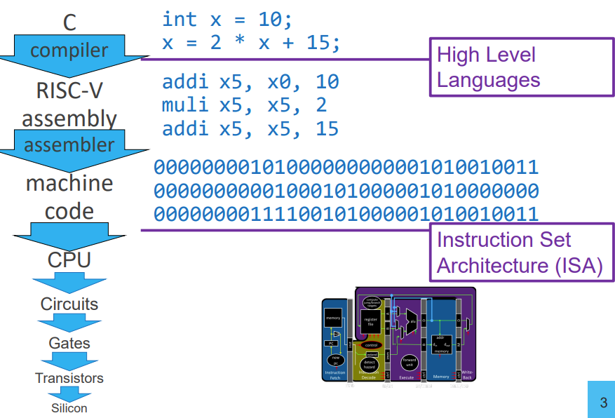
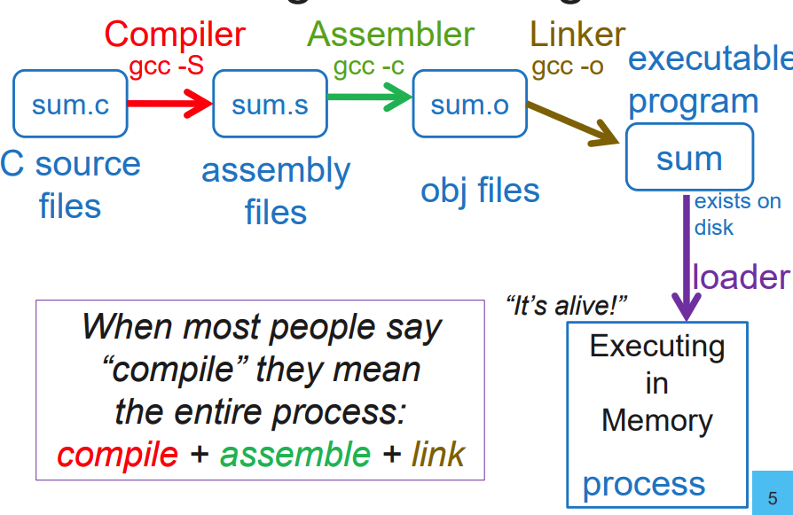
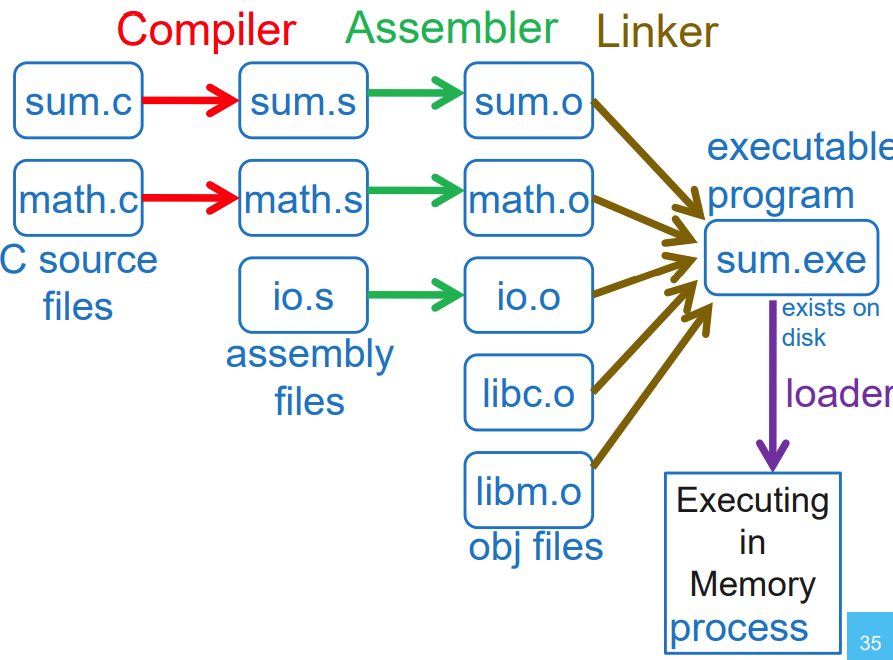

- 程序是如何被执行的
	- 
		-
- 编译器
	- 程序编译过程
		- 
			- 
	- 链接
		- [[静态链接]]
			- 静态库
		- 动态链接
			- 共享库
- 加载器
	- 加载器从磁盘读取可执行文件并加载到内存
		- 初始化寄存器，栈，第一个函数的参数
		- 跳转至程序入口
-
- 各种工具的作用
	- Compiler
		- 链接器产生汇编文件，包括assembly, pseudo-instructions,
		  directives, etc.
	- Assembler
		- 汇编器产生对象文件，包括machine code, missing symbols,
		  some layout information, etc.
	- Linker
		- 链接器链接多个对象文件，生成一个可执行文件
	- Loader
		- 加载器负责将程序载入内存，并跳转到程序入口
-
- 参考文档
	- [Linkers & Loaders](https://www.wh0rd.org/books/linkers-and-loaders/linkers_and_loaders.pdf)
	- [How statically linked programs run on Linux](https://eli.thegreenplace.net/2012/08/13/how-statically-linked-programs-run-on-linux)
	- [Load-time relocation of shared libraries](https://eli.thegreenplace.net/2011/08/25/load-time-relocation-of-shared-libraries)
	- [Position Independent Code (PIC) in shared libraries](https://eli.thegreenplace.net/2011/11/03/position-independent-code-pic-in-shared-libraries)
	- [Position Independent Code (PIC) in shared libraries on x64](https://eli.thegreenplace.net/2011/11/11/position-independent-code-pic-in-shared-libraries-on-x64)
	- [Library order in static linking](https://eli.thegreenplace.net/2013/07/09/library-order-in-static-linking)
	- [计算机系统篇之链接](https://csstormq.github.io/)
	- [The GNU linker](https://www.eecs.umich.edu/courses/eecs373/readings/Linker.pdf)
	- [linker Command Language](https://ftp.gnu.org/old-gnu/Manuals/ld-2.9.1/html_chapter/ld_toc.html#TOC5)
	- [Mastering the GNU linker script](https://allthingsembedded.com/post/2020-04-11-mastering-the-gnu-linker-script/)
	- [Linker Scripts](https://home.cs.colorado.edu/~main/cs1300/doc/gnu/ld_toc.html#TOC5)
	- [Linker scripts](https://users.informatik.haw-hamburg.de/~krabat/FH-Labor/gnupro/5_GNUPro_Utilities/c_Using_LD/ldLinker_scripts.html)
	- [An Introduction to the GNU Compiler and Linker](https://gcc.gnu.org/wiki/Building_Cross_Toolchains_with_gcc?action=AttachFile&do=get&target=billgatliff-toolchains.pdf)