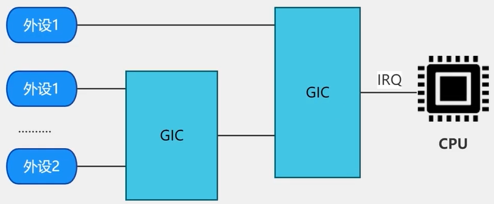
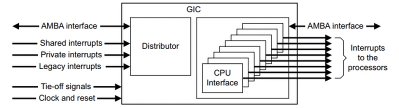

- 中断相关的概念
	- 中断信号
	- 中断响应
	- 保护现场
	- 中断处理
	- 恢复现场
	- 中断返回
	- 中断屏蔽
	- 中断上下文
		- 中断上文
			- 处理尽可能少且比较紧急的内容
		- 中断下文
			- 处理相对比较耗时的内容
- 中断子系统
	- 中断控制器
	  collapsed:: true
		- 
	- 中断号相关的概念
	  collapsed:: true
		- IRQ number
			- 软中断号，在linux系统中唯一的，软件编程时用到的是软中断号
		- HW interrupt ID
			- 中断控制器需要对外设中断进行编号，中断控制器使用HW interrupt ID 来标识外设中断，是硬件中断号
		- IRQ domain
			- 负责实现硬件中断号与软件中断号的映射（linux作为一个支持多架构多cpu的通用软件，软件中断号是唯一的，但是不同开发板的硬件中断号编号可能不相同，因此需要通过IRQ domain实现硬件中断号到软件中断号的映射，具体的映射有原厂的工程师来完成）
	- 中断源的类型
	  collapsed:: true
		- SGI
			- Software Generated Interrupt，软件中断，中断号0 - 15，用于不同core之间的通信
		- PPI
			- Private Peripheral Interrupt，私有中断，属于每个core的私有中断，中断号16 - 31
		- SPI
			- Shared Peripheral Interrupt，共享中断，用于外设触发中断，中断号32 - 1020
		- LPI
			- Local-special Peripheral Interrupt
	- GIC中断控制器
	  collapsed:: true
		- GICv1
		- GICv2
		- GICv3
		- GICv4
		- 例PL390
			- 
			- [PL390 Technical Reference Manual](https://documentation-service.arm.com/static/5e8e1d3588295d1e18d3635c)
		- 例GIC400
	- 申请中断
	  collapsed:: true
		- ```c
		  request_irq(unsigned int irq, irq_handler_t handler, unsigned long flags,
		  	    const char *name, void *dev);
		  extern void free_irq(unsigned int, void *);
		  
		  request_irq
		  	request_threaded_irq
		  
		  int request_threaded_irq(unsigned int irq, irq_handler_t handler,
		  			 irq_handler_t thread_fn, unsigned long irqflags,
		  			 const char *devname, void *dev_id)
		  {
		  	struct irqaction *action;	//struct irqaction - per interrupt action descriptor
		  	struct irq_desc *desc;		//struct irq_desc - interrupt descriptor，用来描述外设中断
		  	int retval;
		      ......
		  
		  struct irq_desc {
		  	struct irq_data		irq_data;
		  	......
		      // 多个外设共享同一个硬件中断时，action链表记录了多个外设的中断处理函数，中断发生时
		      // 链表上的所有所有中断函数都会被执行，由具体的中断函数来判断是否真的产生中断
		  	struct irqaction	*action;	/* IRQ action list */
		  	......
		        
		  //静态管理中断描述符（每个外设的中断都需要一个中断描述符来描述）      
		  struct irq_desc irq_desc[NR_IRQS] __cacheline_aligned_in_smp = {
		  	[0 ... NR_IRQS-1] = {
		  		.handle_irq	= handle_bad_irq,
		  		.depth		= 1,
		  		.lock		= __RAW_SPIN_LOCK_UNLOCKED(irq_desc->lock),
		  	}
		  };
		  //动态管理
		  通过radix tree的方式来管理
		  
		  当发生中断时，可以根据中断号找到对应的中断描述符，进而执行相应的操作
		  具体通过静态还是动态的方式来管理，是通过配置CONFIG_SPARSE_IRQ宏来控制的
		  ```
	- 中断下半部
		- tasklet
			- 是一种特殊的软中断，tasklet绑定的函数同一时间只能在一个cpu上运行，tasklet绑定的函数不能调用任何可能引起休眠的函数，否则会引起内核异常
			- ```c
			  struct tasklet_struct
			  {
			  	struct tasklet_struct *next;
			  	unsigned long state;
			  	atomic_t count;
			  	void (*func)(unsigned long);
			  	unsigned long data;
			  };
			  
			  #define DECLARE_TASKLET(name, func, data) \
			  struct tasklet_struct name = { NULL, 0, ATOMIC_INIT(0), func, data }
			  
			  #define DECLARE_TASKLET_DISABLED(name, func, data) \
			  struct tasklet_struct name = { NULL, 0, ATOMIC_INIT(1), func, data }
			  
			  extern void tasklet_init(struct tasklet_struct *t,
			  			 void (*func)(unsigned long), unsigned long data);
			  static inline void tasklet_disable(struct tasklet_struct *t);
			  static inline void tasklet_enable(struct tasklet_struct *t);
			  
			  extern void __tasklet_schedule(struct tasklet_struct *t);
			  extern void tasklet_kill(struct tasklet_struct *t);
			  ```
		- 软中断
			- 实现中断下半部的方法之一，软中断中断号资源优先，一般用在网络设备驱动和块设备驱动中
			- ```
			  #现有的软中断
			  enum
			  {
			  	HI_SOFTIRQ=0,
			  	TIMER_SOFTIRQ,
			  	NET_TX_SOFTIRQ,
			  	NET_RX_SOFTIRQ,
			  	BLOCK_SOFTIRQ,
			  	BLOCK_IOPOLL_SOFTIRQ,
			  	TASKLET_SOFTIRQ,
			  	SCHED_SOFTIRQ,
			  	HRTIMER_SOFTIRQ,
			  	RCU_SOFTIRQ,    /* Preferable RCU should always be the last softirq */
			  
			  	NR_SOFTIRQS
			  };
			  
			  #初始化
			  extern void open_softirq(int nr, void (*action)(struct softirq_action *));
			  #打开
			  extern void raise_softirq(unsigned int nr);
			  #关闭
			  extern void raise_softirq_irqoff(unsigned int nr);
			  ```